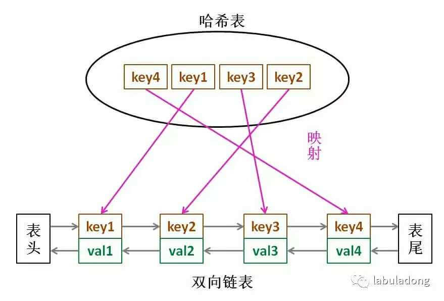

# LRU 缓存算法

## 1. 参考资料

1. [leetcode - 146-题解-labuladong](https://leetcode-cn.com/problems/lru-cache/solution/lru-ce-lue-xiang-jie-he-shi-xian-by-labuladong/)

2. [详解leetcode146题【LRU (最近最少使用) 缓存机制】(附js最优解法！)](https://blog.csdn.net/weixin_33827590/article/details/87983684)

## 2. LRU 的基本说明

1. 下面的内容来自 [leetcode - 146-题解-labuladong](https://leetcode-cn.com/problems/lru-cache/solution/lru-ce-lue-xiang-jie-he-shi-xian-by-labuladong/)
   > 计算机的缓存容量有限，如果缓存满了就要删除一些内容，给新内容腾位置。但问题是，删除哪些内容呢？我们肯定希望删掉哪些没什么用的缓存，而把有用的数据继续留在缓存里，方便之后继续使用。那么，什么样的数据，我们判定为「有用的」的数据呢？
   >
   > LRU 缓存淘汰算法就是一种常用策略。LRU 的全称是 Least Recently Used，也就是说我们认为最近使用过的数据应该是是「有用的」，很久都没用过的数据应该是无用的，内存满了就优先删那些很久没用过的数据。
   > 

2. LRU 即是一种缓存策略，也是一种数据结构。我们可以将其想象成一个是一个队列，被访问过的、新添加的，我们就认为是越有可能被使用，所以其在队列中的位置就越靠前。而从来没有被访问过的或者是长时间没有被访问的数据，我们认为是有可能不会被使用，那么这样的数据在队列中的位置是越靠后的。

## 3. LRU 算法描述

1. 设计一个数据结构。

2. 指定一个 capacity 参数，这个参数作为缓存的最大容量。

3. 然后实现两个 API，一个是 put(key, val) 方法存入键值对，另一个是 get(key) 方法获取 key 对应的 val，如果 key 不存在则返回 -1。

4. get 和 put 操作都必须是 O(1) 的时间复杂度。

5. 举个例子，看看 LRU 算法的具体工作过程：
   ```
      1. const lru = new Lru(2);
         实例化 LRU，并指定其容量大小
         我们可以把 lru 理解为一个队列，假设左边是对头，右边是队尾
         最近使用的放在队头，最久没有使用的放在队尾
      2. lru.put(1, 1)
         lru = [{1: 1}]
      3. lru.put(2, 2)
         lru = [{2: 2}, {1: 1}]
      4. lru.get(1)  -> 1
         lru = [{1: 1}, {2: 2}]
         因为最近访问了 key 为 1 的这个数据，那么将这个数据提前到队头，并返回与 key 对应的 value 1
      5. lru.put(3, 3)
         lru = [{3: 3}, {1: 1}]
         因为当前 lru 的容量已经满了，所以要删除最久没有使用的数据，而队尾则是最久没有使用的数据，所以删除 {2, 2}，然后将新的数据放到队头
      6. lru.get(2) -> -1
         lru 中没有 key 为 2 的数据，所以返回 -1
      7. lru.put(1, 4)
         lru = [{1, 4}, {2, 2}]
         lru 里面已经有 key 为 1 的数据了，那么此时需要更新这个数据，然后将这个数据移动到队列的最前面
   ```

6. 通过上面的使用案例，我们得到 LRU 具备以下几个特点：
   1. 存储的数据是 key-value
   2. 数据是有时序的，也就是能按照一定的顺序存储和访问，这样我们能根据位置区分哪些数据是最久没有访问过的，从而进行删除
   3. 能够在 O(1) 的时间内根据 key 找到某个 value
   4. 每次根据 key 访问完数据以后，能将这个数据变成最近使用的，换句话说，就是能快速改变数据的位置

7. map 能存储 key-value 形式的数据，同时支持 O(1) 的时间访问，但是 Map 存储的数据是无序的。

8. 那么可以使用数组吗，这里不行，虽然数组可以模拟队列，决定数据的位置，但是给数据移动位置是 O(n) 的操作，而 get 和 put 操作避免不了移动数据，而 get 和 put 的操作要求是 O(1) 的 所以，使用数组的时间复杂度太高

9. 那么有没有办法，既能存储 key-value，同时使得数据又是有序的呢，有两种方式：
   - map + map.keys()
   - map + 双向链表

## 4. map + map.keys()

1. map 可以存储 key-value 形式的数据，这些数据是无序的，而 map.keys() 得到的 key 却是有序的。

2. keys() 方法返回一个引用的 Iterator 对象。它包含按照顺序插入 Map 对象中每个元素的 key 值。

3. 也就是说，keys() 方法得到的 Iterator 对象，其包含的 key 值是有序的，那么一组 key-value 插入 map 的顺序越靠后，其 key 在 Iterator 中的顺序就越靠后。

4. 每向 map 中插入一条数据（调用 set() 方法），其 key 越靠后，因此我们就可以将越靠后的 key 定义为最近使用，越靠前的 key，定义为最久不用。

5. 我们在进行 get 和 put 操作的时候，也进行 map 的删除和插入操作，从而改变 key 的顺序，实现最近使用和最久不使用的效果。

6. 对于 get 操作，可以这样定义：
    1. 根据 key 从 map 中取出 value。
    2. 如果 value 存在，那么根据 key，在 map 中删除这条数据，然后再调用 set 方法，将 这个 key 和 value 重新插入到 map 中。
       - 这样做的目的是，保证这个 key 在 Iterator 中是最靠后的，从而是最近使用的
       - 为什么要提前删除呢，因为不删除的话，直接进行 set 操作，那么 key 的顺序不变，而 value 会被覆盖，所以要先删除，后插入。

7. 对于 put 操作，可以这样定义：
    1. 根据 key 判断 map 中有没有这个条数据，如果有，就将其删除。
    2. 调用 set 方法，将这个数据添加进去，这样保证了最新添加的数据的 key 在 Iterator 中是最靠后的，保证是最近使用的。
    3. 调用 keys 方法，获得 Iterator 对象。
    4. 通过 map 的 size 属性获得 map 的大小，如果 size 大于 lru 设置的大小，那么我们就开始进行遍历，调用 Iterator 对象的 next 方法，拿到 key，根据 key 删除 map 中的相应的数据，直到 size 和 lru 的大小一致。
       - Iterator 对象中的 key 是有顺序的，我们可以通过 next 方法，从前到后，遍历这个 Iterator 对象，按照先后顺序拿到 key
       - 那么最先遍历到的 key，一定是最早放入 map 的，而 最后遍历到的 key，一定是最后放进 map 的，这样就区分了最近使用和最久未使用
       - 遍历过程中，我们调用 Iterator 对象的 next 方法，next 就像一个指针，我们每调用一次，其就向下移动一位，指向下一个元素
       - 当 size 大于 lru 的容量的时候，我们就调用 next 方法，得到 key，然后根据 key 删除这条数据，此时 map 的 size 减一，直到 size 等于 lru 的容量，遍历结束
       - 这样调用 next 拿到的 key，一定是最先加入 map 的，所以删除的数据也是最先插入 map 的，所以，就删除了最久没有使用的数据
8. 总结：
   1. map.keys() 拿到的 Iterator 对象中包含的 key 是有序的，顺序是插入 map 的顺序。
   2. 越早插入的元素，其 key 在 Iterator 越靠前（最先遍历到），而越晚插入的元素，其 key 在 Iterator 中就越靠后（最后遍历到）。
   3. 越早插入的元素，定义未最久未使用，越晚插入的元素定义为最近使用。
   4. 每次 get 操作，先删除，再插入，保证这个 key 是最后插入 map 的，从而在 Iterator 中越靠后。
   5. 每次 put 操作，先删除，再插入，保证这个 key 是最后插入 map 的。
      - 如果 map 的 size 大于 lru 的容量，那么就开始遍历，根据 Keys() 方法得到 Iterator 对象，调用 next 方法，拿到 key 去 map 中删除数据。这样删除的是 Iterator 中最靠前的，也就是最久未使用的。

9. 代码示例：
   ```js
      class MyLRU {
         constructor(capacity) {
             this.capacity = capacity;
             this.map = new Map();
         }

         get(key) {
             let value = this.map.get(key);
             if (typeof value === 'undefined') {
                 return -1;
             }

             this.map.delete(key);
             this.map.set(key, value);

             return value;
         }

          put(key, value) {
              if (this.map.has(key)) {
                  this.map.delete(key);
              }

              this.map.set(key, value);

              let keys = this.map.keys();

        while (this.map.size > this.capacity) {
                  this.map.delete(keys.next().value);
              }
          }
      }
   ```

## 5. map + 双向链表

1. map 可以实现存储 key-value 形式的数据，可以在 O(1) 的时间内查找数据，但是数据没有顺序。

2. 链表有顺序之分，插入删除快，但是查找慢。

3. 可以将 map 和链表结合起来，形成新的数据结构：哈希链表：LinkedHashMap，而哈希链表也是 LRU 算法的核心数据结构。如下图所示：
   
4. 结合的办法如下：
   1. 因为链表查找慢，而 map 查找快，所以，我们将 map 和链表联系起来，即 map 中存储的是 key 和 value，但这个 value 是链表的节点，这样可以通过 map 快速定位到这个节点在链表中的位置。
   2. 每次向链表中插入新节点的位置是尾部，显然越靠近尾部的元素就是最近使用的，越靠近头部的，就是最久未使用的。
   3. 链表的节点需要存储 key 和 value，然后通过 map 中的 key 找到对应的节点，然后从中取出 value。

5. 为什么需要双向链表呢
   1. 某一个节点（元素）被访问以后，我们需要移动这个节点，将其移动到链表的尾部，过程就是先将这个节点从当前位置删除，然后将这个节点添加到尾部，因此，需要删除链表的操作。
   2. 删除链表的操作，不仅需要得到被删除的节点，还需要得到被删除的节点的前一个节点。
   3. 如果是单向链表，我们能通过 map 在 O(1) 的时间内找到这个节点，但是无法获得这个节点的前一个节点。
   4. 因此使用双向链表，得到一个节点就能获得其前后节点。

### 1. 实现节点类 - Node

1. 实现代码：
   ```js
      class Node {
          constructor(key, value) {
              this.key = key;
              this.value = value;
              this.prev = null;
              this.next = null;
          }
      }
   ```

### 2. 实现双向链表 - DoubleLinkedList

1. 实现代码：
   ```js
      class DoubleLinkedList {
          constructor() {
              this.count = 0;
              // 头节点
              this.head = new Node(0, 0);
              // 尾节点，这个节点始终保持在链表的尾部
              this.tail = new Node(0, 0);
              this.head.next = this.tail;
              this.tail.prev = this.head;
          }

         /**
          * 向链表的尾部添加节点
          * @param node
          */
         addLast(node) {
             // 尾节点的前一个节点即最后一个节点的 next 指针指向当前节点
             this.tail.prev.next = node;
             // 当前节点的 prev 指针指向最后一个节点
             node.prev = this.tail.prev;
             // 将尾节点挂在到当前节点后面，使得当前节点变成最后一个节点
             this.tail.prev = node;
             node.next = this.tail;
     
             this.count++;
         }


          /**
           * 移除某个指定的节点
           * @param node
           */
          remove(node) {
              // 移除某个节点的核心，就是使得这个节点的前后节点相连
              node.prev.next = node.next;
              node.next.prev = node.prev;
              this.count--;
          }


         /**
          * 移除并返回第一个节点
          * @returns {null|*|null}
          */
         removeFirst() {
             if (this.head.next === this.head) {
                 // 没有节点，返回 null
                 return null;
             }
     
             let first = this.head.next;
             this.remove(first);
             return first;
         }

          /**
           * 返回链表长度
           * @returns {number}
           */
          size() {
             return this.count;
          }
      }
   ```

### 3. 实现 LRU 缓存

1. LRU 类中，map 总是和链表一起操作，方便起见，封装几个函数，使得我们能同时操作 map 和链表。

2. 有以下几个操作，需要同时操作链表和 map：
   1. 将一个节点变成最近使用的（将其移动到链表的末尾）
   2. 向链表和 map 中添加新的元素（新元素一定是最近使用的）
   3. 根据 key 从链表和 map 中删除数据
   4. 删除最久没有使用的数据（删除链表的第一个节点，在 map 中也要移除）

3. 基本的 LRU 类：
   ```js
      /**
       * @param {number} capacity
       */
        var LRUCache = function(capacity) {
            this.capacity = capacity;

            // map 中存储的 key 是 put 操作输入的 key，但是 value 是一个节点
            // 这个节点的 key 和 value 就是 put 操作得到 key 和 value
            this.map = new Map();
            this.cache = new DoubleLinkedList();
      };
   ```
4. 将一个节点变成最近使用的 - `makeRecently`
   ```js
      LRUCache.prototype.makeRecently = function(key) {
          // 根据 key，拿到这个节点
          let node = this.map.get(key);
          // 将某个节点变成最近使用的，本质上就是将这个节点的位置放到最后
          // 那么基本过程就是先从链表中移除这个节点
          // 然后将这个节点添加到链表的尾部
          this.cache.remove(node);
          this.cache.addLast(node);
      }
   ```
5. 添加最近使用的元素 - `addRecently`
   ```js
      LRUCache.prototype.addRecently = function (key, value) {
         // 将 key 和 value 包装成新的节点
         let node = new Node(key, value);
         // 添加到 map 中，只不过 key 是原来的key，但是 value 是包装后的节点了
         this.map.set(key, node);
         // 将新节点添加到链表的末尾，新节点一定是最近使用的
         this.cache.addLast(node);

      }
   ```
6. 根据 key 删除某个节点 - deleteByKey
   ```js
      LRUCache.prototype.deleteByKey = function (key) {

          // 根据 key 从 map 中得到这个节点
          let node = this.map.get(key);
          // 在链表和 map 中，同时删除这个节点
          this.cache.remove(node);
          this.map.delete(key);
      }
   ```
7. 移除最久没有使用的元素 - removeLeastRecently
   ```js
      LRUCache.prototype.removeLeastRecently = function () {
          // 最久没有使用的显然是最靠近头节点的元素
          // 移除第一个节点，并得到这个节点
          let node = this.cache.removeFirst();
          // 从这个被移除的第一个节点中拿到 key，然后去 map 中删除
          // 这也就解释了为什么 node 中存储的是 key 和 value
          // 因为我们移除最久未使用的节点，不仅需要在链表中移除，还需要在 map 中移除
          // 在 map 中实现移除，需要 key，而这个 key 只能从被移除的节点中获取，所以节点中需要存储 key 和 value
          this.map.delete(node.key);
      }
   ```
### 1. get 方法

#### 1. get 方法的流程

1. 根据 key，先去 map 中拿到节点。

2. 节点如果不存在，返回 -1。

3. 节点存在，拿到节点的 value 属性的值。

4. 将节点变成最近使用 - 调用 makeRecently。

#### 2. get 方法的实现

1. 根据前面的 get 方法的流程，实现 get 方法单位流程如下：
   ```js
      LRUCache.prototype.get = function(key) {
          let node = this.map.get(key);
          if (!node) {
              return -1;
          }

          let value = node.value;
          this.makeRecently(key);

          return value;
      }; 
   ```

### 2. put 方法

#### 1. put 方法的流程

1. 根据 key 判断 map 中是不是有存在对应的节点，如果存在，执行下面的操作：
   - 删除这个 key 对应的节点 - 调用 deleteByKey
   - 将 key 和 value 作为新节点，添加到最近使用的位置 - 调用 addRecently
   - 终止函数执行

2. 如果 map 中不存在这个节点，首先判断链表的长度是不是和 LRU 缓存的容量一样，如果一样，我们不能直接添加数据，而是调用 removeLeastRecently 方法，移除最久未用的节点。给新的数据腾出位置。

3. 调用 addRecently 方法添加新的数据。

#### 1. put 方法的实现

1. 如果 key 存在于 map 中，那么我们需要更新 value，同时将这条数据变成最近使用的，那么比较简洁的方法就是先删除，在添加。因为有删除的操作，所有无论如何，都不会超出 LRU 缓存的容量。

2. 如果 key 不存在于 map 中，那么就需要注意了，因此 key 不存在于 map 中，那么 一定是要将新的数据添加到  LRU 中的，如果 LRU 满了，就需要先删除最久不用的，给新数据腾出空间，如果 LRU 没有满，则可以直接添加。

3. 实现代码：
   ```js
      LRUCache.prototype.put = function(key, value) {
          if (this.map.has(key)) {
              // 如果 map 中已经有了这个 key 对应的数据
              // 那么就先删除，再添加，并将其设置为最近使用
              this.deleteByKey(key);
              this.addRecently(key, value);
              return;
          }

         if (this.capacity === this.cache.size()) {
              // 在没有这个 key 对应的数据的情况下
              // 如果 LRU 容量满了，那么优先删除最久不用的数据
              this.removeLeastRecently();
          }

          // 添加新的数据，并设置位最近使用
          this.addRecently(key, value);
      };
   ```