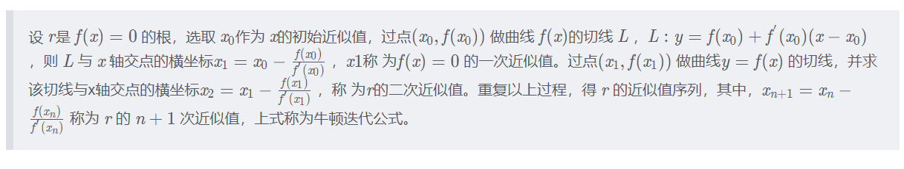

# leetcode-刷题常见技巧-JavaScript

## 1. 如何初始化一个数组

## 2. 快速判断一个数是否是 2 的整次幂（\(2^n\)）

1. 位运算：\(n \& (n - 1) = 0\)

## 3. 快速判断一个整数是奇数还是整数

## 4. 快速求一个数的 n 次幂（\(x^n\)）

1. 快速幂法

## 5. 求一个数的平方根

### 1. 二分查找

### 2. 牛顿迭代法

1. 参考资料
   - [数学笔记9——牛顿迭代法](https://blog.csdn.net/sunbobosun56801/article/details/78088085)
   - [如何通俗易懂地讲解牛顿迭代法求开方？数值分析？](https://www.zhihu.com/question/20690553)

2. 推导
   

3. 如何判断收敛
   - 当 \(x_n\) 与 \(x_{n-1}\) 比较接近的时候，我们可以判定 \(x_n\) 是比较接近 \(f(x) = 0\) 的根 \(x_0\)。
   - 什么是比较接近呢，我们可以设定一个阈值：\(\epsilon\)，当 \(x_n\) 与 \(x_{n-1}\) 的差值小于 \(\epsilon\) 时，就认为 \(x_n\) 是给定的精度范围内的 \(f(x) = 0\) 根。

## 6. 如何快速从 1 - n 中筛选出素数

1. 埃拉托斯特尼筛法

## 7. 如何反转一个整数

1. 字符串反转（仅限于 JavaScript）

2. 求数字的每一位

## 8. 快速求 \(n!\) 中末尾 0 的个数

