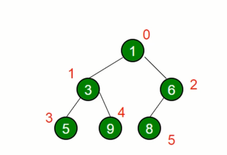

# 数据结构 - 堆

1. 堆是一种特殊的完全二叉树。

2. 根据节点之间的大小，可以分为最大堆和最小堆。

3. 最大堆
   - 所有节点都大于等于它的子节点。
   - 举例：
     ```
                10
              /   \
             8     9
           /  \   /  \ 
          5   6   7   8
         / \   
        3   2
     ```

3. 最小堆
   - 所有节点都小于等于它的子节点。
   - 举例：
     ```
                1
              /   \
             3     4
           /  \   /  \ 
          5   6   7   8
         / \   
        10  11
     ```  

4. 在 js 中使用数组来表示一个堆。将一个堆按照广度优先遍历的顺序给每一个节点编号，从 0 开始，如下图所示：
   
   按照编号将这些元素依次放到一个数组中：[1, 3, 6, 5, 9, 8]

5. 使用数组存放堆中的元素，有一些规律：
   1. 对于一个节点，其左侧子节点的位置是 $2 * index + 1$。
   2. 对于一个节点，其右侧子节点的位置是 $2 * index + 2$。
   3. 任意节点的父节点的位置是 $(index - 1) / 2$，向下取整。

6. 堆的用途
   1. 快速、高效地找出最大值和最小值。
   2. 时间复杂度是 $O(1)$。
   3. 找出第 k 个最大（小）的元素。