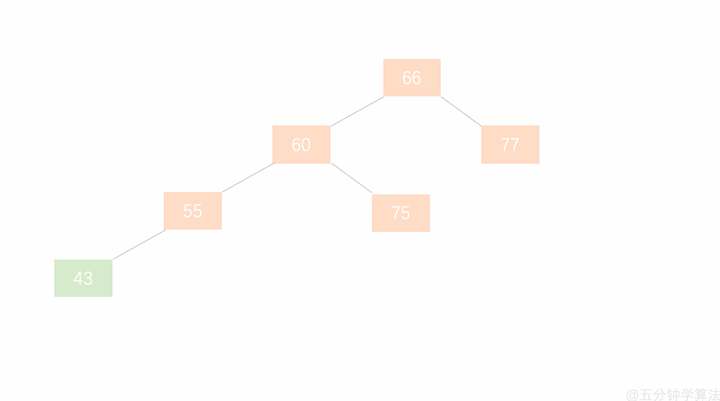
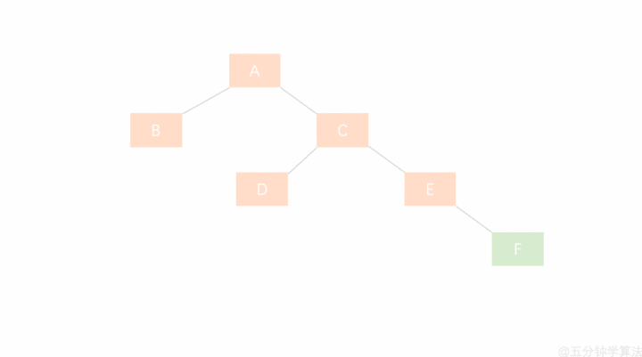
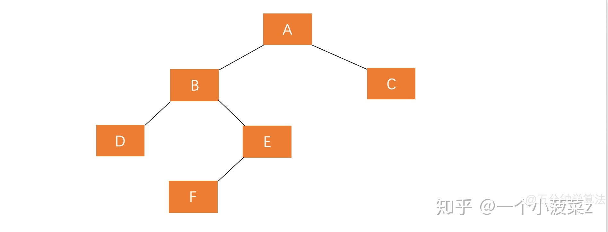
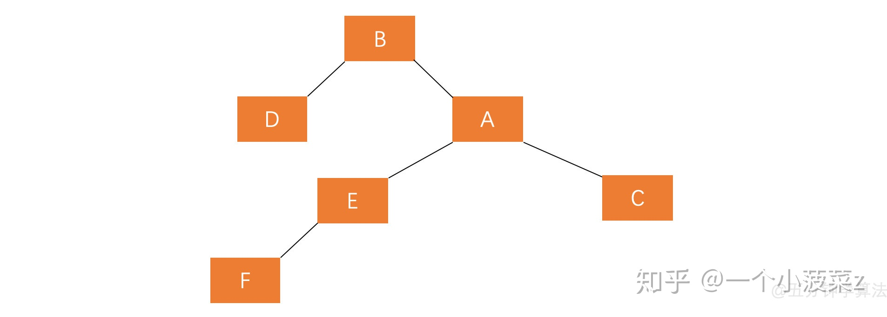
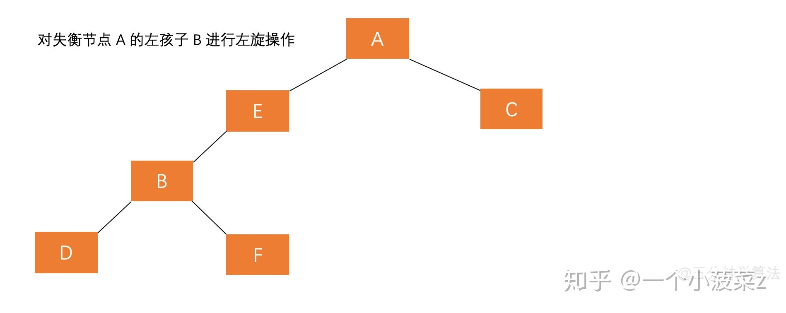
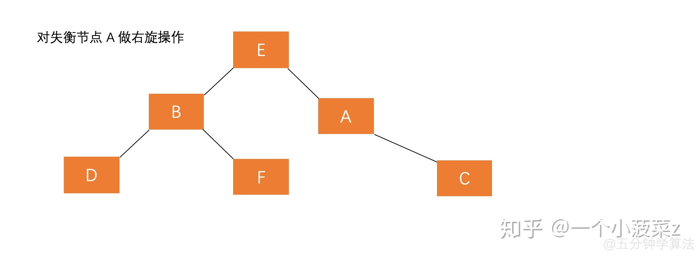
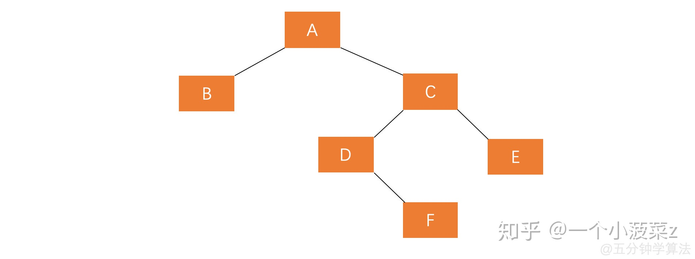
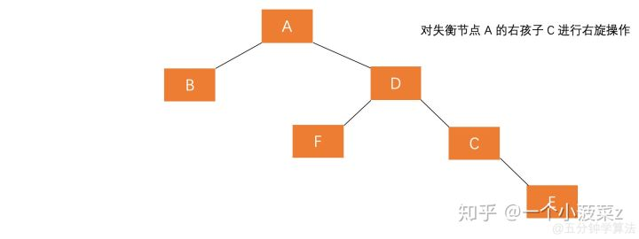
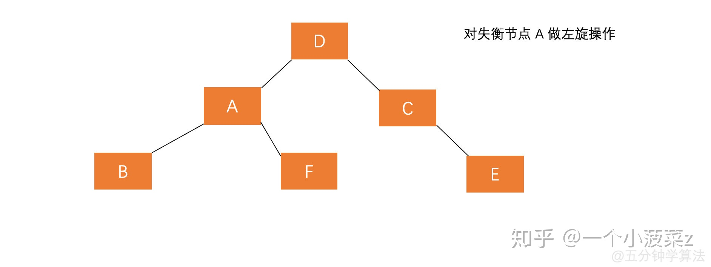
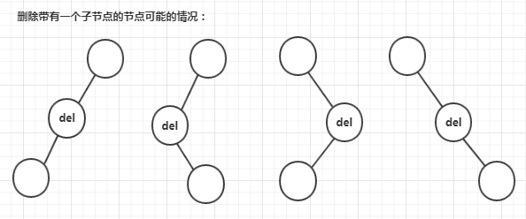

<!-- START doctoc generated TOC please keep comment here to allow auto update -->

<!-- DON'T EDIT THIS SECTION, INSTEAD RE-RUN doctoc TO UPDATE -->

**Table of Contents**  *generated with [DocToc](https://github.com/thlorenz/doctoc)*

- [数据结构 - 树](#%E6%95%B0%E6%8D%AE%E7%BB%93%E6%9E%84---%E6%A0%91)
  - [1. 树的概念](#1-%E6%A0%91%E7%9A%84%E6%A6%82%E5%BF%B5)
  - [2. 树的遍历方式](#2-%E6%A0%91%E7%9A%84%E9%81%8D%E5%8E%86%E6%96%B9%E5%BC%8F)
    - [1. 深度优先遍历 -- DFS(Depth First Search)](#1-%E6%B7%B1%E5%BA%A6%E4%BC%98%E5%85%88%E9%81%8D%E5%8E%86----dfsdepth-first-search)
    - [2. 广度优先遍历 -- BFS(Breadth First Search)](#2-%E5%B9%BF%E5%BA%A6%E4%BC%98%E5%85%88%E9%81%8D%E5%8E%86----bfsbreadth-first-search)
    - [3. 先序遍历](#3-%E5%85%88%E5%BA%8F%E9%81%8D%E5%8E%86)
    - [5. 后序遍历](#5-%E5%90%8E%E5%BA%8F%E9%81%8D%E5%8E%86)
    - [7. 中序遍历的非递归实现](#7-%E4%B8%AD%E5%BA%8F%E9%81%8D%E5%8E%86%E7%9A%84%E9%9D%9E%E9%80%92%E5%BD%92%E5%AE%9E%E7%8E%B0)
    - [8. 后续遍历的非递归实现](#8-%E5%90%8E%E7%BB%AD%E9%81%8D%E5%8E%86%E7%9A%84%E9%9D%9E%E9%80%92%E5%BD%92%E5%AE%9E%E7%8E%B0)

<!-- END doctoc generated TOC please keep comment here to allow auto update -->

# 数据结构 - 树

## 1. 树的概念

1. 数据结构中，树用来描述一种具有层级关系的数据，如父子孙关系、行政区划、政府部门关系等都是树形结构。

2. 树的高度和深度
   - 深度（depth）：对于任意节点 n，n 的深度为从根到 n 的唯一路径长，根的深度为 0。
   - 高度（height）：对于任意节点 n，n 的高度为从 n 到一片树叶的最长路径长，所有树叶的高度为 0。
   - 以上定义来自于维基百科。

3. 树的高度和深度的区别
   - 深度的计算是从根节点到叶子节点，而高度的计算是从叶子节点到根节点。对于一棵树而言，其高度和深度是一样的。但是，对于其他的非根节点，深度和高度可以不一样。
   - 举例：
     ```
                  A
                /   \
               B     C
              / \
             D   E
            /
           F
     ```
     根节点 A 的高度和深度是 4。而对于 B 和 C，深度都是 1，但是 B 的高度是 3，C 的高度是 1。
   - 注：这里所描述的一个节点的高度和深度都是 1，与维基百科的定义有点区别。

4. 参考资料：
   - [二叉树的高度和深度的区别 - 1](https://blog.csdn.net/demonandyu/article/details/85331904)
   - [二叉树的深度和高度的区别 - 2](https://blog.csdn.net/weixin_39973810/article/details/88862110)


## 2. 树的遍历方式

### 1. 深度优先遍历 -- DFS(Depth First Search)

1. 尽可能深的搜索树的分支。
2. 遍历方式 -- 递归：
   
   1. 访问根节点
   2. 对根节点的子节点挨个进行深度优先遍历
3. 代码示例：
   
   ```js
   const tree = {
         val: 'a',
         children: [
             {
                 val: 'b',
                 children: [
                     {
                         val: 'd',
                         children: [
                             {
                                 val: 'h',
                                 children: [
                                     {
                                         val: 'i',
                                         children: [
   
                                         ]
                                     },
                                 ]
                             },
                         ]
                     },
                     {
                         val: 'e',
                         children: [
   
                         ]
                     }
                 ]
             },
             {
                 val: 'c',
                 children: [
                     {
                         val: 'f',
                         children: [
   
                         ]
                     },
                     {
                         val: 'g',
                         children: [
   
                         ]
                     }
                 ]
             }
         ]
     }
   
      /**
       * 深度优先遍历
       * @param tree
       */
      const dfs = (tree) => {
          console.log(tree.val);
          tree.children.forEach(dfs);
      }
   
      // 输出示例
      dfs(tree);
      // a
      // b
      // d
      // h
      // i
      // e
      // c
      // f
      // g
   ```
4. 二叉树的深度优先遍历
   
   - 二叉树是树的一种特殊形式，一个节点只有左右两个子节点。
   - 二叉树的深度优先遍历常用于求二叉树的最大深度、先序、中序和后序遍历等。
   - 二叉树的深度优先遍历代码如下：
     ```js
     function binaryTreeDepthFirstSearch(root) {
            if (!root) {
                return;
            }
            console.log(root.val);
            binaryTreeDepthFirstSearch(root.left);
            binaryTreeDepthFirstSearch(root.right);
        }
     ```

### 2. 广度优先遍历 -- BFS(Breadth First Search)

1. 优先访问离根节点近的节点。
2. 遍历方式 -- 借助队列：
   
   1. 新建一个队列，把根节点入队
   2. 队头出队，并访问队头
   3. 把队头的子节点挨个入队
   4. 重复第 2、3 步，直到队列为空
3. 示例代码：
   
   ```js
   const tree = {
      val: 'a',
      children: [
          {
              val: 'b',
              children: [
                  {
                      val: 'd',
                      children: [
                          {
                              val: 'h',
                              children: [
                                  {
                                      val: 'i',
                                      children: [
   
                                      ]
                                  },
                              ]
                          },
                      ]
                  },
                  {
                      val: 'e',
                      children: [
   
                      ]
                  }
              ]
          },
          {
              val: 'c',
              children: [
                  {
                      val: 'f',
                      children: [
   
                      ]
                  },
                  {
                      val: 'g',
                      children: [
   
                      ]
                  }
              ]
          }
      ]
   }
    /**
     * 广度优先遍历
     * @param tree
     */
   const bfs = (tree) => {
       const queue = [tree];
   
       while (queue.length > 0) {
           const first = queue.shift();
           console.log(first.val);
           first.children.forEach(child => {
               queue.push(child);
           });
       }
   }
   
   // 输出
   bfs(tree);
   // a
   // b
   // c
   // d
   // e
   // f
   // g
   // h
   // i
   ```
4. 二叉树的广度优先遍历
   
   - 二叉树的广度优先遍历一般情况下适用于层序遍历、求二叉树的最小深度等。
   - 广度优先遍历使用队列。
   - 代码示例：
     ```js
     function binaryTreeBreadthFirstSearch(root) {
            if (!root) {
                return;
            }
     
            let nodeQueue = [root];
            while (nodeQueue.length > 0) {
                let node = nodeQueue.shift();
                console.log(node.val);
                if (node.left) {
                    nodeQueue.push(node.left);
                }
     
                if (node.right) {
                    nodeQueue.push(node.right);
                }
            }
     
        }
     ```

### 3. 先序遍历

1. 二叉树指的是树的每个节点最多有两个子节点。如下所示：
   
   ```
   1
                         /   \
                        2     3
                       / \   / \
                      4   5 6   7
                     /   /   \   \
                    8   9    10  11
   ```
2. 在 js 中，使用 Object 模拟二叉树，如下所示：
   
   ```js
   const binaryTree = {
          val: 1,
          left: {
              val: 2,
              left: null,
              right: null
          },
          right: {
              val: 3,
              left: null,
              right: null
          }
      }
   ```
3. 先序遍历口诀：
   
   1. 先访问根节点
   2. 对根节点的左子树进行先序遍历
   3. 对根节点的右子树进行先序遍历
4. 由上面的口诀可以看出，先序遍历使用递归，遍历顺序是：根左右。
5. 以下面的二叉树为例：
   
   ```
   1
                         /   \
                        2     6
                       / \     \
                      3   4     7
                         /   
                        5
   ```
   
   1. 从根节点开始，**输出 1**。
   2. 对根节点的左子树进行先序遍历，**输出 2**。
   3. 访问节点 2 的左子树，**输出 3**，因为节点 3 没有左子树，也没有右子树，所以对节点 3 的先序遍历结束。同时对节点 2 的左子树先序遍历结束。
   4. 访问节点 2 的右子树，**输出 4**。
   5. 对节点 4 进行先序遍历，访问节点 4 的左子树，**输出 5**，因为节点 5 没有左右子树，所以节点 5 的先序遍历结束。节点 4 左子树的先序遍历结束，而节点 4 没有右子树，所以节点 4 的先序遍历结束。进而节点 2 的右子树的先序遍历结束。
   6. 访问根节点的右子树（先序遍历），**输出 6**。节点 6 没有左子树，所以只能对其右子树进行先序遍历。
   7. 访问节点 6 的右子树，**输出 7**。节点 7 没有左右子树，因此对节点 7 的先序遍历结束。
   8. 对节点 6 的先序遍历结束，整个二叉树的先序遍历结束。输出的顺序为：**1234567**。
6. 代码实现：
   
   ```js
   const binaryTree = {
          val: 1,
          left: {
              val: 2,
              left: {
                  val: 3,
                  left: null,
                  right: null
              },
              right: {
                  val: 4,
                  left: {
                      val: 5,
                      left: null,
                      right: null
                  },
                  right: null
              }
          },
          right: {
              val: 6,
              left: null,
              right: {
                  val: 7,
                  left: null,
                  right: null
              },
   
          }
      }
   
   
      /**
       * 先序遍历
       * @param root
       */
      const preOrder = (root) => {
          if (!root) {
              // 节点为空，跳出递归
              return;
          }
          console.log(root.val);
          preOrder(root.left);
          preOrder(root.right);
      }
   
      preOrder(binaryTree);
   
      // 输出：
      // 1
      // 2
      // 3
      // 4
      // 5
      // 6
      // 7
   ```

### 4. 中序遍历

1. 中序遍历口诀：
   
   1. 对根节点的左子树进行中序遍历
   2. 访问根节点
   3. 对根节点的右子树进行中序遍历
2. 由上面的口诀可以看出，中序遍历使用递归，遍历顺序是：左根右。
3. 以下面的二叉树为例：
   
   ```
   1
                         /   \
                        2     6
                       / \     \
                      3   4     7
                         /   
                        5
   ```
   
   1. 对根节点的左子树进行中序遍历。即对节点 2 进行中序遍历。节点 2 存在左右子树，因此先对节点 2 的左子树进行先序遍历。
   2. 访问节点 3，节点 3 没有左子树，因此最先访问根节点，**输出 3**。节点 3 没有右子树，所以对节点 3 的中序遍历结束。
   3. 对节点 2 的左子树的中序遍历结束。访问节点 2 的根节点，即节点 2，**输出 2**。对节点 2 的右子树进行中序遍历。
   4. 节点 2 的右子树是节点 4。因此首先对节点 4 的左子树进行中序遍历。节点 4 的左子树是节点 5。节点 5 没有左右子树。因此直接访问根节点，**输出 5**。对节点 4 的左子树节点 5 的中序遍历结束。
   5. 访问节点 4 的根节点，**输出 4**。节点 4 没有右子树，因此对节点 4 的中序遍历结束。同理，节点 2 的中序遍历也结束。
   6. 访问节点 1 的根节点，**输出 1**。然后对节点 1 的右子树节点 6 进行中序遍历。
   7. 节点 6 没有左子树，因此直接访问根节点，**输出 6**。然后对节点 6 的右子节点 7 进行中序遍历。
   8. 节点 7 没有左右子树，因此直接访问根节点，**输出 7**。节点 6 的右子树中序遍历结束，节点 6 的中序遍历结束。
   9. 节点 1 的右子树中序遍历结束，整个二叉树的中序遍历结束。输出的顺序是：**3254167**
4. 代码实现：
   
   ```js
   const binaryTree = {
          val: 1,
          left: {
              val: 2,
              left: {
                  val: 3,
                  left: null,
                  right: null
              },
              right: {
                  val: 4,
                  left: {
                      val: 5,
                      left: null,
                      right: null
                  },
                  right: null
              }
          },
          right: {
              val: 6,
              left: null,
              right: {
                  val: 7,
                  left: null,
                  right: null
              },
   
          }
      }
   
   
      /**
       * 中序遍历
       * @param root
       */
      const inOrder = (root) => {
          if (!root) {
              // 节点为空，跳出递归
              return;
          }
   
          inOrder(root.left);
          console.log(root.val);
          inOrder(root.right);
      }
   
      inOrder(binaryTree);
   
      // 输出：
      // 3
      // 2
      // 5
      // 4
      // 1
      // 6
      // 7
   ```

### 5. 后序遍历

1. 后序遍历口诀：
   
   1. 对根节点的左子树进行后序遍历
   2. 对根节点的右子树进行后序遍历
   3. 访问根节点
2. 由上面的口诀可以看出，后序遍历使用递归，遍历顺序是：左右根。
3. 以下面的二叉树为例：
   
   ```
   1
                         /   \
                        2     6
                       / \     \
                      3   4     7
                         /   
                        5
   ```
   
   1. 对根节点的左子树进行后序遍历。即对节点 2 进行后序遍历。节点 2 存在左右子树，因此先对节点 2 的左子树进行后序遍历。
   2. 访问节点 3，节点 3 没有左子树，也没有右子树，因此最先访问根节点，**输出 3**。所以对节点 3 的后序遍历结束。
   3. 对节点 2 的左子树的后序遍历结束。访问节点 2 的右子树 —— 节点 4。对节点 4 进行后序遍历。
   4. 节点 4 的左子树是节点 5，对节点 5 进行后序遍历。因为节点 5 没有左右子树，因此直接访问根节点，**输出 5**。对节点 5 的后续遍历结束。
   5. 节点 4 没有右子树，因此直接访问根节点，**输出 4**。节点 4 的后续遍历结束。
   6. 节点 2 的右子树的后续遍历结束。因此访问根节点。**输出 2**。节点 2 的后续遍历结束。
   7. 节点 1 的左子树后续遍历结束。对节点 1 的右子树节点 6 进行后续遍历。
   8. 节点 6 没有左子树，只有右子树。因此先对其右子树节点 7 进行后续遍历。
   9. 节点 7 没有左右子树，因此直接访问根节点，**输出 7**。
   10. 节点 6 的右子树的后序遍历结束。因此直接访问节点 6 的根节点，**输出 6**。节点 6 的后续遍历结束。
   11. 节点 1 的右子树的后续遍历结束。访问节点 1 的根节点，**输出 1**。
   12. 节点 1 的后序遍历结束，整个二叉树的后序遍历结束。输出顺序是：**3542761**。
4. 代码实现：
   
   ```js
   const binaryTree = {
       val: 1,
       left: {
           val: 2,
           left: {
               val: 3,
               left: null,
               right: null
           },
           right: {
               val: 4,
               left: {
                   val: 5,
                   left: null,
                   right: null
               },
               right: null
           }
       },
       right: {
           val: 6,
           left: null,
           right: {
               val: 7,
               left: null,
               right: null
           },
   
       }
   }
   
   
   /**
   * 后序遍历
   * @param root
   */
   const postOrder = (root) => {
      if (!root) {
          // 节点为空，跳出递归
          return;
      }
   
      postOrder(root.left);
      postOrder(root.right);
      console.log(root.val);
   
   }
   
   // 输出：
   // 3
   // 5
   // 4
   // 2
   // 7
   // 6
   // 1
   ```

### 6. 先序遍历的非递归实现

1. 递归版的先序遍历，使用的是递归，那么递归是函数自己调用自己，就会形成一个函数调用堆栈。那么实际上，我们可以使用一个栈来模拟这个调用堆栈，进而实现递归的效果。
2. 使用栈来实现非递归版的先序遍历，包括其他方式的遍历，主要是想明白什么时候入栈，什么时候出栈。入栈模拟函数调用，出栈模拟函数调用结束，也就是访问元素。
3. 我们以下面的这个二叉树为例：
   
   ```
   1
                         /   \
                        2     6
                       / \     \
                      3   4     7
                         /   
                        5
   ```
   
   1. 节点 1 入栈 --> [1]
   2. 节点 1 出栈，节点 2 入栈，节点 6 入栈 --> [6, 2]
   3. 节点 2 出栈，节点 3 入栈，节点 4 入栈 --> [6, 4, 3]
   4. 节点 3 出栈 --> [6, 4]
   5. 节点 4 出栈，节点 5 入栈 --> [6, 5]
   6. 节点 5 出栈 --> [6]
   7. 节点 6 出栈，节点 7 入栈 --> [7]
   8. 节点 7 出栈，此时栈空了，说明遍历结束
4. 将上述过程转换成代码，如下所示：
   
   ```js
   /**
       * 先序遍历 -- 非递归版本
       * @param root
       */
       const preorder = (root) => {
           if (!root) {
               return;
           }
   
           let stack = [root];
           while (stack.length > 0) {
               // 栈顶元素就是我们即将要访问的节点
               let n = stack.pop();
               // 先序遍历是：根左右，所以先输出根节点
               console.log(n.val);
               // 访问完根节点，应该访问左节点，因为栈的特点是先进后出，那么如果先将左节点压入栈，再将右节点压入栈，那么最后出栈的顺序就是右节点和左节点，顺序就乱了
               // 因此我们入栈的时候，先将右节点压入栈，然后将左节点压入栈，这样出栈时，顺序就对了
               if (n.right) {
                   stack.push(n.right);
               }
               if (n.left) {
                   stack.push(n.left);
               }
           }
   
       }
   ```

### 7. 中序遍历的非递归实现

1. 我们以下面的这个二叉树为例，描述中序遍历的非递归过程，这个过程需要一个单独的指针 p，用来寻找一个节点的左子节点：
   
   ```
   1
                         /   \
                        2     6
                       / \     \
                      3   4     7
                         /   
                        5
   ```
   
   1. 从节点 1 开始，二叉树的左节点依次入栈（包括根节点），此时 p 指向节点 3 的左子节点，此时 p = null --> [1, 2, 3]
   2. **节点 3 出栈**，p 指向节点 3 的右子节点，此时 p = null --> [1, 2]
   3. **节点 2 出栈**，p 指向节点 2 的右字节点，p = 4 --> [1]
   4. 节点 4 入栈，节点 5 入栈 --> [1, 4, 5]
   5. **节点 5 出栈**，p 指向节点 5 的右子节点，此时 p = null --> [1, 4]
   6. **节点 4 出栈**，p 指向节点 4 的右子节点，此时 p = null--> [1]
   7. **节点 1 出栈**，p 指向节点 1 的右字节点，p = 6 --> []
   8. 节点 6 入栈 --> [6]
   9. **节点 6 出栈**，p 指向节点 6 的右字节点，p = 7 --> []
   10. 节点 7 入栈 --> [7]
   11. **节点 7 出栈**，p 指向节点 7 的右字节点，p = null --> []
   12. 栈空了，同时 p 也为 null，说明二叉树的中序遍历结束。
2. 代码实现：
   
   ```js
   /**
       * 中序遍历 - 非递归版
       * @param root
       */
      const inorder = (root) => {
          if (!root) {
        return;
          }
   
          let stack = [];
          let p = root;
   
          // 中序遍历的规则是：左根右
          // 首先要找到最左边的节点，所以这里使用了一个指针 p 指向当前要寻找的节点
   
          while (stack.length > 0 || p) {
              // p 先指向根节点，根节点入栈后，不断指向其左子树，并将左子树入栈，直到左子树为空，则我们找到了最左边的那个节点
              // 所以，下面的这个循环，就是将某一节点的左子树不断入栈
              while (p) {
                  stack.push(p);
                  p = p.left;
              }
              // 找到最左边的节点后，开始出栈
              let n = stack.pop();
              console.log(n.val);
              // 当前根节点出栈以后，需要将其右节点压入栈，所以这里直接将 p 指向当前节点的右子树
              p = n.right;
          }
      }
   ```

### 8. 后续遍历的非递归实现

1. 后序遍历是左右根，直接实现比较困难，我们这里可以借助先序遍历来间接实现：
   
   1. 后序遍历如果反过来，就是根右左，和先序遍历很像，那么我们在进行先序遍历的时候，使用一个栈，将先序遍历的输出依次入栈，那么入栈的顺序一定是根左右
   2. 如果我们再对存放先序遍历结果的这个栈执行出栈操作，那么出栈的顺序一定是右左根，这就和后序遍历就非常像了。
   3. 我们对先序遍历的非递归过程进行一下改造，使得其能先访问右节点，再访问左节点，这样对存放先序遍历结果的这个栈执行出栈操作时，出栈顺序就是左右根了。
2. 我们以下面的这个二叉树为例，在执行先序遍历的过程中，将遍历的结果推入另外一个栈中，stack 用来进行先序遍历，而 outputStack 用来存放先序遍历的结果：
   
   ```
   1
                         /   \
                        2     6
                       / \     \
                      3   4     7
                         /   
                        5
   ```
   
   1. 节点 1 入 stack，stack --> [1]
   2. 节点 1 出 stack，同时节点 1 入 outputStack，节点 2 入 stack，节点 6 入 stack，stack --> [2, 6]，outputStack --> [1]
   3. 节点 6 出 stack，节点 6 入 outputStack，节点 7 入 stack，节，stack --> [2, 7]，outputStack --> [1, 6]
   4. 节点 7 出 stack，节点 7 入 outputStack，stack --> [2]，outputStack --> [1, 6, 7]
   5. 节点 2 出 stack，节点 2 入 outputStack，节点 3 入 stack，节点 4 入 stack,stack --> [3, 4]，outputStack --> [1, 6, 7, 2]
   6. 节点 4 出 stack，节点 4 入 outputStack，节点 5 入 stack，stack --> [3, 5]，outputStack --> [1, 6, 7, 2, 4]
   7. 节点 5 出 stack，节点 5 入 outputStack，stack --> [3]，outputStack --> [1, 6, 7, 2, 4, 5]
   8. 节点 3 出 stack，节点 3 入 outputStack，stack --> []，outputStack --> [1, 6, 7, 2, 4, 5, 3]
   9. stack 为空，先序遍历结束。
      10.outputStack 是按照根右左的顺序存储的二叉树遍历结果，那么我们倒序输出outputStack，就是二叉树的后序遍历结果。
3. 代码实现：
   
   ```js
   /**
       * 后序遍历 -- 非递归版
       * @param root
       */
      const postorder = (root) => {
   
          if (!root) {
              return;
          }
          // 后序遍历的倒序结果（根右左）
          const outputStack = [];
          // 先序遍历（根右左）
          const stack = [root];
          // 后序遍历是左右根，直接实现比较困难，我们这里可以借助先序遍历来间接实现
          // 1. 后序遍历如果反过来，就是根右左，和先序遍历很像，那么我们在进行先序遍历的时候，使用一个栈，将先序遍历的输出依次入栈，那么入栈的顺序一定是根左右
          // 2. 如果我们再对存放先序遍历结果的这个栈执行出栈操作，那么出栈的顺序一定是右左根，这就和后序遍历就非常像了
          // 3. 我们对先序遍历的非递归过程进行一下改造，使得其能先访问右节点，再访问左节点，这样对存放先序遍历结果的这个栈执行出栈操作时，出栈顺序就是左右根了
          while (stack.length > 0) {
              // 先序遍历访问每一个元素
              const n = stack.pop();
              // 将先序遍历访问的结果依次入栈 -- 根右左
              outputStack.push(n);
              // 这里就是我们对先序遍历改造的地方，因为 stack 用来存放左右子树，而后面出栈（stack）的元素才是当前要访问的元素（根元素）
              // 那么根据栈的特性（后进先出），左子树先进栈，右子树后进栈，那么访问元素的时候，一定是先访问右子树，再访问左子树
              // 所以，当我们将访问元素（出栈 —— stack）的结果放入 outputStack 时，则存放的顺序就是根右左
              // 如果是单纯的先序遍历，那么这里就是右子树先入栈，左子树后入栈
              if (n.left) {
                  stack.push(n.left);
              }
              if (n.right) {
                  stack.push(n.right);
              }
          }
   
          // 变形版的先序遍历结束以后，outputStack 存放的是按照根右左顺序遍历二叉树的结果
          // 那么我们只要按顺序出栈，就可以得到左右根顺序的后序遍历二叉树的结果
          while (outputStack.length > 0) {
              let s = outputStack.pop();
              console.log(s.val);
          }
      }
   ```

## 3. 二叉树的分类

### 1. 满二叉树

### 2. 完全二叉树

### 3. 平衡二叉树 —— AVL Tree

#### 1. 参考资料

1. [有图有真相！平衡二叉树AVL实现](https://juejin.cn/post/6986539878687195173)
2. [什么是平衡二叉树（AVL）](https://zhuanlan.zhihu.com/p/56066942)
3. [平衡二叉树（AVL）图解与实现](https://blog.csdn.net/u014634338/article/details/42465089)

#### 2. 基本性质

1. 定义（递归定义）
   
   1. 根节点可以为空。
   2. 根节点不为空，则其任意子节点都是平衡二叉树且其左右子树的高度的差的绝对值不能大于 1。
2. 平衡二叉树的前提是一颗二叉搜索树。
3. 二叉搜索树的最好的时间复杂度是 $O(logn)$，最差的时间复杂度是 $O(n)$。
4. 为什么最差的时间复杂度是 $O(n)$ 呢，因为当二叉树搜索树只有一个分支的时候，如下所示：
   
   ```
   1
           \
            2
             \
              3
               \
                4
                 \
                  5
   ```
   
   查找 5，就需要搜索 5 次。
   如果将上面的二叉树变成平衡二叉树，如下所示：
   
   ```
   3
             / \
            2   4
           /     \
          1       5
   ```
   
   只需要查找 3 次
5. 二叉搜索树的查找效率取决于树的高度，因此保持树的高度最小，即可保证树的查找效率。
6. 可以看出当节点数目一定，保持树的左右两端保持平衡，树的查找效率最高。
7. 像上面这种左右子树的高度相差不超过 1 的树为平衡二叉树。
8. 不平衡的二叉树举例：
   
   ```
   10
               /        \
              5         12
            /   \      /  \
           4     6    11   13
          /                 \
         3                  14
        /
       2
   ```
   
   节点 5 不是一棵平衡二叉树，因此整棵树也不是一棵平衡二叉树。
9. 平衡因子 （Balance Factor）
   
   - 某节点的左子树与右子树的高度(深度)差即为该节点的平衡因子（BF,Balance Factor），平衡二叉树中不存在平衡因子大于 1 的节点。在一棵平衡二叉树中，节点的平衡因子只能取 0 、1 或者 -1 ，分别对应着左右子树等高，左子树比较高，右子树比较高。

#### 3. 最小失衡树

1. 新插入节点以后，原来平衡的二叉树有可能不平衡，如：
   
   ```
   10
             /   \
            7     15
           / 
          5
   ```
   
   插入的节点 4，新的二叉树是：
   
   ```
   10
             /   \
            7     15
           / 
          5
         /
        4
   ```
   
   显然这棵二叉树已经不平衡了。
2. 在新插入的结点向上查找，以第一个平衡因子的绝对值超过 1 的结点为根的子树称为**最小失衡子树**。以上面的不平衡二叉树为例，从新的节点 4 向上寻找，第一个平衡因子的绝对值超过 1 的节点是 7，那么以 7 这个节点为根节点的树就是最小失衡树。我们发现，以节点 10 为根节点的树也是失衡树，是有可能有多棵子树同时失衡的。而这个时候，我们只要调整最小的不平衡子树，就能够将不平衡的树调整为平衡的树。
3. 将不平衡的树转换为平衡的树是通过旋转旋转最小失衡子树的方式实现的。旋转的方式主要有左旋和右旋。
4. 旋转的主要目的是降低树的高度。哪边的子树高，就把哪边的树向上旋转。

#### 4. 二叉树的旋转方式 —— 左旋

1. 左旋是针对右子树的，也就是右子树高，就向左旋转。
2. 左旋的步骤：
   
   1. 节点（指的最小失衡树的根节点）的右孩子替代此节点位置
   2. 右孩子的左子树变为该节点的右子树
   3. 节点本身变为右孩子的左子树
3. 示例：
   
   1. 新插入的节点是 99，最小失衡树是节点 66，如下图所示：
      
   2. 旋转过程如下图所示：
      
   3. 详细步骤：
      1. 节点的右孩子替代此节点位置 —— 节点 66 的右孩子是节点 77，节点 77 变成根节点
      2. 右孩子的左子树变为该节点的右子树 —— 节点 77 的左子树是节点 75，将节点 75 变成节点 66 的右节点。
      3. 节点本身变为右孩子的左子树 —— 节点 66 变成节点 77 的左子树。

#### 5. 二叉树的旋转方式 —— 右旋

1. 右旋是针对左子树的，也就是左子树高，就向右旋转。
2. 步骤：
   
   1. 节点的左孩子代表此节点
   2. 节点的左孩子的右子树变为节点的左子树 3. 将此节点作为左孩子节点的右子树
3. 旋转过程如下图所示：
   

#### 6. 四种插入方式与旋转方式

1. 假设一颗 AVL 树的某个节点为 A，有四种操作会使 A 的左右子树高度差大于 1，从而破坏了原有 AVL 树的平衡性。平衡二叉树插入节点的情况分为以下四种：

##### 2. LL

1. 这种情况下，左子树比右子树高，因此执行一次右旋即可。
2. 过程如下图所示：
   

##### 3. RR

1. 这种情况下，右子树比左子树高，因此执行一次左旋即可。
2. 过程如下图所示：
   

##### 4. LR

1. 若 A 的左孩子节点 B 的右子树 E 插入节点 F，导致节点 A 失衡，如下图所示：
   
2. 此时节点 A 左子树比右子树高，如果我们执行一次右旋，如下图所示：
   
   旋转后的树依然是失衡的树，说明单纯的进行一次右旋不能使得树变得平衡。
3. 因此我们需要进行两步旋转，使得旋转之后原来的根节点的左孩子的右孩子作为新的根节点。步骤如下：
   
   1. 对失衡节点 A 的左孩子 B 进行左旋操作，即上述 RR 情形操作
   2. 对失衡节点 A 做右旋操作，即上述 LL 情形操作。
4. 对失衡节点 A 的左孩子 B 进行左旋操作
   
5. 对失衡节点 A 的进行右旋操作
   
   经过两次旋转，原来根节点的左孩子的右孩子 E 节点成为了新的根节点

##### 5. RL

1. 右孩子插入左节点的过程与左孩子插入右节点过程类似，也是需要执行两步操作，使得旋转之后为 原来根结点的右孩子的左孩子作为新的根节点。
2. 以下图为例：
   
3. 操作步骤
   
   1. 对失衡节点 A 的右孩子 C 进行右旋操作，即上述 LL 情形操作。
   2. 对失衡节点 A 做左旋操作，即上述 RR 情形操作。
4. 对失衡节点 A 的右孩子 C 进行右旋操作
   
5. 对失衡节点 A 做左旋操作
   
   经过两次旋转，原来根节点的右孩子的左孩子 D 节点成为了新的根节点。

#### 7. AVL 树的删除

1. AVL 树和二叉查找树的删除操作情况一致，都分为四种情况：
   
   1. 删除叶子节点
   2. 删除的节点只有左子树
   3. 删除的节点只有右子树
   4. 删除的节点既有左子树又有右子树
2. 只不过 AVL 树在删除节点后需要重新检查平衡性并修正，同时，删除操作与插入操作后的平衡修正区别在于，插入操作后只需要对插入栈中的弹出的第一个非平衡节点进行修正，而删除操作需要修正栈中的所有非平衡节点。
3. 删除操作的大致步骤如下：
   
   1. 以前三种情况为基础尝试删除节点，并将访问节点入栈。
   2. 如果尝试删除成功，则依次检查栈顶节点的平衡状态，遇到非平衡节点，即进行旋转平衡，直到栈空。
   3. 如果尝试删除失败，证明是第四种情况。这时先找到被删除节点的右子树最小节点并删除它，将访问节点继续入栈。
   4. 再依次检查栈顶节点的平衡状态和修正直到栈空。
   5. 对于删除操作造成的非平衡状态的修正，可以这样理解：对左或者右子树的删除操作相当于对右或者左子树的插入操作，然后再对应上插入的四种情况选择相应的旋转就好了。

#### 8. 总结

1. 在所有的不平衡情况中，都是按照先寻找最小不平衡树，然后寻找所属的不平衡类别，再根据 4 种类别进行固定化程序的操作。
2. LL，LR，RR，RL 其实已经为我们提供了最后哪个结点作为新的根指明了方向。如 LR 型最后的根结点为原来的根的左孩子的右孩子，RL 型最后的根结点为原来的根的右孩子的左孩子。只要记住这四种情况，可以很快地推导出所有的情况。
3. 维护平衡二叉树，最麻烦的地方在于平衡因子的维护。

### 4. 二叉搜索树 —— Binary Search Tree

#### 1. 二叉搜索树的基本性质

1. 二叉搜索树（BST，Binary Search Tree）,也称二叉排序树。一棵二叉搜索树满足以下条件：
   
   1. 左子树的所有值均小于根节点的值
   2. 右子树的所有值均大于根节点的值
   3. 左右子树同时也满足以上两点

2. 对于二叉搜索树来说，就是左小又大，且不存在子节点的值同根节点值相等的情况。

3. 举例：
   
   1. 二叉搜索树：
      ```
      10
              /  \
             8   15
            / \    \
           7   9    16
      ```
   2. 不是二叉搜索树：
   
   ```
   10
           /    \
          8      15
         / \    /  \
        7   9  5   16
   ```
4. 二叉搜索树的优势在于查找的方面的优势。在最好的情况下，二叉搜索树的查找效率比较高，是 $O(logn)$，其访问性能近似于二分查找。

5. 但最差时候会是 $O(n)$，比如插入的元素是有序的，生成的二叉排序树就是一个链表，这种情况下，需要遍历全部元素才行。例如下面的二叉搜索树：
   
   ```
   1
       \
        2
         \
          3
           \
            4
             \
              5
   ```
   
   如果我们查找 5 的话，需要查找 5 次，才能找到，时间复杂度是 $O(5)$。
   这种情况下，就需要将这种二叉搜索树转换为平衡二叉树。
6. 参考资料
   -[数据结构（二）：二叉搜索树（Binary Search Tree）](https://www.jianshu.com/p/ff4b93b088eb)
   -[3 分钟理解完全二叉树、平衡二叉树、二叉查找树](https://mp.weixin.qq.com/s/K_oGI2rl3epTirxkST5LVQ)

#### 2. 二叉搜索树的操作

1. 节点定义:
   ```js
   class Node {
          constructor(val) {
              this.val = val;
              this.left = null;
              this.right = null;
          }
      }
   ```

##### 1. 插入

1. 二叉搜索树在进行插入操作的时候，要将新插入的节点放入合适的位置，即：
   
   - 小于根节点的放在根节点的左子树上
   - 大于根节点的放在根节点的右子树上
2. 需要使用递归。从根节点开始，分两种情况：
   
   1. 插入的值小于当前节点，那么就向当前节点的左节点递归插入
   2. 插入的值大于当前节点，那么就向当前节点的右节点递归插入
3. 递归出口：如果递归到当前的节点是空节点，那么证明这个节点没有左或者右叶子节点，那么就将新插入的节点作为当前节点的左或者右子节点。
4. 代码实现：
   
   ```js
   class Node {
          constructor(val) {
              this.val = val;
              this.left = null;
              this.right = null;
          }
      }
   
   
   
   
      class BinarySearchTree {
         constructor() {
             this.root = null;
         }
   
         insert(val) {
             let node = new Node(val);
             if (this.root === null) {
                 this.root = node;
             } else {
            insertNode(this.root, node);
             }
   
   
             /**
              *
              * @param root 当前树的根节点
              * @param node
              */
             function insertNode(root, node) {
                 if (node.val < root.val) {
                     if (root.left === null) {
                         root.left = node;
                     } else {
                    insertNode(root.left, node);
                     }
                 } else {
                     if (root.right === null) {
                         root.right = node;
                     } else {
                         insertNode(root.right, node);
                     }
                 }
             }
         }
     }
   ```

##### 2. 查找

1. 查找的主要方式也是递归：
   
   - 当前的值小于根节点的值，向当前节点的左节点递归查找
   - 当前的值大于根节点的值，向当前节点的右节点递归查找
2. 递归出口：
   
   1. 找到了，返回查找的节点
   2. 没有找到，返回 null，什么情况下没有找到呢，如果当前节点是叶子节点，且节点值不等于要查找的值，那么就是没有找到。
3. 
4. 代码实现：
   
   ```js
      class Node {
           constructor(val) {
               this.val = val;
               this.left = null;
               this.right = null;
           }
      }

      class BinarySearchTree {
          constructor() {
             this.root = null;
          }
    
          search(val) {
              if (this.root) {
                  return searchNode(this.root, val);
              } else {
                  return false;
              }

              /**
               *
               * @param root
               * @param val
               * @returns {boolean|boolean|*}
               */
              function searchNode(root, val) {

                  if (!root.left && !root.right && root.val !== val) {
                      // 当前节点是叶子节点
                      return false;
                  }

                  if (root.val === val) {
                      return true;
                  } else if (root.val > val) {
                      if (root.left) {
                          return searchNode(root.left, val);
                      } else {
                          // 不存在左节点，但是根节点的值还大于 val，证明没有等于 val 的节点
                          return false;
                      }

                  } else {
                      if (root.right) {
                          return searchNode(root.right, val);
                      } else {
                          // 不存在右节点，但是根节点的值还小于 val，证明没有等于 val 的节点
                          return false;
                      }
                  }
              }
          }
      }

   ```

##### 3. 删除

1. 删除一共有四种情况：
   1. 删除的节点是叶子节点
   2. 删除的节点只有一个子节点
   4. 删除的节点同时有左右子节点

2. 删除的节点是叶子节点，这种情况最简单，直接删除即可，即将父节点指向子节点的引用设为 null。

3. 删除的节点只有一个子节点，，结合当前被删除节点的位置，一共有四种情况，如下图所示：
   
   - 具体而言就是左左、左右、右左和右右。但是对于待删除节点来说只有两种，只有左子节点或只有右子节点，两种情况的处理方式基本相同，都是将待删除节点的左 / 右子节点直接挂载到待删除节点的父节点的左 / 右子树上。举例如下：
     ```
             5                      5         
            /                      /  
           4      删除 4  -->      3
          /
         3

             7                      5         
            /                      /  
           4      删除 4  -->      5
            \  
             5

             4                      4         
              \                      \  
               6      删除 6  -->     5
              /
             5
             
             5                      5         
              \                      \  
               8      删除 8  -->     10
                \
                 10
     ```

4. 待删除的节点有两个子节点
   - 这种情况比较复杂，一般的删除策略是用其右子树的最小节点代替待删除节点的数据，然后递归删除那个右子树最小节点。即将第三种情况转化为第二种情况。
   - 删除过程分为两步：
     1. 找到待删除节点的右子树的最小节点，将待删除节点替换为这个最小节点。
     2. 递归删除那个右子树最小节点。
   - 举例如下：
     ```
             10
           /   \
          7    15
              /  \
             14  18
                /
               16
                \
                17
        删除的节点是 15
        先找到节点 15 右子树的最小节点 16，然后进行替换：
             10
           /   \
          7    16
              /  \
             14  18
                /
               16
                \
                17

        递归删除最小节点 16：
             10
           /   \
          7    16
              /  \
             14  18
                /
               17
     ```
    
5. 代码示例：
   ```js
      
   ```
##### 4. 最大值和最小值

1. 根据二叉搜索树的特点，大于根节点的节点一定在根节点的右侧，那么整棵树最右边的子节点（不一定是叶子节点），一定就是最大值。
2. 同理，整棵树最左边的子节点（不一定是叶子节点），一定就是最小值。

3. 示例代码：
   ```js
      class Node {
          constructor(val) {
              this.val = val;
              this.left = null;
              this.right = null;
          }
      }

      class BinarySearchTree {
          constructor() {
              this.root = null;
          }


          /**
           *
           * @returns {null|*}
           */
           maxVal() {
               let p = this.root;
               if (p) {
                   while (p && p.right) {
                       p = p.right;
                   }

                   return p.val;
               } else {
                   return null;
               }
           }

            /**
             *
             * @returns {null|*}
             */
             minVal() {
                 let p = this.root;
                 if (p) {
                     while (p && p.left) {
                         p = p.left;
                     }
                     return p.val;
                 } else {
                     return null;
                 }
             }

      }

   ```

##### 5. 树的高度

1. 前面已经讲述了树和节点高度的定义。实际上，求一棵树或者节点的高度可以采用递归：
   1. 获得节点的左子树高度
   2. 获得节点的右子树高度
   3. 比较这两个子树的高度，获得其最大值，在最大值的基础上加 1，得到最终结果就是这个节点的高度
   4. 递归地进行 1 - 3

2. 递归的出口：节点为空，则其高度为 0。说明这个节点下已经没有任何节点了，所以递归终止。

3. 代码示例：
   ```js
       class Node {
           constructor(val) {
               this.val = val;
               this.left = null;
               this.right = null;
           }
       }

       class BinarySearchTree {
           constructor() {
               this.root = null;
           }


           /**
            * 获得任意节点的高度
            * @param node
            * @returns {number}
            */
           getHeight(node = this.root) {

               function getNodeHeight(n) {
                   if (!n) {
                       // 当前节点为空，则其深度为 0，叶子节点的深度为 1
                       return 0;
                   }
                   // 当前节点的左或右子节点的深度的最大值加 1，就是当前节点的深度
                   return Math.max(getNodeHeight(n.left), getNodeHeight(n.right)) + 1;
               }


               return getNodeHeight(node);
           }
       }
   ```


