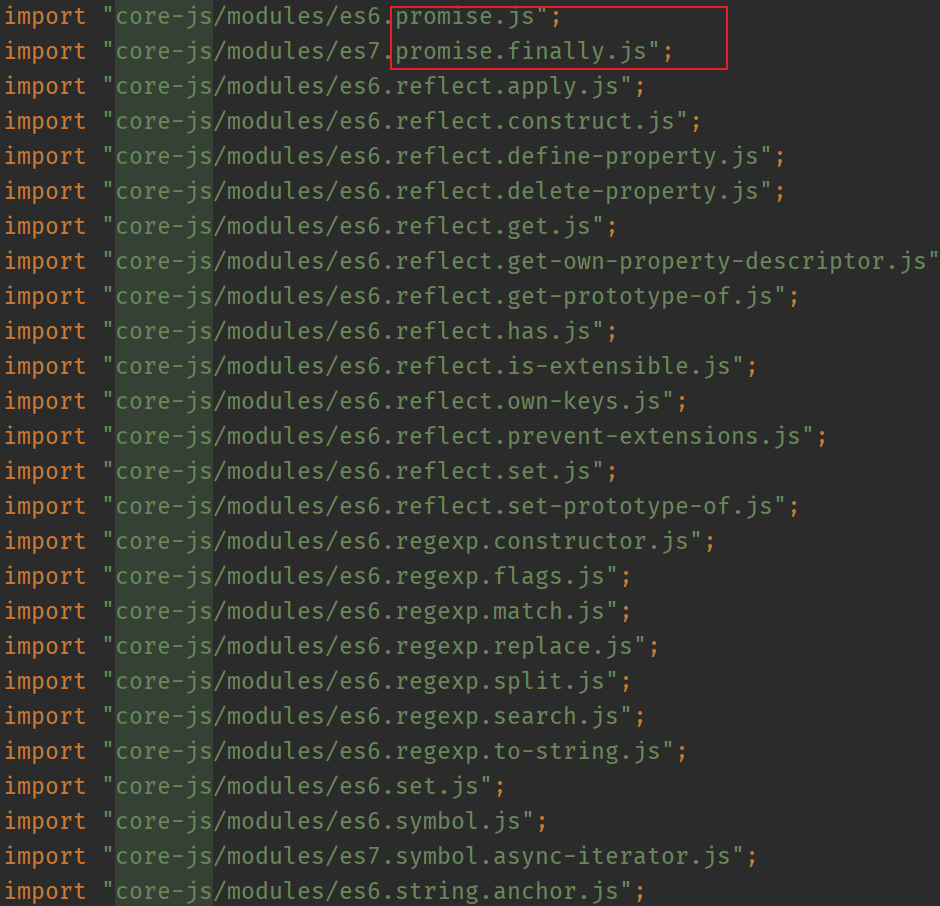
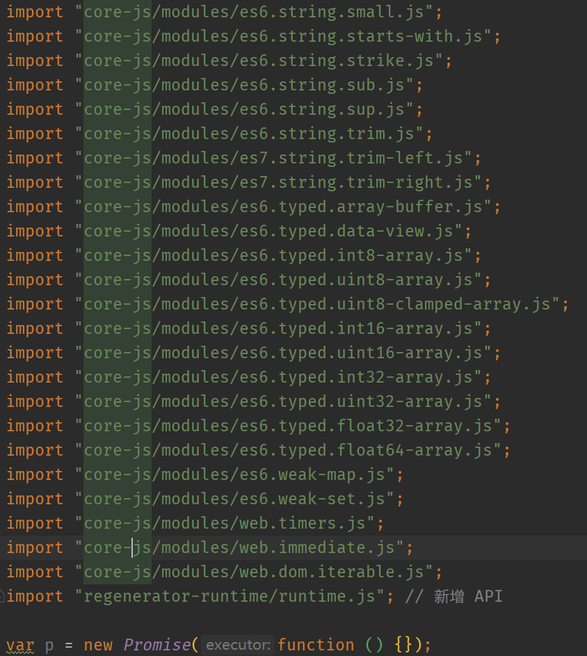

<!-- START doctoc generated TOC please keep comment here to allow auto update -->
<!-- DON'T EDIT THIS SECTION, INSTEAD RE-RUN doctoc TO UPDATE -->
**Table of Contents**  *generated with [DocToc](https://github.com/thlorenz/doctoc)*

- [Babel 的基本使用方式](#babel-%E7%9A%84%E5%9F%BA%E6%9C%AC%E4%BD%BF%E7%94%A8%E6%96%B9%E5%BC%8F)
  - [1. 参考资料](#1-%E5%8F%82%E8%80%83%E8%B5%84%E6%96%99)
  - [2. Babel 的基本说明](#2-babel-%E7%9A%84%E5%9F%BA%E6%9C%AC%E8%AF%B4%E6%98%8E)
  - [3. Babel 的基本使用](#3-babel-%E7%9A%84%E5%9F%BA%E6%9C%AC%E4%BD%BF%E7%94%A8)
    - [1. 安装](#1-%E5%AE%89%E8%A3%85)
    - [2. 基本编译](#2-%E5%9F%BA%E6%9C%AC%E7%BC%96%E8%AF%91)
  - [4. `@babel/preset-env` 的说明](#4-babelpreset-env-%E7%9A%84%E8%AF%B4%E6%98%8E)
    - [1. targets](#1-targets)
    - [2. modules](#2-modules)
    - [3. corejs](#3-corejs)
    - [4. useBuiltIns](#4-usebuiltins)
  - [5. `@babel/polyfill` 的说明](#5-babelpolyfill-%E7%9A%84%E8%AF%B4%E6%98%8E)
    - [1. useBuiltIns（presets-env 的配置项）](#1-usebuiltinspresets-env-%E7%9A%84%E9%85%8D%E7%BD%AE%E9%A1%B9)
      - [1. false](#1-false)
      - [2. entry](#2-entry)
      - [3. usage](#3-usage)
    - [2. corejs（presets-env 的配置项）](#2-corejspresets-env-%E7%9A%84%E9%85%8D%E7%BD%AE%E9%A1%B9)
    - [1. corejs （@babel/plugin-transform-runtime 的配置项）](#1-corejs-babelplugin-transform-runtime-%E7%9A%84%E9%85%8D%E7%BD%AE%E9%A1%B9)

<!-- END doctoc generated TOC please keep comment here to allow auto update -->

# Babel 的基本使用方式

## 1. 参考资料

1. [Babel 配置用法解析](https://www.cnblogs.com/bai1218/p/12392180.html)

2. [面试官(7): 聊一聊 Babel?](https://juejin.cn/post/6844903849442934798)

3. [深入Babel，这一篇就够了](https://juejin.cn/post/6844903746804137991)

4. [面试官: 你了解过Babel吗？写过Babel插件吗? 答: 没有。卒](https://juejin.cn/post/6844903566809759758)

5. [深入浅出 Babel 上篇：架构和原理 + 实战](https://juejin.cn/post/6844903956905197576)

6. [不容错过的 Babel7 知识](https://juejin.cn/post/6844904008679686152)

7. [Babel 官网](https://babeljs.io/docs/en/)

## 2. Babel 的基本说明

1. Babel 是一个JavaScript 编译器，提供一系列的工具，主要用来 将 ECMAScript 2015+ 语法编写的代码转换为向后兼容的 JavaScript 语法，以便能够运行在当前和旧版本的浏览器或其他环境中。

2. Babel 提供的功能如下：
   1. 语法转换
   2. 通过 polyfill 的方式向目标环境添加缺失的特性（使用类似于 core-js 的第三方 polyfill）
   3. 源码转换
   4. 其他功能（可以通过这个 [视频](https://babeljs.io/videos.html) 了解）

3. Babel 支持对下列内容的转换：
   1. ES 2015 +  
      - 通过语法转换，Babel 支持最新的 JavaScript 语法。
      - 使用 Babel 插件，无需等待浏览器支持就能使用最新的 JavaScript 语法和特性。
   2. JSX 和 React
   3. TypeScript
   
## 3. Babel 的基本使用

### 1. 安装

1. Babel 升级到 v7.0 以后，我们需要分开安装 `@babel/core` 和 `@babel/cli`。其中 `@babel/core` 是 Babel 的核心，提供了一些转换代码的核心方法。而 `@babel/cli` 则是一个命令行工具，使得我们可以在命令行使用命令编译转换 js 代码。

2. `@babel/core` 的一些官方用法说明：[@babel/core](https://babeljs.io/docs/en/babel-core) 。引用官网的一句话，“所有转换将使用本地配置文件”，因此 `@babel/core` 对 js 代码的转换依赖于本地的配置文件。

3. `@babel/core` 的安装方式如下：`npm install --save-dev @babel/core`

4. `@babel/cli` 的一些官方用法说明：[@babel/cli](https://babeljs.io/docs/en/babel-cli) 。注意，`@babel/cli` 需要和 `@babel/core` 一起使用，所以 `@babel/cli` 和 `@babel/core` 最好一起安装。不推荐全局安装 `@babel/cli`，而是局部安装。

5. `@babel/cli` 的安装方式如下：`npm install --save-dev @babel/cli`

### 2. 基本编译

1. 新建一个项目：babel-demo，使用 `npm init -y` 生成 `package.json` 文件。然后新建一个 src 文件夹，在 src 目录下新建 `index.js` 文件，这个就是我们书写源码的地方。新建一个与 src 同级的文件夹：dist，用来存放编译转换后的 js 文件。整个项目的结构如下：
   ```
      babel-demo
      |--package.json   
      |--dist
      |--src
         |--index.js
      
   ```
2. index.js 的内容如下：
   ```js
      const func = (x, y) => x + y;
   ```
3. 安装 `@babel/core` 和 `@babel/cli`。

4. `@babel/cli` 是安装在项目中的，因此不能直接使用 babel 命令，我们需要使用 npx 的方式调用项目中的 babel 命令。命令如下：`npx babel src/index.js`，就会在控制台打印出转换后的代码：
   ```js
      "use strict";

       const func = (x, y) => x + y;

   ```
5. 我们发现没有进行转换，这是为什么呢？我们前面说了，`@babel/core` 对代码的转换依赖于配置文件，因此我们需要在根目录建立一个配置文件：`babelrc.json`，内容如下：
   ```json
      {
          "presets": [
              "@babel/preset-env"
                
          ],
          "plugins": [
      
          ]
      }
   ```
6. 在 `babelrc.json` 中的配置项中，我们目前关注的是 `presets` 字段，`presets` 是预设的意思，大概意思就是可以预先设定好一些东西，就省得我们一个个的去引入插件进行转换。官方提供了很多 `presets`，比如 `preset-env`（处理es6+规范语法的插件集合）、`preset-stage`（一些处理尚在提案阶段的语法的插件集合，当然这种预设的方式在 babel 7+ 版本已经被废弃了）、`preset-react`（处理 react 语法的插件集合）等等。

7. 我们这里主要介绍 preset-env。preset-env 是一个智能预设，配置了这个 preset 就可以使用 ES6+ 的语法去书写你的代码，而且他会按需去加载所需要的插件。

8. 安装 `@babel/preset-env`：`npm install --save-dev @babel/preset-env`

9. 我们再次执行 `npx babel src/index.js` 这个命令，看看编译的结果：
   ```js
      "use strict";

      var func = function func(x, y) {
          return x + y;
      };

   ```
10. 我们再添加一些 ES6 的代码：
    ```js
       // index.js
       const func = (x, y) => x + y;

       let a = [1, 2, 3];

       let b = [...a];

       function test(...args) {
       return args;
       }

       const exponentiation = 2 ** 2;

       // 新增 API
       let p = new Promise(() => {});
       const m = new Map();
    ```
11. 编译后的结果：
    ```js
       "use strict";

       var func = function func(x, y) {
       return x + y;
       };

       var a = [1, 2, 3];
       var b = [].concat(a);

       function test() {
           for (var _len = arguments.length, args = new Array(_len), _key = 0; _key < _len; _key++) {
               args[_key] = arguments[_key];
       }

           return args;
       }

       var exponentiation = Math.pow(2, 2); // 新增 API

       var p = new Promise(function () {});
       var m = new Map();

    ```
12. 我们发现，ES6 的语法都被编译了，而新增的 API 方法并没有被编译。

13. 每次将代码输出到控制台不是很方便，我们可以配置编译命令将代码输出到文件中。此时的编译命令是：`npx babel src/index.js --out-file dist/index.js`。

14. `--out-file` 参数是用来把编译后的目标文件输出到对应的文件。`--out-file` 后面跟着目标文件的路径。

15. 每次编译文件都要输入这么长的命令，为了方便起见，我们可以将这个命令配置在 `package.json` 中的 `script` 字段中：
    ```json
       {
           "scripts": {
               "babel": "babel src/index.js --out-file dist/index.js\n"
           }
        }
       
    ```
    后面我们执行 `npm run babel` 这个命令就可以了。

## 4. `@babel/preset-env` 的说明

1. 前面我们只是使用了 `@babel/preset-env` 这个 Babel 提供的预设模块，实现了基本的代码转换。实际上，`@babel/preset-env` 提供了比较多的功能，我们在 `babelrc.json` 中配置相关属性，实现不同的编译方式。

2. `@babel/preset-env` 的说明：[@babel/preset-env](https://babeljs.io/docs/en/babel-preset-env)

3. `@babel/preset-env` 的配置项说明：[@babel/preset-env - options](https://babeljs.io/docs/en/babel-preset-env#options)

### 1. targets 

1. 这个字段用来指定编译后的代码运行的目标浏览器的版本。如果指定的版本的浏览器支持某个特性，Babel 就不会对其进行编译转换，否则就将不支持的特性进行转换。

2. `targets` 配置方法如下：
   ```json
      {
          "presets": [
              [
                  "@babel/preset-env",
            {
                      "targets": {
                          "edge": "17",
                          "firefox": "60",
                          "chrome": "67",
                          "safari": "11.1"
                      }
                  }
              ]
      
      
          ],
          "plugins": [

          ]
      }
   ```
3. 指定了 `targets` 字段以后，对 index.js 进行编译，编译结果如下：
   ```js
      "use strict";

      const func = (x, y) => x + y;

      let a = [1, 2, 3];
      let b = [...a];

      function test() {
          for (var _len = arguments.length, args = new Array(_len), _key = 0; _key < _len; _key++) {
              args[_key] = arguments[_key];
          }

           return args;
       }

       const exponentiation = 2 ** 2; // 新增 API

       let p = new Promise(() => {});
       const m = new Map();

   ```
   常见的 ES6 语法都没有被转换，因为目标版本的浏览器都支持这些特性。

### 2. modules

1. 这个字段是用来指定对 ES Module 的处理方式，默认是 auto，也就是会转换 ES Module。可选的值有：`"amd" | "umd" | "systemjs" | "commonjs" | "cjs" | "auto" | false`

2. 我们在 index.js 中引入一个 math.js，如下所示：
   ```js 
       // math.js
       export function add(x, y) {
           return x + y;
      }
      
      // index.js
      import {add} from './math';
   ```
3. 转换后的文件：
   ```js
      var _math = require("./math");
   ```
4. 使用 CommonJS 的方式，引入了 math.js 中的函数。

5. 如果设置 `module` 字段为 `false`，那么就会保留 ES Module 的引入方式。配置方法如下：
   ```json
      {
          "presets": [
              [
                  "@babel/preset-env",
                  {
                      "targets": {
                          "edge": "17",
                          "firefox": "60",
                          "chrome": "67",
                          "safari": "11.1"
                      },
                      "modules": false
                  }
              ]


          ],
          "plugins": [

          ]
      }
   ```
6. 转换后的 js 代码如下：
   ```js
      import { add } from './math';
   ```
   还是保持了 ES Module 的引入方式。

### 3. corejs

1. `corejs` 这个字段用来指定 `core-js` 的版本，默认是 2。

2. `corejs` 这个字段需要和 `useBuiltIns` 配合使用。当 `useBuiltIns` 指定为 `usage` 或者 `entry` 时，这个字段生效。需要指定特定的的版本信息，如 `3.6.5`。

### 4. useBuiltIns

## 5. `@babel/polyfill` 的说明

1. 在上面代码转换中，类似于 Promise 这种新的 API 并没有被转换。这是因为 Babel 默认是只会去转义 js 语法的，不会去转换新的API，像 Promise、Generator、Symbol 这种全局 API 对象，Babel是不会去编译的，此时需要另外一个 Babel 提供的模块：`@babel/polyfill` 。

2. polyfill 在英文中的含义有垫片的意思，意为兜底的东西。在计算机科学中，指的是对未能实现某个功能的客户端上进行兜底操作。在 JavaScript 中，polyfill 指的是在某个环境下引入一段代码，使得这个环境支持原来不支持的某个 api，如 Promise、Generator 等。

3. `@babel/polyfill` 的说明：[@babel/polyfill](https://babeljs.io/docs/en/babel-polyfill)

4. `@babel/polyfill` 本质上是 `core-js` 和 `regenerator-runtime` 组成的一个集成包。

5. `@babel/polyfill` 模拟了一个完整的 ES 2015+ 环境。

6. 我们应该在开发一个 web 应用时使用 `@babel/polyfill`，而不是在开发一个第三方库或者工具时使用 `@babel/polyfill`。

7. 这个 polyfill 会在全局作用域添加相关的特性和方法，这样我们才能直接使用新特性、新语法。

8. `@babel/polyfill` 的安装：`npm install --save @babel/polyfill`。

9. `@babel/polyfill` 的使用比较简单，直接在我们的 js 代码中引入即可：
   ```js
      import {add} from './math';

      import '@babel/polyfill';

      // 新增 API
      let p = new Promise(() => {});
      const m = new Map();
   ```
10. 转换后的代码如下：
    ```js
       "use strict";

       var _math = require("./math");

       require("@babel/polyfill");

       // 新增 API
       let p = new Promise(() => {});
       const m = new Map();
    ```
    通过 require 的方式引入了 `@babel/polyfill`，这样就可在不支持 Promise、Map 等 API 的环境下使用这些新的 API 了。


### 1. useBuiltIns（presets-env 的配置项）

1. 前面提到了 `@babel/polyfill` 的用法，是直接引入这个包。但是这样存在一个问题，就是如果我们只需要一个 API，比如说 Promise，而我们引入了整个 `@babel/polyfill`，这样就会把所有浏览器环境的的 polyfill 引入，整个包的体积就会很大。这样做是很不划算的。所以我们只想对目标环境按需引入相应的polyfill。这就需要我们在 `babelrc.json` 中进行配置。

2. 我们配置的字段是 `useBuiltIns`，这个字段是 `@babel/preset-env` 的配置项。作用就是 `@babel/preset-env` 这个模块如何处理 polyfill。默认值是 false，可选值有：`"usage" | "entry" | false`。

#### 1. false

1. false 是 useBuiltIns 的默认值，也就是不会给每一个文件自动添加 polyfill，也不会将 `import core-js` 或者 `import "@babel/polyfill"` 这样整体的导入转换成单独模块的导入。

#### 2. entry

1. useBuiltIns 配置为 `entry`，则会启用一个新的插件，将`import "core-js/stable"` 和 `import "regenerator-runtime/runtime"`
   这类的模块的整体导入转换成导入不同的 core-js 单独的功能模块（入口）。

2. 前面说了 `@babel/polyfill` 是 `core-js` 和 `regenerator-runtime` 的一个集合包，而 `core-js` 实际上是一个很多个模块的集合，每一个模块都是一个单独的 ECMAScript 新特性，我们可以单独导入使用。
   ```js
      import 'core-js/modules/es.array.filter'
      import 'core-js/modules/es.promise'
   ```

3. 当 useBuiltIns 配置为 entry 时，Babel 会将 `import '@babel/polyfill'` 转换成导入多个 core-js 的功能模块。举个例子，我们的配置如下：
   ```json
      {
          "presets": [
              [
                  "@babel/preset-env",
                  {
                      "useBuiltIns": "entry",
                      "modules": false

                  }
              ]


          ],
          "plugins": [

          ]
      }
   ```
   index.js 内容如下：
   ```js
      import "@babel/polyfill";

       // 新增 API
       let p = new Promise(() => {});
   ```
   转换结果如下图所示（转换后的文件体积较大，因此这里使用截图展示一部分）：
   
     

4. 如上图所示，我们使用了一个 Promise 新特性，编译后，将所有的 ES 6+ 的都添加到文件中了，这会导致打包后的文件体积比较大，而且很多特性我们根本没有用到，没有实现按需打包的特性。

#### 3. usage

1. useBuiltIns 配置为 usage 的时候，Babel 会扫描你的每个文件，然后检查你都用到了哪些新的 API，在编译后的文件中只引入相应 API 的 polyfill。没有用到的新 API 完全不会被引入。

2. 如下所示，将 useBuiltIns 配置为 usage：
   ```json
      {
          "presets": [
              [
                  "@babel/preset-env",
                  {
                      "useBuiltIns": "usage",
                      "modules": false

                  }
              ]

      
          ],
          "plugins": [

          ]
      }
   ```
3. index.js 的内容如下：
   ```js
      // 新增 API
      let p = new Promise(() => {});
      let m = new Map();
   ```
4. 编译后的内容如下：
   ```js
      import "core-js/modules/es6.object.to-string.js";
      import "core-js/modules/es6.promise.js";
      import "core-js/modules/es6.map.js";
      import "core-js/modules/es6.string.iterator.js";
      import "core-js/modules/es6.array.iterator.js";
      import "core-js/modules/web.dom.iterable.js";
      // 新增 API
      var p = new Promise(function () {});
      var m = new Map();
   ```
5. **注意**：useBuiltIns 配置为 usage 的时候，我们不需要在代码中显式引入 `polyfill`（`import '@babel/polyfill'`），polyfill 会被自动的导入。

6. usage 选项实现了按需导入的功能，只引入我们用到的新 API。

### 2. corejs（presets-env 的配置项）

1. 当我们使用 `@babel/polyfill` 的时候，通过控制台会输出下面的警告信息：
   ```
      WARNING (@babel/preset-env): We noticed you're using the `useBuiltIns` option without declaring a core-js version. Currently, we assume version 2.x when no version is passed. Since this default version will likely change in future versions of Babel, we recommend explicitly setting the core-js version you are using via the `corejs` option.

      You should also be sure that the version you pass to the `corejs` option matches the version specified in your `package.json`'s `dependencies` section. If it doesn't, you need to run one of the following commands:

       npm install --save core-js@2    npm install --save core-js@3
       yarn add core-js@2              yarn add core-js@3

       More info about useBuiltIns: https://babeljs.io/docs/en/babel-preset-env#usebuiltins
       More info about core-js: https://babeljs.io/docs/en/babel-preset-env#corejs

   ```
2. 大意就是在配置文件中未指定 core-js 版本时，默认会使用core-js 的2.x 版本。

3. 前面也说到了 `@babel/polyfil` 中的 `core-js` 是 `core-js2` 的版本。而现在 `core-js3` 已经发布了，而且很稳定。但是 `core-js2` 在 18 年的时候已经不再维护了；`@babel/polyfill` 引入的是 2 不是 3，并且 `@babel/polyfill` 在 Babel v7.4.0 以及后续的版本中已经不再推荐使用了，要弃用（好像是因为 `@babel/polyfill` 不支持 `core-js2` 平滑的过渡到 `core-js3`）。所以 `core-js` 官方现在推荐我们使用 `polyfill` 的时候直接引入 `core-js` 和 `regenerator-runtime/runtime` 这两个包完全取代 `@babel/polyfill` 来为了防止重大更改。

4. 所以，如果使用 `@babel/polyfill`，我们需要指定 `core-js` 的版本，最好与 `package.json` 中的 `core-js` 的版本一致，如果 `package.json` 中没有，我们需要手动安装一下。

5. 配置方法如下：
   ```json
      {
           "presets": [
               [
                   "@babel/preset-env",
                   {
                       "useBuiltIns": "usage",
                       "modules": false,
                       "corejs": "3.19.0"
                   }
               ]


           ],
           "plugins": [

           ]
       }
   ```
6. 当我们设置 `useBuiltIns` 为 `usage` 或者为 `entry` 时，`corejs` 这个配置项生效，而且还要确保当前版本的 `core-js` 支持的我们在项目中使用的新特性，这样 `@babel/preset-env` 才会添加相应的 polyfill。

### 3. `@babel/polyfill` 已被弃用

1. 从 Babel v7.4.0 版本开始，`@babel/polyfill` 已经被弃用了。前面也说了，`@babel/polyfill` 是 `core-js` 和 `regenerator-runtime` 的一个集合包，因此官方推荐直接使用 `core-js` 和 `regenerator-runtime`两个包来取代使用 `@babel/polyfill`。`core-js` 用来实现 ECMAScript 的新特性，而 `regenerator-runtime` 用来转译 Generator。使用方式如下：
    ```js
       import "core-js/stable";
       import "regenerator-runtime/runtime";
    ```

## 5. `@babel/runtime` 的说明

1. 有的时候一些语法的转换会比较复杂，Babel 会引入一些 helper 函数，比如说对ES 6 的 class 进行转换：
   ```js
      
       class Test {

      }
   ```
   转换结果：
   ```js
      function _classCallCheck(instance, Constructor) { if (!(instance instanceof Constructor)) { throw new TypeError("Cannot call a class as a function"); } }

      var Test = function Test() {
           _classCallCheck(this, Test);
      };
   ```
2. 我们可以看到，上面引入了 helper 函数来处理 class 的转换。

3. 上面的这种转换方式存在一个问题：如果好多文件都使用到了复杂语法的转换，那么这些 helper 函数是很复杂代码量很多的，那么会在每一个文件中都会定义这些 helper 函数，导致文件的代码变得非常多。如果说可以把这些 helper 函数都抽离到一个公共的包里，用到的地方只需要引入对应的函数即可，我们的编译出来的代码量会大大滴减少。

4. 此时我们就需要 `@babel/plugin-transform-runtime` 插件来配合 `@babel/runtime` 进行使用。

5. `@babel/runtime` 是 Babel 提供的一个库，这个库包含了 Babel 提供的模块化的运行时的 helper 函数以及 `regenerator-runtime` 模块。

6. 安装 `@babel/runtime`：`npm install --save @babel/runtime`

7. 安装 `@babel/plugin-transform-runtime`：`npm install --save-dev @babel/plugin-transform-runtime`

8. **注意**：我们只在开发环境使用 `@babel/plugin-transform-runtime`，生产环境使用 `@babel/runtime`。

9. 配置 `@babel/plugin-transform-runtime`：
   ```json
      {
          "presets": [
              [
                  "@babel/preset-env",
                  {
                      "useBuiltIns": "usage",
                      "modules": false,
                      "corejs": "3.19.0"
                  }
              ]


          ],
          "plugins": [
              "@babel/plugin-transform-runtime"
          ]
      }
   ```
10. 还是编译下面这个 index.js 文件：
    ```js
       
       class Test {

       }
    ```
    编译后的文件：
    ```js
       import _classCallCheck from "@babel/runtime/helpers/classCallCheck";

       var Test = function Test() {
           _classCallCheck(this, Test);
       };

    ```
    我们从 `@babel/runtime` 这个模块中取出 `_classCallCheck` 这个 helper 函数，而不是在文件中定义。

11. `@babel/plugin-transform-runtime` 还有一个最重要的作用：比如说前面说的 Promise 就需要提供相应的 `polyfill` 去解决，这样做会有一个副作用，就是会污染全局变量。如果我们只是在我们自己的项目中这样使用还可以。但是如果我们是在维护一个公共的东西，比如公共组件库，有可能别人会用到，那么为了兼容性引入的一些 polyfill 可能会把一些全局的 API 给改掉，副作用就会很明显，别人用我们的组件库的时候就可能会出问题。`@babel/plugin-transform-runtime` 插件为我们提供了一个配置项 `corejs`，他可以给这些 polyfill 提供一个沙箱环境，这样就不会污染到全局变量。

12. 在配置 `corejs` 之前，我们要安装 `@babel/runtime-corejs2` 这个包：`npm install --save @babel/runtime-corejs2`。注意如果不配置的话，是不会提供沙箱环境的。然后在 `@babel/plugin-transform-runtime` 插件配置 `corejs`：
   ```json
      {
          "presets": [
              [
                  "@babel/preset-env",
                  {
                      "useBuiltIns": "usage",
                      "modules": false,
                      "corejs": "3.19.0"
                  }
              ]


          ],
          "plugins": [
              [
                  "@babel/plugin-transform-runtime",
                  {
                      "corejs": 2
                  }
              ]
          ]
      }
   ```
13. 我们看一下配置 `corejs` 字段后的编译情况：
    ```js
       // index.js
       class Test {

       }

       let a = new Promise(() => {});
    ```
    编译结果：
    ```js
       import _classCallCheck from "@babel/runtime-corejs2/helpers/classCallCheck";
       import _Promise from "@babel/runtime-corejs2/core-js/promise";

       var Test = function Test() {
           _classCallCheck(this, Test);
       };

       var a = new _Promise(function () {});
    ```
### 1. corejs （@babel/plugin-transform-runtime 的配置项）
1. corejs 这个配置项的值可以是一个数字 2 或者 3，也可以指定为 false。

2. 当指定为数字的时候，这个插件将会重写需要 polyfill API 的的 helper 函数，也就是引用那些指定版本（corejs 字段指定）的 core-js 中的 helper 函数。

3. `corejs` 指定为 2 的时候，只支持全局变量，例如 `Promise`，以及静态属性，例如 `Array.from`。

4. `corejs` 指定为 3 的时候，支持实例属性，例如 `[].includes`。

5. corejs 指定为不同值得时候，需要安装不同得运行时：
   
   corejs option|Install command
   :---:|:---:
   false| npm install --save @babel/runtime
   2|npm install --save @babel/runtime-corejs2
   3|npm install --save @babel/runtime-corejs3