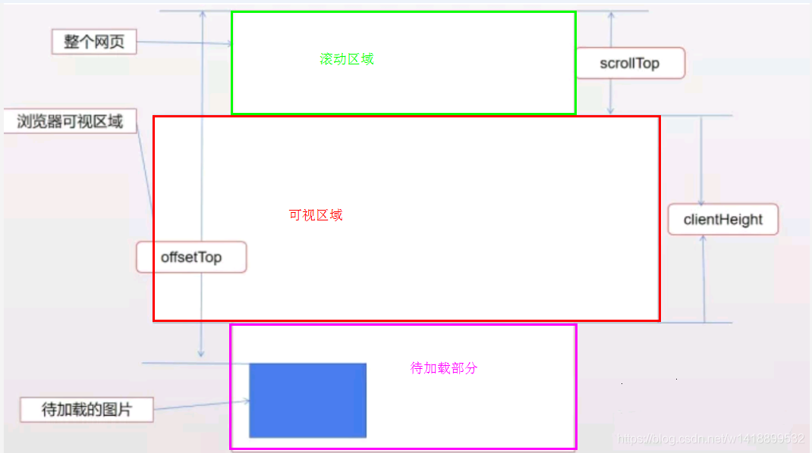

<!-- START doctoc generated TOC please keep comment here to allow auto update -->
<!-- DON'T EDIT THIS SECTION, INSTEAD RE-RUN doctoc TO UPDATE -->
**Table of Contents**  *generated with [DocToc](https://github.com/thlorenz/doctoc)*

- [图片懒加载](#%E5%9B%BE%E7%89%87%E6%87%92%E5%8A%A0%E8%BD%BD)
  - [1. 参考资料](#1-%E5%8F%82%E8%80%83%E8%B5%84%E6%96%99)
  - [2. 基本原理](#2-%E5%9F%BA%E6%9C%AC%E5%8E%9F%E7%90%86)
  - [3. 代码实现](#3-%E4%BB%A3%E7%A0%81%E5%AE%9E%E7%8E%B0)

<!-- END doctoc generated TOC please keep comment here to allow auto update -->

# 图片懒加载

## 1. 参考资料

1. [原生JS实现图片懒加载(lazyload)](https://segmentfault.com/a/1190000009755157)
2. [js实现图片懒加载原理](https://blog.csdn.net/w1418899532/article/details/90515969)
3. [图片懒加载原理及实现](https://www.jianshu.com/p/8e2a73638153)

## 2. 基本原理

1. 懒加载就是将不关键的资源延后加载。

2. 懒加载的原理就是只加载自定义区域（通常是可视区域，但也可以是即将进入可视区域）内需要加载的东西。对于图片来说，先设置图片标签的 src 属性为一张占位图，将真实的图片资源放入一个自定义属性（`data-*`）中，当进入自定义区域时，就将自定义属性替换为 src 属性，这样图片就会去下载资源，实现了图片懒加载。

3. 这里有几个关键点：
   - 判断未加载的图片是否进入可视区域
   - 将真正的图片资源的地址放入 `data-src` 中
   - 已经加载过的图片避免重复加载
   - 监听 window 的 scroll 事件来判断是否需要加载图片，因为 scroll 事件会被频繁触发，所以需要节流函数来保证性能

## 3. 代码实现

1. html 结构：
   ```html
      <div class="container">
        
        
        
        
        
        
        
        
        
        
        
        
        
        
        
        
        
        
        
        
    </div>
   ```

2. `img` 标签中的 `src` 中的图片链接是占位图片链接，而 `data-scr` 才是真正图片链接。

3. 判断图片进入可视区域方法一：
   - 借用一张图片。来说明什么是可视区域：
     
   - 对几个属性进行说明：
     - `document.documentElement.clientHeight` 
     - `element.offsetTop` 获取元素相对于文档顶部的距离
     - `document.documentElement.scrollTop` 获取浏览器窗口顶部与文档顶部之间的距离，也就是滚动条滚动的距离
   - 附几个常见的同元素位置、滚动距离相关的属性：
     - 网页可见区域宽： `document.body.clientWidth`
     - 网页可见区域高： `document.body.clientHeight`
     - 网页可见区域宽： `document.body.offsetWidth` (包括边线的宽);
     - 网页可见区域高： `document.body.offsetHeight` (包括边线的宽);
     - 网页正文全文宽： `document.body.scrollWidth`
     - 网页正文全文高： `document.body.scrollHeight`
     - 网页被卷去的高： `document.body.scrollTop`
     - 网页被卷去的左： `document.body.scrollLeft`
     - 网页正文部分上：` window.screenTop`
     - 网页正文部分左： `window.screenLeft`
     - 屏幕分辨率的高： `window.screen.height`
     - 屏幕分辨率的宽： `window.screen.width`
     - 屏幕可用工作区高度： `window.screen.availHeight`
     - 屏幕可用工作区宽度：`window.screen.availWidth`
     - 更详细的请看：
       - [JavaScript学习笔记之 document.body.scrollTop用法](https://blog.csdn.net/jiabin_xu/article/details/80537089)
       - [offsettop及相关属性介绍](https://www.jianshu.com/p/135731ec13f1)
       - [html中offsetTop、clientTop、scrollTop、offsetTop各属性](https://www.cnblogs.com/firstdream/p/5497145.html)
   - 当图片相对于文档顶部的距离小于等于浏览器窗口顶部与文档顶部之间的距离和屏幕可视窗口高度这二者之和的时候，也就是 offsetTop <= clientHeight + scrollTop 时，说明图片马上就要进入可视区域了，所以，临界条件就是：offsetTop <= clientHeight + scrollTop。


4. 判断图片进入可视区域方法二：
   - 使用元素的 `getBoundingClientRect()`，这个方法可以获取元素的宽高以及相对于窗口的位置。MDN 的介绍如下：
     > The Element.getBoundingClientRect() method returns the size of an element and its position relative to the viewport.

    - 这个方法返回一个名为 ClientRect 的 DOMRect 对象，包含了 top、right、botton、left、width、height 这些值。

5. 节流函数
   - 使用一个定时器来延迟执行 scroll 的事件处理函数。

6. 代码实现：
   ```javascript
    
      // 页面初始化的时候，加载可视区域的图片
      start();
      // 用来清除定时器
      let timer;

      
      window.onscroll = function () {
          
          if (timer) {
              clearTimeout（timer);
          }
          // 节流。只有两次触发 scroll 事件的间隔大于 300 ms，才会执行懒加载函数
          timer = setTimeout(function () {
              start();
          }, 300);
      }

      
    
      function start() {
          const imgList = document.querySelectorAll('.container img');

          imgList.forEach(img => {
              const loaded = img.dataset.loaded;
              if (!loaded || loaded !== '1') {
                    // 没有 loaded 这个属性的才能加载
                    if (isShow(img)) {
                        lazyLoad(img);
                    }
              }
          })
      }

      /**
        * 判断图片是否进入可视区域
        * @param img
        * @returns {boolean}
        */
      function isShow(img) {
          // 可视区域宽度
          let h = window.innerHeight;
		  // 滚动区域高度
		  let s = document.documentElement.scrollTop || document.body.scrollTop; 
          
          // 当前元素到文档顶部的距离
          let fullHeight = img.offsetTop;

          return h + s >= fullHeight;
      }
      

       /**
         * 加载图片
         * @param img
         */
      function lazyLoad(img) {
          // 
          let src = img.dataset.src;
    
          img.setAttribute('src', src);
          // 避免重复加载已经加载的图片，设置一个属性，标识已经加载过的图片，下次只加载未加载过的图片
          img.setAttribute('data-loaded', 1);
      }
      
   ```