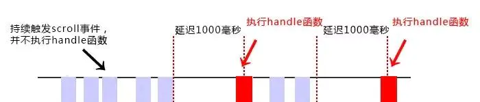
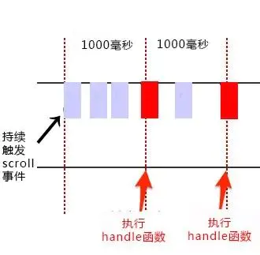

<!-- START doctoc generated TOC please keep comment here to allow auto update -->
<!-- DON'T EDIT THIS SECTION, INSTEAD RE-RUN doctoc TO UPDATE -->
**Table of Contents**  *generated with [DocToc](https://github.com/thlorenz/doctoc)*

- [防抖与节流](#%E9%98%B2%E6%8A%96%E4%B8%8E%E8%8A%82%E6%B5%81)
  - [1. 基本说明](#1-%E5%9F%BA%E6%9C%AC%E8%AF%B4%E6%98%8E)
  - [2. 防抖（debounce）](#2-%E9%98%B2%E6%8A%96debounce)
  - [3. 节流（throttle）](#3-%E8%8A%82%E6%B5%81throttle)

<!-- END doctoc generated TOC please keep comment here to allow auto update -->

# 防抖与节流

## 1. 基本说明

1. 防抖（debounce）与节流（throttle）都是用来优化页面、提高性能的。

2. 应用场景就是短时间内频繁触发某些事件，如果每一次触发都去响应，则会占用内存，影响页面性能，使得页面失去响应。所以，我们不能每一次触发事件都去响应，而是使用定时器，延迟事件处理函数的响应。

3. 防抖与节流的区别：
   - 防抖的思路是，设定一个时间间隔，一旦触发事件，定时器开始计时，在规定的时间间隔内，一旦新的事件被触发，则立即重新开始计时。如果在这个间隔内没有事件触发，则计时时间到，执行函数。
   - 节流的思路是，设定一个时间间隔，一旦触发事件，定时器开始计时，在规定的时间间隔内，无论触发多少次事件，都不响应，计时时间到，执行函数。
   - 防抖要求两次触发事件的时间大于指定的时间间隔。而节流则是指定的时间内只触发一次事件。

4. 参考资料：
   - [浅谈 JS 防抖和节流](https://segmentfault.com/a/1190000018428170)
   - [JS的防抖与节流](https://juejin.cn/post/6844903618827517965)
   - [函数防抖和节流](https://www.jianshu.com/p/c8b86b09daf0)

## 2. 防抖（debounce）

1. 当持续触发事件时，一定时间段内没有再触发事件，事件处理函数才会执行一次，如果设定的时间到来之前，又一次触发了事件，就重新开始延时。如下图，持续触发 scroll 事件时，并不执行 handle 函数，当 1000 毫秒内没有触发 scroll 事件时，才会延时触发 scroll 事件。
   

2. 代码实现
   ```javascript
      /**
        * 防抖函数
        * @param fn
        * @param delay
        * @returns {function(...[*]=)}
        */
       function debounce(fn, delay = 300) {
           let timer;

           return function () {
           // 获取 this 和 参数，是为了让 debounce 函数最终返回的函数 this 指向不变以及依旧能接受到 event 参数
           // 这样在事件处理函数的内部使用 this，指向还是发生事件的元素
              const context = this;
              const args = arguments;

              if (timer) {
                 clearTimeout(timer);
              }
              // 
              timer = setTimeout(function () {
                      fn.apply(context, args);
              }, delay);
           }
        }
   ```
3. 实现防抖的关键点在于使用闭包，保留一个 timer 参数，用来记录定时器是否启动，如果定时器启动，就清除定时器，否则启动新的定时器。

4. 还要注意获得 this 和 参数，这样可以保证 debounce 函数最终返回的函数 this 指向不变以及依旧能接受到 event 参数。在事件处理函数的内部使用 this，指向还是发生事件的元素。

5. 具体应用：
   ```html
      <!DOCTYPE html>
      <html lang="en">
      <head>
         <meta charset="UTF-8">
         <title>防抖 - Debounce</title>
         <style>
             .container {
                 width: 300px;
                 height: 300px;
                 background-color: yellowgreen;
                 text-align: center;
                 color: #666;
                 vertical-align: middle;
            }
        </style>
      </head>
      <body>
          <div class="container"></div>
          <div class="btn">
              <button id="submit-btn">提交</button>
          </div>
          <script>
              const ele = document.querySelector('.container');
              const btn = document.querySelector('#submit-btn');

              function debounce(fn, delay = 300) {
                  let timer;

                  return function () {
                      const context = this;
                      const args = arguments;
                      if (timer) {
                          clearTimeout(timer);
                      }
                      timer = setTimeout(function () {
                          fn.apply(context, args);
                      }, delay);

                  }
               }

             let num = 0;
             function count(e) {
                 console.log(this);
                 num++;
                 ele.innerHTML = `Debounce，点击了 ${num} 次`;

             }

             let debounceFn = debounce(count, 1000);

             // ele.addEventListener('mouseover', debounceFn);
             btn.addEventListener('click', debounceFn)
         </script>
      </body>
      </html>
   ```


## 3. 节流（throttle）

1. 当持续触发事件时，保证一定时间段内只调用一次事件处理函数。节流通俗解释就比如我们水龙头放水，阀门一打开，水哗哗的往下流，秉着勤俭节约的优良传统美德，我们要把水龙头关小点，最好是如我们心意按照一定规律在某个时间间隔内一滴一滴的往下滴。如下图，持续触发 scroll 事件时，并不立即执行 handle 函数，每隔 1000 毫秒才会执行一次 handle 函数。
   

2. 节流要求一定时间间隔内只触发一次函数，所以有两种实现方案。使用定时器计时实现。

3. 代码实现：
   ```javascript
      function throttle(fn, delay = 300) {
          let timer;
          return function () {
              const context = this;
              const args = arguments;

              if (!timer) {
                  timer = setTimeout(function () {
                      // 定时时间到，清空定时器 id，方便下次启动定时器
                      timer = null;
                      fn.apply(context, args);
                  }, delay)
              }
          }
      }
   ```
4. 实际应用：
   ```html
      <!DOCTYPE html>
      <html lang="en">
      <head>
         <meta charset="UTF-8">
         <title>节流 - Throttle</title>
         <style>
             .container {
                 width: 300px;
                 height: 300px;
                 background-color: yellowgreen;
                 text-align: center;
                 color: #666;
                 vertical-align: middle;
            }
        </style>
      </head>
      <body>
          <div class="container"></div>
          <div class="btn">
              <button id="submit-btn">提交</button>
          </div>
          <script>
              const ele = document.querySelector('.container');
              const btn = document.querySelector('#submit-btn');

              /**
                * 定时器版本的节流函数
                * @param fn
                * @param delay
                * @returns {function(...[*]=)}
                */
               function throttle(fn, delay = 300) {
                   let timer;
                   return function () {
                       const context = this;
                       const args = arguments;

                       if (!timer) {
                           timer = setTimeout(function () {
                               timer = null;
                               fn.apply(context, args);
                           }, delay);
                       }
                   }
               }

             let num = 0;
             function count(e) {
                 console.log(this);
                 num++;
                 ele.innerHTML = `Debounce，点击了 ${num} 次`;

             }

             let debounceFn = debounce(count, 1000);

             // ele.addEventListener('mouseover', debounceFn);
             btn.addEventListener('click', debounceFn)
         </script>
      </body>
      </html>
   ```