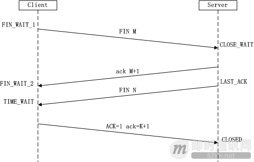
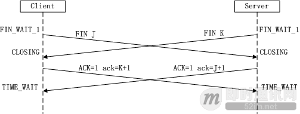

<!-- START doctoc generated TOC please keep comment here to allow auto update -->
<!-- DON'T EDIT THIS SECTION, INSTEAD RE-RUN doctoc TO UPDATE -->
**Table of Contents**  *generated with [DocToc](https://github.com/thlorenz/doctoc)*

- [TCP 和 UDP](#tcp-%E5%92%8C-udp)
  - [1. TCP](#1-tcp)
    - [1. TCP 基本介绍](#1-tcp-%E5%9F%BA%E6%9C%AC%E4%BB%8B%E7%BB%8D)
    - [2. TCP 三次握手](#2-tcp-%E4%B8%89%E6%AC%A1%E6%8F%A1%E6%89%8B)
    - [3. TCP 四次挥手](#3-tcp-%E5%9B%9B%E6%AC%A1%E6%8C%A5%E6%89%8B)
    - [4. 为什么建立连接需要三次握手？](#4-%E4%B8%BA%E4%BB%80%E4%B9%88%E5%BB%BA%E7%AB%8B%E8%BF%9E%E6%8E%A5%E9%9C%80%E8%A6%81%E4%B8%89%E6%AC%A1%E6%8F%A1%E6%89%8B)
  - [2. UDP](#2-udp)

<!-- END doctoc generated TOC please keep comment here to allow auto update -->

# TCP 和 UDP

## 1. TCP

### 1. TCP 基本介绍

1. 参考资料
   - [TCP协议详解](https://juejin.cn/post/6844903685563105293)
   - [TCP 为什么是三次握手，而不是两次或四次？](https://www.zhihu.com/question/24853633)
   - [理论经典：TCP协议的3次握手与4次挥手过程详解](https://blog.csdn.net/omnispace/article/details/52701752)
   - [TCP协议三次握手过程分析](https://www.cnblogs.com/rootq/articles/1377355.html)
   - [跟着动画来学习TCP三次握手和四次挥手](https://juejin.cn/post/6844903625513238541)
   - [我终于搞懂了TCP的三次握手和四次挥手（图片案例详解）](https://www.pianshen.com/article/2872927776/)

2. TCP 协议全称是传输控制协议（Transmission Control Protocol, TCP），位于第四层 —— 传输层中，该协议基于 IP 协议，同时也是 HTTP 协议的基础。

3. TCP 协议提供面向连接的、可靠的传输服务。
   - 面向连接：传输数据前必须建立连接。
   - 可靠：使用各种方式保证数据能全部传输到目的地。

4. TCP 报文结构：
   

5. 上图中，几个字段需要关注：
   - 序号：Seq 序号，占32位，用来标识从 TCP 源端向目的端发送的字节流，发起方发送数据时对此进行标记。
   - 确认序号：Ack 序号，占32位，只有 ACK 标志位为 1 时，确认序号字段才有效，Ack = Seq + 1。
   - 标志位：共 6 个，即 URG、ACK、PSH、RST、SYN、FIN，具体含义如下：
      - URG：紧急指针（urgent pointer）有效。
      - ACK：确认序号有效。
      - PSH：接收方应该尽快将这个报文交给应用层。
      - RST：重置连接。
      - SYN：发起一个新连接。
      - FIN：释放一个连接。

6. 需要注意的是：
   - 不要将确认序号 Ack 与标志位中的 ACK 搞混了。
   - 确认方 Ack = 发起方 Seq + 1，两端配对。

### 2. TCP 三次握手

1. 建立 TCP 连接要通过三次握手（Three-Way Handshake）的方式。

2. 需要客户端和服务端总共发送 3 个包以确认连接的建立。在 socket 编程中，这一过程由客户端执行 connect 来触发。

3. 图示：
   

4. 建立连接的过程
   
   1. 第一次握手
      client 将标志位 SYN 置为 1，随机产生一个序号 J，即 seq = J。然后 client 进入 SYN_SENT 状态，等待 server 确认。
   
   2. 第二次握手
      server 收到数据包以后，发现标志位 SYN = 1，因此得知这是 client 正在请求建立连接。server 将标志位 SYN 和 ACK 都设置为 1，同时将确认序号 ack 设置为 J + 1。随机产生一个序号 K，即 seq = K。此时 server 进入 SYN_RCVD 状态，

   3. 第三次握手
      client 收到数据包以后，首先检查 ACK 是否为 1，ack 是否为  J + 1，如果都正确，则向 server 发送一个新的数据包，设置 ACK 为 1，同时 ack 为 K + 1。server 收到以后，检查 ACK 是否为 1， ack 是否为 K + 1。如果都正确，则 client 和 server 进入 ESTABLISHED 状态。此时连接正式建立，然后就可以传输数据了。

### 3. TCP 四次挥手

1. 所谓四次挥手（Four-Way Wavehand）即终止TCP连接，就是指断开一个 TCP 连接时，需要客户端和服务端总共发送 4 个包以确认连接的断开。在socket编程中，这一过程由客户端或服务端任一方执行close来触发，整个流程如下图所示：
   
   

2. 由于 TCP 是全双工通信，因此每个方向都要单独关闭。这一原则是当一方完成数据发送任务后，发送一个 FIN 来终止这一方向的连接，收到一个 FIN 只是意味着这一方向上没有数据流动了，即不会再收到数据了，但是在这个 TCP 连接上仍然能够发送数据，直到这一方向也发送了 FIN。首先进行关闭的一方将执行主动关闭，而另一方则执行被动关闭，上图描述的即是如此。

3. 关闭过程：
   1. 第一次挥手
      client 发送一个数据包，设置 FIN 为 M，表示关闭 client 到 server 的数据传输。此时 client 进入 FIN_WAIT_1 状态。

   2. 第二次挥手 
      server 收到数据包后，发现 FIN 为 M，因此向 client 发送一个数据包，设置 ack 为 M + 1，Server 进入 CLOSE_WAIT 状态。

   3. 第三次挥手 
      server 发送一个数据包，设置 FIN 为 N，表示关闭 server 到 client 的数据传输。此时 server 进入 LAST_ACK 状态。

   4. 第四次挥手
      client 收到数据包以后，状态 变为 TIME_WAIT 状态，同时发送一个数据包，设置 ACK 为 1，ack 为 K + 1，server 进入 CLOSED 状态。至此四次挥手完成，TCP 连接正式断开。

4. 上面是一方主动关闭，另一方被动关闭的情况，实际中还会出现同时发起主动关闭的情况，具体流程如下图：
   

### 4. 为什么建立连接需要三次握手？

1. TCP 连接是全双工的，数据在两个方向上能同时传递。

2. 所以要确保双方，同时能发数据和收数据

3. 第一次握手：证明了发送方能发数据

4. 第二次握手：ack 确保了接收方能收数据，SYN 确保了接收方能发数据

5. 第三次握手：确保了发送方能收数据

6. 实际上是四个维度的信息交换，不过中间两步合并为一次握手了。

7. 四次握手浪费，两次握手不能保证“双方同时具备收发功能”

## 2. UDP
