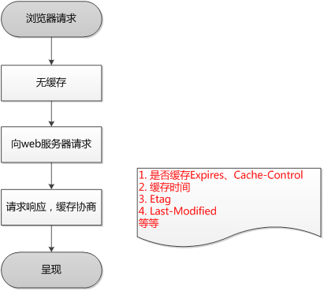

# http - 缓存

## 1. 参考资料

1. [http缓存详解，http缓存推荐方案](https://www.cnblogs.com/echolun/p/9419517.html)
2. [HTTP 缓存机制](https://zhuanlan.zhihu.com/p/58685072)

## 2. 与缓存相关的请求头中的参数

1. `Cache-Control`
   - `no-store` 所有内容都不缓存
   - `no-cache` 缓存，但是浏览器使用缓存前，都会请求服务器判断缓存资源是否是最新，它是个比较高贵的存在，因为它只用不过期的缓存。
   - `max-age=x` (单位秒) 请求缓存后的X秒不再发起请求，属于http1.1属性，与下方Expires(http1.0属性)类似，但优先级要比Expires高。
   - `s-maxage=x` (单位秒) 代理服务器请求源站缓存后的X秒不再发起请求，只对 CDN 缓存有效
   - `public` 客户端和代理服务器 (CDN) 都可缓存
   - `private` 只有客户端可以缓存

2. `Expires`
   - 响应头，代表资源过期时间，由服务器返回提供，GMT 格式日期，是 http1.0 的属性，在与max-age (http1.1) 共存的情况下，优先级要低
    
3. `Last-Modified`
   - 响应头，资源最新修改时间，由服务器告诉浏览器。

4. `if-Modified-Since`
   - 请求头，资源最新修改时间，由浏览器告诉服务器（其实就是上次服务器给的 Last-Modified，请求又还给服务器对比），和 Last-Modified 是一对，它俩会进行对比。

5. `Etag`
   - 响应头，资源标识，由服务器告诉浏览器。

6. `if-None-Match`
   - 请求头，缓存资源标识，由浏览器告诉服务器（其实就是上次服务器给的 Etag），和 Etag 是一对，它两会进行对比。 


## 3. 强缓存

1. 强缓存指的是客户端直接从缓存中读取资源，而不需要向服务器发送请求。在 chrome 控制台的 Network 选项中可以看到该请求返回 200 的状态码，并且 size 显示from disk cache 或 from memory cache 两种（灰色表示缓存）。

2. 与强缓存相关的头部字段：`Expires` 和 `Cache-Control` 中的 `max-age`。`max-age` 的优先级高于 `Expires`。

## 4. 协商缓存

1. 协商缓存指定是不直接从缓存中读取资源，而是先向浏览器发送一个请求，服务器根据请求头中的一些字段判断是否命中协商缓存，如果命中，则返回 304 状态码，并带上新的响应头通知浏览器从缓存中读取资源。如果没有命中，则服务器会返回最新的资源给浏览器。

2. 与协商缓存相关的头部字段：
   - `Last-Modified` 和 `if-Modified-Since`
     - `Last-Modified` 是该资源文件最后一次更改时间,服务器会在响应头里返回
     - 同时浏览器会将这个值保存起来，下一次发送请求时，放到请求头里的 `If-Modified-Since` 里
     - 服务器在接收到后也会比较这两个值，如果相同则命中协商缓存
   - `Etag` 和 `if-None-Match`
     - Etag 是该资源的一种唯一标识，只要资源有变化，`Etag` 就会重新生成。放在响应头中返回给浏览器。
     - 浏览器在下一次加载资源向服务器发送请求时，会将上一次返回的 `Etag`值放到请求头里的 `If-None-Match` 里。
     - 服务器接受到 `If-None-Match` 的值后，会拿来跟该资源文件的 `Etag` 值做比较，如果相同，则表示资源文件没有发生改变，命中协商缓存。
   - 在精确度上，`Etag` 要优于 `Last-Modified`，`Last-Modified` 的时间单位是秒，如果某个文件在 1 秒内改变了多次，那么他们的 `Last-Modified` 其实并没有体现出来修改，但是 `Etag` 每次都会改变确保了精度
   - 在性能上，`Etag` 要逊于 `Last-Modified`，毕竟 `Last-Modified` 只需要记录时间，而 `Etag` 需要服务器通过算法来计算出一个 hash 值。
   - 在优先级上，服务器校验优先考虑 `Etag`。

## 3. 浏览器请求缓存过程

1. 浏览器第一次加载资源，服务器返回200，浏览器将资源文件从服务器上请求下载下来，并把请求头（包括 `Etag`、`Last-Modified`）及该请求的返回时间(要与 `Cache-Control`和 `Expires` 对比)一并缓存。

2. 下一次加载资源时，先比较当前时间和上一次返回 200 时的时间差，如果没有超过 Cache-Control 设置的 max-age，则没有过期，命中强缓存，不发请求直接从本地缓存读取该文件（如果浏览器不支持 HTTP1.1，则用 Expires 判断是否过期）。

3. 如果时间过期，则向服务器发送的请求中带有 `If-None-Match` 和 `If-Modified-Since` 的请求。

4. 服务器收到请求后，优先根据 `if-None-Match` 的值判断被请求的文件有没有做修改 ，`if-None-Match` 值一致则没有修改，命中协商缓存，返回 304；如果不一致则有改动，直接返回新的资源文件带上新的 `Etag` 值并返回 200；

5. 如果服务器收到的请求没有 `if-None-Match` 值，则将 `If-Modified-Since` 和被请求文件的最后修改时间做比对，一致则命中协商缓存，返回 304；不一致则返回新的 `last-modified` 和文件并返回 200。

## 4. 用户行为对浏览器缓存的控制

1. 地址栏访问
   - 链接跳转是正常用户行为，将会触发浏览器缓存机制。浏览器发起请求，按照正常流程，本地检查是否过期，或者服务器检查新鲜度，最后返回内容。

2. F5 刷新
   - 浏览器会设置 `max-age=0`，跳过强缓存判断，会进行协商缓存判断。浏览器直接对本地的缓存文件过期，但是会带上`If-Modifed-Since`，`If-None-Match`（如果上一次响应中带 `Last-Modified` 和 `Etag`）这就意味着服务器检查是否是最新的文件，返回结果可能是 304，也有可能是 200。

3. ctrl+F5 强制刷新
   - 跳过强缓存和协商缓存，直接从服务器拉取资源。浏览器不仅会对本地文件过期，而且不会带上 `If-Modifed-Since`，`If-None-Match`，相当于之前从来没有请求过，返回结果是 200。

## 5. 浏览器设置不缓存

1. 对 `Cache-Control` 进行设置：
   `Cache-Control: no-cache, no-store, must-revalidate`

2. 不使用 js 、css 等资源的缓存
   - 在前端工程化的构建过程中，我们给资源名称附加上 MD5，这样资源发生变化，MD5 也跟着发生变化。这样嵌入在 html 页面中资源的名称也会跟着变化。对于浏览器而言，url变了，则需要重新请求资源。这样就实现了浏览器在缓存未过期的情况下请求最新的资源。
   `<link href="./css/style.4e3far45.css">`

3. 设置html页面不让浏览器缓存
   ```html
      <meta http-equiv="pragma" content="no-cache"> 
      <meta http-equiv="Cache-Control" content="no-cache, must-revalidate"> 
      <meta http-equiv="expires" content="Wed, 26 Feb 1997 00:00:00 GMT">
   ```
## 6. 缓存与状态码

1. 缓存与状态码的关系如下图所示：

   状态码|缓存类型|说明
   :---:|:---:|:---:
    200 | from memory cache | 不请求网络资源，资源在内存中，一般脚本、字体、图片会缓存在内存中 
    200|from disk cache | 不请求网络资源，资源在磁盘中，一般非脚本资源会缓存在磁盘中，如 css
    200|资源大小数值|从服务器下载最新的资源
    304|报文大小|请求服务器发现资源没有更新，使用本地缓存

## 7. 浏览器使用缓存的流程

1. 第一次请求资源
   

2. 第二次及后面的请求
   