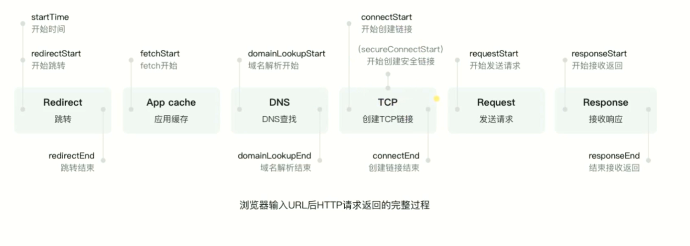
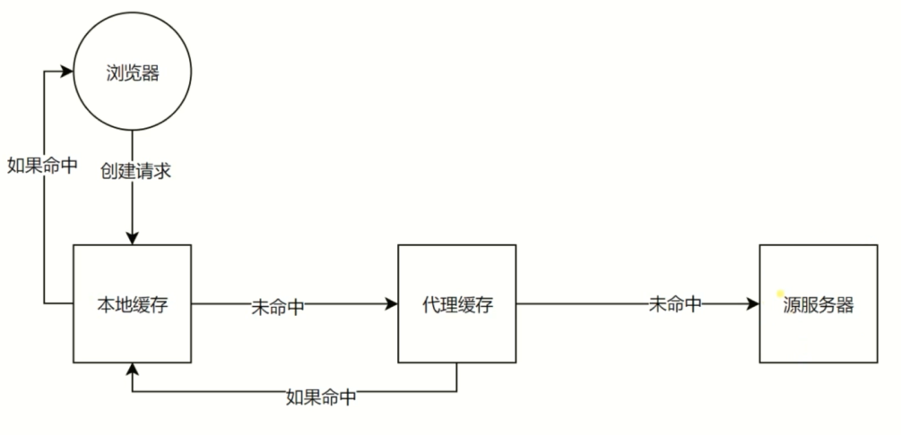
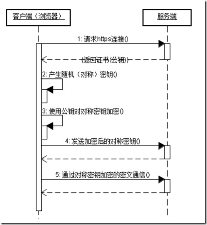

<!-- START doctoc generated TOC please keep comment here to allow auto update -->
<!-- DON'T EDIT THIS SECTION, INSTEAD RE-RUN doctoc TO UPDATE -->
**Table of Contents**  *generated with [DocToc](https://github.com/thlorenz/doctoc)*

- [一、概述](#%E4%B8%80%E6%A6%82%E8%BF%B0)
    - [1. 从输入url，按下回车，到浏览器最终显示界面，都经历了什么？](#1-%E4%BB%8E%E8%BE%93%E5%85%A5url%E6%8C%89%E4%B8%8B%E5%9B%9E%E8%BD%A6%E5%88%B0%E6%B5%8F%E8%A7%88%E5%99%A8%E6%9C%80%E7%BB%88%E6%98%BE%E7%A4%BA%E7%95%8C%E9%9D%A2%E9%83%BD%E7%BB%8F%E5%8E%86%E4%BA%86%E4%BB%80%E4%B9%88)
- [二、HTTP协议基础及发展历史](#%E4%BA%8Chttp%E5%8D%8F%E8%AE%AE%E5%9F%BA%E7%A1%80%E5%8F%8A%E5%8F%91%E5%B1%95%E5%8E%86%E5%8F%B2)
  - [1. 5 层网络模型简介](#1-5-%E5%B1%82%E7%BD%91%E7%BB%9C%E6%A8%A1%E5%9E%8B%E7%AE%80%E4%BB%8B)
    - [1. http 协议是基于 TCP 协议构建的应用层协议。](#1-http-%E5%8D%8F%E8%AE%AE%E6%98%AF%E5%9F%BA%E4%BA%8E-tcp-%E5%8D%8F%E8%AE%AE%E6%9E%84%E5%BB%BA%E7%9A%84%E5%BA%94%E7%94%A8%E5%B1%82%E5%8D%8F%E8%AE%AE)
    - [2. 5层的计算机网络模型](#2-5%E5%B1%82%E7%9A%84%E8%AE%A1%E7%AE%97%E6%9C%BA%E7%BD%91%E7%BB%9C%E6%A8%A1%E5%9E%8B)
    - [3. 物理层、数据链路层、网络层的作用](#3-%E7%89%A9%E7%90%86%E5%B1%82%E6%95%B0%E6%8D%AE%E9%93%BE%E8%B7%AF%E5%B1%82%E7%BD%91%E7%BB%9C%E5%B1%82%E7%9A%84%E4%BD%9C%E7%94%A8)
    - [4. 传输层](#4-%E4%BC%A0%E8%BE%93%E5%B1%82)
    - [5. 应用层](#5-%E5%BA%94%E7%94%A8%E5%B1%82)
  - [2. http协议发展历史](#2-http%E5%8D%8F%E8%AE%AE%E5%8F%91%E5%B1%95%E5%8E%86%E5%8F%B2)
    - [1. http/0.9](#1-http09)
    - [2. http/1.0](#2-http10)
    - [3. http/1.1](#3-http11)
    - [4. http/2](#4-http2)
      - [1. 二进制分帧](#1-%E4%BA%8C%E8%BF%9B%E5%88%B6%E5%88%86%E5%B8%A7)
      - [2. 多路复用（Multiplexing）](#2-%E5%A4%9A%E8%B7%AF%E5%A4%8D%E7%94%A8multiplexing)
      - [3. 头部压缩（Header Compression）](#3-%E5%A4%B4%E9%83%A8%E5%8E%8B%E7%BC%A9header-compression)
      - [4. 服务端推送（Server Push）](#4-%E6%9C%8D%E5%8A%A1%E7%AB%AF%E6%8E%A8%E9%80%81server-push)
  - [3. TCP三次握手](#3-tcp%E4%B8%89%E6%AC%A1%E6%8F%A1%E6%89%8B)
  - [4. URI、URL和URN](#4-uriurl%E5%92%8Curn)
    - [1. URI](#1-uri)
    - [2. URL](#2-url)
    - [3. URN](#3-urn)
  - [5. http报文格式](#5-http%E6%8A%A5%E6%96%87%E6%A0%BC%E5%BC%8F)
    - [1. 请求报文](#1-%E8%AF%B7%E6%B1%82%E6%8A%A5%E6%96%87)
    - [2. 响应报文](#2-%E5%93%8D%E5%BA%94%E6%8A%A5%E6%96%87)
    - [3. http方法](#3-http%E6%96%B9%E6%B3%95)
    - [4. http状态码](#4-http%E7%8A%B6%E6%80%81%E7%A0%81)
- [三、HTTP各种特性总览](#%E4%B8%89http%E5%90%84%E7%A7%8D%E7%89%B9%E6%80%A7%E6%80%BB%E8%A7%88)
  - [1. 跨域](#1-%E8%B7%A8%E5%9F%9F)
    - [1. JSONP](#1-jsonp)
    - [2. CORS](#2-cors)
    - [3. CORS预请求](#3-cors%E9%A2%84%E8%AF%B7%E6%B1%82)
      - [1. 简单请求](#1-%E7%AE%80%E5%8D%95%E8%AF%B7%E6%B1%82)
      - [2. 非简单请求](#2-%E9%9D%9E%E7%AE%80%E5%8D%95%E8%AF%B7%E6%B1%82)
  - [4. 缓存头Cache-Control的含义和使用](#4-%E7%BC%93%E5%AD%98%E5%A4%B4cache-control%E7%9A%84%E5%90%AB%E4%B9%89%E5%92%8C%E4%BD%BF%E7%94%A8)
    - [1. 可缓存性](#1-%E5%8F%AF%E7%BC%93%E5%AD%98%E6%80%A7)
    - [2. 到期](#2-%E5%88%B0%E6%9C%9F)
    - [3. 重新验证](#3-%E9%87%8D%E6%96%B0%E9%AA%8C%E8%AF%81)
    - [4. 其他](#4-%E5%85%B6%E4%BB%96)
    - [5. 如何解决在缓存未失效的情况下，浏览器能够请求到最新的资源？](#5-%E5%A6%82%E4%BD%95%E8%A7%A3%E5%86%B3%E5%9C%A8%E7%BC%93%E5%AD%98%E6%9C%AA%E5%A4%B1%E6%95%88%E7%9A%84%E6%83%85%E5%86%B5%E4%B8%8B%E6%B5%8F%E8%A7%88%E5%99%A8%E8%83%BD%E5%A4%9F%E8%AF%B7%E6%B1%82%E5%88%B0%E6%9C%80%E6%96%B0%E7%9A%84%E8%B5%84%E6%BA%90)
  - [5. 缓存验证 Last-Modified 和 Etag 的使用](#5-%E7%BC%93%E5%AD%98%E9%AA%8C%E8%AF%81-last-modified-%E5%92%8C-etag-%E7%9A%84%E4%BD%BF%E7%94%A8)
    - [1. 资源验证](#1-%E8%B5%84%E6%BA%90%E9%AA%8C%E8%AF%81)
    - [2. 验证头](#2-%E9%AA%8C%E8%AF%81%E5%A4%B4)
      - [1. Last-Modified](#1-last-modified)
      - [2. Etag](#2-etag)
    - [3. 强缓存](#3-%E5%BC%BA%E7%BC%93%E5%AD%98)
    - [4. 协商缓存](#4-%E5%8D%8F%E5%95%86%E7%BC%93%E5%AD%98)
      - [1. 协商缓存具体过程](#1-%E5%8D%8F%E5%95%86%E7%BC%93%E5%AD%98%E5%85%B7%E4%BD%93%E8%BF%87%E7%A8%8B)
    - [5. 一些问题总结](#5-%E4%B8%80%E4%BA%9B%E9%97%AE%E9%A2%98%E6%80%BB%E7%BB%93)
  - [6. Cookie](#6-cookie)
    - [1. Cookie的基本说明](#1-cookie%E7%9A%84%E5%9F%BA%E6%9C%AC%E8%AF%B4%E6%98%8E)
    - [2. Cookie的基本属性](#2-cookie%E7%9A%84%E5%9F%BA%E6%9C%AC%E5%B1%9E%E6%80%A7)
    - [3. Cookie 的 Domain 与 Path 属性](#3-cookie-%E7%9A%84-domain-%E4%B8%8E-path-%E5%B1%9E%E6%80%A7)
      - [1. Domain](#1-domain)
      - [2. Path](#2-path)
  - [7. http长连接](#7-http%E9%95%BF%E8%BF%9E%E6%8E%A5)
    - [1. 短连接](#1-%E7%9F%AD%E8%BF%9E%E6%8E%A5)
    - [3. 流水线](#3-%E6%B5%81%E6%B0%B4%E7%BA%BF)
  - [8. 数据协商](#8-%E6%95%B0%E6%8D%AE%E5%8D%8F%E5%95%86)
    - [2. 请求](#2-%E8%AF%B7%E6%B1%82)
    - [3. 响应](#3-%E5%93%8D%E5%BA%94)
  - [9. content-type 详解](#9-content-type-%E8%AF%A6%E8%A7%A3)
    - [1. 基本说明](#1-%E5%9F%BA%E6%9C%AC%E8%AF%B4%E6%98%8E)
    - [2. 常见的 content-type](#2-%E5%B8%B8%E8%A7%81%E7%9A%84-content-type)
    - [3. 与 post 请求相关的 content-type](#3-%E4%B8%8E-post-%E8%AF%B7%E6%B1%82%E7%9B%B8%E5%85%B3%E7%9A%84-content-type)
      - [1.  表单提交的 content-type](#1--%E8%A1%A8%E5%8D%95%E6%8F%90%E4%BA%A4%E7%9A%84-content-type)
      - [2. 上传文件的 content-type](#2-%E4%B8%8A%E4%BC%A0%E6%96%87%E4%BB%B6%E7%9A%84-content-type)
      - [3. 访问接口常用的 content-type](#3-%E8%AE%BF%E9%97%AE%E6%8E%A5%E5%8F%A3%E5%B8%B8%E7%94%A8%E7%9A%84-content-type)
  - [10. content-disposition 详解](#10-content-disposition-%E8%AF%A6%E8%A7%A3)
  - [10. Redirect（重定向）](#10-redirect%E9%87%8D%E5%AE%9A%E5%90%91)
    - [1. 301](#1-301)
    - [2. 302](#2-302)
- [四、https](#%E5%9B%9Bhttps)
  - [1. 参考资料](#1-%E5%8F%82%E8%80%83%E8%B5%84%E6%96%99)
  - [2. http 存在的问题](#2-http-%E5%AD%98%E5%9C%A8%E7%9A%84%E9%97%AE%E9%A2%98)
  - [3. https 详解](#3-https-%E8%AF%A6%E8%A7%A3)
  - [4. https 的通信过程](#4-https-%E7%9A%84%E9%80%9A%E4%BF%A1%E8%BF%87%E7%A8%8B)
  - [4. https 的一些缺点](#4-https-%E7%9A%84%E4%B8%80%E4%BA%9B%E7%BC%BA%E7%82%B9)
- [五、Nginx代理以及面向未来的HTTP](#%E4%BA%94nginx%E4%BB%A3%E7%90%86%E4%BB%A5%E5%8F%8A%E9%9D%A2%E5%90%91%E6%9C%AA%E6%9D%A5%E7%9A%84http)
  - [1. 学习资料](#1-%E5%AD%A6%E4%B9%A0%E8%B5%84%E6%96%99)
  - [2. Nginx 基本命令](#2-nginx-%E5%9F%BA%E6%9C%AC%E5%91%BD%E4%BB%A4)
  - [3. 基本配置](#3-%E5%9F%BA%E6%9C%AC%E9%85%8D%E7%BD%AE)

<!-- END doctoc generated TOC please keep comment here to allow auto update -->

# 一、概述

### 1. 从输入url，按下回车，到浏览器最终显示界面，都经历了什么？



# 二、HTTP协议基础及发展历史

## 1. 5 层网络模型简介

### 1. http 协议是基于 TCP 协议构建的应用层协议。

### 2. 5层的计算机网络模型

1. 从上到下分别是：
   - 应用层
   - 运输层
   - 网络层
   - 数据链路层
   - 物理层  

### 3. 物理层、数据链路层、网络层的作用

1. 物理层  
  定义物理设备如何传输数据。

2. 数据链路层  
  在通信的实体间建立数据链路的连接。

3. 网络层  
  在节点之间传输创建逻辑链路。

### 4. 传输层

1. 向用户提供可靠的端到端（End-to-End）的服务。  
传输层向高层屏蔽了下层数据通信的细节。  

2. 最重要的两个协议：TCP协议和UDP协议。

### 5. 应用层

1. 为软件提供很多服务。  

2. 构建于TCP协议之上。  

3. 屏蔽网络传输相关细节。

## 2. http协议发展历史

### 1. http/0.9

1. http 协议的第一个版本。

2. 只有一个命令 GET。

3. 没有 HEADER 等描述数据的信息。

4. 服务器发送完毕，就关闭TCP连接。

### 2. http/1.0

1. 增加了很多命令，如 post、put 等。  

2. 增加了status code 和 header。  

3. 多字符集支持、多部分发送、权限、缓存等。

### 3. http/1.1

1. 持久连接。创建TCP连接后，数据发送完成，但是连接不关闭，我们可以发送多次 http 请求。  

2. pipeline。在一个 TCP 连接中可以同时发送多个 http 请求，但是服务器在处理请求的过程是按照顺序处理并返回的。也就是发送请求是并行，处理并返回数据是串行。 

3. 增加了 host 和其他的命令。host 表示在同一台物理服务器上，我们要请求哪一个软件层次的服务，比如说是 java 服务或是 node 服务。


### 4. http/2

1. 参考资料
   - [HTTP/2 相比 1.0 有哪些重大改进？](https://www.zhihu.com/question/34074946)
   - [什么是http2.0？](https://blog.csdn.net/bjweimengshu/article/details/78940870)

2. http/2 完全兼容 http/1.x。同 http/1.x 相比，http/2 大幅度减少了网络延迟，提高了 web 性能。http/2 演示网站：[HTTP/2 is the future of the Web, and it is here!](https://http2.akamai.com/demo)

3. http/2 的关键点在于：在应用层(HTTP/2)和传输层(TCP or UDP)之间增加一个二进制分帧层。在二进制分帧层中，http/2 会将所有传输的信息分割为更小的消息和帧（frame），并对它们采用二进制格式的编码，其中 http/1.x 的首部信息会被封装到 HEADER frame，而相应的 Request Body 则封装到 DATA frame 里面。

#### 1. 二进制分帧

1. 所有数据以二进制的形式传输。以前的是以文本形式进行传输。  

#### 2. 多路复用（Multiplexing）

1. 同一个TCP连接里面发送多个请求不再需要按照顺序来。并行提高效率。

2. 允许通过单一的 http/2 连接发起多重的请求-响应。

#### 3. 头部压缩（Header Compression）

1. 因为 http/1.x 的头部有大量的信息，而且每次都要重复发送，占用带宽。因此 http/2 对头部信息进行压缩，通信的双方各自缓存一份 header fields 表，避免了头部的重复传输，还减少了传输的数据大小。头部信息压缩目的是减少带宽的占用。

#### 4. 服务端推送（Server Push）

1. 服务端推送能把客户端所需要的资源伴随着 index.html 一起发送到客户端，省去了客户端重复请求的步骤。比如我请求了一个 `style.css` 的样式文件，那么服务器会认为我也需要 `main.js` 这个 js 文件，那么服务器就会主动推送 `main.js` 文件到客户端，而且这个 js 文件可以被浏览器缓存。正因为没有发起请求，建立连接等操作，所以静态资源通过服务端推送的方式可以极大地提升速度。

## 3. TCP三次握手

## 4. URI、URL和URN

### 1. URI

1. 统一资源标识符（Uniform Resource Identifier）。

2. 用来唯一标识互联网上的信息资源，包括URL和URN。

### 2. URL

1. 统一资源定位符（Uniform Resource Location）  

2. 对互联网上的资源进行定位。我的理解：就是告诉你这个资源位于那一台主机的哪个文件夹里面。  

3. 组成： `<协议>://<主机>:<端口>/<路径>`

4. 用的最多的协议是 http 或 https，http 默认端口号是 80。https 的端口默认是 443。

### 3. URN

1. 永久统一资源定位符。  

2. 在资源移动之后还能被找到。  

3. 目前没有非常成熟的使用方案。  

4. 用 URN 来唯一标识一个实体。

## 5. http报文格式

### 1. 请求报文

1. 请求报文的格式如下：
   ```
      起始行  
      首部  
      请求实体
   ```
     
2. 起始行由以下三个部分组成如下：  
   `请求方法 url http版本 ` 
   起始行占据一行，然后换行后，就是首部，首部与实体之间空一行。以实现区分。
   首部主要由一些字段组成。

3. 图示：
   
   

### 2. 响应报文

1. 响应报文的格式如下： 
   ```
      起始行  
      首部  
      响应实体 
   ```
  
2. 起始行由以下三个部分组成如下：  
   `http协议版本 状态码 状态码的原因短语`  
起始行占据一行，然后换行后，就是首部，首部与实体之间空一行。以实现区分。
首部主要由一些字段组成。

3. 图示：
   
   

### 3. http方法

1.用来定义对于资源的操作，主要有：
  - GET  获取
  - POST 修改
  - PUT 上传较大的文件
  - DELETE 删除文件
  - OPTION 查询url支持哪些方法
  - HEAD 获取首部信息

### 4. http状态码

1. 定义服务器对请求的处理结果。

2. 各个区间的CODE的有各自的语义。

3. 好的HTTP服务可以通过状态码判断结果。

# 三、HTTP各种特性总览

## 1. 跨域

### 1. JSONP

1. 原理是利用浏览器请求 js 脚本不受跨域限制实现的。

### 2. CORS

1. 浏览器端，在请求头中加入一个 origin 字段，表示源信息，例如：`Origin: http://localhost:8888`。

2. 服务器端，在响应头中添加 Access-Control-Allow-Origin 字段，值或者为 *，或者一个源信息。例如：`Access-Control-Allow-Origin: '*'` 或者`Access-Control-Allow-Origin: 'http://localhost:8888'`

3. 浏览器会根据响应头中的 Access-Control-Allow-Origin 这个字段来决定是否禁止这次请求：
   - 如果是*或者和请求头中Origin字段的源信息相同，则接收这个响应。
   - 如果没有这个字段，或者是其他源信息，则禁止这次响应。

### 3. CORS预请求

#### 1. 简单请求 

1. 如果请求信息满足以下两个条件，就是简单请求，简单请求不需要预先发送请求，而是直接发送 CORS 请求。具体来说，就是在头信息之中，增加一个 Origin 字段。 

2. 默认允许的方法  
   - GET
   - POST
   - HEAD

3. HTTP的头信息不超出以下几种字段：
   - Accept
   - Accept-Language
   - Content-Language
   - Last-Event-ID
   - Content-Type：只限于三个值：
      - application/x-www-form-urlencoded
      - multipart/form-data
      - text/plain  

4. 如果Origin指定的域名在许可范围内，服务器返回的响应，会多出几个头信息字段：  
      ```javascript
         Access-Control-Allow-Origin: http://localhost:8888
         Access-Control-Allow-Credentials: true
         Access-Control-Expose-Headers: FooBar
         Connection: keep-alive
         Date: Wed, 16 Oct 2019 05:27:49 GMT
         Transfer-Encoding: chunked
      ```
5. 字段说明：
   - Access-Control-Allow-Origin  
      该字段是必须的。它的值要么是请求时Origin字段的值，要么是一个*，表示接受任意域名的请求。
   - Access-Control-Allow-Credentials  
      该字段可选。它的值是一个布尔值，表示是否允许发送Cookie。默认情况下，Cookie不包括在CORS请求之中。设为true，即表示服务器明确许可，Cookie可以包含在请求中，一起发给服务器。这个值也只能设为true，如果服务器不要浏览器发送Cookie，删除该字段即可。
   - Access-Control-Expose-Headers  
      该字段可选。CORS请求时，XMLHttpRequest对象的getResponseHeader()方法只能拿到6个基本字段：Cache-Control、Content-Language、Content-Type、Expires、Last-Modified、Pragma。如果想拿到其他字段，就必须在Access-Control-Expose-Headers里面指定。上面的例子指定，getResponseHeader('FooBar')可以返回FooBar字段的值。

6. CORS 请求默认不发送 Cookie 和 HTTP 认证信息。如果要把 Cookie 发到服务器，一方面要服务器同意，指定Access-Control-Allow-Credentials 字段。 
`Access-Control-Allow-Credentials: true`。

7. 另一方面，开发者必须在AJAX请求中打开withCredentials属性。
      ```javascript
         // ajax配置方法
         var xhr = new XMLHttpRequest();
         xhr.withCredentials = true;
      ```
    
8. 否则，即使服务器同意发送 Cookie，浏览器也不会发送。或者，服务器要求设置 Cookie，浏览器也不会处理。
    但是，如果省略 withCredentials 设置，有的浏览器还是会一起发送 Cookie。这时，可以显式关闭 withCredentials。`xhr.withCredentials = false;`。

9. 需要注意的是，如果要发送Cookie，Access-Control-Allow-Origin就不能设为星号，必须指定明确的、与请求网页一致的域名。同时，Cookie依然遵循同源政策，只有用服务器域名设置的Cookie才会上传，其他域名的Cookie并不会上传，且（跨源）原网页代码中的document.cookie也无法读取服务器域名下的Cookie。  
 
#### 2. 非简单请求 

1. 请求信息不满足以上的两个条件，就是非简单请求。非简单请求是那种对服务器有特殊要求的请求，比如请求方法是PUT或DELETE，或者Content-Type字段的类型是application/json。  

2. 非简单请求的CORS请求，会在正式通信之前，增加一次HTTP查询请求，称为"预检"请求（preflight）。  

3. 浏览器先询问服务器，当前网页所在的域名是否在服务器的许可名单之中，以及可以使用哪些HTTP请求方法和头信息字段。只有得到肯定答复，浏览器才会发出正式的XMLHttpRequest请求，否则就报错。  

4. 例如，使用 fetch 方法发送一个请求，并自定义头部信息。
       ```javascript
         fetch('http://localhost:3000', {
             // 设置请求方法
             method: 'POST',
             // 头部信息
             headers: {
                 'X-Test-Cors': '123'
             }
         }).then() ;
      ```

5. 浏览器发现这是一个非简单请求，就会发送一个预请求，要求服务器可以确认这样的请求。我们可以看一下预请求的头部信息：
   
       ```javascript
       OPTIONS /cors HTTP/1.1
       Access-Control-Request-Headers: x-test-cors
       Access-Control-Request-Method: POST
       Origin: http://localhost:8888
       Referer: http://localhost:8888/
       Sec-Fetch-Mode: no-cors
       User-Agent: Mozilla/5.0 (Windows NT 6.1; Win64; x64) AppleWebKit/537.36 (KHTML, like Gecko) Chrome/76.0.3809.87 Safari/537.36
      ```

6. 这个预请求的方法是Options，表示这个请求是用来询问的。头信息里面，关键字段是Origin，表示请求来自哪个源。 除了Origin字段，"预检"请求的头信息包括两个特殊字段。
   - Access-Control-Request-Method  
     该字段是必须的，用来列出浏览器的CORS请求会用到哪些HTTP方法，上例是POST。
   - Access-Control-Request-Headers  
     该字段是一个逗号分隔的字符串，指定浏览器CORS请求会额外发送的头信息字段，上例是X-Test-Cors。

7. 服务器收到"预检"请求以后，检查了Origin、Access-Control-Request-Method和Access-Control-Request-Headers字段以后，确认允许跨源请求，就可以做出回应。我们的响应头如下：
   
      ```javascript
         Access-Control-Allow-Headers: X-Test-Cors
         Access-Control-Allow-Methods: PUT, DELETE, DELETE
         Access-Control-Allow-Origin: http://localhost:8888
         Connection: keep-alive
         Date: Wed, 16 Oct 2019 03:44:05 GMT
         Transfer-Encoding: chunked
        ```

8. 在上面的响应头中，关键的是Access-Control-Allow-Origin字段，表示http://localhost:8888可以请求数据。该字段也可以设为星号，表示同意任意跨源请求。即`Access-Control-Allow-Origin: *`。  

9. 服务器回应的其他CORS相关字段如下：
  
      ```javascript
          Access-Control-Allow-Headers: X-Test-Cors
          Access-Control-Allow-Methods: PUT, DELETE, DELETE
          Access-Control-Allow-Credentials: true
          Access-Control-Allow-Max-Age: 1728000
      ```     
10. 每个字段的含义如下：
    - Access-Control-Allow-Methods   
      该字段必需，它的值是逗号分隔的一个字符串，表明服务器支持的所有跨域请求的方法。注意，返回的是所有支持的方法，而不单是浏览器请求的那个方法。这是为了避免多次"预检"请求。
    - Access-Control-Allow-Headers  
      如果浏览器请求包括Access-Control-Request-Headers字段，则Access-Control-Allow-Headers字段是必需的。它也是一个逗号分隔的字符串，表明服务器支持的所有头信息字段，不限于浏览器在"预检"中请求的字段。
    - Access-Control-Allow-Credentials    
      该字段与简单请求时的含义相同。
    - Access-Control-Allow-Max-Age    
      该字段可选，用来指定本次预检请求的有效期，单位为秒。上面结果中，有效期是20天（1728000秒），即允许缓存该条回应1728000秒（即20天），在此期间，不用发出另一条预检请求。

11. 一旦服务器通过了"预检"请求，以后每次浏览器正常的CORS请求，就都跟简单请求一样，会有一个Origin头信息字段。服务器的回应，也都会有一个Access-Control-Allow-Origin头信息字段。

12. 经过“预检”之后，浏览器的正常 CORS 请求如下：
      ```javascript
       Origin: http://localhost:8888
       Referer: http://localhost:8888/
       Sec-Fetch-Mode: cors
       User-Agent: Mozilla/5.0 (Windows NT 6.1; Win64; x64) AppleWebKit/537.36 (KHTML, like Gecko) Chrome/76.0.3809.87 Safari/537.36
       X-Test-Cors: 123
      ```
      上面头信息的Origin字段是浏览器自动添加的。  
      同预检的请求头相比，没有了Access-Control-Request-Headers、Access-Control-Request-Methods和Access-Control-Allow-Origin。

13. 而服务器的回应是这样的：
       ```javascript
          Access-Control-Allow-Headers: X-Test-Cors
          Access-Control-Allow-Methods: PUT, DELETE
          Access-Control-Allow-Origin: http://localhost:8888
          Connection: keep-alive
          Date: Wed, 16 Oct 2019 04:47:45 GMT
          Transfer-Encoding: chunked
       ```

## 4. 缓存头Cache-Control的含义和使用

### 1. 可缓存性

1. 可缓存性指的是哪些地方可以进行缓存，主要的值有：
    - public  
    客户端和代理服务器(CDN)都可缓存，任何请求经过的地方都可缓存。
    - private  
    只有发起请求的客户端可以缓存
    - no-Cache  
    缓存，但是浏览器使用缓存前，都会请求服务器判断缓存资源是否是最新，它是个比较高贵的存在，因为它只用不过期的缓存。

### 2. 到期

1. 指的是经过多长时间，缓存过期。主要的值有：
  - max-age = `seconds`  
  请求缓存后的X秒不再发起请求，属于http1.1属性，与Expires(http1.0属性)类似，但优先级要比Expires高
  - s-maxage = `seconds`  
  代理服务器请求源站缓存后的X秒不再发起请求，只对CDN缓存有效。客户端依旧会读取max-age。
  - max-stale = `seconds`  
  发起请求一方主动携带的头部信息，表示即便缓存过期，但是没有超过max-stale的设定的时间，依旧可以使用过期的缓存而不用向服务器重新请求。但是我们在浏览器用不到。因为我们通常不会主动设置过期时间。而这个max-stale在服务器端设置无效。

### 3. 重新验证

1. 我的理解是，缓存设置时间max-age到期后，就要重新想源服务器请求新的数据。

2. must-revalidate  
   缓存到期后，客户端必须重新向源服务器请求数据。

3. proxy-revalidate  
  缓存到期后，缓存服务器（代理服务器）必须重新向源服务器请求数据。  

4. 这两个字段不常用。

### 4. 其他

1.  还有 no-store、no-transform 字段。

2. no-store  
   所有内容都不缓存

2. no-transform  
   用在代理服务器上，代理服务器可能资源进行压缩等操作，设置了这个字段，表示不允许服务器进行这个操作。

### 5. 如何解决在缓存未失效的情况下，浏览器能够请求到最新的资源？

1.  如果我们的max-age设置的时间很长，那么在这个期间内，浏览器都不会主动发起请求获得最新的资源，但是我们的资源又常常更新，如何让浏览器感受到变化然后能够请求最新的资源呢？

2. 常见的做法是，在前端工程化的构建过程中，我们给资源名称附加上MD5，这样资源发生变化，MD5也跟着发生变化。这样嵌入在html页面中资源的名称也会跟着变化。对于浏览器而言，url变了，则需要重新请求资源。这样就实现了浏览器在缓存未过期的情况下请求最新的资源。

## 5. 缓存验证 Last-Modified 和 Etag 的使用

### 1. 资源验证

1. 浏览器对于资源的请求以及缓存的使用如下图所示：
   

### 2. 验证头

#### 1. Last-Modified  

1. 资源上次修改的时间。 

2. 配合If-Modified-Since或者If-Unmodified-Since使用。

3. last-Modified是服务器传给浏览器的一个字段，表示资源的修改时间。当浏览器发起请求的时候，将- - If-Modified-Since这个字段的属性值设置为资源上次修改的时间（也就是Last-Modified的值），服务器接收到这个字段后，会将If-Modified-Since字段代表的时间同资源最新的修改时间进行比对，如果相同，表示资源没有变化，服务器就告诉浏览器，使用缓存即可，此时返回的状态码是304，表示Not Modified。如果不同，表示资源有变化，服务器会返回给浏览器最新的资源。

#### 2. Etag  

1.  一种更加严格的验证机制。通过数据签名实现验证。通过哈希计算，得到同资源内容相关的唯一标识，只要资源内容发生变化，那么这个唯一标识也会发生变化。  

2. 配合If-Match或者If-Non-Match使用。  

3. Etag由服务器发送给浏览器。发起请求时，浏览器将Etag的值赋给If-Non-Match，发送给服务器，服务会对If-Non-Match代表的标识同Etag进行比对，如果相同，表示资源没有变化，服务器就告诉浏览器，使用缓存即可，此时返回的状态码是304，表示Not Modified。如果不同，表示资源有变化，服务器会返回给浏览器最新的资源。

### 3. 强缓存

1.  浏览器第一次请求数据，服务器除了将资源返回给浏览器之外，还会将缓存规则包含在响应 header 中。  

2. 对于强缓存而言，响应 header 中有两个字段：Expires（过期时间）和 Cache-Control，用来标明失效规则。

3. Expires  
   - 表示过期时间，是 GMT 格式的日期时间字符串。由服务器设置，并发送给浏览器。这个字段是 http 1.0 时期的产物。使用上存在问题，就是浏览器获取的是本地时间，但是本地时间容易被修改，这样就会导致这个过期的时间不准确。

4. Cache-Control
  前面说到了，这里不详细说了。

5. 同时设置了 Expires 和 Cache-Control，Cache-Control 的优先级要高于 Expires。

6. 那么什么是强缓存呢？实际上就是缓存没有过期，我们不需要发送请求，浏览器直接使用本地缓存即可。

### 4. 协商缓存

1. 也就是需要和服务器协商一下，能否使用缓存。

2. 缓存资源的头部的 Cache-Control 字段设置了 no-cache，那么浏览器每次使用缓存前，都要发请求服务器，询问一下能否使用本地缓存，如果能使用，服务器返回 304。如果不能使用，服务器返回最新的资源和和缓存标识给浏览器。

#### 1. 协商缓存具体过程

1. 浏览器第一次请求该资源，服务器将资源和缓存标识传递给浏览器，此时的缓存标识包含 Last-Modified 和 Etag。

2. 如果未命中强缓存，则浏览器会发送请求到服务器。请求头主要包含两个字段：If-Modified-Since 和 If-None-Match。If-Modified-Since 就是上一次服务器返回的 Last-Modified 的值，而 If-None-Match 则是上一次服务器返回的 Etag 的值。

3. 服务器接收到这个请求后，会将请求头中的 If-Modified-Since 同请求资源的最后修改时间（Last-Modified）进行比对：
   - 如果最后修改时间同 If-Modified-Since 表示的时间相同，则说明资源文件没有发生变化，此时服务器返回 304，不返回任何资源。通知浏览器可以继续使用本地缓存。
   - 如果最后修改时间大于 If-Modified-Since 表示的时间，则说明资源文件发生变化，此时服务器返回 200，并携带最新的资源返回。

4. 服务器将请求头中的 If-None-Match 与资源的唯一标识（Etag）进行比对：
   - 相同，则说明资源文件没有发生变化，此时服务器返回304，不返回任何资源。通知浏览器可以继续使用本地缓存。
   - 不同，则说明资源文件发生变化，此时服务器返回200，并携带最新的资源返回。

5. 注意，第3步和第4步是同时进行的。Etag 的优先级高于 Last-Modified。也就是说，优先验证 Etag，没有变化的情况下，才会去验证 Last-Modified。

### 5. 一些问题总结

1. Etag 与 If-None-Match 是一对，值相同，只不过 Etag 是服务器生成并传给浏览器的，而 If-None-Match 则是浏览器传递给服务器的。

2. Last-Modified 和 If-Modified-Since 是一对。Last-Modified 是服务器生成传给浏览器的，而 If-Modified-Since 则是浏览器传递给服务器的。

3. Etag 优先级高于 Last-Modified。具体是这样：
  - 如果同时有 etag 和 last-modified 存在，在发送请求的时候会一次性的发送给服务器，没有优先级，服务器会比较这两个信息（在具体实现上，大多数做法针对这种情况只会比对 etag）。
  - 服务器在输出上，如果输出了 etag 就没有必要再输出 last-modified（实际上大多数情况会都输出）。

4. 既然有了Last-Modified，为什么还要有 Etag？  
  - Last-Modified 存在以下几个问题：
    1. Last-Modified 标注的最后修改只能精确到秒级，如果某些文件在1秒钟以内，被修改多次的话，它将不能准确标注文件的修改时间。
    2. 如果某些文件会被定期生成，当有时内容并没有任何变化，但Last-Modified 却改变了，导致文件没法使用缓存。
    3. 有可能存在服务器没有准确获取文件修改时间，或者与代理服务器时间不一致等情形。
  - Etag 是服务器自动生成或者由开发者生成的对应资源在服务器端的唯一标识符，能够更加准确的控制缓存。Last-Modified 与ETag 是可以一起使用的，服务器会优先验证 ETag，一致的情况下，才会继续比对 Last-Modified，最后才决定是否返回 304。

5. 生成 Etag 的方式  
   - 根据文件的内容、修改时间、大小等生成。

6. 用户行为与缓存
  
  |用户操作|Expires/Cache-Control|Etag/Last-Modified|
  :---:|:---:|:---:
  地址栏回车|有效|有效
  页面链接跳转|有效|有效
  新开窗口|有效|有效
  前进、后退|有效|有效
  F5刷新|无效|有效
  Ctrl+F5刷新|无效|无效
  
## 6. Cookie

### 1. Cookie的基本说明

1. Cookie 通过服务器返回响应头中的 Set-Cookie 设置的。

2. Set-Cookie 是响应头的一个字段，通过这个字段，将 Cookie 保存到浏览器中。

3. 下一次浏览器请求同一个域下的资源时，就会在请求头中带上 Cookie，这样保证在这一次会话中，服务器返回的资源都是属于当前用户的。（保持登录状态、记录了客户的一些行为）

4. Cookie 是一对键值对，可以设置多个。

### 2. Cookie的基本属性

1. max-age 和 expires 设置过期时间。

2. Secure 只在 https 的时候发送。如果当前是 http，则不会发送这个 cookie。

3. 设置了 HttpOnly，表示无法通过 JavaScript 中的 document.cookie 访问。保证了安全性。

4. 禁止通过 JavaScript 访问一些重要的数据，是保证用户数据安全的重要措施。

### 3. Cookie 的 Domain 与 Path 属性

#### 1. Domain

1. Domain：域，表示当前 cookie 所属于哪个域或子域下面。

2. 对于服务器返回的 Set-Cookie 中，如果没有指定 Domain 的值，那么其 Domain 的值是默认为当前所提交的 http 的请求所对应的主域名的。比如访问 `http://www.example.com`，返回一个 cookie，没有指名 domain 值，那么其为值为默认的 www.example.com。

3. 例如，某个 Cookie 属于www.a.com，那么在www.b.com下就无法访问这个 Cookie。还有个域，是 www.test.a.com，作为 a 的二级域名，和 a 应该属于同一个域，应该也可访问这个 Cookie，那么我们可以通过设置 Domian 这个属性，来达到这个目的。

4. 在访问 www.a.com 时，我们在服务器端设  Cookie 的 domain 属性为 a.com，那么所有属于 a.com 域名下的二级、三级域名等都可以访问这个 Cookie。设置方式：`'Set-Cookie': 'abc=123;domian=a.com'`

#### 2. Path

1. Path：路径。Path 表示 Cookie 所在的目录，默认为 `/`，就是根目录。在同一个服务器上有目录如下：`/test/`，`/test/cd/`，`/test/dd/`，现设一个 Cookie1 的 Path 为 `/test/`，Cookie2 的 Path 为 `/test/cd/`，那么 `/test/` 下的所有页面都可以访问到 Cookie1，即 `/test/cd/`，`/test/dd/` 都可以访问 Cookie1。而 `/test/` 和 `/test/dd/` 的子页面不能访问 Cookie2。这是因为 Cookie 只被其 Path 路径下的页面被访问。

2. Path 的值可以是一个目录，或者是一个路径。如果 `http://www.china.com/test/index.html` 建立了一个 Cookie，那么在 `http://www.china.com/test/` 目录里的所有页面，以及该目录下面任何子目录里的页面都可以访问这个 Cookie。这就是说，在`http://www.china.com/test/test2/test3` 里的任何页面都可以访问`http://www.china.com/test/index.html` 建立的 Cookie。

3. 但是如果 `http://www.china.com/test2/` 需要访问`http://www.china.com/test/index.html` 设置的 Cookie，该怎么办？
这时，我们要把 Cookie 的 Path 属性设置成 `/`。在指定路径的时候，凡是来自同一服务器，URL 里有相同路径的所有 WEB 页面都可以共享 Cookie。简单来讲，下面的路径可以访问上面的路径的内容，当  Path 设置为 `/`,则意味着根路径下面都可以访问。


## 7. http长连接  

1. http1.x 有几种连接模式:
   - short-lived connections(短连接) 
   - persistent connections(长连接)
   - HTTP pipelining(HTTP 流水线)

2. 三种连接如下图所示：
    
 -
 ### 1. 短连接  
 
1. 短连接是http 1.0的特性。每一个 HTTP 请求都由它自己独立的连接完成；这意味着发起每一个 HTTP 请求之前都会有一次 TCP 握手，而且是连续不断的。

2.意思是每次发起一个http请求，都要建立一个TCP连接，http请求结束后，TCP连接也会关闭。  
 
3. 缺点：由于建立一次TCP连接耗费时间，所以TCP可以保持更多的热连接来适应负载。短连接破坏了TCP具备的能力，新的冷连接降低了其性能。  

4. 在 HTTP/1.1 中，只有当请求头字段 Connection 被设置为 close 时才会用到这个模型。  
 
 ### 2. 长连接  
 
1. 在 HTTP/1.1 里，默认就是长连接的。  
 
2. 请求头有一个connection字段，默认是keep-alive。意思就是http连接是长连接。   
 
3. 一个长连接会保持一段时间，重复用于发送一系列请求，节省了新建 TCP 连接握手的时间，还可以利用 TCP 的性能增强能力。当然这个连接也不会一直保留着：连接在空闲一段时间后会被关闭(服务器可以使用 Keep-Alive 协议头来指定一个最小的连接保持时间)。  
 
4. 缺点：就算是在空闲状态，它还是会消耗服务器资源，而且在重负载时，还有可能遭受 DoS attacks 攻击。这种场景下，可以使用非长连接，即尽快关闭那些空闲的连接，也能对性能有所提升。  

### 3. 流水线  

1. 默认情况下，HTTP请求是按顺序发出的。下一个请求只有在当前请求收到应答过后才会被发出。由于会受到网络延迟和带宽的限制，在下一个请求被发送到服务器之前，可能需要等待很长时间。  
 流水线是在同一条长连接上发出连续的请求，而不用等待应答返回。这样可以避免连接延迟。理论上讲，性能还会因为两个 HTTP 请求有可能被打包到一个 TCP 消息包中而得到提升。 

 
2. 流水线就是浏览器并行发送http请求，服务器串行发送http响应。

3. chrome浏览器在一个TCP连接上，允许同时发送（并行）6个http连接。

4. http 2.0默认在一个TCP连接上发送所有的http连接（同一域名下）。也就是所谓的信道复用。

5. 在服务器端，如果我们设置响应头中connection字段为close，则关闭长连接，启动短连接。

## 8. 数据协商

1. 浏览器发起请求时，会声明这这一次的请求希望得到的数据格式。服务器收到这一次请求后，会根据请求头信息，决定返回什么格式的数据。

### 2. 请求  

1. 请求头中，有几个字段，用来表示我们希望得到的数据格式。

2. Accept  
   指定希望得到的数据类型。

3. Accept-Encoding  
   数据编码方法，指定服务端如何进行数据的压缩。

4. Accept-Language
   浏览器愿意接受的语言类型。

5. User-Agent  
   客户端信息。

6. Content-Type
   指 http/https 发送信息至服务器时的内容编码类型，Content-Type 用于表明发送数据流的类型，服务器根据编码类型使用特定的解析方式，获取数据流中的数据。

### 3. 响应  

1. 响应头中的一些字段，表明服务端返回的数据格式，  

2. Content-Type  
  与Accept对应，表示本次返回的资源的确切格式。例如：`text/plain`、`image/jpg`。前一个表示主类型，后一个表示分类型。

3. Content-Encoding  
   与Accept-Encoding对应，资源的压缩方式。

4. Content-Language
   与Accept-Language对应，具体支持的语言。

5. X-Content-Type-Options  
   一般是nosniff，设置这个头部，表示不允许浏览器猜测返回的数据格式。主要是提升安全性。

## 9. content-type 详解

### 1. 基本说明

1. 在 http 协议消息头中，使用 `content-type` 来表示请求和响应中的媒体类型信息。它用来告诉服务端如何处理请求的数据，以及告诉客户端（一般是浏览器）如何解析响应的数据，比如显示图片，解析并展示 html 等。

2. `content-type` 的格式：
`content-type：type/subtype ;parameter`

3. `content-type` 的格式的说明：
   - `type`：主类型，任意的字符串，如 `text`，如果是 `*` 号代表所有。
   - `subtype`：子类型，任意的字符串，如 `html`，如果是`*`号代表所有，用 `/` 与主类型隔开。
   - `parameter`：可选参数，如 `charset`，`boundary`等 。

4. `content-type` 举例：
   - `content-type: text/html;`
   - `content-type: application/json;charset=utf-8;`

5. 参考资料
    - [Content-Type 常用对照表](https://tool.oschina.net/commons?type=5%EF%BC%89)
    - [HTTP协议：Content-Type](https://www.cnblogs.com/wangyuxing/p/10037470.html)
    - [Content-Type 类型浅析汇总](https://blog.csdn.net/qappleh/article/details/89015739)

### 2. 常见的 content-type

1. HTML 文档标记：`text/html` 

2. 文本类型标记：`text/plain`

3. css 样式文件标记：`text/css`

4. JavaScript 文件标记：`text/javascript`、`application/javascript` 

5. jpege 图片标记：`image/jpeg`,

6. gif 图片标记： `image/gif`

7. png 图片标记：`image/png`

8. 表单提交：`application/x-www-form-urlencoded`

9. 上传文件：`multipart/form-data`

10. json 数据：`application/json`

11. xml 文件标识：`application/xml`

12. 其中，`text/html`, `text/plain`,` text/css`,` text/javascript`, `image/jpeg`, `image/png`, `image/gif` 是常见的页面资源类型。

13. `application/x-www-form-urlencoded`, `multipart/form-data`, `application/json`, `application/xml` 是常见的 ajax 请求的类型。常用设置表单提交或者上传文件的资源类型。

### 3. 与 post 请求相关的 content-type

#### 1.  表单提交的 content-type

1. 表单提交的 `content-type` 是 `application/x-www-form-urlencoded`  

2. 设置了这个值，表示将表单提交的数据格式化，形式是 `key=value` 的形式。多个使用 `&` 相连。例如：`name=jack&age=25`，与查询字符串的格式相同。将这些内容放到请求实体里面，随着请求一起发送到服务端。

3. **注意**：如果是中文或特殊字符如`/`、`,`、`:` 等会自动进行 uri 转码。不支持文件，一般用于表单提交。

#### 2. 上传文件的 content-type

1. 上传文件的 `content-type` 是 `multipart/form-data` 

2. 代表我们这个请求有多个部分。因为我们有时候上传的是文件，文件不能使用字符串的形式，而是使用二进制的形式。因此，需要将文件分块。  

3. 在请求头中，`content-type` 的值在 `multipart/form-data` 后面，还会添加 `boundary`，值是一个字符串，这个字符的含义是用来分隔文件的。服务器接收到请求后，根据 `boundary` 的值，找打分块的边界，从而将文件拼接起来，形成一个完整的文件。

4. 上传文件的过程中，首先生成了一个 `boundary` 用于分割不同的字段，在请求实体里每个参数以 `------boundary` 开始，然后是附加信息和参数名，然后是空行，最后是参数内容。多个参数将会有多个 `boundary` 块。如果参数是文件会有特别的文件域。最后以 `------boundary–` 为结束标识。

#### 3. 访问接口常用的 content-type

1. 访问接口常用的 `content-type` 是 `application/json`。

2. JSON 是一种轻量级的数据格式，以键-值对（key-value）的方式组织的数据。这个使用这个类型，需要参数本身就是 json 格式的数据，参数会被直接放到请求实体里，不进行任何处理。服务端/客户端会按 json 格式解析数据（约定好的情况下）。

## 10. content-disposition 详解

1. 第一个参数总是固定不变的 form-data；附加的参数不区分大小写，并且拥有参数值，参数名与参数值用等号('=')连接，参数值用双引号括起来。参数之间用分号(';')分隔。

Content-Disposition: form-data
Content-Disposition: form-data; name="fieldName"
Content-Disposition: form-data; name="fieldName"; filename="filename.jpg"


## 10. Redirect（重定向）

1. 浏览器访问一个 url 时，真正的资源并不在这个位置，而是在另外一个位置，所以服务器会返回一个状态码（301 或 302），和一个重定向的链接，浏览器收到这个响应后，跟着状态码和重定向链接，会向新的 url 发起请求。这个过程就是重定向。

### 1. 301

1. 状态码301表示永久重定向。某个url指定的资源已经永久转移到另外一个url上面了。此时需要服务器返回的状态码是301，同时响应头中的location字段的值是目标url。

2. 对于浏览器而言，只有第一次请求，才会发生重定向。因为第一次返回的是状态码是301，所以浏览器会记住location中的url（目标url），后序直接向目标url发起请求。

3. 浏览器会对状态码为301的资源内容进行缓存，缓存的时间是尽可能长，因此，要慎用301。因此一旦使用301，浏览器会进行缓存，如果我后期又更改了重定向的目标url，则客户端在不清理缓存的情况下，是无法获取最新的资源的。

### 2. 302

1. 状态码302表示临时重定向。某个url指定的资源已经临时转移到另外一个url上面了。此时需要服务器返回的状态码是302，同时响应头中的location字段的值是目标url。

2. 对于浏览器而言，每一次请求，都会进行重定向。

# 四、https

## 1. 参考资料

1. [十分钟搞懂HTTP和HTTPS协议？](https://zhuanlan.zhihu.com/p/72616216)

2. [HTTP与HTTPS的区别，详细介绍](https://blog.csdn.net/qq_35642036/article/details/82788421)

3. [看完这篇 HTTPS，和面试官扯皮就没问题了](https://juejin.cn/post/6844904089495535624)

4. [HTTP和HTTPS协议，看一篇就够了](https://blog.csdn.net/xiaoming100001/article/details/81109617)
4. [大前端进阶系列之HTTPS详解](https://juejin.cn/post/6956399640484773901)

4. [「HTTPS」如何通俗易懂的给你讲明白HTTPS？](https://juejin.cn/post/6955767063524671524)

4. [分分钟让你理解HTTPS](https://juejin.cn/post/6844903599303032845)

## 2. http 存在的问题

1. 请求信息明文传输，容易被窃听截取。

2. 数据完整性未被校验，容易被篡改。

3. 没有验证对方身份，存在着冒充身份的危险。

## 3. https 详解

1. 由于 http 存在着安全性的问题，因此发展除了 https 来解决这个问题。

2. https（HyperText Transfer Protocol over Secure Socket Layer） 等于 http + ssl/tsl，通过 ssl 证书验证服务器的身份，然后对浏览器与服务器之间通信的内容进行加密。

3. ssl（Secure Socket Layer，安全套接字层）：1994 年由 Netscape 开发。ssl 协议位于 TCP 协议与各种应用层协议之间，为数据通信提供安全支持。

4. tsl（Transport Layer Security，传输层安全），前身是 ssl，它最初的几个版本（SSL 1.0、SSL 2.0、SSL 3.0）由网景公司开发，1999年从 3.1 开始被 IETF 标准化并改名，发展至今已经有 TLS 1.0、TLS 1.1、TLS 1.2 三个版本。SSL3.0 和TLS1.0 由于存在安全漏洞，已经很少被使用到。TLS 1.3 改动会比较大，目前还在草案阶段，目前使用最广泛的是TLS 1.1、TLS 1.2。

## 4. https 的通信过程

1. 图示-简版：
   
    
2. 图示-详细版：
   

3. 步骤：
   1. 首先客户端通过 URL 访问服务器建立 SSL 连接。
   2. 服务端收到客户端请求后，会将网站支持的证书信息（证书中包含公钥）传送一份给客户端。
   3. 客户端验证证书的有效性。验证通过后，从证书中提取公钥 Pub，并生成一个随机密钥 —— 会话密钥。
   4. 浏览器使用公钥 Pub 对 会话密钥进行加密，然后传送给服务器。
   5. 服务器利用自己的私钥解密出会话密钥。
   6. 服务器利用会话密钥加密与客户端之间的通信。

4. https 用到的加密算法：
   - 非对称加密算法：RSA，DSA/DSS
   - 对称加密算法：AES，RC4，3DES
   - HASH 算法：MD5，SHA1，SHA256

## 4. https 的一些缺点

1. https 协议需要到 ca 申请证书，一般免费证书很少，需要花钱申请 ca 证书。

2. https 协议多次握手，导致页面的加载时间延长近50%。

3. https 连接缓存不如 http 高效，会增加数据开销和功耗。

4. ssl 涉及到的安全算法会消耗 CPU 资源，对服务器资源消耗较大。

# 五、Nginx代理以及面向未来的HTTP

## 1. 学习资料

1. [Beginner’s Guide](http://nginx.org/en/docs/beginners_guide.html)

2. [前端Nginx那些事](https://juejin.cn/post/6844904102447546382)

3. [前端想要了解的Nginx](https://juejin.cn/post/6844903816521842702)

4. [前端必备 Nginx 配置](https://juejin.cn/post/6844903942262882318)

## 2. Nginx 基本命令

命令|说明
:--:|:--:
nginx -t|检查配置文件是否有语法错误
nginx -s reload|热加载，重新加载配置文件
nginx -s stop|快速关闭
nginx -s quit|等待工作进程处理完成后关闭


## 3. 基本配置

1. Nginx 完成安装后，在安装目录下的 `conf` 下的 `nginx.conf` 文件进行配置。默认文件内容如下：
   ```
      
      #user  nobody;
      worker_processes  1;

      #error_log  logs/error.log;
      #error_log  logs/error.log  notice;
      #error_log  logs/error.log  info;

      #pid        logs/nginx.pid;


      events {
          worker_connections  1024;
      }


      http {
        include       mime.types;
        default_type  application/octet-stream;

        #log_format  main  '$remote_addr -  $remote_user [$time_local] "$request" '
        #                  '$status     $body_bytes_sent "$http_referer" '
        #                  '"$http_user_agent"  "$http_x_forwarded_for"';

    #access_log  logs/access.log  main;

    sendfile        on;
    #tcp_nopush     on;

    #keepalive_timeout  0;
    keepalive_timeout  65;

    #gzip  on;

    server {
        listen       80;
        server_name  localhost;

        #charset koi8-r;

        #access_log  logs/host.access.log  main;

        location / {
            root   html;
            index  index.html index.htm;
        }

        #error_page  404              /404.html;

        # redirect server error pages to the static page /50x.html
        #
        error_page   500 502 503 504  /50x.html;
        location = /50x.html {
            root   html;
        }

        # proxy the PHP scripts to Apache listening on 127.0.0.1:80
        #
        #location ~ \.php$ {
        #    proxy_pass   http://127.0.0.1;
        #}

        # pass the PHP scripts to FastCGI server listening on 127.0.0.1:9000
        #
        #location ~ \.php$ {
        #    root           html;
        #    fastcgi_pass   127.0.0.1:9000;
        #    fastcgi_index  index.php;
        #    fastcgi_param  SCRIPT_FILENAME  /scripts$fastcgi_script_name;
        #    include        fastcgi_params;
        #}

        # deny access to .htaccess files, if Apache's document root
        # concurs with nginx's one
        #
        #location ~ /\.ht {
        #    deny  all;
        #}
    }


        # another virtual host using mix of IP-, name-, and port-based configuration
        #
        #server {
        #    listen       8000;
        #    listen       somename:8080;
        #    server_name  somename  alias  another.alias;

        #    location / {
        #        root   html;
        #        index  index.html index.htm;
        #    }
        #}


        # HTTPS server
        #
        #server {
        #    listen       443 ssl;
        #    server_name  localhost;

        #    ssl_certificate      cert.pem;
        #    ssl_certificate_key  cert.key;

        #    ssl_session_cache    shared:SSL:1m;
        #    ssl_session_timeout  5m;

        #    ssl_ciphers  HIGH:!aNULL:!MD5;
        #    ssl_prefer_server_ciphers  on;

        #    location / {
        #        root   html;
        #        index  index.html index.htm;
        #    }
        #}

    }

   ```

2. 我们使用 Nginx 实现代理转发、http 缓存、负载均衡、反向代理等，这里主要记录代理转发和 http 缓存的配置方式。

3. `#` 开头的是注释。

4. 我们这里配置的是 `http` 字段下的内容。例如：
   - `include`  
      针对某个站点，引入新的的配置文件，可以更好的隔离其他文件。例如：
      `include servers/*.conf`  
5. 代理转发  
   - 代理转发主要是配置 `http` 下的 `server` 字段。
   - `server`  
      这个字段表示我要启动一个 http 服务，设置不同的虚拟主机。我们可以配置多个 server，来对应不同的 http 服务。在这个字段下，配置具体的服务信息。例如: 
      ```
        server {
            listen 80;
            server_name: test.com;
            location / {
                proxy_pass http://127.0.0.1:8888;
                proxy_set_header Host $header;
            }
        }
      ```   
      - `listen` 表示监听的端口。
      - `server_name` 表示主机名，也就是域名。Nginx 根据这个字段将服务启动在什么位置。
      - `location` 表示请求的路径，如果是 `/`，表示任意请求，也就是说，任意请求都会走 `location` 内部的配置。
      - `proxy_pass` 表示代理地址。域名为 `test.com` 的任意请求都会被代理到这个地址。
      - `proxy_set_header` 这一行的作用是把原 http 请求的 Header 中的 Host 字段也放到转发的请求里。如果不加这一行的话，nginx转发的请求 header 里的 host 字段就是 `proxy_pass` 代理的地址，而不是我们在浏览器里的的那个地址。而服务器是靠这个Host值来区分你请求的是哪个域名的资源的。

6. 代理缓存
   - 缓存主要配置 `http` 下的 `proxy_cache_path` 字段。例如：
   `proxy_cache_path cache levels=1:2 key_zone=my_cache:10m`
   - `proxy_cache_path` 主要是配置缓存的存放地址。这是一个相对路径。我们这里将缓存放到 `cache` 这个目录下。
   - `levels` 表示在 `cache` 目录下，是否建立二级目录，`1:2` 表示建立二级目录，这样可以将不同请求的缓存放到不同的文件夹中。
   - `key_zone` 表示二级目录的名称。`:10m` 表示缓存的大小是10m。
   - 使用缓存。在 `server` 的 `location` 字段内，进行配置：
     ```
        server {
            location / {
                proxy_cache my_cache;
            }
        }
     ```
   - 我们可以将一些通用的经常访问的请求，在 Nginx 中设置代理缓存，这样所有走 Nginx 代理，访问那个请求的都可以拿到这个缓存，极大的提高了响应的速度。

7. http 响应头
   - `Cache-Control` 
     - `s-maxage` 表示浏览器使用的缓存是代理服务器的缓存。
     - `max-age` 表示浏览器使用的是本机缓存。
     - `private` 表示只能浏览器缓存这个请求的数据，不允许服务器缓存这个数据。
   - `Vary`
     - 值为请求头中的某个字段，服务器会检查这个字段的值，是否发生变化，如果不变化，就使用代理缓存，变化就不使用代理缓存。比如说 `Vary` 设置为 `User-Agent`，这样就可以根据不同的 `User-Agent` 来判断是否使用缓存。

8. 配置 https
   - 生成证书。在 Nginx 安装目录下的 `cerf` 目录下，打开 powershell，输入下面的命令：`openssl req -x509 -newkey rsa:2048 -nodes -sha256 -keyout localhost-privkey.pem -out localhost-cert.pem`  
   **注意**，在使用这个命令前，需要安装 openssl，关于 openssl 生成公钥、私钥、证书可以参考：[使用openssl和nodejs搭建本地https服务](https://www.cnblogs.com/zzmiaow/p/10201035.html)
   - 配置 https 服务。在 `server` 字段，进行如下配置：
     ```
        server {
            listen 443;
            server_name test.com;

            ssl on;
            ssl_certificate_key ../cerf/localhost-privkey.pem;
            ssl_certificate ../cerf/localhost-cert.pem
        }
     ```
     - `ssl` 表示 https 使用的加密算法，`on` 表示开启 ssl 加密。
     - `ssl_certificate ` 表示的是加密的证书。其实是个公钥，它会被发送到连接服务器的每个客户端。它的值实际上是证书的相对路径。
     - `ssl_certificate_key` 表示的是私钥，是用来解密的，所以它的权限要得到保护但nginx的主进程能够读取。它的值实际上是私钥的相对路径。
     - 参考资料：[Nginx 安装 SSL 证书，配置文件各个参数的含义](https://blog.csdn.net/qq_42899518/article/details/84033038)

9. 配置访问 http 服务跳转到 https 服务
   - 首先配置 https 服务。
   - 配置跳转服务。新增一个 `server` 字段，填入以下内容：
     ```
        server {
            listen 80 default_server;
            listen [::]:80 default_server;
            server_name test.com;
            return 302 https://$server_name$request_uri;

        }

        server {
            listen 443;
            server_name test.com;

            ssl on;
            ssl_certificate_key ../cerf/localhost-privkey.pem;
            ssl_certificate ../cerf/localhost-cert.pem
        }
     ```

## 4. http 2.0

1. 优势
   1. 信道复用
   2. 分帧传输
   3. 头部压缩
   4. 服务端推送（server push）

2. Chrome 浏览器允许的最大的并发连接数量是6个。

3. 启用 http 2.0 协议进行传输，我们可以在请求头中配置 `Link` 字段，表明服务器需要主动推送到浏览器的资源。例如：`"Link": "</test.jpg>; as=image; rel=preload"`。
  - `</test.jpg>` 表示图片的路径，这个路径要和前端的图片的请求路径一样。
  - `as=image` 表示资源类型为图片。
  - `rel=preload` 表示引用类型是预加载，也就是提前向浏览器推送这张图片。

4. 在 Nginx 中配置，启用 http 2.0 服务。在 `server` 中进行配置：
   ```
      listen 443 http2;
      server_name test.com;
      http2_push_preload on;
   ```
    - 在开启 https 服务后，才能使用 http 2.0 服务。
    - 设置 `listen` 字段的 `443` 端口的后面添加 `http2`，这样就开启了 http 2.0 的服务。
    - `http2_push_preload` 表示开启服务端主动推送。