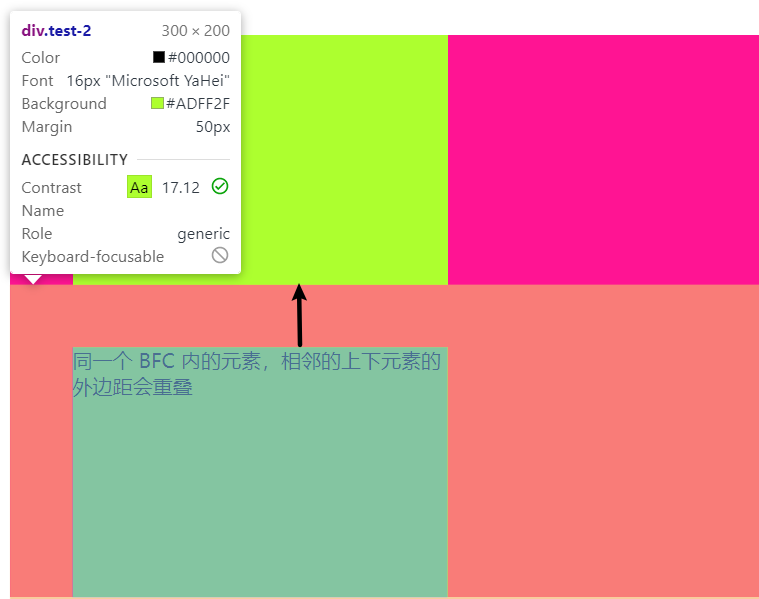
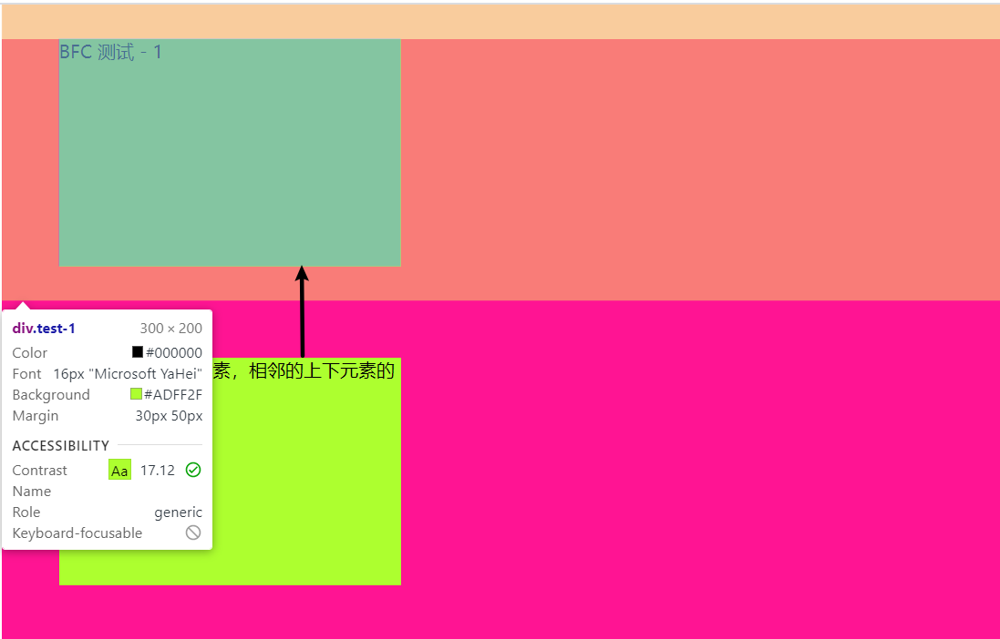
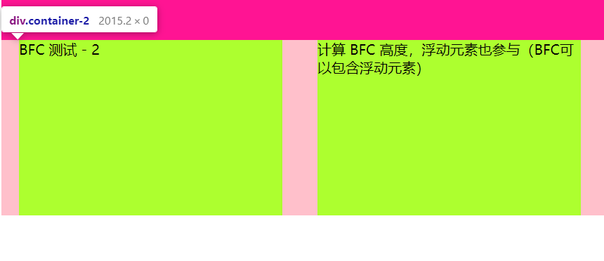
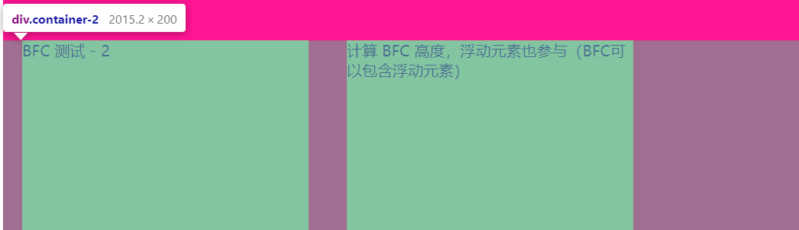
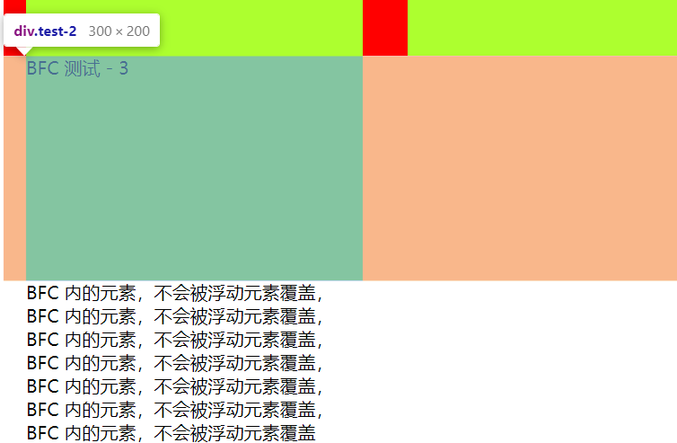
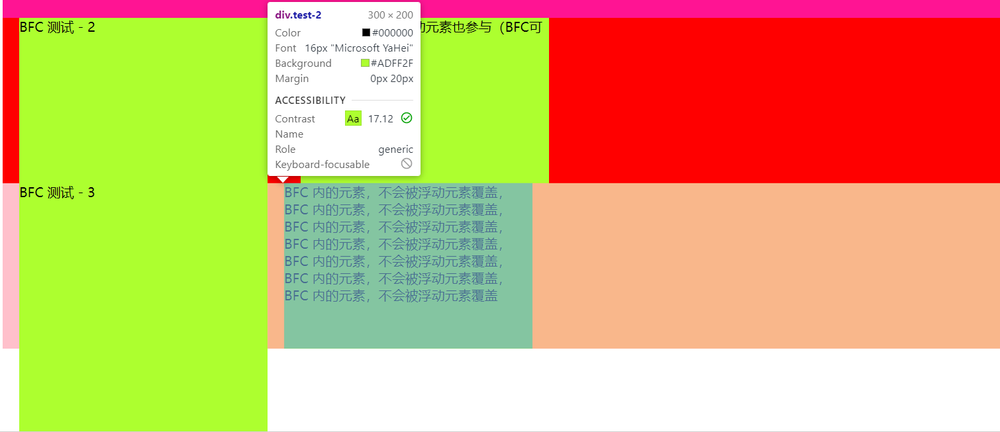

<!-- START doctoc generated TOC please keep comment here to allow auto update -->
<!-- DON'T EDIT THIS SECTION, INSTEAD RE-RUN doctoc TO UPDATE -->
**Table of Contents**  *generated with [DocToc](https://github.com/thlorenz/doctoc)*

- [1. BFC (Block Formatting Context)](#1-bfc-block-formatting-context)
  - [1. 参考资料](#1-%E5%8F%82%E8%80%83%E8%B5%84%E6%96%99)
  - [2. 基本概念](#2-%E5%9F%BA%E6%9C%AC%E6%A6%82%E5%BF%B5)
  - [3. 基本特性](#3-%E5%9F%BA%E6%9C%AC%E7%89%B9%E6%80%A7)
  - [4. 应用](#4-%E5%BA%94%E7%94%A8)

<!-- END doctoc generated TOC please keep comment here to allow auto update -->

# 1. BFC (Block Formatting Context)

## 1. 参考资料

1. [什么是BFC？看这一篇就够了](https://blog.csdn.net/sinat_36422236/article/details/88763187)
2. [10 分钟理解 BFC 原理](https://zhuanlan.zhihu.com/p/25321647)
3. [什么是BFC？](https://www.jianshu.com/p/0d713b32cd0d)

## 2. 基本概念

1. 看一下 MDN 对于 BFC（Block Formatting Context，块级格式化上下文）的解释：
   > 一个块格式化上下文（block formatting context） 是Web页面的可视化CSS渲染出的一部分。它是块级盒布局出现的区域，也是浮动层元素进行交互的区域。
    > - 一个块格式化上下文由以下之一创建：
    > - 根元素或其它包含它的元素
    > - 浮动元素 (元素的 float 不是 none)
    > - 绝对定位元素 (元素具有 position 为 absolute 或 fixed)
    > - 内联块 (元素具有 display: inline-block)
    > - 表格单元格 (元素具有 display: table-cell，HTML表格单元格默认属性)
    > - 表格标题 (元素具有 display: table-caption, HTML表格标题默认属性)
    > - 具有overflow 且值不是 visible 的块元素，
    > - display: flow-root
    > - column-span: all 应当总是会创建一个新的格式化上下文，即便具有 column-span: all 的元素并不被包裹在一个多列容器中。
   > 一个块格式化上下文包括创建它的元素内部所有内容，除了被包含于创建新的块级格式化上下文的后代元素内的元素。
   > 块格式化上下文对于定位 (参见 float) 与清除浮动 (参见 clear) 很重要。定位和清除浮动的样式规则只适用于处于同一块格式化上下文内的元素。浮动不会影响其它块格式化上下文中元素的布局，并且清除浮动只能清除同一块格式化上下文中在它前面的元素的浮动。

2. 我的理解 BFC 就是一块独立的渲染区域，有自己的一套渲染规则。BFC 内部的元素不会再布局上影响外面的元素。

3. 触发 BFC 的条件：
  1. body 根元素
  2. 浮动元素 -- float 为除了 none 以外的值
  3. 绝对定位：position 为 absolute 或者 fixed
  4. display 为 inline-block、table-cells、flex
  5. overflow 为除了 visible 以外的值：auto、hidden、scroll

4. 布局规则

   1. 内部的 Box 会在垂直方向，一个接一个地放置。

   2. Box 垂直方向的距离由 margin 决定。属于同一个 BFC 的两个相邻Box的 margin 会发生重叠。
   3. 每个盒子（块盒与行盒）的 margin box 的左边，与包含块 border box 的左边相接触(对于从左往右的格式化，否则相反)。即使存在浮动也是如此。
   4. BFC 的区域不会与 float box 重叠。
   5. BFC 就是页面上的一个隔离的独立容器，容器里面的子元素不会影响到外面的元素。反之也如此。
   6. 计算 BFC 的高度时，浮动元素也参与计算。

## 3. 基本特性

1. 同一个 BFC 区域内，相邻元素的上下外边距会发生重叠。

2. BFC 可以包含浮动元素，因此可以用来清除浮动。

3. BFC 的区域不会被浮动的元素所覆盖。

## 4. 应用

1. 利用 BFC 来避免外边距重叠。
   1. 示例：
      ```html
         <div class="container-1">
            <div class="test-1">BFC 测试 - 1</div>
            <div class="test-2">同一个 BFC 内的元素，相邻的上下元素的外边距会重叠</div>
        </div>
      ```
      ```css
         .container-1 {
            background-color: deeppink;
         }
         .test-1,.test-2 {
            width: 300px;
            height: 200px;
            background: greenyellow;
            margin: 0px 20px;
         }

         .container-1 .test-1 {
            margin: 30px 50px;
         }
         .container-1 .test-2 {
            margin: 50px;
         }
      ```
    2. test-1 的上下外边距是 30px，而 test-2 的上下外边距是 50px，所以这两个元素之间的外边距取得是较大的那个外边距 50px，如下所示：
       
    3. 如果不希望外边距重叠，可以将其中一个元素放到不同的 BFC 容器中，这样就可以避免外边距重叠了。
       ```html
          <div class="container-1">
             <div class="test-1">BFC 测试 - 1</div>
             <div class="container-test">
                <div class="test-2">同一个 BFC 内的元素，相邻的上下元素的外边距会重叠</div>
             </div>

          </div>
       ```
       ```css
          .container-test {
              overflow: hidden;
           }
       ```
    4. 将 test-2 放到一个新的容器 container-test 中，同时触发 container-test 的 BFC，这样就不会出现外边距重叠的现象了：
       

2. 利用 BFC 可以包含浮动元素的特性，可以防止包含浮动元素的父元素高度塌
陷。
   1. 一般情况下，我们希望由子元素撑起父元素的高度，而如果子元素是浮动元素，所以父元素高度就会塌陷。
      ```html
         <div class="container-2">
            <div class="test-1">BFC 测试 - 2</div>
            <div class="test-2">计算 BFC 高度，浮动元素也参与（BFC可以包含浮动元素）</div>
         </div>
      ```
      ```css
         .container-2 {
            background-color: red;
         }

         .container-2 .test-1 {
            float: left;
         }

         .container-2 .test-2 {
            float: left;
         }
       ```
    2. 效果如下所示：
       
    3. 触发父元素的 BFC，此时计算父元素高度时，也会包括浮动的子元素：
       ```css
          .container-2 {
            background-color: red;
            /*触发 BFC，使得父元素能包含浮动元素，这样计算高度浮动元素也能参与*/
            overflow: hidden;
          }

       ```
    4. 效果如下：
       

3. 利用 BFC 的区域不会被浮动的元素所覆盖的特性，可以使得非浮动元素让开浮动元素，实现自适应两列布局等。
   1. 浮动元素会脱离文档流，而且还会覆盖相邻的非浮动的兄弟元素，但是不会覆盖文字内容。
      ```html
         <div class="container-3">
            <div class="test-1">BFC 测试 - 3</div>
            <div class="test-2">
                BFC 内的元素，不会被浮动元素覆盖，
                BFC 内的元素，不会被浮动元素覆盖，
                BFC 内的元素，不会被浮动元素覆盖，
                BFC 内的元素，不会被浮动元素覆盖，
                BFC 内的元素，不会被浮动元素覆盖，
                BFC 内的元素，不会被浮动元素覆盖，
                BFC 内的元素，不会被浮动元素覆盖
            </div>
        </div>
      ```
      ```css
         .container-3 {
            background-color: pink;
        }
        .container-3 .test-1 {
            height: 300px;
            float: left;
        }
      ```
    2. 设置了 test-1 向左浮动，因此 test-2 会被覆盖：
       
    3. 触发 test-2 的 BFC，则 test-2 不会被 test-1 覆盖：
       
    4. 利用这个特性，可以实现左侧固定宽度、右侧自适应的两列布局。