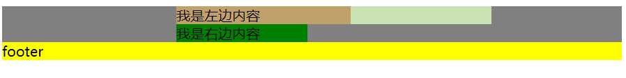
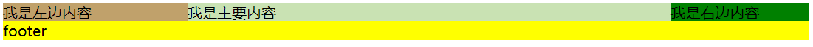
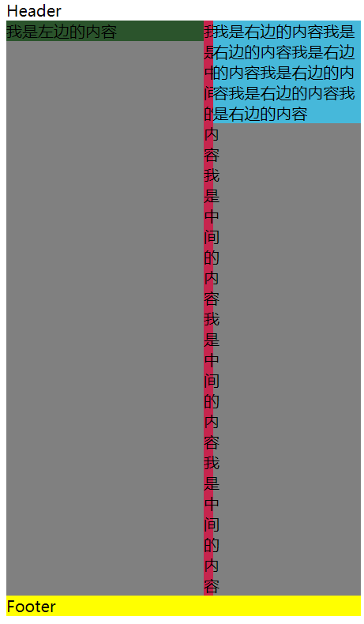

# 1. 三列布局

## 1. 基本说明

1. 基本要求：
   1. 左右两列宽度固定，中间列宽度自适应。
   2. 中间部分在 `DOM` 结构上优先，以便先行渲染。
   3. 允许三列中的任意一列成为最高列。
   4. 只需要使用一个额外的 `<div>` 标签。
   
2. 圣杯布局来源于文章 [In Search of the Holy Grail](https://alistapart.com/article/holygrail/) 

3. 而双飞翼布局来源于淘宝 UED。

4. 参考资料：
   1. []()
   2. []()

## 2. 圣杯布局

1. HTML 结构：
   ```html
      <div class="container">
          <div class="main">我是主要内容</div>
          <div class="left">我是左边内容</div>
          <div class="right">我是右边内容</div>
      </div>
   ```

2. CSS
   1. container 设置 padding-left 和 padding-right。左右内边距是预留给左右两列的。
   2. container 要设置 overflow 属性为 hidden，目的是避免子元素设置浮动而导致的父元素高度塌陷。
      ```css
         .container {
       
           /*
               给左右两个内边距设置宽度为200px、150px
               这是给左右两列预留的空间
           */
           padding: 0 150px 0 200px;
           /*清除子元素浮动带来的父元素高度塌陷的影响*/
           overflow: hidden;
           background: grey;
         }

       ```
   3. main、left、right 设置向左浮动。
      ```css
         .main,.left,.right {
             /*三列统一设置向左浮动*/
             float: left ;
         }
      ```
   4. main 的 width 设置为100%。保证宽度自适应。
      ```css
         .main {
             width: 100%;
             background: #c9e2b3;
         }
      ```
   5. left 的 position 都设置为 relative，同时设置 right 属性为 200px（left宽度），margin-left 设置为 -100%。margin-left 设置为 -100%，保证 left 和 main 在同一行，且紧紧挨着父元素内容区的最左边，但是无法达到父元素 padding-left 区域。如下图所示：
   
   因此使用position属性将left移动到padding-left区域。
      ```css
         .left {
             width: 200px ;
             background: #c0a16b;
         
             /*设置margin-left为负值，向左移动,此时会移动到main的最左边，但是不会占据父元素的padding-left的空白区*/
             margin-left: -100%;
             /*设置定位方式为relative，表示是相对于自身原本的位置进行定位*/
             position: relative;
             right: 200px;
         }
      ```
   6. right 有两种方式进行设置。
      1. 直接使用 margin-right，设置为 -150px（right 的宽度），原理是：
         - right 向左浮动，margin-right 设置为负值，对外表现的效果是 right 宽度缩小。而实际上，right 的宽度没有变化如果负值同宽度一样大（-150px），那么 right 元素的宽度是0px。
         - 浮动元素脱离文档流，并且尽可能向左或右浮动。由于 main 的宽度设置为 100%，占据了整个第一行，则 right 和 left 被挤到了第二行。而此时 right 的宽度为 0px。根据浮动的原则（尽量靠近父元素的上边界），right 会上浮，且仅仅挨着 main 的右侧。因此，从视觉上看，right 占据了父元素 padding-right 的区域。
         ```css
            .right {
              width: 150px ;
              background: green;
              margin-right: -150px;
            }
         ```
      2. position 属性设置为 relative，left 设置为 150px（right 宽度）。margin-left 设置为 -150px（right 宽度）。原理同 left 的类似。
         ```css
            .right {
                 width: 150px ;
                 background: green;
                 /*margin-right: -150px;*/
                 margin-left: -150px ;
                 position: relative ;
                 left: 150px ;
            }
         ```
      
      3. 两种方式，推荐第二种，简单移动好操作。
   7. 考虑页面最小宽度。要想保证该布局效果正常显示，由于两侧都具有固定的宽度，所以需要给定页面一个最小的宽度。但这并不只是简单的200+150=350px。回想之前 left 使用了 position: relative，所以就意味着在 center 开始的区域，还存在着一个 left 的宽度。所以页面的最小宽度应该设置为 200+150+200=550px。这样可以保证页面缩小时，main 的宽度不小于 left。
       ```css
          body {
              min-width: 550px;
          }
       ```

3. 完整 CSS 代码
   ```css
      body {
          min-width: 550px;
      }
      .container {
          padding: 0 150px 0 200px;
              overflow: hidden;
          background: grey;
      }
      .main,.left,.right {
          float: left ;
      }
      .main {
          width: 100%;
          background: #c9e2b3;
      }
      .left {
          width: 200px ;
          background: #c0a16b;
          margin-left: -100%;
          position: relative;
          right: 200px;
      }
      .right {
          width: 150px ;
          background: green;
          margin-right: -150px;
          margin-left: -150px ;
          position: relative ;
          left: 150px ;
      
      }
      .footer {
          background: yellow;
      }

   ```      
4. 最终效果如下：
   
   

## 3. 双飞翼布局

1. 双飞翼布局与圣杯布局达成的效果类似，只是实现方法不一样：
   1. 给中间块套了一个 div 容器。
   2. 设置中间块的 margin 属性保证中间块的内容不被遮挡。
   3. 设置中间块的父级元素进行浮动。
   4. 不使用 position 属性。

2. HTML 结构：
   ```html
      <div class="header">Header</div>
      <div class="container">
          <div class="middle-container">
              <div class="main">我是中间的内容</div>
          </div>
          <div class="left">我是左边的内容</div>
          <div class="right">我是右边的内容</div>
          <div class="footer">Footer</div>
      </div>

   ```
2. CSS部分思路是：
   1. 最外层的container容器要清除浮动，防止子元素浮动引起的父元素高度塌陷。
      ```css
         .container {
                overflow: hidden;
                background: grey;
            
         }
      ```
   2. middle-container、left和right向左浮动。
      ```css
         .middle-container,.left,.right {
                /*三列统一设置向左浮动*/
                float: left ;
         }
      ```
   3. middle-container的width属性要设置为100%，这样保证中间块的宽度与页面同宽。同时还可以把left和right挤到第二行，方便将来的移动。
      ```css
         .middle-container {
                width: 100%;
         }
      ```
   4. 设置 main 的 margin 属性。margin-left 和 margin-right 的值与左右列的宽度相同。这是关键的地方，目的在于给左右两列预留出空间，保证左右两列不遮挡 main。
      ```css
         .main {
                margin: 0 150px 0 200px;
                background: #c7254e;
         }
      ```
   5. left 设置 margin-left 为 -100%，使得 left 向左移动到main 的 margin-left 区域。同时设置 width 为 200px。
      ```css
         .left {
                width: 200px;
                margin-left: -100%;
                background: #2b542c;
            }
      ```
   6. right 设置 margin-left 为 -150px（同 width 值），使得right 向左移动到到 main 的 margin-right 区域。设置 width 为 150px。
      ```css
         .right {
                width: 150px;
                margin-left: -150px;
                background: #46b8da;
         }
      ```
   7. 考虑最小宽度。由于没有使用 position 属性，那么最小宽度应该是 200+150=350px。但是当页面缩小到 350px 附近， main元素的内容会被右边的列所遮挡。如下图所示：
      
     所以，最小宽度应该适当加宽一些，以留给中间栏（比如 150px）。所以设置body的最小宽度为 500px。
      ```css
         body {
            min-width: 500px;
         }
      ```
3. 完整的 css 代码：
   ```css
      body {
          min-width: 500px;
      }
      .container {
          overflow: hidden;
          background: grey;
      
      }
      
      .middle-container {
          width: 100%;
      }
      
      .middle-container,.left,.right {
          /*三列统一设置向左浮动*/
          float: left ;
      }
      
      .main {
          margin: 0 150px 0 200px;
          background: #c7254e;
      }
      
      .left {
          width: 200px;
          margin-left: -100%;
          background: #2b542c;
      }
      
      .right {
          width: 150px;
          margin-left: -150px;
          background: #46b8da;
      }
      
      .footer {
          clear: left;
          background: yellow;
      }  
   ```

       
   
   


   


