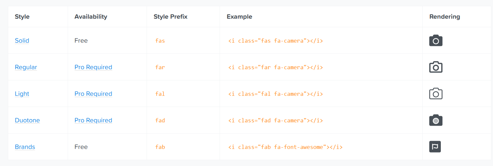

<!-- START doctoc generated TOC please keep comment here to allow auto update -->
<!-- DON'T EDIT THIS SECTION, INSTEAD RE-RUN doctoc TO UPDATE -->
**Table of Contents**  *generated with [DocToc](https://github.com/thlorenz/doctoc)*

- [FontAwesome 的使用说明](#fontawesome-%E7%9A%84%E4%BD%BF%E7%94%A8%E8%AF%B4%E6%98%8E)
    - [1. 基本说明](#1-%E5%9F%BA%E6%9C%AC%E8%AF%B4%E6%98%8E)
    - [2. 安装](#2-%E5%AE%89%E8%A3%85)
    - [3. 使用](#3-%E4%BD%BF%E7%94%A8)
      - [1. 单独使用](#1-%E5%8D%95%E7%8B%AC%E4%BD%BF%E7%94%A8)
      - [2. 全局使用](#2-%E5%85%A8%E5%B1%80%E4%BD%BF%E7%94%A8)
      - [3. 图标属性](#3-%E5%9B%BE%E6%A0%87%E5%B1%9E%E6%80%A7)

<!-- END doctoc generated TOC please keep comment here to allow auto update -->

# FontAwesome 的使用说明

### 1. 基本说明

1. FontAwesome 在 v5 版本中使用了 svg 作为图标的基础，而不是 Font Icon。

2. 参考资料：
   - [react-fontawesome](https://github.com/FortAwesome/react-fontawesome)
   - [Font Awesome React](https://fontawesome.com/how-to-use/on-the-web/using-with/react)
   - [v5.15 - Font Awesome React](https://fontawesome.com/v5.15/how-to-use/on-the-web/using-with/react)
   
### 2. 安装

1. `npm i --save @fortawesome/fontawesome-svg-core`

2. `npm install --save @fortawesome/free-solid-svg-icons`

3. `npm i --save @fortawesome/react-fontawesome`


4. `npm install --save @fortawesome/free-brands-svg-icons`


### 3. 使用

1. 单独使用和全局使用的优缺点

   使用方式|优点|缺点
   |:---:|:---:|:---:|
   单独使用|组件内使用，只打包使用的图标|当有较多的组件时，单独导出图标比较麻烦
   全局使用|在初始化的模块（App）中单独导入一次，将图标加入图标库中，就不需要在每个组件中导入图标|会打包不需要的图标，影响性能

2. fontawesome 分为多个模块，每个模块包含的图标不一样，基本样式也不一样。使用时需要指定一个图标前缀，表示图标来自于哪个模块，然后指定图标名称。基本样式和图标前缀如下图所示：  
   

3. 上图中，前缀以 `fa` 开头，`fa` 表示 `fontawesome`。默认的前缀是 `fas`，即如果我们不加前缀，直接写图标名称，那么其前缀就是 `fas`，引用 `solid` 的这种样式。

4. Solid 样式对应的是 `@fortawesome/free-solid-svg-icons`，而 Brands 样式对应的是 `@fortawesome/free-brands-svg-icons`，这两个图标模块是免费的，而 Regular、Light、Duotone 对应的图标模块是收费的。

#### 1. 单独使用

1. 示例代码：
   ```javascript
      import ReactDOM from 'react-dom'
      import { FontAwesomeIcon } from '@fortawesome/react-fontawesome'
      import { faCoffee } from '@fortawesome/free-solid-svg-icons'

      const element = <FontAwesomeIcon icon={faCoffee} />

      ReactDOM.render(element, document.body)
   ```

#### 2. 全局使用

1. 在 app.js 中：
   ```javascript
      import ReactDOM from 'react-dom';
      import { library } from '@fortawesome/fontawesome-svg-core';
      import { fab } from '@fortawesome/free-brands-svg-icons';
      import { faCheckSquare, faCoffee } from '@fortawesome/free-solid-svg-icons';

    library.add(fab, faCheckSquare, faCoffee)
   ```
2. 一般我们在 app.js 中引入图标库：`library`。

3. 我们向 `library` 中传入两个内容：
   - fab：表示 `@fortawesome/free-brands-svg-icons` 模块中的所有图标。因此可以使用字符串形式的图标名称引用图标。
     > fab: which represents all of the brand icons in @fortawesome/free-brands-svg-icons. So any of the brand icons in that package may be referenced by icon name as a string anywhere else in our app. For example: "apple", "microsoft", or "google".
   - faCheckSquare and faCoffee：我们可以在组件中通过字符串引用的图标。
     > faCheckSquare and faCoffee: Adding each of these icons individually allows us to refer to them throughout our app by their icon string names, "check-square" and "coffee", respectively.
    
    - 如果我们想使用 `@fortawesome/free-solid-svg-icons` 这个模块下的所有图标，而不是一个一个引入，可以这样用：`import { fas } from '@fortawesome/free-solid-svg-icons';` `fas` 与前面的 `fab` 是一样的，表示 `@fortawesome/free-solid-svg-icons` 模块下的所有图标，因此可以使用字符串形式的图标名称引用图标。

4. 示例 -- 同时引入 `@fortawesome/free-solid-svg-icons` 和 `@fortawesome/free-brands-svg-icons` 下的所有图标：
   ```javascript
      import ReactDOM from 'react-dom';
      import { library } from '@fortawesome/fontawesome-svg-core';
      import { fab } from '@fortawesome/free-brands-svg-icons';
      import { fas } from '@fortawesome/free-solid-svg-icons';

       library.add(fab, fas)
   ```
5. 在组件中使用
   ```javascript
      import React from 'react'
      import { FontAwesomeIcon } from '@fortawesome/react-fontawesome'

      export const Beverage = () => (
        <div>
          <FontAwesomeIcon icon="check-square" />
          Your <FontAwesomeIcon icon="coffee" /> is hot and ready!
        </div>
      )
   ```
6. **注意**：全局模式下，图标的字符串名称和图标的名称可能不一样，如 `faCheckSquare` 和 `check-square`，其中 `faCheckSquare` 就是图标名称，而 `check-square` 就是图标的字符串名称。

7. 全局模式下，icon 属性接收参数形式如下：
   - `IconName`  图标的字符串名称
   - `[IconPrefix, IconName]`  数组形式，第一个元素是图标的前缀，第二个元素是图标的名称。可选的图标前缀有：`fas`、`fab`、`far`、`fal`、`fad`。表示图标来自于不同的 fontawesome 模块。
   - `{prefix: IconPrefix, iconName: IconName}`  对象形式，有两个属性：`prefix` 和 `iconName`。分别表示图标的前缀和图标的名称。

8. 有些情况下，单纯使用图标的字符串名称可能渲染不出来对应的图标，此时我们应该加上前缀。例如，我们想使用一些品牌图标，如苹果公司和微软公司的图标，其字符串名称为：`apple` 和 `microsoft`，但是直接使用渲染不出来，我们必须使用前缀：`fab`，表示图标来自于 `@fortawesome/free-brands-svg-icons` 这个模块。代码如下：
   ```js
       import React from 'react'
       import { FontAwesomeIcon } from '@fortawesome/react-fontawesome'

       export const Beverage = () => (
           <div>
               <div>
               <FontAwesomeIcon icon=["fab", "apple"] />
               </div>
               <div>
               <FontAwesomeIcon icon=["fab", "microsoft"] />
               </div>
               
          </div>
      )
   ```
   结果如下图所示：  
   

8. 其他图标的前缀和图标名称： 
   ```js
      // Light:
      <FontAwesomeIcon icon={["fal", "coffee"]} />
      // Regular:
      <FontAwesomeIcon icon={["far", "coffee"]} />
      // Solid
      <FontAwesomeIcon icon={["fas", "coffee"]} />
      // ...or, omit as FontAwesome defaults to solid, so no need to prefix:
      <FontAwesomeIcon icon="coffee" />
      // Brand:
      <FontAwesomeIcon icon={["fab", "github"]} />
   ```
#### 3. 图标属性

1. Size
   ```jsx
      <FontAwesomeIcon icon="coffee" size="xs" />
      <FontAwesomeIcon icon="coffee" size="lg" />
      <FontAwesomeIcon icon="coffee" size="6x" />
   ```

2. [Fixed-Width Icons](https://fontawesome.com/how-to-use/on-the-web/styling/fixed-width-icons)
   ```jsx
      <FontAwesomeIcon icon="coffee" fixedWidth />
   ```

3. Inverse
   ```jsx
      <FontAwesomeIcon icon="coffee" inverse />
   ```

4. [Icons in a List](https://fontawesome.com/how-to-use/on-the-web/styling/icons-in-a-list)
   ```jsx
      <FontAwesomeIcon icon="coffee" listItem /> 
   ```


5. [Rotating Icons](https://fontawesome.com/how-to-use/on-the-web/styling/rotating-icons)
   ```jsx
      <FontAwesomeIcon icon="coffee" rotation={90} />
      <FontAwesomeIcon icon="coffee" rotation={180} />
      <FontAwesomeIcon icon="coffee" rotation={270} /> 
   ```


6. Flip horizontally, vertically, or both:
   ```jsx
      <FontAwesomeIcon icon="coffee" flip="horizontal" />
      <FontAwesomeIcon icon="coffee" flip="vertical" />
      <FontAwesomeIcon icon="coffee" flip="both" />
   ```


7. [Animating Icons](https://fontawesome.com/how-to-use/on-the-web/styling/animating-icons)
   ```jsx
      <FontAwesomeIcon icon="spinner" spin />
      <FontAwesomeIcon icon="spinner" pulse />  
   ```


8. [Bordered Icons](https://fontawesome.com/how-to-use/on-the-web/styling/bordered-pulled-icons)
   ```jsx
      <FontAwesomeIcon icon="coffee" border />
   ```


9. [Pulled Icons](https://fontawesome.com/how-to-use/on-the-web/styling/bordered-pulled-icons)
   ```jsx
      <FontAwesomeIcon icon="coffee" pull="left" />
      <FontAwesomeIcon icon="coffee" pull="right" />
   ``` 


10. [Swap Opacity](https://fontawesome.com/how-to-use/on-the-web/styling/duotone-icons)
    - This feature is only available when using Duotone Icons. 
    ```jsx
       <FontAwesomeIcon icon={['fad', 'coffee']} />
       <FontAwesomeIcon icon={['fad', 'coffee']} swapOpacity />
    ```


11. Adding Classes Yourself
    - You can add classes for your own project purposes and styling to any component using the className property.
    ```jsx
         <FontAwesomeIcon icon="spinner" className="highlight" />
    ```


12. [Power Transforms](https://fontawesome.com/how-to-use/on-the-web/styling/power-transforms)
    ```jsx
       <FontAwesomeIcon icon="coffee" transform="shrink-6 left-4" />
<FontAwesomeIcon icon="coffee" transform={{ rotate: 42 }} />
    ```


13. [Masking Icons](https://fontawesome.com/how-to-use/on-the-web/styling/masking)
    ```jsx
       <FontAwesomeIcon icon="coffee" mask={['far', 'circle']} />
    ```


14. [Layering Icons](https://fontawesome.com/how-to-use/on-the-web/styling/layering)
    ```jsx
       <span className="fa-layers fa-fw">
            <FontAwesomeIcon icon="square" color="green" />
            <FontAwesomeIcon icon="check" inverse transform="shrink-6" />
      </span>  
    ```


15. [Using SVG Symbols](https://fontawesome.com/how-to-use/on-the-web/advanced/svg-symbols)
    ```jsx
       <FontAwesomeIcon icon="coffee" symbol />
       <FontAwesomeIcon icon="coffee" symbol="beverage-icon" />
    ```


