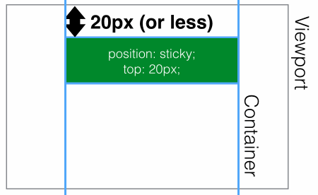
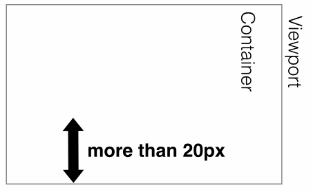
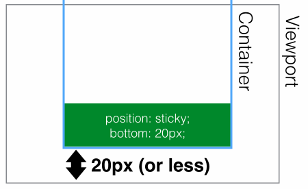

# 定位属性 - sticky

## 1. 参考资料

1. 兼容性：https://caniuse.com/?search=sticky

2. [探究 position-sticky 失效问题](https://www.cnblogs.com/coco1s/p/14180476.html)

3. [position: sticky 详解（防坑指南）](https://blog.csdn.net/qq_34629352/article/details/106112062)

4. [彻底理解粘性定位 - position: sticky](https://www.jianshu.com/p/0da2e9cd4352)

5. [使用 position:sticky 实现粘性布局](https://www.cnblogs.com/coco1s/p/6402723.html)

6. [fixed-sticky](https://github.com/filamentgroup/fixed-sticky)

7. [杀了个回马枪，还是说说position:sticky吧](https://www.zhangxinxu.com/wordpress/2018/12/css-position-sticky/)

8. [深入理解position sticky粘性定位的计算规则](https://www.zhangxinxu.com/wordpress/2020/03/position-sticky-rules/)

## 2. 基本背景

1. position 设置为 sticky，实现的是粘性定位。粘性定位实际上是相对定位和固定定位的结合。

2. 想像一个场景，一篇博客的标题，随着内容的滚动，当标题到顶部的时候，标题栏停在顶部位置不动，而其余的内容依旧可以向上滚动。如果内容向下滚动，当标题栏在原内容区的位置与顶部位置重合，即顶部的标题栏处于内容区中其原来的位置时，钉在顶部位置的标题栏，又可以回到原来的位置，继续向下滚动。那么要实现这个效果，需要借助 js 和 css：
   - 监听 scroll 事件，实时获取标题的位置，当标题滚动到指定位置，将标题的定位属性设置为 固定定位（fixed）。
   - 监听 scroll 事件，实时获取标题的位置，当标题脱离指定位置，将标题的定位属性设置为默认定位（static）。

3. 示例如下：
   - html
   ```html
      <div class="article-outer-container">
        <div class="top-content">
            顶部占位元素
        </div>
        <div class="content-container">
            <header class="article-header">
                <div class="title">
                    定位 - 粘性定位
                </div>
            </header>
            <div class="article-content">
                <p class="article-paragraph">javascript 加 css 模拟 sticky</p>
                <p class="article-paragraph">javascript 加 css 模拟 sticky</p>
                <p class="article-paragraph">javascript 加 css 模拟 sticky</p>
                <p class="article-paragraph">javascript 加 css 模拟 sticky</p>
                <p class="article-paragraph">javascript 加 css 模拟 sticky</p>
                <p class="article-paragraph">javascript 加 css 模拟 sticky</p>
                <p class="article-paragraph">javascript 加 css 模拟 sticky</p>
                <p class="article-paragraph">javascript 加 css 模拟 sticky</p>
                <p class="article-paragraph">javascript 加 css 模拟 sticky</p>
                <p class="article-paragraph">javascript 加 css 模拟 sticky</p>

            </div>
        </div>

      </div>
   ```
   - css
   ```css
      .article-outer-container {

            height: 750px;
            width: 500px;

            margin: 0 auto;
            background: #666;
            overflow: auto;
            /*margin-top: 100px;*/
        }

        .content-container {
            height: 3000px;

        }
        .content-container .title {
            width: 500px;
            margin: 0 auto;
            padding: 25px;
            box-sizing: border-box;
            text-align: center;
            background: yellowgreen;
        }

        .top-content {

            height: 75px;
            width: 100%;
            background: purple;
            /*margin-bottom: 15px;*/
        }

        .article-paragraph {
            text-align: center;
        }
   ```
   - javascript
   ```js
      const scrollContainer = document.querySelector('.article-outer-container');
      const articleHeader = document.querySelector('.article-header');
      const articleHeaderOffsetLeft = articleHeader.offsetLeft;
      function scrollFn(e) {
       
           // this 指向当前的触发滚动事件的元素
           const scrollTop = this.scrollTop;

           if (scrollTop >= 75) {
               // 滚动元素滚动到指定位置，将需要固定的元素设置为固定定位，同时指定 top 和 left
               articleHeader.style.position = 'fixed';
               articleHeader.style.top = '8px';
               articleHeader.style.left = `${articleHeaderOffsetLeft}px`;
            
           } else {
            articleHeader.style.position = 'static';
           }
      }
      scrollContainer.addEventListener('scroll', scrollFn);

   ```
4. 最终实现效果如下：
   
5。由此可见，使用 js 和 css 实现的这种定位，还是比较麻烦的，而且由于是监听 scroll 事件。在发生滚动时会频繁触发浏览器的回流和重绘，会对页面的性能有一定影响。

## 3. sticky 定位

1. sticky 定位，也叫粘性定位。和它的名字类似，就是将某个元素黏在某个位置。这个属性是 css3 的新增特性。目前兼容性非常好，可以放心大胆的使用。

2. sticky 定位可以理解为是相对定位和固定定位的结合。初始的情况下，元素是相对定位，即出现在其应该出现的位置，随着页面的滚动，元素达到其指定的位置，那么其定位就变成固定定位。

3. sticky 定位的特性如下：
   - sticky 定位的元素不会脱离文档流。
   - 须指定 top right bottom 或 left 四个阈值其中之一，才可使粘性定位生效。否则其行为与相对定位相同。
   - 相对它的最近滚动祖先（nearest scrolling ancestor）和 [containing block](https://developer.mozilla.org/en-US/docs/Web/CSS/Containing_Block) （最近块级祖先 nearest block-level ancestor），包括 table-related 元素，基于 top、right、bottom 和 left 的值进行偏移。偏移值不会影响任何其他元素的位置。
   - 该值总是创建一个新的层叠上下文（stacking context）。
   - 注意，一个 sticky 元素会“固定”在离它最近的一个拥有“滚动机制”的祖先上（当该祖先的 overflow 是 hidden、scroll、auto 或 overlay 时），即便这个祖先不是最近的真实可滚动祖先。这有效地抑制了任何“sticky”行为（ 详情见 [Github issue on W3C CSSWG](https://github.com/w3c/csswg-drafts/issues/865) ）。

4. sticky 定位通常用来实现顶部导航的吸顶效果、底部栏的吸底效果、以及滚动到指定位置然后固定在这个位置的效果等。

5. 示例 - 实现文章标题栏的吸顶效果：
   - html
   ```html
      <div class="article-outer-container">
        <div class="top-content">
            顶部占位元素
        </div>
         <div class="content-container">
            <header class="article-header">
                <div class="title">
                    定位 - sticky 定位
                </div>
            </header>
            <div class="article-content">
                <p class="article-paragraph">sticky 定位</p>
                <p class="article-paragraph">sticky 定位</p>
                <p class="article-paragraph">sticky 定位</p>
                <p class="article-paragraph">sticky 定位</p>
                <p class="article-paragraph">sticky 定位</p>
                <p class="article-paragraph">sticky 定位</p>
                <p class="article-paragraph">sticky 定位</p>
                <p class="article-paragraph">sticky 定位</p>
                <p class="article-paragraph">sticky 定位</p>
                <p class="article-paragraph">sticky 定位</p>

            </div>
        </div>

      </div>
   ```   
   - css
   ```css
      .article-outer-container {

            height: 750px;
            width: 500px;

            margin: 0 auto;
            background: #666;
            overflow: auto;
            /*margin-top: 100px;*/
        }

        .content-container {
            height: 3000px;

        }

        .article-header {
            position: sticky;
            top: 0;
        }
        .content-container .title {
            width: 500px;
            margin: 0 auto;
            padding: 25px;
            box-sizing: border-box;
            text-align: center;
            background: yellowgreen;
        }

        .top-content {

            height: 75px;
            width: 100%;
            background: purple;

        }

        .article-paragraph {
            text-align: center;
        }
   ```

6. 我们只需要给 article-header 元素的 position 设置为 `sticky`，然后设置其 top 为 0，即可实现标题栏的吸顶效果。

7. 需要注意的是，设置 top 为 0，是 sticky 定位起作用的关键因素，其含义是：当 article-header 元素的顶部距离其定位的父元素（最近滚动祖先和最近块级祖先）为 0（或者小于 0）的时候， article-header 元素就固定在这个位置不动了，表现为固定定位。当元素的顶部距离其定位的父元素（最近滚动祖先和最近块级祖先）大于 0 的时候，article-header 元素随页面滚动，表现为相对定位。

8. 更详细的可以看这个例子 - sticky 定位，top 设置为 20px：
   - 当元素顶部距离视口顶部的距离大于 20px 的时候，表现如下，元素可以任意滚动。
  
   
   - 当元素顶部距离视口顶部的距离小于 20px，表现如下，即固定在这个位置，蓝色边框表示为父容器，父容器可以继续滚动，但是元素就固定在这个位置了。
   

9. 下面是一个元素设置为 sticky 定位，bottom 设置为 20px 的例子：
   - 距离底部大于 20px：
   
   - 距离底部小于 20px：
    

10. 上面两个例子来源于：[fixed-sticky](https://github.com/filamentgroup/fixed-sticky)

11. 使用 sticky 需要注意一下几个地方（参考：[探究 position-sticky 失效问题](https://www.cnblogs.com/coco1s/p/14180476.html) ）：
    - 指定 top, right, bottom 或 left 四个阈值其中之一（且达到设定的阈值），才可使粘性定位生效。否则其行为与相对定位相同； 并且 top 和 bottom 同时设置时，top 生效的优先级高，left 和 right 同时设置时，left 的优先级高。
    - 设定为 position: sticky 的元素的任意父节点的 overflow 属性必须是 visible，否则 position:sticky 不会生效；在满足上述情况下，设定了 position: sticky 的元素的父容器的高度必须大于当前元素，否则也会失效。（当然，此时，sticky 吸附的基准元素就会变成父元素）。
    - 如果 position: sticky 元素的任意父节点定位设置为 overflow: hidden，则父容器无法进行滚动，所以 position:sticky 元素也不会有滚动然后固定的情况。
    在满足上述情况下，设定了 position: sticky 的元素的父容器的高度必须大于当前元素，否则也会失效。（当然，此时，sticky 吸附的基准元素就会变成父元素）。
    - 合理的 html 结构很中烟重要，要合理的设置父容器和滚动容器。详情可见：[杀了个回马枪，还是说说position:sticky吧](https://www.zhangxinxu.com/wordpress/2018/12/css-position-sticky/)
    - 同一个父容器中的sticky元素，如果定位值相等，则会重叠；如果属于不同父元素，且这些父元素正好紧密相连，则会鸠占鹊巢，挤开原来的元素，形成依次占位的效果。至于原因需要理解粘性定位的计算规则，原因可见：[深入理解position sticky粘性定位的计算规则](https://www.zhangxinxu.com/wordpress/2020/03/position-sticky-rules/)

12. 富有层次感的依次替换的 sticky 元素的交互示例：
```html
   <!DOCTYPE html>
<html lang="en">
<head>
    <meta charset="UTF-8">
    <title>scroll 模拟粘性定位（sticky）</title>
    <style>


        body,html {
            height: 100%;
        }

        .article-outer-container {
            margin: 0 auto;
            width: 500px;
            height: 100%;
            background: #666;
            overflow: auto;
            /*margin-top: 100px;*/
        }

        /*.article-outer-container {*/
        /*    height: 5000px;*/

        /*}*/

        .article-header {
            position: sticky;
            top: 0;
        }
        .title {
            width: 500px;
            margin: 0 auto;
            padding: 25px;
            box-sizing: border-box;
            text-align: center;
            background: yellowgreen;
        }

        .top-content {

            height: 75px;
            width: 100%;
            background: purple;

        }

        .article-paragraph {
            text-align: center;
        }
    </style>
</head>
<body>
<article class="article-outer-container">
    <div class="top-content">
        顶部占位元素
    </div>
    <section>
        <header class="article-header">
            <div class="title">
                定位 - sticky 定位 - 1
            </div>
        </header>
        <div class="article-content">
            <p class="article-paragraph">sticky 定位</p>
            <p class="article-paragraph">sticky 定位</p>
            <p class="article-paragraph">sticky 定位</p>
            <p class="article-paragraph">sticky 定位</p>
            <p class="article-paragraph">sticky 定位</p>
            <p class="article-paragraph">sticky 定位</p>
            <p class="article-paragraph">sticky 定位</p>
            <p class="article-paragraph">sticky 定位</p>
            <p class="article-paragraph">sticky 定位</p>
            <p class="article-paragraph">sticky 定位</p>

        </div>
    </section>
    <section>
        <header class="article-header">
            <div class="title">
                定位 - sticky 定位 - 2
            </div>
        </header>
        <div class="article-content">
            <p class="article-paragraph">sticky 定位</p>
            <p class="article-paragraph">sticky 定位</p>
            <p class="article-paragraph">sticky 定位</p>
            <p class="article-paragraph">sticky 定位</p>
            <p class="article-paragraph">sticky 定位</p>
            <p class="article-paragraph">sticky 定位</p>
            <p class="article-paragraph">sticky 定位</p>
            <p class="article-paragraph">sticky 定位</p>
            <p class="article-paragraph">sticky 定位</p>
            <p class="article-paragraph">sticky 定位</p>

        </div>
    </section>
    <section>
        <header class="article-header">
            <div class="title">
                定位 - sticky 定位 - 3
            </div>
        </header>
        <div class="article-content">
            <p class="article-paragraph">sticky 定位</p>
            <p class="article-paragraph">sticky 定位</p>
            <p class="article-paragraph">sticky 定位</p>
            <p class="article-paragraph">sticky 定位</p>
            <p class="article-paragraph">sticky 定位</p>
            <p class="article-paragraph">sticky 定位</p>
            <p class="article-paragraph">sticky 定位</p>
            <p class="article-paragraph">sticky 定位</p>
            <p class="article-paragraph">sticky 定位</p>
            <p class="article-paragraph">sticky 定位</p>
            <p class="article-paragraph">sticky 定位</p>
            <p class="article-paragraph">sticky 定位</p>
            <p class="article-paragraph">sticky 定位</p>
            <p class="article-paragraph">sticky 定位</p>
            <p class="article-paragraph">sticky 定位</p>
            <p class="article-paragraph">sticky 定位</p>
            <p class="article-paragraph">sticky 定位</p>
            <p class="article-paragraph">sticky 定位</p>
            <p class="article-paragraph">sticky 定位</p>
            <p class="article-paragraph">sticky 定位</p>
            <p class="article-paragraph">sticky 定位</p>
            <p class="article-paragraph">sticky 定位</p>
            <p class="article-paragraph">sticky 定位</p>
            <p class="article-paragraph">sticky 定位</p>
            <p class="article-paragraph">sticky 定位</p>
            <p class="article-paragraph">sticky 定位</p>
            <p class="article-paragraph">sticky 定位</p>
            <p class="article-paragraph">sticky 定位</p>
            <p class="article-paragraph">sticky 定位</p>
            <p class="article-paragraph">sticky 定位</p>
        </div>
    </section>

</article>
</body>
</html>
```
13. 效果如下：

14. 可以很明显的看到，上一个 sticky 的元素被"挤走"，下一个 sticky 元素占据了它的位置。这是因为虽然滚动的容器是 article-outer-container，但是每个 sticky 元素是属于 section 元素的，其父元素不同，因此能实现这个效果。

15. 如果多个 sticky 元素的父元素是一个，且那么这些 sticky 元素会相互重叠：
```html
   <!DOCTYPE html>
<html lang="en">
<head>
    <meta charset="UTF-8">
    <title>scroll 模拟粘性定位（sticky）</title>
    <style>


        body,html {
            height: 100%;
        }

        .article-outer-container {

            margin: 0 auto;
            width: 500px;
            height: 100%;

            background: #666;
            overflow: auto;
            /*margin-top: 100px;*/
        }

        /*.article-outer-container {*/
        /*    height: 5000px;*/

        /*}*/

        .article-header {
            position: sticky;
            top: 0;
        }
        .title {
            width: 500px;
            margin: 0 auto;
            padding: 25px;
            box-sizing: border-box;
            text-align: center;
            background: yellowgreen;
        }

        .top-content {

            height: 75px;
            width: 100%;
            background: purple;

        }

        .article-paragraph {
            text-align: center;
        }
    </style>
</head>
<body>
<article class="article-outer-container">
    <div class="top-content">
        顶部占位元素
    </div>
    <header class="article-header">
        <div class="title">
            定位 - sticky 定位 - 1
        </div>
    </header>
    <section>

        <div class="article-content">
            <p class="article-paragraph">sticky 定位</p>
            <p class="article-paragraph">sticky 定位</p>
            <p class="article-paragraph">sticky 定位</p>
            <p class="article-paragraph">sticky 定位</p>
            <p class="article-paragraph">sticky 定位</p>
            <p class="article-paragraph">sticky 定位</p>
            <p class="article-paragraph">sticky 定位</p>
            <p class="article-paragraph">sticky 定位</p>
            <p class="article-paragraph">sticky 定位</p>
            <p class="article-paragraph">sticky 定位</p>

        </div>
    </section>
    <header class="article-header">
        <div class="title">
            定位 - sticky 定位 - 2
        </div>
    </header>
    <section>

        <div class="article-content">
            <p class="article-paragraph">sticky 定位</p>
            <p class="article-paragraph">sticky 定位</p>
            <p class="article-paragraph">sticky 定位</p>
            <p class="article-paragraph">sticky 定位</p>
            <p class="article-paragraph">sticky 定位</p>
            <p class="article-paragraph">sticky 定位</p>
            <p class="article-paragraph">sticky 定位</p>
            <p class="article-paragraph">sticky 定位</p>
            <p class="article-paragraph">sticky 定位</p>
            <p class="article-paragraph">sticky 定位</p>

        </div>
    </section>
    <header class="article-header">
        <div class="title">
            定位 - sticky 定位 - 3
        </div>
    </header>
    <section>

        <div class="article-content">
            <p class="article-paragraph">sticky 定位</p>
            <p class="article-paragraph">sticky 定位</p>
            <p class="article-paragraph">sticky 定位</p>
            <p class="article-paragraph">sticky 定位</p>
            <p class="article-paragraph">sticky 定位</p>
            <p class="article-paragraph">sticky 定位</p>
            <p class="article-paragraph">sticky 定位</p>
            <p class="article-paragraph">sticky 定位</p>
            <p class="article-paragraph">sticky 定位</p>
            <p class="article-paragraph">sticky 定位</p>
            <p class="article-paragraph">sticky 定位</p>
            <p class="article-paragraph">sticky 定位</p>
            <p class="article-paragraph">sticky 定位</p>
            <p class="article-paragraph">sticky 定位</p>
            <p class="article-paragraph">sticky 定位</p>
            <p class="article-paragraph">sticky 定位</p>
            <p class="article-paragraph">sticky 定位</p>
            <p class="article-paragraph">sticky 定位</p>
            <p class="article-paragraph">sticky 定位</p>
            <p class="article-paragraph">sticky 定位</p>
            <p class="article-paragraph">sticky 定位</p>
            <p class="article-paragraph">sticky 定位</p>
            <p class="article-paragraph">sticky 定位</p>
            <p class="article-paragraph">sticky 定位</p>
            <p class="article-paragraph">sticky 定位</p>
            <p class="article-paragraph">sticky 定位</p>
            <p class="article-paragraph">sticky 定位</p>
            <p class="article-paragraph">sticky 定位</p>
            <p class="article-paragraph">sticky 定位</p>
            <p class="article-paragraph">sticky 定位</p>
        </div>
    </section>

</article>
</body>
</html>
```

17. 效果如下：

18. 很明显出现了重叠的效果。这是因为 sticky 元素的父元素都是 article-outer-container，所以其吸附的基准元素就会变成 article-outer-container，因此会重叠。
