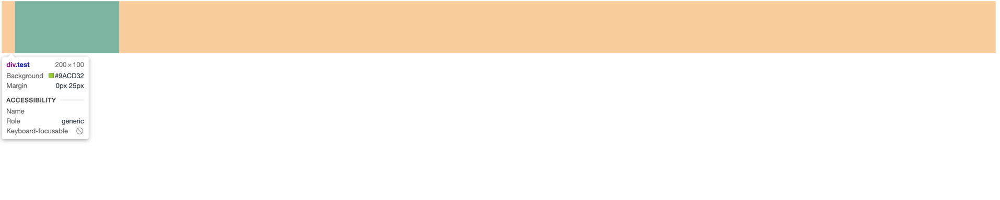
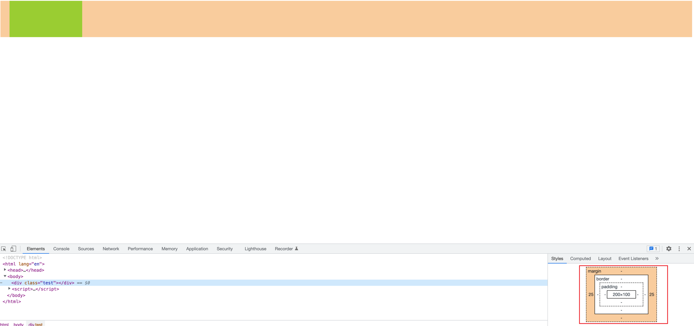

<!-- START doctoc generated TOC please keep comment here to allow auto update -->
<!-- DON'T EDIT THIS SECTION, INSTEAD RE-RUN doctoc TO UPDATE -->
**Table of Contents**  *generated with [DocToc](https://github.com/thlorenz/doctoc)*

- [常见 CSS 样式](#%E5%B8%B8%E8%A7%81-css-%E6%A0%B7%E5%BC%8F)
  - [1. 文本超出长度隐藏，并显示省略号（...）](#1-%E6%96%87%E6%9C%AC%E8%B6%85%E5%87%BA%E9%95%BF%E5%BA%A6%E9%9A%90%E8%97%8F%E5%B9%B6%E6%98%BE%E7%A4%BA%E7%9C%81%E7%95%A5%E5%8F%B7)
    - [1. 单行文本](#1-%E5%8D%95%E8%A1%8C%E6%96%87%E6%9C%AC)
    - [2. 多行文本](#2-%E5%A4%9A%E8%A1%8C%E6%96%87%E6%9C%AC)
  - [2. span 鼠标悬浮显示省略文字](#2-span-%E9%BC%A0%E6%A0%87%E6%82%AC%E6%B5%AE%E6%98%BE%E7%A4%BA%E7%9C%81%E7%95%A5%E6%96%87%E5%AD%97)

<!-- END doctoc generated TOC please keep comment here to allow auto update -->

# 常见 CSS 样式

## 1. 文本超出长度隐藏，并显示省略号（...）

### 1. 单行文本

1. 参考资料：[text-overflow属性的使用](https://blog.csdn.net/weixin_41342585/article/details/79522065)

2. css 样式：
   ```css
      overflow: hidden;
      text-overflow:ellipsis;
      white-space: nowrap;
   ```
2. 为了保证兼容性，最好给元素添加上 `width` 属性。

3. `text-overflow` 对块级元素有效，对行内元素无效，所以要对行内元素如 span 使用这个属性，需要将其 `display` 设置为 `block` 或者 `inline-block`。然后给这个元素设置 `width` 属性。


### 2. 多行文本

1. 参考资料：[CSS单行、多行文本溢出显示省略号](https://segmentfault.com/a/1190000009262433)

2. css 样式：
   ```css
      overflow:hidden;
      text-overflow:ellipsis;
      display:-webkit-box;
      -webkit-line-clamp:2; (两行文字)
      -webkit-box-orient:vertical;
   ```
3. 在webkit浏览器或移动端（绝大部分是webkit内核的浏览器）可以直接使用webkit 的 css 扩展属性（webkit是私有属性）`-webkit-line-clamp`。

4. 注意：这是一个不规范的属性，它没有在CSS的规范草案中。
5. `-webkit-line-clamp` 用来限制在一个块元素显示的文本行数，为了实现效果，他要与其他的 webkit 属性结合使用：
    - `display:-webkit-box;`：必须结合的属性，将对象作为弹性伸缩盒子模型展示
    - `ebkit-box-orient`：必须结合的属性，设置或检索伸缩盒对象的子元素的排列方式

6. 更通用的方式：
   ```css
      p {
           position:relative;
           line-height:1.4em;
           /*设置容器高度为3倍行高就是显示3行*/
           height:4.2em;
           overflow:hidden;
      }
      p::after {
           content:'...';
           font-weight:bold;
           position:absolute;
           bottom:0;
           right:0;
           padding:0 20px 1px 45px;
           background:#fff;
       }
   ```
7. 设置相对定位的容器高度，用包含省略号（...）的元素模拟实现

8. 还可以通过 js 的方式实现。

   
## 2. span 鼠标悬浮显示省略文字

1. 由于 span 元素宽度有限，文字内容比较多的时候，我们设置了文字超出宽度隐藏并显示省略号的效果。

2. 设置 span 元素的 `title` 属性，title 内容为文本内容，这样当鼠标悬浮到span 元素上面的时候，就能显示完整的文本内容。

3. 示例：
   ```jsx
      <div className="app-detail-introduction" style={{paddingTop: '25px'}}>
            <span style={{display: 'inherit'}} title={formVal.appInstruction}>产品说明：{formVal.appInstruction || '生态产品说明'}</span>
       </div>
   ```

## 3. 去掉页面滚动条，但保留滚动效果

### 1. 使用伪元素：`::-webkit-scrollbar`

1. 在需要隐藏滚动条的元素上，使用这个伪元素，设置其 `display` 属性为 `none`，就可以隐藏滚动条。如下所示：
   - html 结构：
     ```html
        <div className="outer">
            <ul className="ul-outer">
                <li>1</li>
                <li>2</li>
                <li>3</li>
                <li>4</li>
                <li>5</li>
                <li>6</li>
                <li>7</li>
                <li>8</li>
                <li>9</li>
                <li>10</li>
             </ul>
         </div> 
     ```
   - css 代码：
     ```css
        .outer .ul-outer {
           height:30px;
           overflow: scroll;
      }
        .outer .ul-outer::-webkit-scrollbar {
           display: none;
        }
     ```
 
2. `::-webkit-scrollbar` 这个伪元素不是标准属性，只能在 webkit 内核的浏览器中使用。

3. `::-webkit-scrollbar` 的说明：[::-webkit-scrollbar](https://developer.mozilla.org/zh-CN/docs/Web/CSS/::-webkit-scrollbar)

### 2. 将滚动条遮住

1. 在需要出现滚动条的元素的外面套一个父元素，父元素的宽度要比子元素小，同时设置父元素的 `overflow` 属性为 `hidden`，而 子元素的 `overflow-y` 设置为 `scroll` 或者 `auto`，`overflow-x` 设置为 `hidden`。因为 父元素的 `overflow` 属性为 `hidden`，所以子元素即使比父元素宽或者长，父元素也不会出现横向或纵向的滚动条。子元素的 `overflow-y` 设置为 `scroll`，当子元素的内容高度大于子元素的高度时，会出现纵向的滚动条。但是，由于父元素的宽度小于子元素，同时 父元素的 `overflow` 属性为 `hidden`，所以超出父元素范围的滚动条就被遮挡了，从视觉上就看不到这个滚动条了。

2. 具体实现如下：
   - html 结构：
     ```html
        <div class="outer">
            <div class="inner">
                <div class="num">1</div>
                <div class="num">2</div>
                <div class="num">3</div>
                <div class="num">4</div>
                <div class="num">5</div>
                <div class="num">6</div>
                <div class="num">7</div>
             </div>
         </div> 
     ```
   - css 代码：
     ```css
        .outer {
            width: 100px;
            overflow: hidden;
            border: 1px red solid;
        }
        .outer .inner {
            width: 120px;
            height:70px;
            overflow-y: scroll;
            overflow-x: hidden;
        }
        .outer .inner .num {
            width: 100px;
            height: 20px;
            background-color: greenyellow;
            margin: 10px 0;
        }
     ```

## 4. 元素设置 `inline` 属性和 `inline-box` 的一些注意事项

### 1. `inline` 属性需要注意的地方

1. 元素设置了 inline 属性，那么这个元素变成了行内元素，因此元素不会占据一行，而是和其他行内元素一样，挤在一行中。

2. 但是需要注意的是，元素变成行内元素以后，其内部是不能嵌套块元素的。假如说，我们在行内元素中嵌套了块元素，那么由于行内元素本身没有宽高，因此，其会被内部块元素撑开，因而占据一整行。此时这个行内元素从视觉上也是占据一行的。此种情况下，行内元素就不起作用了。

3. 如果势必要在行内元素中嵌套块元素，还想保持行内元素的特性，那么需要设置元素的 `display` 属性为 `inline-block`，那么这个元素就同时具有了行内元素和块元素的特性。

### 2. `inline-block` 属性需要注意的地方

1. 如果一个元素的 `display` 属性为 `inline-block`，那么这个元素就同时具有了行内元素和块元素的特性。

2. 设置了 `display` 属性为 `inline-block` 的元素，其默认的垂直（vertical）方向是沿着基线（baseline）对齐的。如下图所示：
   
   图片来源：[关于inline-block对齐的问题](https://www.jianshu.com/p/9e0274e0f9bd)

3. 要想让各个元素垂直方向上对齐，可以设置其 `vertical-align` 属性为`top` 即可。

4. 关于属性 `vertical-align`：
   - 该属性用来设置 inline、inline-box 或者 table-cell 元素在竖直方向上的对齐方式，默认值为 baseline。
   - 该属性对于块级盒子无效。
   - 因为是垂直方向的对齐是相对于父级元素来说的，所以其设置的值代表了该元素相对于其父级如何对齐，如 ：
     - 当 `vertical-align: baseline` 时，该元素会将自身的基线（baseline）与其父元素的基线对齐。
     - 同理当 `vertical-align: vertical-top` 时，该元素会将自身的顶部与其父元素的顶部对齐。
   - 关于 `vertical-align` 的详细说明： [vertical-align MDN](https://developer.mozilla.org/en-US/docs/Web/CSS/vertical-align)

5. 关于基线（baseline）、`inline` 元素的基线和 `inline-block` 元素的基线，请看博客：[关于inline-block对齐的问题](https://www.jianshu.com/p/9e0274e0f9bd)

### 3. 一个块元素中，`margin-right` 的计算问题

1. 对于块元素，有一些情况下，我们没有设置 margin-right，或者 设置了 margin-right，但是经过浏览器渲染以后，我们发现实际的 margin-right 值并不是我们设置值，这个是怎么回事呢？示例如下：
```html
    <style>
         .test {
             width: 200px;
             height: 100px;
             margin-left: 25px;
             margin-right: 25px;
             background: yellowgreen;
         }
    </style>
    <div class="test"></div>
```
2. 实际渲染效果：



3. 可以看出，`margin-right` 并不是设置的 `25px`，而是父容器的宽度除去 `margin-left`、元素的内容区宽度（`width`）之后的宽度。

4. 出现这种现象的原因是：如果元素的 `margin-left`、`margin-right` 被设为固定值，且其值加上元素宽度小于父容器容纳块的宽度，则 `margin-right` 会自动隐式变为 `auto`（宽度填满父容器）。

5. 在 css 规范中有这样一段描述：
   > 10.3.3 Block-level, non-replaced elements in normal flow
   The following constraints must hold among the used values of the other properties:
   > 
   > 'margin-left' + 'border-left-width' + 'padding-left' + 'width' + 'padding-right' + 'border-right-width' +'margin-right' = width of containing block

6. 上面的这个公式是用来计算某个属性如果设置为 `auto` 或者没有设置这个属性时，这个属性实际的值应该是多少。所以，在从左向右（ltr）布局中，优先使用 margin-left、width，同时为了满足这个公式，如果 `'margin-left' + 'border-left-width' + 'padding-left' + 'width' + 'padding-right' + 'border-right-width' +'margin-right'` 小于 `containing block`，即使我们设置了 `margin-right`，浏浏览器也不会采用，而是设置 `margin-right` 为剩余的宽度。