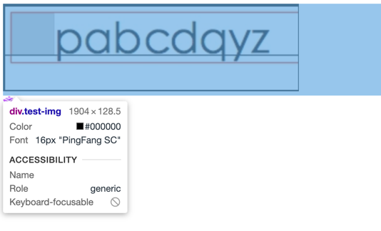
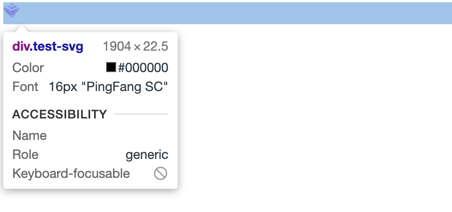
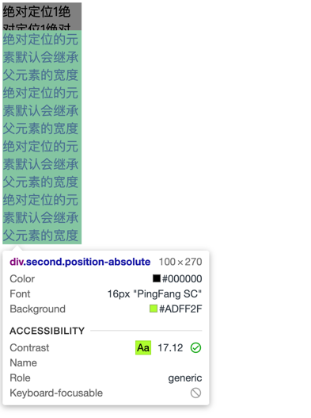

<!-- START doctoc generated TOC please keep comment here to allow auto update -->
<!-- DON'T EDIT THIS SECTION, INSTEAD RE-RUN doctoc TO UPDATE -->
**Table of Contents**  *generated with [DocToc](https://github.com/thlorenz/doctoc)*

- [使用 CSS 时遇到的一些问题总结](#%E4%BD%BF%E7%94%A8-css-%E6%97%B6%E9%81%87%E5%88%B0%E7%9A%84%E4%B8%80%E4%BA%9B%E9%97%AE%E9%A2%98%E6%80%BB%E7%BB%93)
  - [1. `transform` 与 `position: fixed`](#1-transform-%E4%B8%8E-position-fixed)
  - [2. 元素设置 `inline` 属性和 `inline-box` 的一些注意事项](#2-%E5%85%83%E7%B4%A0%E8%AE%BE%E7%BD%AE-inline-%E5%B1%9E%E6%80%A7%E5%92%8C-inline-box-%E7%9A%84%E4%B8%80%E4%BA%9B%E6%B3%A8%E6%84%8F%E4%BA%8B%E9%A1%B9)
    - [1. `inline` 属性需要注意的地方](#1-inline-%E5%B1%9E%E6%80%A7%E9%9C%80%E8%A6%81%E6%B3%A8%E6%84%8F%E7%9A%84%E5%9C%B0%E6%96%B9)
    - [2. `inline-block` 属性需要注意的地方](#2-inline-block-%E5%B1%9E%E6%80%A7%E9%9C%80%E8%A6%81%E6%B3%A8%E6%84%8F%E7%9A%84%E5%9C%B0%E6%96%B9)
  - [3. 一个块元素中，`margin-right` 的计算问题](#3-%E4%B8%80%E4%B8%AA%E5%9D%97%E5%85%83%E7%B4%A0%E4%B8%ADmargin-right-%E7%9A%84%E8%AE%A1%E7%AE%97%E9%97%AE%E9%A2%98)
  - [4. div 的实际渲染高度比其内部的 img 元素的高度要多几 px（有空白）的解决方法](#4-div-%E7%9A%84%E5%AE%9E%E9%99%85%E6%B8%B2%E6%9F%93%E9%AB%98%E5%BA%A6%E6%AF%94%E5%85%B6%E5%86%85%E9%83%A8%E7%9A%84-img-%E5%85%83%E7%B4%A0%E7%9A%84%E9%AB%98%E5%BA%A6%E8%A6%81%E5%A4%9A%E5%87%A0-px%E6%9C%89%E7%A9%BA%E7%99%BD%E7%9A%84%E8%A7%A3%E5%86%B3%E6%96%B9%E6%B3%95)
  - [5. 绝对定位的元素的宽度问题](#5-%E7%BB%9D%E5%AF%B9%E5%AE%9A%E4%BD%8D%E7%9A%84%E5%85%83%E7%B4%A0%E7%9A%84%E5%AE%BD%E5%BA%A6%E9%97%AE%E9%A2%98)
  - [6. 父元素的第一个子元素设置 margin-top 没有起作用，而是成为了父元素的 margin-top](#6-%E7%88%B6%E5%85%83%E7%B4%A0%E7%9A%84%E7%AC%AC%E4%B8%80%E4%B8%AA%E5%AD%90%E5%85%83%E7%B4%A0%E8%AE%BE%E7%BD%AE-margin-top-%E6%B2%A1%E6%9C%89%E8%B5%B7%E4%BD%9C%E7%94%A8%E8%80%8C%E6%98%AF%E6%88%90%E4%B8%BA%E4%BA%86%E7%88%B6%E5%85%83%E7%B4%A0%E7%9A%84-margin-top)

<!-- END doctoc generated TOC please keep comment here to allow auto update -->

# 使用 CSS 时遇到的一些问题总结

## 1. `transform` 与 `position: fixed`

1. 元素设置了  `position: fixed` 以后，元素就相对于 viewport 固定下来，脱离了文档流，固定在页面的某个位置。

2.  元素设置了  `transform` 属性以后，`position: fixed` 这个属性就会失效，降级为 `absolute` 绝对定位。相对的是它的父元素。会随着文档流的移动而移动。

3. 原因是什么呢？
   - W3C 对于 [transform](https://www.w3.org/TR/css-transforms-1/#transform-property) 的解释：
     > 对于布局受CSS盒子模型控制的元素，transform属性不会影响transformed元素周围的内容流。但是，溢出区域的范围将会考虑上transform元素。这种行为类似于元素通过相对定位发生偏移时的情况。因此，如果overflow属性的值是`scroll`或`auto`的，滚动条将显示为需要看到在可见区域外转换的内容。

     >对于布局受CSS盒子模型控制的元素，除了配置为`none`之外，其他的`transform`属性值都会创建堆栈上下文。绘制的实现必须在其父栈上下文中它所创建的层中，如果它是带有“z-index: 0”的定位元素，则使用相同的堆叠顺序。如果一个带有`transform`的元素还配置了`position`属性，那么“z-index”属性将按照[CSS2](https://www.w3.org/TR/css-transforms-1/#biblio-css2)描述的被应用，除非“auto”被视为“0”，因为会创建新的堆栈上下文。

     >对于布局受CSS盒子模型控制的元素，除了配置为`none`之外，其他的`transform`属性值都将导致元素成为一个包含块，而其固定定位的后代元素都是以此object作为他们的包含块。

      >根元素的[Fixed Backgrounds](https://www.w3.org/TR/css3-background/#fixed0)会受到该元素上配置的transform属性的影响。对于受transform影响的所有其他元素(例如，对它们应用transform属性，或者对它们的任何祖先元素应用transform属性)，  `background-attachment`属性值为`fixed`的元素会被当做它好像有配置`scroll`属性一样。其他`background-attachment`的计算值不受影响。
   - 具体而言，应用了 transform 属性的元素会导致该元素形成一个新的包含块，然后其后代元素如果有 fixed 定位的属性，那么其元素将会以该父元素作为包含块，从而会导致 fixed 布局失效。
   - fixed 元素不在固定在某个位置，失去了fixed元素特有的性质
   - fixed 元素不会脱离文档流，但是top等属性依然可用。

4. 解决方案
   - 暂时不要将使用了 transform 属性的 position 设置为 fixed。

5. 参考资料
   - [CSS3 transform对普通元素的N多渲染影响](https://www.zhangxinxu.com/wordpress/2015/05/css3-transform-affect/)
   - [transform与position:fixed的那些恩怨](https://zhuanlan.zhihu.com/p/95021620)

## 2. 元素设置 `inline` 属性和 `inline-box` 的一些注意事项

### 1. `inline` 属性需要注意的地方

1. 元素设置了 inline 属性，那么这个元素变成了行内元素，因此元素不会占据一行，而是和其他行内元素一样，挤在一行中。

2. 但是需要注意的是，元素变成行内元素以后，其内部是不能嵌套块元素的。假如说，我们在行内元素中嵌套了块元素，那么由于行内元素本身没有宽高，因此，其会被内部块元素撑开，因而占据一整行。此时这个行内元素从视觉上也是占据一行的。此种情况下，行内元素就不起作用了。

3. 如果势必要在行内元素中嵌套块元素，还想保持行内元素的特性，那么需要设置元素的 `display` 属性为 `inline-block`，那么这个元素就同时具有了行内元素和块元素的特性。

### 2. `inline-block` 属性需要注意的地方

1. 如果一个元素的 `display` 属性为 `inline-block`，那么这个元素就同时具有了行内元素和块元素的特性。

2. 设置了 `display` 属性为 `inline-block` 的元素，其默认的垂直（vertical）方向是沿着基线（baseline）对齐的。如下图所示：
   
   图片来源：[关于inline-block对齐的问题](https://www.jianshu.com/p/9e0274e0f9bd)

3. 要想让各个元素垂直方向上对齐，可以设置其 `vertical-align` 属性为`top` 即可。

4. 关于属性 `vertical-align`：
    - 该属性用来设置 inline、inline-box 或者 table-cell 元素在竖直方向上的对齐方式，默认值为 baseline。
    - 该属性对于块级盒子无效。
    - 因为是垂直方向的对齐是相对于父级元素来说的，所以其设置的值代表了该元素相对于其父级如何对齐，如 ：
        - 当 `vertical-align: baseline` 时，该元素会将自身的基线（baseline）与其父元素的基线对齐。
        - 同理当 `vertical-align: vertical-top` 时，该元素会将自身的顶部与其父元素的顶部对齐。
    - 关于 `vertical-align` 的详细说明： [vertical-align MDN](https://developer.mozilla.org/en-US/docs/Web/CSS/vertical-align)

5. 关于基线（baseline）、`inline` 元素的基线和 `inline-block` 元素的基线，请看博客：[关于inline-block对齐的问题](https://www.jianshu.com/p/9e0274e0f9bd)

6. 参考资料：
   - [一次内联元素错位引发对line-height的思考](https://juejin.cn/post/6844903709730668552)
   - [line-height 属相详解](https://zzlbt.github.io/2019/05/06/line-height-%E4%B8%8E-vertial-align-%E5%B1%9E%E7%9B%B8%E8%AF%A6%E8%A7%A3/)
   - [深入理解-CSS内联元素之line-height](https://segmentfault.com/a/1190000014515126)

## 3. 一个块元素中，`margin-right` 的计算问题

1. 对于块元素，有一些情况下，我们没有设置 margin-right，或者 设置了 margin-right，但是经过浏览器渲染以后，我们发现实际的 margin-right 值并不是我们设置值，这个是怎么回事呢？示例如下：
```html
    <style>
         .test {
             width: 200px;
             height: 100px;
             margin-left: 25px;
             margin-right: 25px;
             background: yellowgreen;
         }
    </style>
    <div class="test"></div>
```
2. 实际渲染效果：
   
   

3. 可以看出，`margin-right` 并不是设置的 `25px`，而是父容器的宽度除去 `margin-left`、元素的内容区宽度（`width`）之后的宽度。

4. 出现这种现象的原因是：如果元素的 `margin-left`、`margin-right` 被设为固定值，且其值加上元素宽度小于父容器容纳块的宽度，则 `margin-right` 会自动隐式变为 `auto`（宽度填满父容器）。

5. 在 css 规范中有这样一段描述：
   > 10.3.3 Block-level, non-replaced elements in normal flow
   The following constraints must hold among the used values of the other properties:
   >
   > 'margin-left' + 'border-left-width' + 'padding-left' + 'width' + 'padding-right' + 'border-right-width' +'margin-right' = width of containing block

6. 上面的这个公式是用来计算某个属性如果设置为 `auto` 或者没有设置这个属性时，这个属性实际的值应该是多少。所以，在从左向右（ltr）布局中，优先使用 margin-left、width，同时为了满足这个公式，如果 `'margin-left' + 'border-left-width' + 'padding-left' + 'width' + 'padding-right' + 'border-right-width' +'margin-right'` 小于 `containing block`，即使我们设置了 `margin-right`，浏浏览器也不会采用，而是设置 `margin-right` 为剩余的宽度。


## 4. div 的实际渲染高度比其内部的 img 元素的高度要多几 px（有空白）的解决方法

1. 如果一个 img 元素或者 svg 元素放在 div内，且 div 没有指定高度，完全由子元素撑开高度，那么 div 的实际高度。会比 img 或者 svg 元素多几px，具体是多少根据浏览器确定。

2. 示例：
```html
    <div class="test-img">
        
    </div>
    <div class="test-svg">
        <svg width="18" height="16" viewBox="0 0 18 16" fill="none" xmlns="http://www.w3.org/2000/svg">
            <path d="M8.6156 3.07706V0L11.4875 1.84624L8.6156 3.07706Z" fill="url(#paint0_linear_10056_21593)"/>
            <path d="M8.6156 3.07706V0L5.74367 1.84624L8.6156 3.07706Z" fill="url(#paint1_linear_10056_21593)"/>
            <path d="M12.6363 2.46216L8.6156 4.3084V6.77005L14.3595 3.69298L12.6363 2.46216Z" fill="url(#paint2_linear_10056_21593)"/>
            <path d="M4.5949 2.46216L8.6156 4.3084V6.77005L2.87175 3.69298L4.5949 2.46216Z" fill="url(#paint3_linear_10056_21593)"/>
            <path d="M8.61578 8.00009L1.72316 4.30762L0 5.53844L8.61578 10.4617V8.00009Z" fill="url(#paint4_linear_10056_21593)"/>
            <path d="M8.61542 8.00009L15.508 4.30762L17.2312 5.53844L8.61542 10.4617V8.00009Z" fill="url(#paint5_linear_10056_21593)"/>
            <path d="M8.61578 16.0001V10.4614L0 5.53809L8.61578 16.0001Z" fill="url(#paint6_linear_10056_21593)"/>
            <path d="M8.61542 16.0001V10.4614L17.2312 5.53809L8.61542 16.0001Z" fill="url(#paint7_linear_10056_21593)"/>
            <defs>
                <linearGradient id="paint0_linear_10056_21593" x1="8.18481" y1="2.58473" x2="10.5302" y2="0.957309" gradientUnits="userSpaceOnUse">
                    <stop stop-color="#B265FF"/>
                    <stop offset="1" stop-color="#E5C4FF"/>
                </linearGradient>
                <linearGradient id="paint1_linear_10056_21593" x1="8.6156" y1="1.43596" x2="6.70098" y2="0.957309" gradientUnits="userSpaceOnUse">
                    <stop stop-color="#C984FF"/>
                    <stop offset="1" stop-color="#E8CBFF"/>
                </linearGradient>
                <linearGradient id="paint2_linear_10056_21593" x1="8.6156" y1="5.2649" x2="13.4021" y2="2.87163" gradientUnits="userSpaceOnUse">
                    <stop stop-color="#9948FF"/>
                    <stop offset="1" stop-color="#CA86FF"/>
                </linearGradient>
                <linearGradient id="paint3_linear_10056_21593" x1="3.82906" y1="2.87163" x2="8.6156" y2="5.26491" gradientUnits="userSpaceOnUse">
                    <stop stop-color="#D49EFF"/>
                    <stop offset="1" stop-color="#B77EFF"/>
                </linearGradient>
                <linearGradient id="paint4_linear_10056_21593" x1="0.957309" y1="5.26493" x2="8.61578" y2="9.09416" gradientUnits="userSpaceOnUse">
                    <stop stop-color="#CA86FF"/>
                    <stop offset="1" stop-color="#B469FF"/>
                </linearGradient>
                <linearGradient id="paint5_linear_10056_21593" x1="8.61542" y1="9.09416" x2="16.2739" y2="4.78627" gradientUnits="userSpaceOnUse">
                    <stop stop-color="#9122FF"/>
                    <stop offset="1" stop-color="#E5C5FF"/>
                </linearGradient>
                <linearGradient id="paint6_linear_10056_21593" x1="5.74385" y1="8.97514" x2="8.61578" y2="15.078" gradientUnits="userSpaceOnUse">
                    <stop stop-color="#9420EF"/>
                    <stop offset="1" stop-color="#DBBFFF"/>
                </linearGradient>
                <linearGradient id="paint7_linear_10056_21593" x1="11.966" y1="11.9663" x2="9.90779" y2="9.90824" gradientUnits="userSpaceOnUse">
                    <stop stop-color="#D2B7FF"/>
                    <stop offset="1" stop-color="#9D2FF2"/>
                </linearGradient>
            </defs>
        </svg>

    </div>
```
3. 没有给 div 添加任何样式，实际的渲染效果如下：



4. 图片的高度是 123px，svg 的高度是 16px。因此，父元素的高度均比子元素的实际高度高，即下方存在空白。

5. 这种现象产生的原因是：img 和 svg 在渲染时，浏览器会将其作为行内（inline）元素渲染。而行内元素的默认对齐方式是沿着基线（baseline）对齐，所以是图片底边与容器基线对齐了，留出了基线与底线的空白。

6. > 这其实是一个很古老的BUG， 标记是一个内联元素。这意味着它被视为文本。当文本被放置在页面上时，就会为下降器留出空间。换句话说，你在图片下方看到的空白是由于浏览器假设在图片之前或之后的文本中可能有一个下标，因此为它腾出了空间。比如你在页面写上字母 a, c, e, m, n, o, r, s, u, v, w, x, z，或者æ、ø符号。你会发现这些字母在我们学习英语时，在英文本（四线本）的四条横线上高度一致，并且都没有超出上下，但是其他字母有上升部分(b, d, f, h, k, l, t)或下降部分(g, j, p, q, y)，也就是超出四条线的第2、3条横线，这时就要给文本加上三个px的多余像素，避免文本的显示问题，这个问题一直保留着。所以把 设置为块级元素就可以消除其附属的文本元素属性。

7. 以上摘自：[img内嵌div元素的高度问题](https://blog.csdn.net/qq_37495762/article/details/119103824)，道理其实都是一样的，就是将 img 当做行内元素渲染，而行内元素默认是沿着基线对齐的。

8. 解决方法：
   - 将 img、svg 等元素变成块级元素。即：`{dispaly: block}`。
   - 设置父元素的 font-size 为 0。即：`.test-img {font-size: 0;}`。
   - 设置 img 的垂直对齐方式为除 baseline 以外的值，如：`{vertical-align: top;}`。

9. 参考资料：
   - [div 或 span 的高度比 img 的高度要多3px。如何解决？](https://blog.csdn.net/yangyangkl123/article/details/111405192)
   - [如何解决div里面img图片下方有空白的问题？](https://www.cnblogs.com/liuna/p/6678404.html)
   - [解决div里面img图片下方有空白的问题](https://blog.csdn.net/Liu_yunzhao/article/details/104622845)
   - [多余的空白--img](https://juejin.cn/post/7173874357469610014)
   - [inline-block元素因基线对齐而造成上浮的问题](https://www.cnblogs.com/geek1116/p/10036650.html)


## 5. 绝对定位的元素的宽度问题

1. div 默认是块级元素，默认情况下会继承父元素的宽度。

2. 如果 div 设置了绝对定位，那么它会脱离正常的文档流。此时如果没有给 div 显示设置宽度，那么它的宽度则是由其的内容来决定的，内容来把它撑大。

3. 即使这个 div 的宽度设置了 100%，也不一定会保持不变，如果 div 的父元素设置了相对定位（relative），那么这个 100% 是想对于父元素的，如果父元素没有设置相对定位，它会一级一级往上找，直到找到离它最近的非 static 定位的父元素或者是 body 元素。

4. 即使这个 div 没有设置宽度，如果其定位为非 static 的父元素有宽度，那么这个 div 会继承这个宽度的。

5. 示例：设置父元素为相对定位，子元素为绝对定位，父元素没有宽度：
   ```html
      <style>
        .outer-container {
            position: relative;
            /*width: 80px;*/
            background: yellow;
        }

        .container {
            width: auto;
        }


        .outer-container .first {
            background: gray;
            /*width: 75px;*/
        }
        .outer-container .position-absolute {
            position: absolute;
            background: greenyellow;
            top: 35px;
        }
        .text {
            width: 55px;
            height: 20px;
        }
       </style>
      <div class="outer-container">

        <div class="second position-absolute">绝对定位的元素默认会继承父元素的宽度绝对定位的元素默认会继承父元素的宽度绝对定位的元素默认会继承父元素的宽度绝对定位的元素默认会继承父元素的宽度</div>
        <div class="first">绝对定位1绝对定位1绝对定位1</div>
        <div class="text"></div>
    </div>
   ```
   结果：
   
   first 继承了父元素的宽度，second 没有继承父元素的宽度，而是由内容撑开的宽度。

6. 示例：设置父元素为相对定位，子元素为绝对定位，父元素指定宽度：
```html
    <style>
    .outer-container {
        position: relative;
        width: 100px;
        background: yellow;
    }

    .container {
        width: auto;
    }


    .outer-container .first {
        background: gray;
        /*width: 75px;*/
    }
    .outer-container .position-absolute {
        position: absolute;
        background: greenyellow;
        top: 35px;
    }
    .text {
        width: 55px;
        height: 20px;
    }
   </style>
   <div class="outer-container">

    <div class="second position-absolute">绝对定位的元素默认会继承父元素的宽度绝对定位的元素默认会继承父元素的宽度绝对定位的元素默认会继承父元素的宽度绝对定位的元素默认会继承父元素的宽度</div>
    <div class="first">绝对定位1绝对定位1绝对定位1</div>
    <div class="text"></div>
   </div>
```
   结果：
   
   绝对定位的宽度继承了父元素的宽度，是 `100px`。此时文字出现了换行。

8. 示例：设置父元素为 static 定位，子元素为绝对定位，父元素指定宽度，同时指定子元素宽度为 100%：
```html
   <style>
    .outer-container {
        /*position: relative;*/
        width: 100px;
        background: yellow;
    }

    .container {
        width: auto;
    }


    .outer-container .first {
        background: gray;
        /*width: 75px;*/
    }
    .outer-container .position-absolute {
        position: absolute;
        background: greenyellow;
        width: 100%;
        top: 35px;
    }
    .text {
        width: 55px;
        height: 20px;
    }
   </style>
   <div class="outer-container">

    <div class="second position-absolute">绝对定位的元素默认会继承父元素的宽度绝对定位的元素默认会继承父元素的宽度绝对定位的元素默认会继承父元素的宽度绝对定位的元素默认会继承父元素的宽度</div>
    <div class="first">绝对定位1绝对定位1绝对定位1</div>
    <div class="text"></div>
   </div>
```
   结果：
   
   绝对定位的子元素的宽度为100%，其相对的是 body 元素，而不是其父元素，所以其宽度和body 的宽度相同。

9. 总结：
   - 绝对定位的元素，如果其父元素的定位是非 static 属性，且设置了宽度，那么绝对定位的元素会继承这个宽度。
   - 绝对定位的元素，如果设置其宽度为 100%，那么这个相对的基准是其父级元素中，第一个定位为非 static 属性的元素。
   - 绝对定位的元素，如果其父元素的定位是非 static 属性，且没有设置宽度，则由内容撑开宽度。

10. 我的理解是，无论如何，绝对定位的元素都会继承定位属性为非 static 的父级元素的宽度，只不过如果父元素没有显式宽度，或者是宽度大于子元素，那么子元素的宽度就是内容的宽度，且其宽度不会大于父元素宽度。如果父级元素有指定的宽度，那么子元素就会继承这个宽度。

11. 解决绝对定位子元素继承父元素宽度导致折行的解决方法：
    - 不让绝对定位的元素内容折行：`white-space: nowrap;`。`white-space` 就是空格的意思，这个 css 属性的作用是，浏览器如何处理空格。设置为 `nowrap` 即可保证内容不换行，因此可以撑开元素的宽度。
    - 给绝对定位的元素设置一个具体的宽度。

12. 参考资料
     - [为什么white-space:nowrap可以让文字一行显示？](https://www.zhangxinxu.com/wordpress/2021/07/css-white-space-nowrap/)
     - [white-space MDN](https://developer.mozilla.org/en-US/docs/Web/CSS/white-space)
     - [absolute定位宽高尺寸继承](https://blog.csdn.net/weixin_43926275/article/details/117758479)
     - [在绝对定位时，div的宽度是不是自适应的？](https://segmentfault.com/q/1010000006644913)

## 6. 父元素的第一个子元素设置 margin-top 没有起作用，而是成为了父元素的 margin-top

1. 在一个嵌套的盒子中，给第一个子元素设置 `margin-top`，这个 `margin-top` 会影响父元素的 `margin-top`。换句话说，就是第一个子元素的 `margin-top`，会成为父元素的 `margin-top`。

2. 示例：
```html
   <style>
    .test {
        height: 100px;
        background: greenyellow;
    }
    .outer {
        background: red;
        height: 300px;
    }
    .inner-first {
        margin-top: 100px;
    }
   </style>


   <body>
   <div class="test"></div>
   <div class="outer">
       <div class="inner-first">第一个子元素</div>
       <div class="inner-second">第二个子元素</div>
   </div>
   </body>
```
   结果：
   
   显然，第一个元素的 margin-top 并没有在 outer 元素内生效，而是在 outer 元素外生效了，表现就是成为了 outer 元素的 margin-top。

3. 出现这种现象的原因是什么呢？原来这是 CSS 2.1 中，盒模型的规定：
    >  所有毗邻的两个或更多盒元素的margin将会合并为一个margin共享之。毗邻的定义为：同级或者嵌套的盒元素，并且它们之间没有非空内容、Padding或Border分隔。

4. 那么原因就很明显了，outer 和 inner-first 是嵌套的元素，它们之间没有其他内容，outer 或 inner-first 也没有 padding 和 border，那么会发生 margin-top 合并问题。

5. 本质上还是 margin 的垂直塌陷问题。

6. 解决方法方法也是从非空内容、Padding 或 Border 分隔这几方面下手：
   - 给 outer 设置 padding 属性，但是会增加 outer 元素的高度。
     ```css
        .outer {
          background: red;
          height: 300px;
          padding-top: 1px;
        }
     ```
     结果：
   
   - 给 outer 设置 border 属性，但是会增加 outer 元素的高度。
     ```css
        .outer {
          background: red;
          height: 300px;
          border-top: 1px solid black;
          
        }
     ```
     结果：
     
   - 设置非空内容，为了不添加额外的 dom 节点，通常是插入一个伪元素：
     ```css
        .outer:before {
                content: '';
                display: block;
        }
        
        /*或者是 */
        /*.inner-first:before {*/
        /*    content: '';*/
        /*    display: block;*/
        /*}*/

     ```
    结果：
    
   - 指定 outer 的 overflow 属性为 hidden，使其成为一个 BFC，缺点是超出父元素高度的内容会被隐藏。
     ```css
        .outer {
          background: red;
          height: 300px;
          overflow: hidden;
          
        }
     ```
     结果：
     

7. 对父元素影响最小的方案还是插入伪元素的方案。

8. 参考资料：
   - [子元素的margin-top属性为什么会影响父元素的margin-top?](https://www.jianshu.com/p/1772f60e8f4c)
   - [前端黑科技-解决父元素的第一个子元素的margin-top越界问题 ](https://blog.51cto.com/u_9869701/3697823)
   - [子元素 margin 超出父元素的bug(垂直塌陷) ](https://blog.csdn.net/Ray_20160915/article/details/100144088)