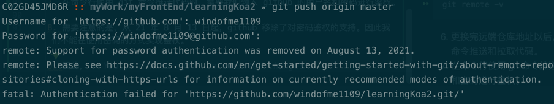

# Git 基本使用方式

## 1. 基本说明

1. Git，世界上最先进的分布式版本控制管理工具。

2. 我们已经在电脑上安装了 Git。安装过程省略，下面开始介绍Git的基本用法。

3. 注意，我们使用的是 git bash 这个终端工具进行 git 命令操作。不使用 windows 自带的命令提示符。

## 2. 配置 Git

### 1. 设置姓名和邮箱地址

1. 命令：
   - `git config --global user.name "github用户名"`
   - `git config --global user.email "注册github所用的邮箱"`

2. 用自己的 github 用户名和注册邮箱其替换。这个命令设置的是全局的用户名和邮箱，意思就是所有的本地仓库都会使用。如果只想单独设置某个仓库的用户名和邮箱，将 `global` 参数改动为 `local`。

3. 这个命令，会在 `~/.gitconfig` 中以如下形式输出设置文件。这个文件的在 `C:\Users\Administrator.USER-20181123NM` 目录下。

### 2. 设置 SSH Key

1. GitHub 上连接已有仓库时的认证，是通过使用了 SSH 的公开密钥认证方式进行的。现在让我们来创建公开密钥认证所需的 SSH Key，并将其添加至 GitHub。

2. `输入：ssh-keygen -t rsa -C "注册github所用的邮箱"`

3. 然后会出现：
`Generating public/private rsa key pair.
Enter file in which to save the key (/c/Users/Administrator.USER-20181123NM/.ssh/id_rsa):`

4. 此时按下回车键，会将 SSH Key 保存在 `C:/Users/Administrator.USER-20181123NM/.ssh` 这个目录下，同时提示：
`Created directory '/c/Users/Administrator.USER-20181123NM/.ssh'.`

5. 紧接着会提示：
`Enter passphrase (empty for no passphrase):`
这一步告诉我们要设置一个密码，我们可以不用设置，直接按回车键即可。
`Enter same passphrase again:`
同样，让我们确认密码，由于我们没有输入，所在也是直接按下回车键。

6. 完成上面三步以后，会出现一下结果：
   ```
      Your identification has been saved in /c/Users/Administrator.USER-20181123NM/.ssh/id_rsa.
      Your public key has been saved in /c/Users/Administrator.USER-20181123NM/.ssh/id_rsa.pub.
      The key fingerprint is:
   ```
      `fingerprint值`
   ```
      The key's randomart image is:
      +---[RSA 3072]----+
      |.o  ..+.         |
      |B o. +. .        |
      |oX.. oE.  .      |
      |+o.+..o. o .     |
      |  + + +.S.o+ .   |
      |     o =..+.B    |
      |      o + .+.+   |
      |     . o o o...  |
      |      +o... o.   |
      +----[SHA256]-----+
   ```
7. 添加公开秘钥。在 GitHub 中添加公开密钥，今后就可以用私有密钥进行认证了。


### 3. 配置 HTTPS 连接

1. github 也可以通过 https 的方式拉取上传代码。

2. 第一步是将仓库的远端地址配置为 https，例如：https://github.com/windofme1109/learningKoa2.git

3. 如果仓库没有配置远端地址，可以使用下面的命令进行配置：
```shell
   git remote add origin https://github.com/windofme1109/learningKoa2.git
```

4. 如果仓库已经配置了 ssh 地址，那么可以使用下面的命令进行更换：
```shell
git remote set-url origin https://github.com/OWNER/REPOSITORY.git
```

5. 查看更换后的远端仓库地址：
```shell
git remote -v
```

6. 更换完远端仓库地址以后，可以使用 `git push`、`git pull` 等命令推送和拉取代码。

7. 在命令行使用 git 命令推送代码时，需要我们输入 github 的用户名和密码进行鉴权。

8. 需要注意的是，从 21 年 8 月 13 日起，github 移除了对密码鉴权的支持。因此我们不能在使用密码的方式实现鉴权。


9. Github 提供了两种方式实现鉴权：
   - Personal Access Token
   - [Git Credential Manager](https://github.com/git-ecosystem/git-credential-manager/blob/main/README.md)

#### 1. Personal Access Token

1. 详细配置方法可见：[github的token使用方法](https://blog.csdn.net/chengwenyang/article/details/120060010)

#### 2. Git Credential Manager

1. 详细使用方法可见：[Git Credential Manager](https://github.com/git-ecosystem/git-credential-manager/blob/main/README.md)

2. Git Credential Manager 是一个命令行帮助工具，在我们使用 git 命令的时候，会打开一个窗口提示我们要进行授权操作，我们按照提示进行操作即可完成授权。

#### 3. 参考资料

1. [Managing your personal access tokens](https://docs.github.com/en/authentication/keeping-your-account-and-data-secure/managing-your-personal-access-tokens)

2. [Managing remote repositories](https://docs.github.com/en/get-started/getting-started-with-git/managing-remote-repositories)

3. [Caching your GitHub credentials in Git](https://docs.github.com/en/get-started/getting-started-with-git/caching-your-github-credentials-in-git)

4. [github-cli](https://github.com/cli/cli#installation)

5. [github的token使用方法](https://blog.csdn.net/chengwenyang/article/details/120060010)