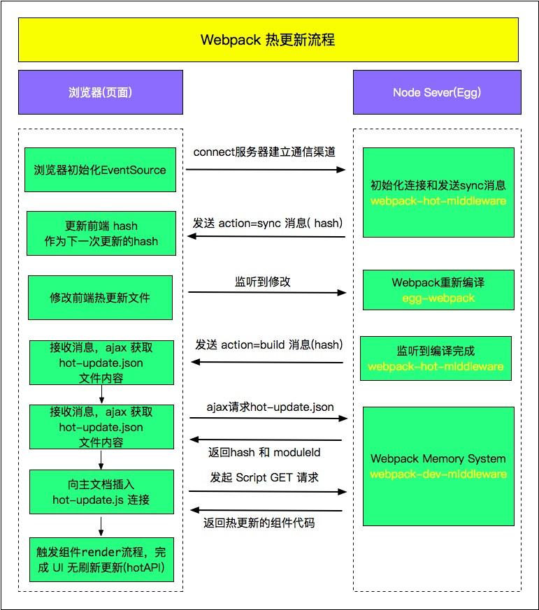

<!-- START doctoc generated TOC please keep comment here to allow auto update -->
<!-- DON'T EDIT THIS SECTION, INSTEAD RE-RUN doctoc TO UPDATE -->
**Table of Contents**  *generated with [DocToc](https://github.com/thlorenz/doctoc)*

- [webpack Interview](#webpack-interview)
  - [1. 参考资料](#1-%E5%8F%82%E8%80%83%E8%B5%84%E6%96%99)
  - [2. loader](#2-loader)
    - [1. 什么是 loader](#1-%E4%BB%80%E4%B9%88%E6%98%AF-loader)
    - [2. 用过哪些 loader](#2-%E7%94%A8%E8%BF%87%E5%93%AA%E4%BA%9B-loader)
    - [3. 有没有写过 loader](#3-%E6%9C%89%E6%B2%A1%E6%9C%89%E5%86%99%E8%BF%87-loader)
  - [3. plugin](#3-plugin)
    - [1. 什么是 plugin](#1-%E4%BB%80%E4%B9%88%E6%98%AF-plugin)
    - [2. 用过哪些 plugin](#2-%E7%94%A8%E8%BF%87%E5%93%AA%E4%BA%9B-plugin)
    - [3. 有没有写过 plugin](#3-%E6%9C%89%E6%B2%A1%E6%9C%89%E5%86%99%E8%BF%87-plugin)
  - [4. loader 与 plugin 的区别](#4-loader-%E4%B8%8E-plugin-%E7%9A%84%E5%8C%BA%E5%88%AB)
  - [5. Webpack构建流程简单说一下](#5-webpack%E6%9E%84%E5%BB%BA%E6%B5%81%E7%A8%8B%E7%AE%80%E5%8D%95%E8%AF%B4%E4%B8%80%E4%B8%8B)
  - [6. source map 是什么？生产环境怎么用？](#6-source-map-%E6%98%AF%E4%BB%80%E4%B9%88%E7%94%9F%E4%BA%A7%E7%8E%AF%E5%A2%83%E6%80%8E%E4%B9%88%E7%94%A8)
  - [7. 模块打包原理知道吗？](#7-%E6%A8%A1%E5%9D%97%E6%89%93%E5%8C%85%E5%8E%9F%E7%90%86%E7%9F%A5%E9%81%93%E5%90%97)
  - [8. 说一下 Webpack 的热更新原理吧](#8-%E8%AF%B4%E4%B8%80%E4%B8%8B-webpack-%E7%9A%84%E7%83%AD%E6%9B%B4%E6%96%B0%E5%8E%9F%E7%90%86%E5%90%A7)
  - [9. 文件指纹是什么？怎么用？](#9-%E6%96%87%E4%BB%B6%E6%8C%87%E7%BA%B9%E6%98%AF%E4%BB%80%E4%B9%88%E6%80%8E%E4%B9%88%E7%94%A8)
  - [10. 如何优化 Webpack 的构建速度？](#10-%E5%A6%82%E4%BD%95%E4%BC%98%E5%8C%96-webpack-%E7%9A%84%E6%9E%84%E5%BB%BA%E9%80%9F%E5%BA%A6)
  - [11. 什么是 bundle，chunk，module？](#11-%E4%BB%80%E4%B9%88%E6%98%AF-bundlechunkmodule)

<!-- END doctoc generated TOC please keep comment here to allow auto update -->

# webpack Interview 

## 1. 参考资料

1. [「吐血整理」再来一打Webpack面试题](https://juejin.cn/post/6844904094281236487)
2. [面试重点：webpack](https://juejin.cn/post/6844904008335753230)
3. [Webpack HMR 原理解析](https://zhuanlan.zhihu.com/p/30669007)
4. [Webpack 热更新实现原理分析](https://zhuanlan.zhihu.com/p/30623057)

## 2. loader 

### 1. 什么是 loader

1. webpack 只能处理 JavaScript 文件，对于非 JavaScript 文件就无能为力了。而 loader 就是帮助我们处理非 JavaScript 文件，辅助 webpack 打包非 JavaScript 文件，如图片、css 等。

### 2. 用过哪些 loader 

1. file-loader
   把文件输出到一个文件夹中，在代码中通过相对 URL 去引用输出的文件 (处理图片和字体)

2. url-loader
   与 file-loader 类似，区别是用户可以设置一个阈值，大于阈值会交给 file-loader 处理，小于阈值时返回文件 base64 形式编码 (处理图片和字体)

3. style-loader
   把 css 代码注入到 JavaScript 中，通过 DOM 操作去加载 css，即创建一个 style 标签，将 css 内容挂载的 html 文件中的 header 的这个 style 标签中。

4. css-loader
   分析 css 文件之间的相互依赖关系，最终经这些 css 内容合并到一起。支持模块化、压缩、文件导入等特性

5. sass-loader
   将 scss/sass 代码转换成 css

6. ts-loader
   将 TypeScript 转换成 JavaScript

7. postcss-loader
   扩展 CSS 语法，使用下一代 CSS，可以配合 autoprefixer 插件自动补齐 CSS3 前缀

### 3. 有没有写过 loader

1. loader 本质上是一个函数，接收的的 utf-8 格式的字符串形式的源码，我们可以对这些源码进行操作。

2. 定义 loader **不能使用箭头函数**，因为箭头函数没有 `this` 指向，而 loader 需要 `this` 做一些事，webpack 会改变函数的 `this` 指向，调用挂载到 `this` 上的一些方法。

3. loader 接收的是入口文件的源码，输出的是处理后的源码，因此，loader 必须有返回值，且为处理后的源码。

4. 使用 `loader-utils` 获取 webpack.config.js 中的 `options` 配置项。

5. 使用绝对路径加载自定义 loader。

## 3. plugin

### 1. 什么是 plugin

1. 在 webpack 中，插件就是在 webpack 运行到某个时机，对打包编译过程进行某种操作的工具。对 webpack 的功能进行扩展，可以在构建的过程中通过 webpack 的 api 改变输出的结果。

### 2. 用过哪些 plugin

1. HtmlWebpackPlugin
   简化 HTML 文件创建，生成一个 html 模板

2. CleanWebpackPlugin
   清除 dist 目录下的文件

3. MiniCssExtractPlugin
   分离样式文件，CSS 提取为独立文件，支持按需加载

4. HotModuleReplacementPlugin
   启用 HMR 功能

### 3. 有没有写过 plugin

1. 插件是一个构造函数或者类，能够使用 `new` 关键字进行实例化。

2. webpack 提供了很多的 hook，这些 hook 在打包编译过程中的不同时机被触发，类似于 React 中的组件的生命周期函数。

3. 一个 webpack 插件的基本结构:
   - 必须是构造方法或者类
   - 类中必须覆写 apply() 方法

4. 在类的constructor 中接收插件的配置项。

5. apply() 接收的 compiler 和 compilation 对象都是同一个引用，若在一个插件中修改了它们身上的属性，会影响后面的插件。

6. 找出合适的事件点去完成想要的功能
   - emit 事件发生时，可以读取到最终输出的资源、代码块、模块及其依赖，并进行修改(emit 事件是修改 Webpack 输出资源的最后时机)
   - watch-run 当依赖的文件发生变化时会触发

7. 异步的事件需要在插件处理完任务时调用回调函数通知 Webpack 进入下一个流程，不然会卡住。

## 4. loader 与 plugin 的区别

1. Loader 本质就是一个函数，在该函数中对接收到的内容进行转换，返回转换后的结果。因为 Webpack 只认识 JavaScript，所以 Loader 就成了翻译官，对其他类型的资源进行转译的预处理工作。

2. Plugin 就是插件，基于事件流框架 Tapable，插件可以扩展 Webpack 的功能，在 Webpack 运行的生命周期中会广播出许多事件，Plugin 可以监听这些事件，在合适的时机通过 Webpack 提供的 API 改变输出结果。

3. Loader 在 module.rules 中配置，作为模块的解析规则，类型为数组。每一项都是一个 Object，内部包含了 test(类型文件)、loader、options (参数)等属性。

4. Plugin 在 plugins 中单独配置，类型为数组，每一项是一个 Plugin 的实例，参数都通过构造函数传入。

## 5. Webpack构建流程简单说一下

1. Webpack 的运行流程是一个串行的过程，从启动到结束会依次执行以下流程：
   - 初始化参数：从配置文件和 Shell 语句中读取与合并参数，得出最终的参数
   - 开始编译：用上一步得到的参数初始化 Compiler 对象，加载所有配置的插件，执行对象的 run 方法开始执行编译
   - 确定入口：根据配置中的 entry 找出所有的入口文件
   - 编译模块：从入口文件出发，调用所有配置的 Loader 对模块进行翻译，再找出该模块依赖的模块，再递归本步骤直到所有入口依赖的文件都经过了本步骤的处理
   - 完成模块编译：在经过第4步使用 Loader 翻译完所有模块后，得到了每个模块被翻译后的最终内容以及它们之间的依赖关系
   - 输出资源：根据入口和模块之间的依赖关系，组装成一个个包含多个模块的 Chunk，再把每个 Chunk 转换成一个单独的文件加入到输出列表，这步是可以修改输出内容的最后机会
   - 输出完成：在确定好输出内容后，根据配置确定输出的路径和文件名，把文件内容写入到文件系统

2. 在以上过程中，Webpack 会在特定的时间点广播出特定的事件，插件在监听到感兴趣的事件后会执行特定的逻辑，并且插件可以调用 Webpack 提供的 API 改变 Webpack 的运行结果。

3. 总结：
   - 初始化：启动构建，读取与合并配置参数，加载 Plugin，实例化 Compiler
   - 编译：从 Entry 出发，针对每个 Module 串行调用对应的 Loader 去翻译文件的内容，再找到该 Module 依赖的 Module，递归地进行编译处理
   - 输出：将编译后的 Module 组合成 Chunk，将 Chunk 转换成文件，输出到文件系统中

## 6. source map 是什么？生产环境怎么用？

1. source map 是将编译、打包、压缩后的代码映射回源代码的过程。打包压缩后的代码不具备良好的可读性，想要调试源码就需要 soucre map。

2. map 文件只要不打开开发者工具，浏览器是不会加载的。

3. 配置 `devtool` 字段来配置 source-map。

4. 避免在生产中使用 inline- 和 eval-，因为它们会增加 bundle 体积大小，并降低整体性能。

## 7. 模块打包原理知道吗？

1. Webpack 实际上为每个模块创造了一个可以导出和导入的环境，本质上并没有修改代码的执行逻辑，代码执行顺序与模块加载顺序也完全一致。

## 8. 说一下 Webpack 的热更新原理吧

1. Webpack 的热更新又称热替换（Hot Module Replacement），缩写为 HMR。 这个机制可以做到不用刷新浏览器而将新变更的模块替换掉旧的模块。

2. HMR 的核心就是客户端从服务端拉去更新后的文件，准确的说是 chunk diff (chunk 需要更新的部分)，实际上 WDS （webpack-dev-server） 与浏览器之间维护了一个 Websocket，当本地资源发生变化时，WDS 会向浏览器推送更新，并带上构建时的 hash，让客户端与上一次资源进行对比。客户端对比出差异后会向 WDS 发起 Ajax 请求来获取更改内容(文件列表、hash)，这样客户端就可以再借助这些信息继续向 WDS 发起 jsonp 请求获取该 chunk 的增量更新。

3. 后续的部分(拿到增量更新之后如何处理？哪些状态该保留？哪些又需要更新？)由 HotModulePlugin 来完成，提供了相关 API 以供开发者针对自身场景进行处理，像 react-hot-loader 和 vue-loader 都是借助这些 API 实现 HMR。

4. 图示：
   

## 9. 文件指纹是什么？怎么用？

1. 文件指纹是打包后输出的文件名的后缀。
   - `Hash`：和整个项目的构建相关，只要项目文件有修改，整个项目构建的 `hash` 值就会更改。
   - `Chunkhash`：和 Webpack 打包的 chunk 有关，不同的 entry 会生出不同的 `chunkhash`。
   - `Contenthash`：根据文件内容来定义 hash，文件内容不变，则 `contenthash` 不变。

## 10. 如何优化 Webpack 的构建速度？

1. 使用高版本的 webpack / node.js。

2. 多进程/多实例构建。

3. 压缩代码。

4. 图片压缩。

5. 提取页面公共资源：
   - 使用 html-webpack-externals-plugin，将基础包通过 CDN 引入，不打入 bundle 中。
   - 使用 SplitChunksPlugin 进行(公共脚本、基础包、页面公共文件)分离(Webpack4 内置) ，替代了 CommonsChunkPlugin 插件。。

6. Tree shaking
   - 打包过程中检测工程中没有引用过的模块并进行标记，在资源压缩时将它们从最终的 bundle 中去掉(只能对 ES6 Modlue 生效) 开发中尽可能使用 ES6 Module 的模块，提高 tree shaking 效率
   - 禁用 babel-loader 的模块依赖解析，否则 Webpack 接收到的就都是转换过的 CommonJS 形式的模块，无法进行 tree-shaking。

7. 动态 Polyfill
   - 建议采用 polyfill-service 只给用户返回需要的 polyfill，社区维护。
   - 合理设置 babel 的配置，设置好项目运行的目标浏览器版本，只引入需要的目标浏览器不支持的特性的 polyfill。

8. 合理使用 sourceMap

9. 结合 stats 分析打包结果

10. 开发环境内存编译

11. 开发环境无用插件剔除

## 11. 什么是 bundle，chunk，module？

1. module 就是项目中的资源文件，包括 js、css、图片等，都被被 webpack 当作模块，从而进行打包处理。

2. chunk 文件是 webpack 在打包过程中的一些 module 的集合。webpack 会对这个 chunk 文件进行一些操作。如果我们有多个入口文件，可能会产出多条打包路径，一条路径就会形成一个chunk。

3. bundle 就是 webpack 打包后的产物。webpack 处理好 chunk 文件后，就会输出 bundle 文件，这个 bundle 文件包含了经过加载和编译的最终源文件，所以它可以直接在浏览器中运行。
