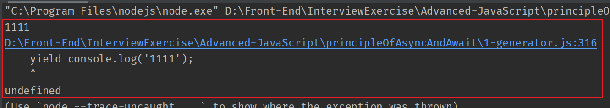
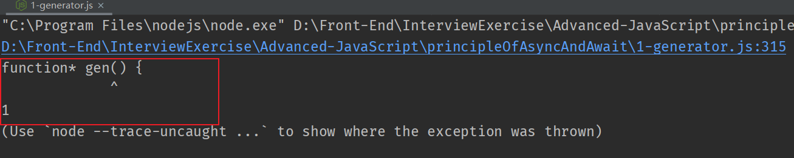

<!-- START doctoc generated TOC please keep comment here to allow auto update -->
<!-- DON'T EDIT THIS SECTION, INSTEAD RE-RUN doctoc TO UPDATE -->
**Table of Contents**  *generated with [DocToc](https://github.com/thlorenz/doctoc)*

- [Generator](#generator)
  - [1. 参考资料](#1-%E5%8F%82%E8%80%83%E8%B5%84%E6%96%99)
  - [2. 基本说明](#2-%E5%9F%BA%E6%9C%AC%E8%AF%B4%E6%98%8E)
  - [3. `yield` 表达式](#3-yield-%E8%A1%A8%E8%BE%BE%E5%BC%8F)
  - [4. `next()` 方法接收参数的意义](#4-next-%E6%96%B9%E6%B3%95%E6%8E%A5%E6%94%B6%E5%8F%82%E6%95%B0%E7%9A%84%E6%84%8F%E4%B9%89)
  - [5. `yield*` 表达式](#5-yield-%E8%A1%A8%E8%BE%BE%E5%BC%8F)
  - [6. `throw()` 方法的作用](#6-throw-%E6%96%B9%E6%B3%95%E7%9A%84%E4%BD%9C%E7%94%A8)
  - [7. `return()` 方法的作用](#7-return-%E6%96%B9%E6%B3%95%E7%9A%84%E4%BD%9C%E7%94%A8)
  - [8. `next()`、`throw()` 和 `return()` 的相同点](#8-nextthrow-%E5%92%8C-return-%E7%9A%84%E7%9B%B8%E5%90%8C%E7%82%B9)

<!-- END doctoc generated TOC please keep comment here to allow auto update -->

# Generator

## 1. 参考资料

1. [ES6系列之Generator](https://www.jianshu.com/p/6055bd421ca4)

2. [ES6 Generator 详解](https://zhuanlan.zhihu.com/p/49577097)

3. [ES6 生成器(Generator)](https://blog.csdn.net/qq_45007419/article/details/105099517)

4. [Generator 函数的异步应用](https://es6.ruanyifeng.com/#docs/generator-async)

5. [Generator 函数的语法](https://es6.ruanyifeng.com/#docs/generator)

## 2. 基本说明

1. `Generator` 函数是 ES6 提供的一种异步编程解决方案。

2. `Generator` 函数可以理解为一个状态机，封装多个内部状态。

3. 调用 `Generator` 函数，不会执行函数内部的代码，而是返回一个遍历器对象（`Iterator Object`）。这个遍历器对象可以依次遍历 `Generator` 函数内部的每一个状态。

4. 特点：
   1. 定义时，`function` 关键字与函数名之间有一个星号（`*`）。
   2. 函数体内部，使用 `yield` 关键字定义不同的内部状态。

5. 示例：
   ```js
      function* helloWorldGenerator() {
          yield 'hello' ;
          yield 'world' ;
          return 'ending' ;
      }
      // 生成器函数，返回的是一个遍历器对象
      // 这个遍历器对象可以依次遍历Generator函数内部的每一个状态
      var hw = helloWorldGenerator() ;

      // { value: 'hello', done: false }
      console.log(hw.next()) ;
      // { value: 'world', done: false }
      console.log(hw.next()) ;
      // { value: 'ending', done: true }
      console.log(hw.next()) ;
      // { value: undefined, done: true }
      console.log(hw.next()) ;
   ```
6. 执行说明：
   - 第一次调用 `next()` 方法，`Generator` 函数从头开始执行，当遇到第一个 `yield` 语句时，停止执行，但是会返回 `yield` 后面的值。`next()` 方法返回一个对象，这个对象包含两个属性： `value` 和 `done`。 `value` 属性就是当前 `yield` 表达式的值`hello`，`done`属性的值 `false`，表示遍历还没有结束。
   - 第二次调用 `next()` 方法，`Generator` 函数从上次 `yield` 表达式停下的地方，一直执行到下一个yield表达式。 `next()` 方法返回的对象的 `value` 属性是 `yield` 表达式的值 `world`，`done` 属性的值是 `false`，表示遍历没有结束。
   - 第三次调用 `next()` 方法， `Generator` 函数从上一次yield表达式停下的地方，执行到return语句结束（如果没有 `return` 语句，就执行到函数结束）。next方法返回的对象的 `value` 属性，就是紧跟在 `return` 语句后面的表达式的值（如果没有return语句，则 `value` 属性的值为 `undefined`），`done`属性的值 `true`，表示遍历已经结束。
   - 第四次调用 `next()` 方法，由于 `Generator` 函数已经执行完毕，所以，返回的对象的 `value` 属性的值是 `undefined`，`done` 属性的值是 `true`。以后再调用 `next()` ，都返回的是这个结果。

7. 总结一下，调用  `Generator`  函数，返回一个遍历器对象，代表  `Generator`  函数的内部指针。以后，每次调用遍历器对象的 `next()` 方法，就会返回一个有着 `value` 和 `done` 两个属性的对象。 `value` 属性表示当前的内部状态的值，是 `yield` 表达式后面那个表达式的值；`done` 属性是一个布尔值，表示是否遍历结束。

8. 每次调用 `next()` 方法，内部的指针从函数头部或上一次停下来的地方开始执行，直到遇到下一个 `yield` 语句（或 `return` 语句）为止。

## 3. `yield` 表达式

1. 由于  `Generator`  函数返回的遍历器对象，只有调用 `next` 方法才会遍历下一个内部状态，所以其实提供了一种可以暂停执行的函数。`yield` 表达式就是暂停标志。

2. 遍历器对象的`next`方法的运行逻辑如下。
   1. 遇到 `yield` 表达式，就暂停执行后面的操作，并将紧跟在 `yield` 后面的那个表达式的值，作为返回的对象的 `value` 属性值。
   2. 下一次调用 `next` 方法时，再继续往下执行，直到遇到下一个 `yield`表达式。
   3. 如果没有再遇到新的 `yield` 表达式，就一直运行到函数结束，直到 `return` 语句为止，并将 `return` 语句后面的表达式的值，作为返回的对象的 `value` 属性值。
   4. 如果该函数没有 `return` 语句，则返回的对象的 `value` 属性值为 `undefined`。

3. 需要注意的是，`yield` 表达式后面的表达式，只有当调用 `next()` 方法、内部指针指向该语句时才会执行，因此等于为 JavaScript 提供了手动的“惰性求值”（Lazy Evaluation）的语法功能。上述节选自《ES6标准入门》。

4. `yield` 表达式只能使用在 `Generator` 函数中，用在其他地方会报错。
   ```js
      // SyntaxError: Unexpected number
      (function demo() {
          yield 1 ;
      })()
   ```


5. `yield` 表达式用在另一个表达式中，必须放在圆括号中。
   ```js
      function* demo() {
          // SyntaxError: Unexpected identifier
          console.log('hello' + yield 123) ;
          console.log('world' + (yield 456)) ;
      }
   ```


6. `yield` 表达式作为函数的参数或者在赋值表达式的右侧，可以不必加括号。
   ```js
      function* demo() {
          // ok
          foo(yield 'a', yield 'b') ;
          // ok
          var y = yield 10 + 20 ;
      }  
   ```
7.  `next()` 方法可以接收一个参数，这个参数可以作为上一个语句的返回值。

8. `yield` 语句本身没有返回值，或者说，总是返回 `undefined`。

9. 示例：
   ```js
      function* foo(x) {
           var y = 2 * (yield (x + 1)) ;
           var z = yield (y / 3) ;

           return x + y + z ;
       }

       var a = foo(5) ;
       // { value: 6, done: false }
       console.log(a.next()) ;
       // { value: NaN, done: false }
       console.log(a.next()) ;
       // { value: NaN, done: true }
       console.log(a.next()) ;
   ```
10. 执行说明：
    - 第一次调用 `next()` ，由于 `foo()` 接收了 `5` 作为参数，返回 `yield` 后面的语句：`x+1`，所以 `value` 的值是 `6`。
    - 第二次调用 `next()` ，执行第二个 `yield` 语句，由于 `y` 等于 `2 * yield(x + 1)`，而 `yield` 本身没有返回值，所以，`y` 是 `2 * undefined`（即 `NaN`），此时返回的是 `NaN / 3`，所以还是 `NaN`。
    - 第三次调用 `next()` ，执行 `return` 语句，由于 `z` 等于 `yield(y / 3)`，而 `yield` 本身没有返回值，所以，`z` 是 `undefined`，所以 `x+y+z` 等同于 `5 + NaN + undefined`，所返回的 `value` 依然是 `NaN`。
    - 如果我们给 `next()` 传入了参数，那么情况就不一样了：
      ```js
         // 给next()传入参数
        // { value: 6, done: false }
        console.log(a.next()) ;
        // { value: 8, done: false }
        console.log(a.next(12)) ;
        // { value: 42, done: true }
        console.log(a.next(13)) ;        
      ```
    - 第一次调用 `next()` ，由于 `foo()` 接收了 `5` 作为参数，返回 `yield` 后面的语句：`x+1`，所以 `value` 的值是 `6`。
    - 第二次调用 `next()` ，并传入了 `12` 作为参数。执行第二个 `yield` 语句。由于 `12` 作为上一次的 `yield` 的返回值，所以 `y` 被赋予了 `2 * 12` 为 `24`，此时返回的是 `y / 3`,即 `24 / 3` 为 `8`。 
    - 第三次调用 `next()` ，并传入了 `13` 作为参数。执行 `return` 语句，`13` 会作为第二个 `yield` 语句的返回值。所以 `z` 等于 `13`。所以返回的结果是 `5 + 24 +13` 等于 `42`。

11. **注意**：由于 `next` 方法的参数表示上一个 `yield` 表达式的返回值，所以在第一次使用 `next` 方法时，传递参数是无效的。V8 引擎直接忽略第一次使用 `next` 方法时的参数，只有从第二次使用 `next` 方法开始，参数才是有效的。从语义上讲，第一个 `next` 方法用来启动遍历器对象，所以不用带有参数。节选自《ES6标准入门》。

## 4. `next()` 方法接收参数的意义

1. `next()` 方法接收参数这个功能有很重要的语法意义。 `Generator` 函数从暂停状态到恢复运行，它的上下文状态（context）是不变的。通过 `next()` 方法的参数，就有办法在  `Generator` 函数开始运行之后，继续向函数体内部注入值。也就是说，可以在  `Generator` 函数运行的不同阶段，从外部向内部注入不同的值，从而调整函数行为。节选自《ES6标准入门》。

2. `next()` 方法的说明：[Generator-next](https://developer.mozilla.org/zh-CN/docs/Web/JavaScript/Reference/Global_Objects/Generator/next)

3. 示例：
   ```js
      function* dataConsumer() {
          console.log('started') ;
          console.log(`1.${yield}`) ;
          console.log(`2.${yield}`) ;
          return 'ended'
      }

      var dc = dataConsumer() ;
      // started
      dc.next() ;
      // 1.5
      dc.next('5') ;
      // 1.8
      dc.next('8') ;
   ```
   传入了不同的参数，`yield` 语句会返回不同的值，当然也会执行 `yield` 所在那行的语句。

4. 我们可以使用 `for…of` 遍历 `Generator` 函数返回的 `Iterator` 对象，从而不需要使用 `next()` 方法。示例如下：
   ```js
      function* getCount() {
          yield 0 ;
          yield 1 ;
          yield 2 ;
          yield 3 ;
          yield 4 ;
          yield 5 ;
          return 6;
      }

      var g = getCount() ;
      for (let item of g) {
          // 0 1 2 3 4 5
          console.log(item)
      }   
   ```
   使用 `for…of` 循环，依次输出了 `5` 个 `yield` 表达式的值。

5. **注意**：一旦`next`方法的返回对象的 `done` 属性为 `true`，`for...of` 循环就会中止，且不包含该返回对象，所以上面代码的 `return` 语句返回的 `6`，不包括在 `for...of` 循环之中。

6. 使用 `Generator` 实现斐波那契数列：
   ```js
      // 使用 Generator 实现斐波那契数列
      function* fib() {
          var [pre, cur] = [0, 1] ;
          while (true) {
              yield cur ;
              [pre, cur] = [cur, pre + cur]
          }
      }

      var f = fib() ;
      for (let item of f) {
          if (item > 1000) {
              break
          }
      // 1 1 2 3 5 8 ...
          console.log(item)
      } 
   ```
7. 除了 `for..of` 循环，扩展运算符（`…`）、结构赋值和 `Array.from()` 方法都可以用在 `Generator` 函数返回的 `Iterator` 对象上。示例：
   ```js
      function* numbers() {
          yield 1 ;
          yield 2 ;
          return 3 ;
      }

     var n = numbers() ;
      var a = [...n] ;
      // 扩展运算符
      // [ 1, 2 ]
      console.log(a) ;

      // Array.from()方法
      // // [ 1, 2 ]
      console.log(Array.from(a)) ;

      // 解构赋值
      let [x, y] = a ;
      // 1
      console.log(x) ;
      // 2
      console.log(y) ;  
   ```
8. `for…of` 遍历，只是遍历 `yield` 表达式的值。扩展运算符、解构赋值和 `Array.from()` 方法也是获取的 `yield` 表达式的值。所以，`return` 的语句的值就不会获取。

## 5. `yield*` 表达式

1. `yield*` 表达式用于在一个 `Generator` 函数内部执行另一个 `Generator` 函数。示例：
   ```js
      function* bar1() {
          yield 'a' ;
          yield 'b' ;
       }

       function* foo1() {
           yield 'x' ;
           // yield*表达式运行在一个generator内部调用另一个generator函数
           yield* bar1() ;
           yield 'y'

       }

       for (let v of foo1()) {
       // x a b y
           console.log(v)
       }
   ```
   上面的代码等同于：
   ```js
       function* bar1() {
           yield 'a' ;
           yield 'b' ;
       }

        function* foo1() {
            yield 'x' ;
            // yield*表达式运行在一个generator内部调用另一个generator函数
            // yield* bar1() ;
            for (let item of bar1()) {
                yield item ;
            }
            yield 'y'

        }

        for (let v of foo1()) {
            // x a b y
            console.log(v)
        } 
   ```

2. 如果不使用 `yield*` 表达式，直接使用 `yield` 表达式，会怎么样呢？
   ```js
      function* bar1() {
          yield 'a' ;
          yield 'b' ;
      }

      function* foo1() {
          yield 'x' ;
   

          // 不使用yield*表达式
          // 直接使用yield表达式调用Generator函数
          yield bar1() ;

          yield 'y'

      }


      var gen = foo1() ;

      // x
      gen.next().value ;
      // 一个Iterator对象
      gen.next().value ;
      // y
      gen.next().value ;
   ```
   对比：
   ```js
      function* foo2() {
          yield 'x' ;

          yield* bar1() ;

          yield 'y' ;
      }


      var gen2 = foo2() ;

      // x
      console.log(gen2.next().value) ;
      // a
      console.log(gen2.next().value) ;
      // b
      console.log(gen2.next().value) ;
      // y
      console.log(gen2.next().value) ; 
   ```
   作为对比，`foo1` 返回的是一个 `Itreator` 对象，而 `foo2` 返回的是该`Itreator` 内部的值。

3. 如果 `yield` 后面跟的是一个 `Iterator` 对象，那么就需要在 `yield` 后面加一个星号，表示返回的是一个 `Iterator` 对象，可以对这个 `Iterator` 对象进行遍历。

4. `yield*` 后面的  `Generator`  函数（没有 `return` 语句时），等同于在  `Generator`  函数内部，部署一个 `for...of` 循环（如前面的例子所示）。

5. 在有 `return` 语句时，则需要用`var value = yield* iterator`的形式获取return语句的值。
   ```js
      function* getNum() {
          yield 1 ;
          yield 2 ;

          return 'done' ;
      }

      function* userNum() {
          yield 3 ;
          // 由于getNum()由返回值，所以要用一个变量接收这个返回值
          // 当只有遍历完getNum()的yield表达式的值以后，最后才会得到      return的返回值
          // 并将这个值赋给ret，然后继续向下执行
          var ret = yield* getNum() ;
          console.log('ret: ' + ret) ;
          yield 5 ;
      }

      var un = userNum() ;

      // { value: 3, done: false }
      un.next();

      // { value: 1, done: false }
      un.next() ;

      // { value: 2, done: false }
      un.next() ;

      // ret: done
      // { value: 5, done: false }
      un.next() ;   
   ```
   在第四次调用 `next()` 时，控制台会有输出，过程是这样的：第三次调用 `next()` 时，`getNum()` 返回的 `Iterator` 对象已经遍历结束。此时应该执行的是return 'done' ，所以ret的值会被设置为done。然后，第四次调用 `next()` 方法，由于yield*表达式已经执行完毕，所以继续向下执行 `console.log('ret: ' + ret)`，所以控制台会输出`ret: done`。同时执行到 `yield 5` 结束。此时 `next()` 返回的对象就是 `{ value: 5, done: false }`。

6. 任何数据结构只要实现了 `Iterator` 接口，就可以被 `yield*` 遍历。也就是说，我们可以对数组、字符串进行遍历。

## 6. `throw()` 方法的作用

1. `Generator` 函数返回的 `Iterator` 对象，都会有一个 `throw()` 方法，可以在函数体外抛出异常，然后在 `Generator` 函数体内捕获这个异常。

2. `throw()` 方法的说明：[Generator-throw](https://developer.mozilla.org/zh-CN/docs/Web/JavaScript/Reference/Global_Objects/Generator/throw)

3. 基本用法
   ```js
      function* gen() {
          try {
              yield 5;
          } catch (err) {
              console.log('内部捕获', err);
          }
      }

      const g = gen();

      g.next();

      try {
      g.throw('a');
      g.throw('b');
      } catch (err) {
      console.log('外部捕获', err);
      }

      // 输出
      // 内部捕获 a
      // 外部捕获 b
   ```
   `Iterator` 对象 g 调用了两次 `throw()` 方法，抛出了两个异常，第一个异常被 `Generator` 函数内部的 `catch` 捕获。而第二个异常，由于 `Generator` 函数内部的 `catch` 语句已经执行完了，不会捕获这个异常，因此这个异常会被抛出到 `Generator` 外部，被外面的 `catch` 语句捕获。

4. `throw()` 还可以接收一个参数，这个参数会作为异常对象被 `catch` 接收。因此 传入 `throw()` 的参数最好是 Error 对象的实例。
   ```js
      function* gen() {
          try {
              yield 5;
          } catch (err) {
              console.log('内部捕获', err);
          }
      }

      const g = gen();

      g.next();

      // 内部捕获 Error: 出错了
      g.throw(new Error('出错了'));
   ```
   `throw()` 接收一个 `Error` 对象实例，这样抛出的异常信息更加详细，指向更加明确。

5. 全局 throw 命令抛出的异常，只能被函数体外的 `catch` 语句捕获。不会被 `Generator` 函数内部捕获。
   ```js
      function* gen() {
          try {
              yield 5;
          } catch (err) {
              if (err !== 'a') {
                 throw err;
              } 
              console.log('内部捕获', err);
          }
      }

      const g = gen();

      g.next();


      try {

          throw new Error('a');
          throw new Error('b');

      } catch (err) {
         // 外部捕获 Error: a
         console.log('外部捕获', err);
      }

   ```
   我们没有调用 `Iterator` 对象 g 的 `throw()` 方法，而是直接在函数外部抛出两个异常，第一个异常被函数外部的 `catch` 捕获。没有捕获第二个异常的原因是，抛出了第一个异常以后，就不再执行 `try` 代码块里面剩余的语句了。

6. 如果 `Generator` 函数内部没有使用 `try...catch` 代码块，那么 `throw()` 方法抛出的错误，将被外部 `try...catch` 代码块捕获。
   ```js
      function* gen() {
          yield 5;
          console.log('内部捕获', err);

      }

      const g = gen();
      g.next();
   
      try {
         g.throw('a');
      } catch (err) {
          // 外部捕获 a
          console.log('外部捕获', err);
      }
   ```
   没有在 `Generator` 函数内部使用 `try...catch` 语句，所以 `throw()` 方法抛出的异常，会被外部的 `catch` 捕获。

7. 如果 `Generator` 函数的内部外部都没有使用 `try...catch` 语句，那么使用 `throw()` 抛出异常，会导致程序报错，直接中断执行。
   ```js
      function* gen() {
          yield console.log('1111');
          yield console.log('2222');

      }

      const g = gen();

      g.next();
      g.throw();

   ```
   结果如下图所示：
   

8. `throw()` 方法抛出的错误要被内部捕获，前提是必须至少执行过一次 `next()` 方法。
   ```js
      function* gen() {
          try {
              yield 1;
          } catch (err) {
              console.log('内部捕获', err)
          }

      }

      const g = gen();

      // g.next();
      g.throw(1);
   ```
   结果如下图所示：
   
   上例中，我们没有调用 `next()` 方法，直接就调用 `throw()`，结果是直接报错，`throw()` 抛出的异常没有被 `Generator` 函数内部的 `catch` 捕获。因为第一次执行 `next()`，相当于启动执行 `Generator` 函数内部的代码，否则 `Generator` 函数还没有开始执行，这时 `throw()` 方法抛错只可能抛出在函数外部。

9. `throw()` 方法被捕获以后，会附带执行下一条 `yield` 表达式。也就是说，会附带执行一次 `next()` 方法。
   ```js
      function* gen() {
          try {
              yield console.log(1);
          } catch (err) {
          }

          yield console.log(2);
          yield console.log(3);

      }

      const g = gen();
      // 1
      g.next();
      // 2
      g.throw();
      // 3
      g.next();
   ```
   throw() 抛出的异常被捕获以后，自动执行了一次 `next()` 方法，所以会输出 2。从这里我们可以看出，只要 `Generator` 函数内部部署了 `try...catch`，那么 `Iterator` 对象的 `throw()` 方法抛出的错误，不影响下一次遍历。

10. throw 语句与 `Iterator` 对象的 `throw()` 方法没有关系，二者不会相互影响。
    ```js
       function* gen() {
           yield console.log('hello');
           yield console.log('world');

       }

       const g = gen();
       // hello
       g.next();
      
       try {
           throw new Error();
       } catch (err) {
           // world
           g.next();
       }

    ```
    `Generator` 函数外部 throw 命令抛出的异常不会影响到 `Iterator` 对象的状态，所以两次执行 `next()` 方法，都进行了正确的操作。

11. `Generator` 函数体外抛出的错误（使用 `throw()` 函数抛出），可以在函数体内捕获；反过来，`Generator` 函数体内抛出的错误，也可以被函数体外的 `catch` 捕获。
    ```js
       function* gen() {
           const x = yield 3;
           const y = yield x.toUpperCase();

           yield y;

       }

       const g = gen();


       // { value: 3, done: false }
       g.next();

       try {
       g.next(10);
       } catch (err) {
       // TypeError: x.toUpperCase is not a function
       console.log(err);
       }
    ```
    在执行第二个 `next()` 函数时，我们闯入了参数 10，这个参数或作为 第一个 `yield` 表达的结果，赋值给 x，所以 x 就是 10，那么 执行 `x.toUpperCase()` 时，显然就会抛出异常，这个异常就会被外面的 `catch` 语句捕获。

12. 一旦 `Generator` 函数执行过程中抛出错误，且没有被内部捕获，就不会再执行下去了。如果此后还调用 `next()` 方法，将返回一个 `value` 属性为 `undefined`、`done` 属性为 `true` 的对象，即 JavaScript 引擎认为这个 `Generator` 已经运行结束了。
    ```js
       function* gen() {
           yield 1;
           console.log('throwing an error');
           throw new Error('generator broke!');

           yield 2;
           yield 3;

       }


       function log(generator) {
           let res;

           console.log('generator start');

           const g = generator();

           try {
               res = g.next();
               console.log('第一次运行 next', res);
           } catch (e) {
               console.log('捕获错误 ', res);
           }

           try {
               res = g.next();
               console.log('第二次运行 next', res);
           } catch (e) {
               console.log('捕获错误 ', res);
           }
           try {
               res = g.next();
               console.log('第三次运行 next', res);
           } catch (e) {
               console.log('捕获错误 ', res);
           }

           console.log('generator end');
       }

       log(gen);
    
       // generator start
       // 第一次运行 next { value: 1, done: false }
       // throwing an error
       // 捕获错误  { value: 1, done: false }
       // 第三次运行 next { value: undefined, done: true }
       // generator end
    ```
    `Generator` 函数内部抛出异常以后，被 log() 内部第二个 `catch` 捕获。因此，`Generator` 函数到此就执行结束了。然后，第三次调用 `next()`，`next()` 返回值就是：`{ value: undefined, done: true }`，这表示 `Generator` 函数已经执行完成了。

13. 总结：
    1. `throw()` 函数用来抛出异常。
    2. `throw()` 抛出的异常，如果 `Generator` 函数内部有 `try...catch` 语句，那么会被内部捕获。如果内部没有`try...catch` 语句，或者已经执行完了 `catch` 语句，则会被外面的 `catch` 语句捕获。如果外面也没有 `try...catch` 语句，那么程序会直接中断运行。
    3. `throw()` 可以接收参数，这个参数会作为异常对象被 `catch` 接收。因此传入 `throw()` 的参数最好是 Error 对象的实例。
    4. `Generator` 函数内部的抛出的异常可以被外面的 `catch` 捕获。
    5. `throw()` 函数与 `throw` 命令不相关，二者可以同时使用。
    6. `throw()` 抛出的异常被捕获以后，还会执行下一个 `yield` 语句，也就是执行一次 `next()`。

## 7. `return()` 方法的作用

1. `Generator` 函数返回的 `Iterator` 对象，还有一个 `return()` 方法，可以返回给定的值，并且终结遍历 `Generator` 函数。
   ```js
      
      function* gen() {
          yield 1;
          yield 2;
          yield 3;

      }
      
      const g = gen();

      const next1 = g.next();
      // { value: 1, done: false }
      console.log(next1);
      
      // { value: undefined, done: true }
      // const res = g.return();
      const res = g.return('foo');
      // { value: 'foo', done: true }
      console.log(res);
      const next2 = g.next();
      // { value: undefined, done: true }
      console.log(next2);
   ```
   上面的代码中，我们调用了 `Iterator` 对象的 `return()` 方法，返回值的 `value` 属性就是 `return()` 接收的参数，如果不传参，`value` 就是 `undefined`，传参的话，`value` 就是 这个参数，而 `done` 属性会变成 `true`，表示 `Generator` 函数执行完成。后面再调用 `next()`，返回值总是 `{ value: undefined, done: true }`。

2. `return()` 方法的说明：[Generator-return](https://developer.mozilla.org/zh-CN/docs/Web/JavaScript/Reference/Global_Objects/Generator/return)

3. 如果 `Generator` 函数内部有 `try...finally` 代码块，且正在执行 `try` 代码块，那么调用 `return()` 函数会导致立刻进入 `finally` 代码块，执行完以后，整个函数才会结束。
   ```js
      function* gen() {
          yield 1;
          try {
              yield 2;
              yield 3;
          } catch (e) {

          } finally {
              yield 4;
              yield 5;
          }

      }
      const g = gen();

      const next1 = g.next();
      // { value: 1, done: false }
      console.log(next1);
      const next2 = g.next();
      // { value: 2, done: false }
      console.log(next2);
      const res = g.return(6);
      // { value: 4, done: false }
      console.log(res);
      const next3 = g.next();
      // { value: 5, done: false }
      console.log(next3);
      const next4 = g.next();
      // { value: 6, done: true }
      console.log(next4);
   ```
   第二个 `next()` 执行完以后，已经进入 `try` 的部分了，然后我们调用 `return()` 方法，那么不会执行 `try` 里面剩下的代码，而是直接进入 `finally` 部分，执行第一个 `yield`，所以返回值是 `{ value: 4, done: false }`，第三次调用 `next()`，执行 `finally` 中第二个 `yield`，所以返回值是 `{ value: 5, done: false }`，最后一次调用 `next()`，`Generator` 已经执行完毕，所以返回值中 `done` 属性为 `true`，而 `value` 本来应该是 `undefined`，因为调用 `return()` 时，传入了参数，所以 `value` 是 `return()` 函数接收的参数：6。

## 8. `next()`、`throw()` 和 `return()` 的相同点

1. `next()`、`throw()`、和 `return()` 这三个方法本质上是同一件事，就是让 `Generator` 函数恢复执行，并且使用不同的语句替换 `yield` 表达式。

2. `next()` 将 `yield` 表达式替换成一个值。
   ```js
      function* gen(x, y) {
          let result = yield x + y;
          return result;
      }
      const g = gen(1, 2);

      const next1 = g.next();
      // { value: 3, done: false }
      console.log(next1);


      // 相当于将 let result = yield x + y; 替换成 let       result = 4
      const next2 = g.next(4);
      // { value: 4, done: true }
      console.log(next2);
   ```
3. `throw()` 将 `yield` 表达式替换成 throw 语句（主动抛出一个异常）。
   ```js
      function* gen(x, y) {
          let result = yield x + y;
          return result;
      }
      // 相当于将 let result = yield x + y; 替换成 let result = throw(new Error('出错了'))
      // Error: 出错了
      g.throw(new Error('出错了'));
   ```
4. `return()` 将 `yield` 表达式替换成 return 语句（终止 `Generator` 函数执行）。
   ```js
      function* gen(x, y) {
          let result = yield x + y;
          return result;
      }
      const g = gen(1, 2);

      const result = g.return(2);

      //  相当于将 let result = yield x + y; 替换成 let result = return 2;
      // { value: 2, done: true }
      console.log(result);
   ```