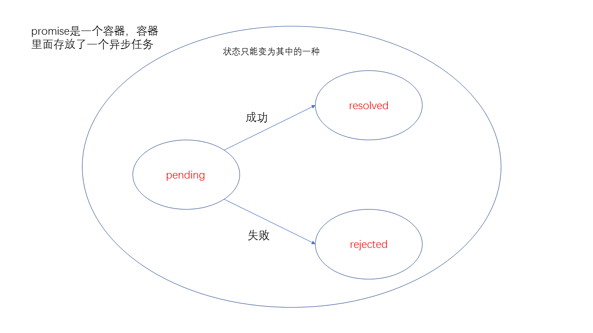

# Promise

## 1. 参考资料

1. [Promise 对象](https://es6.ruanyifeng.com/#docs/promise)

2. [当面试官问Promise的时候他想知道什么](https://juejin.cn/post/6953127598457094174)

3. [ES6基础知识】promise和await/async](https://juejin.cn/post/6868138778306412552)

4. [promise和await async进阶](https://juejin.cn/post/6844904180096712711)

5. [7张图，20分钟就能搞定的async/await原理！为什么要拖那么久？](https://juejin.cn/post/7007031572238958629)

6. [看了就会，手写Promise原理，最通俗易懂的版本！！！](https://juejin.cn/post/6994594642280857630)

7. [你真的完全掌握了promise么？](https://juejin.cn/post/6844903604009041928)

8. [Promise 必知必会（十道题）](https://juejin.cn/post/6844903509934997511)

9. [面试精选之Promise](https://juejin.cn/post/6844903625609707534)

10. [整体流程的介绍](https://juejin.cn/post/6856213486633304078)

11. [Promise实现原理（附源码）](https://juejin.cn/post/6844903665686282253)

12. [这一次，彻底弄懂 Promise 原理](https://juejin.cn/post/6844904063570542599)

13. [Promise不会？？看这里！！！史上最通俗易懂的Promise！！！](https://juejin.cn/post/6844903607968481287)

14. [从一道让我失眠的 Promise 面试题开始，深入分析 Promise 实现细节](https://juejin.cn/post/6945319439772434469)

15. [使用 Promise - MDN](https://developer.mozilla.org/zh-CN/docs/Web/JavaScript/Guide/Using_promises)

16. [Promise - MDN](https://developer.mozilla.org/zh-CN/docs/Web/JavaScript/Reference/Global_Objects/Promise)

## 2. 基本说明

1. 异步编程的一种解决方案。使用 Promise 完成异步任务，可以避免回调地狱的出现。写法更简单，语义更明确。

2. Promise 既是一个对象，又是一个构造函数。可以将其看做为一个容器，里面存放着未来才会完成的异步任务。

3. Promise 作为构造函数，接收一个执行器函数。这个执行器函数实际上就是一个异步任务。执行器函数接收两个参数：resolve 和 reject。当异步任务成功时， 调用 resolve 函数，将数据传入 resolve 函数，当异步任务失败时，调用 reject 函数，将错误信息传入 reject 函数中。

4. 一共有三种状态：pending（等待）、fulfilled（成功）、rejected（失败）。转态转换只能是：pending --> fulfilled 或者 pending --> rejected。

5. 状态一旦发生变化，就不可逆转。Promise 对象就一直保持这个状态。在任何时候都可以获取这个状态的数据。

7. 以下内容引用自 《ECMAScript 6 入门》
   > 1. 对象的状态不受外界影响。Promise 对象代表一个异步操作，有三种状态：pending（进行中）、fulfilled（已成功）和rejected（已失败）。只有异步操作的结果，可以决定当前是哪一种状态，任何其他操作都无法改变这个状态。这也是 Promise 这个名字的由来，它的英语意思就是“承诺”，表示其他手段无法改变。
   > 2. 一旦状态改变，就不会再变，任何时候都可以得到这个结果。Promise对象的状态改变，只有两种可能：从 pending 变为 fulfilled 和从 pending 变为 rejected。只要这两种情况发生，状态就凝固了，不会再变了，会一直保持这个结果，这时就称为 resolved（已定型）。如果改变已经发生了，你再对 Promise 对象添加回调函数，也会立即得到这个结果。这与事件（Event）完全不同，事件的特点是，如果你错过了它，再去监听，是得不到结果的。

8. 有了 Promise 对象，就可以将异步操作以同步操作的流程表达出来，避免了回调函数的层层嵌套。此外，Promise 对象提供了统一的接口，使得控制异步操作，更加容易。

9. Promise 也有一些缺点：
   1. 无法取消 Promise，一旦新建它就会立即执行，无法中途取消。2. 如果不设置回调函数，Promise 内部抛出的错误，不会反应到外部。
   3. 当处于 pending 状态时，无法得知目前进展到哪一个阶段（刚刚开始还是即将完成）。

10. 下面用一张图来表示Promise对象状态的改变：
   

## 2. 基本用法

1. Promise 是一个构造函数，下面的代码创建一个 Promise 示例：
   ```js
      var fs = require('fs') ;

      // 新建Promise对象
      var p1 = new Promise(function(resolve, reject) {
	     // 异步操作
         fs.readFile('./data/a.txt', 'utf-8', function(err, data) {
              if (err) {
                 // 任务失败
                 // 容器的pending状态转变为rejected
                 reject(err) ; 
              } else {
                 // 任务成功
                // 容器的pending状态转变为resolved
                resolve(data) ;
              }
          })
      })

   ```
2. Promise 构造函数接收一个函数作为参数，这个函数接收两个参数：resolve，reject。通常这个作为参数的函数内部会封装一个异步任务。

3. resolve() 函数的作用是将 Promise对象的状态由“未完成”变为“成功”（pending状态转变为resolved）。在异步操作成功时调用，并将异步操作的结果，作为参数传递出去。

4. reject()函数的作用是将Promise对象的状态由“未完成”变为“失败”（pending状态转变为reject）。在异步操作失败时调用，并将错误对象，作为参数传递出去。

5. 在 Promise 对象生成以后，我们可以通过then()方法指定resolved状态和rejected状态的回调函数。

6. 这个回调函数指的是在resolved状态和rejected状态下如何处理数据和错误。

7. 使用 then() 
   ```js
      p1.then(function(result) {
          console.log('成功') ;
          console.log(result) ;
      }, function(err) {
          console.log('失败') ;
          console.log(err) ;
      })

   ```
9. then() 接收两个函数作为参数，其中第二个参数可选。第一个函数是 Promise 对象状态变为 resolved 时调用，第二个函数是Promise对象状态变为 rejected 时调用。
10. 两个函数都接收 Promise 传出的值作为参数。

11. 使用 Promise 包装 ajax 请求的例子：
    ```js
       function  myRequest(url, options) {
          return new Promise((resolve, reject) => {
              const xhr = new XMLHttpRequest();
               xhr.onreadystatechange = function () {
                   if (xhr.readyState === 4) {
                       if (xhr.status === 200) {
                           resolve(xhr.response);
                       } else {
                           reject(xhr.response);
                       }
                   }
               }

               xhr.open('GET', url);
               xhr.send();
          })
      }

      myRequest('/getInfo').then((res) => {
          console.log('响应是：', res);
      }, (err) => {
          console.log('出错了：', err);
      })
    ```

## 2. Promise 的链式调用

1. Promise 对象的一大特色就是可以实现 then() 方法的链式调用。链式调用也是 Promise 用来解决异步任务中回调函数嵌套的问题的。

2. 实现链式调用的前提是 then() 方法可以返回一个新的 Promise 示例，因此我们可以继续调用 then() 方法。

3. 一个简单的链式调用：
   ```js
      const p1 = new Promise((resolve, reject) => {

          setTimeout(() => {
              resolve('时间到了，触发 resolve');
          }, 1000);
      });

      // 简单的链式调用

      p1
         .then((res) => {
             console.log('then1: ', res);
             return res;
         })
         .then((res) => {
            console.log('then2: ', res);
            return res;
         })
         .then((res) => {
             console.log('then3: ', res);
         });
      // 输出
      // then1:  时间到了，触发 resolve
      // then2:  时间到了，触发 resolve
      // then3:  时间到了，触发 resolve
   ```

4. 上面的例子中，第一个 then() 和第二个 then() 方法返回的是普通的值，同样会被包装成 Promise 对象，且会被传入 resolve 函数中，即当作成功的状态。

5. 返回 Promise 的链式调用：
   ```js
      const p1 = new Promise((resolve, reject) => {

          setTimeout(() => {
              resolve('1s 时间到了，触发 resolve 1');
          }, 1000);
      });

      const p2 = new Promise((resolve, reject) => {

          setTimeout(() => {
              resolve('2s 时间到了，触发 resolve 2');
          }, 2000);
      });

      const p3 = new Promise((resolve, reject) => {

          setTimeout(() => {
              resolve('3s 时间到了，触发 resolve 3');
          }, 3000);
      });

      // 简单的链式调用

      p1
          .then((res) => {
              console.log('then1: ', res);
              return p2;
          })
          .then((res) => {
             console.log('then2: ', res);
             return p3;
          })
          .then((res) => {
              console.log('then3: ', res);
          })
   
   // 输出
   // then1:  1s 时间到了，触发 resolve 1
   // then2:  2s 时间到了，触发 resolve 2
   // then3:  3s 时间到了，触发 resolve 3
   ```
6. 上例中，第一个 then() 返回的是一个 Promise 对象，这时第二个then() 方法，就会等待该 Promise 对象的状态发生变化，才会被调用。如果这个 Promise 变为成功状态，即 resolved，那么会调用第二个 then() 方法的第一个回调函数，如果变成失败状态，即 rejected，那么会调用第二个 then() 方法的第一个回调函数。同理可见第二个  then() 方法返回的 Promise 对象和第三个 then() 方法的关系。

7. 含有 rejected 状态的 Promise 的链式调用：
   ```js
      const p1 = new Promise((resolve, reject) => {

          setTimeout(() => {
              // resolve('1s 时间到了，触发 resolve 1');

              reject('1s 时间到了，触发 rejected 1');
          }, 1000);
      });

      const p2 = new Promise((resolve, reject) => {

          setTimeout(() => {
              resolve('2s 时间到了，触发 resolve 2');
          }, 2000);
      });

      const p3 = new Promise((resolve, reject) => {

          setTimeout(() => {
              // resolve('3s 时间到了，触发 resolve 3');
              reject('3s 时间到了，触发 rejected 3');
          }, 3000);
      });

      // 简单的链式调用

      p1
          .then((res) => {
              console.log('then1 success: ', res);
              return p2;
          }, (err) => {
              console.log('then1 failure: ', err);
              return p2;
          })
          .then((res) => {
             console.log('then1 success: ', res);
             return p3;
          }, (err) => {
              console.log('then2 failure: ', err);
              return p3;
          })
          .then((res) => {
              console.log('then3 success: ', res);
          }, (err) => {
              console.log('then3 failure: ', err);
          })
   ```
8. 上例中，p1 的状态最后是 rejected，所以调用的是第一个 then() 第二个回调函数。而 p2 的状态是 resolved，因此调用第二个 then() 的第二个回调函数，而 p3 的状态是 rejected，因此调用第三个 then() 的第二个回调函数。

9. 综上，解决回调函数嵌套的方法是链式调用 then()，并且在每个 then() 的处理 resolved 状态或者 rejected 状态的回调函数中返回 Promise 对象。这样后续的 then() 会根据新的 Promise 对象状态决定调用哪个回调函数。以此类推。

## 3. 常用方法

### 1. Promise.prototype.then()

### 2. Promise.prototype.catch()

### 3. Promise.prototype.finally()

### 4. Promise.all()

1. 参考资料
   - [javascript异步之Promise.all()、Promise.race()、Promise.finally()](https://segmentfault.com/a/1190000017974025?utm_source=tag-newest)
   - [MDN-Promise.all()](https://developer.mozilla.org/zh-CN/docs/Web/JavaScript/Reference/Global_Objects/Promise/all)

2. all 这个方法，以数组形式接收多个 Promise 对象，只有所有的 Promise 对象都返回成功状态，all 方法才会返回成功状态，只要有一个失败了，all 就会返回失败的状态。

3. `Promise.all(iterable)`
   - 参数  iterable
     - 一个可迭代对象，如 Array 或 String。
   - 返回值
     - 如果传入的参数是一个空的可迭代对象，则返回一个已完成（already resolved）状态的 Promise。
     - 如果传入的参数不包含任何 promise，则返回一个异步完成（asynchronously resolved） Promise。注意：Google Chrome 58 在这种情况下返回一个已完成（already resolved）状态的 Promise。
     - 其它情况下返回一个处理中（pending）的 Promise。这个返回的 promise 之后会在所有的 promise 都完成或有一个 promise 失败时异步地变为完成或失败。
4. 此方法在集合多个 promise 的返回结果时很有用。
5. 方法说明：
   - 完成（Fulfillment）：
     - 如果传入的可迭代对象为空，Promise.all 会同步地返回一个已完成（resolved）状态的promise。
     - 如果所有传入的 promise 都变为完成状态，或者传入的可迭代对象内没有 promise，Promise.all 返回的 promise 异步地变为完成。
     - 在任何情况下，Promise.all 返回的 promise 的完成状态的结果都是一个数组，它包含所有的传入迭代参数对象的值（也包括非 promise 值）。

   - 失败/拒绝（Rejection）：
     - 如果传入的 promise 中有一个失败（rejected），Promise.all 异步地将失败的那个结果给失败状态的回调函数，而不管其它 promise 是否完成。

6. 应用场景
   - 几个 ajax 全部执行完了，才能渲染页面，
   - 几个 ajax 全部执行完了，才能做一些数据的计算操作，
   - 不关心执行顺序，只关心集体的执行结果

7. 示例 - 全部成功：
   ```javascript
             const p1 = Promise.resolve(50);
             const p2 = 12345;
             const p3 = new Promise((resolve) => {
                 setTimeout(() => {
                     resolve(100);
                 }, 2000);
             });
             // 等到最后一个 Promise 成功即 p3 成功后，，all 返回一个成功的 Promise

             Promise.all([p1, p2, p3]).then(data => {
                 // [ 50, 12345, 100 ]
                 console.log(data);
             });
    ```
8. 示例 - 有一个失败：
   ```javascript
      const p1 = new Promise((resolve, reject) => {
            setTimeout(resolve, 1000, 'one');
      });
             const p2 = new Promise((resolve, reject) => {
                 setTimeout(resolve, 2000, 'two');
             });
             const p3 = new Promise((resolve, reject) => {
                 setTimeout(resolve, 3000, 'three');
             });
             const p4 = new Promise((resolve, reject) => {
                 setTimeout(resolve, 4000, 'four');
             });


             const p5 = new Promise((resolve, reject) => {
                 reject('reject');
             });

             Promise.all([p1, p2, p3, p4, p5]).then(res => {
                 console.log('成功', res);
             }, err => {
                 // 只要有一个 Promise 失败，all 就会返回一个失败的 Promise
                 // 失败 reject
                 console.log('失败', err);
             });

             Promise.all([p1, p2, p3, p4, p5]).then(res => {
                 console.log('成功', res);
             }).catch(reason => {
                 // 失败 reject
                 console.log('失败', reason);
             })
    ```

### 5. Promise.race()

1. 参考资料
   - [javascript异步之Promise.all()、Promise.race()、Promise.finally()](https://segmentfault.com/a/1190000017974025?utm_source=tag-newest)
   - [MDN-Promise.race()](https://developer.mozilla.org/zh-CN/docs/Web/JavaScript/Reference/Global_Objects/Promise/race) 

2. race 方法返回一个 Promise，一旦迭代器中的某个 Promise 成功或失败，返回的 Promise 就会成功或失败。

3. 从 race 这个方法的名称我们就可以看出，这个方法的结果取决于最快地那个 Promise 的结果。

4. `Promise.race(iterable)`
   - 参数  iterable
     - 可迭代对象，类似 Array。详见 iterable。
   - 返回值
     - 一个待定的 Promise 只要给定的迭代中的一个 Promise 解决或拒绝，就采用第一个 Promise 的值作为它的值，从而异步地解析或拒绝（一旦堆栈为空）。

5. 示例 - 成功示例
   ```JavaScript
             const p1 = new Promise((resolve, reject) => {
                setTimeout(() => {
                    resolve('p1');
                }, 2000);
             });

            const p2 = new Promise((resolve, reject) => {
                setTimeout(() => {
                    resolve('p2');
                }, 1000);
            });

            Promise.race([p1, p2]).then((res) => {
               // p2 最先完成，因此输出 p2
               console.log(res);
            });  
   ```
6. 示例 - 失败示例：
   ```javascript
             const p5 = new Promise(function(resolve, reject) {
                 setTimeout(resolve, 500, "five");
             });
             const p6 = new Promise(function(resolve, reject) {
                 setTimeout(reject, 100, "six");
             });

             Promise.race([p5, p6]).then(function(value) {
                 // 未被调用
             }, function(reason) {
                  console.log(reason); // "six"
                  // p6 更快，所以它失败了
             });
   ```

7. 如果传的迭代是空的，则返回的 promise 将永远等待。

8. 如果迭代包含一个或多个非承诺值和/或已解决/拒绝的承诺，则 Promise.race 将解析为迭代中找到的第一个值。

### 6. Promise.resolve()

### 7. Promise.reject()
   
   