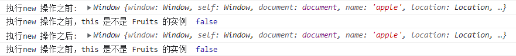
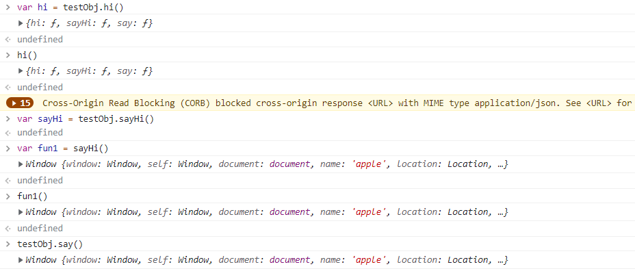

# JavaScript 中的 this 指向问题

## 1. 参考资料

1. [嗨，你真的懂this吗？](https://juejin.cn/post/6844903805587619854)

2. [this、apply、call、bind](https://juejin.cn/post/6844903496253177863)

3. [面试官问：JS的this指向](https://juejin.cn/post/6844903746984476686)

4. [图解 ：一篇彻底带你搞懂 JS 中的 this 指向问题](https://juejin.cn/post/6844903994066731022)

5. [[译] 深入浅出 JavaScript 关键词 -- this](https://juejin.cn/post/6844903602742362120)

## 2. 基本说明

1. this 指的是当前对象，如果在全局范围内使用 this，则指代当前页面 window；如果在函数中使用 this，则this指代的是根据当前函数是在什么对象上调用。
   ```js
      // true
      console.log(this===window)
      // true
      console.log(this.alert === window.alert)
      
      function foo() {
      console.log(this.fruit) ;
      }

      
   ```
2. 由于JavaScript中，this的指向不是函数定义时确定，而是要运行时根据上下文确定。
   ```js
      function foo() {
         console.log(this.fruit) ;
      }
      // 定义一个全局变量，等同于window.friut='apple'
      fruit = 'apple'

       // apple
       foo()


       obj = {
          fruit: 'banana',
          foo: foo
       }

       // foo() 中的this指向的是当前对象obj
       // banana
       obj.foo()
   ```

## 3. 四种绑定规则

### 1. 默认绑定

1. 在不能应用其它绑定规则时使用的默认规则，通常是独立函数调用。也就的单独在全局环境下调用一个函数，没有任何前缀。如下所示：
   ```js
      function hello(){
          console.log('Hello,', this.name);
      }
      var name = 'Curry';
      hello();
   ```
   在浏览器环境下，且是非严格模式（`use strict`）下，输出应该是：`Hello, Curry`。这是因为在调用 hello 函数的时候，应用了默认绑定，此时 this 指向全局对象，也就是 this 指向了 window 对象。而使用 `var` 关键字定义的变量 name 也被挂载到了 window 对象上，所以 `this.name` 等于 `window.name`，所以输出 `Hello, Curry`。

### 2. 隐式绑定

1. 函数的调用是在某个对象上触发的，即调用位置上存在上下文对象。典型的形式为 `XXX.fun()`。如下所示：
   ```js  
      function sayHello() {
          console.log('Hello, ', this.name);
      }

      var objTest = {
          name: 'kevin',
          sayHello: sayHello
      }

      objTest.sayHello()
   ```
   输出：`Hello,  kevin`。

2. sayHello 的函数声明在外部，严格来说并不属于 person，但是在调用 sayHello 时，是通过 `objTest.sayHello()` 这种形式调用的，调用位置会使用 objTest 的上下文来引用函数，隐式绑定会把函数调用中的 this（sayHello 中的 this）绑定到这个上下文对象（即此例中的 objTest）。

3. **注意**：对象属性链中只有最后一层会影响到调用位置。什么意思呢，就是说如果是嵌套对象，函数在最后一层，那么通过`XXX.YYY.func()` 这种方式调用，函数中的 this 指向的是 最后一层对象。示例如下：
   ```js
      var a = {
            name: 'jack',
            b: {
                name: 'apple',
                getName: function() {
                   console.log(this.name)
                },

            }
        }
      a.b.getName()
   ```
   结果是：`apple`。因为 getName 方法定义在 b 对象中，因此当通过 `a.b.getName()` 这种方式调用时，getName 中的 this 只会向上找一层，此时的 this 就是对象 b，this.name 就是 b.name，即为 apple。总的来说，就是不管有多少层，在判断 this 的时候，我们只关注最后一层，即此处的对象 b。

#### 1. 隐式绑定存在的问题 - this 丢失

1. 隐式绑定有一个大陷阱，绑定很容易丢失，就是说，我们以为函数中的 this 指向了某个对象，但是实际调用时，this 却指向了别处，给我们造成了极大的困扰。

2. 示例代码：
   ```js
      function sayHello(){
          console.log('Hello,', this.name);
      }
      var person = {
      name: 'Queen',
      sayHello: sayHello
      }
      var name = 'Wiliam';
      var Hi = person.sayHello;
      Hi();
   ```
   输出是：`hello, William`。为什么是这样的调用结果呢，Hi 实际上是 sayHello 这个函数的引用，当我们调用 Hi() 的时候，并没有在 person 这个上下文环境下。因此是默认绑定，sayHello 中的 this 指向的是 window 对象。

3. 一般情况下，只要是调用格式是：`XXX.fn()`，都可以看成是隐式绑定，如果 `fn()` 前如果什么都没有，那么肯定不是隐式绑定。

4. 除了上面这种赋值导致的 this 丢失，还要一种情况是回调函数中的 this 丢失。
   ```js
      function sayHello(){
          console.log('Hello,', this.name);
      }
      
      var name = 'Wiliam';
      var person1 = {
          name: 'rose',
          sayHello: function () {
              setTimeout(function () {
                  console.log('hello, ', this.name);
              }, 100)
          }
      }

      var person2 = {
      name: 'cars',
      sayHello: sayHello
      }

      person1.sayHello();

      setTimeout(person2.sayHello, 200);
      setTimeout(function () {
         person2.sayHello();
      }, 300);
   ```
   输出是：
   ```js
      Hello, Wiliam
      Hello, Wiliam
      Hello, cars
   ```
5. 现在对上面的输出进行一个说明：
   - 第一种情况，调用了 person1 中的 sayHello 后，启动了一个定时器，当定时结束，执行回调函数的时候，回调函数直接就是在全局环境下执行，没有通过任何对象调用，因此是默认绑定，因此 this 指向的是 window 对象。
   - 第二种情况，虽然是通过 person2.sayHello 这样的形式指定的 setTimeout 的回调，但是，person2.sayHello 表示的一个函数地址，并不是调用。当定时结束，触发回调函数时，只根据 person2.sayHello 指定的函数地址去找到函数，然后执行，显然这时的执行和 person2 没有任何关系（执行一个匿名函数），依旧是默认绑定，因此 this 还是指向 window 对象。
   - 第三种情况，在 setTimeout 的回调中，通过 `person2.sayHello()` 调用 sayHello 函数，显然是隐式绑定，因此 this 指向 person2 对象。

### 3. 显示绑定

1. 显式绑定比较好理解，就是通过 `call`、`apply`、`bind` 这三个函数，显式的指定调用这三个函数的函数中的 this 所指向的对象。

2. `call`、`apply`、`bind` 这三个函数的用法和区别这里不再详说。

### 4. new 关键字

1. javaScript 和 Ｃ＋＋ 不一样，并没有类，在 javaScript 中，构造函数只是使用 new 操作符时被调用的函数，这些函数和普通的函数并没有什么不同，它不属于某个类，也不可能实例化出一个类。任何一个函数都可以使用 new 来调用，因此其实并不存在构造函数，而只有对于函数的“构造调用”。

2. 使用 new 来调用函数，会自动执行下面的操作：
   - 创建一个空对象，构造函数中的 this 指向这个空对象。
   - 这个新对象被执行 [[原型]] 连接。（设置新对象的 `__proto__` 属性指向构造函数的 `prototype` 对象）
   - 执行构造函数方法，属性和方法被添加到 this 引用的对象中。
   - 如果构造函数中没有返回其它对象（包括函数），那么返回 this，即创建的这个的新对象，否则，返回构造函数中返回的对象。

3. 模拟 new 的过程：
   ```js
      function newMethod(Parent, ...rest) {
         // 1. 将构造器（Parent）的prototype属性作为原型，创建一个新的对象
         let child = Object.create(Parent.prototype) ;  
         // 2. 将this和调用参数传递给构造函数执行
         let ret = Parent.apply(child, rest);
         // 3. 如果构造函数返回了对象，那么就返回这个对象
         if (result && (typeof (result) == "object" || typeof (result) == "function")) {
              return  ret;
          }
           // 4. 如果构造函数没有返回对象，我们返回手动创建的 obj 对象
           return child; 
        }
   ```
4. 因此，使用 new 调用函数的时候，会将函数的 this 绑定到 这个新对象上。

5. 可以做一个测试，看看使用 new 与不使用 new 的情况下，函数中 this 的情况：
   - 不使用 new 操作符：
     ```js
        function Fruits(name) {

            console.log('执行new 操作之前: ', this);
            console.log('执行new 操作之前，this 是不是 Fruits 的实例 ', this instanceof Fruits);
            this.name = name;
            this.color = 'red';
            console.log('执行new 操作之后: ', this);
            console.log('执行new 操作之前，this 是不是 Fruits 的实例 ', this instanceof Fruits);
        }
     
        var apple = Fruits('apple');
        // undefined
        console.log(apple);
     ```
     执行 Fruits 函数过程中，输出是：
     ```text
        执行new 操作之前:  Window {window: Window, self: Window, document: document, name: 'apple', location: Location, …}
        执行new 操作之前，this 是不是 Fruits 的实例  false
        执行new 操作之后:  Window {window: Window, self: Window, document: document, name: 'apple', location: Location, …}
        执行new 操作之前，this 是不是 Fruits 的实例  false
     ```
     图示为：  
       
     把 Fruits 当作普通函数调用，且是单独调用，则是默认绑定，this 指向的是 window 对象。
   - 使用 new 操作符：
     ```js
        var orange = Fruits('orange');
        // {name: 'orange', color: 'red'}
        console.log(orange);
     ```
     执行 Fruits 函数过程中，输出是：
     ```text
        执行new 操作之前:  Fruits {}
        执行new 操作之前，this 是不是 Fruits 的实例  true
        执行new 操作之后:  Fruits {name: 'orange', color: 'red'}
        执行new 操作之前，this 是不是 Fruits 的实例  true
     ```
     图示为：
       
     当开始执行 Fruits 函数的时候，函数的 this 已经被绑定到新的对象上了。最后返回这个新的对象。

6. 从上面的测试中，我们可以看出，函数以构造函数的形式调用的时候，函数中的 this 被绑定到了新的对象上。显然，这个新的对象是构造函数的实例。因为新对象的隐式原型（__proto__）指向了构造函数的显示原型对象（prototype）。

### 5. 绑定的优先级

1. 绑定的优先级是： new 绑定 > 显式绑定 > 隐式绑定 > 默认绑定。

## 4. 箭头函数中的 this

### 1. 箭头函数与普通函数的区别

1. 在箭头函数内部使用的 this 继承自其外层代码块的 this。

2. 箭头函数不能当作构造函数，即不能使用 new 操作符。

3. 箭头函数没有 arguments 参数，可以使用剩余参数语法获得传入的参数。

4. 在箭头函数中不能使用 yield 操作符，因此箭头函数不能当作 Generator 函数。

5. 箭头函数没有自己的 this，不能使用 call、apply、bind 动态改变箭头函数的 this 指向。

### 2. 箭头函数的 this 指向

1. 首先要明确，箭头函数中的 this，并不一定是定义箭头函数时所在的对象，举例如下：
   ```js
      var testObj = {
          hi: function () {
              console.log(this);
              return () => {
                  console.log(this);
              }
          },
          sayHi: function () {
              return function () {
                  console.log(this);
                  return () => {
                      console.log(this);
                  }
              }
          },

          say: () => {
              console.log(this);
          }
      }
      var hi = testObj.hi();  // testObj 对象
      hi(); // testObj 对象
      var sayHi = testObj.sayHi();
      var fun1 = sayHi();   // window 对象
      fun1(); // window 对象
      testObj.say(); // window 对象
   ```
   输出结果如下图所示：
   
   - 第一条：`var hi = obj.hi()`，`obj.hi()` 显然是隐式绑定，因此函数内部的 this 指向 obj 对象。
   - 第二条：`hi()`，因为 hi 是 testObj.hi 的返回值，是一个箭头函数，因此其内部的 this 指向的是上一层级代码块的 this，即 obj.hi 函数中的 this，obj.hi 中的 this 指向的是 obj 对象，所以 hi 这个箭头函数内部的 this 也指向 obj。
   - 第三条：`var fun1 = sayHi()`，sayHi 是 testObj.sayHi 的返回值，是一个普通函数，当我们执行 sayHi 的时候，这个函数没有在任何上下文环境下，因此是默认绑定，this 指向 window 对象。
   - 第四条：`fun1()`，fun1 是 sayHi 的返回值，是一个箭头函数。按理说，这个箭头函数定义在 testObj 内部，其this 应该指向 testObj 对象，但实际上，fun1 这个箭头函数内部的 this 指向的是 window 对象，这就说明，箭头函数内部的 this 并不是指向其定义时所在的对象中，而是指向定义箭头函数所在位置的外层代码块的 this，fun1 的外层就是 sayHi，而 sayHi 的 this 指向 window 对象，所以 fun1 内部的 this 也指向 window 对象。
   - 第五条：`testObj.say()`，test.say 是箭头函数，但是当前的代码块 testObj 中是不存在 this 的，只能向上找，就找到了全局的 this，指向的是 window。

2. 箭头函数的 this 也不是一成不变的，也可以动态改变。示例如下：
   ```js
      var testObj = {
          sayHi: function () {
              return function () {
                  console.log(this);
                  return () => {
                      console.log(this);
                  }
              }
          }
      }
      var sayHi = testObj.sayHi();
      var fun1 = sayHi();   // window 对象
      fun1(); // window 对象
      
      var fun2 = sayHi.bind(testObj)(); // testObj 对象
      fun2() // testObj 对象
   ```
   fun1 和 fun2 对应的是同样的箭头函数，但是 this 指向却不一样，原因就是箭头函数所在代码块的 this 指向不同了。`sayHi.bind(testObj)` 属于显示绑定，将 sayHi 的 this 指向了 testObj，所以，fun2 中的 this 的指向也是 testObj。bind 函数没有直接改变箭头函数的 this 指向，但是改变了箭头函数所在的函数的 this 指向，间接改变了箭头函数的 this 指向。

3. 来自 [Javascript ES6 — Arrow Functions and Lexical `this`](https://hackernoon.com/javascript-es6-arrow-functions-and-lexical-this-f2a3e2a5e8c4) 这篇文章对于箭头函数中 this 的指向的总结非常好：
    > 箭头函数按词法作用域来绑定它的上下文，所以 this 实际上会引用到原来的上下文。

## 5. this 的使用场合

### 1. 全局环境

1. 全局环境使用 this，this 指向的是顶层对象 window。

### 2. 构造函数（类）

1. 构造函数中 this，指向实例对象。

### 3. 对象的方法

1. 如果对象的方法中包含 this，this 的指向就是方法运行时所在的对象，该方法赋值给另一个对象，就会改变 this 的指向。

2. 这个使用场景比较复杂，我们分几个情况来说。

#### 1. 基本情况

1. 在对象中定义函数，并通过对象来调用函数：
   ```js
      var obj = {
         foo: function() {
            console.log(this)
         }
      };

         // object
         obj.foo()
   ```
2. 改变 foo 函数的作用域：
   ```js
      // window
      (obj.foo = obj.foo)();
      // window
      (false || obj.foo)();
      // window
      (1, obj.foo)();
   ```
   此时，obj.foo 只是一个值，这个值是一个地址，指向了函数。这个值在运行的时候，运行环境已经不是 obj了，而全局环境，所以this 指向了 window。**可以这样理解**，JavaScript 引擎内部，obj 和 obj.foo 储存在两个内存地址，称为地址一和地址二。obj.foo() 这样调用时，是从地址一调用地址二，因此地址二的运行环境是地址一，this 指向 obj。但是，上面三种情况，都是直接取出地址二进行调用，这样的话，运行环境就是全局环境，因此this指向全局环境。

3. 所以，上面的情况等同于：
   ```js
      // 情况一
      (obj.foo = function() {
          console.log(this)
      })() ;
      // 等同于
      (function() {
          console.log(this)
      })() ;
      // 定义一个匿名函数并立即执行
      // 情况二
      (false || function() {
          console.log(this)
      })() ;
      // 情况三
      (1, function() {
          console.log(this)
      })() ;
   ```
#### 2. 函数嵌套

1. 嵌套函数中this只是指向上一层对象，不会继承更上面的一层。
   ```js
      var a = {
         name: 'a smith',
         b: {
      getName: function() {
      console.log(this.name)
      }
      }
      }
      // undefined
      a.b.getName()
   ```
   getName() 在 a 对象的第二层，该方法内部的 this 指向的是 a.b，不是 a，所以会输出 undefined。

2. 要想的到预期输出，可以这样写：
   ```js
      var a = {
          b: {
              getName: function() {
                  console.log(this.name)
              },
              name: 'a smith'
          }
      }
      // a smith
      a.b.getName()
   ```
3. 如果把嵌套对象的方法赋值给其他变量，this 指向仍然是全局对象 window。
   ```js
      var name = 'window smith'
       var a = {
       b: {
       getName: function() {
       console.log(this.name)
       },
       name: 'a smith',
       }
       }

      var m = a.b.getName
      // window smith
      m()
   ```
   将多层对象内部的 getName() 方法赋值给 m，在执行 m() 方法时，this 指向了全局对象 window。所以输出为 window smith。

4. 可以只将 getName() 所在的对象赋值给m，这样调用时，this 的指向就不会变。
   ```js
      var m = a.b;
      // a smith
      m.getName()
   ```

## 6. 使用 this 时需要注意的问题

1. 避免多层this
   ```js
      var name = 'window smith'
      var a = {
          name: 'a smith',
          getName: function() {
              console.log(this.name)

              return function() {
                console.log(this.name)
              }
          }
      }

      // a smith
      // window smith
      a.getName()()
   ```
2. 回调函数中避免使用this。回调函数中的this的往往会改变指向，尽量避免使用。
   ```html
      <button class="btn">点击</button>
      <script>
      var obj = new Object() ;
      obj.name = 'obj jack'
      obj.f = function() {
      console.log(this)
      console.log(this === obj) ;

      }

      var button = document.querySelector('.btn') ;
      // <button class="btn">
      // false
      button.addEventListener('click', obj.f) ;
      </script>
   ```
   当我们把o.f() 作为button的 click 事件处理函数时，o.f() 内部的 this 指向了 button 元素对象。因为 f 方法是在按钮对象的环境中被调用的。

3. 避免数组处理方法中的 this。数组的 map() 和forEach()，允许传入一个函数作为参数，这个作为参数的函数不应该使用this。
   ```js
      var o = {
         v: 'hello',
         p: ['a1', 'a2', 'a3'],
         f: function() {
             this.p.forEach(function(item) {
                console.log(this.v + ' ' + item)
             })
         }
      }

      // undefined a1
      // undefined a2
      // undefined a3
      o.f()
   ```
   forEach()方法的回调函数内部的 this 的指向是全局window对象，因此获取不到 v 的值。原因是this只能指向上一层，继承不到更高一层。

## 7. 解决方法

### 1. 多层嵌套

1. **使用 that 将 this 固定**。
   ```js
       var a = {
           name: 'a smith',
           getName: function() {
               that = this ;
               console.log(this.name);
               return function() {
                   console.log(that.name)
               }
           }
      }
      a.getName()()
   ```
   定义一个变量 that，固定指向外层的 this，然后函数内层使用 that，this 的指向就不会发生变化。事实上，使用一个变量固定 this 的值，然后内层函数调用这个变量，是非常常见的做法，请务必掌握。

2. **ES6 的严格模式**。严格模式下，this 一旦指向顶层对象，就会报错
   ```js
      var counter = {
         count: 0
      }

      counter.inc = function() {
          'use strict'
          this.counter++ ;
      }

      var f = counter.inc ;
      // TypeError: this is undefined
      f()
   ```
   inc()方法内部定义了严格模式，如果内部的this指向了顶层对象，就会报错。

3. **箭头函数**。箭头函数内的this对象就是定义时所在的对象，而不是运行时所在的对象。
   ```js
      var a = {
          name: 'a smith',
          getName: function() {
             console.log(this.name)
             return () => {
               console.log(this.name)
             }
          }
      }
      // a smith
      // a smith
      a.getName()()
   ```

### 2. 回调函数

1. 使用 bind() 将 this 固定。
   ```js
      var obj = new Object() ;
      obj.name = 'obj jack';
      obj.f = function() {
          console.log(this) ;
          console.log(this === obj) ;
      }
      var button = document.querySelector('.btn') ;
      // Object
      // true
      button.addEventListener('click', obj.f.bind(obj)) ;
   ```
   将obj.f()内部的this绑定到obj对象上，得到一个新的函数。

2. 箭头函数。定义回调函数时，可以使用箭头函数，此时 this 的指向就是定义函数所在的对象。
   ```js
      var a = {
      name: 'a smith',
      c: function() {
      return setTimeout(() => {
      console.log(this.name)
      }, 1000)
      }
      } ;
      // 1s后，输出a smith
      a.c() ;
   ```
   使用箭头函数定义回调函数，则内部的this指向了当前的对象。

### 3. 数组处理方法

1. 使用 that 固定 this。
   ```js
      var o = {
      v: 'hello',
      p: ['a1', 'a2', 'a3'],
      f: function() {
      that = this ;
      this.p.forEach(function(item) {
      console.log(that.v + ' ' + item)
      })
      }
      }
      // hello a1
      // hello a2
      // hello a3
      o.f()
   ```
2. 将this作为forEach()方法的第二个参数，固定它的运行环境。
   ```js
      var o = {
      v: 'hello',
      p: ['a1', 'a2', 'a3'],
      f: function() {
      this.p.forEach(function(item) {
      console.log(this.v + ' ' + item)
      }, this)
      }
      }
      // hello a1
      // hello a2
      // hello a3
      o.f()
   ```
   数组的map()方也可以这样做，第二个参数接收一个对象，将this的指向固定下来。
