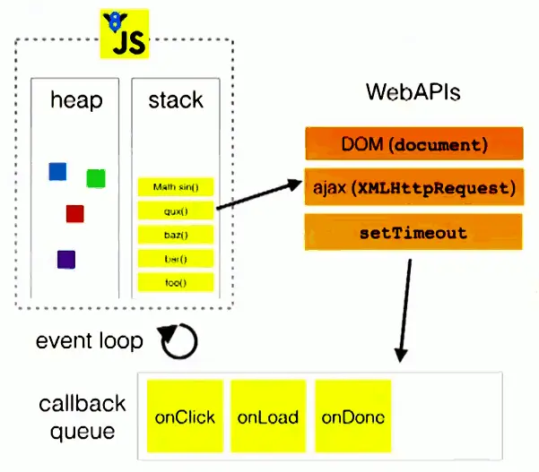

# JavaScript 中的 event loop

## 1. 参考资料

1. [这一次，彻底弄懂 JavaScript 执行机制](https://juejin.im/post/59e85eebf265da430d571f89#heading-2)

2. [浏览器与Node的事件循环(Event Loop)有何区别?](https://zhuanlan.zhihu.com/p/54882306)

3. [又被node的eventloop坑了，这次是node的锅](https://zhuanlan.zhihu.com/p/54951550)

4. [js事件循环机制(浏览器端Event Loop) 以及async/await的理解 - 博客园](https://www.cnblogs.com/smile-fanyin/p/14622432.html)

5. [js事件循环机制(浏览器端Event Loop) 以及async/await的理解 - 思否](https://segmentfault.com/a/1190000017554062)

6. [Async、Await 从源码层面解析其工作原理](https://zhuanlan.zhihu.com/p/143826516)

7. [async/await 在chrome 环境和 node 环境的 执行结果不一致，求解？](https://www.zhihu.com/question/268007969)

8. [微任务、宏任务与Event-Loop](https://juejin.cn/post/6844903657264136200)

9. [JavaScript中的Event Loop（事件循环）机制](https://segmentfault.com/a/1190000022805523)

## 2. 事件循环的概念

### 1. 基本示例

1. 使用 setTimeout 模拟异步任务：
   ```js
      console.log('script start');

      setTimeout(function() {
          console.log('setTimeout');
      }, 0);
      
      Promise.resolve().then(function() {
          console.log('promise1');
      }).then(function() {
          console.log('promise2');
      });

      console.log('script end');
   ```
2. 上面的代码的输出顺序是：
   ```text
      script start
      script end
      promise1
      promise2
      setTimeout
   ```
   为什么是这样的输出顺序而不是按照代码的顺序输出呢，这就和 js 的单线程、异步、事件循环有关了。

### 1. 异步

1. JavaScript 是单线程的，也就是说，在同一时间只能执行一个任务，其他任务必须在后面排队等待。采用单线程的好处是实现起来简单，避免 DOM 渲染时的冲突，但缺点就是只要有一个任务耗时很长，后面的任务都必须排队等着，会拖延整个程序的运行。比如等待 AJAX 请求返回结果，如果对方的服务器迟迟没有响应，或者网络不通畅，就会导致脚本的长时间停滞。

2. 为了解决这个问题，JavaScript 语言将任务的执行模式分为两种：同步和异步。

3. 同步任务是在主线程上排队执行的任务，只有前一个任务执行完毕，才会执行后一个任务。异步任务是在任务队列中的任务，只有引擎认为某个异步任务可以执行了，该任务采用回调函数的形式，进入到主线程去执行。JavaScript 通过事件轮询，也就是 event loop 来确定任务队列中的异步任务能不能进入主线程执行。

### 2. 事件循环（event loop）

1. JavaScript中，任务分为两种，同步任务和异步任务，在执行过程中进入不同的场所，同步任务进入主线程执行，而异步任务则进入Event Table并注册回调函数。

2. 当指定的事件触发时，Event Table 将这个函数推入 Event Queue。

3. 主线程的任务执行完毕，会进入 Event Queue 取出对应的函数，放到主线程去执行。

4. 上述过程不断执行，就是常说的事件轮询（Event Loop）。

5. 维基百科的定义是：“事件循环是一个程序结构，用于等待和发送消息和事件（
   > a programming construct that waits for and dispatches events or messages in a program.

6. 用一段代码来解释上面的事件循环：
   ```js
      console.log('代码执行开始');
      $.ajax({
          url:www.javascript.com,
          data:data,
          success:() => {
              console.log('发送成功!');
          }
      });
      console.log('代码执行结束');
   ```
7. 上面代码的执行过程是：
   - 代码开始执行，执行 `console.log('代码执行开始')`
   - ajax 函数进入 event table，并注册回调函数 success。
   - 执行  `console.log('代码执行结束')`
   - 收到响应，success 回调函数进入 event queue。
   - 主线程从 event queue 中取出 success 函数并执行。
   
8. 事件循环示意图 - 1：   
   
   
9. 事件循环示意图 - 2：
   

### 3. 异步操作的模式

1. 回调函数
    - 回调函数的优点是简单、容易理解和实现。缺点是容易出现回调地狱现象。使得程序结构混乱，复杂，难以维护。

2. 事件监听
    - 异步任务的执行不取决于代码的执行，而取决于某个事件是否发生。

3. 发布/订阅 - publish / subscribe

4. Promise

5. async / await

## 3. 宏任务和微任务

1. 异步任务可以分为宏任务和微任务，为什么要这样划分呢，原因是： 页面渲染事件，各种 IO 的完成事件等随时被添加到任务队列中，一直会保持先进先出的原则执行，我们不能准确地控制这些事件被添加到任务队列中的位置。但是这个时候突然有高优先级的任务需要尽快执行，那么一种类型的任务就不合适了，所以引入了微任务队列。

2. 也就是说，异步任务也是有优先级的，js 引擎要优先处理优先级高的异步任务。

3. 下表是常见的宏任务：

   类型|浏览器|Node
      :---:|:---:|:---:
   I/O|是|否
   setTimeout|是|是
   setInterval|是|是
   setImmediate|否|是
   requestAnimationFrame|是|否
   - **注**：整体代码 script 也被认为是宏任务。

4. 下表是常见的微任务：

   类型|浏览器|Node
   :---:|:---:|:---:
   process.nextTick|否|是
   MutationObserver|是|否
   Promise.then/catch/finally|是|是

5. 将异步任务区分为宏任务和微任务后，事件循环如下图所示：
     
   图片来自于：[这一次，彻底弄懂 JavaScript 执行机制](https://juejin.im/post/59e85eebf265da430d571f89#heading-2)

6. 从上图中可以看出，整体代码作为宏任务第一次执行，执行完成后，此时会去微任务队列取出微任务放到主线程执行，如果微任务队列为空，那么就去宏任务队列取出宏任务放到主线程执行。宏任务执行完成后，继续执行微任务。上述过程不断循环，就是事件循环机制。***注意**：每一轮事件循环中，一定是将微任务队列中所有的微任务执行完成后，再去执行下一个宏任务。宏任务进入宏任务队列，微任务进入微任务队列。

7. 举个例子：
   ```js
      console.log('script start');

      setTimeout(() => {
          console.log('timeout');
      }, 0);

      new Promise((resolve, reject) => {
          console.log('promised');
      resolve()
      }).then(() => {
          console.log('then');
      });
   ```
   输出是：
   ```text
      script start
      promised
      then
      timeout
   ```
   - 整体代码开始执行，输出 script start
   - 遇到 setTimeout，这是一个宏任务，放到宏任务队列。
   - 遇到 Promise，注意，Promise 的构造函数是同步执行的，因此执行传入的 executor 函数，所以输出 promised。
   - 因为传入 Promise 构造函数的 executor 函数中直接调用了 resolve 函数， Promise 变成 resolved 状态，会调用 then 函数，then 函数是微任务，因此将其推入微任务队列。
   - 整体代码执行完成。此时会去微任务队列取出微任务放到主线程执行，执行 then 的回调函数，因此输出 then。
   - 微任务执行完成，此时微任务队列空了，所以本次事件循环结束。开始执行下个宏任务。从宏任务队列中取出宏任务放到主线程执行，即执行 setTimeout 的回调函数，因此输出 timeout。

8. 几个需要注意的点：
   - 任务队列中的都是异步任务的回调函数，即异步任务完成，将其回调函数推入任务队列中。
   - 微任务优先级高于宏任务。一定是微任务队列空了以后，才去执行下个宏任务。
   - 对于 Promise 而言，一定是变成 resolved 状态，才能调用 then 方法，将 then 的第一个回调函数推入微任务队列。

## 4. async / await

1. async / await 是语法糖，本质上是 Promise + Generator。

2. await 后面可以跟一个普通的表达式、Promise 或者另外一个 async 函数。

3. 执行一个 async 函数时，在遇到 await 语句前，其内部的代码以同步的方式执行。遇到 await 语句时，函数在此被阻塞，同时，await 右边的表达式立即执行，然后，跳出当前这个 async 函数，执行函数外面的同步代码。

4. async / await 本质上还是基于 Promise 的一些封装，而Promise 是属于微任务的一种。所以在使用 await 关键字与Promise.then 效果类似。

5. 假设我们 async 函数如下：
   ```js
      async function f() {
         await p;
         console.log('ok');
      }
   ```
6. 我们可以简化理解为：
   ```js
      function f() {
          Promise.resolve(p).then(res => {
              console.log('b')
          })
      }
   ```
   **注意**：这是新版浏览器（根据 2018 年 9 月的最新 V8 引擎）的优化结果，老版本的浏览器优化结果于此不同。

7. 那么由于是调用了 Promise.resolve 函数，如果 p 是一个值，那么此 Promise 会立即变成 resolved 状态。如果 p 是一个 Promise，那么就直接返回这个 p。

## 6. 事件循环 - 同步任务、宏任务、微任务、async/await 执行顺序

### 1. 嵌套的宏任务和微任务 - setTimeout 和 Promise 和 Process.nextTick

##### 1. 宏任务中嵌套微任务 - node 环境下执行

1. 示例代码：   
   ```js
      console.log('1');

      setTimeout(function() {
          console.log('2');
          process.nextTick(function() {
             console.log('3');
          })
          new Promise(function(resolve) {
             console.log('4');
             resolve();
          }).then(function() {
             console.log('5')
          })
      }, 0);
   
      process.nextTick(function() {
          console.log('6');
      })
      new Promise(function(resolve) {
          console.log('7');
          resolve();
      }).then(function() {
          console.log('8')
      })

      setTimeout(function() {
           console.log('9');
           process.nextTick(function() {
               console.log('10');
           })
           new Promise(function(resolve) {
               console.log('11');
               resolve();
           }).then(function() {
               console.log('12')
           })
      })
   ```
2. 输出结果：
   ```text
      1
      7
      6
      8
      2
      4
      3
      5
      9
      11
      10
      12
   ```
3. 开始执行代码，所以输出 `1`。

4. 代码继续执行，遇到 setTimeout，因为定时时间为 0，表示主线程有空闲就立即执行 setTimeout 中的回调，而 setTimeout 是宏任务，所以将其回调函数放入宏任务队列。

5. 代码继续执行，遇到 process.nextTick，这是一个微任务，将其推入微任务队列。现在宏任务队列和微任务队列中的任务如下所示：
   
   宏任务|微任务
   :---:|:---:
   setTimeout1|nextTick1

6. 代码继续执行，遇到了 Promise，由于 Promise 的构造函数是同步执行，executor 函数会被同步执行，所以输出 `7`，且调用了 resolve 函数，因此 Promise 变为 resolved 状态，将 then 推入微任务队列。

   宏任务|微任务
   :---:|:---:
   setTimeout1|nextTick1
           暂无|then1

7. 代码继续执行，又遇到一个 setTimeout，与第一个情况一样，因此将这个 setTimeout 的回调推入宏任务队列。
   宏任务|微任务
   :---:|:---:
   setTimeout1|nextTick1
   setTimeout2|then1

8. 整体代码作为宏任务执行完成，从微任务队列中取出微任务开始执行，即执行 nextTick1 的回调，因此输出 `6`。

9. 微任务队列没有空，因此继续微任务队列中取出微任务开始执行，即执行 then1 的第一个回调，因此输出 `8`。

10. 微任务队列为空，第一轮事件循环结束，开始执行下一个宏任务。从宏任务队列中取出 setTimeout1 的回调开始执行，执行过程如下：
    - 输出 `2`。
    - 遇到 process.nextTick，这是一个微任务，将其回调推入微任务队列。
    
       宏任务|微任务
       :---:|:---:
       setTimeout2|nextTick2
    - 遇到 Promise，同步执行 executor 函数，输出 `4`，并将 then 推入微任务队列。

      宏任务|微任务
      :---:|:---:
      setTimeout2|nextTick2
      暂无|then2
    - setTimeout1 的回调执行完成。

11. setTimeout 这个宏任务执行完成。从微任务队列中取出 nextTick2 执行，因此输出 `3`。

12. 微任务队列未空，继续从微任务队列中取出微任务执行，即执行 then2 的第一个回调，因此输出 `5`。

13. 微任务队列为空。执行下个宏任务，因此执行 setTimeout2 的回调。执行过程如下：
    - 输出 `9`。
    - 遇到 process.nextTick，这是一个微任务，推入微任务队列。
    - 
      宏任务|微任务
      :---:|:---:
      暂无|nextTick3
    - 遇到 Promise，执行 executor 函数，输出 `11`，将 then 的回调推入微任务队列。
      宏任务|微任务
      :---:|:---:
      暂无|nextTick3
      暂无|then3
    - setTimeout2 回调执行完成。

14. setTimeout2 这个宏任务执行完成。从微任务队列中取出 nextTick3 执行，因此输出 `10`。

15. 微任务队列未空，继续从微任务队列中取出微任务执行，即执行 then3 的第一个回调，因此输出 `12`。

16. 微任务队列为空。本轮事件循环结束。

17. 最终的输出就是：`1 7 6 8 2 4 3 5 9 11 10 12`
##### 2. 宏任务中嵌套微任务 - 浏览器环境下执行

1. 浏览器下没有 process.nextTick，因此需要去掉 process.nextTick，示例代码如下：
   ```js
      console.log('script start');

      setTimeout(() => {
          console.log('timeout-1');
          new Promise((resolve, reject) => {
              console.log('promise-1');
              resolve();
          }).then(() => {
              console.log('then-1');
          }).then(() => {
              console.log('then-2');
          })
      }, 0)

      new Promise((resolve, reject) => {
          console.log('promise-2');
          resolve();
      }).then(() => {
          console.log('then-3');
      }).then(() => {
          console.log('then-4');
      })

      console.log('script end');
   ```
2. 输出结果：
   ```text
      script start
      promise-2
      script end
      then-3
      then-4
      timeout-1
      promise-1
      then-1
      then-2
   ```
3. 开始执行代码，所以输出 `script start`。

4. 代码继续执行，遇到 setTimeout，因为定时时间为 0，表示主线程有空闲就立即执行 setTimeout 中的回调，而 setTimeout 是宏任务，所以将其回调函数放入宏任务队列。

5. 代码继续执行，遇到 Promise，同步执行 executor 函数，输出 `promise-2`，同时 promise 变成 resolved 状态。将 then 的第一个回调推入微任务队列。现在宏任务队列和微任务队列中的任务如下所示：

   宏任务|微任务
   :---:|:---:
   setTimeout1|then1

6. 代码继续执行，输出 `script end`。

7. 整体代码作为宏任务执行完成，去微任务队列中取出微任务，所以主线程执行 then1 的回调函数，输出 `then-3`。这个回调执行完成以后，回调函数没有返回值，那么 then1 会返回一个 resolved 状态的 promise，因为 then1 后面还有一个 then 函数，因此将这个 then 的回调推入微任务队列。

   宏任务|微任务
   :---:|:---:
   setTimeout1|then2

8. 微任务队列没有空，那么继续从微任务队列中取出微任务，即执行 then2 的回调，输出 `then-4`。此时微任务队列已经空了，本轮事件循环结束。

9. 代码继续执行，去宏任务队列中取出宏任务放到主线程执行，即执行 setTimeout1 的回调。执行过程如下：
   - 输出 `timeout-1`。
   - 遇到 Promise，输出 `promise-1`，接着 promise 变成 resolved 状态，将 then 的回调推入微任务队列。
     宏任务|微任务
     :---:|:---:
     暂无|then3
   - setTimeout 回调执行结束。

10. 去微任务队列中取出微任务，所以主线程执行 then3 的回调函数，输出 `then-1`。同理，将 then3 后面的回调推入微任务队列：

    宏任务|微任务
    :---:|:---:
    暂无|then4

11. 微任务队列没有空，那么继续从微任务队列中取出微任务，即执行 then4 的回调，输出 `then-2`。

12. 微任务队列已经空了，本轮事件循环结束。

##### 3. 微任务中嵌套宏任务

1. 示例代码：
   ```js
      console.log('script start');

      setTimeout(() => {
          console.log('timeout-1');
      })

      new Promise((resolve, reject) => {
          setTimeout(() => {
             console.log('timeout-2');
             resolve();
          }, 0)
      }).then(() => {
          console.log('then-1');
      setTimeout(() => {
          console.log('timeout-3');
      })
      })

      console.log('script end');
   ```
2. 输出：
   ```text
      script start
      script end
      timeout-1
      timeout-2
      then-1
      timeout-3
   ```
3. 开始执行，输出：script start。

4. 将 setTimeout 回调推入宏任务队列。

5. 执行 Promise 中的 executor 函数，将 setTimeout 的回调推入宏任务队列：

   宏任务|微任务
   :---:|:---:
   setTimeout1|暂无
   setTimeout2|暂无

6. 输出：script end。

7. 整体代码作为宏任务执行完成。因为微任务队列为空，所以本轮事件循环结束。

8. 从宏任务队列中取出 setTimeout1 的回调并执行，输出 timeout-1。

9. 微任务队列为空，本轮事件循环结束。

10. 从宏任务队列中取出 setTimeout2 的回调并执行，输出 timeout-2，同时 调用了 resolve 函数，Promise 变成 resolve 状态，将 then 推入微任务队列。

    宏任务|微任务
    :---:|:---:
    暂无|then1

11. 微任务队列不为空，取出微任务放到主线程执行，因此执行 then1 的回调，输出 then-1。将 setTimeout 的回调推入宏任务队列：

    宏任务|微任务
    :---:|:---:
    setTimeout3|暂无

12. 微任务队列为空，本轮事件循环结束。

13. 从宏任务队列中取出 setTimeout3 的回调并执行，输出 timeout-3。

14. 微任务队列为空，本轮事件循环结束。

#### 4. Promise 与 async / await

##### 1. await 后面接 async 函数（Promise）

1. 虽然 Promise 与 async / await 都是微任务，但是放到一起，执行顺序还是有区别的，下面用代码说明。

2. 示例代码 - 1：
   ```js
      async function async1() {
          console.log('async1 start')
          await async2()
          console.log('async1 end')
      }

      async function async2() {
          console.log('async2')
      }

      console.log('script start')
      setTimeout(function() {
          console.log('setTimeout')
      }, 0)

      async1();

      new Promise( function( resolve ) {
          console.log('promise1')
          resolve();
      }).then( function() {
         console.log('promise2')
      })
   ```
3. 输出如下：
   ```text
      script start
      async1 start
      async2
      promise1
      async1 end
      promise2

      setTimeout
   ```

4. 代码开始执行，输出 `script start`。

5. 遇到 setTimeout，将其回调推入宏任务队列。

6. 遇到 async1 函数，则开始执行其内部的代码，前面说过，async 函数内部的代码在遇到 await 之前也是按照同步的方式执行的，所以首先输出 `async1 start`。

7. 遇到 await 表达式，执行过程被阻塞，因为 await 表达式及其后面的语句等同于：
   ```
      Promise.resolve(async2()).then(() => {
          console.log('async1 end')
      })
   ```
8. 所以 await 后面的 async2 函数立即执行。同理，async2 内部的代码在遇到 await 之前还是同步执行，所以输出 `async2`。

9. async2 函数执行完成，没有返回值。因为 async 函数会返回一个 Promise，所以 async2 返回一个 resolved 状态的 Promise。

10. 由于 async2 函数 返回一个 resolved 状态的 Promise，根据 Promise.resolve 函数的规则：如果其参数是 Promise，那么 Promise.resolve 就返回这个参数。所以下面的代码：
    ```js
      Promise.resolve(async2()).then(() => {
           console.log('async1 end')
      })
    ```
    等同于：
    ```js
       async2().then(() => {
           console.log('async1 end')
      })
    ```
    而 async2 函数返回的 Promise 是 resolve 状态，所以，then 的回调会被推入微任务队列。

    宏任务|微任务
    :---:|:---:
    setTimeout1|then1

11. 调用 async 函数会立即返回一个 Promise，async 函数内部的异步操作被封装在 Promise 中。因此，即使调用了 async 函数，也不会阻塞 async 函数外面的代码。当执行到 async1 函数中 await 表达式的时候，await 表达式后面的内容被阻塞。而 async2 函数也是立即执行，执行完 async 函数后，就立即跳出 async1 函数。（这个就是 generator 函数的机制，await 相当于 yield，函数执行到 yield 处就停止，跳出 generator 函数外，同时会立即执行 yield 右边的表达式。此时就可以执行 generator 函数外的代码，如果想恢复 generator 函数的执行，只能手动调用 next 函数。而 async 函数能自动恢复执行的原因是内置了自动执行器）

12. 代码继续执行，遇到 Promise，同步执行 executor 函数，所以输出 `promise1`，然后 Promise 变成 resolved 状态，将 then 的回调推入微任务队列：

    宏任务|微任务
    :---:|:---:
    setTimeout1|then1
    暂无|then2

13. 整体代码作为宏任务执行结束，从微任务队列中取出 then1 的回调执行，因此输出 `async1 end`。

14. 微任务队列未空，继续从微任务队列中取出 then2 的回调执行，因此输出 `promise2`。

15. 微任务队列为空，本轮事件循环结束。

16. 任务循环继续，去宏任务队列中取出 setTimeout1 并执行，所以输出 `setTimeout`。

17. 总结：
    - async 函数在执行到 await 语句时，阻塞 await 语句下面的代码，并不会阻塞 async 函数外的代码。
    - await 语句等同于：Promise.resolve().then()

##### 2. await 后面接普通表达式

1. 代码示例：
   ```js
      async function async1() {
          console.log('async1 start');
          await console.log('await1');
          console.log('async1 end');
      }

      console.log('script start')
      setTimeout(function() {
           console.log('setTimeout');
      }, 0)

      async1();

      new Promise( function( resolve ) {
          console.log('promise1');
          resolve();
      }).then( function() {
          console.log('promise2');
      })
   ```
2. 输出：
   ```text
       script start
       async1 start
       await1
       promise1
       async1 end
       promise2
       setTimeout
   ```

3. 分析过程这里不再详说，着重说明的是，async1 函数中 await 后面跟的是普通的表达式，那么等同于：
   ```js
      function async1() {
          Promise.resolove(console.log('await1')).then(() => {
              console.log('async1 end')
          
          })
      }
   ```
4. 从上面的分析中，可以看出，async1 函数中的 then 会比外面的 then 更早的添加到微任务队列中。

##### 3. 多个 await 表达式

1. 代码示例：
      ```js
      async function async1() {
         console.log('async1 start')
         await async2();
         await console.log('await1');
         console.log('async1 end');
     }

      async function async2() {
          console.log('async2');
      }

      console.log('script start');
      setTimeout(function() {
          console.log('setTimeout');
      }, 0);

      async1();

      new Promise(function(resolve) {
          console.log('promise1');
          resolve();
      }).then(function() {
          console.log('promise2');
      })
   ```
   
2. 输出：
   ```text
      script start
      async1 start
      async2
      promise1
      await1
      promise2
      async1 end
      setTimeout
   ```
   
3. 详细的过程这里不再详说，着重说明的是，async1 函数中 多个 await 表达式，等同于：
   ```js
      function async1() {
          Promise.resolve(async2())
             .then(() => {
                 Promise.resolve(console.log('await1'))
                     .then(() => {
                         console.log('async1 end');
                      })
             })
      }
   ```
   因为 async2 函数依旧 async 函数，返回值是 Promise，因此还可以简化：
   ```js
      async2().then(() => {
           Promise.resolve(console.log('await1'))
                 .then(() => {
                      console.log('async1 end');
                  })
      })
   ```
4. 所以，这几个微任务的输出顺序是：
   1. async2 函数输出：`async2`
   2. 第二个 await 后面的 console.log 语句输出：`await1`
   3. async1 函数外面的 Promise 的 then 的回调输出：`promise2`
   4. async1 函数中最后一个 console.log 语句输出：`async1 end`