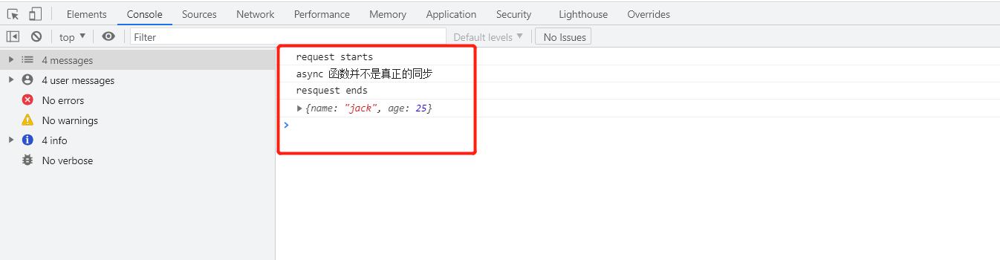
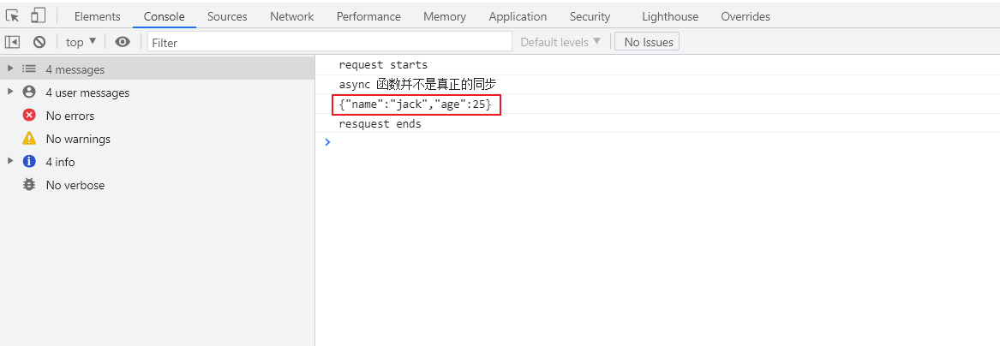

# Promise 包装异步操作

1. 使用 `Promise` 包装异步操作后，这样可以使用 `async/await` 关键字，实现同步操作。

2. `Promise` 是一个构造函数，也是一个对象。当其作为一个构造函数时，接收一个执行器作为参数，这个执行器也是一个函数，执行器内部是一个异步操作。执行器接收两个参数：resolve 和 reject。resolve 和 reject 也是函数，分别对应异步状态是成功和失败时的操作。

3. 在浏览器端，常见的异步操作是 ajax 请求，那么我们使用 Promise 包装 ajax 请求，使之能实现同步操作。

4. 为了简便起见，我们直接使用 jQuery 的 ajax 函数。

5. 我们在浏览器端进行测试，因此使用 cdn 的方式引入 jQuery。如下所示：`<script src="https://cdn.jsdelivr.net/npm/jquery@3.6.0/dist/jquery.min.js"></script>`

6. 使用 cdn 的方式引入 jQuery 后，我们就引入了 jQuery 的全局变量 `$`，因此我们可以通过全局变量 `$` 使用 ajax() 函数。

7. 在另外一个 script 标签内，我们封装一个返回 Promise 的 ajax 函数：
   ```js
      function  myRequest(url, options) {
          return new Promise((resolve, reject) => {
              $.ajax({
                  type: 'GET',
                  url: url,
                  success: function (data) {
                      resolve(data);
                  },
                  error: function (jqxhr, textStatus, error) {
                      reject(error);
                  }
              })
          })
      }

      async function getMail(url) {
          console.log('request starts');
          const res = await myRequest(url);
          console.log('resquest ends');
          console.log(res);
      }

      getMail('http://localhost:8001/mail');
      console.log('async 函数并不是真正的同步');
   ```

8. 使用 koa 启动一个后端服务，用来处理前端的 ajax 请求：
   ```js
      import Koa from 'koa';
      import Router from '@koa/router';

      const app = new Koa();
      const router = new Router();

      router.get('/mail', async (ctx, next) => {
          const time = Date.now();
          // ctx.res.writeHead(200, {'access-control-allow-origin': '*'});
          ctx.response.set({
              'access-control-allow-origin': '*',
          });
          ctx.body = {
              name: 'jack',
              age: 25
          };

      });
   ```
   因为在浏览器加载 index.html 的服务器地址和后端服务的地址不同，会存在跨域问题，因此我们设置响应头中的 `access-control-allow-origin` 字段值为 `*`，表示允许跨域请求。这样前端就能正常收到响应了。

9. 完整的 index.html 内容：
   ```html
      <!DOCTYPE html>
          <html lang="en">
          <head>
              <meta charset="UTF-8">
              <title>Promise 包装异步操作</title>
          </head>
          <body>
          </body>
          <script src="https://cdn.jsdelivr.net/npm/jquery@3.6.0/dist/jquery.min.js"></script>
          <script>
               function  myRequest(url, options) {
                   return new Promise((resolve, reject) => {
                       $.ajax({
                           type: 'GET',
                           url: url,
                           success: function (data) {
                               resolve(data);
                  },
                           error: function (jqxhr, textStatus, error) {
                               reject(error);
                           }
                       })
                   })
               }

               async function getMail(url) {
                   console.log('request starts');
                   const res = await myRequest(url);
                   console.log('resquest ends');
                   console.log(res);
               }

               getMail('http://localhost:8001/mail');
               console.log('async 函数并不是真正的同步');
          </script>
          </html>
   ```
10. 在浏览器中加载 index.html，输出如下：
   

11. 上面是使用了 `jQuery` 中的 `ajax()` 函数实现的异步请求。我们可以使用 `fetch` API 进行异步请求。fetch API 是浏览器提供的原生方式，用来发送请求，接收响应。用来替代原生的 `XMLHttpRequest` 对象。`fetch` API 原生支持 `Promise`，其返回值就是 `Promise` 对象，因此可以使用 then 方法链式调用，也可以使用 `async/await` 关键字实现同步操作。示例如下：
    ```js
       const myRequest = async function(url) {
           console.log('request starts');
           const res = await fetch(url).then(res => res.json());
           console.log(res);
           console.log('resquest ends');

       }
       myRequest('http://localhost:8001/mail');
       console.log('async 函数并不是真正的同步');
    ```
    输出如下：
    

12. 如果使用原生的 `XMLHttpRequest` 对象，就比较麻烦，实现方法如下：
    ```js
       const myRequest = (url) => {
           return new Promise((resolve, reject) => {
               const xhr = new XMLHttpRequest();
               xhr.onreadystatechange = function () {
                   if (xhr.readyState === 4) {
                       if (xhr.status === 200) {
                           resolve(xhr.response);
                       } else {
                           reject(xhr.response);
                       }
                   }
               }

               xhr.open('GET', url);
               xhr.send();
           });
       }

       async function getMail(url) {
           console.log('request starts');
           const res = await myRequest(url);
           console.log(res);
           console.log('resquest ends');


       }
       getMail('http://localhost:8001/mail');
       console.log('async 函数并不是真正的同步');
    ```
    输出如下：
    
    注意：原生的 xhr 收到的响应就是一个字符串，没有进行反序列化处理。