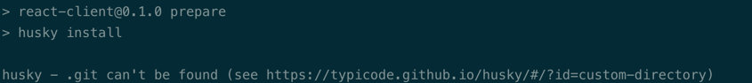

# 1. 参考资料

1. [husky自定义目录钩子的正确使用](https://blog.csdn.net/Banterise/article/details/115206267)

# 2. 自定义目录背景

1. 正常情况下 husky 创建的 `.hook` 与 `.git` 在同一目录下。husky 需要依赖 `.git` 中的某些配置进行 hook 的创建，如果 `.git` 与所需提交项目目录不在同一层级下，就会出现husky钩子无法正常执行的情况。即执行 `husky install` 失败的情况：


2. 从 husky官方文档可以得知，husky 其实是支持自定义目录控制的。文档地址：[Custom directory](https://typicode.github.io/husky/#/?id=custom-directory)

3. 也就是说，在 `.git` 主目录下的每个子目录（或者说子项目），可以依照自己的规则执行钩子，例如项目是 Monorepo 的形式，只有最顶层目录有 `.git`，此时我们就需要自定义 husky 配置目录。

# 3. 配置方式

1. 举个例子，假设 `.git` 在 project 目录下，而 package.json 在 project 下的 front-react 下（项目根目录），即：
   - `project/.git`
   - `project/front-react/package.json`

2. `husky install` 命令必须在与 `.git` 同级的目录下运行。但是我们可以修改 `package.json` 中的 `prepare` 命令，如下所示：
```json
{
    "scripts": {
         "prepare": "cd .. && husky install front/.husky"
    }
}
```
3. 即手动指定 `.husky` 的安装目录。

4. 这样 `.husky` 会被安装在子项目的根路径下，即：`project/front-react/.husky`。

5. 此时在子项目的根路径下执行 `npx husky add` 命令，即可添加 git hook。

6. 生成 git hook 以后，我们还需要修改 hook 的执行路径：
   - 假设执行的命令是：`npx husky add .husky/pre-commit 'npm run lint-staged'`
   - `.husky` 下会生成 `pre-commit` 文件，内容如下：
     ```
         #!/bin/sh
         . "$(dirname "$0")/_/husky.sh"

         npm run lint-staged
      ```
   - 修改 `pre-commit` 文件：
     ```
        #!/bin/sh
         . "$(dirname "$0")/_/husky.sh"

         cd front-react
         npm run lint-staged
     ```
   - 这里默认 `.git` 文件在 `front-react` 的上级目录上，所以只要直接 `cd front-react` 跳转进来再执行指令即可。


