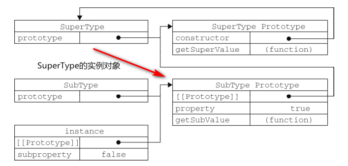

<!-- START doctoc generated TOC please keep comment here to allow auto update -->
<!-- DON'T EDIT THIS SECTION, INSTEAD RE-RUN doctoc TO UPDATE -->
**Table of Contents**  *generated with [DocToc](https://github.com/thlorenz/doctoc)*

- [一、基本概念](#%E4%B8%80%E5%9F%BA%E6%9C%AC%E6%A6%82%E5%BF%B5)
  - [1. js常用的数据类型](#1-js%E5%B8%B8%E7%94%A8%E7%9A%84%E6%95%B0%E6%8D%AE%E7%B1%BB%E5%9E%8B)
  - [2. 检测数据类型](#2-%E6%A3%80%E6%B5%8B%E6%95%B0%E6%8D%AE%E7%B1%BB%E5%9E%8B)
  - [3. 检测数据类型的引申问题：如何判断空字符串，空数组，空对象](#3-%E6%A3%80%E6%B5%8B%E6%95%B0%E6%8D%AE%E7%B1%BB%E5%9E%8B%E7%9A%84%E5%BC%95%E7%94%B3%E9%97%AE%E9%A2%98%E5%A6%82%E4%BD%95%E5%88%A4%E6%96%AD%E7%A9%BA%E5%AD%97%E7%AC%A6%E4%B8%B2%E7%A9%BA%E6%95%B0%E7%BB%84%E7%A9%BA%E5%AF%B9%E8%B1%A1)
  - [4. 加操作符与减操作符](#4-%E5%8A%A0%E6%93%8D%E4%BD%9C%E7%AC%A6%E4%B8%8E%E5%87%8F%E6%93%8D%E4%BD%9C%E7%AC%A6)
- [二、变量、作用域和内存](#%E4%BA%8C%E5%8F%98%E9%87%8F%E4%BD%9C%E7%94%A8%E5%9F%9F%E5%92%8C%E5%86%85%E5%AD%98)
  - [1. 作用域](#1-%E4%BD%9C%E7%94%A8%E5%9F%9F)
  - [2. 作用域链](#2-%E4%BD%9C%E7%94%A8%E5%9F%9F%E9%93%BE)
  - [3. 垃圾回收](#3-%E5%9E%83%E5%9C%BE%E5%9B%9E%E6%94%B6)
- [三、引用类型](#%E4%B8%89%E5%BC%95%E7%94%A8%E7%B1%BB%E5%9E%8B)
  - [1. Object](#1-object)
  - [2. Array](#2-array)
  - [3. Function](#3-function)
  - [4. Date](#4-date)
  - [5. RegExp](#5-regexp)
  - [6. 基本包装类型](#6-%E5%9F%BA%E6%9C%AC%E5%8C%85%E8%A3%85%E7%B1%BB%E5%9E%8B)
- [四、面向对象程序设计](#%E5%9B%9B%E9%9D%A2%E5%90%91%E5%AF%B9%E8%B1%A1%E7%A8%8B%E5%BA%8F%E8%AE%BE%E8%AE%A1)
  - [1. 创建对象](#1-%E5%88%9B%E5%BB%BA%E5%AF%B9%E8%B1%A1)
  - [2. 创建对象的引申问题：new的过程](#2-%E5%88%9B%E5%BB%BA%E5%AF%B9%E8%B1%A1%E7%9A%84%E5%BC%95%E7%94%B3%E9%97%AE%E9%A2%98new%E7%9A%84%E8%BF%87%E7%A8%8B)
  - [3. 原型链](#3-%E5%8E%9F%E5%9E%8B%E9%93%BE)
  - [4. 原型链的引申问题：原型链的最顶端是什么，为什么顶端是这个？](#4-%E5%8E%9F%E5%9E%8B%E9%93%BE%E7%9A%84%E5%BC%95%E7%94%B3%E9%97%AE%E9%A2%98%E5%8E%9F%E5%9E%8B%E9%93%BE%E7%9A%84%E6%9C%80%E9%A1%B6%E7%AB%AF%E6%98%AF%E4%BB%80%E4%B9%88%E4%B8%BA%E4%BB%80%E4%B9%88%E9%A1%B6%E7%AB%AF%E6%98%AF%E8%BF%99%E4%B8%AA)
  - [5. 继承](#5-%E7%BB%A7%E6%89%BF)
  - [6. Object.create()](#6-objectcreate)
- [五、BOM](#%E4%BA%94bom)
  - [1. window](#1-window)
  - [2. location](#2-location)
  - [3. screen](#3-screen)
  - [4. navigator](#4-navigator)
  - [5. history](#5-history)
- [六、DOM](#%E5%85%ADdom)
  - [1. DOM常用的操作方法（原生）](#1-dom%E5%B8%B8%E7%94%A8%E7%9A%84%E6%93%8D%E4%BD%9C%E6%96%B9%E6%B3%95%E5%8E%9F%E7%94%9F)
  - [2. DOM中元素的常用属性](#2-dom%E4%B8%AD%E5%85%83%E7%B4%A0%E7%9A%84%E5%B8%B8%E7%94%A8%E5%B1%9E%E6%80%A7)
  - [3. HTML5新增的API](#3-html5%E6%96%B0%E5%A2%9E%E7%9A%84api)

<!-- END doctoc generated TOC please keep comment here to allow auto update -->

# 一、基本概念

## 1. js常用的数据类型

1. 原始类型（基本数据类型）有3种：
    1. Number
    2. String
    3. Boolean
    
2. 合成类型（引用类型）1种：
    1. Object
    
3. 特殊类型 2 种：
    1. undefined
    2. null
    
3. ES6新增的 1 种：
    1. Symbol
    
## 2. 检测数据类型

1. typeof，可以直接得到基本数据类型、undefined 和Symbol 所属的类型。null返回的是 object。对于引用类型，一律返回 object。但是函数返回的是 function。例如：  
     ```javascript
        typeof 123 ;  // Number
        typeof 'a' ;  // String
        typeof true ;  // Boolean
        typeof undefined ;   //Undefined
        typeof null ;      //Object 
        typeof Symbol ;  // Symbol
   
        function fn() {}
        typeof fn ;   // function;
        typeof [] ;   // object
   
   ```
   
2. instanceof，判断某个实例是否是一个对象的实例。主要是用于 Object 类型。例如：
     ```javascript
       [] instanceof Array ; // true
       function fn() {}
       fn instanceof Function || Object ;  // true
       null instanceof Object ;   // false
   ```
   
3. Object.prototype.toString.call() 这种方式可以将全部的数据类型检测出来也是推荐的方式。因为toString是Object的原型方法, 而 Array Function 等都是 Object 的实例。都重写了toString 方法。返回的是类型的字符串。例如：
     ```javascript
        Object.prototype.toString.call(null) ;    // [object Null]
   
   　　 Object.prototupe.toString.call(undefined) ;    // [object Undefined]
   
   　　 Object.prototype.toString.call(123)  ;    //  [object Number]
   
   　　 Object.prototype.toString.call(true) ;    //  [object Boolean]
   
   　　 Object.prototype.toString.call('123') ;    //  [object String]
   
   　　 Object.prototype.toString.call({})    ;    //  [object Object]
   
   　　 Object.prototype.toString.call([])    ;    //  [object Array]
   
   　　 Object.prototype.toString.call(Math) ;    //  [object Math]
   
   　　 Object.prototype.toString.call(function(){}) ;    //  [object Function]
   
   　　 Object.prototype.toString.call(new Date)  ;    //  [object Date]
   
   　　 Object.prototype.toString.call(Symbol())   ;    //  [object Symbol]
   ```
   
4. Array.isArray()，判断某一个数据是否是数组类型。返回值是布尔值。例如：
   ```javascript
      Array.isArray([1, 2, 3]);  // true
      Array.isArray({foo: 123}); // false
      Array.isArray('foobar');   // false
      Array.isArray(undefined);  // false
   ```  
   
5. 对于数组的判断，我们更倾向于使用 isArray()。

## 3. 检测数据类型的引申问题：如何判断空字符串，空数组，空对象

1. 空字符串
   ```javascript
    function isEmpty(obj) {
      if (typeof obj === 'undefined' || obj == null || obj === '') {
        return true;
      } else {
        return false;
      }
    }
   ```  

2. 空数组
   ```javascript
       var arr = [] ;
       arr.length === 0 ;  // true
       // 或者
       JSON.stringify([]) === '[]'  
   ```   

3. 空对象
   ```javascript
      let obj = {} ;
      Object.keys(obj).length == 0 ;    // true
      // 或者
      JSON.stringify({}) === '{}' ;  // true
   ```

## 4. 加操作符与减操作符

### 1. 加（+）操作符  

### 1. 正常情况

1. a + b，结果取决于 a 和 b 的类型：
   1. a 和 b 都是数值，则按照常规的加法进行操作。
   2. a 和 b 都是字符串，则将两个字符串相连。
   3. a 和 b 其中有一个是字符串，另一个不是，则将另一个变量转换为字符串，然后执行相连操作。  
   4. 如果有一个操作数是对象、数值或布尔值，则调用它们的 toString() 方法取得相应的字符串值，然后再应用前面关于字符串的规则。对于 undefined 和 null ，则分别调用 String() 函数并取得字符串 "undefined" 和 "null"。

#### 2. 加（+）操作的特殊情况

1. 特殊情况：`[] + []`
   - `[] + [] === ''`
   - `+` 操作符两边都是对象，因此首先调用对象的 toString() 方法，将空数组 `[]` 转换为 `''`，实际上就变成了：`'' + ''`，所以结果还是空字符串：`''`。
   
2. 特殊情况：`{} + []`
   - `{} + [] === 0`
   - `+` 操作符两边都是对象，但是 `+` 左侧是一个对象：`{}`，JavaScript 引擎将第一个 `{}` 解释成了一个空的代码块并忽略了它，因此实际上执行的是：`+[]`，这里的加号并不是代表加法的二元运算符，而是一个一元运算符，作用是将它后面的操作数转换成数字，和Number()函数完全一样。即先将空数组转换为字符串：`[] --> ''`，然后将空字符串 `''` 转换为数字 `0`。
   - 为什么第一个 `{}` 会被解析成代码块呢？原因是，整个输入被解析成了一个语句，如果一个语句是以左大括号开始的，则这对大括号会被解析成一个代码块。所以，你也可以通过强制把输入解析成一个表达式来修复这样的计算结果：`({} + [])`，结果是：`"[object Object]"`。

3. 特殊情况：`1 + []`
   - `1 + [] === '1'`
   - 1 是基本类型，而空数组 `[]` 是对象，需要转换，空数组 `[]` 被转换为 `''`，所以最后的结果就是：`1 + '' --> '1'`

4. 特殊情况：`{} + {}`
   - FireFox：`{} + {} === NaN`
   - Chrome：`{} + {} === '[object Object][object Object]'`
   - 在 FireFox 中，第一个对象 `{}` 被解析为代码块，因此被忽略，剩下的就是 `+{}`，即将空对象转换为数字，`{}` 转换的结果是 NaN，因此结果就是`NaN`。
   - 在 Chrome 中，没有将第一个对象 `{}` 被解析为代码块，而是将其转换为基本类型——字符串。所以结果就是 `'[object Object][object Object]'`。

5. 特殊情况：`{} + '1'`
   - `{} + '1' === 1`
   - 第一个对象 `{}` 被解析为代码块，因此被忽略，剩下的就是 `+'1'`，显然就是数字形式的 1。
   

### 2. 减（-）操作符  

1. a - b，结果取决于a和b的类型：
   1. a 和 b 都是数值，则按照常规的减法进行操作。
   2. a 和 b 其中有一个是数字，另一个不是，是字符串、布尔值、null 或 undefined，则先在后台调用 Number() 函数将其转换为数值，然后再根据前面的规则执行减法计算。如果转换的结果是 NaN，则减法的结果就是 NaN。  

2. 如果有一个操作数是对象，则调用对象的 valueOf() 方法以取得表示该对象的数值。如果得到的值是 NaN，则减法的结果就是 NaN。如果对象没有 valueOf() 方法，则调用其 toString() 方法并将得到的字符串转换为数值。
    ```javascript
       var result1 = 5 - true; // 4，因为 true 被转换成了 1
       var result2 = NaN - 1; // NaN
       var result3 = 5 - 3; // 2
       var result4 = 5 - ""; // 5，因为"" 被转换成了 0
       var result5 = 5 - "2"; // 3，因为"2"被转换成了 2
       var result6 = 5 - null; // 5，因为 null 被转换成了 0
       var result7 = 5 - undefined ;   //NaN, undefined被转换为NaN
   ```
   
### 3. `--i`（`++i`）与`i--`（`i++`）的区别

1. `--i` 属于前自减运算符，也就是先对 i 执行减 1 操作，然后将i的值赋给其他变量。

2. `i--` 属于后自减运算符，也就是先将 i 的值赋给其他变量，然后对 i 执行减 1 操作。

3. 具体代码说明如下：
   ```javascript
          // 前自减运算符
          var num1 = 2 ;
          var num2 = 20 ;
          var num3 = --num1 + num2 ;
             
          // 21
          console.log(num3) ;
          // 1
            console.log(num1) ;
          
          
          // 后自减运算符
          var age1 = 3 ;
          var age2 = 25 ;
          var age3 = age1-- + age2 ;
             
          // 28
          console.log(age3) ;
          // 2
          console.log(age1) ;
   ```

4. `i++`和`++i`区别和`i--`和`--i`相同。代码示例如下：
    ```javascript
             // 前自增运算符
             var num1 = 3 ;
             var num2 = 30 ;
             var num3 = ++num1 + num2 ;
          
             // 34
             console.log(num3) ;
             // 4
             console.log(num1) ;
          
             // 后自减运算符
             var age1 = 3 ;
             var age2 = 25 ;
             var age3 = age1++ + age2 ;
                      
             // 28
             console.log(age3) ;
             // 4
             console.log(age1) ;
   ```
5. 总结：
   - 前置（`++i`和`--i`）就是先对自己加或减，把自己搞好了再去做其他的。
   - 后置（`i++`和`i--`）就是先去做其他的，等其他的搞好了，再对自己加或减。

6. 前置和后置的主要区别还是在赋值上面。

# 二、变量、作用域和内存

## 1. 作用域  

1. 理解：作用域定义了变量或函数有权访问的其他数据，决定了它们各自的行为。也就是说，变量和函数的起作用范围，在哪个范围内能访问到哪些变量和函数。 
 
2. 分类： 在 ES6 出现之前，只有函数作用域和全局作用域，没有块级作用域。   

3. 没有块级作用域的缺点：
   1. 变量容易混淆  
   例如，在 for 循环中，定义循环变量 i，循环结束后，变量 i 依然存在，如果我之前定义过 i，这两个 i 就会混淆，影响后面的使用。
   2. 内存泄漏  
   一个变量使用完以后，应该立即回收，释放内存。但是 JavaScript 没有块级作用域，所以一段代码执行完后，里面的代码也不会被销毁，而是存在于内存之中，这就是内存泄漏。当这样的情况很多的时候，就会造成内存占用过大，性能下降。  
   
4. 解决方法：
   1. 使用立即执行匿名函数。
   2. let 或 const 定义一个变量
   
## 2. 作用域链

1. 理解： 当代码在一个环境中执行时，会创建变量对象的一个作用域链（scope chain）。作用域链的用途，是保证对执行环境有权访问的所有变量和函数的有序访问。作用域链的前端，始终都是当前执行的代码所在环境的变量对象。如果这个环境是函数，则将其活动对象（activation object）作为变量对象。  

2. 简单的说，作用域链就本质上就是指向变量对象的指针列表。  

3. 一般情况下，在**闭包**知识点的考察过程中会涉及到作用域链。

## 3. 垃圾回收

1. 标记清除

2. 引用计数

# 三、引用类型

## 1. Object

## 2. Array

## 3. Function

## 4. Date

## 5. RegExp

## 6. 基本包装类型

# 四、面向对象程序设计

## 1. 创建对象

1. 构造函数模式和原型模式的组合方式。构造函数模式用于定义实例属性，而原型模式用于定义方法和共享的属性。结果，每个实例都会有自己的一份实例属性的副本，但同时又共享着对方法的引用，最大限度地节省了内存。另外，这种混成模式还支持向构造函数传递参数；可谓是集两种模式之长。
   ```javascript
      function Person(name, age, job){
      this.name = name;
      this.age = age;
      this.job = job;
      this.friends = ["Shelby", "Court"];
      }
      Person.prototype.sayName = function() {
         alert(this.name);
      }
   ```
   
## 2. 创建对象的引申问题：new 的过程

1. js 高级程序设计中的说法：
   1. 创建一个新对象
   2. 将构造函数的作用域赋值给这个新对象（将 this 指向这个新对象）
   3. 执行构造函数中的代码（给新对象添加属性）
   4. 返回这个新对象  
     
2. 详细版（new ClassA(…)）：
   1. 创建一个空对象，构造函数中的this指向这个空对象  
      `var obj = {};`
   2. 这个新对象被执行 [[原型]] 连接（设置新对象的 `__proto__` 属性指向构造函数的 `prototype` 对象）：  
      `obj.__proto__ = ClassA.prototype;`
   3. 执行构造函数方法，属性和方法被添加到this引用的对象中：    
      `ClassA.call(obj);`  
   4. 如果构造函数中没有返回其它对象，那么返回this，即创建的这个的新对象，否则，返回构造函数中返回的对象。

3. 代码版（手动实现一个 new 的过程）
   ```js
      function Parent(name, age) {
             this.name = name ;
             this.age = age ;
      }
      Parent.prototype.sayName = function () {
            console.log(this.name);
      }
      
      // 自己定义new方法
      function newMethod(Parent, ...rest) {
         // 1. 将构造器（Parent）的prototype属性作为原型，创建一个新的对象
         let child = Object.create(Parent.prototype) ;  
         // 2. 将this和调用参数传递给构造函数执行
         let ret = Parent.apply(child, rest);
         // 3. 如果构造函数返回了对象，那么就返回这个对象
         if (result && (typeof (result) == "object" || typeof (result) == "function")) {
              return  ret;
          }
           // 4. 如果构造函数没有返回对象，我们返回手动创建的 obj 对象
           return child; 
      }
   ``` 
4. 对上面代码的描述：  
   - 以构造器的 prototype 属性为原型，创建新对象；  
   - 将 this (也就是上一句中的新对象) 和调用参数传给构造器，执行；  
   - 如果构造器没有手动返回对象，则返回第一步创建的对象


## 3. 原型链

### 1. 原型对象

1. 原型是函数属性，每个函数创建后，都有一个prototype属性，prototype指向原型对象。所有原型对象都会自动获得一个 constructor（构造函数）属性，这个属性包含一个指向 prototype 属性所在函数的指针。   

2. 我们通过而通过这个构造函数，我们还可继续为原型对象添加其他属性和方法。
     
### 2. 隐式原型（[[proto]]）  

1. 这个是实例对象属性。脚本不可访问。指向的是创建这个对象的构造函数的原型对象。  

2. 我们访问对象中的属性的时候，首先看实例中是否存在这个属性，如果没有，就找到这个实例对象的原型，看是否存在这个属性，如果有，就返回，没有，就继续向上父级的原型对象去查找（继承）。
      
### 3. 原型链  

1. 由前面可知，实例对象的隐式原型（[[proto]]）指向构造函数的显示原型对象。那么原型链，指的就是其他构造函数的显示原型属性（prototype），指向另一个构造函数的实例对象，而这个实例对象的隐式原型又指向创建这个实例对象的构造函数的显示原型对象。如果这个构造函数的原型属性又指向另外一个实例对象，那么上述关系也存在。原型指向的层层递进，就构成了实例与原型的链条。
     ```javascript
        function SuperType() {
           this.property = true;
        }
     
        SuperType.prototype.getSuperValue = function(){
          return this.property;
        };
     
        function SubType() {
          this.subproperty = false;
        }
     
        SubType.prototype = new SuperType();
     
        SubType.prototype.getSubValue = function() {
        return this.subproperty;
        }
        var instance = new SubType() ;
        alert(instance.getSuperValue()) ; //true
     ```
  一张图表示这种关系：
  
  
## 4. 原型链的引申问题：原型链的最顶端是什么，为什么顶端是这个？

1. 原型链的最顶端是 Object.prototype。  

2. 原因：所有引用类型默认都继承了 Object，而这个继承也是通过原型链实现的。所有函数的默认原型都是 Object 的实例，因此默认原型都会包含一个内部指针，指向 Object.prototype。  

3. **注意**：Object.prototype 也是一个对象，也具有隐式原型（`[[proto]]`），但是，这个隐式原型指向的是 null。

## 5. 继承

1. JavaScript中，使用原型链的方式实现继承。  

2. 组合继承，指的是将原型链和借用构造函数的技术组合到一块，从而发挥二者之长的一种继承模式。其背后的思路是使用原型链实现对**原型属性和方法**的继承，而通过借用构造函数来实现对**实例属性**的继承。这样，既通过在原型上定义方法实现了函数复用，又能够保证每个实例都有它自己的属性。  
   ```javascript
      function Fruits(color, name) {
          this.color = color ;
          this.name = name ;
      }
      Fruits.prototype.getFruitsName = function() {
          return this.name ;
      }
    
      function Apple(color, name, shape) {
          Fruits.call(this, color, name);
          this.shape = shape ;
      }

      // 原型链继承
      Apple.prototype = new Fruits();
      // 将构子类的原型对象的造函数属性指定为子类构造函数
      Apple.prototype.constructor = Apple;
      Apple.prototype.getShape = function() {
          return this.shape;
      }
   ```
3. **缺点**：调用两次父类的构造函数， 一次在子类的构造函数中，一次在原型继承实例化父类过程中。  

4. **注意**：组合式继承，在子类原型对象指向父类实例时，原型对象的 constructor 属性会丢失，所以，我们要将 constructor 属性重新指向子类的构造函数。

## 6. Object.create()

1. 这个函数用于实现原型式继承。这个方法接收两个参数：一个用作新对象原型的对象和（可选的）一个为新对象定义额外属性的对象。返回值是一个新对象。在传入一个参数的情况下，Object.create() 与 object() 方法的行为相同。
  
2. 所谓原型式继承，如下面代码所示：
   ```javascript
      function object(o) {
         function F() {}
         F.prototype = o ;
         return new F() ;
      }
   ```
3. 不使用构造函数，借用已经存在的对象实现的一种继承方式。传入的对象 o 会作为返回的实例对象的原型对象。  

4. **缺点**：如果对象o中存在引用类型的属性，则这个属性会被所有返回的实例共享，一旦修改，所有实例的这个属性均会发生变化。  

5. **优点**：不使用构造函数，即可实现对一个已经存在对象的继承。而不必知道这个对象具有的属性，方法。

# 五、BOM

1. BOM，全称是浏览器对象模型（Browser Object Model）。BOM 提供了很多对象，用于访问浏览器的功能，这些功能与任何网页内容无关。

## 1. window

1. 所以在全局作用域声明和定义的变量与函数，都会被添加到window对象中。
  
### 1. 常用方法和属性

1. alert()  
   - 这个方法接受一个字符串并将其显示给用户。具体来说，调用alert() 方法的结果就是向用户显示一个系统对话框，其中包含指定的文本和一个 OK（“确定”）按钮。
   - 通常使用 alert() 生成的“警告”对话框向用户显示一些他们无法控制的消息，例如错误消息。而用户只能在看完消息后关闭对话框。

2. confirm()  
   - 第二种对话框是调用 confirm() 方法生成的。从向用户显示消息的方面来看，这种“确认”对话框很像是一个“警告”对话框。但二者的主要区别在于“确认”对话框除了显示 OK 按钮外，还会显示一个 Cancel（“取消”）按钮，两个按钮可以让用户决定是否执行给定的操作。  
   - 用户点击了ok，返回的是true，如果点击了cancle或关闭对话框，返回的是false。用法如下：
       ```javascript
          if (confirm("Are you sure?")) {
             alert("I'm so glad you're sure! ");
          } else {
             alert("I'm sorry to hear you're not sure. ");
          }
       ```
3. open()  
   - 接收一个 url，作用是打开一个新的浏览器窗口或查找一个已命名的窗口。

4. scrollTo(x,y)  
   - 滚动到指定的位置。其中x和y以窗口的左上角为原点。

5. setInterval() 和 setTimeout()  
   - 定时器

6. innerHeight 和 innerWidth  
   - 浏览器窗口的内部宽度和高度。  
   - 内部宽高是指除去菜单栏、工具栏、边框等占位元素后，用于显示网页的净宽高。

7. outerHeight 和 outerWidth
   - 浏览器窗口的整个宽度和高度。

8. screenLeft/screenTop、screenX/screenY  
   - 只读整数。声明了窗口的左上角在屏幕上的的 x 坐标和 y 坐标。IE、Safari、Chrome 和 Opera 支持 screenLeft和 screenTop，而 Chrome、Firefox 和 Safari 支持 screenX 和 screenY。
     
## 2. location

1. location 是最有用的 BOM 对象之一，它提供了与当前窗口中加载的文档有关的信息，还提供了一些导航功能。事实上， location 对象是很特别的一个对象，因为它既是 window 对象的属性，也是document 对象的属性；换句话说，window.location 和 document.location 引用的是同一个对象。

2. hash  
   - 返回URL中的hash（#号后跟零或多个字符），如果URL中不包含散列，则返回空字符串。如`#document`。
   
3. host  
   - 返回服务器名称和端口号，例如：`www.wrox.com:80`。
  
4. hostname  
   - 返回不带端口号的服务器名称，例如：`www.wrox.com`。
  
5. href  
   - 返回当前加载页面的完整URL。而location对象的toString()方法也返回这个值，例如：`http:/www.wrox.com`。
  
6. pathname  
   - 返回URL中的目录和（或）文件名，例如：`/index.html`。
  
7. port  
   - 返回URL中指定的端口号。如果URL中不包含端口号，则这个属性返回空字符串。
   
8. protocol  
   - 返回页面使用的协议。通常是http:或https。
   
9. search  
   - 返回URL的查询字符串。这个字符串以问号开头。例如：`?q=js`。
   
## 3. screen 
 
1. screen对象表示屏幕的信息。

2. screen.width  
   - 屏幕宽度，以像素为单位。
  
3. screen.height  
   - 屏幕高度，以像素为单位。
   
4. screen.colorDepth  
   - 返回颜色位数，如8、16、24。
   
## 4. navigator

1. 用来识别客户端浏览器的对象。

2. appName  
   - 浏览器名称。
   
3. appVersion  
   - 浏览器版本。
  
4. language  
   - 浏览器设置的语言。
  
5. platform  
   - 操作系统类型。
  
6. userAgent  
   - 浏览器设定的User-Agent字符串。
  
## 5. history

1. history 对象保存着用户上网的历史记录，从窗口被打开的那一刻算起。因为 history 是 window对象的属性，因此每个浏览器窗口、每个标签页乃至每个框架，都有自己的 history 对象与特定的 window 对象关联。出于安全方面的考虑，开发人员无法得知用户浏览过的 URL。  

2. history 存储 url 是一个栈结构。

3. go()  
   - 使用 go() 方法可以在用户的历史记录中任意跳转，可以向后也可以向前。这个方法接受一个参数，表示向后或向前跳转的页面数的一个整数值。负数表示向后跳转（类似于单击浏览器的“后退”按钮），正数表示向前跳转（类似于单击浏览器的“前进”按钮）。例如：
     ```javascript
        //后退一页
        history.go(-1) ;
        //前进一页
        history.go(1) ;
        //前进两页
        history.go(2) ;
     ```
   - 也可以给 go() 方法传递一个字符串参数，此时浏览器会跳转到历史记录中包含该字符串的第一个位置——可能后退，也可能前进，具体要看哪个位置最近。如果历史记录中不包含该字符串，那么这个方法什么也不做。例如：
     ```javascript
        //跳转到最近的 wrox.com 页面
        history.go("wrox.com") ;
        //跳转到最近的 nczonline.net 页面
        history.go("nczonline.net") ;
     ```
2. back()  
   - 后退一页，等同于`go(-1)`。
   
3. forward()
   - 前进一页，等同于`go(1)`。
  
# 六、DOM

1. DOM（文档对象模型）是针对 HTML 和 XML 文档的一个 API（应用程序编程接口）。DOM 描绘了一个层次化的节点树，允许开发人员添加、移除和修改页面的某一部分。DOM 脱胎于Netscape 及微软公司创始的 DHTML（动态 HTML），但现在它已经成为表现和操作页面标记的真正的跨平台、语言中立的方式。  

2. 因为操作DOM代价高昂，所以现代Web前端开发中，尽量不直接操纵DOM。

## 1. DOM常用的操作方法（原生）

1. 获取元素
   - document.getElementById()
   - document.getElementsByTagName()
   - document.getElementsByName()
   - document.getElementsByClassName()
   - document.querySelector() 
   - document.querySelectorAll()  

2. 添加元素
   - Node.appendChild()
   - Node.insertBefore()
   - Element.insertAdjacentHTML()

3. 删除元素
   - Node.removeChild()
   - Node.replaceChild()

4. 修改元素
   - Element.getAttribute()
   - Element.setAttribute()
   - Element.removeAttribute()
   - Element.innerHTML

5. 创建元素
   - document.createElement()
     
6. 判断某个节点是不是另一个节点的后代（返回值是布尔值）
   - Node.contains()
     
## 2. DOM中元素的常用属性

1. childNodes  
   - 每个节点都有一个 childNodes 属性，其中保存着一个 NodeList 对象。 NodeList 是一种类数组
对象，用于保存一组有序的节点，可以通过位置来访问这些节点。  
   - 某个节点下的所有子节点。

2. parentNode  
   - 每个节点都有一个 parentNode 属性，该属性指向文档树中的父节点。包含在 childNodes 列表中
的所有节点都具有相同的父节点，因此它们的 parentNode 属性都指向同一个节点。  

3. parentElement  
   - 父元素，节点类型为Element。 

4. children
   - 这个属性是 HTMLCollection 的实例，只包含元素中同样还是元素的子节点。

5. hidden
   - 元素是否隐藏，默认是false，不隐藏。

6. id  
   - 元素的id属性。

7. className
   - 元素的class属性。

8. innerHTML

9. innerText

## 3. HTML5新增的API

1. 自定义属性  
   - HTML5规定可以为元素添加非标准的属性，但要添加前缀data-，目的是为元素提供与渲染无关的信息，或者提供语义信息。这些属性可以任意添加、随便命名，只要以data-开头即可。例如：
  `<div id="myDiv" data-appId="12345" data-myname="Nicholas"></div>`  
   - 添加了自定义属性之后，可以通过元素的 dataset 属性来访问自定义属性的值。 dataset 属性的值是 DOMStringMap 的一个实例，也就是一个名值对儿的映射。在这个映射中，每个 data-name 形式的属性都会有一个对应的属性，只不过属性名没有 data- 前缀（比如，自定义属性是 data-myname ，那映射中对应的属性就是 myname ）。  
     ```javascript
        //本例中使用的方法仅用于演示
        var div = document.getElementById("myDiv");
        //取得自定义属性的值
        var appId = div.dataset.appId;
        var myName = div.dataset.myname;
        //设置值
        div.dataset.appId = 23456;
        div.dataset.myname = "Michael";
        //有没有"myname"值呢？
        if (div.dataset.myname){
          alert("Hello, " + div.dataset .myname) ;
        }
     ```  
   - **注意**：如果属性名称中还包含连字符(-)，在dataset属性获取时需要转成驼峰命名方式。
  
2. 元素的 classList 属性  
   - 新的元素属性，用来操作元素的class，非常方便。还支持下面的方法： 
     - add(value)  
       将给定的字符串值添加到列表中。如果值已经存在，就不添加了。
     - contains(value)  
       表示列表中是否存在给定的值，如果存在则返回 true ，否则返回 false 。
     - remove(value)   
       从列表中删除给定的字符串。
     - toggle(value)  
       如果列表中已经存在给定的值，删除它；如果列表中没有给定的值，添加它。

  
