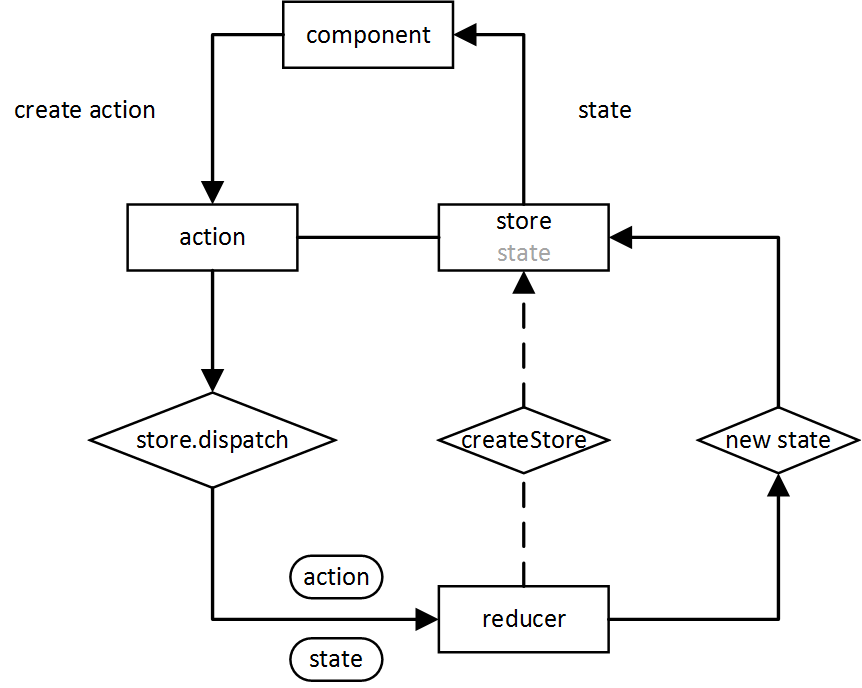

<!-- START doctoc generated TOC please keep comment here to allow auto update -->
<!-- DON'T EDIT THIS SECTION, INSTEAD RE-RUN doctoc TO UPDATE -->
**Table of Contents**  *generated with [DocToc](https://github.com/thlorenz/doctoc)*

- [JavaScript 中的 Thunk 函数](#javascript-%E4%B8%AD%E7%9A%84-thunk-%E5%87%BD%E6%95%B0)
  - [1. 参考资料](#1-%E5%8F%82%E8%80%83%E8%B5%84%E6%96%99)
  - [2. 参数求值策略](#2-%E5%8F%82%E6%95%B0%E6%B1%82%E5%80%BC%E7%AD%96%E7%95%A5)
  - [3. `Thunk` 函数](#3-thunk-%E5%87%BD%E6%95%B0)
  - [4. JavaScript 中的 `Thunk` 函数](#4-javascript-%E4%B8%AD%E7%9A%84-thunk-%E5%87%BD%E6%95%B0)
  - [5. Thunkify 模块](#5-thunkify-%E6%A8%A1%E5%9D%97)
  - [6. `Thunk` 函数与 `Curried` 函数的区别](#6-thunk-%E5%87%BD%E6%95%B0%E4%B8%8E-curried-%E5%87%BD%E6%95%B0%E7%9A%84%E5%8C%BA%E5%88%AB)
    - [1. `Thunk` 函数](#1-thunk-%E5%87%BD%E6%95%B0)
    - [2. `Curried` 函数](#2-curried-%E5%87%BD%E6%95%B0)

<!-- END doctoc generated TOC please keep comment here to allow auto update -->

# JavaScript 中的 Thunk 函数

## 1. 参考资料

1. [Thunk 函数的含义和用法](http://www.ruanyifeng.com/blog/2015/05/thunk.html)

## 2. 参数求值策略

1. 对于一个函数，如果其接收的参数，是一个表达式，如下所示：
   ```js
      const x = 3;
      function f(n) {
          return n * 2;
      }
   
      f(x + 5);
   ```
2. f() 接收的参数是一个表达式：`x + 5`，那么我们应该什么时候计算 `x + 5` 呢？

3. 第一种意见是“传值调用”（call by value），即在传入函数体之前就计算 x + 5 的值，然后将这个值即 8，传入 `f()` 中。C 语言就采用这种策略。
   ```js
      f(x + 5);
      // 等同于
      f(8);
   ```

4. 另外一种意见是“传名调用”（call by name），即直接将表达式 `x + 5` 整体传入函数体内，只有在用到它的时候求值。Haskell语言采用这种策略。
   ```js
      f(x + 5);
      // 等同于
      (x + 5) * 2
   ```
5. 传值调用和传名调用，哪一种策略比较好？回答是各有利弊。传值调用比较简单，但是对参数求值的时候，实际上还没用到这个参数，有可能造成性能损失。
   ```js
      function f(a, b) {
          return b;
      }
      const x = 5;
      f(x*x + 2 * x - x / 2, 5);
   ```
   上面的例子中，`f()` 的第一个参数是一个复杂的表达式，如果是传值调用，就会提前将这个表达式的值算出来，但实际上，`f()` 根本没有用到这个值。这样就会造成性能的损失。

## 3. `Thunk` 函数

1. 编译器的"传名调用"实现，往往是将参数放到一个临时函数之中，再将这个临时函数传入函数体。这个临时函数就叫做 `Thunk` 函数。举例如下：
   ```js
      function f(x) {
          return x * 2;
      }

      const n = 5;

      f(n + 5);

      // 等同于

      const thunk = () => {
          return n + 5;
      }

      function f(thunk) {
          return thunk() * 2;
      }
   ```
2. 上面示例中，函数 `f()` 的参数 `x + 5` 被一个函数替换了。凡是用到原参数的地方，对 `thunk()` 函数求值即可。

3. 这就是 `Thunk` 函数的定义，它是"传名调用"的一种实现策略，用函数来替换某个表达式。

4. 也就是说，`Thunk` 函数是函数式编程的一种思想。用函数来替代具体的求值。

## 4. JavaScript 中的 `Thunk` 函数

1. JavaScript 采取的是传值调用.因此它的 `Thunk` 函数含义有所不同。在 JavaScript 中，`Thunk` 函数替换的不是表达式，而是多参数函数，将其替换成单参数的版本，且只接受回调函数作为参数。
   ```js
      // 多参数函数，最后一个参数是回调函数
       fs.readFile(path, callback);

       // 经过 Thunk 函数转换，变成单参数的函数
       const readFileThunk = Thunk(path);
       readFileThunk(callback);


       function Thunk(path) {
           return function (callback) {
              fs.readFile(path, callback);
           }
       }
   ```

2. 上面的例子中，`readFile` 是一个多参数函数，最后一个参数是回调函数，经过 `Thunk()` 函数的转换，变成 `readFileThunk()`，这个函数只接收回调函数作为参数，这个单参数，且只接收回调函数的版本，就叫做 `Thunk()` 函数。

3. 任何函数，只要参数有回调函数，就能写成 `Thunk` 函数的形式，下面是一个简易的 `Thunk` 函数转换器：
   ```js
      /**
        * 接收一个带有回调函数的参数的函数，这个回调函数参数必须是最后一个参数
        *
        * @param fn 最后一个参数是回调函数的函数
        * @returns {function(): function(*): *}
        * @constructor
        */
      function Thunk(fn) {
          return function () {
              const args = [...arguments];
              return function (callback) {
                  // args.push(callback);
                  return fn.apply(this, [...args, callback]);
              }
          }
      }
   ```

4. 下面使用简易的 `Thunk` 函数转换器实现 `readFile()` 的转换：
   ```js
      
      const fs = require('fs');

      /**
        * readFileThunk() 是一个函数，是 fs.readFile() 经过 Thunk 函数的包装后的结果
        * readFileThunk() 接收的参数是 fs.readFile() 的回调函数前面的参数
        * readFileThunk() 的返回值也是一个函数，这个函数接收的是 fs.readFile() 的最后一个回调函数
        *
        * @type {function(): function(*): *}
        */
      const readFileThunk = Thunk(fs.readFile);

      const path = './aa.txt';

      function callback(err, res) {
          if (err) {
             console.log('err', err);
          }
          
          // I like this night!
          console.log(res.toString());
      }

      readFileThunk(path)(callback);
   ```

## 5. Thunkify 模块

1. 生产环境对于带有回调函数的函数的转换建议使用 `Thunkify` 模块。

2. npm 链接：[Thunkify](https://www.npmjs.com/package/thunkify)

3. `Thunkify` 的主要作用是将传统的 node 函数（回调风格的函数）转换成 `Thunk` 函数。转换后的 `Thunk` 函数主要用在基于 Generator 的自动流程管理上，比如说 `Generator` 的自动执行器 `co` 模块。

4. `Thunkify` 的源码与上面的简易的 `Thunk` 非常类似：
   ```js 
      function thunkify(fn){
          return function(){
      var args = new Array(arguments.length);
      var ctx = this;

          for(var i = 0; i < args.length; ++i) {
            args[i] = arguments[i];
          }

          return function(done){
            var called;

            args.push(function(){
              if (called) return;
              called = true;
              done.apply(null, arguments);
            });

            try {
              fn.apply(ctx, args);
            } catch (err) {
              done(err);
            }
          }
      }
      };
   ```
5. 它的源码主要多了一个检查机制，变量 `called` 确保回调函数只运行一次。

## 6. `Thunk` 函数与 `Curried` 函数的区别

### 1. `Thunk` 函数

1. `Thunk` 函数用于延迟执行。只有真正用到的地方才去执行 `Thunk` 函数，同时，`Thunk` 函数在执行时，还保留了其所在环境的上下文信息（context）。举个例子，我们在使用 `redux` 的过程中，一般情况下，分发的都是同步 `action`，如下图所示：
   
   
2. 从上图中可以看出，我们只要分发一个 `action`，`store` 就会被同步更新。但是有一些场景下，我们分发的 `action` 是一个异步任务，我们需要等到异步任务返回结果后，根据这个结果来决定如何更新 `store`。此时就不能分发同步 `action`。

3. 针对于这种情况，我们使用 `redux` 的中间件 —— `redux-thunk`。`redux-thunk` 这个中间件使得我们可以分发异步 `action`，也就是可以等到异步任务返回结果以后，在更新 `store`。

4. `redux-thunk` 的核心实现如下：
   ```js
      export default function thunkMiddleware({ dispatch, getState }) {
          return next => action =>
              typeof action === 'function' ?
                  action(dispatch, getState) :
                  next(action);
      }
   ```
5. 上面的代码使用了箭头函数，可能不太直观，我们使用传统的函数改造一下：
   ```js
      export default function thunkMiddleware({ dispatch, getState }) {
          return function nextFunc(next) {
              return function actionThunk(action) {
                  return typeof action === 'function' ? action(dispatch, getState) : next(action);
              }
          }
      }
   ```
   在 `actionThunk` 函数中，检查我们分发的 action 是不是函数，如果是函数，我们就传入 `dispatch` 方法和 `getState` 方法，在 `action` 函数内部，我们执行异步任务，等到异步任务返回结果后，再调用 `dispatch` 方法，更新 `store`。这个 `action` 函数就实现了延迟更新 `store`。

6. 通常意义上的 `Thunk` 函数可以理解为是一种没有参数的闭包（closure），我们不需要思考（thinking）这个函数的执行过程，最终获得什么结果，因为我们不需要处理参数，调用这个函数，获得的结果是一定的，所以称为 `Thunk`，表示在过去思考了，现在使用不需要思考。举个例子：
    ```js
       function add(x, y) {
           return x + y; 
       }
       
       const thunkFive = () => add(2, 3);
       const five = add(2, 3);
       
       function fn(n) {
           return n + 5;
       }
   
       // 
       fn(thunkFive());
    ```
   `thunkFive` 是一个函数，其内部调用了 add 方法，并指定了参数 2 和 3，那么最终 `thunkFive()` 的返回值就是 5，也就是说，`thunkFive` 函数代表的是数字 5。我们定义好 `thunkFive` 以后，需要数字 5 的地方直接调用 thunkFive 函数就可以。`thunkFive` 函数后只有真正执行，才能得到数字 5，体现了延迟计算的优势。如果我们使用 `const five = add(2, 3);` 这样的方式得到数字 5，`add(2, 3)` 会被直接执行，变量 `five` 被赋值为 5，保存在内存中。那么即使后面没有用到变量 `five`，这个变量也一直会在内存中，造成性能的损失。

### 2. `Curried` 函数

1. `Curried` 函数用于将多参数函数转换成单参数函数。主要目的是对函数进行部分配置，以实现重用函数，提供更好地接口。
