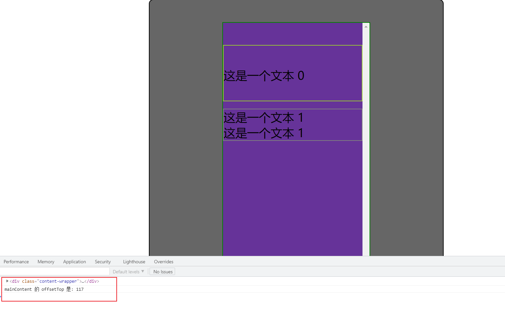

<!-- START doctoc generated TOC please keep comment here to allow auto update -->
<!-- DON'T EDIT THIS SECTION, INSTEAD RE-RUN doctoc TO UPDATE -->
**Table of Contents**  *generated with [DocToc](https://github.com/thlorenz/doctoc)*

- [offsetHeight、clientHeight、offsetTop、scrollTop 等元素属性的区别](#offsetheightclientheightoffsettopscrolltop-%E7%AD%89%E5%85%83%E7%B4%A0%E5%B1%9E%E6%80%A7%E7%9A%84%E5%8C%BA%E5%88%AB)
  - [1. 参考资料](#1-%E5%8F%82%E8%80%83%E8%B5%84%E6%96%99)
  - [2. 图示](#2-%E5%9B%BE%E7%A4%BA)
  - [3. 文字说明](#3-%E6%96%87%E5%AD%97%E8%AF%B4%E6%98%8E)
    - [1. `window.innerHeight` 与 `window.outerHeight`](#1-windowinnerheight-%E4%B8%8E-windowouterheight)
    - [2. `element.clientHeight` 与 `element.clientWidth`](#2-elementclientheight-%E4%B8%8E-elementclientwidth)
    - [3. `element.offsetHeight` 和 `element.offsetWidth`](#3-elementoffsetheight-%E5%92%8C-elementoffsetwidth)
    - [4. `element.scrollTop` 与 `element.scrollLeft`](#4-elementscrolltop-%E4%B8%8E-elementscrollleft)
      - [1. `element.scrollTop`](#1-elementscrolltop)
      - [2. `element.scrollLeft`](#2-elementscrollleft)
    - [5.  `element.offsetTop` 与 `element.offsetLeft`](#5--elementoffsettop-%E4%B8%8E-elementoffsetleft)
    - [6. `element.scrollWidth` 和 `element.scrollHeight`](#6-elementscrollwidth-%E5%92%8C-elementscrollheight)

<!-- END doctoc generated TOC please keep comment here to allow auto update -->

# offsetHeight、clientHeight、offsetTop、scrollTop 等元素属性的区别

## 1. 参考资料

1. [JavaScript学习笔记之 document.body.scrollTop用法](https://blog.csdn.net/jiabin_xu/article/details/80537089)

2. [offsettop及相关属性介绍](https://www.jianshu.com/p/135731ec13f1)

3. [html中offsetTop、clientTop、scrollTop、offsetTop各属性](https://www.cnblogs.com/firstdream/p/5497145.html)

4. [令人头疼的clientTop、scrollTop、offsetTop](https://www.cnblogs.com/gagarinwjj/p/conflict_client_offset_scroll.html)

5. [彻底弄清元素的 offsetHeight、scrollHeight、clientHeight...](https://juejin.cn/post/6844904110198636557)

6. [小结clientHeight，innerHeight，offsetHeight，scrollHeight](https://juejin.cn/post/7014115502712684557)

7. [scrollHeight, clientHeight, offsetHeight的区别](https://segmentfault.com/a/1190000016554851)

## 2. 图示

2. 借用一张图片。来说明什么是可视区域：
  

3. 更详细的图示：
   

## 3. 文字说明

### 1. `window.innerHeight` 与 `window.outerHeight`

1. `window.innerHeight` 返回 window 的内部高度，包括横向滚动条。

2. `window.outerHeight`：整个浏览器窗口的大小，包括窗口标题、工具栏、状态栏等。

3. 二者的区别如下图所示：
   

### 2. `element.clientHeight` 与 `element.clientWidth`

1. `clientHeight` 指的是元素可见区域的高度，即内容区域的高度，包括内边距，用公式来表达就是：`content-height + padding-top + padding-bottom - 横向滚动条的高度`

2. `clientWidth` 就表示一个元素的内容的宽度，包含元素内容以及内边距，用公式表达就是：`content + padding-left + padding-right - 纵向滚动条的宽度`

3. 如果你只想要获取显示内容区域的大小，就是用 `clientWidth` 和 `clientHeight`。

4. 图示如下：
   


### 3. `element.offsetHeight` 和 `element.offsetWidth`

1. `offsetHeight` 和`offsetWidth` 指一个元素的 CSS 标准宽高，它包含了边框（border）、内边距（padding）、元素内容（content）以及滚动条（如果存在的话）。

2. 公式表达：
   - `offsetWidth` = `content + padding-left + padding-right + border-left + border-right + 纵向滚动条的宽度`
   - `offsetHeight` = `content + padding-top + padding-bottom + border-top + border-bottom + 横向滚动条的高度`
  
3. 图示：
   

### 4. `element.scrollTop` 与 `element.scrollLeft`

#### 1. `element.scrollTop`

1. `scrollTop` 这个属性用来获取或设置一个元素的内容垂直滚动的像素数。

2. 一个元素的 `scrollTop` 值是这个元素的内容顶部（卷起来的）到它的视口可见内容（的顶部）的距离的度量。当一个元素的内容没有产生垂直方向的滚动条，那么它的 scrollTop 值为 0。

3. 通俗的说，就是一个子元素元素的内容区域的高度超出了父元素的可视区域的范围，而且出现了滚动条，那么 `scrollTop` 就是滚动条滚动的距离。也就是父元素可视区域顶部到子元素内容的顶部的距离。

4. 如果是 `document.documentElement.scrollTop`，那么可以获取浏览器窗口顶部与文档顶部之间的距离。

5. **注意**：如果想获得 `scrollTop` 的值，那么我们一定是获取出现滚动条的元素的 `scrollTop` 属性，即 `overflow` 属性设置了 `auto` 或者 `scroll` 的元素。而不是内容高度超出父元素高度的子元素的 `scrollTop` 属性。举例如下：
   - html 结构如下：
     ```html
        <div class="moon-body-container">

            <div class="content-wrapper">
                <div class="main-content">
                    <p>这是一个文本 1</p>
                    <p>这是一个文本 1</p>
                    <p>这是一个文本 1</p>
                    <p>这是一个文本 1</p>
                    <p>这是一个文本 1</p>
                    <p>这是一个文本 1</p>
                    <p>这是一个文本 1</p>
                    <p>这是一个文本 1</p>
                    <p>这是一个文本 1</p>
                    <p>这是一个文本 1</p>
                    <p>这是一个文本 1</p>
                    <p>这是一个文本 1</p>
                    <p>这是一个文本 1</p>
                    <p>这是一个文本 1</p>
                    <p>这是一个文本 1</p>
                    <p>这是一个文本 1</p>
                    <p>这是一个文本 1</p>
                    <p>这是一个文本 1</p>
                    <p>这是一个文本 1</p>
                    <p>这是一个文本 1</p>
                    <p>这是一个文本 1</p>
                    <p>这是一个文本 1</p>
                    <p>这是一个文本 1</p>
                    <p>这是一个文本 1</p>
                </div>

            </div>
            <div class="second-content">
                <p>这是一个文本 2</p>
            </div>
        </div>
     ```
   - css 如下：
     ```css
        .moon-body-container {

            width: 400px;
            height: 600px;
            margin: 0 auto;
            border: 1px solid black;
            background-color: #666;
            border-radius: 6px;

        }
        .content-wrapper {
            width: 200px;
            height: 300px;
            margin: 30px auto;
            border: 1px solid green;
            background-color: rebeccapurple;
            position: relative;
            overflow-y: scroll;
        }
        .main-content {
        }
        .moon-body-container .second-content {
            width: 100px;
            height: 150px;
            margin: 30px auto;
            background-color: greenyellow;
        }
     ```
   
   - javascript 代码如下：
     ```js
        const wrapper = document.querySelector('.content-wrapper');
        const mainContent = document.querySelector('.main-content');

        wrapper.onscroll = function (e) {
            console.log(`具有滚动条的父元素的 scrollTop 是: ${e.target.scrollTop}`);
            console.log(`高度超出父元素高度的子元素的 scrollTop 是: ${mainContent.scrollTop}`);

        }
     ```
   - 结果如下图所示：
     
   - `wrapper` 元素设置的 `overflow` 属性为 `scroll`，我们监听其 `scroll` 事件，也就是有滚动条的元素监听其 `scroll` 元素才有意义。当 `scroll` 事件被触发的时候，我们输出 `wrapper` 元素的 `scrollTop` 属性值，就能获得滚动条滚动的距离。而 `mainContent` 是子元素，这个子元素的高度超过了父元素的高度，因此父元素 `wrapper` 会出现滚动条。而 `mainContent` 没有滚动条，因此其 `scrollTop` 一直为 0。

6. 通过上面的例子，我们可以发现，真正滚动的元素的 `scrollTop` 为 0，而包裹滚动元素的父元素（出现滚动条）才真正记录 `scrollTop` 值，即可以获得子元素垂直滚动的像素数。

7. `document.body.scrollTop` 获得的是 `body` 元素直接包裹的滚动子元素垂直滚动的距离。

8. `document.documentElement.scrollTop` 获得的是 `body` 元素素垂直滚动的距离。**注意**：`document.documentElement` 会返回文档对象（document）的根元素的只读属性（如HTML文档的 <html> 元素）。

9. `scrollTop` 图示如下：
   

#### 2. `element.scrollLeft`

1. scrollLeft 属性可以读取或设置元素滚动条到元素左边的距离。即一个元素向右滚动的像素数。与 scrollTop 属性类似。

2. 示例：
    - html 结构如下：
      ```html
         <div class="moon-body-container">
 
             <div class="content-wrapper">
                 <div class="main-content">
                     <p>这是一个文本 1</p>
                     <p>这是一个文本 1</p>
                     <p>这是一个文本 1</p>
                     <p>这是一个文本 1</p>
                     <p>这是一个文本 1</p>
                     <p>这是一个文本 1</p>
                     <p>这是一个文本 1</p>
                     <p>这是一个文本 1</p>
                     <p>这是一个文本 1</p>
                     <p>这是一个文本 1</p>
                     <p>这是一个文本 1</p>
                     <p>这是一个文本 1</p>
                     <p>这是一个文本 1</p>
                     <p>这是一个文本 1</p>
                     <p>这是一个文本 1</p>
                     <p>这是一个文本 1</p>
                     <p>这是一个文本 1</p>
                     <p>这是一个文本 1</p>
                     <p>这是一个文本 1</p>
                     <p>这是一个文本 1</p>
                     <p>这是一个文本 1</p>
                     <p>这是一个文本 1</p>
                     <p>这是一个文本 1</p>
                     <p>这是一个文本 1</p>
                 </div>
 
             </div>
             <div class="second-content">
                 <p>这是一个文本 2</p>
             </div>
         </div>
      ```
    - css 如下：
      ```css
         .moon-body-container {
 
             width: 400px;
             height: 600px;
             margin: 0 auto;
             border: 1px solid black;
             background-color: #666;
             border-radius: 6px;
 
         }
         .content-wrapper {
             width: 200px;
             height: 300px;
             margin: 30px auto;
             border: 1px solid green;
             background-color: rebeccapurple;
             position: relative;
             overflow: scroll;
         }
         .main-content {
            width: 400px;
         }
         .moon-body-container .second-content {
             width: 100px;
             height: 150px;
             margin: 30px auto;
             background-color: greenyellow;
         }
      ```

    - javascript 代码如下：
      ```js
         const wrapper = document.querySelector('.content-wrapper');
         const mainContent = document.querySelector('.main-content');
 
         wrapper.onscroll = function (e) {
             console.log(`具有滚动条的父元素的 scrollLeft 是: ${e.target.scrollLeft}`);
        console.log(`宽度超出父元素宽度的子元素的 scrollLeft 是: ${mainContent.scrollLeft}`);
 
         }
      ```
    - 结果如下图所示：
      
    - `wrapper` 元素出现了横向滚动条，那么我们监听其 `scroll` 事件，当我们横向滚动的时候，我们能获得 `wrapper` 元素的 `scrollLeft`，即 `mainContent` 向右滚动的距离。而 `mainContent` 的 `scrollLeft` 始终为 0。

### 5.  `element.offsetTop` 与 `element.offsetLeft`

1. `offsetTop` 和 `offsetLeft` 这两个属性可以获取当前元素相对于其 `offsetParent` 元素的顶部内边距的距离。

2. `offsetParent` 属性是一个只读属性，返回一个指向最近的（指包含层级上的最近）包含该元素的定位（`postion` 属性为 `relative`，`absolute`，`fixed`）元素或者最近的 `table`，`td`，`th`，`body` 元素。当元素的 `style.display` 设置为 `none` 时，`offsetParent` 返回 `null`。`offsetParent` 很有用，因为 `offsetTop` 和 `offsetLeft` 都是相对于其内边距边界的。如果其最近的祖先元素都不是定位元素，那么 `offsetParent` 就是 `body` 元素。

3. `offsetTop` 是一个只读属性，返回当前元素左上角相对于  `HTMLElement.offsetParent` 节点的左边界偏移的像素值。

4. `offsetLeft` 是一个只读属性，返回当前元素左上角相对于  `HTMLElement.offsetParent` 节点的左边界偏移的像素值。

5. `offsetTop` 和 `offsetLeft` 图示如下：  
     
   上图中，大块是小块的 `offsetParent`，红色是大块的边框，蓝色是小块的边框，蓝框外白色区域是大块的 `padding` 或和小块的 `margin` 或其他元素或其他原因造成的空白。`offsetTop` 是小块上边框上部与大块上边框下部的距离；`offsetLeft` 是小块左边框左部与大块左边框右部的距离。

6. 代码示例 -- `offsetParent` 是 `body` 元素：
   - html 结构如下：
      ```html
         <div class="moon-body-container">
 
             <div class="content-wrapper">
                 <div class="main-content">
                     <p>这是一个文本 1</p>
                     <p>这是一个文本 1</p>
                     <p>这是一个文本 1</p>
                     <p>这是一个文本 1</p>
                     <p>这是一个文本 1</p>
                 </div>
             </div>
         </div>
      ```
   - css 如下：
     ```css
         * {
               margin: 0;
               padding: 0;
           }
        .moon-body-container {
 
            width: 400px;
            height: 600px;
            margin: 0 auto;
            border: 1px solid black;
            background-color: #666;
            border-radius: 6px;
 
        }
        .content-wrapper {
            width: 200px;
            height: 300px;
            margin: 30px auto;
            border: 1px solid green;
            background-color: rebeccapurple;
            overflow: scroll;
        }
        .main-content {
           
        }
     ```

   - javascript 代码如下：
     ```js
        const mainContent = document.querySelector('.main-content');
        const offsetParent = mainContent.offsetParent;
        const offsetTop = mainContent.offsetTop;
        console.log(offsetParent);
        console.log(`mainContent 的 offsetTop 是: ${offsetTop}`);
     ```
   - 结果如下图所示：
     
   - `mainContent` 的祖先元素的 `position` 属性都是 `static`，因此都不是定位元素，因此其 `offsetParent` 是 `body` 元素，所以 其 `offsetTop` 就是基于 `body` 进行定位并进行计算的。
   - `scrollTop` 是怎么样计算的呢？首先，mainContent 没有 `padding` 、`border` 和 `margin`。因此，`offsetTop` 的起点就是内容区的顶部。其次，`mainContent` 的直接父元素是 `content-wrapper`，这个元素有一个 `margin-top` 和 `border-top`，合计为 31 px，而 `content-wrapper` 的直接父元素是 `moon-body-container`，`moon-body-container` 的 `margin-top` 为 0。`border-top` 为 1 px，而 `moon-body-container` 的父元素是 `body`，`body` 没有 `border`，`padding` 和 `margin` 为 0。因此 `mainContent` 的顶部到 `body` 元素的顶部的距离是：30 + 1 + 1 = 32，即 offsetTop 为 32 px。
   - 如果我们给 `body` 设置一个 2px 宽的上边框，那么 `mainContent` 的 `offsetTop` 就是：30 + 1 + 1 + 2 = 34。

7. 代码示例 -- `offsetParent` 是父元素：
    - html 结构如下：
       ```html
          <div class="moon-body-container">
  
              <div class="content-wrapper">
                  <div class="main-content">
                      <p>这是一个文本 1</p>
                      <p>这是一个文本 1</p>
                      <p>这是一个文本 1</p>
                      <p>这是一个文本 1</p>
                      <p>这是一个文本 1</p>
                  </div>
              </div>
          </div>
       ```
    - css 如下：
      ```css
          * {
                margin: 0;
                padding: 0;
            }
         .moon-body-container {
  
             width: 400px;
             height: 600px;
             margin: 0 auto;
             border: 1px solid black;
             background-color: #666;
             border-radius: 6px;
  
         }
         .content-wrapper {
             width: 200px;
             height: 300px;
             margin: 30px auto;
             border: 1px solid green;
             background-color: rebeccapurple;
             position: relative;
             padding: 30px 0px;
             overflow: scroll;
         }
         .main-content {
             margin: 10px 0;
             border: 1px solid gray;
         }
      ```

    - javascript 代码如下：
      ```js
         const mainContent = document.querySelector('.main-content');
         const offsetParent = mainContent.offsetParent;
         const offsetTop = mainContent.offsetTop;
         console.log(offsetParent);
         console.log(`mainContent 的 offsetTop 是: ${offsetTop}`);
      ```
    - 结果如下图所示：
      
    - 我们设置了 `mainContent` 的父元素 content-wrapper 的 position 属性为 relative，因此 `mainContent` 的 offsetParent 就是 content-wrapper。
    - 这种情况下的 `offsetTop` 怎么计算呢，实际上就是计算 `mainContent` 的 `border-top` 上面到 `content-wrapper` 的 `border-top` 下面的距离。content-wrapper 下只有一个元素，且 `content-wrapper` 的 `padding-top` 为 30 px，而 `mainContent` 的 `margin-top` 为 10 px，所以这对父子元素上边框之间的距离就是 30 + 10 = 40。
    - 如果在 mainContent 的前面加一个元素，html 结构和 css 样式如下：
      ```html
         <style>
              .first-content {
                  padding: 30px 0;
                  border: 1px solid yellowgreen;
                  height: 15px;
              }
         </style>
         <div class="first-content">
            <p>这是一个文本 0</p>
        </div>
      ```
    - 那么在计算 `mainContent` 的 `offsetTop` 的时候，还需要加上 `first-content` 的整体高度，`first-content` 的高度是 `content-height + padding-top + padding-bottom + border-top + border-bottom` = 15 + 30 + 30 + 1 + 1 = 67。再加上 `mainContent` 的 `margin-top` 和 `content-wrapper` 的 `padding-top`，即 67 + 10 + 30 = 117，因此 `mainContent` 的 `offsetTop` 就是 117。浏览器输出结果如下：
      

8. `offsetLeft` 的计算方式与 `offsetTop` 类似，这里就不再详述。

### 6. `element.scrollWidth` 和 `element.scrollHeight`

1. `scrollWidth` 和 `scrollHeight` 表示一个元素内容区域的实际大小，包括不在页面中的可滚动部分（内容和内边距）。

2. `scrollHeight` 这个只读属性是一个元素内容高度的度量，包括由于溢出导致的视图中不可见内容。

3. `scrollHeight` 的值等于该元素在不使用滚动条的情况下为了适应视口中所用内容所需的最小高度。没有垂直滚动条的情况下，`scrollHeight` 值与元素视图填充所有内容所需要的最小值`clientHeight` 相同。包括元素的 `padding`，但不包括元素的 `border` 和 `margin`。`scrollHeight` 也包括 `::before` 和 `::after` 这样的伪元素。

4. `scrollHeight` 图示如下：
   

5. 代码示例：
   - html 结构：
     ```html
        <div class="moon-body-container">

            <div class="content-wrapper">
                <div class="main-content">
                </div>
            </div>
        </div>
     ```
   - css 样式如下：
     ```css
        .moon-body-container {

            width: 400px;
            height: 600px;
            margin: 0 auto;
            border: 1px solid black;
            background-color: #666;
            border-radius: 6px;

        }
        .content-wrapper {
            width: 200px;
            height: 300px;
            margin: 30px auto;
            border: 1px solid green;
            background-color: rebeccapurple;
            position: relative;
            padding: 30px 0px;
            overflow-y: scroll;
        }
        .main-content {
            margin: 10px 0;
            border: 1px solid gray;
            padding: 20px 0;
            height: 500px;
            background-color: goldenrod;
            
        }
     ```
   - js 代码如下：
     ```js
        const wrapper = document.querySelector('.content-wrapper');
         const scrollHeight = wrapper.scrollHeight;
        const clientHeight = wrapper.clientHeight;
        console.log(`mainContent 的 scrollHeight 是: ${scrollHeight}`);
        console.log(`mainContent 的 clientHeight 是: ${clientHeight}`);
     ```
   - 输出结果如下：
   
   - `scrollHeight` 就是 `wrapper` 内部的总高度。其内部只有一个元素 `main-content`，`main-content` 占据的空间的高度是：`content-height + padding-top + padding-bottom + border-top + border-bottom + margin-top + margin-bottom` = 500 + 20 + 20 + 1 + 1 + 10 + 10 = 562，然后加上 `wrapper` 内部的 `padding-top` 和 `padding-bottom`，不包括 `border-top` 和 `border-bottom`，所以总的高度是 562 + 30 + 30 = 622。所以 `wrapper` 元素的` scrollHeight` 是 622。
   - `clientHeight` 就是 `wrapper` 内容区高度 + 自身`padding`。 wrapper 内容区高度高度为 300 （没有横向滚动条），`padding-top` 和 `padding-bottom` 均为 30，因此一共是 300 + 30 + 30 = 360。

6. 只有一个元素出现纵向的滚动条的时候，`scrollHeight` 和 `clientHeight` 是不一样的，如果没有出现滚动条，那么二者的值相同。

7. 只有当一个元素出现纵向滚动条时，获取 `scrollHeight` 和 `scrollTop` 才有意义。即我们要获取包裹滚动元素的父元素的 `scrollHeight` 和 `scrollTop`。

8. `scrollWidth` 等于元素在不使用水平滚动条的情况下适合视口中的所有内容所需的最小宽度。 宽度的测量方式与 `clientWidth` 相同：它包含元素的内边距，但不包括 border，`margin` 或垂直滚动条（如果存在）。 它还可以包括伪元素的宽度，例如 `::before` 或 `::after`。 如果元素的内容可以适合而不需要水平滚动条，则其 `scrollWidth` 等于 `clientWidth`。

9. `scrollWidth` 其他方面与 `scrollHeight` 类似，这里不再详说。