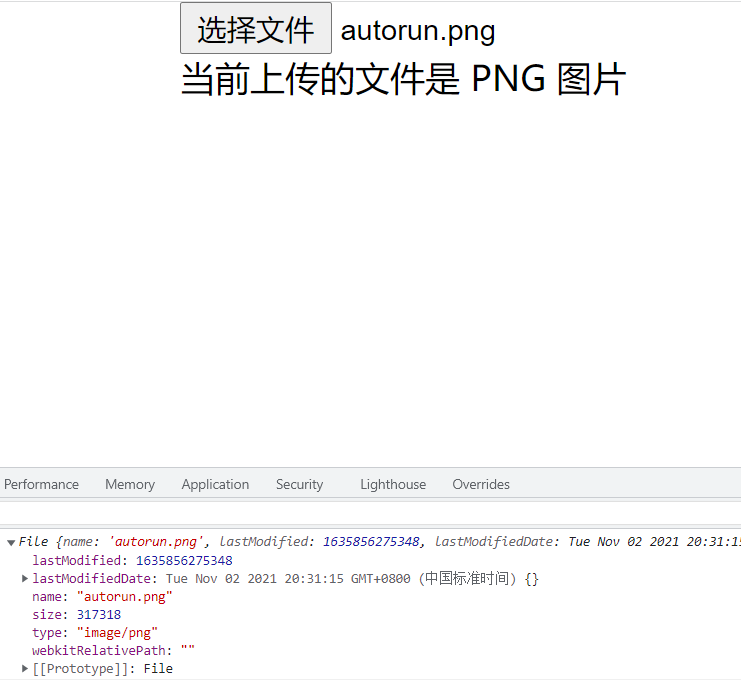

# 原生 JavaScript 判断文件类型

## 1. 参考资料

1. [JavaScript 如何检测文件的类型？](https://juejin.cn/post/6971935704938971173)

2. [MDN - FileReader](https://developer.mozilla.org/en-US/docs/Web/API/FileReader)

3. [MDN - readAsArrayBuffer](https://developer.mozilla.org/zh-CN/docs/Web/API/FileReader/readAsArrayBuffer)

4. [MDN - Blob](https://developer.mozilla.org/en-US/docs/Web/API/Blob)

## 2. 基本的限制文件类型

1. 上传文件是一个常见需求，通常情况下，使用 type 为 file 类型的 input 元素实现：
   ```html
      <input type="file" />
   ```
   
2. 如果我们希望限制文件类型，那么可以使用 accept 属性，指定上传的文件类型，例如，我们只希望上传 png 格式的图片，那么 accept 属性可以这样写：`image/png`，如下所示：
   ```html
      <input type="file" accept="image/png"/>
   ```
3. 这种方案可以满足大多数场景，但如果用户把 `jpg` 格式的图片后缀名更改为 `.png` 的话，就可以成功突破这个限制。也就是说浏览器是通过检测文件的后缀来确定文件类型的。

4. 那么应该如何解决这个问题呢？其实我们可以通过读取文件的二进制数据来识别正确的文件类型。

## 3. 计算机识别图片的方式

1. 计算机并不是通过图片的后缀名来区分不同的图片类型，而是通过 “幻数”（Magic Number）来区分。对于指定类型的文件，起始的几个字节内容都是固定的，计算机根据这几个字节的内容就可以判断文件的类型。

2. 常见文件幻数：
   
   文件类型|文件后缀|幻数
   :---:|:---:|:---:
   JPEG|jpg|0xFF D8 FF
   PNG|png|0x89 50 4E 47
   GIF|gif|0x47 49 46 38
   TIFF|tif|0x49 49 2A 00
   Windows Bitmap|bmp|0x42 4D
   Adobe Photoshop|psd|0x38 42 50 53
   Rich Text Format|rtf|0x7B 5C 72 74 66
   MS Word/Excel|xls.or.doc|0xD0 CF 11 E0
   Adobe Acrobat|pdf|0x25 50 44 46 2D 31 2E

3. 在 windows 平台，我们可以使用 WinHex 这个软件来查看一个文件的二进制数据。Mac OS 下，使用 Synalyze It! Pro 这个软件进行查看。

4. 使用 WinHex 查看下面这张 png 图片的幻数：
   - 图片：  
     
   - 二进制数据：
     

5. png 图片的前四个字节是（十六进制） 89 50 4E 47。我们及时将文件的后缀修改为 jpeg 后，再用编辑器打开查看图片的二进制内容，文件的前 8 个字节还是保持不变。 但是此时使用 input 元素上传文件，文件的信息如下所示：
  
   显然，文件的 MIME 已经变成了 `image/jpeg`。通过文件后缀名或文件的 MIME 类型 并不能识别出正确的文件类型。

## 4. 检测图片类型


1. 使用 input 元素能够获得一个表示上传文件的 File 对象，我们需要使用 FileReader 接口提供的 Api 将 File 对象转换为 ArrayBuffer 实例。

### 1. 定义一个 File 对象转换为 ArrayBuffer 实例方法

1. FileReader 是一个能够异步读取用户电脑文件的接口，FileReader 不能直接通过指定路径的方式来读取文件，而是读取 File 对象指定的文件或者 Blob 对象指定的数据。

2. FileReader 对象提供一个 readAsArrayBuffer 方法，这个方法接收一个 File 对象或者 Blob 对象。用来读取 File 对象或者 Blob 对象指定的二进制数据。当读取操作结束时，FileReader 对象的 readyState 变成 DONE，然后触发 loadend 事件
然后 FileReader 对象的 result 属性就是一个 ArrayBuffer 对象，这个 ArrayBuffer 对象表示文件的数据（二进制）。

3. 使用 Promise 加 FileReader 定义一个 readBuffer 方法，该方法将File 对象转换为 ArrayBuffer 实例：
   ```js
      const readBuffer = (file, start = 0, end = 2) => {

        return new Promise((resolve, reject) => {

            // FileReader 是一个能够异步读取用户电脑文件的接口
            // FileReader 不能直接通过指定路径的方式来读取文件，而是读取 File 对象指定的文件或者 Blob 对象指定的数据
            const fileReader = new FileReader();
            // file 是 Blob 对象的实例，readAsArrayBuffer 方法可以将 Blob 对象转换为 ArrayBuffer
            // 这里使用 Blob 对象的 slice 方法对 file 实例指定的二进制数据进行切分
            // File 继承自 Blob，并对 Blob 进行了扩展，因此 File 是一个特殊类型的 Blob
            // Blob 表示一个不可变的类似文件对象的原始二进制数据，其本身不可变，但是我们可以使用 slice 方法，从原始的 Blob 对象中切分出一部分数据进行操作
            // 因为我们这里是判断文件类型，所以只需要拿到文件（Blob 对象）的前几个字节即可
            // 即将 Blob 对象的前几个字节的数据转换为 ArrayBuffer
            fileReader.readAsArrayBuffer(file.slice(start, end));

            // 当读取操作结束触发 loadend 事件，onloadend 是事件处理函数
            fileReader.onloadend = () => {
                // fileReader 中的 result 属性就是真正的文件内容，形式是 ArrayBuffer （原始的二进制形式）
                resolve(fileReader.result);

            }

            fileReader.onerror = () => {
                reject(fileReader.error);
            }

        });


      }
   ```
   因为我们只需要文件的前几个字节就能确定文件类型，所以使用使用 File 对象的 slice 方法，对文件内容进行切分获得指定范围内的字节。切分的起止位置由函数参数：`start` 和 `end` 指定。

### 2. 定义 check 函数

1. 通过 readBuffer 函数，我们已经获得了上传文件的前几个字节，那么接下来就是逐个字节逐个字节的与指定类型文件的幻数进行比较，这样就能判断文件类型。

2. 为了实现逐个字节的比较，并能实现函数复用。这里定义一个 check 函数，用于判断文件类型：
   ```js
      const check = (headers) => {
        return (buffer, options = {offset: 0}) => {
            return headers.every((num, index) => {
                return num === buffer[options.offset + index];
            })
        }
      }
   ```
   这里使用了闭包的方式，headers 是幻数数组，真正比较字节的地方在闭包内部，这样我们通过传入不同的幻数数组，就可以得到判断不同文件类型的函数，实现了 check 函数的复用。

### 3. 定义检测 PNG 图片的函数

1. PNG 图片的幻数是：0x89 50 4E 47，我们只需要将这个幻数数组传入 check 函数即可：
   ```js
      const isPNG = check([0x89, 0x50, 0x4E, 0x47]);
   ```

## 5. 检测 PNG 图片类型

1. 基于前面定义的 readBuffer 函数和 isPNG 函数，我们就可以实现检测 PNG 图片的功能。

2. html 结构：
   ```html
      <input type="file" class="my-upload" >
    <p class="my-text"></p>
   ```
3. js 代码：
   ```js 
      const inputElement = document.querySelector('.my-upload');
      const typeText = document.querySelector('.my-text');
      const readBuffer = (file, start = 0, end = 2) => {

        return new Promise<ArrayBuffer>((resolve, reject) => {
            const fileReader = new FileReader();
            
            fileReader.readAsArrayBuffer(file.slice(start, end));

            // 当读取操作结束触发 loadend 事件，onloadend 是事件处理函数
            fileReader.onloadend = () => {
                // fileReader 中的 result 属性就是真正的文件内容，形式是 ArrayBuffer （原始的二进制形式）
                resolve(fileReader.result);

            }

            fileReader.onerror = () => {
                reject(fileReader.error);
            }

        });


    }

    const check = (headers) => {
        return (buffer, options = {offset: 0}) => {
            return headers.every((num, index) => {
                return num === buffer[options.offset + index];
            })
        }
    }

    const isPNG = check([0x89, 0x50, 0x4E, 0x47]);

    const handleChange = async (e) => {
        const input = e.target;
        const files = input.files;
        if (!files) {
            return;
        }
        
        const file = files[0];
        console.log(file);
        const originBuffer = await readBuffer(file, 0, 4);

        const uint8Array = new Uint8Array(originBuffer);

        const isPng = isPNG(uint8Array);

        if (isPng) {
            typeText.innerHTML = '当前上传的文件是 PNG 图片';
        } else {
            typeText.innerHTML = '当前上传的文件不是 PNG 图片，不能上传！';
        }
      }
      inputElement.addEventListener('change', handleChange);
   ```
4. 上传一个 PNG 类型的图片：  
   

5. 上传一个后缀是 jpg 但实际上是 png 格式的图片：
   

6. 由上图可知，我们已经能够正确地检测出的图片格式。如果你要检测 JPEG 文件格式的话，你只需要定义一个 isJPEG 函数：
   ```js
      const isJPEG = check([0xff, 0xd8, 0xff])
   ```
   