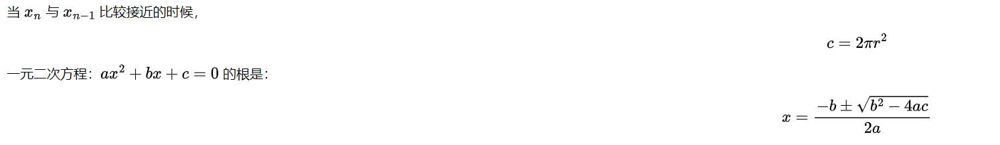
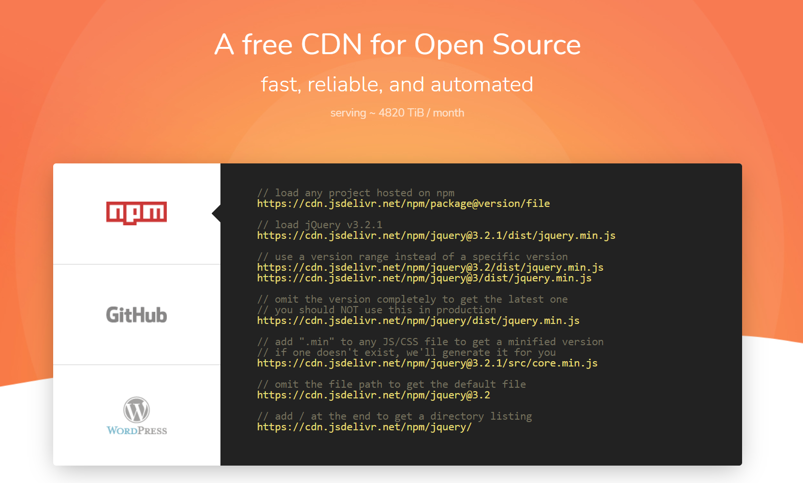

# 在 html 与 markdown 文档中引入数学公式

## 1. 参考资料

1. [MathJax 官网](https://www.mathjax.org/#gettingstarted)
2. [MathJax 官网 - 文档](http://docs.mathjax.org/en/latest/)
3. [jsdelivr - CDN 加速](https://www.jsdelivr.com/)
4. [超详细 LaTex数学公式](https://blog.csdn.net/ViatorSun/article/details/82826664)
5. [LaTeX 数学公式基本语法](https://szukevin.site/2019/12/24/LaTeX-%E6%95%B0%E5%AD%A6%E5%85%AC%E5%BC%8F%E5%9F%BA%E6%9C%AC%E8%AF%AD%E6%B3%95/)
6. [Markdown 中 LaTex 数学公式命令](https://juejin.cn/post/6844903733248131080)
7. [latex语法教程](https://zhuanlan.zhihu.com/p/133291238)
8. [Latex数学公式编写](https://www.cnblogs.com/endlesscoding/p/9797237.html)
9. [LaTeX 文档 - 官方](http://www.ctex.org/OnlineDocuments/)
10. [LATEX数学公式基本语法](https://www.cnblogs.com/houkai/p/3399646.html)
11. [Tex语法笔记—数学公式](https://zhuanlan.zhihu.com/p/60955986)
13. [LaTeX公式编辑器](https://latexlive.com)
13. [Cmd Markdown 公式指导手册](https://www.zybuluo.com/codeep/note/163962)
14. [MathJax.js是做什么的](https://www.cnblogs.com/guohu/p/13908602.html)
15. [好用的jsDelivr](https://www.cnblogs.com/murenziwei/p/12747311.html)

## 2. 在 html 中引入数学公式

### 1. 图片

1. 公式较少的时候可以使用图片来表示，缺点就是修改公式的时候得重新替换图片；无法实时预览；当公式较多的时候，一张一张的插入图片比较麻烦。

### 2. 使用 TeX 书写数学公式（推荐）

1. 下面的内容引用自 [CTEX](http://www.ctex.org/TeX)，是对 TeX 的介绍：
   > TeX 提供了一套功能强大并且十分灵活的排版语言，它多达 900 多条指令，并且 TeX 有宏功能，用户可以不断地定义自己适用的新命令来扩展 TeX 系统的功能。许多人利用 TeX 提供的宏定义功能对 TeX 进行了二次开发，其中比较著名的有美国数学学会推荐的非常适合于数学家使用的 AMSTeX AMS-TeX 以及适合于一般文章、报告、书籍的 LaTeX 系统。

   > TeX 系统是公认的数学公式排得最好的系统。美国数学学会（AMS） 鼓励数学家们使用 TeX 系统向它的期刊投稿。世界上许多一流的出版社如 Kluwer、Addison-Wesley、牛津大学出版社等也利用 TeX 系统出版书籍和期刊。

   > 大部分的 TeX 系统都是免费的。Knuth 教授还公开了他的全部源程序。TeX 系统目前已经在数百种计算机系统上得到实现。TeX 系统的排版结果 DVI（DeVice Independent）文件与输出设备无关。DVI 文件可以显示、打印、照排，几乎可以在所有的输出设备上输出。TeX 排版源文件及结果在各种计算机系统上互相兼容。

2. 在 html 中使用 Tex 排版语言书写数学公式，有两种方式：
   1. 借助谷歌 Chart 服务器
   2. 使用 MathJax 引擎

3. 使用谷歌 Chart 服务器
   1. 谷歌 Chart 服务器提供一个 api，可以将我们书写的 TeX 公式转化成功图片。api url 如下：
      `http://chart.googleapis.com/chart?cht=tx&chl=formula`
   2. 将 `formula` 替换成自己的公式，如下所示：
      `http://chart.googleapis.com/chart?cht=tx&chl=x = \frac{-b\pm\sqrt{b^2 - 4ac}}{2a}`
   3. 将带有公式的 url 作为 img 的 src，即可引入：
      ``

4. 使用 MathJax 引擎 （推荐）
   1. MathJax 引擎使用 JavaScript 来渲染数学公式，支持所有的浏览器。官网是：[MathJax](https://www.mathjax.org/#gettingstarted)
   2. MathJax 提供了多种使用方式：
      1. 通过 CDN 方式，使用 script 标签引入到自己的页面中，适用于浏览器环境。
      2. 通过 npm 安装到本地，以模块的方式引入到自己的工程中，适用于服务端或者需要将 MathJax 集成到自己的工作流中。
   3. 推荐使用第一种方式。
   4. 在 `head` 标签中添加 `script` 标签，src 属性设置为 MathJax 在 jsdelivr 上的地址：
      `<srcipt defer src="https://cdn.jsdelivr.net/npm/mathjax@3/es5/tex-mml-svg.js"></script>`
   5. 引入了 MathJax 以后，就能在自己的文档中使用 TeX 语法书写数学公式了：
      ```html
         <!DOCTYPE html>
             <html lang="en">
                 <head>
                 <!--    <script src="https://cdn.bootcdn.net/ajax/libs/mathjax/3.2.0/es5/tex-mml-chtml.js"></script>-->
                 <!--    <script id="MathJax-script" src="https://cdn.jsdelivr.net/npm/mathjax@3/es5/tex-mml-chtml.js"></script>-->
                 <!--    <script id="MathJax-script" src="https://cdn.jsdelivr.net/npm/mathjax@3/es5/tex-svg.js"></script>-->
                     <script id="MathJax-script" src="https://cdn.jsdelivr.net/npm/mathjax@3/es5/tex-mml-svg.js"></script>
                     <meta charset="UTF-8">
                     <title>练习</title>
                 </head>
                 <body>
                     <div class="test-wrapper">
                         <p>当 \(x_n\) 与 \(x_{n-1}\) 比较接近的时候，</p>
                         <p>\[c = 2{\pi}r^2\]</p>
                         <p>一元二次方程：\(ax^2 + bx + c = 0\) 的根是：</p>
                         <p>\[x = \frac{-b\pm\sqrt{b^2 - 4ac}}{2a}\]</p>
                     </div>
                 </body>
            </html>
      ```
      效果如下所示：
      
   6. MathJax 提供了多种输入/输出的组件，如 `tex-mml-svg` 就是将 tex/mml 输入渲染为 svg 并输出。`tex-mml-chtml` 就是将 tex/mml 输入渲染为 chtml 并输出。
      - mml 指的是 `MathML`， `MathML` 是数学标记语言，是一种基于 XML（标准通用标记语言的子集）的标准，用来在互联网上书写数学符号和公式的置标语言。
      - chtml 指的是  `CommonHTML` 处理器，使用 html 和 css 渲染数学公式。
   7. 注意：MathJax 使用 `\( ... \)`（行内公式）、`\[ ... \]`（独立公式）来包裹 TeX 公式。不使用常见的 `$` 进行包裹。

## 3. 在 markdown 中引入数学公式

### 1. 原生支持 TeX 语法

1. 一些 markdown 渲染引擎原生支持 TeX 语法，使用 `$ ... $` 或者 `$$ ... $$` 包裹 Tex 数学公式即可。如：`$x^n$`、`$x_1$`，在预览中就能看到最终的数学公式。

2. Visual Studio Code 的插件 Markdown Preview Enhanced 内置了 KaTeX 和 MathJax 这两个渲染引擎。KaTeX 更加轻量，渲染速度更快，但是对于公式和符号的支持没有 MathJax 好。可以使用 `$ ... $` 或者 `\( ... \)`（行内公式）； `$$ ... $$` 或者 `\[ ... \]`（独立公式）来包裹公式。


## 4. jsDelivr 的用法

1. jsDelivr 是一个 CDN，主要用来给 github、npm 和 wordpress 上的资源提供加速服务。

2. 通俗的说，就是直接访问 github、npm 和 wordpress 上的资源很慢，那么我们就可以使用 jsDelivr 来获得响应的资源。

3. jsDelivr 官网：https://www.jsdelivr.com/，

4. 官网首页：
   
   提供了 github 、npm 和 wordpress 引入资源的示例。

5. 使用方式 - github
   - 通用格式：  
   `https://cdn.jsdelivr.net/gh/用户名称/仓库名称@版本号/目录`
   - 加载资源(版本号不填的话，默认引用最新)：  
   `https://cdn.jsdelivr.net/gh/murenziwei/images/draw/01.png`
   -  打开目录（后面的 `/` 是必要的，不然的话，打不开）：  
   `https://cdn.jsdelivr.net/gh/murenziwei/images/`
   - 加载 jQuery v3.2.1：  
   `https://cdn.jsdelivr.net/gh/jquery/jquery@3.2.1/dist/jquery.min.js`
   - 不指定精确的版本：  
     `https://cdn.jsdelivr.net/gh/jquery/jquery@3.2/dist/jquery.min.js`  
   `https://cdn.jsdelivr.net/gh/jquery/jquery@3/dist/jquery.min.js`
   - 忽略版本信息，得到最新版（不要再生产环境中使用）：
   `https://cdn.jsdelivr.net/gh/jquery/jquery/dist/jquery.min.js`
   - 后缀添加 `.min` 获得压缩过的 js、css 版本，如果不存在，jsDelivr 会提供一个：  
   `https://cdn.jsdelivr.net/gh/jquery/jquery@3.2.1/src/core.min.js`
   - 末尾添加 `/` 来获得目录：  '
   `https://cdn.jsdelivr.net/gh/jquery/jquery/`

4. 使用方式 - npm (推荐)
   - 通用格式：  
     `https://cdn.jsdelivr.net/npm/包名@版本号/目录`
   - 加载资源(版本号不填的话，默认引用最新)：  
     `https://cdn.jsdelivr.net/npm/lw_firewords@1.0.3/index.js`
   - 打开目录（后面的 `/` 是必要的，不然的话，打不开）：  
     `https://cdn.jsdelivr.net/npm/lw_firewords/`
   - 加载 jQuery v3.2.1：  
     `https://cdn.jsdelivr.net/npm/jquery@3.2.1/dist/jquery.min.js`
   - 不指定精确的版本：  
     `https://cdn.jsdelivr.net/npm/jquery@3.2/dist/jquery.min.js`  
     `https://cdn.jsdelivr.net/npm/jquery@3/dist/jquery.min.js`
   - 忽略版本信息，得到最新版（不要再生产环境中使用）：
     `https://cdn.jsdelivr.net/npm/jquery/dist/jquery.min.js`
   - 后缀添加 `.min` 获得压缩过的 js、css 版本，如果不存在，jsDelivr 会提供一个：  
     `https://cdn.jsdelivr.net/npm/jquery@3.2.1/src/core.min.js`
   - 末尾添加 `/` 来获得目录：  
     `https://cdn.jsdelivr.net/npm/jquery/`
   - 忽略文件路径得到默认文件：  
     `https://cdn.jsdelivr.net/npm/jquery@3.2`

7. 使用方式 - WordPress
   - load any plugin from the WordPress.org plugins SVN repo
     `https://cdn.jsdelivr.net/wp/plugins/project/tags/version/file`
   - load an exact version
     `https://cdn.jsdelivr.net/wp/plugins/wp-slimstat/tags/4.6.5/wp-slimstat.js`
   - load the latest version, you should NOT use this in production
     `https://cdn.jsdelivr.net/wp/plugins/wp-slimstat/trunk/wp-slimstat.js`
   - load any theme from the WordPress.org themes SVN repo
     `https://cdn.jsdelivr.net/wp/themes/project/version/file`
   - load an exact version
     `https://cdn.jsdelivr.net/wp/themes/twenty-eightteen/1.7/assets/js/html5.js`

