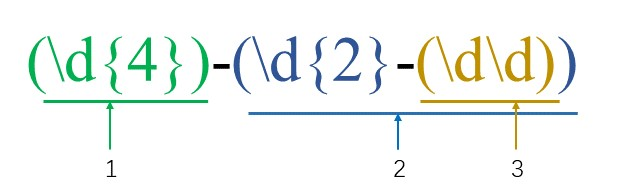

<!-- START doctoc generated TOC please keep comment here to allow auto update -->
<!-- DON'T EDIT THIS SECTION, INSTEAD RE-RUN doctoc TO UPDATE -->
**Table of Contents**  *generated with [DocToc](https://github.com/thlorenz/doctoc)*

- [JavaScript 中的正则](#javascript-%E4%B8%AD%E7%9A%84%E6%AD%A3%E5%88%99)
  - [1. 参考资料](#1-%E5%8F%82%E8%80%83%E8%B5%84%E6%96%99)
  - [2. 创建正则表达式](#2-%E5%88%9B%E5%BB%BA%E6%AD%A3%E5%88%99%E8%A1%A8%E8%BE%BE%E5%BC%8F)
  - [3. 正则表达式中的特殊字符（元字符）- 边界符](#3-%E6%AD%A3%E5%88%99%E8%A1%A8%E8%BE%BE%E5%BC%8F%E4%B8%AD%E7%9A%84%E7%89%B9%E6%AE%8A%E5%AD%97%E7%AC%A6%E5%85%83%E5%AD%97%E7%AC%A6--%E8%BE%B9%E7%95%8C%E7%AC%A6)
  - [4. 字符类](#4-%E5%AD%97%E7%AC%A6%E7%B1%BB)
  - [5. 量词符](#5-%E9%87%8F%E8%AF%8D%E7%AC%A6)
  - [6. 括号总结](#6-%E6%8B%AC%E5%8F%B7%E6%80%BB%E7%BB%93)
  - [7. 预定义类](#7-%E9%A2%84%E5%AE%9A%E4%B9%89%E7%B1%BB)
  - [8. 正则表达式中的替换](#8-%E6%AD%A3%E5%88%99%E8%A1%A8%E8%BE%BE%E5%BC%8F%E4%B8%AD%E7%9A%84%E6%9B%BF%E6%8D%A2)
  - [9. 正则表达式标志位](#9-%E6%AD%A3%E5%88%99%E8%A1%A8%E8%BE%BE%E5%BC%8F%E6%A0%87%E5%BF%97%E4%BD%8D)
  - [10. 特殊符号和字符（元字符）总结](#10-%E7%89%B9%E6%AE%8A%E7%AC%A6%E5%8F%B7%E5%92%8C%E5%AD%97%E7%AC%A6%E5%85%83%E5%AD%97%E7%AC%A6%E6%80%BB%E7%BB%93)
  - [11. 惰性匹配](#11-%E6%83%B0%E6%80%A7%E5%8C%B9%E9%85%8D)
  - [12. 反向引用 —— `\number`](#12-%E5%8F%8D%E5%90%91%E5%BC%95%E7%94%A8--%5Cnumber)
  - [13. 非捕获分组 —— `(?:pattern)`](#13-%E9%9D%9E%E6%8D%95%E8%8E%B7%E5%88%86%E7%BB%84--pattern)
  - [14. 正则表达式的高级内容——断言](#14-%E6%AD%A3%E5%88%99%E8%A1%A8%E8%BE%BE%E5%BC%8F%E7%9A%84%E9%AB%98%E7%BA%A7%E5%86%85%E5%AE%B9%E6%96%AD%E8%A8%80)
  - [15. JavaScript对正则的支持 —— RegExp](#15-javascript%E5%AF%B9%E6%AD%A3%E5%88%99%E7%9A%84%E6%94%AF%E6%8C%81--regexp)
  - [16. JavaScript对正则的支持 —— String](#16-javascript%E5%AF%B9%E6%AD%A3%E5%88%99%E7%9A%84%E6%94%AF%E6%8C%81--string)

<!-- END doctoc generated TOC please keep comment here to allow auto update -->

# JavaScript 中的正则

## 1. 参考资料

1. [JS正则表达式语法大全（非常详细）](http://c.biancheng.net/view/5632.html)

2. [正则表达式中零宽断言的用法](https://juejin.cn/post/6844903586732703758)

3. [正则匹配之零宽断言](https://juejin.cn/post/6844903728810557454)

4. [正则位置匹配](https://juejin.cn/post/6844903646346346503)

5. [正则表达式中?=和?:和?!的理解](https://blog.csdn.net/csm0912/article/details/81206848)

6. [正则表达式中的反向引用](https://blog.csdn.net/raoshihong/article/details/17004641)

7. [正则基础之——捕获组（capture group）](https://blog.csdn.net/lxcnn/article/details/4146148)

8. [正则基础之——反向引用](https://www.cnblogs.com/-ShiL/archive/2012/04/06/Star201204061009.html)

## 2. 创建正则表达式

1. 利用 RegExp 对象创建正则表达式
   ```javascript
      var regex = new RegExp(/123/) ;
      console.log(regex) ;
   ```

2. 利用字面量的方式创建正则表达式  
    `var regex = /123/ ;`
    
3. test() 方法用来检查字符串是否符合正则表达式要求  
    `console.log(regex.test('123')) ;`
    
## 3. 正则表达式中的特殊字符（元字符）- 边界符  

1. 正则表达式中的边界符（位置符）用来提示字符所处的位置，主要有两个：

   边界符|说明
   :---:|:---:
   ^|表示匹配首行的文本（以谁开始）
   $|表示匹配行尾的文本（以谁结束）

2. 如果 `^` 和 `$` 在一起，表示必须精确匹配。

## 4. 字符类  

1. 字符类表示一系列的字符可供选择，只要匹配其中一个就可以了。所有可供选择的字符都在方括号（[]）中。例如：` var rg = /[abc]/ ;`  只要包含有 a 或 b 或 c，都被认为是匹配成功。  

2. 中划线（`-`）表示范围。从开始到结束。举例如下：
   ```javascript
      // 匹配从a到z这26个小写的英文字母中的任意一个
      var rg3 = /[a-z]/ ;
       console.log(rg3.test('a')) ;
       console.log(rg3.test('z')) ;
       console.log(rg3.test('e')) ;
       console.log(rg3.test('A')) ;
   ```  
3. 如果在中括号中使用 `^`，表示取反。例如：
   ```javascript
      // /^[^a-zA-Z0-9_-]$/表示精确匹配除了26个英文字母（大小写）、0-9、中划线（-）和下划线（_）以外的单字符
      var reg5 = /^[^a-zA-Z0-9_-]$/ ;
      // false
      console.log(reg5.test('a')) ;
      // false
      console.log(reg5.test('b')) ;
      // false
      console.log(reg5.test('C')) ;
      // false
      console.log(reg5.test('-')) ;
      // false
      console.log(reg5.test('_')) ;
      // true
      console.log(reg5.test('!')) ;
   ```

## 5. 量词符

1. 量词符用来设定某个模式出现的次数。  

   量词|说明
   :---:|:---: 
   *|重复0次或者更多次（>= 0）
   +|重复一次或者更多次（>= 1）
   ?|重复0次或者1次（0或1）
   {n}|重置n次（n）
   {n,}|重复n次或者更多次（>= n）
   {n,m}|重复n到m次（n <= x <= m）

## 6. 括号总结

1. 中括号  
   - 字符合集，匹配方括号中的任意一个字符。这属于单字符匹配。
     ```javascript
        var reg = /^[abc]$/ ;
        console.log(reg.test('a')) ;
        console.log(reg.test('b')) ;
        console.log(reg.test('c')) ;
        // false
        console.log(reg1.test('abc')) ;
     ```
2. 大括号  
   - 量词符，表示匹配模式的重复次数。
      ```javascript
         // 没有中括号包裹 abc，/^abc{2}$/ 表示字母c重复两次，也就是匹配abcc
         var reg = /^abc{2}$/ ;
         // false
         console.log(reg.test('a')) ;
         // false
         console.log(reg.test('abc')) ;
         // true
         console.log(reg.test('abcc')) ;
      ```
3. 小括号  
   - 分组。表示优先级。
     ```javascript
      // 添加了小括号，将小括号内部的匹配模式作为一个整体规则去匹配
      // /^(abc){2}$/表示abc作为整体，重复两次，即匹配abcabc
       var reg = /^(abc){2}$/ ;
       // false
       console.log(reg.test('a')) ;
       // false
       console.log(reg.test('abc')) ;
       // true
       console.log(reg.test('abcabc')) ;
     ```
     
## 7. 预定义类 
 
1. 预定义类指的是某些常见模式的简写方式。

   预定类|说明
   :---:|:---:
   \d|匹配0-9之间的任意数字，相当于[0-9]
   \D|匹配所有0-9以外的字符，相当于[^0-9]
   \b|匹配一个单词的边界
   \B|匹配一个非单词边界
   \w|匹配任意的字母、数字和下划线，相当于[0-9a-zA-Z_]
   \W|除去所有字母、数字和下划线以外的字符，相当于[^0-9a-zA-Z_]
   \s|匹配空格（包括换行符、制表符、空格符等），相当于[\t\r\n\v\f]
   \S|匹配非空格的字符，相当于[^\t\r\n\v\f]
   .|（小数点）默认匹配除换行符之外的任何单个字符

## 8. 正则表达式中的替换

1. replace() 可以实现替换字符串的操作，用来替换的参数可以是字符串或是一个正则表达式。  
   ```javascript
      stringObject.replace(regexp/substr, replacement)
      // 1. 第一个参数：被替换的字符串或者正则表达式
      // 2. 第二个参数：用于替换掉第一个参数在原字符串中的匹配部分的字符串
      // 3. 返回值是一个替换完毕的新字符串
   ```   
2. replace() 第二个参数还可以接收一个函数。可以利用这个函数，实现很多很强大的功能。

## 9. 正则表达式标志位

1. `/表达式/flags`  
   - flags（也被称为修饰符）按照什么样的模式来匹配，有三种值：  
   - `g`: 全局匹配，全局匹配的意思是，匹配字符串中所有符合模式的内容
   - `i`: 忽略大小写
   - `gi`: 全局匹配 + 忽略大小写

## 10. 特殊符号和字符（元字符）总结

1. 符号：

   符号|说明|示例
   :---:|:---:|:---:
   .|匹配任意字符（除了\n之外）|b.b
   reg1&#124;reg2|匹配正则表达式 re1 或者 re2 |foo&#124;bar
   ^|匹配字符串的起始位置|^a
   $|匹配字符串的结束位置|b$
   *|匹配0次或者多次前面出现的正则表达式|a*
   +|匹配1次或者多次前面出现的正则表达式|\d+
   ?|匹配0次或者1次前面出现的正则表达式|\w?
   {n}|匹配n次前面出现的正则表达式 |\w{5}
   {n,}|匹配大于等于n次前面出现的正则表达式|a{10,}
   {n,m}|匹配 n~m 次前面出现的正则表达式 |.{4,7}
   []|匹配来自字符集的任意单一字符|[abcd]
   [...x-y...]|匹配 x ～ y 范围中的任意单一字符|[a-z0-9]
   [^...]|不匹配此字符集中出现的任何一个字符，包括某一范围的字符（如果在此字符集中出现）|[^0-9]
   ()|匹配封闭的正则表达式，然后另存为子组|(.+)\d+
   -|表示范围|[0-9]

2. 特殊字符：

   特殊字符|说明|示例
   :---:|:---:|:---:
   \d|匹配任何十进制数字（0-9），与[0-9]作用相同|\d+
   \D|匹配十进制数字0-9以外的字符，与[^0-9]作用相同|\D?
   \w|匹配任何字母数字和下划线字符，与[A-Za-z0-9_]相同|\w{5}
   \W|除去所有字母、数字和下划线以外的字符，相当于[^0-9a-zA-Z_]|\W\d
   \s|匹配空格（包括换行符、制表符、空格符等）|^\s
   \A|匹配字符串的起始，等同于^（JavaScript不支持）|\A\w
   \Z|匹配字符串的结束，等同于$（JavaScript不支持）|\Z\w

## 11. 惰性匹配

1. 重复类的量词都有贪婪性，在条件允许的情况下，会尽量多匹配字符。
   - `?`、`{n}` 和 `{n,m}` 重复类具有弱贪婪性，表现为贪婪的有限性。
   - `*`、`+` 和 `{n,}` 重复类具有强贪婪性，表现为贪婪的无限性。

2. 越是排在左侧的重复类量词匹配优先级越高。多个重复类量词同时满足条件时，会在保证右侧重复类量词最低匹配次数基础上，使最左侧的重复类量词尽可能占有所有字符。 
强贪婪性的示例：
   ```javascript
      var s = "<html><head><title></title></head><body></body></html>";
      var r = /(<.*>)(<.*>)/
      var a = s.match(r);
      // <html><head><title></title></head><body></body>
      console.log(a[1]);
      // </html>
      console.log(a[2]);
   ```
   - 第一个分组匹配到从第一个到倒数第二个： `<html> ... </body>`，而第二个分组匹配到了最后一个 `</html>`。

3. 与贪婪匹配相反，惰性匹配将遵循另一种算法：在满足条件的前提下，尽可能少的匹配字符。定义惰性匹配的方法：在重复类量词后面添加问号 `?` 限制词。
   ```javascript
      var s = "<html><head><title></title></head><body></body></html>";
      // 贪婪匹配
      // var r = /(<.*>)(<.*>)/;
      // 惰性匹配
      var r = /<.*?>/;
      var a = s.match(r);
      // <html>
      console.log(a[0]);
   ```
   - 对于正则表达式 `/<.*?>/` 来说，它可以返回匹配字符串 `<>`，但是为了能够确保匹配条件成立，在执行中还是匹配了带有 4 个字符的字符串 `html`。惰性取值不能够以违反模式限定的条件而返回，除非没有找到符合条件的字符串，否则必须满足它。
4. 贪婪匹配体现了最大化匹配原则，惰性匹配则体现最小化匹配原则。

5. 针对 6 种重复类惰性匹配的简单描述如下表所示：
   匹配表达式|说明
   |:---:|:---:|
   `{n,m}?`|尽量匹配 n 次，但是为了满足限定条件也可能最多重复 m 次。
   `{n}?`|尽量匹配 n 次。
   `{n,}?`|尽量匹配 n 次，但是为了满足限定条件也可能匹配任意次。
   `??`|尽量匹配，但是为了满足限定条件也可能最多匹配 1 次，相当于 `{0,1}?`。
   `+?`|尽量匹配 1 次，但是为了满足限定条件也可能匹配任意次，相当于 `{1,}?`。
   `*?`|尽量不匹配，但是为了满足限定条件也可能匹配任意次，相当于 `{0,}?`。


## 12. 反向引用 —— `\number`

1. 反向引用指的是引用捕获组捕获的内容。


2. 捕获组指的是正则表达式中子表达式匹配的内容，保存到内存中以数字编号或者显示命名的组中。

3. 反向引用的作用通常是用来查找或限定重复、查找或限定指定标识配对出现等等。

4. 语法：
   - 普通捕获组的反向引用：`\k<number>`，通常简写为：`\number`
   - 命名捕获组的反向引用：`\k<name>`，简写为：`\k'name'`

5. JavaScript 支持第一种反向引用写法。其中 number 是十进制数字。

6. 普通捕获组的命名规则：捕获组的编号是按照 `(` 出现的顺序，从左到右，从 1 开始进行编号的。例如：正则表达式为 `(\d{4})-(\d{2}-(\d\d))`，分组如下图所示：
   

6. 捕获组（Expression）在匹配成功时，会将子表达式匹配到的内容，保存到内存中一个以数字编号的组里，可以简单的认为是对一个局部变量进行了赋值，这时就可以通过反向引用方式，引用这个局部变量的值。一个捕获组（Expression）在匹配成功之前，它的内容可以是不确定的，一旦匹配成功，它的内容就确定了，反向引用的内容也就是确定的了。

7. 反向引用引用的是子表达式匹配到的内容，而不是子表达式。

8. 实例
   ```js
      const pattern = /([ab])\1/g;
      // ['bb']
      'abcdebbcde'.match(pattern);
   ```
   - 对于正则表达式 `/([ab])\1/g`，`[ab]` 表示既可以匹配 a，又可以匹配 b。但是一旦捕获组捕获的内容确定，那么反向引用的内容就确定了。比如说，捕获组匹配到的内容是 a，那么反向引用的内容只能是 a，如果捕获组匹配到的内容是 b，则反向引用的内容只能是 b。所以，上述正则表达式匹配的内容只能是 aa 或者 bb。
   - 分析一下匹配过程：字符串的第 0 个位置是 a，被捕获组`([ab])`捕获，将匹配到的内容保存在编号为 1 的分组中，然后将控制权交给 `\1`，由于捕获组匹配的内容已经确定，那么反向引用 `\1` 引用的内容只能是 a，所以 `\1` 只能匹配 a 才能匹配成功，这里串显然不满足。`\1` 匹配失败。由于没有可供回溯的状态，整个表达式在位置 0 这里匹配失败。
   - 继续向后匹配，在位置 5 之前，一直匹配失败。在位置 5 那里，`([ab])` 匹配到 b，匹配成功，并将 b 存储在编号为 1 的分组中。然后将控制权交给 `\1`，由于捕获组匹配的内容已经确定，那么反向引用 `\1` 引用的内容只能是 b，所以 `\1` 只能匹配 b 才能匹配成功，显然满足条件，整个表达式匹配成功。匹配结果为 bb。

## 13. 非捕获分组 —— `(?:pattern)`

1. 捕获组指的是正则表达式中子表达式匹配的内容，保存到内存中以数字编号或者显示命名的组中。

2. 使用 `()` 来表示一个子表达式。示例如下：
   ```js
      const pattern = /(Jane|John|Alison)\s(.*?)\s(Smith|Smuth)/;
      const ret = pattern.exec('Jane Isabell Smith');
      // Jane Isabell Smith
      console.log(ret[0]);
      // Jane
      console.log(ret[1]);
      // Isabell
      console.log(ret[2]);
      // Smith
      console.log(ret[3]);
   ```
3. 上面的例子中，我们匹配了常见的外国姓名，其中第一个分组匹配的是名，第二个分组匹配的是中间名，第三个分组匹配的是姓。

4. 通过上面的例子，可以看出，正则表达式具有多个分组的情况下，匹配结果会输出所有分组的匹配内容。

5. 如果我只想输出中间名这个分组，不需要输出其他分组，那么此时就可以使用非捕获分组。

6. 非捕获分组表示只匹配，不保存。即正常匹配字符串，但是不会将匹配结果保存的分组中。

7. 启用非捕获分组的语法是：`(?:pattern)`，结合上面的例子，我们可以这样做：
   ```js
       const pattern = /(?:Jane|John|Alison)\s(.*?)\s(?:Smith|Smuth)/;
       const ret = pattern.exec('Jane Isabell Smith');
      // Jane Isabell Smith
      console.log(ret[0]);
      // Isabell
      console.log(ret[1]);
   ```
   只把匹配中间名的分组保存了。

## 14. 正则表达式的高级内容——断言

1. 几个概念：
   - 零宽：只匹配位置，在匹配过程中，不占用字符，所以被称为零宽。
   - 先行：正则引擎在扫描字符的时候，从左往右扫描，匹配扫描指针未扫描过的字符，先于指针，故称先行。
   - 后行：匹配指针已扫描过的字符，后于指针到达该字符，故称后行，即产生回溯。
   - 正向：即匹配括号中的表达式。
   - 负向：不匹配括号中的表达式。
2. ES5 支持先行断言，ES2018 开始支持后行断言。

3. 零宽正向先行断言 —— `(?=pattern)`
   - 又称正向向前查找（positive lookhead）
   - `(?=pattern)` 表示某个位置后面紧接着的字符要匹配 pattern。
   - 示例：
     ```javascript
        // sin 后面的内容匹配 pattern，所以能够得到匹配结果
        var ret = 'sinM.'.match(/sin(?=M\.)/);
        // // sin 后面的内容不匹配 pattern，所以没有匹配结果
        var ret2 = 'M.sin'.match(/sin(?=M\.)/);
        // 匹配以 ing 结尾的单词
        var ret3 = 'singing work'.match(/.+(?=ing)/);
        // sin
        console.log(ret[0]);
        // ''
        console.log(ret2);
        // sing
        console.log(ret3[0]);
     ```
4. 零宽负向先行断言 —— `(?!pattern)`
   - 又称负向向前查找（negative lookhead）
   - `(?!pattern)` 某位置后面紧接着的字符序列不能匹配 pattern。
   - 示例：
     ```javascript
        // sin 后面的内容匹配 pattern，所以整体不匹配
        var ret = 'sinM.'.match(/sin(?!M\.)/);
        // sin 后面的内容不匹配 pattern，所以整体匹配
        var ret2 = 'M.sin'.match(/sin(?!M\.)/);
        var ret3 = 'singing work'.match(/\s(.+)(?!ing)/);
        // null
        console.log(ret);
        // sin
        console.log(ret2[0]);
        // work
        console.log(ret3[1]);
     ```
5. 零宽正向后行断言 —— `(?<=pattern)`
   - 又称正向向后查找（positive lookbehind）
   - `(?<=pattern)` 某位置前面紧接着的字符序列要匹配 pattern。
   - 示例：
     ```javascript
        // sin 前面的字符序列不匹配 pattern，所以整体不匹配
        var ret = 'sinM.'.match(/(?<=M\.)sin/);
        // sin 前面的字符序列匹配 pattern，所以整体匹配
        var ret2 = 'M.sin'.match(/(?<=M\.)sin/);
        var ret3 = 'singing work'.match(/(?<=\s).+/);
        // null
        console.log(ret);
        // sin
        console.log(ret2[0]);
        // work
        console.log(ret3[0]);
     ```
6. 零宽负向后行断言 —— `(?<!pattern)`
   - 又称负向向后查找（negative lookbehind）
   - `(?<!pattern)` 某位置前面紧接着的字符序列不能匹配 pattern。
   - 示例：
     ```javascript
        // sin 前面的字符序列不匹配 pattern，所以整体匹配
        var ret = 'sinM.'.match(/(?<!M\.)sin/);
        // sin 前面的字符序列匹配 pattern，所以整体不匹配
        var ret2 = 'M.sin'.match(/(?<!M\.)sin/);
        // sin
        console.log(ret[0]);
        // null
        console.log(ret2);        
     ```
7. 更多示例：
   1. 把 `4+6*sqrt(5)*Math.sqrt(5)` 转换成可以通过 `eval()` 或者 `new Function()` 获得实际结果的字符串。
      - 这个可以使用负向后行断言，即匹配出前面不是 `Math.` 的 `sqrt`。
      - 示例：
        ```javascript
           let s1 = `4+6*sqrt(5)*Math.sqrt(5)`;
           const r1 = s1.replace(/(?<!Math\.)sqrt/, (match) => {
               return `Math.${match}`;
           });
           // 34
           console.log(eval(r1));
        ```
   2. 匹配 url 后面的路径，示例 url 为：`https://www.google.com/v3/api/getUser?user=panghu`
      - 路径是：`/v3/api/getUser?user=panghu`
      - 这个路径前面是 `.com`，可以使用正向后行断言，因为顶级域名可以是 `.com`、`.cn`、`.org`，等等，所以我们这里不能直接使用 `.com`。
      - 示例：
        ```javascript
           let s2 = 'https://www.google.com/v3/api/getUser?user=panghu';

           // 这里使用了两个断言
           // 正向后行断言的 pattern 是 \.\w+(?=\/)
           // 以 . 开头，后面跟着字母或数字，字母或者数字后面是/

           let r2 = s2.match(/(?<=\.\w+(?=\/)).+/);
           // /v3/api/getUser?user=panghu
           console.log(r2[0]);
        ```
8. > Like the `^` and `$` in regex, a lookahead will match a position in  the string (that is a position in between two characters versus an actual substring). This means `/(?=daddy)/` will match the position between "abc" and "daddy" in the string "abcdaddy". If it helps, a legal operation on string could be `"abcdaddy".replace(/(?=daddy)/,"mommy")`. which would produce the string `"abcmommydaddy"`. It's not as intuitive as replacing a non-zero-length match but it's very useful to know that regex can make matches of length 0 that are merely a position between characters (or between a character the beginning or end of the string for that matter).Another good example to understand this is something like this:
`"helloMyNameIsSlimShady".split(/(?=[A-Z])/g)`
would give you an array of:
`["hello", "My", "Name", "Is", "Slim", "Shady"]`
as it splits the string at each match which in this case is the position right before a capital letter.

9. 上面那段话的意思是，前向断言，就类似于正则表达式中的 `^` 和 `$`，用来匹配字符串中的位置。例如：`/(?=daddy)/`将会匹配 `abcdaddy` 中的 `abc` 和 `daddy` 之间的位置。所以，`"abcdaddy".replace(/(?=daddy)/,"mommy")` 的结果应该是：`"abcmommydaddy"`。虽然不如非零宽度匹配那样直观，但是对于零宽度匹配，还是非常又用。即可以匹配到两个字符之间的位置（宽度为 0）。另外一个示例：`"helloMyNameIsSlimShady".split(/(?=[A-Z])/g)`，匹配的位置是大写字母之前的位置，由于是零宽度匹配，所以不会匹配到具体的字符。因此，结果就是：`["hello", "My", "Name", "Is", "Slim", "Shady"]`。

## 15. JavaScript对正则的支持 —— RegExp

1. RegExp.prototype.exec()   
   - 这个函数是 RegExp 对象的原型上的方法。我们可以通过声明一个正则表达式，来调用 exec() 函数。   
   - 语法：   
     `regexObj.exec(str) `   
     - str  
       要匹配正则表达式的字符串  
     - 返回值  
       如果匹配成功，exec() 方法返回一个数组，并更新正则表达式对象的属性。返回的数组将完全匹配成功的文本作为第一项，将正则括号里匹配成功的作为数组填充到后面。  
       如果匹配失败，exec() 方法返回 **null**。 
   - 说明：  
     1. 该方法是专门为捕获组而设计的。exec() 接受一个参数，即
要应用模式的字符串，然后返回包含第一个匹配项信息的数组；或者在没有匹配项的情况下返回 null。    
     2. 返回的数组虽然是 Array 的实例，但包含两个额外的属性：index和input。其中，index表示匹配
项在字符串中的位置，而 input 表示应用正则表达式的字符串。  
     3. 在数组中，第一项是与正则表达式匹配的的文本，
其他项是与模式中的捕获组匹配的字符串（如果模式中没有捕获组，则该数组只包含一项）。
   - exec() 的基本使用 - 可以用来获取分组的内容：
      ```javascript
         // 从字符串中匹配 Quick Brown
         var str = 'The Quick Brown Fox Jumps Over The Lazy Dog' ;
         var re = /quick\s(brown).+?(jumps)/ig;
         var result = re.exec(str);
         // [
         //     'Quick Brown Fox Jumps',
         //     'Brown',
         //     'Jumps',
         //     index: 4,
         //     input: 'The Quick Brown Fox Jumps Over The Lazy Dog',
         //     groups: undefined
         //   ]
         console.log(result) ;
         // Quick Brown Fox Jumps （与整个正则表达式匹配的文本）
         console.log(result[0]) ;
         // Brown （第一个分组内容）
         console.log(result[1]) ;
         // Jumps （第二个分组内容）
         console.log(result[2]) ;
      ```
   - exec() 的基本使用 - 查找所有匹配：  
   当正则表达式使用 "g" 标志时，可以多次执行 exec() 方法来查找同一个字符串中的成功匹配。当你这样做时，查找将从正则表达式的 lastIndex 属性指定的位置开始。（test() 也会更新 lastIndex 属性）。  
     ```javascript
        // 循环匹配
        var str = 'ababbbaccdedgabde' ;
        var reg = /ab+/g ;
        // 循环条件是判断exec()的返回值是否为空，即是否还存在匹配的内容
        while ((matchArray = reg.exec(str))) {
            var msg = 'Found ' + matchArray[0] + '. ';
            msg += 'Next match starts at ' + reg.lastIndex;
            console.log(msg);
        }
        // 输出
        // Found ab. Next match starts at 2
        // Found abbb. Next match starts at 6
        // Found ab. Next match starts at 15
     ```  
     **注意：** 不要把正则表达式字面量或者RegExp构造器（这里是/ab+/g）放在 while 条件表达式里。由于每次迭代时 lastIndex的属性都被重置，如果匹配，将会造成一个死循环。并且要确保使用了'g'标记来进行全局的匹配，否则同样会造成死循环。
     
2. RegExp.prototype.test()   
   - 接收一个字符串，判断是否存在与正则表达式匹配的内容。存在返回 true，不存在，返回 false。
   - 语法：  
     `regexObj.test(str)`
      - str  
      用来与正则表达式匹配的字符串
      - 返回值 
      如果正则表达式与指定的字符串匹配 ，返回true；否则false。
   - 说明：  
   当你想要知道一个模式是否存在于一个字符串中时，就可以使用 test()。
   - test() 基本使用：
     ```javascript
        var reg = /^a?$/ ;
        // true
        console.log(reg.test('')) ;
        // true
        console.log(reg.test('a')) ;
        // false
        console.log(reg.test('aa')) ;
     ```  
     
## 16. JavaScript对正则的支持 —— String  

1. String.prototype.replace()  
   - replace() 方法返回一个由替换值（replacement）替换一些或所有匹配的模式（pattern）后的新字符串。模式（pattern）可以是一个字符串或者一个正则表达式，替换值可以是一个字符串或者一个每次匹配都要调用的回调函数。
   - replace() 不会改变原字符串。
   - 语法：  
     `str.replace(regexp|substr, newSubStr|function)`
     - regexp (pattern)  
       一个 RegExp 对象或者其字面量。该正则所匹配的内容会被第二个参数的返回值替换掉。
     - substr (pattern)  
       一个将被 newSubStr 替换的字符串。其被视为一整个字符串，而不是一个正则表达式。仅第一个匹配项会被替换。
     - newSubStr (replacement)  
       用于替换掉第一个参数在原字符串中的匹配部分的字符串。该字符串中可以内插一些特殊的变量名。
     - function (replacement)  
       一个用来创建新子字符串的函数，该函数的返回值将替换掉第一个参数匹配到的结果。
     - 返回值  
       一个匹配内容被替换后的新字符串。
   - 说明：  
   该方法并不改变调用它的字符串本身，而只是返回一个新的替换后的字符串。  
   在进行全局的搜索替换时，正则表达式需包含g标志。
   - 对replace() 第二个参数的说明：
     - 如果第二个参数是字符串，我们可以使用一些特殊变量来引用匹配的内容。  
     
       变量|描述
       :---:|:---:
       `$$`|将匹配的内容替换为一个$
       `$&`|插入匹配的字符串，即与正则表达式匹配的的文本
       $`|插入匹配内容左边的字符串
       `$'`|插入匹配内容右边的字符串
       `$1`、`$2`、`$3`、...`$n`|假如第一个参数是 RegExp对象，并且 n 是个小于100的非负整数，插入第n个分组的内容，注意，索引从1开始。$n表示匹配正则表达式第n个分组的内容。
     
     - 第二个参数还可以是一个函数。在这种情况下，当匹配执行后，该函数就会执行。 函数的返回值作为替换字符串。 **替换的是同正则表达式匹配的内容。**（注意：上面提到的特殊替换参数在这里不能被使用） **另外要注意的是，如果第一个参数是正则表达式，并且其为全局匹配（g）模式，那么这个方法将被多次调用，每次匹配都会被调用。**  
     - 函数参数说明：  
     
       变量名|代表的值
       :---:|:---:
       match|匹配的子串。即与正则表达式匹配的的文本（对应于上述的$&）。
       p1,p2, ...|假如replace()方法的第一个参数是一个RegExp 对象，则代表第n个括号匹配的字符串。（对应于上述的$1，$2等。）例如，如果是用 /(\a+)(\b+)/ 这个来匹配，p1 就是匹配的 \a+，p2 就是匹配的 \b+。
       offset|匹配到的子字符串在原字符串中的偏移量。（比如，如果原字符串是 'abcd'，匹配到的子字符串是 'bc'，那么这个参数将会是 1）。也就是一个索引，得到匹配子字符串在原字符串的起始位置。
       string|被匹配的原字符串。
       NamedCaptureGroup|命名捕获组匹配的对象
     
     - 对于p1、p2、...，我们在正则表达式中设置了几个分组，就传几个。
   - replace() 的使用 —— 第一个参数是字符串：
     ```javascript
        var str = 'apple is good' ;
        var newStr = str.replace('apple', 'banana') ;
        // banana is good
        console.log(newStr) ;
     ```
   - replace() 的使用 —— 第一个参数是正则表达式：
     ```javascript
        var str = 'apple is good' ;
        var pattern = /^a\w+/g ;
        // var match = pattern.exec(str) ;
        // console.log(match[0]) ;
        var newStr = str.replace(/^a\w+/g, 'banana') ;
        // banana is good
        console.log(newStr) ;
     ```
   - replace() 的使用 —— 第二个参数是字符串（特殊字符的使用）：
     ```javascript
        var str = 'apple is good' ;
        var newStr = str.replace(/^a\w+/g, '$$') ;
        // $ is good
        console.log(newStr) ;
        
        var str = 'apple is good' ;
        var newStr = str.replace(/^a\w+/g, '$&') ;
        // apple is good
        console.log(newStr) ;
        
        
        var str = 'apple is good' ;
        // /i\w+/g 匹配的是is，is左侧是apple，$`表示引用的是匹配的子串左侧的内容，所以就是apple
        var newStr = str.replace(/i\w+/g, "$`") ;
        // apple apple  good
        console.log(newStr) ;
        
        var str = 'apple is good' ;
        // /i\w+/g 匹配的是is，is右侧是good，$'表示引用的是匹配的子串右侧的内容，所以就是good
        var newStr = str.replace(/i\w+/g, "$'") ;
        // apple  good good
        console.log(newStr) ;
        
        // $1 $2 $3 ... 分组
        var phone = '18085456984' ;
        // 在正则表达式中，我们使用小括号进行分组，则$1 表示对第一个分组的引用，$2表示对第二个分组的引用，...
        var newPhone = phone.replace(/^(\d{3})(\d{4})(\d{4})$/g, '$1-$2-$3') ;
        // 180-8545-6984
        console.log(newPhone) ;
        
        var date = '2019-11-05' ;
        var newDate = date.replace(/(\d{4})-(\d{2})-(\d{2})/g, '$2/$3/$1') ;
        var newDate2 = date.replace(/(\d{4})-(\d{2})-(\d{2})/g, '$1年$2月$3日') ;
        // 11/05/2019
        console.log(newDate) ;
        // 2019年11月05日
        console.log(newDate2) ;
     
        var str2 = 'jhon smith' ;
        var newStr2 = str2.replace(/(\w+)\s(\w+)/, '$2 $1') ;
        // smith jhon
        console.log(newStr2) ;
     ```
   - replace()的使用——第二个参数是函数：
     ```javascript
        var chars = 'abc12345#$*%' ;
        var pattern = /([^\d]*)(\w*)([^\w]*)/ ;
        var result = chars.replace(pattern, function(match, p1, p2, p3, offset, string) {
          // match abc12345#$*%
          console.log('match', match) ;
          // p1 abc
          console.log('p1', p1) ;
          // p2 12345
          console.log('p2', p2) ;
          // p3 #$*%
          console.log('p3', p3) ;
          // offset 0
          console.log('offset', offset) ;
          // string abc12345#$*%
          console.log('string', string) ;
          return [p1, p2, p3].join('-') ;
      }) ;
        // abc-12345-#$*%
        console.log(result) ;
     ```
   - **replace() 的用法——实现模板字符函数：**  
     - 给定一个字符串模板，根据内容替换掉模板中的内容，得到一个新的字符。  
     - 示例：模板为：`'my name is {{name}}, and I am {{age}} years old'`  
     - 替换的内容是：`{name: 'smith', age: 25}`  
     - 替换后的结果是：`my name is smith, and I am 25 years old`   
     - 原理：使用 replace()，设置第二个参数为函数，结合正则表达式全局模式，则会多次调用作为第二个参数的函数，最终完成内容的替换。
     - 示例代码：
       ```javascript
         var template = 'my name is {{name}}, and I am {{age}} years old' ;
         // 匹配模式必须是全局匹配，这样才能将所有内容正确匹配
         // 不使用全局模式，匹配到第一项，就结束了
         var pattern = /\{\{(\w+)\}\}/g ;
         var obj = {name: 'smith', age: 25} ;
         // match匹配的子串
         // p1表示分组值
         // offset表示模式匹配项在字符串中的位置
         // original被匹配的原字符串
         var ret = template.replace(pattern, function(match, p1, offset, original){
             // {{name}}
             // console.log(match);
             // name
             // console.log(p1);
             // 11
             // console.log(offset);
             // my name is {{name}}, and I am {{age}} years old
             // console.log(original);
             // 返回值会替换匹配的字符串（match）
              return obj[p1] ;
         }) ;
         
         // my name is smith, and I am 25 years old
         console.log(ret) ;
       ```
     - 封装为函数：  
        ```javascript
           function stringTemplate(template, replacement) {
              var pattern = /\{\{(\w+)\}\}/g ;
              var ret = template.replace(pattern, function(match, p1) {
                  return replacement[p1] ;
              }) ;
        
              return ret ;
          }
        
          // my name is qinney, and I am 20 years old
          console.log(stringTemplate(template, {name: 'qinney', age: 20})) ;
        ```  
2. String.prototype.search()
   - search() 方法执行正则表达式和 String 对象之间的一个搜索匹配。  
   - 接收一个正则表达式作为参数，如果如果匹配成功，则 search() 返回正则表达式在字符串中首次匹配项的索引;否则，返回 -1。
   
3. String.prototype.match()
   - match() 方法检索返回一个字符串匹配正则表达式的的结果。
   - 如果使用 g 标志，则将返回与完整正则表达式匹配的所有结果，但不会返回捕获组。
   - 如果未使用 g 标志，则仅返回第一个完整匹配及其相关的捕获组（Array）。 在这种情况下，返回的项目将具有如下所述的其他属性。
     - 匹配的结果包含如下所述的附加特性：  
       - groups: 一个捕获组数组 或 undefined（如果没有定义命名捕获组）。  
       - index: 匹配的结果的开始位置。  
       - input: 搜索的字符串。  
   - 一个Array，其内容取决于 global（g）标志的存在与否，如果未找到匹配则为 null。
4. String.prototype.split()  
   - split() 方法使用指定的分隔符字符串将一个 String 对象分割成子字符串数组，以一个指定的分割字串来决定每个拆分的位置。 
   - 分隔符可以是一个字符串也可以是一个正则表达式。


