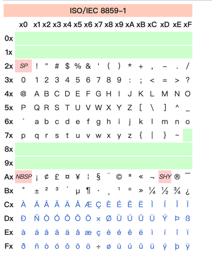
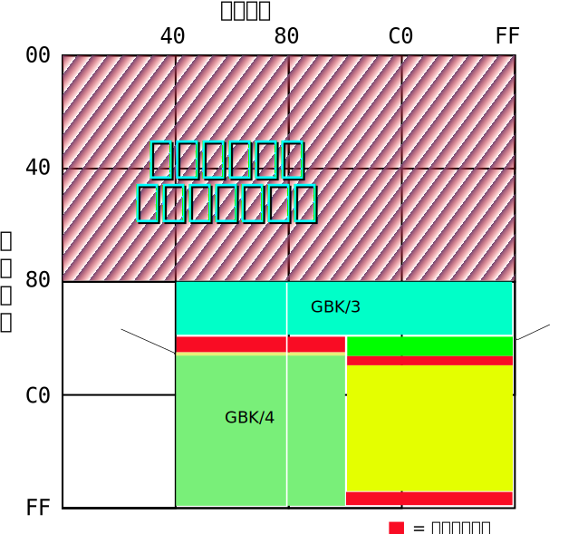
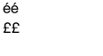
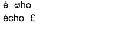

<!-- START doctoc generated TOC please keep comment here to allow auto update -->
<!-- DON'T EDIT THIS SECTION, INSTEAD RE-RUN doctoc TO UPDATE -->
**Table of Contents**  *generated with [DocToc](https://github.com/thlorenz/doctoc)*

- [浅析常见的文本编码](#%E6%B5%85%E6%9E%90%E5%B8%B8%E8%A7%81%E7%9A%84%E6%96%87%E6%9C%AC%E7%BC%96%E7%A0%81)
  - [1. 参考资料](#1-%E5%8F%82%E8%80%83%E8%B5%84%E6%96%99)
  - [2. 什么是文本编码](#2-%E4%BB%80%E4%B9%88%E6%98%AF%E6%96%87%E6%9C%AC%E7%BC%96%E7%A0%81)
  - [3. 常见的文本编码](#3-%E5%B8%B8%E8%A7%81%E7%9A%84%E6%96%87%E6%9C%AC%E7%BC%96%E7%A0%81)
    - [1. ASCII](#1-ascii)
    - [2. Latin-1（ISO 8859-1）](#2-latin-1iso-8859-1)
    - [3. GB 2312](#3-gb-2312)
      - [ISO-2022-CN（国标码、交换码）](#iso-2022-cn%E5%9B%BD%E6%A0%87%E7%A0%81%E4%BA%A4%E6%8D%A2%E7%A0%81)
      - [EUC-CN](#euc-cn)
    - [4. GBK](#4-gbk)
      - [GBK 编码的历史](#gbk-%E7%BC%96%E7%A0%81%E7%9A%84%E5%8E%86%E5%8F%B2)
      - [GBK 的编码方式](#gbk-%E7%9A%84%E7%BC%96%E7%A0%81%E6%96%B9%E5%BC%8F)
    - [5. Unicode](#5-unicode)
      - [Unicode 的历史](#unicode-%E7%9A%84%E5%8E%86%E5%8F%B2)
      - [Unicode 的编码方式](#unicode-%E7%9A%84%E7%BC%96%E7%A0%81%E6%96%B9%E5%BC%8F)
      - [Unicode 的实现方式](#unicode-%E7%9A%84%E5%AE%9E%E7%8E%B0%E6%96%B9%E5%BC%8F)
  - [4. UTF-8](#4-utf-8)
  - [5. UTF-16 与 UCS-2](#5-utf-16-%E4%B8%8E-ucs-2)
    - [UCS-2](#ucs-2)
    - [UTF-16 编码规则](#utf-16-%E7%BC%96%E7%A0%81%E8%A7%84%E5%88%99)
  - [6. 其他话题](#6-%E5%85%B6%E4%BB%96%E8%AF%9D%E9%A2%98)
    - [1. JavaScript 中的 Unicode](#1-javascript-%E4%B8%AD%E7%9A%84-unicode)
      - [1. JavaScript 对 Unicode 的支持](#1-javascript-%E5%AF%B9-unicode-%E7%9A%84%E6%94%AF%E6%8C%81)
      - [2. JavaScript 中的 Unicode 字符转义序列](#2-javascript-%E4%B8%AD%E7%9A%84-unicode-%E5%AD%97%E7%AC%A6%E8%BD%AC%E4%B9%89%E5%BA%8F%E5%88%97)
      - [3. 以编码单元为基准分割字符串](#3-%E4%BB%A5%E7%BC%96%E7%A0%81%E5%8D%95%E5%85%83%E4%B8%BA%E5%9F%BA%E5%87%86%E5%88%86%E5%89%B2%E5%AD%97%E7%AC%A6%E4%B8%B2)
      - [4. 以字素簇为基准分割字符串](#4-%E4%BB%A5%E5%AD%97%E7%B4%A0%E7%B0%87%E4%B8%BA%E5%9F%BA%E5%87%86%E5%88%86%E5%89%B2%E5%AD%97%E7%AC%A6%E4%B8%B2)
      - [5. 正则表达式中的 Unicode](#5-%E6%AD%A3%E5%88%99%E8%A1%A8%E8%BE%BE%E5%BC%8F%E4%B8%AD%E7%9A%84-unicode)
      - [6. Unicode 正规化（normalize）](#6-unicode-%E6%AD%A3%E8%A7%84%E5%8C%96normalize)
    - [2. HTML 中的 Unicode](#2-html-%E4%B8%AD%E7%9A%84-unicode)
    - [3. Css 中的 Unicode](#3-css-%E4%B8%AD%E7%9A%84-unicode)
    - [4. 其他编程语言对于 Unicode 的支持](#4-%E5%85%B6%E4%BB%96%E7%BC%96%E7%A8%8B%E8%AF%AD%E8%A8%80%E5%AF%B9%E4%BA%8E-unicode-%E7%9A%84%E6%94%AF%E6%8C%81)
      - [1. Python](#1-python)
      - [2. Java](#2-java)
      - [3. Golang](#3-golang)
    - [5. 如何保证 Unicode 字符正常显示](#5-%E5%A6%82%E4%BD%95%E4%BF%9D%E8%AF%81-unicode-%E5%AD%97%E7%AC%A6%E6%AD%A3%E5%B8%B8%E6%98%BE%E7%A4%BA)

<!-- END doctoc generated TOC please keep comment here to allow auto update -->

# 浅析常见的文本编码

## 1. 参考资料

1. Unicode：
   - [Unicode 官网](https://home.unicode.org/)
   - [Normalization Charts](https://www.unicode.org/charts/normalization/)
   - [Unicode Utilities: UnicodeSet](https://util.unicode.org/UnicodeJsps/list-unicodeset.jsp?a=%5B%3AUnified_Ideograph%3A%5D&g=&i=)
   - [Table 9. Property Table](https://www.unicode.org/reports/tr44/#Property_List_Table)
   - [UnicodeMatchProperty ( rer, p )](https://tc39.es/ecma262/multipage/text-processing.html#sec-runtime-semantics-unicodematchproperty-p)
   - [UNICODE CHARACTER DATABASE](https://www.unicode.org/reports/tr44/#GC_Values_Table)
   - [Unicode Utilities: Character Properties
     ](https://util.unicode.org/UnicodeJsps/character.jsp?a=%E4%B8%87&B1=Show)
2. [字符编码笔记：ASCII，Unicode 和 UTF-8](https://www.ruanyifeng.com/blog/2007/10/ascii_unicode_and_utf-8.html)

3. [Unicode与前端字符编码全揭秘](https://juejin.cn/post/7070079762429034526?searchId=20230927162744FB786D5971DDA90E6B49)

4. [JavaScript 与 Unicode](https://cjting.me/2018/07/22/js-and-unicode/)

5. [Unicode与Javascript](https://hellogithub2014.github.io/2018/08/23/unicode-and-javascript/)

6. [Unicode与JavaScript详解](https://www.ruanyifeng.com/blog/2014/12/unicode.html)

7. [国家标准|GB 18030-2022](https://openstd.samr.gov.cn/bzgk/gb/newGbInfo?hcno=A1931A578FE14957104988029B0833D3)

8. [国家标准|GB/T 2312-1980](https://openstd.samr.gov.cn/bzgk/gb/newGbInfo?hcno=5664A728BD9D523DE3B99BC37AC7A2CC)

9. [What every developer should know about Text Encoding](https://medium.com/@himankbh/all-you-need-to-know-about-text-encoding-af173935939)

10. [Names and labels](https://encoding.spec.whatwg.org/#names-and-labels)  
11. Wiki：
   - [UTF-8](https://zh.wikipedia.org/wiki/UTF-8)
   - [UTF-16](https://en.wikipedia.org/wiki/UTF-16)
   - [Unicode](https://zh.wikipedia.org/wiki/Unicode)


## 2. 什么是文本编码

1. 众所周知，计算机是以二进制的形式存储和处理数据，也就是 `010011` 的形式。那么对于文本或者说是字符，也是这样处理的。

2. 显然这种处理文本的方式对计算机来说是友好的，但是对于人类来说是极度不友好的，因为我们没法看懂 `0101` 形式的二进制数据。

3. 此时需要一种媒介：既能以二进制的方式存储文本，也能以人类可读的方式显示文本。这种枚举就是文本编码（Text encoding）或者字符编码（Character encoding）。

4. 简单的说，文本编码就是一种映射关系：将人类可读的字符转换为机器可读格式，反之可以将机器可读的格式转换为人类可读的字符。

5. 文本编码中，我们需要给每一个我们用到的字符分配一个数值，这些数值会被转换为二进制形式，计算机就能处理、传输、转换和存储这些二进制形式的数值。

6. 因为文本编码涉及到给每个字符分配数值，那么给字符分配什么样的数值就会产生不同的文本规则。同一个字符，可以有不同的编码数值，同一个编码数值，也可以对应不同的字符。

7.  如果不同的计算机要想互相通信且不会出现语义失真、乱码等现象，那么每台计算机就必须使用相同的编码规则，举个例子：计算机 A 使用的编码规则中，`20` 代表字母 `a`；而计算机 B 使用的编码规则中，`20` 却代表汉字 `中`。此时计算机 A 生成的文本在计算机 B 上显示的文本内容就会出现错误。因此，我们需要计算机 A 和 B 使用相同的编码规则，这样才能正确处理文本信息。所以，我们需要统一编码规则，使得不同的计算机能够以相同的规则处理文本，这个就是编码标准。

8. 介绍两个概念：码点（code Point）和字符集（charset）：
   - 码点（code Point）表示的是从数字到字符的那个映射，这个数字就叫码点。例如，在 ASCII 中，A 对应的十进制数字是 65，那么 65 就是 A 对应的码点。
   - 字符集（charset）则保存着字符和数字之间一对一的映射关系。如 ASCII 就是一个常见的字符集。

## 3. 常见的文本编码

### 1. ASCII
 
 1. ASCII（/ˈæski/）是 American Standard Code for Information Interchange 的缩写，全称是：美国信息交互标准码。

 2. ASCII 是由美国国家标准学会(American National Standard Institute , ANSI )制定的，是一种标准的单字节字符编码方案，用于基于文本的数据。主要用于显示现代英语。
 
 3. ASCII 最初是美国国家标准，后来被国际标准化组织（International Organization for Standardization, ISO）定为国际标准（ISO/IEC 646）。并适用于所有拉丁字母。 注意：我们下面讨论的是最初版本的 ASCII。

4. ASCII 由电报码发展而来。第一版标准发布于 1963 年，1967 年经历了一次主要修订，最后一次更新则是在 1986 年，至今为止共定义了128个字符；其中 33 个字符无法显示（不可打印字符，一些终端提供了扩展，使得这些字符可显示为诸如笑脸、扑克牌花式等8-bit符号），且这 33 个字符多数都已是陈废的控制字符。控制字符的用途主要是用来操控已经处理过的文字。在33个字符之外的是 95 个可显示的字符。用键盘敲下空白键所产生的空白字符也算1个可显示字符（显示为空白）。

5. ASCII 是单字节编码，也就是一个字节（8 bit）是一个编码。因为 ASCII 最初是为现代英语设计的，现代英语中，大小写字母一共 52 个，加上数字、标点符号等，总数不到 100 个，加上一些控制字符（不可打印字符），也就 100 多个，因此使用一个字节进行编码是完全足够的。

6.  ASCII 中一共定义了 128 个字符的编码，占用了一个字节的后面 7 位，最前面的一位统一规定为 0。二进制的范围是 `00000000` - `01111111`，十进制范围是：`0` - `127`。

7. ASCII 中的 33 不可打印字符如下表所示：

二进制|十进制|十六进制|缩写|Unicode表示法|名称／意义
:----:|:----:|:----:|:----:|:----:|:----:
0000 0000|0|00|	NUL|␀| 空字符（Null）
0000 0001|	1|	01|	SOH|	␁|	标题开始
0000 0010|	2|	02|	STX|	␂|本文开始
0000 0011|	3|	03|	ETX|	␃|本文结束
0000 0100|	4|	04|	EOT|	␄|传输结束
0000 0101|	5|	05|	ENQ|	␅|请求
0000 0110|	6|	06|	ACK|	␆|确认回应
0000 0111|	7|	07|	BEL|	␇|响铃
0000 1000|	8|	08|	BS|	␈|退格
0000 1001|	9|	09|	HT|	␉|水平定位符号
0000 1010|	10|	0A|	LF|	␊|换行键
0000 1011|	11|	0B|	VT|	␋|垂直定位符号
0000 1100|	12|	0C|	FF|	␌|换页键
0000 1101|	13|	0D|	CR|	␍|CR (字符)
0000 1110|	14|	0E|	SO|	␎|取消变换（Shift out）
0000 1111|	15|	0F|	SI|	␏|	启用变换（Shift in）
0001 0000|	16|	10|	DLE|	␐|	跳出数据通讯
0001 0001|	17|	11|	DC1|	␑|	设备控制一（XON 激活软件速度控制）
0001 0010|	18|	12|	DC2|	␒|	设备控制二
0001 0011|	19|	13|	DC3|	␓|	设备控制三（XOFF 停用软件速度控制）
0001 0100|	20|	14|	DC4|	␔|	设备控制四
0001 0101|	21|	15|	NAK|	␕|	确认失败回应
0001 0110|	22|	16|	SYN|	␖|	同步用暂停
0001 0111|	23|	17|	ETB|	␗|	区块传输结束
0001 1000|	24|	18|	CAN|	␘|	取消
0001 1001|	25|	19|	EM|	␙|	连线介质中断
0001 1010|	26|	1A|	SUB|	␚|	替换
0001 1011|	27|	1B|	ESC|	␛|	退出键
0001 1100|	28|	1C|	FS|	␜|	文件分割符
0001 1101|	29|	1D|	GS|	␝|	组群分隔符
0001 1110|	30|	1E|	RS|	␞|	记录分隔符
0001 1111|	31|	1F|	US|	␟|单元分隔符
0111 1111| 127|7F|DEL|␡|Delete字符

8. ASCII 中可打印的字符的编码范围是：32-126（0x20-0x7E），这 95 个可打印字符如下表所示：

二进制|十进制|十六进制|图形
:----:|:----:|:----:|:----:
0010 0000|	32|	20|	(space)
0010 0001|	33|	21|	!
0010 0010|	34|	22|	"
0010 0011|	35|	23|	#
0010 0100|	36|	24|	$
0010 0101|	37|	25|	%
0010 0110|	38|	26|	&
0010 0111|	39|	27|	'
0010 1000|	40|	28	|(
0010 1001|	41|	29|	)
0010 1010|	42|	2A|	*
0010 1011|	43|	2B|	+
0010 1100|	44|	2C|	,
0010 1101|	45|	2D|	-
0010 1110|	46|	2E|	.
0010 1111|	47|	2F|	/
0011 0000|	48|	30|	0
0011 0001|	49|	31|	1
0011 0010|	50|	32|	2
0011 0011|	51|	33|	3
0011 0100|	52|	34|	4
0011 0101|	53|	35|	5
0011 0110|	54|	36|	6
0011 0111|	55|	37|	7
0011 1000|	56|	38|	8
0011 1001|	57|	39|	9
0011 1010|	58|	3A|	:
0011 1011|	59|	3B|	;
0011 1100|	60|	3C|	<
0011 1101|	61|	3D|	=
0011 1110|	62|	3E|	>
0011 1111|	63|	3F|	?

二进制|十进制|十六进制|图形
:----:|:----:|:----:|:----:
0100 0000|	64|	40|	@
0100 0001|	65|	41|	A
0100 0010|	66|	42|	B
0100 0011|	67|	43|	C
0100 0100|	68|	44|	D
0100 0101|	69|	45|	E
0100 0110|	70|	46|	F
0100 0111|	71|	47|	G
0100 1000|	72|	48|	H
0100 1001|	73|	49|	I
0100 1010|	74|	4A|	J
0100 1011|	75|	4B|	K
0100 1100|	76|	4C|	L
0100 1101|	77|	4D|	M
0100 1110|	78|	4E|	N
0100 1111|	79|	4F|	O
0101 0000|	80|	50|	P
0101 0001|	81|	51|	Q
0101 0010|	82|	52|	R
0101 0011|	83|	53|	S
0101 0100|	84|	54|	T
0101 0101|	85|	55|	U
0101 0110|	86|	56|	V
0101 0111|	87|	57|	W
0101 1000|	88|	58|	X
0101 1001|	89|	59|	Y
0101 1010|	90|	5A|	Z
0101 1011|	91|	5B|	[
0101 1100|	92|	5C|	\
0101 1101|	93|	5D|	]
0101 1110|	94|	5E|	^
0101 1111|	95|	5F|	_

二进制|十进制|十六进制|图形
:----:|:----:|:----:|:----:
0110 0000|	96|	60|	`
0110 0001|	97|	61|	a
0110 0010|	98|	62|	b
0110 0011|	99|	63|	c
0110 0100|	100|	64|	d
0110 0101|	101|	65|	e
0110 0110|	102|	66|	f
0110 0111|	103|	67|	g
0110 1000|	104|	68|	h
0110 1001|	105|	69|	i
0110 1010|	106|	6A|	j
0110 1011|	107|	6B|	k
0110 1100|	108|	6C|	l
0110 1101|	109|	6D|	m
0110 1110|	110|	6E|	n
0110 1111|	111|	6F|	o
0111 0000|	112|	70|	p
0111 0001|	113|	71|	q
0111 0010|	114|	72|	r
0111 0011|	115|	73|	s
0111 0100|	116|	74|	t
0111 0101|	117|	75|	u
0111 0110|	118|	76|	v
0111 0111|	119|	77|	w
0111 1000|	120|	78|	x
0111 1001|	121|	79|	y
0111 1010|	122|	7A|	z
0111 1011|	123|	7B|	{
0111 1100|	124|	7C|	|
0111 1101|	125|	7D|	}
0111 1110|	126|	7E|	~

9. ASCII 中：32 表示是空格，48～57为 0 到 9 十个阿拉伯数字。65～90 为 26 个大写英文字母，97～122 号为 26 个小写英文字母，对应的大小写字母相差 32。

10. ASCII 的缺点是：能显示 26 个基本拉丁字母、阿拉伯数字和英式标点符号，因此只能用于显示现代美国英语（且处理 naïve、café、élite 等外来语时，必须去除附加符号）。对于非现代美国应用以外的文字，如法文、俄文、汉字等，ASCII 是无能为力的。

### 2. Latin-1（ISO 8859-1）

1. Latin-1 这个字符集是 ISO 8859-1 的一种称号，其正式编号为 ISO/IEC 8859-1:1998，也被称作西欧语言。是国际标准化组织内 ISO/IEC 8859 的第一个 8 位字符集。它以 ASCII 为基础，在空置的 0xA0-0xFF 的范围内，加入96个字母及符号，可以用于使用附加符号的拉丁字母语言的展示、存储与传输。

2. 字符集的内容如下所示：


3. 此字符集支持一部分在欧洲使用的语言文字，包括阿尔巴尼亚语、巴斯克语、布列塔尼语、加泰罗尼亚语、丹麦语、荷兰语、法罗语、弗里西语、加利西亚语、德语、格陵兰语、冰岛语、爱尔兰盖尔语、意大利语、拉丁语、卢森堡语、挪威语、葡萄牙语、里托罗曼斯语、苏格兰盖尔语、西班牙语及瑞典语。

4. 英语虽然没有重音字母，但仍会标明为 `ISO/IEC 8859-1` 编码。除此之外，欧洲以外的部分语言，如南非荷兰语、斯瓦希里语、印尼语及马来语、菲律宾他加洛语等也可使用 `ISO/IEC 8859-1`编码。

5. 法语及芬兰语本来也使用 `ISO/IEC 8859-1` 来表示。但因它没有法语使用的 `œ`、`Œ`、`Ÿ` 三个字母及芬兰语使用的 `Š`、`š`、`Ž`、`ž`，故于1998年被 `ISO/IEC 8859-15` 所取代（ISO 8859-15同时加入了欧元符号）。

6. `ISO/IEC 8859` 是一系列的 8 比特字符编码标准，主要供不同的语言（主要是拼音文字）使用。如 `ISO 8859-2`，正式编号为 `ISO/IEC 8859-2:1999`，又称 `Latin-2` 或中欧语言。该字符集适用于：克罗地亚语、捷克语、匈牙利语、波兰语、斯洛伐克语、斯洛文尼亚语、上索布语、下索布语。而阿尔巴尼亚语、英语、德语、拉丁语也可用此字符集。

7. [ISO/IEC 8859](https://en.wikipedia.org/wiki/ISO/IEC_8859) 系列的标准简介如下所示：
    - [ISO/IEC 8859-1 (Latin-1)](https://en.wikipedia.org/wiki/ISO/IEC_8859-3) - 西欧语言
    - [ISO/IEC 8859-2 (Latin-2)](https://en.wikipedia.org/wiki/ISO/IEC_8859-2) - 中欧语言
    - [ISO/IEC 8859-3 (Latin-3)](https://en.wikipedia.org/wiki/ISO/IEC_8859-3) - 南欧语言。世界语也可用此字符集显示。
    - [ISO/IEC 8859-4 (Latin-4)](https://en.wikipedia.org/wiki/ISO/IEC_8859-4) - 北欧语言
    - [ISO/IEC 8859-5 (Cyrillic)](https://en.wikipedia.org/wiki/ISO/IEC_8859-5) - 斯拉夫语言
    - [ISO/IEC 8859-6 (Arabic)](https://zh.wikipedia.org/wiki/ISO/IEC_8859-6) - 阿拉伯语
    - [ISO/IEC 8859-7 (Greek)](https://en.wikipedia.org/wiki/ISO/IEC_8859-7) - 希腊语
    - [ISO/IEC 8859-8 (Hebrew)](https://en.wikipedia.org/wiki/ISO/IEC_8859-8) - 希伯来语（视觉顺序）
    - [ISO 8859-8-I](https://en.wikipedia.org/wiki/ISO-8859-8-I) - 希伯来语（逻辑顺序）
    - [ISO/IEC 8859-9（Latin-5 或 Turkish）](https://en.wikipedia.org/wiki/ISO/IEC_8859-9) - 它把 Latin-1 的冰岛语字母换走，加入土耳其语字母。
    - [ISO/IEC 8859-10（Latin-6 或 Nordic）](https://en.wikipedia.org/wiki/ISO/IEC_8859-10) - 北日耳曼语支，用来代替Latin-4。
    - [ISO/IEC 8859-11 (Thai)](https://en.wikipedia.org/wiki/ISO/IEC_8859-11) - 泰语，从泰国的 TIS620 标准字集演化而来。
    - [ISO/IEC 8859-13（Latin-7 或 Baltic Rim）](https://en.wikipedia.org/wiki/ISO/IEC_8859-13) - 波罗的语族
    - [ISO/IEC 8859-14（Latin-8 或 Celtic）](https://en.wikipedia.org/wiki/ISO/IEC_8859-14) - 凯尔特语族
    - [ISO/IEC 8859-15 (Latin-9)](https://en.wikipedia.org/wiki/ISO/IEC_8859-15) - 西欧语言，加入Latin-1欠缺的芬兰语字母和大写法语重音字母，以及欧元（€）符号。
    - [ISO/IEC 8859-16 (Latin-10) ](https://en.wikipedia.org/wiki/ISO/IEC_8859-16) - 东南欧语言。主要供罗马尼亚语使用，并加入欧元符号

8. `ISO/IEC 8859` 系列中没有 12 号的原因是：此计划原本要设计成一个包含塞尔特语族字符集的 `Latin-7`，但后来塞尔特语族变成了 `ISO 8859-14 / Latin-8`。还有一种说法是：12号本来是预留给印度天城体梵文的，但是于 1997 年由官方终止，因为 [ISCII](https://en.wikipedia.org/wiki/Indian_Script_Code_for_Information_Interchange) 和 `Unicode/ISO/IEC 10646` 覆盖了印度天城体梵文。

### 3. GB 2312

1. 前面讲了 ASCII 字符编码和 `ISO/IEC 8859` 系列的字符编码，它们只适用于拼音文字，如英语、法语、德语等，但是对于东亚地区的一些语言文字，如汉语、日语等，就无能为力了。因此，东亚地区的中国、日本等，都制定了自己的字符编码标准，如中国的 `GB 2312`，日本的 `JIS X 0208` 等。

2. `GB 2312`，也被称为 `GB/T 2312`，`GB/T 2312—80` 或 `GB/T 2312—1980` 是中华人民共和国国家标准简体中文字符集，全称《信息交换用汉字编码字符集·基本集》。GB 是"国标"汉语拼音首字母，T 是推荐汉语拼音的首字母，即该标准是推荐使用，但不是强制标准。因为 `GB 2312` 于 1981 年 5 月 1 日 实施，根据 2017 年第 7 号公告和强制性标准整合精简结论，自2017年3月23日起,该标准转化为推荐性标准，不再强制执行（来源：[国家标准全文公开系统 - GB/T 2312-1980](https://openstd.samr.gov.cn/bzgk/gb/newGbInfo?hcno=5664A728BD9D523DE3B99BC37AC7A2CC)）。

3. `GB/T 2312` 由中国国家标准总局于 1980 年发布，1981 年 5 月 1 日实施。`GB/T 2312` 编码通行于中国大陆；新加坡等地也采用此编码。中国大陆几乎所有的中文系统和国际化的软件都支持`GB/T 2312`。

4. `GB/T 2312` 标准共收录 6763 个汉字，其中一级汉字 3755 个，二级汉字 3008 个；同时收录了包括拉丁字母、希腊字母、日文平假名及片假名字母、俄语西里尔字母在内的 682 个字符。

5. `GB/T 2312` 的出现，可以满足计算机对于处理、存储和传输汉字的基本需求，其所收录的汉字已经覆盖中国大陆 99.75% 的使用需求。

6. `GB/T 2312` 不能处理人名、古汉语等方面出现的罕用字和繁体字，这几个方面是由一系列的国标辅助集负责编码和显示，如 `GB/T 12345`《信息交换用汉字编码字符集　第一辅助集》、`GB/T 7589` 《信息交换用汉字编码字符集 第二辅助集》及 `GB/T 7590`《信息交换用汉字编码字符集 第四辅助集》等。

7. `GB/T 2312` 是一个双字节编码的字符集。所有的字符被划分进一个 94 x 94 的网格中，并使用区位的概念将不同的汉字划分到不同的格子中。第一个字节称为高位字节，表示这个字符所在的区，第二个字节称为“低位字节”，对应区段内的个别码位。例如“万”字在 45 区 82 位，所以“万”字的区位码是 45-82（45是“区码”，82是“位码”）。在储存进电脑时，电脑会在区位码上加上特定数字后才保存进内存以确保和其他编码兼容（如 ASCII）。转码后，区位码的“区码”会变成“高位字节”，而“位码”会变成“低位字节”。

8. 下面是 `GB/T 2312` 的 1~94 分区内存储的字符： 
   - 01~09 区（682个）：特殊符号、数字、英文字符、制表符等，包括拉丁字母、希腊字母、日文平假名及片假名字母、俄语西里尔字母等在内的682个全角字符；
   - 10~15 区：空区，留待扩展；`GB/T 2312` 的附录 3 中，第 10 区推荐作为 `GB 1988—80` 中的 94 个图形字符区域（即第 3 区字符之半形版本）。
   - 16~55 区（3755个）：常用汉字（也称一级汉字），按拼音排序；
   - 56~87 区（3008个）：非常用汉字（也称二级汉字），按部首/笔画排序；
   - 88~94 区：空区，留待扩展。

9. `GB/T 2312` 详情可以参考：[信息交换用汉字编码字符集 基本集](https://openstd.samr.gov.cn/bzgk/gb/newGbInfo?hcno=5664A728BD9D523DE3B99BC37AC7A2CC)

#### ISO-2022-CN（国标码、交换码）

1. `GB/T 2312` 中的区位码与 ASCII 字符集有重合，而 ASCII 字符集头上那些稀奇古怪的字符其实是通信传输时的控制字符，为了在通信时不会与控制字符混淆，规定了区码加 0x20 或者是 32 以避开 ASCII 控制字符的交换码，这就是 [ISO-2022](https://en.wikipedia.org/wiki/ISO/IEC_2022) 标准编码。

2. 在这个编码模式内，软件需要使用低端控制字符（C0），高端控制字符（C1）和 US-ASCII 字符集（GL）标注字符属于单字节（ASCII）还是双字节，相对容易造成乱码（如丢失控制/转义字符）。

3. 例如：“万”字（区位码 45-82）的 ISO 2022 码十进制为：(45+32, 82+32) = (77, 114)，十六进制为：`<4D 72>`。

#### EUC-CN

1. 因为国标码和通用的 ASCII 码冲突，因此后续为了方便辨认单字节和双字节的编码，一些 Unix 厂商在 ISO 2022 的基础上把双字节字符的二进制最高位都从 0 换成 1，即相当于把 ISO 2022 的每个字节都再加上128（十六进制为 0×80 ）得到“机内码”表示，简称“内码”。

2. 把“区码”和“位码”分别加上 160（32 + 128，即先转换为 ISO-2022，在转换为机内码），十六进制为 0×A0，也可以得到相同的机内码表示，这种格式也就是 EUC（Extended Unix Code）。这样 GB2312 字符编码出的字节值就不会出现在 ASCII 区间内。

3. 使用 `GB/T 2312` 的程序通常采用 EUC 储存方法，以便兼容于 ASCII。这种格式称为 `EUC-CN`。浏览器编码表上的 `GB2312` 就是指这种表示法。

2. 在 `GB/T 2312` 内，高位字节使用了 0xA1—0xF7（把 01—87 区的区号加 160 或 0×A0），低位字节使用了 0xA1—0xFE（把 01—94 加上 160 或 0×A0）。非 ASCII 字符双字节编码范围为十六进制为 `<A1 A1>`-`<FE FE>`，十进制为 (161, 161) 至 (254, 254)。

3. 例：“万”字（区位码 45-82）的 `EUC` 码十进制为：(45+160, 82+160) = (205, 242)，十六进制为：`<CD F2>`。

### 4. GBK

1. 汉字内码扩展规范，简称 GBK，全名为《汉字内码扩展规范(GBK)》1.0版，由中华人民共和国全国信息技术标准化技术委员会 1995 年 12 月 1 日制订，国家技术监督局标准化司和电子工业部科技与质量监督司 1995 年 12 月 15 日联合以《技术标函[1995]229号》文件的形式公布。GBK共收录 21886 个汉字和图形符号，其中汉字（包括部首和构件）21003 个，图形符号 883 个。

2. GBK为"国家标准扩展"的汉语拼音（Guójiā Biāozhǔn Kuòzhǎn）中的“国”“标”“扩”第一个声母。英文全称是：Chinese Internal Code Extension Specification。

3. GBK 实际上是**"技术规范指导性文件"**，不属于国家标准。国家质量技术监督局于 2000 年 3 月 17 日推出了 `GB 18030-2000` 标准，以取代 GBK。`GB 18030-2000` 除保留全部 GBK 编码汉字，在第二字节把能使用范围再度进行扩展，增加了大约一百个汉字及四字节编码空间，但是将 GBK 作为子集全部保留。请参看`GB 18030` 的介绍请参考：[GB 18030](https://en.wikipedia.org/wiki/GB_18030)

4. `GB 18030-2000` 及其取代 `GB 18030-2000` 的`GB 18030-2005` 目前均已被废止，最新的标准是：[GB 18030-2022](https://openstd.samr.gov.cn/bzgk/gb/newGbInfo?hcno=A1931A578FE14957104988029B0833D3)

#### GBK 编码的历史

1. 1993年，Unicode 1.1 版本推出，收录中国大陆、台湾、日本及韩国通用字符集的汉字，总共有20,902个。

2. 微软在 1993 年根据 Unicode 1.1 对 GB2312 进行扩展形成了 GBK 字符集，该字符集在 Win95、NT3.51 中的实现为 CP936，也就是 CP936 字码表（Code Page 936）的扩展（之前 `CP936` 和 `GB 2312-80` 一模一样）。因此，GBK 的编码方式完全兼容 `GB 2312`。

3. 在 Windows 操作系统中，经常可以看到 GBK 格式的编码。

#### GBK 的编码方式

1. GBK 中，字符有单字节和双字节编码，00–7F 范围内是第一个字节，和ASCII保持一致。之后的双字节中，前一字节是双字节的第一位。第一字节的范围是 `81`–`FE`（也就是不含 `80` 和 `FF`），第二字节的一部分领域在`40`–`7E`，其他领域在`80`–`FE`。

2. 具体的区位划分如下表所示：

范围|  第1字节   |     第2字节     | 编码数     |字数
:----:|:-------:|:------------:|:--------|:----
水准GBK/1|  A1–A9  |    A1–FE     | 846     |717
水准GBK/2|  B0–F7  |    A1–FE     | 6,768   |6,763
水准GBK/3|  81–A0  | 40–FE (7F除外) | 6,080   |6,080
水准GBK/4|  AA–FE  | 40–A0 (7F除外) | 8,160   |8,160
水准GBK/5|  A8–A9  | 40–A0 (7F除外) | 192     |166
用户定义|  AA–AF  |    A1–FE	    | 564     
用户定义|  F8–FE  |    A1–FE	    | 658     
用户定义|  A1–A7  | 40–A0 (7F除外) | 672     
合计：| |   |  23,940 |21,886

3. 双字节符号可以表达的 64K 空间如下图所示。绿色和黄色区域是GBK的编码，红色是用户定义区域。没有颜色区域是不正确的代码组合。


### 5. Unicode

1. Unicode，全称为 Unicode 标准，即 The Unicode Standard，其官方机构Unicode 联盟所用的中文名称为统一码。是信息技术领域的业界标准，其整理、编码了世界上大部分的文字系统，使得电脑能以通用划一的字符集来处理和显示文字，不但减轻在不同编码系统间切换和转换的困扰，更提供了一种跨平台的乱码问题解决方案。

2. Unicode 由非营利机构 Unicode 联盟（Unicode Consortium）负责维护，该机构致力让 Unicode 标准取代既有的字符编码方案，因为既有方案编码空间有限，亦不适用于多语环境。

3. Unicode 伴随着通用字符集 ISO/IEC 10646 的标准而发展，同时也以书本的形式对外发表。Unicode 至今仍在不断增修，每个新版本都加入更多新的字符。目前最新的版本为2022 年 9 月公布的 15.0.0（[Unicode15.0.0](https://www.unicode.org/versions/Unicode15.0.0/)），已经收录超过 14 万个字符（第十万个字符在2005年获采纳）。

4. Unicode 标准不仅仅只是为文字指定代码，除了涵盖视觉上的字形、编码方法、标准的字符编码资料外，联盟官方出版品还包含了关于各书写系统的细节及呈现方式，如规范化的准则、拆分、测序、绘制、双向文本显示、书写方向、字符特性（如大小写字母）等等。此外还提供参考资料和视觉图像，以帮助开发者和设计师正确应用标准。

#### Unicode 的历史

1. 1987 年，Xerox 的 Joe Backer，Apple 的 Lee Collins 和 Mark Davis 在开始研究创建通用字符集的可行性。在 Peter Fenwick 和 Dave Opstad 的补充下，Becker 于 1988 年 8 月发布了名为“国际/多语言文本字符编码系统，暂称为 Unicode”的提案草案。 他解释说 Unicode 这个名字旨在暗示一种独特的（unique）、统一的（unified）、通用的（universal）编码。在这份草案中，Becker 概述了这样一种基于 16 比特编码字符的方案。

2. 在 1989 年的早期，不少人员持续加入 Unicode 工作组。到 1990 年末，工作组完成将映射已有编码标准到 Unicode 标准的大部分工作，并准备好了一份 Unicode 标准草案。

3. 在 1991 年 1 月 3 日，在美国加利福尼亚州成立了 Unicode 联盟，同年 10 月，Unicode 联盟发布了第一版标准。第二版标准发布于 1992 年 6 月。

4. 1996 年，Unicode 2.0 实现代理机制，因此 Unicode 字符长度不再局限于 16 比特。因此 Unicode 可以容纳超过 100 万个字符，这样就允许我们给一些历史字符进行编码，如古埃及象形文字、很少使用或者过时的字符等。

5. 关于 Unicode 联盟的介绍，可以参考：
   - [Unicode Consortium](https://en.wikipedia.org/wiki/Unicode_Consortium)
   - [Unicode Consortium 官网](https://home.unicode.org/)

#### Unicode 的编码方式

1. Unicode 的编码方式与 [ISO 10646](https://en.wikipedia.org/wiki/Universal_Coded_Character_Set) 的通用字符集概念相对应。目前实际应用的 Unicode 版本对应于 [UCS-2](https://zh.wikipedia.org/wiki/UTF-16)，使用 16 位的编码空间。也就是每个字符占用2个字节。这样理论上一共最多可以表示2^16（即65536）个字符。基本满足各种语言的使用。实际上当前版本的 Unicode 并未完全使用这 16 位编码，而是保留了大量空间以作为特殊使用或将来扩展。

2. 在本文中，与 Unicode 相关的内容将统一使用以下两种格式：
   - 使用U+十六进制码点值的格式来表示一个 Unicode 码点，例如：U+10FF。注意，此格式仅用于描述，在实际定义中，每个码点都是数字，并没有前缀U+。
   - 使用起始码点..终止码点的格式来表示一个连续的 Unicode 码点范围。例如，U+0000..U+0003 表示 U+0000、U+0001、U+0002、U+0003这四个码点。


3. 16 位 Unicode 字符构成[基本多文种平面](https://zh.wikipedia.org/wiki/%E5%9F%BA%E6%9C%AC%E5%A4%9A%E6%96%87%E7%A8%AE%E5%B9%B3%E9%9D%A2)。所谓的平面，指的是码点范围，也被称作编码空间。Unicode 划分了不同的平面（编码空间），如下所示：
   - 第 1 个平面（U+0000..U+FFFF）称为基本平面（Basic Multilingual Plane）。
   - 其余16个平面（U+10000..U+10FFFF）称为16个辅助平面（Supplementary Plane）。

3. 在一个平面中，又会根据字符类别划定大小不一的区块（Block）。例如，几乎所有的常用汉字都在基本平面中的 CJK Unified Ideographs（U+4E00..U+9FFF）这个区块中。

4. 基本平面和辅助平面即合起来至少需要占据 21 位的编码空间，比 3字节略少。但事实上辅助平面字符仍然占用 4 字节编码空间，与 [UCS-4](https://zh.wikipedia.org/wiki/UCS-4) 保持一致。UCS-4 是更大而尚未填充完全的 31 位字符集，加上恒为 0 的首位，共需占据 32 位，即 4 字节。理论上最多能表示 2^31（2,147,483,648，约 21 亿 4 千 7 百万）个字符，完全可以涵盖一切语言所用的符号。

5. Unicode 15.0.0 可以参考：[Unicode 15.0.0](https://unicode.org/versions/Unicode15.0.0/)

#### Unicode 的实现方式

1. Unicode 的实现方式不同于编码方式。一个字符的 Unicode 编码是确定的，如万的 Unicode 编码是：U+4E07，U+0041 表示英语的大写字母 A 等。但是在实际存储和传输过程中，由于不同系统平台的设计不一定一致，以及出于节省空间的目的，对 Unicode 编码的实现方式有所不同。Unicode 的实现方式称为 Unicode 转换格式（Unicode Transformation Format），简称为 UTF。

2. Unicode 的实现方式有多种，如 UTF-8、UTF-16、UTF-32、UTF-7 等，其中，在互联网上面使用最广泛的就是 UTF-8，其目前已成为互联网文本编码的事实标准。

## 4. UTF-8

1. UTF-8 是 Unicode 的一种实现方式。是一种针对 Unicode 的可变长度字符编码，也是一种前缀码。前缀码指的是编码中的每个码字，都不能被其他码字当成前置部位。举例而言，编码字 {9, 55} 具备了前置性质，但编码字{9, 5, 59, 55}就不具备，因为其中的"5"，是"59"及"55"的前置字。

2. UTF-8 可以用一至四个字节对 Unicode 字符集中的所有有效编码点进行编码，属于 Unicode 标准的一部分，最初由Ken Thompson 和 Rob Pike 提出。由于较小值的编码点一般使用频率较高，直接使用 Unicode 编码效率低下，大量浪费内存空间。UTF-8就是为了解决向后兼容ASCII码而设计，Unicode中前 128 个字符，使用与 ASCII 码相同的二进制值的单个字节进行编码，而且字面与 ASCII 码的字面一一对应，这使得原来处理 ASCII 字符的软件无须或只须做少部分修改，即可继续使用。因此，UTF-8 逐渐成为电子邮件、网页及其他存储或发送文字优先采用的编码方式。

3. 自 2008 年以来，UTF-8 一直是万维网的最主要的编码形式。WHATWG 推荐使用 UTF-8 作为 HTML 和 DOM 标准的编码格式，并声称：UTF-8 encoding is the most appropriate encoding for interchange of Unicode。Internet 邮件联盟（ Internet Mail Consortium, IMC）建议所有电子邮件程序都能够使用UTF-8展示和创建邮件，W3C 建议使用 UTF-8 作为 XML 文件和 HTML 文件的默认编码方式。

4. 根据 Unicode 字符的码点所处的码点范围不同，转换为 UTF-8 的编码的长度也不同，具体映射关系如下表所示：

Unicode 起始码点| Unicode 结束码点 | UTF-8 第一个字节 | UTF-8 第二个字节 | UTF-8 第三个字节 |UTF-8 第四个字节
:----:|:------------:|:-----------:|:-----------:|:-----------:|:----:
U+0000|    U+007F    |  0xxxxxxx   |
U+0080|    U+07FF    |  110xxxxx   |  10xxxxxx   
U+0800|    U+FFFF    |  1110xxxx   |  10xxxxxx   |  10xxxxxx   
U+10000|   U+10FFFF   |  11110xxx   |  10xxxxxx   |  10xxxxxx   |10xxxxxx

5. 上表中，`x` 的位置会被 Unicode 码点的二进制数值取代。

6. 从上表的映射规则汇总，我们可以看出：
    - 前 128 个字符（ASCII） 只需要一个字节。
    - 接下来的 1920 个字符需要两个字节，这个 1920 个字符已经覆盖了拉丁字母、国际音标、西里尔字母、希腊字母、希伯来字母等等。
    - 使用三个字节编码的字符，包含了中的基本平面 61440 个 Unicode 字符。这些字符，覆盖了大多数的汉字、日文和韩文。
    - 最后的 1048576 个 Unicode 字符使用四字节编码。包括表情（图形编码）少量的 CJK 字符，不同的历史文本和数学符号。

4. 解析 UTF-8 编码也是很容易了，跟据上表，如果一个字节的第一位是 0，则这个字节单独就是一个字符；如果第一位是 1，则连续有多少个 1，就表示当前字符占用多少个字节。 

5. 以汉字 "万" 为例，演示如何将 Unicode 字符转换为 UTF-8 编码：
    - `万` 的 Unicode 码点为：`U+4E07`，根据映射表格，那么万的 UTF-8 编码需要三个字节，即格式是 `1110xxxx 10xxxxxx 10xxxxxx`。
    - 将 `万` 的16进制码点转换为二进制：`100111000000111`
    - 按顺序进行替换：从 `万` 的最后一个二进制位开始，依次从后向前，依次替换的格式中的 `x`，替换完的结果为：`11100100 10111000 10000111`，转为 16 进制是：`E4B887`。

6. 解析 UTF-8 编码的文本时，如果解析出现错误，Unicode 标准推荐使用"�" （U+FFFD）作为替换字符。

## 5. UTF-16 与 UCS-2

1. UTF-16 也是 Unicode 的一种实现方式。UTF-16 也是一种变长的编码方式，对于基本平面 BMP 中的字符，使用 16 比特进行编码，而对于辅助平面中的字符，则使用两个 16 比特的编码单元（code unit）进行编码。

### UCS-2

1.  在介绍 UTF-16 编码规则之前，先介绍一下 UCS-2。UCS 是 Universal Coded Character Set 的缩写，是由 ISO 组织制定的字符编码标准的集合。而 UCS-2 则是其中的一个标准，这个标准使用固定的 16 比特对字符进行编码，即每个字符均使用两个字节表示，因此，UCS-2 可以覆盖 Unicode BMP 中的字符。

2. 1990 年前后，有两个组织在制定统一的、通用的字符集标准，一个是 ISO，一个是 Unicode 联盟（由计算机制造商组成），两个组织发现了对方的存在，后面就达成协议，彼此会同步码点的分配，以便开发的编码能够相互兼容。最早的 2 字节编码被称为 Unicode，但是现在称为 UCS-2，这个标准的草案发布于 1990 年。

3. UCS-2 使用两个字节进行编码，能覆盖 Unicode BMP 中的字符。但是，随着时间的发展，人们逐渐意识到，BMP 中的字符不足以覆盖现实生活中的字符数。于是 IEEE 提出了一直编码方案：使用更大的 31 比特进行编码，每个字符占据 4 个字节的空间。但是这个方案遭到了 Unicode 联盟的反对，前面说过，Unicode 联盟主要由计算机制造商组成，如果采取 IEEE 的方案，每个字符使用 4 字节存储，无疑会浪费内存和磁盘空间。并且一些计算机制造商已经在 2 字节编码的技术上面投入了大量的资金。因此，UTF-16 是作为一种折衷方案而开发的，并于 1996 年 7 月随 Unicode 标准 2.0 版一起推出。

3. 国际标准 ISO/IEC 10646 和 Unicode 标准
同时指定了 UTF-16。而 UCS-2 则已经是被废弃的状态，它已经不再是国际标准 10646 或者是 Unicode 标准中指定的编码格式了。

4. UTF-16 是 UCS-2 的超集。对于 UCS-2 中的字符，UTF-16 使用 2 字节进行编码，与 UCS-2 保持一致。而对于不在 UCS-2 中的字符，也就是辅助平面中的字符，UTF-16 使用代理机制进行编码，即使用两个编码单元进行编码，每个编码单元是 2 字节。

5. 讲完了 UCS-2 的历史，我们可以讲一讲 UTF-16 的编码规则了。

### UTF-16 编码规则

1. 对于 BMP 中的码点，范围是 U+0000..U+FFFF，统一使用 2 个字节来表示，且与码点完全相同。

2. 对于所有辅助平面中的码点，范围是 U+010000..U+10FFFF，编码步骤如下：
   - 原码点先减去 0x10000，于是数值范围变成 0x00000–0xFFFFF，然后补齐到 20 位，最后把这 20 位一分为二。

   - 将较高的 10 位与 0xD800（1101 1000 0000 0000）相加得到一个值，称为高位代理项（High Surrogate）。通过简单计算可得，高位代理项的数值范围为 0xD800–0xDBFF。
   - 将较低的 10 位与 0xDC00（1101 1100 0000 0000）相加得到一个值，称为低位代理项（Low Surrogate）。通过简单计算可得，低位代理项的数值范围为0xDC00–0xDFFF。
   - 高位代理项（2个字节）和低位代理项（2个字节）在一起组成一个代理对（Surrogate Pair）。一个代理对（4个字节）编码一个补充平面的码点。
3. UTF-16 编码中，每个 16 比特的代码单元（code unit）称为代理。第一个代码单元叫做高位代理，也称为 Leading Surrogate，第二个代码单元叫做地位代理，也称为 trailing surrogates。

4. 举例说明，使用 UTF-16 对 U+10437（𐐷）进行编码：
   - 码点值减去 0x10000，得到 0x0437。
   - 将 0x0437 补齐到 20 位，将其一分为二：`0000 0000 0100 0011 0111` -> `0000 0000 01` `0000 1101 11` -> `0x0001` `0x0037`
   - 高位代理：`0x0001` + `0xD800` -> `0XD801`
   - 低位代理：`0x0037` + `0xDC00` -> `0XDC37`
   - U+10437（𐐷）的 UTF-16 编码为：`0xD801` `0xDC37`

5. 也可以用下面的公式进行表示上是的编码过程：
```
U' = yyyyyyyyyyxxxxxxxxxx  // U - 0x10000
W1 = 110110yyyyyyyyyy      // 0xD800 + yyyyyyyyyy
W2 = 110111xxxxxxxxxx      // 0xDC00 + xxxxxxxxxx
```
6. 观察一下我们对 U+10437（𐐷）的 UTF-16 编码结果，高位代理 `0xD801` 不是也可以当做是码点 U+D801 在 UTF-16 中的编码结果吗，这样是不是就发生了冲突，此时无法区分 U+D801 是 UCS-2 字符还是高位代理。但实际上，在 Unicode 中，直接将 U+D800..U+DBFF 和 U+DC00..U+DFFF 这两个区块定义为 High Surrogates 和 Low Surrogates，专供UTF-16使用，其中所有码点都没有单独对应的字符，不允许对这个范围内的码点分配字符。

7. 如何对 UTF-16 的编码进行解码：
   - 要确定高位代理和低位代理： 每次读取两个字符，如果值在 0xD800–0xDBFF 之间，则表示是高位代理项，需要判断其后2个字节是否为低位代理项。
      - 如果是，则表示这4个字节是一个代理对。
      - 如果不是，则表示前面2个字节是一个单独的高位代理项，而后面2个字节从头开始判断。
   - 如果值在 0xDC00–0xDFFF 之间，则表示这2个字节是单独的低位代理项。
   - 如果值不在以上两个范围之内，则表示这2个字节是基本平面中的码点。

8. 在 UTF-16 中，理论上不应该出现单独的高位代理项或者低位代理项。不过由于实际输入不可控，所以大部分编解码器对此做了兼容。

## 6. 其他话题

### 1. JavaScript 中的 Unicode

#### 1. JavaScript 对 Unicode 的支持

1. 首先明确一点，JavaScript 使用 Unicode 对字符进行编码。

2. 那么 JavaScript 使用哪种编码格式呢？UTF-8？UTF-16？还是 UTF-32 呢？答案可能出乎意料，JavaScript 使用的编码方式是 UCS-2！

3. JavaScript 为什么使用已经被废弃的 UCS-2 呢，这是因为在JavaScript 语言出现的时候，还没有 UTF-16 编码。
4. 对比一下时间：1995年 5 月，Brendan Eich 用了 10 天设计了JavaScript 语言；10月，第一个解释引擎问世；1996年 11 月，Netscape正式向 ECMA 提交语言标准。UTF-16 的发布于 1996 年 7 月，所以，当时的 Netscape 公司没有其他选择，只能选择 UCS-2。

#### 2. JavaScript 中的 Unicode 字符转义序列

1. 在 JavaScript中，我们可以使用 `\u码元` 或 `\u{码点}` 的方式来表示一个 Unicode 字符。这两种写法的最大区别就在于，`\u码元` 必须通过代理对来表示补充平面的码点，`\u{码点}` 的方式可以直接表示一个 4 字节的 Unicode 字符。例如：
```javascript
    console.log('狗' === '\u72D7');        //  true
    console.log('狗' === '\u{72D7}');      // true
    console.log('🐶' === '\uD83D\uDC36');  //  true
    console.log('🐶' === '\u{1F436}');     // true

    '𐐷' === '\uD801\uDC37'  // true
    // 10437 是 𐐷 原始的码点
    '𐐷' === '\u{10437}'  // true
```

#### 3. 以编码单元为基准分割字符串

1. 前面提过编码单元（code unit）这个概念，一个编码单元是 16 比特，也就是两个字节，因此 JavaScript 只支持 UCS-2，所以，在 JavaScript 中，每个字符占据一个编码单元，也就是 2 个字节。JavaScript 中的许多 API 都是基于这个这个原则对字符串进行处理。

2. 字符串的 length 属性，就是仍以每个字符占据 2 个字节的方式来计算字符串长度。对于 BMP 中的字符是没有问题的，但是对于辅助平面中的字符，length 属性获得的长度就有问题：
```javascript
    console.log('𐐷'.length) // 2
    console.log('🐶'.length); // 2
```

3. 𐐷 不是一个 UCS-2 的字符，其 UTF-16 编码是：U+D801 和 U+DC37，长度是 4 个字节。虽然占据了 4 个字节的空间，但是其长度应该是 1。但是 JavaScript 不认识非 UCS-2 字符，只会把它当做两个单独的字符 U+D801 和 U+DC37。可以看下面的示例：
```javascript
    '𐐷' === '\uD801\uDC37'  // true
    '𐐷'.charAt(1)  // '\uDC37'

    '𐐷'.charAt(0)  // '\uD801'
    '𐐷'.charCodeAt(0)  // 55297 (0xD801)

    '𐐷'.charCodeAt(1)  // 56375 (0xDC37)

```

4. 在 JavaScript 中，和 length 属性行为相同的 API 还有很多，例如：String.prototype.slice()、String.prototype.charAt() 和通过下标获取字符串中某个字符等，这些API都是以编码单元（code unit）为单位分割字符串。所以如果字符串中包含辅助平面中的字符，就会出现问题。例如：
```javascript
const str = '🐶狗';
   console.log(str.slice(1));  // '\udc36狗'
   console.log(str.charAt(1)); // '\udc36'
   console.log(str[1]);        // '\udc36'

   console.log('𐐷a'.slice(1));        // '\uDC37a'

```

5. ES6 之后，JavaScript 实现了以码点为单位分割字符串的迭代器 —— String.prototype[@@iterator]()。另外，Array.from 和 for..of 也可以实现这个功能，因为它们在底层也都调用了这个迭代器。因此我们可以使用这些方式正确的对含有非 UCS-2 字符串进行处理：
```javascript
    const str = '𐐷a🐶狗';


    console.log(Array.from(str));  // ['𐐷', 'a', '🐶', '狗']
    
    for (let v of str) {
        console.log(v);
    }
    
    // 𐐷
    // a
    // 🐶
    // 狗
```
6. 但是为了保持兼容，length 属性还是原来的行为方式。为了得到字符串的正确长度，可以用下面的方式：`Array.from(string).length`

7. ES6 新增了几个专门处理4字节码点的函数：
   - `String.fromCodePoint()`：从Unicode码点返回对应字符
   - `String.prototype.codePointAt()`：从字符返回对应的码点
   - `String.prototype.at()`：返回字符串给定位置的字符

#### 4. 以字素簇为基准分割字符串

1. ES6 中的字符串自身的迭代器是以码点为单位分割字符串，但是也还是会遇到一些出乎意料的结果。例如：
```javascript
    console.log(Array.from('🐕‍🦺'));  // ['🐕', '‍', '🦺']
    // 泰语
    console.log(Array.from('สุ'));  // output: [ "ส", "ุ" ]
```

2. 出现这种现象的原因是：是许多我们看起来是一个字符的图形或文字，实际是由多个码点组合而成。在上面的例子中，`🐕‍🦺`由 3 个码点组成，用转义序列可以表示为 `\u{1F415}\u{200D}\u{1F9BA}`，而 `สุ` 可以表示为 `\u{0E2A}\u{0E38}`。

3. 这些从人类视觉角度被认为是单个字符的图形或文字，在 Unicode 中被称为字素簇（Grapheme Cluster）。

4. 如果要以字素簇为单位分割字符串，目前来说有两个方案。第一个方案是原生API—— `Intl.Segmenter`，目前这个提案处于 Stage 4，并且 Chrome 和 Safari 已经支持。示例如下：
```javascript
   const segmenter = new Intl.Segmenter();
   const segments = segmenter.segment('🐕‍🦺สุ');
   // segments是可迭代的，所以可以用Array.from或for..of来调用其内部的迭代器
   console.log(Array.from(segments));
//   [
//   {segment: '🐕‍🦺', index: 0, input: '🐕‍🦺สุ'},
//   {segment: 'สุ', index: 5, input: '🐕‍🦺สุ'}
// ]
```

5. 第二种方案就是调用第三方开源库，比如：`graphemer`、`text-segmentation`。这些库的实现原理是根据 Unicode 本身规定的 GraphemeBreakProperty 对文本进行切分，这里就不多做介绍了，有兴趣的小伙伴可以尝试阅读 Unicode 官方文档。

6. **注意**：在少数情况下，如：印度语系（测试文本 `अनुच्छेद`），`Intl.Segmenter` 和第三方库的分割结果可能会不同，这是因为 Unicode 允许各个语言对分割规则进行扩充和自定义。`Intl.Segmenter` 可以通过参数指定 locale，而第三方库往往只实现了默认的分割规则。

#### 5. 正则表达式中的 Unicode

1. JavaScript 中，正则表达式默认也是以码元为单位进行匹配，不过可以通过添加u标记，将其转换成以码点为单位进行匹配。示例如下：
```javascript
    // 以码元为单位匹配
    /^.$/.test('狗');    // return: true
    /^.$/.test('🐶');    // return: false
    // 以码点为单位匹配
    /^.$/u.test('🐶');   // return: true
    /^.$/u.test('𐐷');   // return: true
```

2. 加上 `u` 标记之后，还为正则表达式提供了一个强大的功能 —— [Unicode字符属性转义序列（Unicode Property Escapes）](https://developer.mozilla.org/en-US/docs/Web/JavaScript/Reference/Regular_expressions/Unicode_character_class_escape)，它可以大大简化编写 Unicode 字符相关的正则表达式的复杂度。

3. 什么是 Unicode 字符属性呢？Unicode 中的每一个字符都有许多属性，比如：Age（首次被收录的 Unicode 版本）、Block（所属区块）和 General_Category（所属类别）等。以"狗"这个字为例，下表列出了这个字符的部分属性（完整列表见[此处](https://util.unicode.org/UnicodeJsps/character.jsp?a=%E7%8B%97&B1=Show)）。

Property Name|    Type     |Value
:----:|:-----------:|:----:
Age|   Catalog   |1.1
Block|   Catalog   |CJK_Unified_Ideographs
General_Category| Enumeration |Other_Letter
Unified_Ideograph|   Binary    |Yes

4. Unicode 字符属性转义序列正是利用这些属性，让我们可以在正则表达式中很方便地筛选出符合条件的字符集合。语法如下：
```javascript
    非Binary类型的属性
    \p{PropertyName=PropertyValue}
    // Binary类型的属性
    \p{PropertyName}
```

5. 以一个常见应用场景为例，如果我们想匹配字符串中的汉字，去网上搜索正则表达式，大多数的答案是：`/[\u4E00-\u9FA5]/`。这是因为大部分常用汉字都在 CJK Unified Ideographs（U+4E00..U+9FFF）这个区块，并且在几十年前，这个区块中最后一个汉字的码点就是 U+9FA5。

6. 但是随着时间的推移，Unicode 中添加了越来越多的生僻字。而且大部分在其他区块中，比如：CJK Unified Ideographs Extension A（U+3400..U+4DBF）、CJK Unified Ideographs Extension B（U+20000..U+2A6DF）。另外，这些新的区块中的码点也不是一次性分配完毕的，而是随着 Unicode 的版本逐步分配。

7. 所以，`/[\u4E00-\u9FA5]/` 这个正则表达式可以满足匹配常用汉字的需求，但是如果需要匹配所有汉字，那么就不准确了。当然为了精准匹配所有汉字，我们也可以选择跟随 Unicode 版本变化，手动更新表达式，但是这种解决方案的可维护性和可读性比较差。

8. 在这种情况下，用 Unicode 字符属性转义序列就能很方便地解决这个问题，因为Unified_Ideograph（中日韩统一表意文字）这个属性只有在汉字字符中才是 Yes，其他都为 No。所以正则表达式可以写成：`/\p{Unified_Ideograph}/u`
```javascript

// 实例：去除字符串中的所有汉字
'abc00000汉字'.replace(/\p{Unified_Ideograph}/ug, '');  //  'abc00000'
// 相反，如果想匹配字符串中的所有非汉字字符，则可以使用\P{...}
'abc00000汉字'.replace(/\P{Unified_Ideograph}/ug, '');  // '汉字'

```

9. 再举个例子，在 General_Category 这个属性中有个值为 Punctuation，意为标点。于是我们就可以很方便地匹配字符串中的所有标点符号，无论是中文标点，还是英文标点。示例如下：
```javascript
    // 去掉字符串中所有的标点符号
    '中，。；：‘“”’「」英,.?;:\'"!'.replace(/\p{General_Category=Punctuation}/ug, ''); //  中英
    // General_Category 还支持下面这种省略属性名的简写方式
    '中，。；：‘“”’「」英,.?;:\'"!'.replace(/\p{Punctuation}/ug, ''); //  '中英'
```

10. General_Category的完整列表：[UNICODE CHARACTER DATABASE - General_Category](https://www.unicode.org/reports/tr44/#GC_Values_Table)

11. 不过，目前在字符属性转义序列中只支持部分 Unicode 字符属性，比如 Age 就不支持，但是 ECMAScript 规范中指定了必须支持的[属性列表](https://tc39.es/ecma262/multipage/text-processing.html#sec-runtime-semantics-unicodematchproperty-p)。如果不了解每个属性的用途，可以参考此[文档](https://www.unicode.org/reports/tr44/#Property_List_Table)。另外，Unicode官方也提供了[工具](https://util.unicode.org/UnicodeJsps/list-unicodeset.jsp?a=%5B%3AUnified_Ideograph%3A%5D&g=&i=)，方便查看具有某个属性的所有字符。

#### 6. Unicode 正规化（normalize）

1. 由于一些历史原因和扩展的需要，Unicode 中的许多字符有多种表现形式，既可以使用单一码点，也可以使用字素簇。例如，拼音中的 `ǒ`，既可以用 `\u{01D2}` 来表示，也可以用`\u{006F}\u{030C}`。在第二种形式中，`\u{006F}` 表示普通英文字母o，`\u{030C}`则表示拼音声调符号`'̌' `。这种形式所表达的字符语义完全相同，但是在字符串比较时却并不相同。
```javascript
    "\u{01D2}" === "\u{006F}\u{030C}" // false
```
2. 针对这种情况，ES6 原生提供了 `normalize` 函数，方便在两种形式之间相互转换。
```javascript
    // NFC = Normalization Form Composition
    // NFD = Normalization Form Decomposition
    // 从对字符组合进行正规化
    '\u{006F}\u{030C}'.normalize('NFC');  // '\u{01D2}'
    // 从对非字符组合进行正规化
    '\u{01D2}'.normalize('NFD');          // '\u{006F}\u{030C}'
    
    // 参数为空时，默认转换成 NFC 格式
    '\u{006F}\u{030C}'.normalize();     // '\u{01D2}'
    '\u{01D2}'.normalize();             // '\u{01D2}'

```

3. 还有另外一些字符，看起来并不一样，用处也不同。比如：`⁵`（Unicode 码点：U+2075）和5（Unicode 码点：U+0035），`⁵` 一般用来表示数学中的指数，如：`2⁵`。但是，这些不同的字符在一些上下文中可能表达一样的含义，比如：`⁵` 只狗和 `5` 只狗。我们可以认为这两个 `5` 其实表达同样的意思，或者说是相互兼容的。在这种情况下，我们也可以使用 `normalize` 函数处理，只需设置参数为`NFKC`。不过，由于这种兼容性和上下文有关，所以要谨慎使用。
```javascript
    '⁵只狗'.normalize('NFKC'); // "5只狗"
```

4. `normalize` 函数之所以可以实现这些转换，是因为在 Unicode 规范中，详细定义了每个字符的等价形式和兼容形式，参见：[Normalization Charts](https://www.unicode.org/charts/normalization/)

5. 关于 `normalize` 的详细介绍，可以参考：[String.prototype.normalize()](https://developer.mozilla.org/zh-CN/docs/Web/JavaScript/Reference/Global_Objects/String/normalize)


### 2. HTML 中的 Unicode

1. 在HTML 中，除了直接输入字符本身之外，如直接写 `a`、`€`、`万` 等字符，所有的 Unicode 字符还可以用字符实体（Entity） 来表示，格式为`&#十进制码点值;` 或 `&#x十六进制码点值;`，对于部分字符，还可以用 `&实体名称;` 表示，注意每种表达式最后的分号。

2. Unicode 在 HTML 中的不同表达形式：

   Unicode字符|   码点    |     十进制      |    十六进制     |实体名称
   :----:|:-------:|:------------:|:-----------:|:----:|
   <| 0x003C  |   `&#60;`    |  `&#x3C;`   |`&lt;`
   🐶| 0x1F436 | `&#128054;`	 | `&#x1F436;` |
   {| 0x007b  |    `&#123;`    | ` &#x007b; `  |`&lbrace;`

3. 更多的 HTML 实体可以参考：[HTML字符实体引用列表](https://symbl.cc/cn/html-entities/)

4. 如果我们在浏览器中渲染以下 html 片段，我们会看到 3 个一模一样的狗子：
```html
   <body>🐶 &#x1F436; &#128054;</body>

```
结果如下图所示：


5. 如果我们使用 JavaScript 将上面的内容插入到 body 中时，不同的方法将得到不同的结果：
```javascript
document.body.innerHTML = '🐶 &#x1F436; &#128054;';   // 🐶 🐶 🐶
document.body.textContent = '🐶 &#x1F436; &#128054;'; // 🐶 &#x1F436; &#128054;

```

6. 这是因为 innerHTML 将内容识别成 HTML 片段，所以会解析其中的字符实体，而 textContent 则将内容当做普通文本进行解析。

### 3. Css 中的 Unicode

1. 在 CSS 的字符串中，也可以用转义序列来表示一个 Unicode 字符，格式为 `\十六进制码点值`。例如，`é` 的码点为 U+00e9，所以可以直接表示成`\e9`，前导 0 可以省略。
```html
<style>
    .foo::after {
        content: '\e9'; /* é */
    }

    .bar::before {
        content: '\00A3';  /* £ */
    } 
</style>


<div class="foo">&#x00e9;</div>
<div class="bar">&#163;</div>
```
结果如下图所示：



2. 有些情况下，省略前导 0 可能会导致字符串解析错误。例如，如果把 content 的值改成 `\e9cho`，你会发现最后浏览器中显示的结果是 `ຜho`，而不是 `écho`。这是因为解析器会把转义字符 \ 后紧跟的连续的最多 6 个十六进制数字都用来组成码点。所以在 `\e9cho` 中，`\e9c` 被解析成一个码点，而该码点对应的字符是 `ຜ`。要想解决这个问题也很简单，只需要补全前导 0 即可，也就是`\0000e9cho`。
```html
<style>
        .foo::after {
            content: '\e9cho';
            padding-left: 10px;
        }

        .bar::before {
            content: '\0000e9cho';
            padding-right: 10px;
        }
    </style>
<div class="foo">&#x00e9;</div>
<div class="bar">&#163;</div>
```
结果如下图所示：



### 4. 其他编程语言对于 Unicode 的支持

#### 1. Python

1. Python2 默认的编码格式是 ASCII，如果想使用 Unicode 字符，需要在字符串前加一一个「u」前缀。

2. Python3 默认的编码格式是 Unicode。

#### 2. Java

1. Java 默认支持 Unicode 字符集，使用 UTF-16 编码格式。

#### 3. Golang

1. Golang 默认支持 Unicode 字符集。


### 5. 如何保证 Unicode 字符正常显示

1. HTML、CSS 和 JavaScript 中使用转义序列或字符实体等形式来表示一个Unicode 字符。一般情况下，我们始终应该优先选择 Unicode 字符本身，因为这样可维护性和可读性更好。但是，要想保证 Unicode 字符在浏览器中正确显示，我们还需要同时保证以下三点：
   - 保存文件时，使用UTF-8编码。
   - 对于 HTML 和 CSS 文件，需要在文件内声明编码格式，HTML 为 `<meta charset='utf-8'>`，CSS 为 `@charset 'utf-8'`。注意，虽然在 HTML5 中规定默认编码是 UTF-8，但是有些浏览器并非如此（如：Safari），所以建议还是显式设置编码格式。

2. 在服务器端，在请求资源的 HTTP 响应头中设置文件类型和编码格式，例如：`content-type: text/html; charset=utf-8`。

