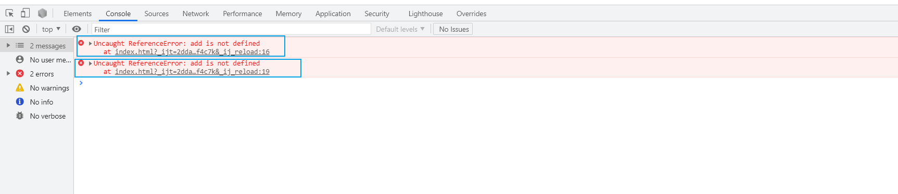

# 浏览器对ES6模块的支持

## 1. 参考资料

1. [浏览器ES6模块加载](https://juejin.cn/post/6890911361300168717)
   
2. [ES6模块加载实现，以及异步加载](https://juejin.cn/post/7002007274877091870)
   
3. [一篇文章帮你弄懂ES6模块化](https://juejin.cn/post/6844904003722018830) 
   
4. [浏览器支持ES6的最优解决方案](https://juejin.cn/post/6844903780207558663) 
   
5. [CommonJS 和 ES6 Module 究竟有什么区别？](https://juejin.cn/post/6844904080955932680)
    
6. [面试官让我解释什么是前端模块化](https://juejin.cn/post/6844903981311852551) 
   
7. [在浏览器中使用ES6的模块功能 import 及 export](https://juejin.cn/post/6844904037075124238) 
   
8. [ESM Import与Bundle Free](https://juejin.cn/post/6933844113267638280) 
   
9.  [ES6的模块加载，你们真的完全懂了吗？](https://juejin.cn/post/7001671927836180487) 
    
10. [JavaScript modules 模块](https://developer.mozilla.org/zh-CN/docs/Web/JavaScript/Guide/Modules) 
    
11. [Using Native JavaScript Modules in Production Today](https://philipwalton.com/articles/using-native-javascript-modules-in-production-today/) 
    
12. [在浏览器中使用JavaScript module(模块)](https://www.webhek.com/post/ecmascript-modules-in-browsers.html) 

13. [在浏览器中使用ES6的模块功能 import 及 export](https://segmentfault.com/a/1190000014342718) 

## 2. 浏览器兼容性

1. 各大浏览器对于 ES6 模块化的支持如下（截至到 2021 年 9 月）：
   - 导入 -- `import`： 
      
   - 导出 -- `export`：
     
   - 动态导入 -- `import()`：
     

2. 从上面的兼容性列表可以看出，当前主流的浏览器对于 ES6 的模块化支持程度已经很高了，可以在最新版本的浏览器中使用原生的 ES6 的模块。

## 3. 浏览器中使用 ES6 模块

1. 通常情况下，我们通过 `script` 标签引入 js 文件，或者是在 `script` 标签内部书写 js 代码。`script` 标签有一个 `type` 属性，默认是 `text/javascript`，因为我们通过 `script` 标签引入或者书写的都是 js 代码，因此可以省略 `type` 类型。

2. 在浏览器中使用原生 ES6 模块，也是通过 `script` 引入 js 模块，但是，要显示声明 `type` 为 `module`，这样浏览器才会把相关的代码当作 ES6 的模块来对待。如下所示：
   - 模块的目录结构：
     ```
        browser-modules
        |-- my-modules
            |-- myMath.js
        |-- index.html
        |-- index.js
     ```
   - `myMath.js` 是一个模块，内容如下：
     ```js
       // myMath.js 
        export function circleArea(x) {
            return x ** 2 * Math.PI;
       }
     ```
   - 在 `index.html` 中引入 `myMath.js` 这个模块：
     ```html
        <!DOCTYPE html>
        <html lang="en">
        <head>
            <meta charset="UTF-8">
            <title>浏览器中使用 ES6 模块</title>
        </head>
        <body>
            <h1>浏览器中使用 ES6 模块</h1>
        </body>
        <script type="module">
            import {circleArea} from './my-modules/myMath.js';

            console.log(circleArea(15))
        </script>
        </html>
     ```
   - 在浏览器中加载 `index.html`，注意，加载 `index.html` 必须使用 `http` 协议，不能使用 `file` 协议。如果使用 `file` 协议，加载模块时会因为跨域问题而被浏览器阻止。因此我们需要启动一个 `http` 服务器加载 `index.html`。加载成功后，浏览器输出如下：
     

3. 引入多个模块
   - 在 `index.html` 的同级目录下，新建一个 `index.js`，内容如下：
     ```js
        // index.js
        import {circleArea} from './my-modules/myMath.js';
        
     ```
   - 在 index.html 中引入：
     ```html
        <script type="module" src="./index.js"></script>
        <script type="module">
            import {circleArea} from './my-modules/myMath.js';

            console.log(circleArea(15));
        </script>
     ```
   - 输出如下：
     
   - 我们没有像第二个 `script` 标签那样，在 `script` 中的代码中引入别的模块中导出的内容，而是指定了 `script` 的 `src` 属性的值，通过这种方式引入 `index.js`，在 `index.js` 中，我们不仅引入了 `myMath.js` 中对外暴露的 `circleArea()` 方法，还有一个输出语句：`console.log(circleArea(35));`。浏览器不仅引入了 `circleArea()` 这个方法，还运行了 `index.js` 这个文件。

4. **注意**：我们导入的模块的作用范围是局部作用域，并不是全局作用域。即我们只能在引入这个模块的单独的脚本文件的范围使用这个模块对外暴露的内容，但是这些对外暴露的内容无法在全局获得。因此，我们只能在导入这些功能的脚本文件中使用他们，我们也无法通过 `Javascript` 的 console 中获取到他们。比如，我们仍然可以在  DevTools 中获取到语法错误，但是可能无法像以前一样使用一些 debug 技术。
   - 举例如下：
     ```html
        <script type="module">
            import {add} from './index.js';
            console.log(add(1, 5));
        </script>
        <script type="module">
            console.log(add(4, 7));
        </script>
     ```
     在第二个 `script` 脚本中，我们使用在第一个脚本中引入的 `add()` 方法，结果报错：`Uncaught ReferenceError: add is not defined`。
     说明模块的作用范围是局部作用域，在哪里用就在那里引入。

5. 下面这种引入模块的方式也不是全局作用域的：
   - index.js 的内容如下：
     ```js
        export function add(x, y) {
            return x + y;
        }
     ```
   - 以一个单独的 `script` 标签引入 `index.js` 模块，然后再其他 `script` 标签中使用 `add()` 方法，如下所示：
     ```html
        <script type="module" src="./index.js"></script>
        <script type="module">
            console.log(add(1, 5));
        </script>
        <script type="module">
            console.log(add(4, 7));
        </script>
     ```
   - 结果还是报错：
     
   - 因此，模块化就没有全局作用域，只有局部作用域，那里需要，就将其在那里引入。

## 4. 浏览器中使用 ES6 模块注意的地方

### 1. 不能写“裸”路径

1. 所谓的裸路径，就是直接指定 `src` 为一个文件名，而不加上任何路径，如下所示：
   ```html
      <script type="module">
           import {add} from 'index.js';
           console.log(add(1, 5));
      </script>
   ```
   输出如下：
   
   不给 `index.js` 指定路径，则无法加载这个模块。

2. 所以。我们可以写绝对路径和相对路径，但是不能直接写文件名，即使是同一层级下面的文件。也要加上 `./`。

### 2. 必须指定模块的后缀为 js

1. 如果不指定模块的后缀为 js，那么浏览器依旧无法解析这个模块。
   - 代码如下
      ```html
         <script type="module">
             import {add} from './index';
             console.log(add(1, 5));
         </script>
      ```
   - 加载报错：
     
     报 404，找不到这个模块文件，浏览器不会像 node 一样尝试补全后缀。

2. 因此我们引入一个模块的时候，必须指定模块文件的后缀是 js。

### 2. 向下兼容

1. 对于 不支持 `module` 类型的浏览器，使用 `nomodule` 关键字来实现浏览器的向下兼容。
   ```html
      <script type="module" src="./index.js"></script>
      <script nomodule src="fallback.js"></script>
   ```

2. 老的浏览器本身不会识别 `type="module"`，也就不会去有执行有`type="module"` 的 js 代码，但是还是会下载的这个 js 脚本。

3. 老的浏览器同时也不识别 `nomodule` 关键字，所以它会忽略 `nomodule`，即正常执行这个有 `nomodule` 标识的 js 脚本。而支持 `type="module"` 的浏览器，它会自动不去执行有 `nomodule` 关键字的js。甚至连下都不去下载。因此就实现了向下兼容。


4. 总结：
   - 支持模块化的浏览器能识别 `nomodule` 和 `type="module"`，因此会忽略带有 `nomodule` 关键字的 `script` 标签，而去下载执行 `type="module"` 的 `script` 中的 js 代码。
   - 老的浏览器不能识别 `nomodule` 和 `type="module"`。因为 我们指定了 `type="module"`，因此老浏览器不认为这是个 js 脚本，因此不会执行这个 js 脚本，而对于 `nomodule` 关键字，老浏览器同样也不认识这个关键字，因此会忽略这个关键字，而我们没有指定 `type`，所以会按照默认的 `type` 走，将其作为 js 代码执行。

5. 唯一的问题，还有一类浏览器，它支持 `type="module"` 的 ES6 特性，但是它不支持 `nomodule` 关键字。也就是说，即使有 `nomodule` 标识，它还是会去下载并且执行这个 js。即使它已经执行了 `type="module"` 的 js。这些浏览器有：
   - Firefox doesn't support nomodule (issue). Fixed in Firefox nightly!
   - Edge doesn't support nomodule (issue). Fixed in Edge 16!
   - Safari 10.1 doesn't support nomodule. Fixed in Safari 11!

### 3. 默认的加载方式

1. 模块的加载方式默认使用 `defer` 的加载方式。

2. 关于 `defer` 和 `async` 的区别是：`defer` 和 `async` 都是异步加载代码。但是 `defer` 要等到整个页面在内存中正常渲染结束（DOM 结构完全生成，以及其他脚本执行完成），才会执行。 `async` 一旦下载完，渲染引擎就会中断渲染，执行这个脚本以后，再继续渲染。 一句话，defer 是“渲染完再执行”，`async` 是“下载完就执行”。另外，如果有多个 `defer` 脚本，会按照它们在页面出现的顺序加载，而多个 `async` 脚本是不能保证加载顺序的。注意：没有指定 `defer` 和 `async` 关键字的脚本最先执行。

3. 举个例子，有三个脚本：`one.js`、`two.js` 和 `index.js`，内容如下：
   ```js
      // index.js
      import {circleArea} from './my-modules/myMath.js';

      export function add(x, y) {
          return x + y;
      }
      console.log(circleArea(35));

      // one.js
      console.log(11111111111111);

      // two.js
      console.log(222222222222);
   ```
4. 通过 `script` 标签引入，顺序如下，其中 `two.js` 指定了 `defer` 关键字：
   ```html
      <script type="module" src="./index.js"></script>
      <script src="./one.js"></script>
      <script defer src="./two.js"></script>
   ```
   输出如下：
   ```
      11111111111111
      3848.4510006474966
      222222222222
   ```
   没有指定 `defer` 关键字的 `one.js` 最先执行，而 `index.js` 通过模块的方式加载，加载方式为 `defer`，而 `two.js` 的加载方式也是 `defer`。而 `defer` 的加载方式是异步按顺序加载，因此先输出 `index.js` 的内容，后输出 `two.js` 中的内容。

5. 换一种引入顺序：
   ```html
      <script type="module" src="./index.js"></script>
      <script src="./one.js"></script>
      <script src="./two.js"></script>
   ```
   输出如下：
   ```
      11111111111111
      222222222222
      3848.4510006474966
   ```
6. 内联的 `script` 也是采用的 `defer` 加载模式，举例如下：
   ```html
      <script type="module">

          console.log(333333333333);

       </script>
       <script src="./one.js"></script>
       <script defer src="./two.js"></script>
   ```
   输出如下：
   ```
      11111111111111
      333333333333
      222222222222
   ```
7. 去掉 `two.js` 的 `defer` 关键字，如下所示：
   ```html
      <script type="module">

          console.log(333333333333);

       </script>
       <script src="./one.js"></script>
       <script src="./two.js"></script>
   ```
   输出为：
   ```
      11111111111111
      222222222222
      333333333333
   ```
7. 可以使用 `async` 的方式进行加载模块（包括其内联的 `import`），等同普通 js 采用 `async` 进行加载的方式：
   ```html
      <script type="module" async src="1.js"></script>
   ```

### 4. 多次加载同一模块，执行一次

1. 多次加载同一个模块，浏览器只执行一次，这个和 ES6 的模块加载机制一样：多次 `import` 只会被当成一次 `import` 处理。

2. 普通 JS 也只会被加载一次，但是会被执行多次。

3. 多次加载同一模块:
   ```html
      <script type="module" src="./index.js"></script>
      <script type="module" src="./index.js"></script>
      <script type="module" src="./index.js"></script>
   ```
   输出：`3848.4510006474966`

4. 多次加载普通的 js 脚本:
   ```html
      <script src="./one.js"></script>
      <script src="./one.js"></script>
      <script src="./one.js"></script>
   ```
   输出：
   ```
      11111111111111
      11111111111111
      11111111111111
   ```
### 5. 跨域限制

1. 浏览器默认不支持跨域请求模块，这一点儿与传统 js 或图片完全不一样。传统 js 或图片默认就是支持跨域的。

2. 如果想允许跨域请求 js 模块。需要在从服务器返回的 `header` 上显示的给予有效的 CORS声明：`Access-Control-Allow-Origin: *`。

### 6. Mime-Types

1. 不同于传统的 `scripts`, 对于 `type="module"` 的 `script` 标签，我们必须必须向浏览器提供有效的 `javascript` `MIME types`，不然请求到的模块 `javascript` 不会执行。即在响应头中设置 `content-type` 为 `application/javascript`。如下所示：
   
 