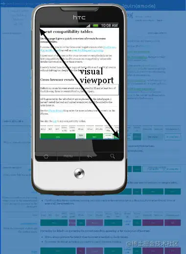

# 移动端适配与布局

## 1. 参考资料

1. [第三代移动端布局方案](https://segmentfault.com/a/1190000018850370)

2. [transform与position:fixed的那些恩怨](https://zhuanlan.zhihu.com/p/95021620)

3. [Rem布局的原理解析](https://zhuanlan.zhihu.com/p/30413803)

4. [移动端Web页面适配方案（整理版）](https://www.jianshu.com/p/2c33921d5a68)

5. [从网易与淘宝的font-size思考前端设计稿与工作流](https://www.cnblogs.com/lyzg/p/4877277.html)

6. [设备像素，CSS像素，设备独立像素](https://segmentfault.com/a/1190000015884091)

7. [移动端布局方案浅谈](https://segmentfault.com/a/1190000010412860)

8. [使用CSS3 REM 和 VW 打造等比例响应式页面的便捷工作流](https://zhuanlan.zhihu.com/p/23968868)

9. [HTML meta viewport属性说明(mark)](https://www.cnblogs.com/pigtail/archive/2013/03/15/2961631.html)

10. [移动前端开发之viewport,devicePixelRatio的深入理解](https://www.jianshu.com/p/413a25b2c503)

11. [【原创】移动端高清、多屏适配方案](http://www.html-js.com/article/Mobile-terminal-H5-mobile-terminal-HD-multi-screen-adaptation-scheme%203041)

12. [都2020移动端适配你还用flexible.js吗？vw+rem一行代码搞定](https://juejin.cn/post/6844904029898670088)

13. [纯 CSS 实现自适应正方形](https://segmentfault.com/a/1190000009476303)

## 1. 设备像素、CSS 像素和设备独立像素

### 1. 像素

1. 像素（Pel，pixel，pictureelement），为组成一幅图像的全部亮度和色度的最小图像单元。电视的图像是由按一定间隔排列的亮度不同的像点构成的，形成像点的单位也就是像素，组成图像的最小单位就是像素。从计算机技术的角度来解释，像素是硬件和软件所能控制的最小单位。它指显示屏的画面上表示出来的最小单位，不是图画上的最小单位。一幅图像通常包含成千上万个像素，每个像素都有自己的颜色信息，它们紧密地组合在一起。由于人眼的错觉，这些组合在一起的像素被当成一幅完整的图像。当修改图像的某区域，实际上是在修改该区域内的像素。对这些像素修改的好与坏将决定最终图片的质量。单位面积内的像素越多，图像的效果就越好。彩色电视图像是由成千个像素点所组成的，而且每个像素都是由红绿蓝三种颜色并排组成的。（注意每个像素的大小是不固定的，他是根据设备的分辨率决定的）

### 2. 设备像素

1. 设备像素，Device Pixel，简写为 DP，指的是设备屏幕的真实的像素数。

2. 设备像素又称**物理像素**，是设备能控制显示的最小单位，我们可以把它看做显示器上的一个点。我们常说的 1920x1080 像素分辨率就是用的设备像素单位。

### 3. css 像素

1. css像素是**web编程的概念**，它是**抽象的** ，实际上**不存在**。用于逻辑上衡量像素的单位。也就是我们做网页时用到的 css 像素单位。

2. css 像素是一个概念，并不是实际存在的。一个 css 像素在屏幕上如何显示，取决于屏幕和渲染方式。

### 4. 设备独立像素

1. 设备独立像素（Device Independent Pixel, DIP）也叫密度无关像素，可以认为是计算机坐标系统中的一个点，这个点表示一个可以由程序使用并控制的虚拟像素，可以由相关系统转换为物理像素（设备像素）。设备独立像素是一个整体概念，包括了css 像素，比如：css 像素，只是在 android 机中，css像素不叫 “css像素”，而叫“设备独立像素”。

### 5. 设备像素和设备独立像素的关系

1. 设备像素是设备的屏幕的实际像素数（屏幕上的一个点），而设备独立像素则是一个概念，可以认为其是计算机坐标系统中的一个点，这个点表示一个可以由程序使用并控制的虚拟像素，可以由相关系统转换为设备像素。那么二者之间的关系是怎样的呢，换句话说，一个设备独立像素对应几个设备像素呢？

2. 一般来说，设备像素和设备独立像素之间的关系，分为 PC 端和移动端，如下所示：
   - PC 端：1 个设备独立像素等于1个设备像素（在100% 未缩放的情况下），如果缩放到200%，则1个设备独立像素等于2个设备像素。
   - 移动端：根据设备不同，有很大差异。

### 6. PPI 和 DPR

1. PPI，是 Pixel Per Inch 的缩写，即每英寸像素数，计算公式如下：
     

2. 上面的公式中，屏幕尺寸指的是屏幕的对角线的长度，单位是英寸。

3. 所谓的视网膜（Retina）屏幕，指的是 ppi 大于 300 的屏幕。这个概念是苹果在发布 iPhone 4 的时候提出的概念，乔布斯认为，ppi 大于 300 的时候，人眼已无法分辨屏幕上的像素。

4. 因为移动端设备差异比较大，而且随着屏幕技术发展和厂商竞争的加剧，应用 1080p、2160p 分辨率的屏幕的设备层出不穷，这些设备的 ppi 比较高，因此，设备像素与设备独立像素的关系也不一定是一一对应的关系。而 UE 在出设计稿的时候，不可能根据每个设备单独出一套，为了解决这个问题，引入了 DPR 这个概念。

5. 为什么我们需要获得设备像素与设备独立像素之间的比例关系呢，假设我们有一张图片，分辨率是 100 x 100，单位是 px，注意，这个单位不是设备像素，是类似于设备独立像素的一个单位。在设备 A 上面，设备像素和设备独立像素是1比1的关系，那么图片在屏幕上的实际尺寸是 100 × 100，正常显示。那么假设有一款设备 B，其设备分辨率是设备 A 的 2 倍，在尺寸不变的情况下，设备 B 的设备像素是设备 A 的一半。如果设备 B 的设备像素和设备独立像素的比例还是 1 比 1，那么同样的图片在设备 B 的屏幕上实际尺寸就是 50 × 50。看起来缩小了很多。这也就是同样的尺寸的内容，在分辨率越高的设备上显示的实际尺寸就越小（特别是 windows 系统的电脑）。

6. DPR，Device Pixel Ratio，设备像素比，指的是设备像素与设备独立像素的比值（横向或者纵向），计算公式如下：`DPR = 设备像素 / 设备独立像素`

7. DPR 描述了一个设备像素等于几个设备独立像素。（CSS 像素）。在浏览器中，可以通过 `window.devicePixelRatio` 获取到当前设备的 dpr。在 css 中，可以通过 `-webkit-device-pixel-ratio`，`webkit-min-device-pixel-ratio` 和 `-webkit-max-device-pixel-ratio` 进行媒体查询。

8. DPR 的最大意义就是，我们可以以某个设备的分辨率为标准来设计 UI 稿，对于不同的设备，我们只需要获得其设备的 DPR，那么根据设备的 DPR 对设计稿进行尺寸上的调整，这样就能在不同的设备上获得相同的体验。

9. 同样还是 100 × 100 的图片，如果设备 B 的 DPR 是 2，即两个设备像素对应一个设备独立像素，那么 图片在设备 B 的显示的实际尺寸还是 100 × 100。保持了内容尺寸的一致性。

10. 设备像素的大小是固定的，是不可变的。而设备独立像素是可以被拉长或压缩的。这个该怎么理解呢？看下图。
  

11. 看一个实际的例子，以 iPhone 6 为例，其设备宽高为 375 × 667，可以理解为设备独立像素，一般来说，设计稿也是这样的尺寸。iPhone 6 的 DPR 为 2，即一个设备独立像素对应两个设备像素。所以这个设计稿对应的设备的物理像素是 750 × 1334。如下图所示：
    

12. 从上图中可以看出，对于这样的css样式：
    ```css
       width: 2px;
       height: 2px;
    ```
    在不同的屏幕上(普通屏幕 / retina屏幕)，css 像素所呈现的大小(物理尺寸)是一致的，不同的是 1 个 css 像素所对应的物理像素个数是不一致的。
    - 在普通屏幕下，1 个 css 像素对应 1个物理像素（1:1）。 
    - 在 retina 屏幕下，DPR = 2，1 个 css 像素对应 4 个物理像素（1:4）。

## 2. rem、em、vh 和 vw

1. rem 是 CSS3 新增单位，是一个相对单位，相对的基础是根元素（一般是 html 元素）字体的大小。

2. em 也是一个相对单位，MDN 上对其的解释是：em 作为字体的单位时，其代表父元素的字体大小，em 作为其他属性单位时，代表自身字体大小。

3. vh 是 CSS3 新增的单位，其表示的是视口（页面的可视区域）高度的 1%。

4. vw 是 CSS3 新增的单位，其表示的是视口（页面的可视区域）宽度的 1%。

5. vmin 是 CSS3 新增的单位，视口高度 vw 和宽度 vh 两者之间的最小值。

6. vmax 是 CSS3 新增的单位，视口高度 vw 和宽度 vh 两者之间的最大值。

### 1. viewport

1. 视口（viewport）代表当前可见的计算机图形区域。在 Web 浏览器术语中，通常与浏览器窗口相同，但不包括浏览器的UI， 菜单栏等——即指你正在浏览的文档的那一部分。

2. 移动端配置视口的方式是在 html 中添加一个 meta 标签：
   `<meta name="viewport" content="width=device-width; initial-scale=1; maximum-scale=1; minimum-scale=1; user-scalable=no;">
   `
3. meta 标签的每个属性的含义：
   
   属性|含义|取值
   :---:|:---:|:---:
    width|定义视口的宽度，单位为像素|正整数或者是设备宽度 device-width
    height|定义视口的高度，单位为像素|正整数或者是设备高度 device-height
    initial-scale|定义初始缩放值|整数或者小数
    minimum-scale|定义最小的缩放比例，必须小于或者等于 maximum-scale 设置的值|整数或者小数
    maximum-scale|定义的最大缩放比例，它必须大于或者等于 minimum-scale 设置的比例|整数或者小数
    user-scalable|定义是否允许用户手动缩放页面，默认是 yes|yes/no

#### 1. layout viewport

1. layout viewport 为布局视口，即网页布局的区域，它是 html 元素的父容器，只要不在 css 中修改  元素的宽度， 元素的宽度就会撑满 layout viewport 的宽度。
很多时候浏览器窗口没有办法显示出 layout viewport 的全貌，但是它确实是已经被加载出来了，这个时候滚动条就出现了，你需要通过滚动条来浏览 layout viewport 其他的部分。
layout viewport 用 css 像素来衡量尺寸，在缩放、调整浏览器窗口的时候不会改变。缩放、调整浏览器窗口改变的只是 visual viewport。

2. 在桌面浏览器中，缩放100% 的时候，Layout Viewport 宽度等于内容窗口的宽度。（你几乎不会在电脑上见过横向滚动条，除非你调整缩放）

3. 但是在移动端，缩放为 100% 的时候，Layout Viewport 不一定等于内容窗口的大小。当你用手机浏览浏览宽大的网页（这些网页没有采用响应式设计）的时候，你只能一次浏览网页的一个部分，然后通过手指滑动浏览其他部分。这就说明整个网页（Layout Viewport）已经加载出来了，只不过你要一部分一部分地看。

4. layout viewport 示例：
   

#### 2. visual viewport

1. visual viewport 为视觉视口，就是显示在屏幕上的网页区域，它往往只显示 layout viewport 的一部分。

2. visual viewport 就像一台摄像机，layout viewport 就像一张纸，摄像机对准纸的哪个部分，你就能看见哪个部分。你可以改变摄像机的拍摄区域大小（调整浏览器窗口大小），也可以调整摄像机的距离（调整缩放比例），这些方法都可以改变 visual viewport，但是 layout viewport 始终不变。

3. visual viewport 示例：
   

#### 3. ideal viewport

1. ideal viewport 为理想视口，不同的设备有自己不同的 ideal viewport，ideal viewport 的宽度等于移动设备的屏幕宽度，所以其是最适合移动设备的 viewport。只要在 css 中把某一元素的宽度设为 ideal viewport 的宽度（单位用 px），那么这个元素的宽度就是设备屏幕的宽度了，也就是宽度为100% 的效果。    
2. ideal viewport 的意义在于，无论在何种分辨率的屏幕下，那些针对ideal viewport 而设计的网站，不需要用户手动缩放，也不需要出现横向滚动条，都可以完美的呈现给用户。

3. 一般来说，移动端视口要想视觉效果和体验好，那么设置的视口宽度必去无限接近理想视口。

4. 移动设备默认的 viewport 是 layout viewport，也就是那个比屏幕要宽的 viewport，但在进行移动设备网站的开发时，我们需要的是 ideal viewport。那么怎么才能得到 ideal viewport 呢？

5. 一般来说，我们这样设置：`<meta name="viewport" content="width=device-width; initial-scale=1; maximum-scale=1; minimum-scale=1; user-scalable=no;">
   ` 该 meta 标签的作用是让当前 viewport 的宽度等于设备的宽度，同时不允许用户手动缩放。这样就可以使得 layout viewport 与 ideal viewport 相同。


## 3. 响应式布局

1. 响应式布局的概念：响应式布局指的是同一页面在不同屏幕尺寸下有不同的布局。传统的开发方式是 PC 端开发一套，手机端再开发一套，而使用响应式布局只要开发一套就够，使用 css 进行适配。响应式布局的缺点就是 css 比较重，需要针对不同的屏幕尺寸书写不同的样式。

2. 响应式设计与自适应设计的区别：
   - 响应式开发一套界面，通过检测视口分辨率，针对不同客户端在客户端做代码处理，来展现不同的布局和内容。
   - 自适应需要开发多套界面，通过检测视口分辨率，来判断当前访问的设备是 pc 端、平板、手机，从而请求服务层，返回不同的页面。

### 1. flex 布局

1. 严格来说。flex 布局是弹性布局，并不是响应式布局。

2. flex 布局主要是用来实现页面布局的。使用时，并不考虑是什么设备（PC 端、移动端）或者是什么屏幕（大屏、小屏）。

3. 使用了 flex 布局以后，当页面进行缩放时，浏览器能根据当前页面的宽度，自动计算容器内的项目的宽度和项目之间的间隙。但是如果页面宽度比较小，会导致所有项目挤在一起，页面的布局就回完全乱掉。

4. 示例（使用 pc 端浏览器，dpr = 2）：
   - html 代码：
     ```html
        <div class="container">
        <div class="item child-1">1</div>
        <div class="item child-1">2</div>
        <div class="item child-1">3</div>
        <div class="item child-1">4</div>
        <div class="item child-1">5</div>
        </div>
     ```
   - css 样式：
     ```css
        .container {
            display: flex;
            justify-content: space-between;
            overflow: hidden;
        }

        .container .item {
            width: 70px;
            height: 50px;
            text-align: center;
            line-height: 50px;
            background-color: pink;

        }
     ```
5. 窗口宽度为 1100px 时， 布局如下：
   

6. 窗口宽度为 880px 时， 布局如下：
   

7. 窗口宽度为 500px 时， 布局如下：
   

8. 窗口宽度为 370px 时，布局如下：
   

9. 因为我们给元素指定了宽度，所以只是元素之间的间隙变小了，如果没有指定元素宽度，而是依赖于元素的内容撑开的宽度，那么元素的大小也可能随着窗口的大小发生变化，有可能导致元素内部的布局错乱。因此使用 flex 布局，只能结局一定的窗口尺寸变化的情况下，页面布局稳定的问题，并不能实现响应式布局。

### 2. 百分比布局

1. 给元素的宽高设置为百分比单位，当浏览器的宽度或者高度发生变化时，通过百分比单位可以使得浏览器中的组件的宽和高随着浏览器的变化而变化，从而实现响应式的效果。

2. `width`、`height` 属性的百分比依托于父标签的宽高。就是说，子元素的 `width` 的百分比是相对于父元素的宽度，子元素的 `height` 的百分比是相对于父元素的高度。

3. `padding`、`border`、`margin` 等属性的情况又不一样，具体如下表所示：

   属性|百分比单位的含义
   :---:|:---:
   子元素的 `top` 和 `bottom` | 直接非 `static` 定位（默认定位）的父元素的高度
   子元素的 `left` 和 `right`| 相对于直接非 `static` 定位（默认定位）父元素的宽度
   子元素的 `padding` | 不论是垂直方向或者是水平方向，都相对于直接父亲元素的 `width`，而与父元素的 `height` 无关
   子元素的 `margin`|不论是垂直方向还是水平方向，都相对于直接父元素的`width`，与 `height` 无关
    `border-radius`|相对于自身的宽度

4. 使用百分比进行响应式布局的缺点：
   - 计算困难，如果我们要定义一个元素的宽度和高度，按照设计稿，必须换算成百分比单位。
   - 各个属性中如果使用百分比，相对父元素的属性并不是唯一的。比如 `width` 和 `height` 相对于父元素的 `width` 和 `height`，而 `margin`、`padding` 不管垂直还是水平方向都相对比父元素的宽度、`border-radius` 则是相对于元素自身等等，就是没有一个统一的作为比较基准的属性。这样就造成我们使用百分比单位容易使布局问题变得复杂。

5. 因此，不建议用百分比单位来做响应式布局。


### 3. 媒体查询

1. 使用`@media` 媒体查询可以针对不同的媒体类型定义不同的样式，特别是响应式页面，可以针对不同屏幕的大小，编写多套样式，从而达到自适应的效果。

2. 媒体查询是使用纯 css 的方式进行响应式布局。语法如下：
   ```
      @media <media-query-list> {
          <group-rule-body>
      }

      where
      <media-query-list> = <media-query>#

      where
      <media-query> = <media-condition> | [ not | only ]? <media-type> [ and <media-condition-without-or> ]?

      where
      <media-condition> = <media-not> | <media-and> | <media-or> | <media-in-parens>
      <media-type> = <ident> (en-US)
      <media-condition-without-or> = <media-not> | <media-and> | <media-in-parens>

      where
      <media-not> = not <media-in-parens>
      <media-and> = <media-in-parens> [ and <media-in-parens> ]+
      <media-or> = <media-in-parens> [ or <media-in-parens> ]+
      <media-in-parens> = ( <media-condition> ) | <media-feature> | <general-enclosed>

      where
      <media-feature> = ( [ <mf-plain> | <mf-boolean> | <mf-range> ] )
      <general-enclosed> = [ <function-token> <any-value> ) ] | ( <ident> (en-US) <any-value> )

      where
      <mf-plain> = <mf-name> : <mf-value>
      <mf-boolean> = <mf-name>
      <mf-range> = <mf-name> [ '<' | '>' ]? '='? <mf-value> | <mf-value> [ '<' | '>' ]? '='? <mf-name> | <mf-value> '<' '='? <mf-name> '<' '='? <mf-value> | <mf-value> '>' '='? <mf-name> '>' '='? <mf-value>

      where
      <mf-name> = <ident> (en-US)
      <mf-value> = <number> | <dimension> | <ident> (en-US) | <ratio>
   ```
   - 说明：用于基于一个或多个媒体查询 的结果来应用样式表的一部分。使用它，可以指定一个媒体查询和一个 CSS 块，当且仅当该媒体查询与正在使用其内容的设备匹配时，该 CSS 块才能应用于该文档。
   - `media-query-list`：预期的媒体类型，可以是 `print`、`screen` 或者是 `all`。
   - `media-condition`：这个媒体需要满足的条件。可以是 `and`、`or` 和 `not` 等。后面用小括号跟着一个条件，如 `and (max-width: 1200px)`，表示这个设备的屏幕宽度在 1200px 以内时使用指定的样式。可以给一个媒体类型使用多个条件。
   - 使用参考：[Using media queries](https://developer.mozilla.org/en-US/docs/Web/CSS/Media_Queries/Using_media_queries)

3. 使用媒体查询进行响应式布局的示例代码如下：
   ```css
      @media screen and (max-width: 960px) {
            body {
                background-color:#FF6699;
                font-size: 40px;
                color: green;
            }
        }

        @media screen and (max-width: 768px) {
            body {
                background-color:#00FF66;
                font-size: 30px;
                color: yellow;
            }
        }

        @media screen and (max-width: 550px) {
            body {
                background-color:#6633FF;
                font-size: 20px;
                color: red;
            }
        }

        @media screen and (max-width: 320px) {
            body {
                background-color:#FFFF00;
                font-size: 15px;
                color: palegreen;
            }
        }

   ```
   html 代码如下：
   ```html
      <body>
          <h1>@media query</h1>
          <div>hello world</div>
      </body>
   ```
4. 通过媒体查询定义了几套 css 样式，通过 max-width 设置样式生效的最大分辨率。上面的媒体查询分别设置了分辨率在 0 ~ 320px、320px ~ 550px、550 px ~ 768px 以及 768px ~ 960px 的屏幕设置了不同的背景颜色。不同分辨率下的应用的样式如下所示：
   - 300px：
     
   - 450px：
     
   - 600px：
     
   - 850px：
     

5. 注意，如果在移动端使用媒体查询这个特性，我们必须在 header 标签中加一个 meta 标签，内容如下：
   - `<meta name="viewport" content="width=device-width, user-scalable=no, initial-scale=1.0, maximum-scale=1.0, minimum-scale=1.0">`
   - 我的理解是，添加了这个 meta 标签后，指定了视口的宽度为设备的宽度，这样，浏览器就知道当前页面的宽度，从而能应用媒体查询设置的样式。

7. 通过媒体查询，可以通过给不同分辨率的设备编写不同的样式来实现响应式的布局，比如我们为不同分辨率的屏幕，设置不同的背景图片。比如给小屏幕手机设置 `@2x` 图，为大屏幕手机设置 `@3x` 图，通过媒体查询就能很方便的实现。

8. 不管是移动优先还是 PC 优先，都是依据当随着屏幕宽度增大或减小的时候，后面的样式会覆盖前面的样式。因此，移动端优先首先使用的是`min-width`，PC 端优先使用的 `max-width`。

9. 媒体查询的缺点：
   - 浏览器大小改变时，需要改变的样式过多。
   - 分辨率的临界点不好确定。一般来说，是以 boostrap 的标准为依据的。
   - 如果再多一种屏幕尺寸，就得多写一个 @media 查询块，比较繁琐。

### 4. vh/vw

1. css3中引入了一个新的单位 vw/vh，与视图窗口有关，vw 表示相对于视图窗口的宽度，vh 表示相对于视图窗口高度。

2. 任意层级元素，在使用 vw 单位的情况下，1vw 都等于视图宽度的百分之一。

### 5. rem

1. rem 是 css3 中新增加的单位，是一个相对单位，相对的是根元素（一般是 html 元素）字体的大小。 默认情况下，`html` 元素的 `font-size` 为 16 px。所以此时 1rem = 16px。

2. rem 在移动端的支持度很高，`Android2.x+`，`ios5+` 都支持。rem 单位都是相对于根元素 html 的 font-size 来决定大小的，根元素的 font-size 相当于提供了一个基准，当页面的 size 发生变化时，只需要改变 font-size 的值，那么以 rem 为固定单位的元素的大小也会发生响应的变化。 因此，如果通过 rem 来实现响应式的布局，只需要根据视图容器的大小，动态的改变 font-size 即可。
   
3. rem 响应式的布局思想：
   - 一般不要给元素设置具体的宽度，但是对于一些小图标可以设定具体宽度值。
   - 高度值可以设置固定值，设计稿有多大，我们就严格有多大。

4. 所有设置的固定值都用 rem 做单位
   - 首先在 HTML 总设置一个基准值：px 和 rem 的对应比例，然后在效果图上获取 px 值，布局的时候转化为rem值。
   - js获取真实屏幕的宽度，让其除以设计稿的宽度，算出比例，把之前的基准值按照比例进行重新的设定，这样项目就可以在移动端自适应了。

5. rem 布局的缺点：
   - 在响应式布局中，必须通过 js 来动态控制根元素 font-size 的大小，也就是说 css 样式和 js 代码有一定的耦合性，且必须将改变 font-size 的代码放在 css 样式之前。

6. 根据屏幕宽度，动态改变根元素的字体大小：
     ```js 
        /*上述代码中将视图容器分为 10 份，font-size 用十分之一的宽度来表示，最后在 header 标签中执行这段代码，就可以动态定义 font-size 的大小，从而 1rem 在不同的视觉容器中表示不同的大小，用 rem 固定单位可以实现不同容器内布局的自适应。*/
        function refreshRem() {
            var docEl = doc.documentElement;
            var width = docEl.getBoundingClientRect().width;
            var rem = width / 10;
            docEl.style.fontSize = rem + 'px';
            flexible.rem = win.rem = rem;
        }
        win.addEventListener('resize', refreshRem);
     ```
   

## 4. 移动端布局方案

### 1. viewport 方案 - vw + rem

1. 由于 viewport 单位得到众多浏览器的兼容，因此基于 viewport 的移动端适配方案得到了广泛的使用。

2. 移动端适配的目的是：**在屏幕大小不同的终端设备拥有统一的界面，让拥有更大屏幕的终端展示更多的内容**。

3. rem 布局的本质是等比缩放，一般是基于宽度。也就是说，使用了 rem 这个单位的元素，要大大家一起大，要小大家一起小，在大小不同的情况下，能保持元素之间的比例（大小、布局）不变。
#### 1. 布局方案

1. 设置一个 meta 标签：
   `<meta name="viewport" content="width=device-width, initial-scale=1.0, maximum-scale=1.0, user-scalable=0">`

2. 根节点 - html 元素的字体设置为：`26.666666666vw`。如下所示：
   ```html
      <!DOCTYPE html>
        <html lang="en" style="font-size: 26.666666vw">
         ....
        </html>  

   ```

3. 设置具体元素的宽高。假设有一个 div 的宽度是 100px，高度是 20px，那么转换为 rem，如下所示：
   ```css
      div {
          width: 1rem;
          height: 0.2rem;
      }
   ```
   换算方式后面在解释。

#### 2. 布局原理

1. 常见的设计图宽度是 375px，当然也可以是其他的宽度，比如 720 px 的：
   - 375 iPhone7
   - 750 二倍图
   - 320 iPhone5
   - 640 二倍图

2. 为什么给的是 375？因为这个是 iPhone7 的宽度，也就是说最低兼容到 375 像素的屏幕。（低于 375 布局可能会乱）。

3. 为什么指定 html 元素的根字体大小是 `26.666666vw` 呢？

4. 首先明确这样一个原则：`设计图的宽度 = 设备宽度`。 假如设计图的宽度为 375px，当然可以是其他的，如果是 640px 或者 750px 就把 375 换成对应的数值。换算方法如下所示：
   - 因为 `375px = 100vw`，那么 `1px = 100 / 375 vw = 0.26666666666666666vw`，这里的 1px 指的是设计稿中的 1px，因为 vw 是一个相对单位，不同的设备的 `1vw` 是不一样的（具体到多少像素），因此需要进行换算，这样的话，我们只需要换算一次，设计稿中的其他元素的宽高就可以按照这个比例进行换算。
   - 为了方便计算，放大一百倍，精确到 6 位，只能下取舍，因为上取舍，计算宽度的时候会大于页面宽度，从而出现滚动条。故：`100px = 26.666666vw`。
   - 给 html 元素标签设置 `font-size` 为 `26.666666vw`。`1rem` 为 `font-size` 的大小。
   - 所以： `1rem = 100px`。注意，这里的 `100px` 指的是设计稿中的 `100px`，为什么要使用 `100px` 作为 1rem 呢，我理解就是方便计算，对于设计稿中的任何元素，其宽高单位也是 px，那么换算为 rem 时，只需要除 100 即可，换句话说，就是小数点向前移动两位即可。这样非常方便的就完成了单位的转换，没有什么心智负担。
   - 设计图上的 `12px` 换算成 rem 就是 `0.12rem`，`20px` 就写成 `0.2rem` 即可。因为 html 元素的字体始终为 `26.666666vw`，所以就可保证，对于任何支持 vw 单位的设备，都可以保证设备页面中元素的大小、位置和整体页面的比例关系同设计稿中的保持一致。

### 3. 移动端布局示例

1. 示例代码 - html：
   ```html
      <!DOCTYPE html>
      <html lang="en" style="font-size: 26.666666666vw">
      <head>
       <meta charset="UTF-8">
       <meta name="viewport" content="width=device-width, user-scale=no, initial-scale=1.0, maximum-scale=1.0, minimum-scale=1.0">
       <title>移动端布局 - rem + vw</title>
      </head>
      <body>
          <div class="container">
              <div class="item num-1">1</div>
              <div class="item num-2">2</div>
              <div class="item num-3">3</div>
              <div class="item num-4">4</div>
              <div class="item num-5">5</div>
          </div>
      </body>
      </html>
   ```
   - 设置了 mata 标签，定义了视口相关的内容。
   - 指定了 html 元素的字体大小为 `26.666666666vw`，使用了行内样式，保证字体大小的优先级是最高的。 
2. 示例代码 - css：
   ```css
      body {
            font-size: 0.2rem;
            background-color: #666;
        }
        .container {
            /*width: 1.5rem;*/
            /*margin: 0 auto;*/
            display: flex;
            justify-content: space-between;
        }

        .item {
            width: 0.3rem;
            height: 0.3rem;
            background: pink;
            border-radius: 0.05rem;
            line-height: 0.3rem;
            text-align: center;
            color: yellowgreen;
        }
   ```
   - 因为 html 元素设置了字体的大小，页面中的其他元素的字体会默认继承这个字体大小，显然，`1rem` 的字体太大了，因此，我们需要在 body 中重新设置字体的大小，这样元素内部字体的大小就会继承 body 的大小。
   - item 的宽高都可以使用 rem 作为单位。

3. 图示如下：
   - iPhone se，其分辨率为 375px × 667px，1rem = 100px。item 这个元素的被浏览器渲染后，实际的宽高是 30px × 30px。  
     
   - iphone 12 pro，其分辨率为 390px × 844px，1rem = 104px。item 这个元素的被浏览器渲染后，实际的宽高是 31px × 31px。  
     
   - ipad air，其分辨率为 820px × 1180px，1rem = 216.6666612px。item 这个元素的被浏览器渲染后，实际的宽高是 65.6px × 65.6px。  
     
   

     