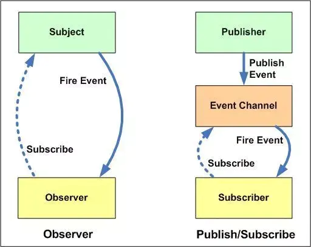

<!-- START doctoc generated TOC please keep comment here to allow auto update -->
<!-- DON'T EDIT THIS SECTION, INSTEAD RE-RUN doctoc TO UPDATE -->
**Table of Contents**  *generated with [DocToc](https://github.com/thlorenz/doctoc)*

- [订阅/发布模式](#%E8%AE%A2%E9%98%85%E5%8F%91%E5%B8%83%E6%A8%A1%E5%BC%8F)
  - [1. 订阅/发布模式的基本说明](#1-%E8%AE%A2%E9%98%85%E5%8F%91%E5%B8%83%E6%A8%A1%E5%BC%8F%E7%9A%84%E5%9F%BA%E6%9C%AC%E8%AF%B4%E6%98%8E)
  - [2. 参考资料](#2-%E5%8F%82%E8%80%83%E8%B5%84%E6%96%99)
  - [3. 实现思路](#3-%E5%AE%9E%E7%8E%B0%E6%80%9D%E8%B7%AF)
  - [4. 代码实现](#4-%E4%BB%A3%E7%A0%81%E5%AE%9E%E7%8E%B0)
  - [5. 总结](#5-%E6%80%BB%E7%BB%93)
    - [1. 优点](#1-%E4%BC%98%E7%82%B9)
    - [2. 缺点](#2-%E7%BC%BA%E7%82%B9)
  - [6. 订阅发布模式与观察者模式的区别](#6-%E8%AE%A2%E9%98%85%E5%8F%91%E5%B8%83%E6%A8%A1%E5%BC%8F%E4%B8%8E%E8%A7%82%E5%AF%9F%E8%80%85%E6%A8%A1%E5%BC%8F%E7%9A%84%E5%8C%BA%E5%88%AB)

<!-- END doctoc generated TOC please keep comment here to allow auto update -->

# 订阅/发布模式

## 1. 订阅/发布模式的基本说明

1. 订阅/发布模式 类似于观察者模式，是一种对象之间的一对多依赖关系，当一个对象的状态发生变化的时候，所有依赖这个对象状态的其他对象都会得到状态改变的通知。

2. 订阅者（subscriber）将订阅事件注册（subscribe）到调度中心（Event Channel），当发布者（Publisher）发布该事件（Publish Event）到调度中心，也就是该事件触发，由调度中心同一调度（Fire Event）订阅者注册到调度中心的函数。

3. 订阅/发布机制示例
   - 订阅公众号后，公众号更新后，我们会收到更新的内容。
   - redux 中的 store 对象更新后，所有订阅了 store 的对象都能收到最新的 store，从而进行更新。
   - 浏览器的事件机制。
   - Promise

## 2. 参考资料

1. [NodeJS中的事件（EventEmitter） API详解（附源码）](https://juejin.cn/post/6844903678227251213)
1. [JavaScript 发布-订阅模式](https://juejin.cn/post/6844903850105634824)
1. [JavaScript中发布/订阅模式的理解](https://juejin.cn/post/6844903624468856846)

## 3. 实现思路

1. 创建一个类

2. 创建一个缓存列表（调度中心），用来注册事件和添加处理函数

3. 定义 on() 方法，用来注册事件。包括两个内容：事件名称和事件处理函数

4. 定义 emit() 方法，用来触发事件，包括两个内容：事件名称和数据。根据事件名称在缓存列表中找到对应的处理函数，然后传入数据并依次执行。

5. 定义 remove() 方法，用来移除事件

6. 定义 once() 方法，只监听一次，调用完毕后删除缓存函数

## 4. 代码实现

1. 基本代码实现

   ```javascript
      class Event {
             constructor() {
                 // 缓存订阅者绑定的函数
                 // this.fnList= [];
                 // 缓存事件标识
                 this.subscribeObj = {};
             }
         
         
             /**
              *
              * @param key
              * @param fn
              */
             on = (key, fn) => {
                 if (typeof fn !== 'function') {
                     throw Error('invalid argument');
                 }
                 // key 是事件名称
                 if (!this.subscribeObj[key]) {
                     // 创建缓存函数的列表
                     this.subscribeObj[key] = [];
                 }
                 // 将同一事件的回调函数放入缓存数组中
                 this.subscribeObj[key].push(fn);
             }
         
             /**
              *
              * @param rest
              */
             emit = (...rest) => {
                 // 取出函数的第一个参数，是事件名称
                 const key = rest[0];
                 // 第二个参数以及后面的参数
                 const args = rest.slice(1);
                 // 根据 key 取出缓存函数
                 const fn = this.subscribeObj[key];
         
                 if (!fn || fn.length === 0) {
                     // 没有缓存的函数，终止函数执行
                     return ;
                 }
                 // 依次执行缓存的函数
                 fn.forEach(f => {
                     f.apply(this, args);
                 });
             }
         
             /**
              * 移除某个订阅事件的回调函数，注意，移除的不能是匿名函数
              * @param key
              * @param fn
              */
             remove = (key, fn) => {
                 // 根据 key 取出缓存的函数列表
                 let fnList = this.subscribeObj[key];
                 if (!fnList) {
                     // 如果没有缓存函数，就终止函数执行
                     return;
                 }
         
                 if (!fn) {
                     // 如果没有指定回调函数，那么就清空指定事件的所有的缓存函数
                     fnList && (fnList.length = 0);
                 }
         
                 const length = fnList.length;
                 for (let i = 0; i < length; i++) {
                     let _fun = fnList[i];
                     if (_fun === fn) {
                         // 移除具体的回调函数
                         fnList.splice(i, 1);
                     }
                 }
         
             }
         }
   ```

## 5. 总结

### 1. 优点

1. 对象之间解耦

2. 支持异步模式

3. 可以实现跨组件、跨级别通信

### 2. 缺点

1. 创建订阅者本身需要消耗一定的时间和内存

2. 虽然弱化了对象之间的联系，多个发布者和订阅者嵌套在一起的时候，程序难以跟踪

## 6. 订阅发布模式与观察者模式的区别

1. 观察者模式和订阅发布模式还是有区别的，首先看下图：
   

2. 观察者模式：观察者（observer）直接订阅（subscribr）主题（subject），当主题被激活或者更新的时候，会触发（Fire Event）观察者里的事件。

3. 订阅发布模式：订阅者（subscriber）将订阅事件注册（subscribe）到调度中心（Event Channel），当发布者发布事件（Publish Event）到调度中心时， 就会触发（Fire Event）该事件，然后由调度中心统一调用该事件的处理函数。

4. 二者的差异
   - 观察者模式中，观察者知道主题的存在，而主题一直保持着多观察者的记录。而订阅发布模式中，发布者和订阅者彼此不知道对方的存在，二者通过调度中心联系到一起。
   - 观察者模式中，观察者和主题是紧密耦合的，而订阅发布模式中，订阅者和发布者时松散耦合的。
   - 观察者模式大多数是同步执行，即主题有更新，立刻通知观察者，而订阅发布模式大多数是异步的（使用消息队列）。
   - 观察者模式需要在单个应用程序地址空间中实现，而发布-订阅更像交叉应用模式

