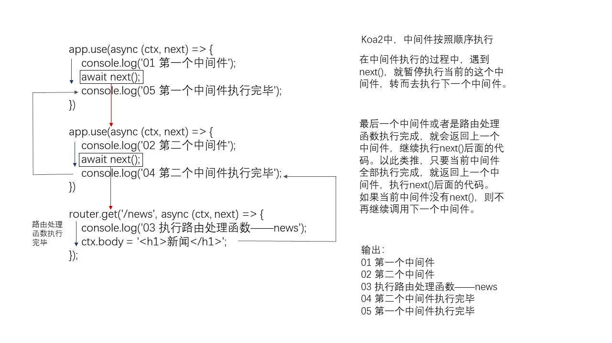

# Koa2 基本用法总结
 
## 相关资料

1. [官方教程 - guide](https://github.com/koajs/koa/blob/master/docs/guide.md)
   
2. [官方 github 地址](https://github.com/koajs)

3. [koa2 中间件列表](https://github.com/koajs/koa/wiki#middleware)

4. [koa2 官方示例](https://github.com/koajs/examples)

5. [koa 官网 - 英文](https://koajs.com)

6. [Koa2教程（入门篇）](https://www.jianshu.com/p/5ba990127978)


## 1. Koa2 的基本使用

1. Koa2 需要 v7.6.0 及其更高版本的 Node.js，在这个版本及以上的 node 支持 ES 2015 以及 async/await 函数。

2. 安装 Koa2：`npm install koa --save`

3. 使用 koa 编写 web 应用，可以免除重复繁琐的回调函数嵌套，并极大地提升错误处理的效率。koa 不在内核方法中绑定任何中间件，它仅仅提供了一个轻量优雅的函数库，使得编写 Web 应用变得得心应手。最大的特点就是可以避免异步嵌套。

4. Koa2 使用中间件机制，本身只提供基础的 http 服务，路由处理、日志打印、异常处理等都需要中间件来实现。

5. 基本使用 -- 启动一个 web 服务：
   ```js
      const Koa = require('koa');
      const app = new Koa();
      
      // 引入中间件
      app.use(async (ctx) => {
          ctx.body = '<h1>Hello Koa2</h1>';
      });
      // 监听端口
      app.listen(7001);
   ```

6. `use()` 方法接收一个中间件函数，用来实现对 ctx（上下文对象）进行处理。中间件使用 async 函数，这样使得内部可以以同步的方式处理异步任务。


## 2. Koa2 的路由

1. 路由（Routing）是由一个 URI（或者叫路径）和一个特定的 HTTP 方法（GET、POST 等）组成的，涉及到应用如何响应客户端对某个网站节点的访问。

2. 路由就是根据不同的 URL 地址，加载不同的页面实现不同的功能。

3. Koa2 中的路由和 Express 有所不同，在 Express 中直接引入Express 就可以配置路由，但是在 Koa 中我们需要安装对应的  `koa-router` 路由模块来实现。

4. `koa-router` 这个模块的最新版本已经更名为：`@koa/router` 

4. github 地址：[@koa/router](https://github.com/koajs/router)

### 1. `@koa/router` 的基本使用

1. 安装 `@koa/router`：
   - `npm install --save koa-router`
   - **注意**：最新版的 koa-router 安装方式已经发生变化，新版的安装方式如下（主要是包名的变化）：`npm install @koa/router`

2. 使用：
   ```js
      const Koa = require('koa');
      const Router = require('@koa/router');

      const app = new Koa();
      const router = new Router({
          // path的前缀，设置了 prefix 参数，则所有的path必须以/users      开头，才能被处理
          // / ————> /users/
          // /news ————> /users/news
          // prefix: '/users'
      });

      /**
       * ctx 表示上下文，包含了 request、response 等
       */
      router.get('/', async (ctx, next) => {
          // body 属性是返回的数据
          // 相当于 express 中的 res.send()
          ctx.body = '<h1>首页</h1>'
      });

      
      // 应用路由
      app
          .use(router.routes())    // 启动路由
          .use(router.allowedMethods());

      /**
       * router.allowedMethods()的作用：
       * 这是官方推荐的用法，router.allowedMethods()应用在路由匹配router.routes()之后
       * 所以在所有路由中间件调用之后调用，此时根据ctx.status设置response响应头
       *
       * 也就是说，如果出错，或者是我们忘记设置响应头，router.allowedMethods()就会帮助我们进行设置
       */

      app.listen(7001);
   ```
3. 应用了 router 这个中间件以后，应用就拥有了处理 get、post 的等请求的能力。

4. get() 方法用于处理 get 请求，第一个参数是一个路径，第二个参数是一个中间件函数，用来对当前请求的路径做出响应。

### 2. 获取查询字符串

1. 查询字符串常用于 get 请求。查询字符串的是多个 `key=value`形式的键值对使用 `&` 符号相连。然后将查询字符串与请求路径拼接，中间使用 `?` 连接。示例如下：
   `https://www.abc.com/index.html?key=123&name=jack&age=25`

2. 在 koa 中，获得查询字符串的方式有两种：
   1. `query`：格式化的参数对象，即 {key: value} 的形式。
   2. ` querystring`：查询字符串，也就是 `key=value` 的这种形式。

3. ctx 是上下文对象，包装了请求对象 - request 和响应对象 - response。同请求相关的内容，如查询字符串、路径、请求头等都封装在 requset 对象中。因此我们可以从 request 对象中拿到两种形式的查询字符串：
   ```js
      // 获取查询参数
      router.get('/newscontent', async (ctx, next) =>{

          // 1. 通过 ctx 的 request 对象获取
          const req = ctx.request;
          const {query, querystring} = req;
          console.log('query', query);
          console.log('querystring', querystring);
          // 通过request对象获取当前请求的url
          console.log(req.url);
          
          // 2. 直接通过ctx获取
          const {query, querystring} = ctx;
          console.log('query', query);
          console.log('querystring', querystring);
          // 通过ctx（上下文）获取当前请求的url
          console.log(ctx.url);
          ctx.body = '<h1>news content</h1>'
      })
   ```
4. ctx 本身也会对外暴露一些同 request 对象和 response 对象相关的属性，方便我们的使用。比如说查询字符串，可以直接从 ctx 对象中获取，如下所示：
   ```js
      // 获取查询参数
      router.get('/newscontent', async (ctx, next) =>{

          // 2. 直接通过ctx获取
          const {query, querystring} = ctx;
          console.log('query', query);
          console.log('querystring', querystring);
          // 通过ctx（上下文）获取当前请求的url
          console.log(ctx.url);
          ctx.body = '<h1>news content</h1>'
      })
   ```
### 3. 动态路由
1. 使用 url 参数（url parameters）动态捕获参数值，并解析为 `key: value` 的形式，放入 `ctx.params` 中。

2. url 参数形式：`/:xxx`，url参数只有一层的形式，匹配的 url 是：`/news/xxx`。如 `/news/12345` 匹配的路由是：`/news/:aid`，将 `{aid: 12345}`放入 `ctx.body` 中。

3. 示例如下：
   ```js
       router.get('/news/:aid', async (ctx, next) => {
          // 获取 url 参数
          const params = ctx.params;
          console.log(params);

          // body属性是返回的数据
          // 相当于express中的res.send()
          ctx.body = '<h1>新闻</h1>';
      });
   ```
     
## 3. Koa2 的中间件

### 1. 中间件的基本说明

1. 中间件就是匹配路由之前或者匹配路由完成做的一系列的操作，我们就可以把它叫做中间件。

2. 在 express 中，中间件（Middleware）是一个函数，它可以访问请求对象 - requst 和 响应对象 - response 以及 web 应用中处理请求-响应循环流程中的中间件，一般被命名为 next 的变量。express 中的中间件有以下作用：
   1. 执行任何代码
   2. 改变 request 对象和 response 对象
   3. 结束 request-response 循环
   4. 调用堆栈中的下一个中间件，调用方式是 执行 next() 方法。

3. Koa 中的中间件和 express 有点类似，因此 koa 中的中间件的作用也是上面说的几点。

4. 如果应用的 get、post 回调函数中，没有 next 参数，那么就匹配上第一个路由，就不会往下匹配了。如果想往下匹配的话，那么需要写next()。

5. `koa` 把很多 `async` 函数（路由处理函数）组成一个处理链，每个async 函数都可以做一些自己的事情，然后用 `await next()` 来调用下一个 `async` 函数。这里的每个 `async` 函数称为 middleware，这些 middleware 可以组合起来，完成很多有用的功能。

6. koa 的中间件是按照洋葱圈模式调用。不是按照先后顺序进行调用。如下图所示：  
   
   而 express 的中间件是按照顺序执行的，执行顺序的差异是 express 与 koa 中间件的最大的差异。

7. 在中间件执行的过程中，遇到 `next()`，就暂停执行当前的这个中间件，转而去执行下一个中间件。

8. 最后一个中间件或者是路由处理函数执行完成，就会返回上一个中间件，继续执行 `next()` 后面的代码。以此类推，只要当前中间件全部执行完成，就返回上一个中间件，执行 `next()` 后面的代码。如果当前中间件没有 `next()`，则不再继续调用下一个中间件。这个过程就类似于函数的嵌套调用，内层函数执行完成，才会继续执行外层函数。

9. 具体过程如下图所示：
   

10. 来自官网的一张图：
    
11. 中间件分类
    1. 应用级中间件
    2. 路由级中间件
    3. 错误处理中间件
    4. 第三方中间件

### 1. 应用级中间件
1. 应用级中间件通过 `app.use()` 绑定到 app 对象的实例上。来扩展 app 的功能。

2. 示例：
   ```js

       const Koa = require('koa');
       const Router = require('@koa/router');

       const app = new Koa();
       const router = new Router({
          // path的前缀，设置了 prefix 参数，则所有的path必须以/users      开头，才能被处理
          // / ————> /users/
          // /news ————> /users/news
          // prefix: '/users'
       });

       /**
        * 应用级别中间件
        * 匹配任意路由
        */
        app.use(async (ctx, next) => {
      
            // 匹配路由之前，打印日期
            console.log(new Date());
      
            // 如果不调用 next()，则路由匹配在这里就会结束
            // 调用 next()，继续匹配下一个路由
           await next();
        });
        

        router.get('/', function (ctx, next) {
            ctx.body="Hello koa";
        });

        router.get('/news',(ctx,next)=>{
            ctx.body="新闻页面"
        });
        
        // 应用路由
        app
           .use(router.routes())    // 启动路由
           .use(router.allowedMethods());
   ```
### 2. 路由级中间件

1. 路由级中间件指的是在路由处理中使用中间件。对不同的路径进行不同的处理，同一个路径可以使用多个中间件对同一 request 对象和response 对象进行多次处理。

2. 示例：
   ```js
      router.get('/', async(ctx, next)=>{
          console.log(1);
          next();
      });
      router.get('/', function (ctx) {
          ctx.body = "Hello koa";
      });
   ```
   请求根路径的时候，先输出 1，然后调用 next()，进入下一个中间件，设置响应内容为 `Hello koa`。第二个中间件没有调用 next()，对根路径的响应处理结束。

### 3. 错误处理中间件

1. 示例代码：
   ```js
      app.use(async (ctx, next)=> {
         // 执行顺序：由于这个中间件匹配任何路由，所以首先会进入这个中间件，并开始执行
         console.log('中间件01');
         // 遇到 next()，调用下一个路由处理函数，此时会进行路由匹配，也就是会进入匹配的路由处理函数
         await next();
         // 执行完成路由处理函数，回到这里，接着执行 next()下面的代码
         if (ctx.status === 404) {
             ctx.body = '<h1>404 NOT FOUND</h1>'
         } else {
             console.log(ctx.url);
         }
     })
   ```
### 4. 第三方中间件

1. 第三方中间件用来给 koa 构建的应用增加额外的功能。可以在应用级或者路由级的应用上使用。如解析 post 请求体等功能依赖第三方中间件。

2. 示例：
   ```js
       const static = require('koa-static');
       const staticPath = './static';
       app.use(static(
           path.join( __dirname, staticPath)
       ));
       const bodyParser = require('koa-bodyparser');
       app.use(bodyParser());  
   ```

## 4. Koa2 处理 post 请求

### 1. 原生方式处理 post 请求

1. koa 和 node 本身并没有内置对 post 请求体解析的能力，原生解析 post 请求体是通过流的方式，如下所示：
   ```js
     const parsePostData = (ctx) => {
         // 函数的返回值是Promise，这样可以使用async/await获取异步操作结果
         return new Promise((resolve, reject) => {
             try {
                 let str = '';
                 // 使用的是 stream 的方式，从流中拼接出我们需要的内容
                 // 监听 data 事件
                 ctx.req.on('data', (chunk) => {
                     str += chunk;
                 })
                // 监听end事件
                // 表示流的传输已经结束，调用状态成功的的函数    resolve()，并传入str
                ctx.req.on('end', (chunk) => {
                    resolve(str);
                })
             } catch(err) {
                reject(err);
            }
         })

     }

     // 使用
     router.post('/login', async (ctx, next) => {
         // 原生方法（stream）获取post数据
         const ret = await getPostData(ctx);
         console.log(ret);
         ctx.body = ret;
      });
   ```
2. post 请求本身就是一个流，因此我们监听其 data 事件，将获得的数据片段不断拼接，当流结束的时候，会触发 end 事件，此时我们就获得了完整的流，这个流的形式是字符串。因为触发流的事件的过程是异步，因此使用 Promise 进行包裹，当流结束的时候，调用 resolve 函数，即将 Promise 由 pending 转换为 fulfilled 状态。

### 2. 使用 `koa-bodyparser` 处理

1. 使用第三方中间件 `koa-bodyparser` 解析 post 请求体。解析后的数据存放在 `ctx.request.body` 中。

2. 默认解析的是 json 格式的 post 请求数据。

3. 安装 `koa-bodyparser`：`npm install --save koa-bodyparser`

4. github 地址：[koa-bodyparser](https://github.com/koajs/bodyparser)

4. 使用：
   ```js
      const Koa = require('koa');
      const app = new Koa();

      const Router = require('@koa/router');
      const router = new Router();

      const bodyParser = require('koa-bodyparser');
      // 在解析post请求体之前，必须先使用bodyParser中间件
      app.use(bodyParser());
      app.use(async ctx => {
      ctx.body = ctx.request.body;
          console.log(ctx.request.body);
          ctx.body = '<h1>login success!!!!!</h1>';
      });
   ```
6. 另外一个处理 post 请求体的中间件：`koa-body`，这个中间件支持下面几种请求的 `content-type`：
   - `multipart/form-data`
   - `application/x-www-urlencoded`
   - `application/json`
   - `application/json-patch+json`
   - `application/vnd.api+json`
   - `application/csp-report`
   - `text/xml`
7. `koa-body` 还支持对上传文件的解析。而 `koa-bodyparser` 只支持 `json`, `form` and `text` 这几种类型的 post 请求体，不支持 `multipart/form-data`。也就是不支持对上传文件的解析。

8. `koa-body` 的安装：`npm install koa-body`

9. github 地址：[koa-body](https://github.com/koajs/koa-body)

9. `koa-body` 的使用：
   ```js
      const Koa = require('koa');
      const koaBody = require('koa-body');
 
      const app = new Koa();
 
      app.use(koaBody());
      app.use(async (ctx, next) => {
          ctx.body = `Request Body: ${JSON.stringify(ctx.request.body)}`;
      });
 
      app.listen(3000);
   ```

10. `koa-body` 与 `@koa/router` 一起使用：
    ```js
       const Koa = require('koa');
       const Router = require('@koa/router');
       const app = new Koa();
       const router = new Router({
          // path的前缀，设置了 prefix 参数，则所有的path必须以/users      开头，才能被处理
          // / ————> /users/
          // /news ————> /users/news
          // prefix: '/users'
       });
       const koaBody = require('koa-body');
       app.use(koaBody());
       router.post('/users', (ctx) => {
           console.log(ctx.request.body);
         // => POST body
         ctx.body = JSON.stringify(ctx.request.body);
       });
 
       app.use(router.routes());
 
       app.listen(3000);
    ```
## 5. Koa2 处理静态资源


 一个http请求访问web服务静态资源，一般响应结果有三种情况

    访问文本，例如js，css，png，jpg，gif
    访问静态目录
    找不到资源，抛出404错误

        koa-static主要是用于访问静态资源


二、Koa 中koa-static中间件的使用


1、安装 koa-static


npm install --save koa-static

github 地址：[koa-static](https://github.com/koajs/static)

2、引入配置中间件


const static = require('koa-static'); 

app.use(static(
    path.join( __dirname,  'public')
)) 


3、这个时候您的静态资源就可以被koa中间件解析了

4. `koa-static` 底层基于 `koa-send`，`koa-send` 是一个用于静态文件存储的中间件。`koa-send` 的官方文档地址：[koa-send](https://github.com/koajs/send)

示例代码：
   ```js
      const Koa = require('koa');
      const app = new Koa();

      const Router = require('@koa/router');
      const router = new Router();

      // 解析静态资源
      // 通俗的说，就是将指定的文件夹暴露给浏览器，使得其能够直接访问
      const serve = require('koa-static');

      // serve() 方法接收一个根路径作为参数
      // 比如说引入 css 的标签是：<link rel="stylesheet" href="css/style.css">
      // 相对路径是：css/style.css
      // 浏览器请求的 url 是：http://localhost:7001/static/css/style.css
      // 直接请求肯定会报 404
      // 使用 koa-static 这个中间件
      // 服务器收到我们请求静态资源（image、js、css）的请求，使用 koa-static 中间件
      // 将相对路径与 serve() 中传入的根路径进行拼接，即 ./static/css/style.css
      // 将这个路径所指向的文件，作为响应，返回给浏览器
      app.use(serve('./static'));

      // 可以指定多个根路径
      // 服务器会从上到下（调用next()方法），依次进行路径的拼接，并根据路径查询相关的资源
      // 找到了，就直接返回给浏览器
      app.use(serve('./public'));
   ```
   server() 可以接收一个相对路径，也可以接收一个绝对路径。


## 6. Koa2 处理 Cookies

1、Koa中设置Cookie的值

ctx.cookies.set(name, value, [options])


通过 options 设置 cookie name 的 value :


options 名称 options 值

maxAge              一个数字表示从 Date.now() 得到的毫秒数
expires cookie      过期的 Date
path cookie         路径, 默认是'/'
domain cookie       域名
secure             安全 cookie   默认false，设置成true表示只有 https可以访问
httpOnly           是否只是服务器可访问 cookie, 默认是 true
overwrite          一个布尔值，表示是否覆盖以前设置的同名的 cookie (默认是 false). 如果是 true, 在同一个请求中设置相同名称的所有 Cookie（不管路径或域）是否在设置此Cookie 时从 Set-Cookie 标头中过滤掉。

2、Koa中获取Cookie的值

ctx.cookies.get('name');


三、Koa中设置中文Cookie


console.log(new Buffer('hello, world!').toString('base64'));// 转换成base64字符串：aGVsbG8sIHdvcmxkIQ==
console.log(new Buffer('aGVsbG8sIHdvcmxkIQ==', 'base64').toString());// 还原base64字符串：hello, world!

示例代码：
```js
   const Koa = require('koa');
   const app = new Koa();

   const Router = require('@koa/router');
   const router = new Router();

   // 解析静态资源
   // 通俗的说，就是将指定的文件夹暴露给浏览器，使得其能够直接访问
   const serve = require('koa-static');

   app.use(serve('./static'));
   app.use(serve('./public'));

   const bodyParser = require('koa-bodyparser');
   // 在解析post请求体之前，必须先使用bodyParser中间件
   app.use(bodyParser());

   const getPostData = require('./modules/common')


   router.get('/news', async (ctx, next) => {

       // 通过 ctx.cookies.get('name')来获取cookie，接收的参数是cookie的name
       const userinfo = ctx.cookies.get('userinfo');
       // 获取中文形式的cookie，由于中文是经过base64编码的，所以获取cookie值以后，还得进行base64解码
       const encodedUserSchool = ctx.cookies.get('school');
       // base64解码
       const userSchool = Buffer.from(encodedUserSchool,    'base64').toString();
      console.log(userinfo);
       console.log(userSchool);
   
       ctx.body = `
           <h1>新闻</h1>
           <p>userInfo ${userinfo}</p>
       `

   });

   router.get('/shop', async (ctx, next) => {

      // 通过 ctx.cookies.get('name')来获取cookie，接收的参数是cookie的name
      const userinfo = ctx.cookies.get('userinfo');

   
       console.log(userinfo);
   
       ctx.body = `
           <h1>购物</h1>
           <p>userInfo ${userinfo}</p>
      `

   });

   router.get('/', async (ctx, next) => {

       // 通过 ctx.cookies.set(name, value, [options])用来设置cookies
       // options是可选参数，用来配置cookies的一些选项，值是一个对象
       ctx.cookies.set('userinfo', 'jack', {
           // maxAge表示这个cookies的最大存活时间
        maxAge: 60*1000*60*24,
           // expires表示过期的具体时间
           // expires: '2020-12-23',
           // 在哪个路径下，可以访问到这个cookie，设置了/news，则只有在这个路径下，才能访问cookie
           // path: '/news',
           // 设置cookie的域名，在这个域名下的二级域名界面（a.baidu.com，b.baidu.com），都可以访问这个cookie
           // domain: '*.baidu.com',
           // true表示这个cookie只有服务器可以访问，设置为false，服务器和客户端（js）都可以访问
           // httpOnly: true,
       })
       // koa中的cookies无法直接设置中文
       // 直接设置了中文，就提示TypeError: argument value is invalid
       // ctx.cookies.set('school', '北邮', {
       //     maxAge: 60*1000*60*24,
       // })

       // 想要在cookie中设置中文，必须先将中文转换为base64编码，获取这个cookie后，再进行base64解码
       const userSchool = Buffer.from('北邮').toString('base64');
       ctx.cookies.set('school', userSchool, {
        maxAge: 60*1000*60*24,
       })
       ctx.body = `
          <h1>首页</h1>
       `
   });
```


## 7. Koa2 处理 Session

 session是另一种记录客户状态的机制，不同的是Cookie保存在客户端浏览器中，而session保存在服务器上。


二、Session的工作流程


当浏览器访问服务器并发送第一次请求时，服务器端会创建一个session对象，生成一个类似于key,value的键值对， 然后将key(cookie)返回到浏览器(客户)端，浏览器下次再访问时，携带key(cookie)，找到对应的session(value)。 客户的信息都保存在session中


github 地址：[koa-session](github.com/koajs/session)

三、koa-session的使用: 


1.安装  koa-session


npm install koa-session --save


2.引入express-session


const session = require('koa-session');


 3.设置官方文档提供的中间件


app.keys = ['some secret hurr'];
const CONFIG = {
   key: 'koa:sess',   //cookie key (default is koa:sess)
   maxAge: 86400000,  // cookie的过期时间 maxAge in ms (default is 1 days)
   overwrite: true,  //是否可以overwrite    (默认default true)
   httpOnly: true, //cookie是否只有服务器端可以访问 httpOnly or not (default true)
   signed: true,   //签名默认true
   rolling: false,  //在每次请求时强行设置cookie，这将重置cookie过期时间（默认：false）
   renew: false,  //(boolean) renew session when session is nearly expired,
};
app.use(session(CONFIG, app));


4.使用

     设置值 ctx.session.username = "张三";
     获取值 ctx.session.username

示例代码：
   ```js
      const Koa = require('koa');
      const app = new Koa();

      const Router = require('@koa/router');
      const router = new Router();

      // 设置Session
      const session = require('koa-session');
      /**
       * 配置session
       */

        // 加密字符串（salt）
        app.keys = ['some secret hurr'];

        const CONFIG = {
            // cookie的签名
            key: 'koa.sess', /** (string) cookie key (default is koa.sess) */
            /** (number || 'session') maxAge in ms (default is 1 days) */
            /** 'session' will result in a cookie that expires when session/browser is closed */
            /** Warning: If a session cookie is stolen, this cookie will never expire */
            // 过期时间
            maxAge: 86400000,
            // 自动将cookie（与session相关的cookie）添加到请求头中
            // 默认为true，设置为false，则不会添加，因此服务端获取不到相应的key，也就无法获取session
            autoCommit: true, /** (boolean) automatically commit         headers (default true) */
            overwrite: true, /** (boolean) can overwrite or not         (default true) */
            httpOnly: true, /** (boolean) httpOnly or not (default true) */
            signed: true, /** (boolean) signed or not (default true)         */
            // 每次请求都重新设置session，即重置session的过期时间
            rolling: false, /** (boolean) Force a session identifier cookie to be set on every response. The expiration is reset to the original maxAge, resetting the expiration countdown. (default is false) */
            // 当session要过期的时候，更新session
            renew: false, /** (boolean) renew session when session is nearly expired, so we can always keep user logged in. (default is false)*/
            // 安全的cookie，要求必须是https访问
            secure: false, /** (boolean) secure cookie*/
            sameSite: null, /** (string) session cookie sameSite         options (default null, don't set it) */
        };

        app.use(session(CONFIG, app));

        // 解析静态资源
        // 通俗的说，就是将指定的文件夹暴露给浏览器，使得其能够直接访问
        const serve = require('koa-static');

        app.use(serve('./static'));
        app.use(serve('./public'));

        const bodyParser = require('koa-bodyparser');
        // 在解析post请求体之前，必须先使用bodyParser中间件
        app.use(bodyParser());

        const getPostData = require('./modules/common')


        router.get('/news', async (ctx, next) => {

            // 获取session
        const userinfo = ctx.session.userinfo;
            ctx.body = `
                <h1>新闻</h1>
                <p>userInfo ${userinfo}</p>
            `

        });


      router.get('/', async (ctx, next) => {

          // 配置了koa-session中间件以后，在ctx对象上多出了一个session属性，我们能可以通过这个属性设置和读取session
          // 设置session
          ctx.session.userinfo = 'rose';

          ctx.body = `
        <h1>首页</h1>
          `;
      });


      app.use(router.routes());
      app.use(router.allowedMethods());

      app.listen(7001);
   ```

