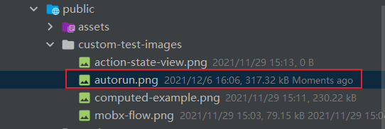

# koa-body 的使用

## 1. 参考资料

1. [koa-body 文件上传自定义文件夹及文件名称](http://www.ptbird.cn/koa-body-diy-upload-dir-and-filename.html)
2. [koa2 使用 koa-body 代替 koa-bodyparser 和 koa-multer](http://www.ptbird.cn/koa-body.html)

## 2. koa-body 的说明

1. Koa 本身不提供对 post 请求体的解析，需要我们使用中间件完成解析。

2. post 请求的 Content-Type 主要有：`application/json`、`application/x-www-urlencoded`、`multipart/form-data`。

3. koa-bodyparser 只能解析 Content-Type 为 `application/json` 和 `application/x-www-urlencoded` 的 post 请求。要解析 Content-Type 为 `multipart/form-data` 的 post 请求，还需 koa-multer。

4. koa-body 这个中间件实现了 koa-bodyparser 和 koa-multer 的功能，能够同时支持下列的 Content-Type 的 post 请求：
   - multipart/form-data
   - application/x-www-urlencoded
   - application/json
   - application/json-patch+json
   - application/vnd.api+json
   - application/csp-report
   - text/xml
   
5. 对于上传文件、提交表单、访问接口等常见的 post 请求，使用一个 koa-body 中间件都可以解析。

6. 对于 Content-Type 为 `application/json` 和 `application/x-www-urlencoded` 的 post 请求，koa-body 对 post 传递的 post 请求体数据进行解析，将其解析为键值对，挂载到 `ctx.request.body` 上。

7. Content-Type 为 `multipart/form-data` 的 post 请求，一般是上传文件，将解析后的文件信息挂载到 `ctx.request.files` 上。

## 2. 基本用法


### 1. koa-body 基本用法

1. 安装：`npm install koa-body`

2. 基本用法：
   ```js
       const Koa = require('koa');
       const koaBody = require('koa-body');

       const app = new Koa();

       app.use(koaBody());
       app.use(ctx => {
           ctx.body = `Request Body: ${JSON.stringify(ctx.request.body)}`;
       });

       app.listen(3000);
   ```
3. 与 koa-router 一起使用，注意，这里引入 koa-body 是全局引入，因为考虑到很多地方都有 post 请求或者是文件上传请求，没必要只在路由级别引入。示例代码如下：
   ```js
      const koaBody = require('koa-body');
      const app = new koa();
      app.use(koaBody());
   
      // router
      const Router  = require('@koa/router');
      Router.post('/users', (ctx) => {
         console.log(ctx.request.body);
         // => POST body
         ctx.body = JSON.stringify(ctx.request.body);
      });
      
      app
       .use(Router.routes())
       .use(Router.allowedMethods());
   ```

## 3. 配置项

1. koa-body 接收配置项作为参数，用来决定 koa-body 解析 post 请求体的表现，用法如下：
   ```js
      const koaBody = require('koa-body');
      const app = new koa();
      
      app.use(koaBody({
           ultipart:true, // 支持文件上传
           encoding:'gzip',
           formidable:{
               uploadDir:path.resolve(__dirname, '../', 'public', 'my-images'), // 设置文件上传目录
               keepExtensions: true,    // 保持文件的后缀
               maxFieldsSize: 2 * 1024 * 1024, // 文件上传大小
               onFileBegin:(name,file) => { // 文件上传前的设置
                    // console.log(`name: ${name}`);
                    // console.log(file);
               },
           }
      }));
   ```
### 1. 基本的配置项

1. 基本的配置项如下表所示：

   参数名|描述|类型|默认值
   :---:|:---:|:---:|:---:
   patchNode|将请求体打到原生 node.js 的 ctx.req 中|Boolean	|false
   patchKoa|将请求体打到 koa 的 ctx.request 中|Boolean|true
   jsonLimit|JSON 数据体的大小限制|String / Integer|1mb
   formLimit|限制表单请求体的大小|String / Integer|56kb
   textLimit|限制 text body 的大小|String / Integer|56kb
   encoding|表单的默认编码|String|utf-8
   multipart|是否支持|multipart-formdate|的表单|Boolean	false
   urlencoded|是否支持 urlencoded 的表单|Boolean|true
   text|是否解析 text/plain 的表单|Boolean|true
   json|是否解析 json 请求体|Boolean|true
   jsonStrict|是否使用 json 严格模式，true 会只处理数组和对象|	Boolean|true
   formidable|配置更多的关于 multipart 的选项|Object|{}
   onError|错误处理|Function|function(){}
   stict|严格模式,启用后不会解析 GET, HEAD, DELETE 请求	|Boolean|true


### 2. formidable 配置项

1. koa-body 解析 Content-Type 为 `multipart/form-data` 的post 请求的能力是由 formidable 这个包提供的，因此 koa-body 中的配置项 formidable 就是用来配置 formidable 的表现的。

2. formidable 的基本配置项：

   参数名|描述|类型|默认值
   :---:|:---:|:---:|:---:
   maxFields|限制字段的数量|Integer|1000
   maxFieldsSize|限制字段的最大大小|Integer|2 * 1024 * 1024
   uploadDir|文件上传的文件夹|String|os.tmpDir()
   keepExtensions|保留原来的文件后缀|Boolean|false
   hash|如果要计算文件的 hash，则可以选择 md5/sha1|String	|false
   multipart|是否支持多文件上传|Boolean|true
   filename|给上传的文件重新命名，如果是函数的话，必须返回字符串，这个字符串会和uploadDir进行拼接|function|undefined
   onFileBegin|文件上传前的一些设置操作|Function	function(name,file){}

3. 有关 formidable 更详细的配置项信息，请查看 formidable 在 github 上面的文档：[formidable - options](https://github.com/node-formidable/formidable)

4. 有用的配置项：
   - uploadDir
   - keepExtensions
   - onFileBegin
   - filename

## 4. 上传文件

### 1. 上传文件的基本配置

1. 配置 formidable 选项，使得 koa 可以解析上传的文件。

2. 基本配置：
   ```js
      app
       .use(koaBody({
           multipart: true,
           formidable: {
               // uploadDir: path.resolve(__dirname, '../', 'public', 'my-images'),
               keepExtensions: true,
               maxFileSize: 100 * 1024 * 1024,
           }
       }));
   ```
   指定了保存上传文件的路径，并且保存文件的原始后缀，设置文件最大体积为 100 M。

3. 上传一个文件文件进行测试，并打印出 ctx.request.files 的信息：
   ```js
       import Router from '@koa/router';
       const basicMoonRouter = new Router();
       
       basicMoonRouter.post('/moon-basic-upload', async (ctx, next) => {

          // 经过 koa-body 解析后的文件，会被存放到 ctx.request.files 这个对象中
          // 其中 key 是 formData 中指定的 name 或者是：<input name="thisname" type="file">
          //
          const fileObj = ctx.request.files;

          console.log(fileObj);
      })
   ```
   打印出来的 ctx.request.files 对象信息如下：
   ```
        {
            file: File {
                _events: [Object: null prototype] {},
                _eventsCount: 0,
                _maxListeners: undefined,
                size: 317318,
                path: 'D:\\Front-End\\ImageHost-TypeScript\\ImageHost-Server\\public\\my-images\\upload_0e7fd7a0c9603d70ad8a4ce29fcd676c.png',
                name: 'autorun.png',
                type: 'image/png',
                hash: null,
                lastModifiedDate: 2021-12-06T02:13:40.569Z,
                _writeStream: WriteStream {
                    _writableState: [WritableState],
                    _events: [Object: null prototype] {},
                    _eventsCount: 0,
                    _maxListeners: undefined,
                    path: 'D:\\Front-End\\ImageHost-TypeScript\\ImageHost-Server\\public\\my-images\\upload_0e7fd7a0c9603d70ad8a4ce29fcd676c.png',
                    fd: null,
                    flags: 'w',
                    mode: 438,
                    start: undefined,
                    autoClose: true,
                    pos: undefined,
                    bytesWritten: 317318,
                    closed: false,
                    [Symbol(kFs)]: [Object],
                    [Symbol(kCapture)]: false,
                    [Symbol(kIsPerformingIO)]: false
                },
                [Symbol(kCapture)]: false
            }
      }
   ```
4. ctx.request.files 是一个对象，因为我们可以通过一个 post 请求上传多个文件。files 对象的 key 是前端上传文件时，由 `<input name="thisname" type="file">` 或者我们使用 FormData 构造函数生成表单类时，使用 append 方法添加表单数据（文件数据）指定的 key。如果多个文件的 key 相同，那么会这些相同 key 的文件信息组合成一个数组。

5. 观察 files 对象中的 file 属性指定的文件信息，里面很多内容是同上传的文件相关的，如：
   - `size`：文件大小
   - path：存储文件的路径。注意，如果我们在没有 formidable 对象中指定 uploadDir 属性，也就是上传文件的路径，那么默认的存放文件的路径是：`os.tmpDir()`。
   - `name`：上传文件的名字。
   - `type`：文件的类型。
   - `hash`：文件的 hash 值。
   - `lastModifiedDate`：文件的最后一次修改时间。

### 2. 自定义文件名和存储路径

1. 默认情况下，koa-body 会给我们上传的文件重命名，如上面的例子，上传的文件原始名称是 `autorun.png`，而 koa-body 将文件重新命名为：`upload_0e7fd7a0c9603d70ad8a4ce29fcd676c.png` 然后保存。

2. 那么如果我们想使用原始的文件名保存文件，应该怎么做呢，有两种方法：
   - 使用流的方式将原始文件复制到一个新的路径下。
   - 使用 formidable 对象中的 onFileBegin 函数

3. 不在 formidable 对象中指定 uploadDir 属性，然后从 ctx.request.files 对象中获得 path 属性值 和 name 属性值，这个 path 是文件的实际存储路径，然后根据这个路径，创建一个可读流（readStream），然后结合 name 创建一个新的路径，根据这个新的路径创建一个可写流，最后使用 pipe 方法将可读流写入可写流中。然后将 path 指定的文件删除。简单的示例如下：
     ```js
        const fileObj = ctx.request.files;

         console.log(fileObj);    
        const fileName = fileObj?.file.name;    
        const relativePath = path.join('/public', 'custom-test-images', fileName);

        // 保存文件
        // 使用流的方式保存文件
        // koa-body 中，可以配置上传文件的保存路径，在 formidable 对象中 配置 uploadDir 属性，指定一个绝对或者相对路径
        // 如果不配置，默认的存放文件的路径是项目所在的磁盘下的 Temp 路径下，如 D:\\Temp\\upload_5239d906389249f5b8d292f1fe8c1789.png
        // 所以，我们这里使用流的方式，相当于将文件从 Temp 目录复制到我们指定的路径下

        const readStream = fs.createReadStream(fileObj?.file.path);    
        const myPath = path.resolve(__dirname, '../../../', relativePath);
        const writeStream = fs.createWriteStream(myPath);
        readStream.pipe(writeStream);
        // 删除原始文件
     ```
4. 上面的方式还是比较麻烦，实际上，koa-body 提供了一个更好的方式，那么就是配置 formidable 对象中的 onFileBegin 函数。onFileBegin 函数在 koa-body 处理文件前调用。可以用来指定文件名称、存放路径。onFileBegin 函数的基本形式是：
   ```js
      function onFileBegin (formName, file)  {
                // some code
      }
   ```
   参数说明：
   - formName：表单中的字段名称，即前面提到的 ctx.request.files 中的 key。
   - file：文件信息相关的对象。
   
5. 配置 onFileBegin 函数（不指定 uploadDir 属性）：
   ```js
       formidable: {
           onFileBegin: (formName, file) => {
               console.log(`formName：${formName}`);
               console.log(file);
           }
       }
   ```
6. 打印出 formName 和 file 看一看：
   ```
       formName：file
       File {
         _events: [Object: null prototype] {},
         _eventsCount: 0,
         _maxListeners: undefined,
         size: 0,
         path: 'D:\\Temp\\upload_bf85d914ea223b49311a108b624e8db3.png',,
         name: 'autorun.png',
         type: 'image/png',
         hash: null,
         lastModifiedDate: null,
         _writeStream: null,
         [Symbol(kCapture)]: false
       }
   ```
   path 属性是默认的文件存储路径，name 是文件的原始名字。

7. 所以，如果我们要修改保存的文件路径和名称，我们需要修改 file 对象中的 path 属性，使用新的路径去覆盖原来的路径值。示例如下：
   ```js
      formidable: {
           onFileBegin: (formName, file) => {
               // 生成新的文件路径
               const filepath = path.join(path.resolve(__dirname, '../', 'public', 'custom-test-images'), file.name);
               // 覆盖 file 对象中的 path 属性
               file.path = filepath;
           }
       }
   ```
8. 那么上传的文件，koa-body 就会按照指定文件名和路径去保存文件。

9. 完整的 koa-body 配置：
    ```js
        import koaBody from 'koa-body';
        import path from 'path';

        // const Router = require('@koa/router');
        const app = new Koa();
        // 注册 koa-body 中间件，用来解析 post 请求的请求体
        // 这里的注册是全局级别注册的，这样每个路由下的 post 方法的请求体都可以被解析
        app
          .use(koaBody({
              multipart: true,
              formidable: {
                  keepExtensions: true,
                  maxFileSize: 100 * 1024 * 1024,
                  onFileBegin: (formName, file) => {
                  
                     const filepath = path.join(path.resolve(__dirname, '../', 'public', 'custom-test-images'), file.name);
                     file.path = filepath;
                  }
                  }
        }));
    ```
10. 上传一个文件，打印出的 ctx.request.files 信息如下：
    ```js
       {
          file: File {
            _events: [Object: null prototype] {},
            _eventsCount: 0,
            _maxListeners: undefined,
            size: 317318,
            path: 'D:\\Front-End\\ImageHost-TypeScript\\ImageHost-Server\\public\\custom-test-images\\autorun.png',
            name: 'autorun.png',
            type: 'image/png',
            hash: null,
            lastModifiedDate: 2021-12-06T08:06:44.024Z,
            _writeStream: WriteStream {
              _writableState: [WritableState],
              _events: [Object: null prototype] {},
              _eventsCount: 0,
              _maxListeners: undefined,
              path: 'D:\\Front-End\\ImageHost-TypeScript\\ImageHost-Server\\public\\custom-test-images\\autorun.png',
              fd: null,
              flags: 'w',
              mode: 438,
              start: undefined,
              autoClose: true,
              pos: undefined,
              bytesWritten: 317318,
              closed: false,
              [Symbol(kFs)]: [Object],
              [Symbol(kCapture)]: false,
              [Symbol(kIsPerformingIO)]: false
            },
            [Symbol(kCapture)]: false
          }
        }

    ```
    此时的 path 就是我们在 onFileBegin 函数中指定的新路径，保存的文件名也是文件的原始名称。如下所示：
   