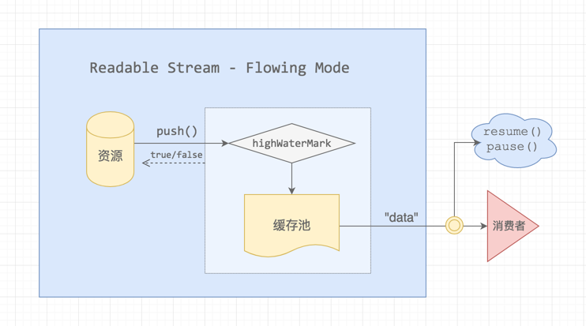
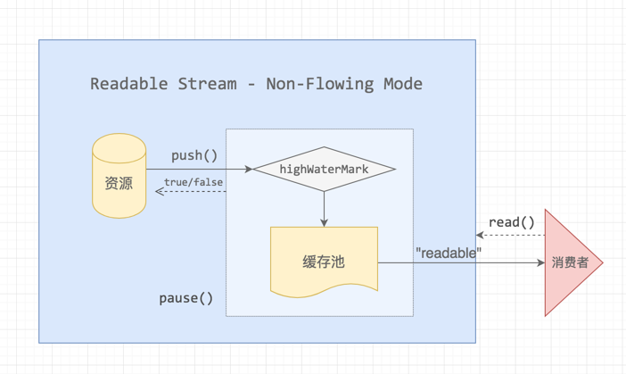
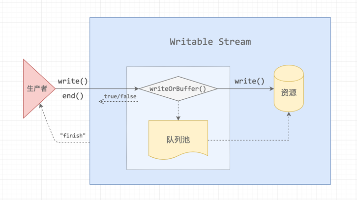

<!-- START doctoc generated TOC please keep comment here to allow auto update -->
<!-- DON'T EDIT THIS SECTION, INSTEAD RE-RUN doctoc TO UPDATE -->
**Table of Contents**  *generated with [DocToc](https://github.com/thlorenz/doctoc)*

- [Node中的流（Streams）](#node%E4%B8%AD%E7%9A%84%E6%B5%81streams)
  - [1. 参考资料](#1-%E5%8F%82%E8%80%83%E8%B5%84%E6%96%99)
  - [2. 流（Streams）的说明](#2-%E6%B5%81streams%E7%9A%84%E8%AF%B4%E6%98%8E)
  - [3. 可读流（Readable Streams）](#3-%E5%8F%AF%E8%AF%BB%E6%B5%81readable-streams)
    - [1. 可读流分为两种模式：](#1-%E5%8F%AF%E8%AF%BB%E6%B5%81%E5%88%86%E4%B8%BA%E4%B8%A4%E7%A7%8D%E6%A8%A1%E5%BC%8F)
    - [2. `flowing` 模式](#2-flowing-%E6%A8%A1%E5%BC%8F)
    - [3. 模式切换](#3-%E6%A8%A1%E5%BC%8F%E5%88%87%E6%8D%A2)
    - [4. readable](#4-readable)
    - [5. read(size)](#5-readsize)
    - [6. **一般来说，我们不使用 readable 事件和read() 方法，使用pipe()或 data 事件代替**。](#6-%E4%B8%80%E8%88%AC%E6%9D%A5%E8%AF%B4%E6%88%91%E4%BB%AC%E4%B8%8D%E4%BD%BF%E7%94%A8-readable-%E4%BA%8B%E4%BB%B6%E5%92%8Cread-%E6%96%B9%E6%B3%95%E4%BD%BF%E7%94%A8pipe%E6%88%96-data-%E4%BA%8B%E4%BB%B6%E4%BB%A3%E6%9B%BF)
  - [4. 可写流（Writable Streams）](#4-%E5%8F%AF%E5%86%99%E6%B5%81writable-streams)
    - [1. 可写流是对数据写入目的地（destination）的一种抽象。](#1-%E5%8F%AF%E5%86%99%E6%B5%81%E6%98%AF%E5%AF%B9%E6%95%B0%E6%8D%AE%E5%86%99%E5%85%A5%E7%9B%AE%E7%9A%84%E5%9C%B0destination%E7%9A%84%E4%B8%80%E7%A7%8D%E6%8A%BD%E8%B1%A1)
    - [2. 基本用法：](#2-%E5%9F%BA%E6%9C%AC%E7%94%A8%E6%B3%95)
    - [3. 写入流的第二种用法——一次写入大量数据：](#3-%E5%86%99%E5%85%A5%E6%B5%81%E7%9A%84%E7%AC%AC%E4%BA%8C%E7%A7%8D%E7%94%A8%E6%B3%95%E4%B8%80%E6%AC%A1%E5%86%99%E5%85%A5%E5%A4%A7%E9%87%8F%E6%95%B0%E6%8D%AE)
    - [4. drain 事件](#4-drain-%E4%BA%8B%E4%BB%B6)
  - [5. 管道（Pipe）](#5-%E7%AE%A1%E9%81%93pipe)
  - [6. 双向流（Duplex Streams）](#6-%E5%8F%8C%E5%90%91%E6%B5%81duplex-streams)
  - [7. 转换流（Transform Streams）](#7-%E8%BD%AC%E6%8D%A2%E6%B5%81transform-streams)
  - [8. 操作流的常见 API](#8-%E6%93%8D%E4%BD%9C%E6%B5%81%E7%9A%84%E5%B8%B8%E8%A7%81-api)
    - [1. 通过 `File System` 创建流](#1-%E9%80%9A%E8%BF%87-file-system-%E5%88%9B%E5%BB%BA%E6%B5%81)
    - [2. 可读流（Readable Streams）](#2-%E5%8F%AF%E8%AF%BB%E6%B5%81readable-streams)
    - [3. 可写流（Writable Streams）](#3-%E5%8F%AF%E5%86%99%E6%B5%81writable-streams)
    - [4. Stream](#4-stream)
  - [9. 疑问](#9-%E7%96%91%E9%97%AE)

<!-- END doctoc generated TOC please keep comment here to allow auto update -->

## Node中的流（Streams）

### 1. 参考资料
- [Node.js Stream(流)](https://juejin.im/post/6844903583477923848)
- [Node.js 可读流和可写流](https://juejin.im/post/6844903588649500679)
- [Node.js 中的一股清流：理解 Stream（流）的基本概念](https://juejin.im/post/6844904014975500301)
- [你应该知道的Node.js流](https://juejin.im/post/6844903590859898887)
- [一文搞定 Node.js 流 （Stream）](https://juejin.im/post/6854573219060400141)
- [Stream | Node.js v12.18.4 Documentation](https://nodejs.org/dist/latest-v12.x/docs/api/stream.html)
- [浅析nodejs中的stream(流)](https://www.jianshu.com/p/43ea707826b8)
- [深入理解nodejs Stream模块](https://www.jianshu.com/p/81b032672223)
- [nodeJS之流stream](https://www.cnblogs.com/xiaohuochai/p/6969307.html?utm_source=tuicool&utm_medium=referral)
### 2. 流（Streams）的说明

1. 流（Streams），流指的是一组有方向的、有起点和终点的一种传输数据的方式。字符串、数组、二进制数据等，都可以以流的方式进行传输。

2. Node 中许多 API 都实现了流，如下图所示：

   
   
3. 流的特点在于，不会一次性将所有的数据读入内存，而一块一块的读，一块一块的进行处理。这种处理方式，使得我们在处理大文件的时候，非常高效。
   
4. 所有的流都是 EventEmitter 的实例。他们在数据可读或者可写的时候发出事件。然而，我们也可以简单的通过 pipe() 方法来使用流数据。

### 3. 可读流（Readable Streams）

#### 1. 可读流分为两种模式：

   - `flowing` 模式：可读流自动(不断的) 从底层读取数据（直到读取完毕），并通过 `EventEmitter` 接口的事件尽快将数据提供给应用
   
   - `paused` 模式：必须显式调用 `stream.read()` 方法来从流中读取数据片段

#### 2. `flowing` 模式
   - flowing 模式图示：
   
     
     
   - 所有初始工作模式为 `paused` 的可读流，可以通过下面三种途径切换到 `flowing` 模式
     - 监听 `data` 事件
     - 调用 `stream.resume()` 
     - 调用 `strean.pipe()` 将数据发送到 Writable

   - 从流中读取数据：
   
     ```javascript
        const fs = require('fs');
        
        // 以流的方式，读取一个文件
        // 创建读取流，第一个参数是path，第二个参数是option，可以配置encoding等
        // const readStream = fs.createReadStream('./files/data.txt', {encoding: 'utf-8'});
        const readStream = fs.createReadStream('./files/data.txt', {
            encoding: 'utf-8',  // 文件内容的编码方式，默认是 null，null 表示的是 buffer
            flags: 'r',  // 操作方式是只读
            highWaterMark: 3,  // 一次读取的数据量，单位是字节，默认是64k
            autoClose: true,  // 读取完成是否自动关闭流
            start: 0,  // 读取的起始位置
            end: 9,  // 读取的结束位置，包括9这个位置
        }); 
        // 接收数据
        let str = '';
        // 记录总次数
        let count = 0; 
        readStream.on('open', () => {
            console.log('open');
        })
        
        // 监听data事件，一块数据从源头（source）流向消费者，就会触发data事件
        readStream.on('data', (chunk) => {
            console.log(chunk);
            str += chunk;
            count++;
        })
        
        
        // 监听error事件，在从流中获取数据时，发生异常时触发这个事件
        readStream.on('error', function (error) {
            console.log(error);
        })
        
        // 监听end事件，当流中没有数据可以被消费的时候，就会触发这个事件
        readStream.on('end', (chunk) => {
            // console.log(str);
            // console.log(count);
            console.log('end');
        })
        
        // 流或者底层资源文件关闭后，这里就是 data.txt 这个文件关闭后，触发 close 事件
        readStream.on('close', function () {
            console.log('close');
        })
     ```
   - 输出：
     ```javascript
        open
        123
        456
        789
        0
        end
        close
     ```
     
     1. `createReadStream()` 创建可读流实例，会打开文件，触发 open 事件（并不是创建每个流都会触发 open 事件），不会将文件中的内容输出（因为处于‘暂停模式’，没有事件消费）。此时将数据存储到缓冲器 buffer 中，buffer 的大小取决于  highWaterMark 设置的值，当读取的数据量达到 highWaterMark 设定的阈值时，流就会暂停从底层资源中读取数据，直到 buffer 中的数据被消费。
     
     2. 一块数据从源头（source）流向消费者，就会触发data事件。readStream 可以理解为消费者，当消费者监听 data 事件，可读流从暂停模式切换到flowing模式，不断向消费者提供数据，直到文件中的数据被读取完毕。
    
     3. 当我们监听 data 事件时，数据会源源不断从缓冲区中被读取出来。回调函数接收的参数就是每一读取的数据。可读流每次读取 highWaterMark 个数据，交给消费者，所以先打印123，再打印456 ... ...
     
     4. 当读完文件，也就是数据被完全消费后，触发 end 事件
     
     5. 流或者底层资源文件关闭后，这里就是 data.txt 这个文件关闭后，触发 close 事件
     
     6. error 事件通常会在底层系统内部出错从而不能产生数据，或当流的实现试图传递错误数据时发生。

#### 3. 模式切换
   - 调用 pause() 由 flowing 切换到 pause 模式，用 resume() 方法进行恢复为 flowing 模式。
   - pause 模式示意图：
   
     
     
   - 示例：
     ```javascript
        const fs = require('fs');
        
        const readStream = fs.createReadStream('./files/data.txt', {
            encoding: 'utf-8',  // 文件内容的编码方式，默认是 null，null 表示的是 buffer
            flags: 'r',  // 操作方式是只读
            highWaterMark: 3,  // 一次读取的数据量，单位是字节，默认是64k
            autoClose: true,  // 读取完成是否自动关闭流
            start: 0,  // 读取的起始位置
            end: 9,  // 读取的结束位置，包括9这个位置
        });
        
        readStream.on('open', () => {
            console.log('open');
        })
        readStream.on('data', (chunk) => {
            console.log(chunk);
            readStream.pause();
        })
        
        setTimeout(() => {
            readStream.resume();
        }, 1000); 
        
        readStream.on('end', () => {
            console.log('end');
        })
     ``` 
     输出：
     ```javascript
        open
        123
        456
     ```
     1. 监听 data 事件，可读流处于 flowing 状态，在回调函数内部，调用了 pause() 方法，然后 暂停 data 事件的触发，此时为 pause 模式。
     
     2. 设置了一个定时器，定时器的处理函数内部调用 resume() 方法，可以恢复 data 事件的触发，由 pause 模式切换到 flowing 模式。
     
     3. 1s 后，切换流到 flowing 模式，data 事件触发，但又遇到 pause()，所以暂停了输出，此时并没有 resume() 方法来进行模式的转换，所以只打印到6。
     4. 可读流中还有数据未被消费，但是此时是 pause 状态，所以，不会调用 end() 方法。
     
     **注意**: 如果可读流切换到 flowing 模式，且没有消费者处理流中的数据，这些数据将会丢失。 比如， 调用了可读流的 resume() 方法却没有监听 data 事件，或是取消了 data 事件监听，就有可能出现这种情况。

#### 4. readable  
   - readable 事件将在流中有数据可供读取时触发
   
   - 当我们创建可读流时，就会先把缓存区填满（highWaterMark 为指定的单次缓存区大小），等待消费
   
   - 如果缓存区被清空（消费）后，会触发 readable 事件
   
   - 当到达流数据尾部时，readable 事件也会触发，触发顺序在end事件之前
   -  如果同时监听 readable 和 data，则优先触发 readable 事件。 只有在调用 read() 时才会触发 data 事件。
   - 示例代码：
     ```javascript
        const fs = require('fs');
        
        const readStream = fs.createReadStream('./files/data.txt', {
            encoding: 'utf-8',  // 文件内容的编码方式，默认是 null，null 表示的是 buffer
            flags: 'r',  // 操作方式是只读
            highWaterMark: 2,  // 一次读取的数据量，单位是字节，默认是64k
        });
        
        readStream.on('readable', () => {
            console.log('begin');    
            let ret = readStream.read(2); 
            console.log('result', ret);
        })
     ```
     输出：
     ```javascript
        begin
        result 12
        begin
        result 34
        begin
        result 56
        begin
        result 78
        begin
        result 90
        begin
        result null
     ```

#### 5. read(size)
   - 该方法从内部缓冲区中收取并返回一些数据,如果没有可读数据，返回null
   - size 是可选的，指定要读取 size 个字节，如果没有指定，内部缓冲区所包含的所有数据将返回
   - 如果 size 字节不可读，返回 null，如果此时流没有结束(除非流已经结束)，会将所有保留在内部缓冲区的数据将被返回。比如：文件中有 1 个可读字节，但是指定size 为 2，这时调用 read(2) 会返回 null,如果流没有结束，那么会再次触发 readable 事件，将已经读到内部缓冲区中的那一个字节也返回。
   - read() 方法只应该在 pause 模式下的可读流上运行，在流动模式下，read会自动调用，直到内部缓冲区数据完全耗尽。
   
#### 6. **一般来说，我们不使用 readable 事件和read() 方法，使用pipe()或 data 事件代替**。
 
### 4. 可写流（Writable Streams）

#### 1. 可写流示意图：



#### 2. 可写流是对数据写入目的地（destination）的一种抽象。

#### 3. 基本用法：
   ```javascript
      const fs = require('fs');
      // 以流的方式，写入一个文件
      // 创建一个写入流，第一个参数是path，第二个参数option，可以指定编码等
      const writeStream = fs.createWriteStream('./files/output.txt', {
          encoding: 'utf-8',  // 默认是 utf-8
          flags: 'w',  // 文件操作方式是写入
          // mode: 0o666,  //
          autoClose: true,
          highWaterMark: 3,  // 默认是16k，单位是字节
          start: 0  // 起始位置
      });
      
      for (let i = 0; i < 4; i++) {
          let flag = writeStream.write(i + '');
      
          console.log(flag);
      }
      // 标记文件末尾
      // 调用这个方法表示数据已经写入完毕（没有数据可以被写入到流中）
      writeStream.end('ok');
      
      writeStream.on('open', () => {
          console.log('open');
      })
      // finish事件，当end()方法被调用后，会触发finish事件
      writeStream.on('finish', function () {
          console.log('finish');
      })
      
      writeStream.on('error', function (error) {
          console.log(error);
      
      })
   ```
   输出：
   ```javascript
      true
      true
      false
      false
      open
      finish
   ```
   说明：
   1. output.txt 中的内容是：0123ok
   
   2. createWriteStream() 创建一个可写流，会默认会打开文件，但是不会触发 open 事件。
   
   3. 可写流通过反复调用 write(chunk) 方法将数据写入内部缓冲器。写入的数据 chunk 必须是字符串或者buffer。  
   write() 是个异步方法，但有返回值。这个返回值 flag 的含义表示能否继续写入，而不是文件是否写入。  
   缓冲器总大小 < highWaterMark 时，可以继续写入，flag为true； 一旦内部缓冲器大小达到或超过highWaterMark，flag 返回 false。  
   **注意**，即使 flag 为 false，写入的内容也不会丢失。此时向流中写入数据的操作会停止，直到触发 drain 事件后，写入过程才会恢复。
   
   4. 我们在创建可读流的过程中指定的 highWaterMark 是 3，调用 write() 时一次写入了一个字节，写入的多少由传入 wrire() 的数据决定。当调用第三次 write() 方法时，缓冲器中的数据大小达到 3 这个阈值，开始返回 false，所以先打印了两次 true，后打印了两次 false。
   
   5. end() 方法用来标记文件末尾，表示接下来没有数据要写入可写流；  
   可以传入可选的 chunk 和 encoding 参数，在关闭流之前再写入一段数据；  
   如果传入了可选的 callback 函数，它将作为 finish 事件的回调函数。所以 'ok' 会被写入文件末尾。  
   **注意**，write() 方法必须在 end() 方法之前调用。
   
   6. 在调用了 end() 方法，且缓冲区数据都已经传给底层系统（全部写入output.txt）之后， finish 事件将被触发。
   
   7. close 事件将在流或其底层资源（比如一个文件）关闭后触发。close 事件触发后，该流将不会再触发任何事件。  
      **注意**：不是所有 可写流/可读流 都会触发 close 事件。

#### 3. 写入流的第二种用法——一次写入大量数据：
   ```javascript
      const fs = require('fs');
      // 以流的方式，写入一个文件
      // 创建一个写入流，第一个参数是path，第二个参数option，可以指定编码等
      const writeStream = fs.createWriteStream('./files/output.txt', {
          encoding: 'utf-8',  // 默认是 utf-8
          flags: 'w',  // 文件操作方式是写入
          // mode: 0o666,  //
          autoClose: true,
          highWaterMark: 3,  // 默认是16k，单位是字节
          start: 0  // 起始位置
      });
      
      let content = '这是一个测试文件\n';
      let str = '';
      
      for (let i = 0; i < 10000; i++) {
          str += content;
      }  
      let count = 0;
      // 写入数据，write()方法将数据写入流中
      // 第一个参数是要写入的数据，第二参数是编码，如果写入的数据是字符串，默认是utf-8
      // 第三个参数是回调函数，当数据块被刷新（数据被处理或者数据全部写入流中）的时候被调用
      writeStream.write(str, function () {
          console.log('数据被刷新了');
          count++;
      });
      
      // 标记文件末尾
      // 调用这个方法表示数据已经写入完毕（没有数据可以被写入到流中）
      writeStream.end();
      
      writeStream.on('open', () => {
          console.log('open');
      })
      // finish事件，当end()方法被调用后，会触发finish事件
      writeStream.on('finish', function () {
          console.log('写入完成');
          console.log(count);
      })
      
      writeStream.on('error', function (error) {
          console.log(error);
      
      })
      
      
      console.log('程序执行完毕');
   ```
   输出：
   ```javascript
      程序执行完毕
      open
      数据被刷新了
      写入完成
      1
   ```
   可写流的执行过程是异步过程，调用 write() 方法，将数据全部写入缓冲区中，由于write() 方法的回调函数是数据块被刷新（数据被处理或者数据全部写入流中）后才会被调用，所以此时不会调用这个回调函数。也不会触发其他事件，因此会最先输出 `程序执行完毕`。  
   文件被打开，触发 open 事件，将数据写入文件中，缓冲区被刷新，调用write()的回调函数，所以会输出 `数据被刷新了`。数据写入完成后，调用 end() 方法，最后触发 finish 事件。

#### 4. drain 事件

   - 如果调用 write(chunk) 方法返回 false，drain 事件会在适合恢复写入数据到流的时候触发。
   
   - drain 事件触发条件：
     - 缓冲器满了，即 write() 方法返回 false。
     - 缓冲器的数据都写入到流，即数据都被消费掉后，才会触发
   
   - drain 事件触发示例：
     ```javascript
        const fs = require('fs');
        // 以流的方式，写入一个文件
        // 创建一个写入流，第一个参数是path，第二个参数option，可以指定编码等
        const writeStream = fs.createWriteStream('./files/output.txt', {
            encoding: 'utf-8',  // 默认是 utf-8
            flags: 'w',  // 文件操作方式是写入
            // mode: 0o666,  //
            autoClose: true,
            highWaterMark: 3,  // 默认是16看、，单位是字节
            start: 0  // 起始位置
        });
        let i = 8;
        
        function write() {
            let flag = true;
            while (i > 0 && flag) {
                flag = writeStream.write(i + '', () => {});
                i--;
                console.log(flag);
            }
        
            if (i <= 0) {
                writeStream.end('ok');
            }
        }
        
        write();
        
        // drain只有当缓存区充满后 ，并且被消费后触发
        writeStream.on('drain', () => {
            console.log('drain');
            write();
        });
     
        writeStream.on('open', () => {
            console.log('open');
        })
        // finish事件，当end()方法被调用后，会触发finish事件
        writeStream.on('finish', function () {
            console.log('写入完成');
            // console.log(count);
        })
     
        writeStream.on('close', function () {
            console.log('close');
        
        })
     
        writeStream.on('error', function (error) {
            console.log(error);
        
        })
     ```
   - 输出：
     ```javascript
        true
        true
        false
        open
        drain
        true
        true
        false
        drain
        true
        true
        写入完成
        close
     ```
   - output.txt 内容是：87654321ok
   - 设置的缓冲区的大小为3，所以当写入第三个数据的时候，write() 返回 false，此时while 循环停止，等待，然后可写流将缓冲区内数据全部写入文件中，先触发 open 事件（open 事件只触发一次），再会触发 drain 事件，然后继续调用 write()，一直重复上述过程，直到 i 为 1，停止写入，此时调用 end()，在文件末尾写入 ok，触发 finish 事件。最后关闭文件，触发 close 事件。
 
### 5. 管道（Pipe）

1. 管道提供了一个输出流到输入流的机制。通常我们用于从一个流中获取数据并将数据传递到另外一个流中。

2. 类似于现实中的管道，将液体从源（source）传送到目的地（destination）。Node 中的 Pipe 作用也是将一个流从源传输到目的地。比如说可读流传递到可写流。

3. 一个可读流可以和一个可写流串起来，所有的数据自动从可读流进入可写流，这种操作叫 Pipe。

4. Pipe 操作可以组合，形成链式调用。

5. Pipe 操作示意——复制文件：
   ```javascript
      const fs = require('fs');
      // 创建一个可读流
      const readStream = fs.createReadStream('./files/0001.jpg');
      
      // 创建一个可写流
      const writeStream = fs.createWriteStream('./0001-copy.jpg');
      
      // pipe()接收一个可写流作为参数
      // 调用可读流的pipe()方法，数据自动从可读流中流入可写流中
      // 实现可读流到可写流的转换
      // pipe()的返回值是一个可写流（就是接收的参数，可读流的目的地）
      // 如果返回值是双向流或者是转换流，可以实现pipe()方法的链式调用
      readStream.pipe(writeStream);
      
      // 默认情况下，当可读流结束（触发end事件）时，可写流会自动调用end()方法，此时可写流不会写入任何数据
      // 如果不想自动调用end()方法，可以在pipe()方法中，配置第二个参数：{end: false}
      
      readStream.on('end', function () {
          console.log('拷贝完成');
      });
   ```


### 6. 双向流（Duplex Streams）

### 7. 转换流（Transform Streams）

### 8. 操作流的常见 API

#### 1. 通过 `File System` 创建流
   - fs.createReadStream(path[, options])
     - path 资源路径，可以是字符串，也可以是buffer，或 url
     - options 可选参数，值为字符串或者是对象。为字符串的情况下，指定的是文件的编码。为对象的情况下，是配置项，如下所示：
       ```javascript
             {
                 encoding: 'utf-8',  // 文件内容的编码方式，默认是 null，null 表示的是 buffer
                 flags: 'r',  // 操作方式是只读，默认是 r
                 highWaterMark: 3,  // 一次读取的数据量，单位是字节，默认是64k
                 autoClose: true,  // 读取完成是否自动关闭流
                 start: 0,  // 读取的起始位置
                 end: 9,  // 读取的结束位置，包括9这个位置
             }
          ```
          这里仅仅列举了常用的配置项，其他的配置项请查看官方文档。
     - 返回值：可读流 ReadStream
     - 详细说明：[fs.createReadStream(path[, options])](https://nodejs.org/dist/latest-v12.x/docs/api/fs.html#fs_fs_createreadstream_path_options)
          
   - fs.createWriteStream(path[, options])
     - path 资源路径，可以是字符串，也可以是buffer，或 url
     - options 可选参数，值为字符串或者是对象。为字符串的情况下，指定的是文件的编码。为对象的情况下，是配置项，如下所示：
       ```javascript
            {
                 encoding: 'utf-8',  // 文件内容的编码方式，默认是 utf-8
                 flags: 'w',  // 操作方式是写入，默认是 w
                 autoClose: true,  // 写入完成是否自动关闭流
                 start: 0,  // 写入数据的起始位置
             }
       ```
       这里仅仅列举了常用的配置项，其他的配置项请查看官方文档。
     - 返回值：可写流 WriteStream
     - 详细说明：[fs.createWriteStream(path[, options])](https://nodejs.org/dist/latest-v12.x/docs/api/fs.html#fs_fs_createwritestream_path_options)
       
#### 2. 可读流（Readable Streams）
   - 事件
     - `close`  
       流或者底层资源文件关闭后触发
     - `data`  
        一块数据从源头（source）流向消费者时会被触发。在 flowing 模式下会被触发。调用read() 方法并有数据返回时触发。  
        在没有明确暂停的流上添加 data 事件监听会将流转换为 flowing 模式。数据会在可用时尽快传递给下个流程。
     - `end`  
       流中再没有数据可供消费时触发。end 事件只有在数据被完全消费后才会触发。可以在数据被完全消费后，通过将流转换到 flowing 模式， 或反复调用 stream.read() 方法来实现这一点。
     - `error`  
       error 事件可以在任何时候在可读流的实现（Readable implementation）上触发。 通常，当底层系统内部出错从而不能产生数据，或当流的实现试图传递无效的数据时触发该事件。  
       回调函数将接收到一个 Error 对象。
     - `pause`  
       当我们调用 stream.pause() 或者readableFlowing 为 false 触发该事件，此时可读流的模式进入 pause 状态。
     - `readable`  
       当流中有数据可以被消费时，就会触发该事件。  
       当达到了流数据的末尾时，该事件也会被触发，触发顺序在 end 事件之前。  
       一旦触发 readable 事件， 这表明可读流有了新的状态：或者时有新的数据可用，或者是到达了流的末尾，前一种情况下，调用 read() 方法会返回新的数据，后一种情况，调用 read() 方法返回null。
     - `resume`  
       当我们调用 stream.resume() 或者readableFlowing 为 true 触发该事件，此时可读流的模式进入 flowing 状态。
   - api
     - pause()  
       将可读流由 flowing 状态转换为 pause 状态。停止触发 data 事件。任何可用的数据都将保存在内部缓存中。
     - pipe(destination[, options])  
       - 管道方法，将可读流与可写流连接在一起，自动将可读流转换为可写流。流中的数据会被自动管理，因此可写流的写入的速度不会快于可读流的读取速度。
       - destination 可写流（Writable Stream），数据写入的目的地
       - options 配置项，可选，值为对象，如下所示：
         ```javascript
            {
                 end: true,  // 可读流结束，是否关闭可写流，默认是true
            }
         ```
       - 返回值，就是 destination，即 pipe() 方法接收的可写流。
       - pipe() 接收的如果是双向流（Duplex Streams）或者是转换流（Tranasform Streams），可以实现 pipe() 的链式调用。
     - read([size])
       - 在 pause 模式或触发 readable 事件后，手动的从缓冲区读取数据。
       - size 可选参数，指定一次从缓冲区读取的数据的数量，类型为 number。
       - 返回值，可以是字符串、buffer、null或者是缓冲区中的数据。
       - read() 方法一般和 readable 事件一起使用。
       - 使用 read() 处理数据时， while 循环是必需的。 只有在 readable.read() 返回 null 之后，才会触发 readable 事件。
       - read() 方法的详解：[readable.read([size])](https://nodejs.org/dist/latest-v12.x/docs/api/stream.html#stream_readable_read_size)
       - **一般来说，我们不使用 readable 事件和read() 方法，使用 pipe() 或 data 事件代替**。
     - resume()
       - 将可读流由 pause 模式转换为 flowing 模式，使得能够继续触发 data 事件。
       - resume() 方法在 readable 事件的处理函数中不起作用。
     - setEncoding(encoding)
       - 设置可读流中的字符编码。
       - encoding 编码方式
       - 如果没有给可读流指定编码方式，则获取的数据是 Buffer 对象。

#### 3. 可写流（Writable Streams）
   - 事件
     - `close`  
       流或者底层资源文件关闭后触发
     - `drain`  
       如果调用 write(chunk) 方法返回 false，drain 事件会在适合恢复写入数据到流的时候触发。  
       drain 事件触发条件：1. 缓冲器满了，即 write() 方法返回 false。2. 缓冲器的数据都写入到流，即数据都被消费掉后。  
       触发 drain 事件后，我们一般需要将缓冲区的数据消费掉。
     - `error`  
       当向流中写入数据或者在数据在管道中流动出现错误时触发。回调函数将接收到一个 Error 对象。
     - `finish`  
       在 end() 方法被调用后，且将缓冲区数据都已经传给底层系统（underlying system）之后触发该事件。 
     - `pipe`  
       可读流调用 pipe() 方法后，并且在目标流向（destinations）中添加当前可写流（writable）时触发该事件。
   - api
     - write(chunk[, encoding][, callback])
       - 向流中写入一些数据，一旦数据被处理，就调用回调函数 callback。
       - chunk 向流中写入的数据，可以是字符串、Buffer、Uint8Array或者是其他类型，如果不是以对象（object）模式操作流，则 chunk 必须是字符串、Buffer、Uint8Array，如果是对象模式，则chunk可以是除了 null 以外 的JavaScript 值。
       - encoding 编码方式，可选。如果 chunk 是字符串，则 encoding 默认是 utf-8。
       - callback 缓冲数据输出时的回调函数，可选。
       - 返回值，流需要等待 drain 事件触发才能继续写入数据，则返回 false，否则返回 true。
       - 在确认了 chunk 后，如果内部缓冲区的大小小于创建流时设定的 highWaterMark 阈值，函数将返回 true 。 如果返回值为 false ，应该停止向流中写入数据，直到 'drain' 事件被触发。
       - 当一个流不处在 drain 的状态， 对 write() 的调用会缓存数据块，并且返回 false。 一旦所有当前所有缓存的数据块都排空了（被操作系统接受来进行输出），那么 drain 事件就会被触发。 我们建议，一旦 write() 返回 false， 在 drain 事件触发前， 不能写入任何数据块。然而，当流不处在 drain 状态时， 调用 write() 是被允许的，Node.js 会缓存所有已经写入的数据块，直到达到最大内存占用，这时它会无条件中止。甚至在它中止之前，高内存占用将会导致差的垃圾回收器的性能和高的系统相对敏感性（即使内存不在需要，也通常不会被释放回系统）。如果远程的另一端没有读取数据，TCP sockets 可能永远也不会 drain，所以写入到一个不会 drain 的socket可能会导致远程可利用的漏洞。
       - 如果写入流中的数据是按照要求生成的，那么推荐将生成逻辑封装为可读流，并使用 pipe() 方法。但是如果调用 write() 优先, 那么可以使用 'drain' 事件来防止回压并且避免内存问题。
       
     - end([chunk[, encoding]][, callback])
       - 调用 end() 方法表示没有数据可以被写入到可写流中。
       - chunk 向流的末尾写入的数据，可选。可以是字符串、Buffer、Uint8Array或者是其他类型，如果不是以对象（object）模式操作流，则 chunk 必须是字符串、Buffer、Uint8Array，如果是对象模式，则chunk可以是除了 null 以外 的JavaScript 值。
       - encoding 编码方式，可选，如果 chunk 是字符串的话，该参数起作用。
       - callback 回调函数，可选，当可写流结束的时候被调用。
       - 如果我们设置了 chunk 和 encoding 参数，那么会在可写流关闭之前，把 chunk 写入到流中。
       - 如果设置了回调函数 callback，则这个callback 会作为 finish 事件的事件处理函数。
       - 在 end() 方法后调用write() 方法，会抛出异常。 
       
#### 4. Stream
   1. 我们可以通过继承 Readable、Writable等类实现自定义流。
   
   2. 自定义可读流： 
      ```javascript
         const {Readable} = require('stream');
         class myReadable extends Readable {
              // 覆写 _read() 方法
              _read() {}
         }
      ```
      
   3. 自定义可写流
      ```javascript
         const {Writable} = require('stream');
         class myWritable extends Writable {
              // 覆写 _write() 方法
              _write() {}
         }
      ``` 
      
   4. 自定义流参考资料：[浅析nodejs中的stream(流)](https://www.jianshu.com/p/43ea707826b8)

### 9. 疑问
1. 对于 pause 模式下，调用可读流的read(size) 方法，有一点问题，就是size 和 highWaterMark 的关系，按照这篇博客：[Node.js Stream(流)](https://juejin.im/post/6844903583477923848) 说的试了试，但是没有得到预想的结果，因此对这篇博客的这部分内容的准确性持怀疑态度，后面在找一找资料深入了解一下这个问题。

- 示例：
     ```javascript
        const fs = require('fs');
        
        const readStream = fs.createReadStream('./files/data.txt', {
            encoding: 'utf-8',  // 文件内容的编码方式，默认是 null，null 表示的是 buffer
            flags: 'r',  // 操作方式是只读
            highWaterMark: 2,  // 一次读取的数据量，单位是字节，默认是64k
        });
        
        readStream.on('readable', () => {
            console.log('begin');
        
            let ret = readStream.read(2);
        
            console.log('result', ret);
        })
     ```
     1. data.txt 中的内容只有a，输出是：
        ```javascript
        begin
        result null
        begin
        result a
        ```
        缓冲区的大小是2,但文件只有 a，所以只有1个字节在缓存区，而size指定了2，2个字节被认为是不可读的，返回null；而此时流还没有结束，再次触发readable，将缓存区内容全部返回。
     2. data.txt中的内容是ab，输出是：
        ```javascript
        begin
        result ab
        begin
        result null
        ```
        缓冲区大小是2，文件内容是 ab，所以缓冲区会被填满。而 size 为 2，所以将 ab 全部读取。缓冲区清空——>继续写入数据，发现到文件末尾，于是触发readable，此时缓冲区没有任何数据，所以返回null。
     3. data.txt中的内容是abc，输出是：
        ```javascript
        begin
        result ab
        begin
        result null
        begin
        result c
        ```
        缓冲区大小是2，文件内容是 abc，所以缓冲区会被填满。而 size 为 2，所以将 ab 全部读取。缓冲区清空——>继续写入数据，将 c 写入缓冲区，继续触发readable，有 size 为 2， 所以被认为是不可读的，返回null，由于流未结束，继续触发 readable 事件，将缓存区内容全部返回。
     
     4. data.txt中的内容是abcd，输出是：
        ```javascript
        begin
        result ab
        begin
        result cd
        begin
        result null
        ```
        缓冲区大小是2，文件内容是 abcd，所以缓冲区会被填满。而 size 为 2，所以将 ab 全部读取。缓冲区继续写入数据，将 cd 写入缓冲区，继续触发readable，由于 size 为 2， 所以继续读取，返回 cd。继续向缓冲区写入数据，发现到了文件末尾，于是触发 readable 事件，返回 null。
 
6. 在某些情况下，为 readable 事件添加回调将会导致一些数据被读取到内部缓存中
   - 当消费数据大小 < 缓冲区大小，可读流会自动添加 highWaterMark 个数据到缓存，那么新添加的数据和之前缓冲区中未被消费的数据加一起，有可能超过了highWaterMark 大小，即缓冲区大小增加了。
   - 示例代码（将 highWaterMark 改为 3，size 改为 1）：
     ```javascript
        const fs = require('fs');
        
        const readStream = fs.createReadStream('./files/data.txt', {
            encoding: 'utf-8',  // 文件内容的编码方式，默认是 null，null 表示的是 buffer
            // flags: 'r',  // 操作方式是只读
            highWaterMark: 3,  // 一次读取的数据量，单位是字节，默认是64k
        });
        
        readStream.on('readable', () => {
            console.log('begin');  
            let ret = readStream.read(1);  
            console.log('result', ret); 
        })
     ```
     1. 当文件内容为a时， 输出：
        ```javascript
           begin
           result a
           begin
           result null
        ```
        说明：缓存中只有a，也只读了一个（read(1)），消费后，缓存区清空，再去读取时，已经到了文件末尾，返回null。
      2. 当文件内容为 ab 时，输出：
         ```javascript
            begin
            result a
            begin
            result b
         ```
         缓存中有 ab，当读完 a 后，继续向缓冲中添加数，发现到了文件末尾，触发 readable，而此时缓冲区中还有 b，因此将b返回。
      3. 当文件内容为 abc 时，输出：
         ```javascript
            begin
            result a
            begin
            result b
         ```
      4. 当文件内容为 abcd 时，输出：
         ```javascript
            begin
            result a
            begin
            result b
            begin
            result c
         ```
      5. 当文件内容为 abcde 时，输出：
         ```javascript
            begin
            result a
            begin
            result b
         ```
         **3 - 5 这三种情况不明白，也没有理解为什么没有读取全部的内容**。可能需要深入了解一下流的工作过程。

7. 当读取个数 size > 缓冲区大小，会去更改缓存区的大小 highWaterMark（规则为找满足大于等于 size 的最小的2的几次方）
   1. 示例代码：
      ```javascript
        const fs = require('fs');
        
        const readStream = fs.createReadStream('./files/data.txt', {
            encoding: 'utf-8',  // 文件内容的编码方式，默认是 null，null 表示的是 buffer
            flags: 'r',  // 操作方式是只读
            highWaterMark: 3,  // 一次读取的数据量，单位是字节，默认是64k
        });
        
        readStream.on('readable', () => {
            console.log('begin');    
            let ret = readStream.read(4);   
            console.log('result', ret);  
        })
      ```
   2. 当文件内容是 abcd 时，输出是：
      ```javascript
        begin
        result null
        begin
        result abcd
        begin
        result null
      ```
      size > 缓冲区大小，被认为是不可读取的，所以返回 null，此时会重新计算 highWaterMark 大小，离4最近的是2的2次方，为4，所以highWaterMark此时等于4，所以会输出 abcd，继续向缓冲区添加数据，发现已经达到文件末尾，继续触发 readable 事件，最终输出null。
   3. 当文件内容是 abcdefg 时，输出是：
      ```javascript
         begin
         result null
         begin
         result abcd
         begin
         result efg
      ```
      size > 缓冲区大小，被认为是不可读取的，所以返回 null，此时会重新计算 highWaterMark 大小，离4最近的是2的2次方，为4，所以highWaterMark此时等于4，所以会输出 abcd，继续向缓冲区添加4个数据，发现已经达到文件末尾，于是触发 readable 事件，将缓冲区内的数据全部输出。
   4. 我们将 size 改为 9，当文件内容为 abcdefghi 时，输出如下：
      ```javascript
         begin
         result null
         begin
         result abcdefghi
         begin
         result null
      ```
      按照前面的说法，缓冲区大小应该被修改为 8，第一次输出 null 好理解，因为缓冲区小于 size，但是，第二，缓冲区大小现在是 8，内容是：abcdefgh，那么输出 应该是 abcdefgh，而不是全部输出。