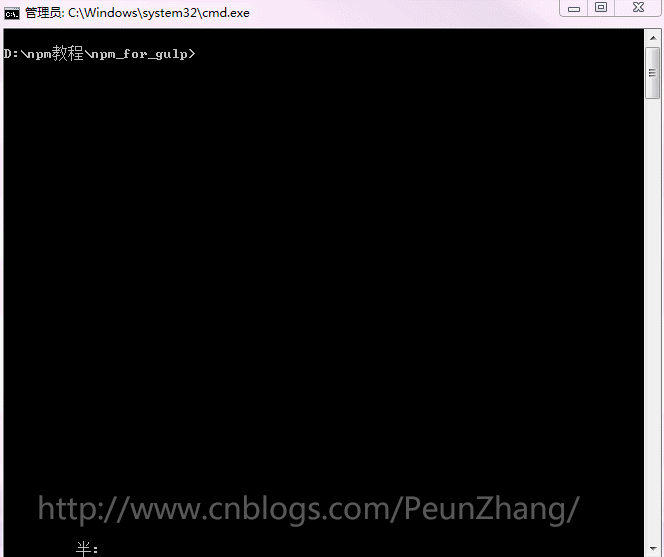

<!-- START doctoc generated TOC please keep comment here to allow auto update -->
<!-- DON'T EDIT THIS SECTION, INSTEAD RE-RUN doctoc TO UPDATE -->
**Table of Contents**  *generated with [DocToc](https://github.com/thlorenz/doctoc)*

- [npm 常用命令总结](#npm-%E5%B8%B8%E7%94%A8%E5%91%BD%E4%BB%A4%E6%80%BB%E7%BB%93)
  - [1. 参考资料](#1-%E5%8F%82%E8%80%83%E8%B5%84%E6%96%99)
  - [2. npm 简介](#2-npm-%E7%AE%80%E4%BB%8B)
  - [3. npm 命令](#3-npm-%E5%91%BD%E4%BB%A4)
  - [3. npm init](#3-npm-init)
  - [4. npm start](#4-npm-start)
  - [5. npm stop](#5-npm-stop)
  - [6. npm install](#6-npm-install)
  - [7. npm uninstall](#7-npm-uninstall)
  - [8. npm update](#8-npm-update)
  - [9. npm ls](#9-npm-ls)
  - [10. npm config](#10-npm-config)
  - [11. npm help](#11-npm-help)
  - [12. npm cache](#12-npm-cache)

<!-- END doctoc generated TOC please keep comment here to allow auto update -->

# npm 常用命令总结

## 1. 参考资料

1. [npm 文档官网](https://docs.npmjs.com/about-npm)

2. [npm 常用命令详解](https://www.cnblogs.com/ysk123/p/11655502.html)

## 2. npm 简介

1. NPM 的全称是 Node Package Manager，是随同 NodeJS 一起安装的包管理和分发工具，使用 NPM 能够让 JavaScript 开发者下载、安装、上传以及管理已经安装的包。

2. npm 包含三个不同的部分：
   - npm 网站
   - 命令行工具
   - 仓库

3. 在 npm 的[官网](https://www.npmjs.com)上。我们可以搜索包、设置配置文件以及管理 npm 体验的其他方面。例如，我们可以设置组织来管理对共有或私有包的访问。

4. 在终端使用 npm 命令，这是大多数开发者同 npm 交互的方式。

5. 仓库是一个庞大的基于 JavaScript 开发的软件的数据库，同时被大量的元信息包围。

## 3. npm 命令

1. npm 提供的命令非常多，但是我们常用的命令不是很多，我们将常用的命令以表格的形式列出来，然后下面详细解释每个命令的用法。**注意**：这里的 npm 命令均以 7.0 及以上版本为基础进行讲解。
   
2. 常用的 npm 命令（`npm` 的命令均以 `npm` 开头）：
   
   npm 命令 | 作用
   :---:|:---:
   npm init | 在项目中引导创建一个package.json文件
   npm start | 启动一个模块
   npm stop | 停止一个模块
   npm install |安装包
   npm uninstall |卸载包
   npm update |更新包
   npm ls |查看已经安装的包
   npm config |管理 npm 的配置
   npm help |查看帮助信息
   npm cache |管理包的缓存


## 3. npm init

1. 在项目中引导创建一个 package.json 文件。

2. 基本语法：
   ```shell
      npm init [--yes|-y|--scope]
      npm init <@scope> (same as `npm exec <@scope>/create`)
      npm init [<@scope>/]<name> (same as `npm exec [<@scope>/]create-<name>`)
      npm init [-w <dir>] [args...]
   ```
3. 我们常用的是第一种形式：`npm init` 或者 `npm init -y|--yes`。

4. 使用 `npm init`，以问答的形式来创建一个 package.json 文件，创建过程如下图所示：
   
    图片来源：[npm 常用命令详解](https://www.cnblogs.com/ysk123/p/11655502.html)

5. 使用 `npm init -y|--yes`，会省略问答过程，直接创建一个 `package.json` 文件，里面包含一些基本的配置项。如下所示：
   ```json
      {
          "name": "Node",
          "version": "1.0.0",
          "description": "",
          "main": "index.js",
          "scripts": {
               "test": "echo \"Error: no test specified\" && exit 1"
          },
          "keywords": [],
          "author": "",
          "license": "ISC"
      }

   ```

## 4. npm start

1. `npm start` 用来启动一个项目或者模块。

2. `npm start` 实际上是 `npm run start` 的简写。
3. 基本语法
   ```shell
      npm start [-- <args>]
   ```
4. 这个命令写在 package.json 文件 scripts 的 start 字段中，可以自定义命令来配置一个服务器环境和安装一系列的必要程序，如：
   ```json
     "scripts": {
         "start": "node foo.js"
     }     
   ```
5. 此时在终端中输入 `npm start`命令，相当于使用 node 执行 foo.js 这个文件。

6. 如果 package.json 文件没有设置 start 这个字段，则将直接执行 `node server.js`。

## 5. npm stop

1. 这个命令运行一个在 package.json 中的 script 字段中定义的 stop 属性指定的命令。

2. 如果没有在 script 定义 stop 属性，那么 `npm stop` 不像 `npm start` 一样有默认执行命令，即 `npm stop` 没有自己的默认执行命令。

3. 语法：
   ```shell
      npm stop [-- <args>]
   ```

4. 我们在 package.json 中的 script 字段中指定 stop 属性，可以自定义命令来配置执行某个程序来终止一个模块的执行。如下示例：
   ```json
      {
           "scripts": {
           "stop": "node bar.js"
           }
      }
   ```
5. 此时在终端中输入 `npm stop`命令，相当于使用 node 执行 bar.js 这个文件。此时输出如下：
   ```
      npm stop
      > npm@x.x.x stop
      > node bar.js
      (bar.js output would be here)
   ```
 
## 6. npm install

1. `npm install` 是我们最常用的 npm 命令，用来安装我们需要的模块。

2. 语法：
   ```shell
      npm install (with no args, in package dir)
      npm install [<@scope>/]<name>
      npm install [<@scope>/]<name>@<tag>
      npm install [<@scope>/]<name>@<version>
      npm install [<@scope>/]<name>@<version range>
      npm install <alias>@npm:<name>
      npm install <git-host>:<git-user>/<repo-name>
      npm install <git repo url>
      npm install <tarball file>
      npm install <tarball url>
      npm install <folder>
      aliases: npm i, npm add
      common options: [-P|--save-prod|-D|--save-dev|-O|--save-optional|--save-peer] [-E|--save-exact] [-B|--save-bundle] [--no-save] [--dry-run]
   ```

3. 使用 `npm install `命令会安装一个包以及这个包所依赖的其他包。如果这个 包有 package-lock.json、npm-shrinkwrap.json 或者 yarn.lock 其中一个文件，那么会根据文件中的内容安装依赖。三个锁定版本的文件的优先级是：
   ```
      npm-shrinkwrap.json
      package-lock.json
      yarn.lock
   ```
4. 直接使用 `npm install`，不带任何参数，那么会安装 `package.json` 中 指定的所有依赖的包。

5. 使用 `npm install` 命令安装完包以后，会在 package.json 中的依赖字段中添加所安装的包的版本信息。

6. 安装包，默认会安装最新版本：
   ```shell
      npm install react
   ```
   输出：
   ```shell
      PS C:\D_Work\Front-End\JavaScriptNotes\Node> npm install react
      npm notice created a lockfile as package-lock.json. You should commit this file.
      npm WARN Node@1.0.0 No description
      npm WARN Node@1.0.0 No repository field.

      + react@17.0.2
      added 4 packages from 3 contributors in 0.484s

   ```
   在 package.json 中依赖字段添加包的版本信息：
   ```json
      "dependencies": {
          "react": "^17.0.2"
      }
   ```
7. 使用 `npm install <name>@<version>` 命令，可以指定包的版本信息。用法如下：
   1. 指定大版本号：`npm install react@16`，这样会安装这个大版本内最新的包。安装信息如下所示：
      ```
         PS C:\D_Work\Front-End\JavaScriptNotes\Node> npm install react@16
         npm WARN Node@1.0.0 No description
         npm WARN Node@1.0.0 No repository field.

         + react@16.14.0
           added 6 packages from 3 contributors in 0.524s

      ```
      package.json 中的依赖信息是：
      ```json
         "dependencies": {
              "react": "^16.14.0"
         }
      ```
   2. 指定具体的版本号：`npm install react@16.8.1`。这样会安装指定的版本的包。安装信息如下所示：
      ```
         PS C:\D_Work\Front-End\JavaScriptNotes\Node> npm install react@16.8.1
         npm WARN Node@1.0.0 No description
         npm WARN Node@1.0.0 No repository field.

         + react@16.8.1
         added 7 packages from 3 contributors in 0.86s

      ```
      package.json 中的依赖信息是：
      ```json
         "dependencies": {
                "react": "^16.8.1"
         }
      ```
8. 项目对模块的依赖可以使用下面的 3 种方法来表示（假设当前版本号是 1.1.0 ）：
   - 兼容模块新发布的补丁版本：~1.1.0、1.1.x、1.1
   - 兼容模块新发布的小版本、补丁版本：^1.1.0、1.x、1
   - 兼容模块新发布的大版本、小版本、补丁版本：*、x

9. `npm install [<@scope>/]<name>@<tag>` 这样的命令也很常见。对这个命令的解释如下：
   - `<@scope>` 指的是范围，也就是某个包是在某个某个范围下。范围的名称符合包的命名规则（url 安全字符、不以点 `.` 和下划线`_`开头）。 使用范围，可以将多个相关的包放到一起管理。举个例子，我们使用 babel v7 以上的版本，我们的安装命令是 `npm install @babel/core @babel/cli`，babel 就是范围，而 core 和 cli 就是在 babel 这个范围下的包。在 node_modules 中，core 和 cli 都会放在 `@babel` 这个文件夹的下面。也就是属于某个范围（scope）的包都会在 `@scope` 这个文件夹下。在 package.json 中，core 和 cli 的信息如下：
      ```json
         "dependencies": {
              "@babel/cli": "^7.15.7",
              "@babel/core": "^7.15.8"
         }
      ```
     依赖信息中包名也是` @scope/package` 这种形式。引用的方式如下：
      ```js
         require('@babel/core');
      ```
   - <name> 指的是包的名称。
   - `@<tag>` 指的是版本标识。即对包的版本使用文字描述，也可以理解为语义化的版本信息。这个 tag 是包的分发的时候就已经指定了。如果 tag 描述的包版本在注册仓库中不存在，那么安装就会失败。例如：`npm install @myorg/mypackage@latest`，`@latest` 中 `latest` 就是版本标识（tag），表示安装最新版。

10. `npm install [<@scope>/]<name>@<version>` 和`npm install [<@scope>/]<name>@<tag>` 类似，只不过 `@<version>` 中的 `version` 指的是版本信息。

### 1. --save / -S

1. npm install 的选项（option），用来将安装的包的版本信息写 package.json 中的 dependencies 字段。

2. 示例：`npm install react --save` 或者 `npm install react -S`

3. 注意：在 npm 6 及之后的版本中，不用加 `--save` / `-S` 选项也会将包的版本信息写 package.json 中的 dependencies 字段。因此，现在这个选项已经不推荐使用了。

### 2. --save-dev / -D
1. npm install 的选项（option），用来安装包信息将加入到 package.json 的 `devDependencies`（开发阶段的依赖），所以开发阶段一般使用它。

2. 示例：`npm install gulp --save-dev` 或者 `npm install gulp -D`

3. package.json 的 `devDependencies` 中的 gulp 版本信息：
   ```json
      "devDependencies": {
          "gulp": "^4.0.2"
      }
   ```

### 3. --global / -g

1. 使用这个选项安装包，会将包安装在全局环境下。这样我们可以在系统的任何地方使用这个包。

2. 普通的安装（不带 --global / -g）会将包安装在当前的工作路径下。只能在当前的项目中使用这个包。

3. 示例：`npm install nodemon -g` 或者 `npm install nodemon --global`

### 4. --save-optional / -O

1. 使用这个选项安装包，会将包的信息将加入到 package.son 中的 `optionalDependencies`（可选阶段的依赖）。

2. optionalDependencies 这个字段的作用是：如果我们希望使用某个依赖项，但如果找不到或安装失败，但是希望 npm 继续进行，那么您可以将这个依赖放在 optionalDependencies 对象中。与 dependencies 不同之处在于构建失败不会导致安装失败。运行 `npm install --no-optional` 将阻止安装这些依赖项。

3. 示例： `npm install gulp --save-optional` 或 `npm install gulp -O`

4. package.json 文件的 optionalDependencies 字段 中 gulp 的版本信息：
   ```json
      "optionalDependencies": {
          "gulp": "^3.9.1"
      }

   ```

### 5. --save-prod / -P

1.  使用这个选项安装包，会将包的信息将加入到 package.son 中的 `dependencies` 字段中。即生产环境的依赖。作用和 `--save` / `-S` 类似。

### 6. --save-exact / -E

1. 这个选项用来精确指定安装的包的版本。

2. 示例：`npm install gulp --save-exact` 或 `npm install gulp -E`

3. 输入命令npm install gulp -E，安装完成以后，观察 package.json 文件的 dependencies 字段，可以看出版本号中的 `^` 消失了：
   ```json
      "devDependencies": {
           "gulp": "4.0.2"
      }
   ```
   这表示我们安装的 gulp 就是 4.0.2 这个版本。


## 7. npm uninstall

1. npm uninstall 也是一个比较常用的的命令。用来卸载某个包。

2. 语法：
   ```shell
      npm uninstall [<@scope>/]<pkg>[@<version>]... [-S|--save|--no-save]
      aliases: remove, rm, r, un, unlink
   ```

3. 示例 —— 卸载某个包：
   ```shell
      npm uninstall react
   ```
   终端输出信息如下：
   ```shell
      PS C:\D_Work\Front-End\JavaScriptNotes\Node> npm uninstall react
      npm WARN Node@1.0.0 No description
      npm WARN Node@1.0.0 No repository field.
      npm WARN optional SKIPPING OPTIONAL DEPENDENCY: fsevents@1.2.13 (node_modules\fsevents):
      npm WARN notsup SKIPPING OPTIONAL DEPENDENCY: Unsupported platform for fsevents@1.2.13: wanted {"os":"darwin","arch":"any"} (current: {"os":"win32","arch":"x64"})

      removed 7 packages in 1.351s

      7 packages are looking for funding
      run `npm fund` for details

   ```
4. 示例 —— 卸载指定版本的包：
   ```shell
      npm uninstall react@16.8.1
   ```
5. 示例 —— 卸载开发版本的包：
   ```shell
      npm uninstall gulp --save-dev
   ```

6. 示例 —— 卸载全局安装的包：
   ```shell
      npm uninstall typescript --global
   ```

## 8. npm link

2. 语法：
   ```shell
      npm link (in package dir)
      npm link [<@scope>/]<pkg>[@<version>]
      alias: npm ln
   ```

## 8. npm update

2. 语法：
   ```shell
      npm update [-g] [<pkg>...]
      aliases: up, upgrade
   ```

## 9. npm ls

2. 语法：
   ```shell
      npm ls [[<@scope>/]<pkg> ...]
      aliases: list, la, ll
   ```


## 10. npm config

2. 语法：
   ```shell
      npm config set <key>=<value> [<key>=<value> ...]
      npm config get [<key> [<key> ...]]
      npm config delete <key> [<key> ...]
      npm config list [--json]
      npm config edit
      npm set <key>=<value> [<key>=<value> ...]
      npm get [<key> [<key> ...]]
   ```

## 11. npm help

2. 语法：
   ```shell
      npm help <term> [<terms..>]
   ```
   
## 12. npm cache

1. 和包的缓存相关的命令。

2. 语法：
   ```shell
      npm cache add <tarball file>...
      npm cache add <folder>...
      npm cache add <tarball url>...
      npm cache add <name>@<version>...
      npm cache clean
      aliases: npm cache clear, npm cache rm
      npm cache verify
   ```


