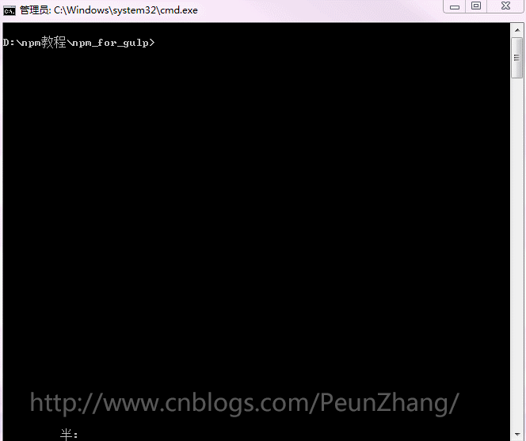
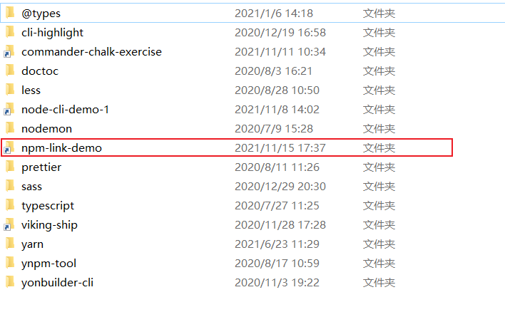
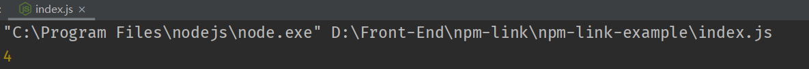
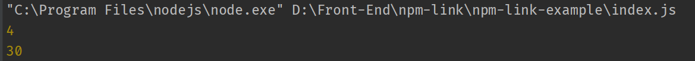
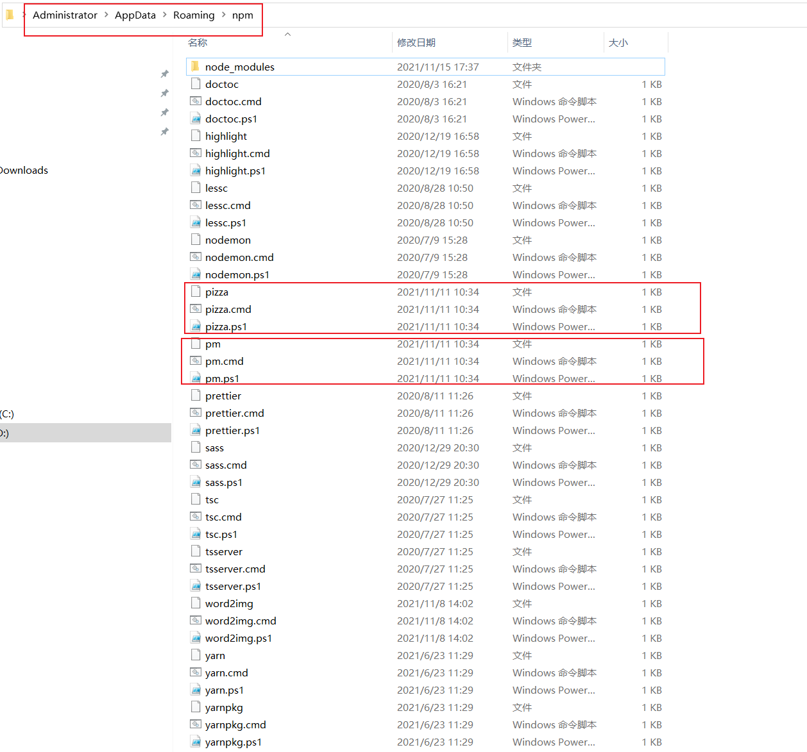
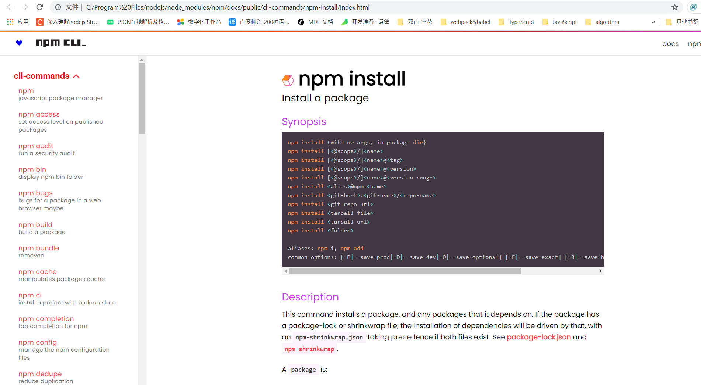

<!-- START doctoc generated TOC please keep comment here to allow auto update -->
<!-- DON'T EDIT THIS SECTION, INSTEAD RE-RUN doctoc TO UPDATE -->
**Table of Contents**  *generated with [DocToc](https://github.com/thlorenz/doctoc)*

- [npm 常用命令总结](#npm-%E5%B8%B8%E7%94%A8%E5%91%BD%E4%BB%A4%E6%80%BB%E7%BB%93)
  - [1. 参考资料](#1-%E5%8F%82%E8%80%83%E8%B5%84%E6%96%99)
  - [2. npm 简介](#2-npm-%E7%AE%80%E4%BB%8B)
  - [3. npm 命令](#3-npm-%E5%91%BD%E4%BB%A4)
  - [4. npm init](#4-npm-init)
  - [5. npm start](#5-npm-start)
  - [6. npm stop](#6-npm-stop)
  - [7. npm install](#7-npm-install)
    - [1. --save / -S](#1---save---s)
    - [2. --save-dev / -D](#2---save-dev---d)
    - [3. --global / -g](#3---global---g)
    - [4. --save-optional / -O](#4---save-optional---o)
    - [5. --save-prod / -P](#5---save-prod---p)
    - [6. --save-exact / -E](#6---save-exact---e)
  - [8. npm uninstall](#8-npm-uninstall)
  - [9. npm link](#9-npm-link)
  - [10. npm update](#10-npm-update)
  - [11. npm ls](#11-npm-ls)
    - [1. `--all`](#1---all)
    - [2. `--json`](#2---json)
    - [3. `--global` / `-g`](#3---global---g)
  - [12. npm config](#12-npm-config)
  - [13. npm help](#13-npm-help)
  - [14. npm cache](#14-npm-cache)

<!-- END doctoc generated TOC please keep comment here to allow auto update -->

# npm 常用命令总结

## 1. 参考资料

1. [npm 文档官网](https://docs.npmjs.com/about-npm)

2. [npm 常用命令详解](https://www.cnblogs.com/ysk123/p/11655502.html)

## 2. npm 简介

1. NPM 的全称是 Node Package Manager，是随同 NodeJS 一起安装的包管理和分发工具，使用 NPM 能够让 JavaScript 开发者下载、安装、上传以及管理已经安装的包。

2. npm 包含三个不同的部分：
   - npm 网站
   - 命令行工具
   - 仓库

3. 在 npm 的[官网](https://www.npmjs.com)上。我们可以搜索包、设置配置文件以及管理 npm 体验的其他方面。例如，我们可以设置组织来管理对共有或私有包的访问。

4. 在终端使用 npm 命令，这是大多数开发者同 npm 交互的方式。

5. 仓库是一个庞大的基于 JavaScript 开发的软件的数据库，同时被大量的元信息包围。

## 3. npm 命令

1. npm 提供的命令非常多，但是我们常用的命令不是很多，我们将常用的命令以表格的形式列出来，然后下面详细解释每个命令的用法。**注意**：这里的 npm 命令均以 7.0 及以上版本为基础进行讲解。
   
2. 常用的 npm 命令（`npm` 的命令均以 `npm` 开头）：
   
   npm 命令 | 作用
   :---:|:---:
   npm init | 在项目中引导创建一个package.json文件
   npm start | 启动一个模块
   npm stop | 停止一个模块
   npm install |安装包
   npm uninstall |卸载包
   npm update |更新包
   npm ls |查看已经安装的包
   npm config |管理 npm 的配置
   npm help |查看帮助信息
   npm cache |管理包的缓存


## 4. npm init

1. 在项目中引导创建一个 package.json 文件。

2. 基本语法：
   ```shell
      npm init [--yes|-y|--scope]
      npm init <@scope> (same as `npm exec <@scope>/create`)
      npm init [<@scope>/]<name> (same as `npm exec [<@scope>/]create-<name>`)
      npm init [-w <dir>] [args...]
   ```
3. 我们常用的是第一种形式：`npm init` 或者 `npm init -y|--yes`。

4. 使用 `npm init`，以问答的形式来创建一个 package.json 文件，创建过程如下图所示：
   
    图片来源：[npm 常用命令详解](https://www.cnblogs.com/ysk123/p/11655502.html)

5. 使用 `npm init -y|--yes`，会省略问答过程，直接创建一个 `package.json` 文件，里面包含一些基本的配置项。如下所示：
   ```json
      {
          "name": "Node",
          "version": "1.0.0",
          "description": "",
          "main": "index.js",
          "scripts": {
               "test": "echo \"Error: no test specified\" && exit 1"
          },
          "keywords": [],
          "author": "",
          "license": "ISC"
      }

   ```

## 5. npm start

1. `npm start` 用来启动一个项目或者模块。

2. `npm start` 实际上是 `npm run start` 的简写。
3. 基本语法
   ```shell
      npm start [-- <args>]
   ```
4. 这个命令写在 package.json 文件 scripts 的 start 字段中，可以自定义命令来配置一个服务器环境和安装一系列的必要程序，如：
   ```json
     "scripts": {
         "start": "node foo.js"
     }     
   ```
5. 此时在终端中输入 `npm start`命令，相当于使用 node 执行 foo.js 这个文件。

6. 如果 package.json 文件没有设置 start 这个字段，则将直接执行 `node server.js`。

## 6. npm stop

1. 这个命令运行一个在 package.json 中的 script 字段中定义的 stop 属性指定的命令。

2. 如果没有在 script 定义 stop 属性，那么 `npm stop` 不像 `npm start` 一样有默认执行命令，即 `npm stop` 没有自己的默认执行命令。

3. 语法：
   ```shell
      npm stop [-- <args>]
   ```

4. 我们在 package.json 中的 script 字段中指定 stop 属性，可以自定义命令来配置执行某个程序来终止一个模块的执行。如下示例：
   ```json
      {
           "scripts": {
           "stop": "node bar.js"
           }
      }
   ```
5. 此时在终端中输入 `npm stop`命令，相当于使用 node 执行 bar.js 这个文件。此时输出如下：
   ```
      npm stop
      > npm@x.x.x stop
      > node bar.js
      (bar.js output would be here)
   ```
 
## 7. npm install

1. `npm install` 是我们最常用的 npm 命令，用来安装我们需要的模块。

2. 语法：
   ```shell
      npm install (with no args, in package dir)
      npm install [<@scope>/]<name>
      npm install [<@scope>/]<name>@<tag>
      npm install [<@scope>/]<name>@<version>
      npm install [<@scope>/]<name>@<version range>
      npm install <alias>@npm:<name>
      npm install <git-host>:<git-user>/<repo-name>
      npm install <git repo url>
      npm install <tarball file>
      npm install <tarball url>
      npm install <folder>
      aliases: npm i, npm add
      common options: [-P|--save-prod|-D|--save-dev|-O|--save-optional|--save-peer] [-E|--save-exact] [-B|--save-bundle] [--no-save] [--dry-run]
   ```

3. 使用 `npm install `命令会安装一个包以及这个包所依赖的其他包。如果这个 包有 package-lock.json、npm-shrinkwrap.json 或者 yarn.lock 其中一个文件，那么会根据文件中的内容安装依赖。三个锁定版本的文件的优先级是：
   ```
      npm-shrinkwrap.json
      package-lock.json
      yarn.lock
   ```
4. 直接使用 `npm install`，不带任何参数，那么会安装 `package.json` 中 指定的所有依赖的包。

5. 使用 `npm install` 命令安装完包以后，会在 package.json 中的依赖字段中添加所安装的包的版本信息。

6. 安装包，默认会安装最新版本：
   ```shell
      npm install react
   ```
   输出：
   ```shell
      PS C:\D_Work\Front-End\JavaScriptNotes\Node> npm install react
      npm notice created a lockfile as package-lock.json. You should commit this file.
      npm WARN Node@1.0.0 No description
      npm WARN Node@1.0.0 No repository field.

      + react@17.0.2
      added 4 packages from 3 contributors in 0.484s

   ```
   在 package.json 中依赖字段添加包的版本信息：
   ```json
      "dependencies": {
          "react": "^17.0.2"
      }
   ```
7. 使用 `npm install <name>@<version>` 命令，可以指定包的版本信息。用法如下：
   1. 指定大版本号：`npm install react@16`，这样会安装这个大版本内最新的包。安装信息如下所示：
      ```
         PS C:\D_Work\Front-End\JavaScriptNotes\Node> npm install react@16
         npm WARN Node@1.0.0 No description
         npm WARN Node@1.0.0 No repository field.

         + react@16.14.0
           added 6 packages from 3 contributors in 0.524s

      ```
      package.json 中的依赖信息是：
      ```json
         "dependencies": {
              "react": "^16.14.0"
         }
      ```
   2. 指定具体的版本号：`npm install react@16.8.1`。这样会安装指定的版本的包。安装信息如下所示：
      ```
         PS C:\D_Work\Front-End\JavaScriptNotes\Node> npm install react@16.8.1
         npm WARN Node@1.0.0 No description
         npm WARN Node@1.0.0 No repository field.

         + react@16.8.1
         added 7 packages from 3 contributors in 0.86s

      ```
      package.json 中的依赖信息是：
      ```json
         "dependencies": {
                "react": "^16.8.1"
         }
      ```
8. 项目对模块的依赖可以使用下面的 3 种方法来表示（假设当前版本号是 1.1.0 ）：
   - 兼容模块新发布的补丁版本：~1.1.0、1.1.x、1.1
   - 兼容模块新发布的小版本、补丁版本：^1.1.0、1.x、1
   - 兼容模块新发布的大版本、小版本、补丁版本：*、x

9. `npm install [<@scope>/]<name>@<tag>` 这样的命令也很常见。对这个命令的解释如下：
   - `<@scope>` 指的是范围，也就是某个包是在某个某个范围下。范围的名称符合包的命名规则（url 安全字符、不以点 `.` 和下划线`_`开头）。 使用范围，可以将多个相关的包放到一起管理。举个例子，我们使用 babel v7 以上的版本，我们的安装命令是 `npm install @babel/core @babel/cli`，babel 就是范围，而 core 和 cli 就是在 babel 这个范围下的包。在 node_modules 中，core 和 cli 都会放在 `@babel` 这个文件夹的下面。也就是属于某个范围（scope）的包都会在 `@scope` 这个文件夹下。在 package.json 中，core 和 cli 的信息如下：
      ```json
         "dependencies": {
              "@babel/cli": "^7.15.7",
              "@babel/core": "^7.15.8"
         }
      ```
     依赖信息中包名也是` @scope/package` 这种形式。引用的方式如下：
      ```js
         require('@babel/core');
      ```
   - <name> 指的是包的名称。
   - `@<tag>` 指的是版本标识。即对包的版本使用文字描述，也可以理解为语义化的版本信息。这个 tag 是包的分发的时候就已经指定了。如果 tag 描述的包版本在注册仓库中不存在，那么安装就会失败。例如：`npm install @myorg/mypackage@latest`，`@latest` 中 `latest` 就是版本标识（tag），表示安装最新版。

10. `npm install [<@scope>/]<name>@<version>` 和`npm install [<@scope>/]<name>@<tag>` 类似，只不过 `@<version>` 中的 `version` 指的是版本信息。

### 1. --save / -S

1. npm install 的选项（option），用来将安装的包的版本信息写 package.json 中的 dependencies 字段。

2. 示例：`npm install react --save` 或者 `npm install react -S`

3. 注意：在 npm 6 及之后的版本中，不用加 `--save` / `-S` 选项也会将包的版本信息写 package.json 中的 dependencies 字段。因此，现在这个选项已经不推荐使用了。

### 2. --save-dev / -D

1. npm install 的选项（option），用来安装包信息将加入到 package.json 的 `devDependencies`（开发阶段的依赖），所以开发阶段一般使用它。

2. 示例：`npm install gulp --save-dev` 或者 `npm install gulp -D`

3. package.json 的 `devDependencies` 中的 gulp 版本信息：
   ```json
      "devDependencies": {
          "gulp": "^4.0.2"
      }
   ```

### 3. --global / -g

1. 使用这个选项安装包，会将包安装在全局环境下。这样我们可以在系统的任何地方使用这个包。

2. 普通的安装（不带 --global / -g）会将包安装在当前的工作路径下。只能在当前的项目中使用这个包。

3. 示例：`npm install nodemon -g` 或者 `npm install nodemon --global`

### 4. --save-optional / -O

1. 使用这个选项安装包，会将包的信息将加入到 package.son 中的 `optionalDependencies`（可选阶段的依赖）。

2. optionalDependencies 这个字段的作用是：如果我们希望使用某个依赖项，但如果找不到或安装失败，但是希望 npm 继续进行，那么您可以将这个依赖放在 optionalDependencies 对象中。与 dependencies 不同之处在于构建失败不会导致安装失败。运行 `npm install --no-optional` 将阻止安装这些依赖项。

3. 示例： `npm install gulp --save-optional` 或 `npm install gulp -O`

4. package.json 文件的 optionalDependencies 字段 中 gulp 的版本信息：
   ```json
      "optionalDependencies": {
          "gulp": "^3.9.1"
      }

   ```

### 5. --save-prod / -P

1.  使用这个选项安装包，会将包的信息将加入到 package.son 中的 `dependencies` 字段中。即生产环境的依赖。作用和 `--save` / `-S` 类似。

### 6. --save-exact / -E

1. 这个选项用来精确指定安装的包的版本。

2. 示例：`npm install gulp --save-exact` 或 `npm install gulp -E`

3. 输入命令npm install gulp -E，安装完成以后，观察 package.json 文件的 dependencies 字段，可以看出版本号中的 `^` 消失了：
   ```json
      "devDependencies": {
           "gulp": "4.0.2"
      }
   ```
   这表示我们安装的 gulp 就是 4.0.2 这个版本。


## 8. npm uninstall

1. npm uninstall 也是一个比较常用的的命令。用来卸载某个包。

2. 语法：
   ```shell
      npm uninstall [<@scope>/]<pkg>[@<version>]... [-S|--save|--no-save]
      aliases: remove, rm, r, un, unlink
   ```

3. 示例 —— 卸载某个包：
   ```shell
      npm uninstall react
   ```
   终端输出信息如下：
   ```shell
      PS C:\D_Work\Front-End\JavaScriptNotes\Node> npm uninstall react
      npm WARN Node@1.0.0 No description
      npm WARN Node@1.0.0 No repository field.
      npm WARN optional SKIPPING OPTIONAL DEPENDENCY: fsevents@1.2.13 (node_modules\fsevents):
      npm WARN notsup SKIPPING OPTIONAL DEPENDENCY: Unsupported platform for fsevents@1.2.13: wanted {"os":"darwin","arch":"any"} (current: {"os":"win32","arch":"x64"})

      removed 7 packages in 1.351s

      7 packages are looking for funding
      run `npm fund` for details

   ```
4. 示例 —— 卸载指定版本的包：
   ```shell
      npm uninstall react@16.8.1
   ```
5. 示例 —— 卸载开发版本的包：
   ```shell
      npm uninstall gulp --save-dev
   ```

6. 示例 —— 卸载全局安装的包：
   ```shell
      npm uninstall typescript --global
   ```

## 9. npm link

1. 这个命令主要用于调试本地开发的模块。

2. 参考资料：
   - [npm link的使用](https://www.jianshu.com/p/aaa7db89a5b2)

3. 语法：
   ```shell
      npm link (in package dir)
      npm link [<@scope>/]<pkg>[@<version>]
      alias: npm ln
   ```
4. 比如说，我们在本地开发了一个模块，想要在其他项目中引用一下，进行测试。一种可行的办法是直接上传到 npm 的服务器上，然后使用 `npm install` 进行安装。但是这种方法需要不断地修改、打包、上传、安装，比较麻烦，因此不推荐使用这种方法。而使用 `npm link` 就可以实现这个目的。

5. 假设我们现在手里有两个项目，一个是 `npm-link-demo`，是我们开发的 npm 模块，另外一个是 `npm-link-example`，需要引用 `npm-link-demo` 这个模块。

6. 首先，我们进入 `npm-link-demo` 项目，执行 `npm link`。
   ```shell
       cd npm-link-demo
       npm link
   ```
7. `npm link` 会在全局文件夹下创建一个符号链接（symlink），这个全局文件夹的路径是：`{prefix}/lib/node_modules/<package>`，这个是 npm 官方文档上的描述，我们可以通过 `npm config get prefix` 命令获取到 prefix 的值：
   ```shell
      npm config get prefix
      
      // output
      C:\Users\Administrator\AppData\Roaming\npm
   ```
8. 如果项目中的 `package.json` 中存在 bin 字段，那么也会将 `bin` 指定的执行文件所在的目录链接到 `{prefix}/bin/{name}`。

9. 由于我使用的是 windows 系统，那么实际的路径是：`{prefix}/node_modules/<package>`。实际观察，会发现在 `{prefix}/node_modules/<package>` 路径下的 `node-link-demo` 是一个快捷方式，如下图所示：
   

10. 然后，进入 `npm-link-example` 项目，执行 `npm link npm-link-demo`，命令如下：
    ```shell
       cd npm-link-example
       npm link npm-link-demo
    ```
11. `npm-link-demo` 会被链接到 `npm-link-example/node_modules` 下面，同样也是快捷方式：
     

12. **注意**：`node_modules` 中引入的模块的名字并不是项目的名字，而是项目中 `package.json` 中 `name` 字段指定的包的名字。

13. 这样我们就可以像使用 npm install 安装的第三方包一样使用 `npm-link-demo` 这个模块了。

14. 我们在 `npm-link-demo` 是这样写的：
    ```js
       // index.js
       module.exports = (x, y) => {
           return x + y;
       }
    ```
15. 在 `npm-link-example` 中引入 `npm-link-demo`，如下所示：
    ```js
       const add = require('npm-link-demo');
       console.log(add(1, 3));
    ```
   输出如下：
   
   
16. 我们现在对 `npm-link-demo` 中的内容进行修改：
    ```js
        module.exports.add = (x, y) => {
            return x + y;
       }

       module.exports.multiply = (x, y) => {
            return x * y;
       }
    ```
17. 在 `npm-link-example` 中引用：
    ```js
       const {add, multiply} = require('npm-link-demo');
       console.log(add(1, 3));
       console.log(multiply(5, 6));
    ```
    输出如下：
    

18. 我们无需重新构建 `npm-link-demo`，我们修改的内容就同步到了  `npm-link-example` 的 node_modules 下的对应模块中。这就是 npm link 命令的最大意义。

19. npm link 的使用分为两步：
    - 在需要进行测试的模块 `module-a` 的根目录下（package.json 所在的目录）执行 npm link，在全局文件夹 `{prefix}/lib/node_modules/<package>` 创建一个符号链接到这个测试模块。
    - 在需要使用 `module-a` 的项目 `module-b` 的根目录下，执行 `npm link package name`，`package name` 指的是需要引入模块的package.json 中指定的模块名称。`npm link package name` 会创建一个从全局文件夹中安装的 `module-a` 到 `node_modules` 的一个符号链接，即在 `module-b` 的 `node_modules` 中安装 `module-a` 这个模块。这样就能在 `module-b` 中使用 `module-a` 导出的内容了。

20. 我们在开发命令行工具的时候，需要使用 npm link 命令将我们开发的命令链接到 `{prefix}/bin/{name}` 下，这样我们能在全局环境下测试、使用我们的命令。由于我目前使用的是 windows 系统，那么实际的路径是：`{prefix}/{name}`。我们可以做一个验证：
    - 通过 `npm config get prefix` 拿到的 `prefix` 是：`C:\Users\Administrator\AppData\Roaming\npm`
    - 在 prefix 指定的路径下，我们就能找到链接到的命令文件，如下所示：
     

21. npm link 命令几个注意的点：
    - 项目中的 `package.json` 中存在 `bin` 字段，那么也会将 `bin` 指定的执行文件所在的目录链接到 `{prefix}/bin/{name}`。
    - `npm link package name` 命令中的 `package name` 指的是需要引入模块的 `package.json` 中指定的模块名称。
    - `prefix` 是一个路径前缀，我们可以通过 `npm config get prefix` 命令获取到 `prefix` 的值。

## 10. npm update

1. 这个命令将根据包及其依赖项的 semver（Semantic Versioning，语义化版本）约束，将列出的所有包更新为最新版本（由标记配置指定）。也会安装缺失的包。

2. 语法：
   ```shell
      npm update [-g] [<pkg>...]
      aliases: up, upgrade
   ```

3. 如果指定了 -g 选项，这个命令会更新所有的全局安装的包。

4. 如果没有指定包名，那么会更新当前范围（全局/本地）内所有的包。

5. 示例：
   1. package.json 内的依赖项如下：
      ```json
           "dependencies": {
                "dep1": "^1.1.1"
           }
      ```
   2. 执行 `npm update` 这个命令，那么会安装 `1.2.2` 版本的 dep1。因为 `1.2.2` 是 dep1 的最新版本，同时 `1.2.2` 满足 `^1.1.1` 的语义化要求。


## 11. npm ls

1. 这个命令会将所有的包及其版本在终端打印出来。

2. 语法：
   ```shell
      npm ls [[<@scope>/]<pkg> ...]
      aliases: list, la, ll
   ```

3. 执行 `npm ls`，终端打印出的信息如下：
   ```
      Node@1.0.0 D:\Front-End\JavaScriptNotes\Node
      `-- react@17.0.2
        +-- loose-envify@1.4.0
        | `-- js-tokens@4.0.0
        `-- object-assign@4.1.1

   ```
4. 观察这个打印信息，不仅输出了当前环境中所以依赖的包，还将包的依赖也打印出来了。

### 1. `--all`

1. 指定了这个选项，会将当前环境中安装的所有的包及其版本信息以及这些包的依赖以树的形式在终端打印出来。

2. 执行 `npm ls --all`，终端打印出的信息如下：
   ```
      Node@1.0.0 D:\Front-End\JavaScriptNotes\Node
      `-- react@17.0.2
        +-- loose-envify@1.4.0
        | `-- js-tokens@4.0.0
        `-- object-assign@4.1.1

   ```

### 2. `--json`

1. 指定了这个选项，会将当前环境中安装的所有的包及其版本信息以及这些包的依赖以 json 的形式在终端打印出来。

2. 执行 `npm ls --json`，终端打印出的信息如下：
   ```json
      {
          "name": "Node",
          "version": "1.0.0",
          "dependencies": {
               "react": {
                   "version": "17.0.2",
                   "from": "react",
                   "resolved": "https://registry.npmmirror.com/react/download/react-17.0.2.tgz",
                   "dependencies": {
                        "loose-envify": {
                            "version": "1.4.0",
                            "from": "loose-envify@^1.1.0",
                            "resolved": "https://registry.npm.taobao.org/loose-envify/download/loose-envify-1.4.0.tgz",
                            "dependencies": {
                            "js-tokens": {
                                "version": "4.0.0",
                                "from": "js-tokens@^3.0.0 || ^4.0.0",
                                "resolved": "https://registry.nlark.com/js-tokens/download/js-tokens-4.0.0.tgz"
                           }
                       }
                  },
                  "object-assign": {
                      "version": "4.1.1",
                      "from": "object-assign@^4.1.1",
                      "resolved": "https://registry.npm.taobao.org/object-assign/download/object-assign-4.1.1.tgz?cache=0&sync_timestamp=1602657128410&other_urls=https%3A%2F%2Fregistry.npm.taobao.org%2Fobject-assign%2Fdownload%2Fobject-assign-4.1.1.tgz"
                  }
              }
            }
          }
      }

   ```
3. 观察终端的输出，关于包及其依赖的信息很详细。

### 3. `--global` / `-g`
1. 指定了这个选项，会将在全局环境中安装的所有的包及其版本信息以及这些包的依赖以树的形式在终端打印出来。

2. 执行 `npm ls --global`，终端打印出的信息（部分）如下：
   ```
      C:\Users\Administrator\AppData\Roaming\npm
       +-- @types/node@14.14.20
       +-- cli-highlight@2.1.9
       | +-- chalk@4.1.0
       | | +-- ansi-styles@4.3.0
       | | | `-- color-convert@2.0.1
       | | |   `-- color-name@1.1.4
       | | `-- supports-color@7.2.0
       | |   `-- has-flag@4.0.0
       | +-- highlight.js@10.4.1
       | +-- mz@2.7.0
       | | +-- any-promise@1.3.0
       | | +-- object-assign@4.1.1
       | | `-- thenify-all@1.6.0
       | |   `-- thenify@3.3.1
       | |     `-- any-promise@1.3.0 deduped
       | +-- parse5@5.1.1
       | +-- parse5-htmlparser2-tree-adapter@6.0.1
       | | `-- parse5@6.0.1
       | `-- yargs@15.4.1
       |   +-- cliui@6.0.0
       |   | +-- string-width@4.2.0 deduped
       |   | +-- strip-ansi@6.0.0
       |   | | `-- ansi-regex@5.0.0
       |   | `-- wrap-ansi@6.2.0
       |   |   +-- ansi-styles@4.3.0 deduped
       |   |   +-- string-width@4.2.0 deduped
       |   |   `-- strip-ansi@6.0.0 deduped
       |   +-- decamelize@1.2.0
       |   +-- find-up@4.1.0
       |   | +-- locate-path@5.0.0
       |   | | `-- p-locate@4.1.0
       |   | |   `-- p-limit@2.3.0
       |   | |     `-- p-try@2.2.0
       |   | `-- path-exists@4.0.0
       |   +-- get-caller-file@2.0.5
       |   +-- require-directory@2.1.1
       |   +-- require-main-filename@2.0.0
       |   +-- set-blocking@2.0.0
       |   +-- string-width@4.2.0
       |   | +-- emoji-regex@8.0.0
       |   | +-- is-fullwidth-code-point@3.0.0
       |   | `-- strip-ansi@6.0.0 deduped
       |   +-- which-module@2.0.0
       |   +-- y18n@4.0.1
       |   `-- yargs-parser@18.1.3
       |     +-- camelcase@5.3.1
       |     `-- decamelize@1.2.0 deduped
   ```

## 12. npm config

1. 这个命令用来管理 npm 的配置文件。

2. 语法：
   ```shell
      npm config set <key>=<value> [<key>=<value> ...]
      npm config get [<key> [<key> ...]]
      npm config delete <key> [<key> ...]
      npm config list [--json]
      npm config edit
      npm set <key>=<value> [<key>=<value> ...]
      npm get [<key> [<key> ...]]
   ```
3. 对于 `npm config` 这个命令用得最多应该是设置代理，解决npm安装一些模块失败的问题。

4. 例如公司内网，因为公司的防火墙原因，无法完成任何模块的安装，这个时候设置代理可以解决：`npm config set proxy http://xxx`。

5. 又比如安装包的时候，默认是从官方的源拉取，但是由于国内的网络环境问题，访问官方的源非常慢，可能会导致安装包的失败。所以我们需要使用国内的镜像，比如说著名的淘宝镜像，此时我们简单设置镜像：`npm config set registry https://registry.npm.taobao.org`。

6. 子命令 `set` 用于设置某个配置项。后面跟着的是 `key value` 或者是 `key=value` 的形式。

7. 子命令 `get` 用于查看某个配置项的值。后面跟着的是配置项。

8. 子命令 `list` 用于查看所有的配置项。在终端输入：`npm config list`，目前已有的配置项如下：
   ```shell
      ; cli configs
      metrics-registry = "http://registry.npm.taobao.org/"
      scope = ""
      user-agent = "npm/6.14.15 node/v14.17.6 win32 x64"

      ; userconfig C:\Users\Administrator\.npmrc
      registry = "http://registry.npm.taobao.org/"

      ; builtin config undefined
      prefix = "C:\\Users\\Administrator\\AppData\\Roaming\\npm"

      ; node bin location = C:\Program Files\nodejs\node.exe
      ; cwd = D:\Front-End\JavaScriptNotes\Node
      ; HOME = C:\Users\Administrator
      ; "npm config ls -l" to show all defaults.

   ```
9. 子命令 `delete` 用于删除某个配置项。后面跟着的是配置项。

### 1. set save-exact

1. 命令：`npm config set save-exact true` 

2. 配置了这个选项后，再次执行 npm install 命令安装包的时候，版本就是是精确的版本，而不会在 版本前面加上 `^`、`~` 等语义化版本符号。

## 13. npm help

1. 这个命令用于查看某条命令的详细帮助。

2. 语法：
   ```shell
      npm help <term> [<terms..>]
   ```
3. `npm help` 后面跟某个具体的子命令。如我们想查看 `install` 的帮助信息，我们就可以在终端这样写：`npm help install`，那么系统在默认的浏览器或者默认的编辑器中打开本地 nodejs 安装包的文件`/nodejs/node_modules/npm/html/doc/cli/npm-install.html`，如下所示：
   

## 14. npm cache

1. 这个命令主要用于添加、列举、删除 npm 的缓存文件夹。

2. 语法：
   ```shell
      npm cache add <tarball file>...
      npm cache add <folder>...
      npm cache add <tarball url>...
      npm cache add <name>@<version>...
      npm cache clean
      aliases: npm cache clear, npm cache rm
      npm cache verify
   ```
3. 最常用的命令就是清除缓存：`npm cache clean`，通常还要加上 `--force` 选项，表示强制清除缓存。

4. 使用 `npm cache clean --force`，终端输出如下：
   ```shell
      PS D:\Front-End\JavaScriptNotes\Node> npm cache clean --force
      npm WARN using --force I sure hope you know what you are doing.
   ```


