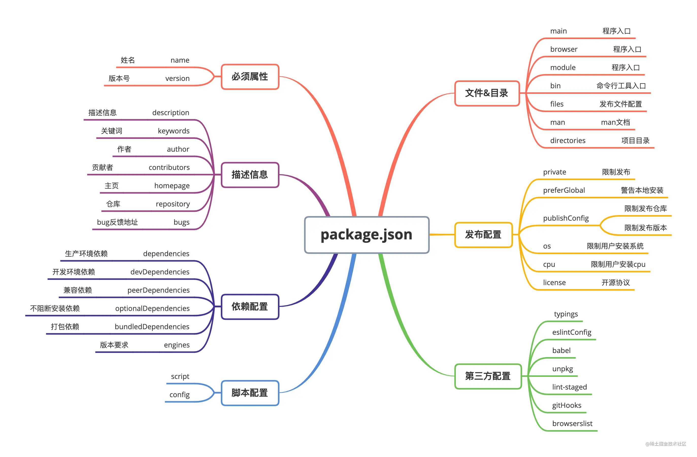

<!-- START doctoc generated TOC please keep comment here to allow auto update -->
<!-- DON'T EDIT THIS SECTION, INSTEAD RE-RUN doctoc TO UPDATE -->
**Table of Contents**  *generated with [DocToc](https://github.com/thlorenz/doctoc)*

- [package.json 常用配置项](#packagejson-%E5%B8%B8%E7%94%A8%E9%85%8D%E7%BD%AE%E9%A1%B9)
  - [1. 参考资料](#1-%E5%8F%82%E8%80%83%E8%B5%84%E6%96%99)
  - [2. package.json 基本介绍](#2-packagejson-%E5%9F%BA%E6%9C%AC%E4%BB%8B%E7%BB%8D)
  - [3. 必要属性](#3-%E5%BF%85%E8%A6%81%E5%B1%9E%E6%80%A7)
    - [1. name](#1-name)
    - [2. version](#2-version)
  - [4. 描述信息](#4-%E6%8F%8F%E8%BF%B0%E4%BF%A1%E6%81%AF)
    - [1. description](#1-description)
    - [2. keywords](#2-keywords)
    - [3. author](#3-author)
    - [4. contributors](#4-contributors)
    - [5. homepage](#5-homepage)
    - [6. repository](#6-repository)
    - [7. bugs](#7-bugs)
  - [5. 依赖配置](#5-%E4%BE%9D%E8%B5%96%E9%85%8D%E7%BD%AE)
    - [1. dependencies](#1-dependencies)
    - [2. devDependencies](#2-devdependencies)
    - [3. peerDependencies](#3-peerdependencies)
    - [4. optionalDependencies](#4-optionaldependencies)
    - [5. bundledDependencies](#5-bundleddependencies)
    - [6. engines](#6-engines)
  - [6. 脚本配置](#6-%E8%84%9A%E6%9C%AC%E9%85%8D%E7%BD%AE)
    - [1. scripts](#1-scripts)
    - [2. config](#2-config)
  - [7. 文件 & 目录](#7-%E6%96%87%E4%BB%B6--%E7%9B%AE%E5%BD%95)
    - [1. main](#1-main)
    - [2. browser](#2-browser)
    - [3. module](#3-module)
    - [4. bin](#4-bin)
    - [5. files](#5-files)
    - [6. man](#6-man)
    - [7. directories](#7-directories)
  - [8. 发布配置](#8-%E5%8F%91%E5%B8%83%E9%85%8D%E7%BD%AE)
    - [1. private](#1-private)
    - [2. preferGlobal](#2-preferglobal)
    - [3. publishConfig](#3-publishconfig)
    - [3. os](#3-os)
    - [3. cpu](#3-cpu)
    - [3. license](#3-license)
  - [9. 第三方配置](#9-%E7%AC%AC%E4%B8%89%E6%96%B9%E9%85%8D%E7%BD%AE)
    - [1. typing](#1-typing)
    - [2. eslintConfig](#2-eslintconfig)
    - [3. babel](#3-babel)
    - [4. unpkg](#4-unpkg)
    - [5. lint-staged](#5-lint-staged)
    - [6. gitHooks](#6-githooks)
    - [7. browserslist](#7-browserslist)

<!-- END doctoc generated TOC please keep comment here to allow auto update -->

# package.json 常用配置项

## 1. 参考资料

1. [package.json详解](https://juejin.cn/post/6844904114762022926)

2. [关于前端大管家 package.json，你知道多少？](https://juejin.cn/post/7023539063424548872)

3. [npm - doc package.json](https://docs.npmjs.com/cli/v8/configuring-npm/package-json)

## 2. package.json 基本介绍

1. 在每个前端项目中，都有 `package.json` 文件，它是项目的配置文件，常见的配置有配置项目启动、打包命令，声明依赖包等。`package.json` 文件是一个 JSON 对象，该对象的每一个成员就是当前项目的一项设置。

2. 使用 `npm init`，以问答的形式来创建一个 package.json 文件，创建过程如下图所示：
   
   图片来源：[npm 常用命令详解](https://www.cnblogs.com/ysk123/p/11655502.html)

3. 使用 `npm init -y|--yes`，会省略问答过程，直接创建一个 `package.json` 文件，里面包含一些基本的配置项。如下所示：
   ```json
      {
          "name": "Node",
          "version": "1.0.0",
          "description": "",
          "main": "index.js",
          "scripts": {
               "test": "echo \"Error: no test specified\" && exit 1"
          },
          "keywords": [],
          "author": "",
          "license": "ISC"
      }

   ```

4. 常用的 package.json 的配置项如下所示：
   

## 3. 必要属性

### 1. name

1. name 比较容易理解，就是项目的名称，它是一个字符串。在给 name 字段命名时，需要注意以下几点：
    - 名称的长度必须小于或等于 214 个字符，不能以点（`.`）和下划线（`_`）开头，不能包含大写字母（这是因为当软件包在npm上发布时，会基于此属性获得自己的 URL，所以不能包含非 URL 安全字符（non-url-safe））；
    - 名称可以作为参数被传入 `require("")`，用来导入模块，所以应当尽可能的简短、语义化；
    - 名称不能和其他模块的名称重复，可以使用 `npm view` 命令查询模块明是否重复，如果不重复就会提示404。

2. 平时我们开发的项目一般不会上传到 npm 包上，所以 name 的准确性就不是很重要。如果要是上传到 npm 上，模块的名称就非常重要了。

### 2. version

1. version 字段表示该项目包的版本号，它是一个字符串。在每次项目改动后，即将发布时，都要同步的去更改项目的版本号。版本号的使用规范如下：
   - 版本号的命名遵循语义化版本2.0.0规范，格式为：主版本号.次版本号.修订号，通常情况下，修改主版本号是做了大的功能性的改动，修改次版本号是新增了新功能，修改修订号就是修复了一些 bug。
   - 如果某个版本的改动较大，并且不稳定，可能如法满足预期的兼容性需求，就需要发布先行版本，先行版本通过会加在版本号的后面，通过连字符（`-`）连接以点分隔的标识符和版本编译信息：
     - 内部版本：alpha
     - 公测版本：beta
     - 候选版本：rc，即 release candiate

2. 可以通过以下命令来查看 npm 包的版本信息，以 react 为例：
   ```shell
      // 查看最新版本
      npm view react version
      // 查看所有版本
      npm view react versions
   ```

## 4. 描述信息

### 1. description

### 2. keywords

### 3. author

### 4. contributors

### 5. homepage

### 6. repository

### 7. bugs

## 5. 依赖配置

### 1. dependencies

1. `dependencies` 字段中声明的是项目的生产环境中所必须的依赖包。当使用 npm 或 yarn 安装 npm 包时，该 npm 包会被自动插入到此配置项中。

2. 该字段的值是一个对象，该对象的各个成员，分别由模块名和对应的版本要求组成，表示依赖的模块及其版本范围。
   ```json
      "dependencies": {
          "react": "^17.0.2",
          "react-dom": "^17.0.2",
          "react-scripts": "4.0.3",
      }
   ```
3. 这里每一项配置都是一个键值对（key-value）， `key` 表示模块名称，`value` 表示模块的版本号。版本号遵循主版本号.次版本号.修订号的格式规定：
   - 固定版本： 上面的 `react-scripts` 的版本 `4.0.3` 就是固定版本，安装时只安装这个指定的版本。
   - 波浪号（`~`）： 比如`~4.0.3`，表示安装 `4.0.x` 的最新版本（不低于 `4.0.3`），也就是说安装时不会改变主版本号和次版本号。
   - 插入号（`^`）： 比如上面 react 的版本 `^17.0.2`，表示安装`17.x.x` 的最新版本（不低于 `17.0.2`），也就是说安装时不会改变主版本号。如果主版本号为 `0`，那么插入号和波浪号的行为是一致的.
   - latest：安装最新的版本。

4. 需要注意，不要把测试或者过渡性的依赖放在dependencies，避免生产环境出现意外的问题。

### 2. devDependencies

1. devDependencies 中声明的是开发阶段需要的依赖包，如 Webpack、Eslint、Babel等，用于辅助开发。它们不同于 dependencies，因为它们只需安装在开发设备上，而无需在生产环境中运行代码。当打包上线时并不需要这些包，所以可以把这些依赖添加到 devDependencies 中，这些依赖依然会在本地指定 npm install 时被安装和管理，但是不会被安装到生产环境中。


### 3. peerDependencies

1. 有些情况下，我们的项目和所依赖的模块，都会同时依赖另一个模块，但是所依赖的版本不一样。比如，我们的项目依赖 A 模块和 B 模块的 1.0 版，而A模块本身又依赖 B 模块的 2.0 版。大多数情况下，这不是问题，B模块的两个版本可以并存，同时运行。但是，有一种情况，会出现问题，就是这种依赖关系将暴露给用户。

2. 最典型的场景就是插件，比如 `A` 模块是 `B` 模块的插件。用户安装的B模块是 `1.0` 版本，但是A插件只能和 `2.0` 版本的 `B` 模块一起使用。这时，用户要是将 `1.0` 版本的 `B` 的实例传给 `A`，就会出现问题。因此，需要一种机制，在模板安装的时候提醒用户，如果 `A` 和 `B` 一起安装，那么 `B` 必须是 `2.0` 模块。

3. `peerDependencies` 字段就是用来供插件指定其所需要的主工具的版本。
    ```json
       "name": "chai-as-promised",
       "peerDependencies": {
           "chai": "1.x"
       }
    ```
   上面代码指定在安装 `chai-as-promised` 模块时，主程序 `chai` 必须一起安装，而且 `chai` 的版本必须是 `1.x`。如果项目指定的依赖是 `chai` 的 `2.0` 版本，就会报错。

4. 需要注意，从 `npm 3.0` 版开始，`peerDependencies` 不再会默认安装了。

### 4. optionalDependencies

1. 如果需要在找不到包或者安装包失败时，npm仍然能够继续运行，则可以将该包放在 optionalDependencies 对象中，optionalDependencies对象中的包会覆盖 dependencies 中同名的包，所以只需在一个地方进行设置即可。
需要注意，由于 optionalDependencies 中的依赖可能并未安装成功，所以一定要做异常处理，否则当获取这个依赖时，如果获取不到就会报错。

### 5. bundledDependencies

1. 上面的几个依赖相关的配置项都是一个对象，而 bundledDependencies 配置项是一个数组，数组里可以指定一些模块，这些模块将在这个包发布时被一起打包。
需要注意，这个字段数组中的值必须是在 dependencies, devDependencies 两个里面声明过的包才行。

### 6. engines

1. 当我们维护一些旧项目时，可能对 npm 包的版本或者 Node 版本有特殊要求，如果不满足条件就可能无法将项目跑起来。为了让项目开箱即用，可以在 engines 字段中说明具体的版本号：
   ```json
      "engines": {
           "node": ">=8.10.3 <12.13.0",
           "npm": ">=6.9.0"
      }
   ```
2. 需要注意，engines 只是起一个说明的作用，即使用户安装的版本不符合要求，也不影响依赖包的安装。

## 6. 脚本配置

### 1. scripts

1. `scripts` 是 `package.json` 中内置的脚本入口，是 `key-value` 键值对配置，`key` 为可运行的命令，可以通过 `npm run` 来执行命令。除了运行基本的 `scripts` 命令，还可以结合 `pre` 和 `post` 完成前置和后续操作。先来看一组 `scripts`：
   ```json
      "scripts": {
           "dev": "node index.js",
           "predev": "node beforeIndex.js",
           "postdev": "node afterIndex.js"
      }
   ``` 
2. 这三个js文件中都有一句 `console`：
   ```js
      // index.js
      console.log("scripts: index.js")
      // beforeIndex.js
      console.log("scripts: before index.js")
      // afterIndex.js
      console.log("scripts: after index.js")
   ```
3. 当我们执行 `npm run dev` 命令时，输出结果如下：
   ```
        scripts: before index.js
        scripts: index.js
        scripts: after index.js
   ```
4. 可以看到，三个命令都执行了，执行顺序是 `predev` → `dev` → `postdev`。如果 `scripts` 命令存在一定的先后关系，则可以使用这三个配置项，分别配置执行命令。

5. 通过配置 `scripts` 属性，可以定义一些常见的操作命令：
   ```json
       "scripts": {
           "dev": "webpack-dev-server --inline --progress --config build/webpack.dev.conf.js",
           "start": "npm run dev",
           "unit": "jest --config test/unit/jest.conf.js --coverage",
           "test": "npm run unit",
           "lint": "eslint --ext .js,.vue src test/unit",
           "build": "node build/build.js"
   }
   ```
6. 这些脚本是命令行应用程序。可以通过调用 `npm run XXX` 或 `yarn XXX` 来运行它们，其中 `XXX` 是命令的名称。 例如：`npm run dev`。我们可以为命令使用任何的名称，脚本也可以是任何操作。

### 2. config

1. `config` 字段用来配置 `scripts` 运行时的配置参数，如下所示：
   ```json
      "config": {
          "port": 3000
      }
   ```

2. 如果运行`npm run start`，则 `port` 字段会映射到 `npm_package_config_port` 环境变量中：
`console.log(process.env.npm_package_config_port) // 3000`

3. 用户可以通过 `npm config set foo:port 3001` 命令来重写 `port` 的值。


## 7. 文件 & 目录

### 1. main

1. `main` 字段用来指定加载的入口文件，在 `browser` 和 `Node` 环境中都可以使用。如果我们将项目发布为 `npm` 包，那么当使用 `require` 导入`npm` 包时，返回的就是 `main` 字段所列出的文件的 `module.exports` 属性。如果不指定该字段，默认是项目根目录下的 index.js。如果没找到，就会报错。

2. 该字段的值是一个字符串：
   ```json
      "main": "./src/index.js"
   ```

### 2. browser

1. browser 字段可以定义 npm 包在 browser 环境下的入口文件。如果 npm 包只在 web 端使用，并且严禁在 server 端使用，使用 browser 来定义入口文件。
    `"browser": "./src/index.js"`

### 3. module

1. `module` 字段可以定义 `npm` 包的 `ESM` 规范的入口文件，`browser` 环境和 `node` 环境均可使用。如果 `npm` 包导出的是 `ESM` 规范的包，使用 module 来定义入口文件。
   ```json
       "module": "./src/index.mjs"
   ```
2. 需要注意，`.js` 文件是使用 `commonJS` 规范的语法（`require('xxx')`），`.mjs` 是用 ESM 规范的语法 （`import 'xxx'`）。

3. 上面三个的入口入口文件相关的配置是有差别的，特别是在不同的使用场景下。在 `Web` 环境中，如果使用 `loader` 加载 `ESM`（`ES module`），那么这三个配置的加载顺序是 `browser` → `module` → `main`，如果使用 `require` 加载 `CommonJS` 模块，则加载的顺序为：`main` → `module` → `browser`。

4. Webpack在进行项目构建时，有一个 `target` 选项，默认为 `Web`，即构建 `Web` 应用。如果需要编译一些同构项目，如 `node` 项目，则只需将 `webpack.config.js` 的 `target` 选项设置为 `node` 进行构建即可。如果再 `Node` 环境中加载 `CommonJS` 模块，或者 `ESM`，则只有 `main` 字段有效。

### 4. bin

1. bin字段用来指定各个内部命令对应的可执行文件的位置：
   ```json
      "bin": {
           "someTool": "./bin/someTool.js"
      }
   ```
2. 这里，`someTool` 命令对应的可执行文件为 `bin` 目录下的 `someTool.js`，`someTool.js` 会建立符号链接 `node_modules/.bin/someTool`。由于` node_modules/.bin/` 目录会在运行时加入系统的 PATH 变量，因此在运行 npm 时，就可以不带路径，直接通过命令来调用这些脚本。因此，下面的写法可以简写：
   ```json
      scripts: {  
         start: './node_modules/bin/someTool.js build'
      }

      // 简写
      scripts: {  
          start: 'someTool build'
      }
   ```
3. 所有 `node_modules/.bin/` 目录下的命令，都可以用 `npm run [命令]` 的格式运行。

4. 可以使用 `npm link` 将 `bin` 字段指定的命令链接到全局文件夹下：`{prefix}/bin/{name}`。这样就可以在系统的任何地方使用这个命令。

### 5. files

1. files配置是一个数组，用来描述当把npm包作为依赖包安装时需要说明的文件列表。当npm包发布时，files指定的文件会被推送到npm服务器中，如果指定的是文件夹，那么该文件夹下面所有的文件都会被提交。
   ```json
      "files": [
          "LICENSE",
          "Readme.md",
          "index.js",
          "lib/"
      ]
   ```
2. 如果有不想提交的文件，可以在项目根目录中新建一个 `.npmignore` 文件，并在其中说明不需要提交的文件，防止垃圾文件推送到 npm 上。这个文件的形式和 `.gitignore` 类似。写在这个文件中的文件即便被写在 `files` 属性里也会被排除在外。比如可以在该文件中这样写：
   ```
         node_modules
         .vscode

         build

         .DS_Store
   ```

### 6. man

1. man 命令是 Linux 中的帮助指令，通过该指令可以查看 Linux 中的指令帮助、配置文件帮助和编程帮助等信息。如果 node.js 模块是一个全局的命令行工具，在 package.json 通过 man 属性可以指定 man 命令查找的文档地址：
   ```json
      "man": [
          "./man/npm-access.1",
          "./man/npm-audit.1"
      ]
   ```
2. `man` 字段可以指定一个或多个文件, 当执行` man {包名}`时, 会展现给用户文档内容。

3. man文件必须以数字结尾，如果经过压缩，还可以使用.gz后缀。这个数字表示文件安装到哪个 man 节中；

4. 如果 man 文件名称不是以模块名称开头的，安装的时候会加上模块名称前缀。

5. 对于上面的配置，可以使用以下命令来执行查看文档：
   ```shell
      man npm-access
      man npm-audit
   ```


### 7. directories

1. directories 字段用来规范项目的目录。`node.js` 模块是基于 CommonJS 模块化规范实现的，需要严格遵循 `CommonJS` 规范。模块目录下除了必须包含包项目描述文件 `package.json` 以外，还需要包含以下目录：
   - `bin`：存放可执行二进制文件的目录
   - `lib`：存放js代码的目录
   - `doc`：存放文档的目录
   - `test`：存放单元测试用例代码的目录
...

2. 在实际的项目目录中，我们可能没有按照这个规范进行命名，那么就可以在directories字段指定每个目录对应的文件路径：
   ```json
      "directories": {
         "bin": "./bin",
         "lib": "./lib",
         "doc": "./doc",
         "test" "./test",
         "man": "./man"
      },
   ```
## 8. 发布配置

### 1. private

### 2. preferGlobal

### 3. publishConfig

### 3. os

### 3. cpu

### 3. license

## 9. 第三方配置

### 1. typing

### 2. eslintConfig

### 3. babel

### 4. unpkg

### 5. lint-staged 

### 6. gitHooks

### 7. browserslist


