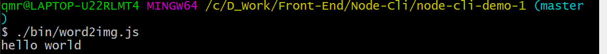

# 使用 Node 开发命令行工具

## 1. 参考资料

1. [Linux Shell命令的基本格式](http://c.biancheng.net/view/3163.html)

2. [一个符合GNU标准的命令行的组成格式](https://www.jianshu.com/p/0a61481087dc)

3. [linux常用命令格式](https://www.cnblogs.com/951767619x/p/14328825.html)

4. [命令行语法字符](https://ftpdocs.broadcom.com/cadocs/0/CA%20ARCserve%20Backup%20r16%205-CHS/Bookshelf_Files/HTML/caabhelp/cl_cmd_line_syntax_char.htm)

5. [命令行界面 (CLI)、终端 (Terminal)、Shell、TTY，傻傻分不清楚？](https://segmentfault.com/a/1190000016129862)

6. [Linux 命令格式](https://blog.csdn.net/liang19890820/article/details/52512744)

7. []()

8. []()

## 2. GNU 和 Linux 命令规范

### 1. GNU 命令规范

2. 实际上，我们在终端输入的命令还是有一定的标准格式的。一个 GNU 规定的命令行的格式如下所示：
   
   图片来源：[一个符合GNU标准的命令行的组成格式](https://www.jianshu.com/p/0a61481087dc)

3. 一个完整的Terminal命令主要由4部分组成：
   - 命令名（Executable): `git`
   - 子命令（Command）: `push`
   - 选项（Options）: `--no-pager` 和 `-v` 都是
   - 参数（arguments）: `origin` 和 `master`

4. 这里说一下选项（Options）。从形式上来说，`Options`分成两种形式：简短形式和完整形式。
   - 简短形式：一般由一个连接符`-`后面跟一个字母组成，如：
   `ls -l -a -t # -l, -a, -t 都是简短形式的Option`
   几个简短形式的 `Options` 可以合并写成一个：
`ls -lat` 效果等同于 `ls -l -a -t`。
   - 完整形式：一般由两个连接符 `--` 开头，接着是一个或多个完整的单词，如果有多个单词，那么中间用一个连接符连接，如上面的 `--no-pager`。

5. 从功能上来讲，`Options` 一般有两种。一种是`switch`：开关，即用来开启（enable）或者是关闭（disable）一些 `feature`，关闭（disable）的这个选项一般以 `--no` 开头，如上面的 `--no-pager`，就是用来禁用 `pager` 这个 `feature` 的。除此之外的另外一种是 `flag`。`switch` 一般没有参数，`flag` 则一般有参数。

6. 如果一个 `flag` 有参数，那么一般简短形式的 flag 跟它的参数之间由一个空格分开。而完整形式的 `flag` 则用一个 `=` 连接它的参数，如：
   ```js
      curl -X POST http://www.google.com # POST是-X的参数
      curl --request=POST http://www.google.com # POST 是 --request的参数。
   ```
   这里要分清楚的是 `Options` 的参数和这整个命令的参数，在上面的例子中，POST 是选项 `-X`（或 `--request`）的参数，而 `http://www.google.com` 则是这整个命令的参数。

### 2. Linux 命令

1. Linux 中的命令一般会遵守一定的格式，如下所示：
   ```shell
      command [options] [arguments]
   ```
2. 每个字段的含义如下：
   - `command` 命令：即命令名称。
   - `options` 命令选项：用于调整命令的功能。命令不同，选项的个数和内容会有所不同；要实现的命令功能不同，选项的个数和内容也会有所不同。
   - `arguments` 命令参数：是命令处理的对象，通常情况可以是文件名、目录、或用户名。

3. 以 `ls` 这个命令为例，我们在终端中直接敲入这个命令会列出当前目录下的内容。`ls` 命令后面不加选项和参数也能执行，不过只能执行最基本的功能。
   

4. 在命令后面加入参数后可以显示更加丰富的数据。例如：`ls -l`。`-l` 的作用是：长数据串列出，包含文件的属性与权限等等数据。
   

5. 选项又分为短格式选项：`-a` 和长格式选项：`--all`。短格式选项是英文的简写，用一个连字符（`-`）调用，长格式选项是英文完整单词，一般用两个连字符（`--`）调用。多个单词中间使用一个连字符连接（不是所有选项都有长格式）。
   - 短格式 `-a` 的调用形式：
     
   - 长格式 `--all` 的调用形式：
     

6. 选项可以多个并用。例： `ls -a -l`
   - `-a`：全部的文件，连同隐藏( 开头为 . 的文件) 一起列出来。
   - `-l`：长数据串列出，包含文件的属性与权限等等数据。
     

7. 选项可以合在一起写（短格式的命令），如：`ls -al`：
   

### 3. GNU 与 Linux 命令规范在开发命令行工具中的作用

1. 实际上，`Linux` 的命令和 `GNU` 的命令的格式基本类似。`Linux` 命令格式更倾向于 `Linux` 系统本身提供的命令。而 `GNU` 的命令格式更倾向于命令行（Command Line Interface）的格式。如 `git`、`npm`、`npx` 等都是符合 `GNU` 格式命令行工具。

2. 因此我们开发命令行工具应该使用 GNU 格式的命令规范。

## 3. Node 开发基础的命令行工具

1. 初始化一个项目：`node-cli-demo-1`：
   ```shell
      mkdir node-cli-demo-1
      cd node-cli-demo-1
      npm init -y
   ```
2. 在 `node-cli-demo-1` 下新建一个 bin 目录，然后在 bin 目录新建一个 word2img.js 文件，word2img.js 内容如下：
   ```js
      #!/usr/bin/env node
      console.log('hello world');
   ```
   `#!/usr/bin/env node` 这句话的作用是用来向系统指明这个脚本文件的解释器是 node。

3. 修改项目下的 package.json 文件：
   ```json
      {
         "name": "node-cli-demo-1",
         "version": "1.0.0",
         "description": "",
         "bin": {
            "word2img": "./bin/word2img.js"
          },
          "keywords": [],
          "author": "",
          "license": "ISC"
      }
   ```
   主要在 package.json 中添加了 bin 字段，其值为对象，内容如下：
   ```json
      "bin": {
            "word2img": "./bin/word2img.js"
      },
   ```
   `bin` 字段用于映射可执行文件的路径，作用类似于添加环境变量。
4. 我们在当前目录下面的 powerShell 中输入：`./bin/word2img.js`，能得到下面的输出：
   

5. 基本实现一个一个命令行工具，能实现输入一个命令，而得到一个输出。

6. 但是我们需要输入文件的相对路径，这样不够简介，也不够方便。因此我们需要把相对路径去掉，我们命令行输入 `npm link`：
   

7. `npm link` 的作用是软链接。从上面贴的 `npm link` 执行输出的截图可以看到，就是进行了一个软链接的过程，把当前项目软链到 nodejs 安装目录的 node_modules 文件夹下的同名文件夹，然后再软链接到nodejs安装目录下的同名可执行文件。

8. 以当前项目为例，使用的是 windows 10 系统，打开 `C:\Users\qmr\AppData\Roaming\npm\` 文件夹，可以看到多了三个文件 `word2img` 、`word2img.cmd` 和 `word2img.ps1`，这三个文件都可以用编辑器打开，里面主要是 shell 脚本的内容。同时 `C:\Users\qmr\AppData\Roaming\npm\node_modules\` 文件夹下多了一个 `node-cli-demo-1` 的软连接文件夹，其内容和我们的项目一样。

9. 执行完` npm link` 命令后就可以全局使用我们的命令了，`npm link` 还可以指定项目使用。这里就不再详说了。`npm link` 详解请看：[官方文档 npm-link](https://docs.npmjs.com/cli/v7/commands/npm-link)

10. 此时在终端输入：`word2img`，就能得到和刚刚输入完整路径命令一样的输出了：
    

## 4. 引入 commander 和 chalk

1. 现在我们的命令行只能直接敲一个命令，输出一个 `hello world`，不具备什么实用性，我们可以看一下 `npm` 这个命令有哪些玩法：

### 1. commander

1. commander 是一个用来解析处理命令行参数的一个工具。功能非常强大，很多知名的命令行工具都使用了 commander。

2. 安装 commander：`npm install commander`

3. commander 官方文档：[官方文档](https://github.com/tj/commander.js#commands)

#### 1. command

#### 2. option

### 2. chalk

1. chalk 这个包可以给终端的文字添加样式，使得我们在终端输出的信息更加明显，更加具有提示效果。

2. 安装 chalk：`npm install chalk`

3. chalk 官方文档：[官方文档](https://github.com/chalk/chalk#readme)