# 使用 Node 开发命令行工具

## 1. 参考资料

1. [Linux Shell命令的基本格式](http://c.biancheng.net/view/3163.html)

2. [一个符合GNU标准的命令行的组成格式](https://www.jianshu.com/p/0a61481087dc)

3. [linux常用命令格式](https://www.cnblogs.com/951767619x/p/14328825.html)

4. [命令行语法字符](https://ftpdocs.broadcom.com/cadocs/0/CA%20ARCserve%20Backup%20r16%205-CHS/Bookshelf_Files/HTML/caabhelp/cl_cmd_line_syntax_char.htm)

5. [命令行界面 (CLI)、终端 (Terminal)、Shell、TTY，傻傻分不清楚？](https://segmentfault.com/a/1190000016129862)

6. [Linux 命令格式](https://blog.csdn.net/liang19890820/article/details/52512744)

7. []()

8. []()

## 2. GNU 和 Linux 命令规范

### 1. GNU 命令规范

1. 实际上，我们在终端输入的命令还是有一定的标准格式的。一个 GNU 规定的命令行的格式如下所示：
   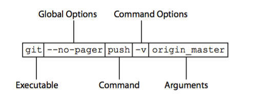
   图片来源：[一个符合GNU标准的命令行的组成格式](https://www.jianshu.com/p/0a61481087dc)

2. 一个完整的Terminal命令主要由4部分组成：
   - 命令名（Executable): `git`
   - 子命令（Command）: `push`
   - 选项（Options）: `--no-pager` 和 `-v` 都是
   - 参数（arguments）: `origin` 和 `master`

3. 这里说一下选项（Options）。从形式上来说，`Options`分成两种形式：简短形式和完整形式。
   - 简短形式：一般由一个连接符`-`后面跟一个字母组成，如：
   `ls -l -a -t # -l, -a, -t 都是简短形式的Option`
   几个简短形式的 `Options` 可以合并写成一个：
`ls -lat` 效果等同于 `ls -l -a -t`。
   - 完整形式：一般由两个连接符 `--` 开头，接着是一个或多个完整的单词，如果有多个单词，那么中间用一个连接符连接，如上面的 `--no-pager`。

4. 从功能上来讲，`Options` 一般有两种。一种是`switch`：开关，即用来开启（enable）或者是关闭（disable）一些 `feature`，关闭（disable）的这个选项一般以 `--no` 开头，如上面的 `--no-pager`，就是用来禁用 `pager` 这个 `feature` 的。除此之外的另外一种是 `flag`。`switch` 一般没有参数，`flag` 则一般有参数。

5. 如果一个 `flag` 有参数，那么一般简短形式的 flag 跟它的参数之间由一个空格分开。而完整形式的 `flag` 则用一个 `=` 连接它的参数，如：
   ```js
      curl -X POST http://www.google.com # POST是-X的参数
      curl --request=POST http://www.google.com # POST 是 --request的参数。
   ```
   这里要分清楚的是 `Options` 的参数和这整个命令的参数，在上面的例子中，POST 是选项 `-X`（或 `--request`）的参数，而 `http://www.google.com` 则是这整个命令的参数。

### 2. Linux 命令

1. Linux 中的命令一般会遵守一定的格式，如下所示：
   ```shell
      command [options] [arguments]
   ```
2. 每个字段的含义如下：
   - `command` 命令：即命令名称。
   - `options` 命令选项：用于调整命令的功能。命令不同，选项的个数和内容会有所不同；要实现的命令功能不同，选项的个数和内容也会有所不同。
   - `arguments` 命令参数：是命令处理的对象，通常情况可以是文件名、目录、或用户名。

3. 以 `ls` 这个命令为例，我们在终端中直接敲入这个命令会列出当前目录下的内容。`ls` 命令后面不加选项和参数也能执行，不过只能执行最基本的功能。
   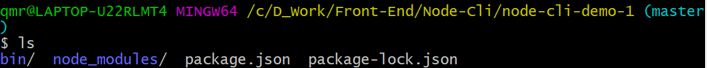

4. 在命令后面加入参数后可以显示更加丰富的数据。例如：`ls -l`。`-l` 的作用是：长数据串列出，包含文件的属性与权限等等数据。
   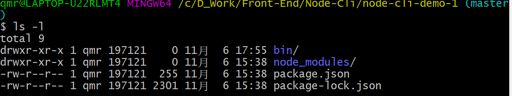

5. 选项又分为短格式选项：`-a` 和长格式选项：`--all`。短格式选项是英文的简写，用一个连字符（`-`）调用，长格式选项是英文完整单词，一般用两个连字符（`--`）调用。多个单词中间使用一个连字符连接（不是所有选项都有长格式）。
   - 短格式 `-a` 的调用形式：
     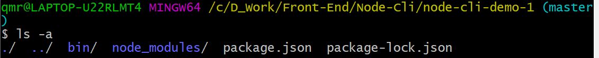
   - 长格式 `--all` 的调用形式：
     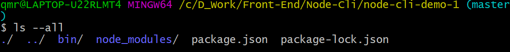

6. 选项可以多个并用。例： `ls -a -l`
   - `-a`：全部的文件，连同隐藏( 开头为 . 的文件) 一起列出来。
   - `-l`：长数据串列出，包含文件的属性与权限等等数据。
     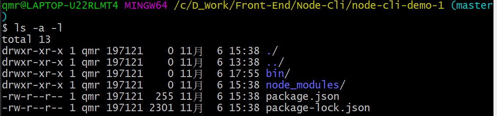

7. 选项可以合在一起写（短格式的命令），如：`ls -al`：
   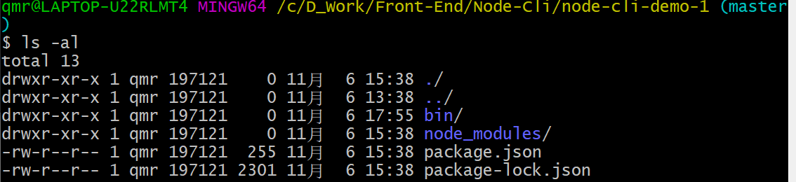

### 3. GNU 与 Linux 命令规范在开发命令行工具中的作用

1. 实际上，`Linux` 的命令和 `GNU` 的命令的格式基本类似。`Linux` 命令格式更倾向于 `Linux` 系统本身提供的命令。而 `GNU` 的命令格式更倾向于命令行（Command Line Interface）的格式。如 `git`、`npm`、`npx` 等都是符合 `GNU` 格式命令行工具。

2. 因此我们开发命令行工具应该使用 GNU 格式的命令规范。

## 3. Node 开发基础的命令行工具

1. 初始化一个项目：`node-cli-demo-1`：
   ```shell
      mkdir node-cli-demo-1
      cd node-cli-demo-1
      npm init -y
   ```
2. 在 `node-cli-demo-1` 下新建一个 bin 目录，然后在 bin 目录新建一个 word2img.js 文件，word2img.js 内容如下：
   ```js
      #!/usr/bin/env node
      console.log('hello world');
   ```
   `#!/usr/bin/env node` 这句话的作用是用来向系统指明这个脚本文件的解释器是 node。

3. 修改项目下的 package.json 文件：
   ```json
      {
         "name": "node-cli-demo-1",
         "version": "1.0.0",
         "description": "",
         "bin": {
            "word2img": "./bin/word2img.js"
          },
          "keywords": [],
          "author": "",
          "license": "ISC"
      }
   ```
   主要在 package.json 中添加了 bin 字段，其值为对象，内容如下：
   ```json
      "bin": {
            "word2img": "./bin/word2img.js"
      },
   ```
   `bin` 字段用于映射可执行文件的路径，作用类似于添加环境变量。
4. 我们在当前目录下面的 powerShell 中输入：`./bin/word2img.js`，能得到下面的输出：
   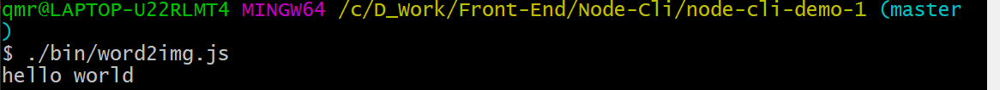

5. 基本实现一个一个命令行工具，能实现输入一个命令，而得到一个输出。

6. 但是我们需要输入文件的相对路径，这样不够简介，也不够方便。因此我们需要把相对路径去掉，我们命令行输入 `npm link`：
   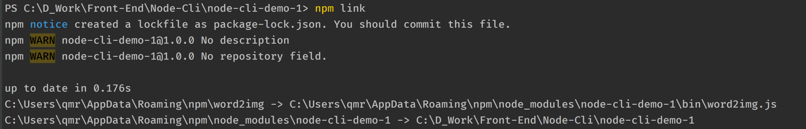

7. `npm link` 的作用是软链接。从上面贴的 `npm link` 执行输出的截图可以看到，就是进行了一个软链接的过程，把当前项目软链到 nodejs 安装目录的 node_modules 文件夹下的同名文件夹，然后再软链接到nodejs安装目录下的同名可执行文件。

8. 以当前项目为例，使用的是 windows 10 系统，打开 `C:\Users\qmr\AppData\Roaming\npm\` 文件夹，可以看到多了三个文件 `word2img` 、`word2img.cmd` 和 `word2img.ps1`，这三个文件都可以用编辑器打开，里面主要是 shell 脚本的内容。同时 `C:\Users\qmr\AppData\Roaming\npm\node_modules\` 文件夹下多了一个 `node-cli-demo-1` 的软连接文件夹，其内容和我们的项目一样。

9. 执行完` npm link` 命令后就可以全局使用我们的命令了，`npm link` 还可以指定项目使用。这里就不再详说了。`npm link` 详解请看：[官方文档 npm-link](https://docs.npmjs.com/cli/v7/commands/npm-link)

10. 此时在终端输入：`word2img`，就能得到和刚刚输入完整路径命令一样的输出了：
    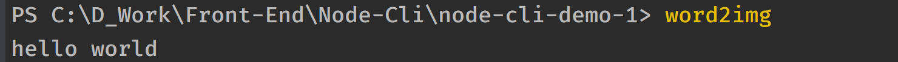

## 4. 引入 commander 和 chalk

1. 现在我们的命令行只能直接敲一个命令，输出一个 `hello world`，不具备什么实用性，我们可以看一下 `npm` 这个命令有哪些玩法。

### 1. 常用 npm 命令

1. 查看当前版本：
   ```shell
      npm -v  # npm --version
   ```
2. 查看使用说明：
   ```shell
      node -h  # npm --help
   ```
   如下所示：
   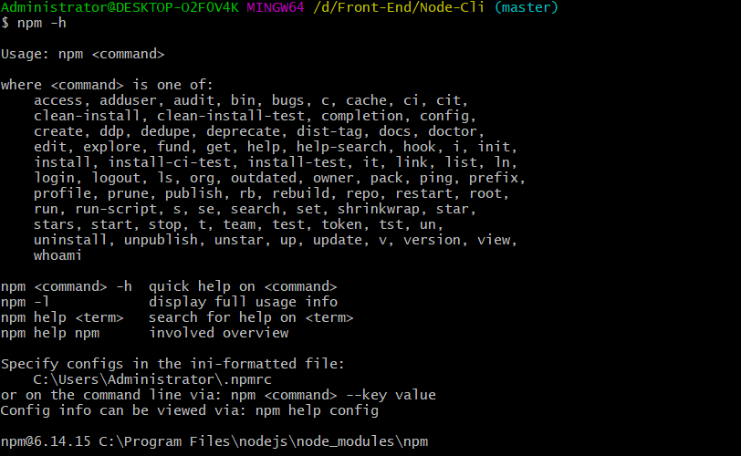
3. 安装包：
   ```shell
      npm install (with no args, in package dir)
      npm install [<@scope>/]<name>
      npm install [<@scope>/]<name>@<tag>
      npm install [<@scope>/]<name>@<version>
      npm install [<@scope>/]<name>@<version range>
      npm install <tarball file>
      npm install <tarball url>
      npm install <folder>
      alias: npm i
      common options: [-S|--save|-D|--save-dev|-O|--save-optional] [-E|--save-exact] [--dry-run]
   ```
   1. `-S` 或者 `--save` 将安装包信息加入到 `package.json` 中的 `dependencies`（生产阶段的依赖）
   2. `-D` 或者 `--save-dev` 安装包信息将加入到 `package.json` 中的 `devDependencies`（开发阶段的依赖），所以开发阶段一般使用它。
   3. `-O` 或者 `--save-optional` 安装包信息将加入到 `package.json` 中的  `optionalDependencies`（可选阶段的依赖）
   4. `-E` 或者 `--save-exact` 精确安装指定模块版本。
   5. 

4. 初始化一个项目（生成 package.json）：
   ```shell
      npm init [--yes|-y|--scope]
   ```
5. 更新一个包：
   ```shell
      npm update [-g] [<pkg>...]
   ```

6. 管理 npm 的配置内容：
   ```shell
      npm config set <key>=<value> [<key>=<value> ...]
      npm config get [<key> [<key> ...]]
      npm config delete <key> [<key> ...]
      npm config list [--json]
      npm config edit
      npm set <key>=<value> [<key>=<value> ...]
      npm get [<key> [<key> ...]]
      alias: c
   ```
   常用的是 `npm config set registry=xx` 来配置 npm 镜像源。

### 2. 一般命令行工具中的命令使用方式总结

1. 观察 npm 命令的使用方式，并对比之前提到的 GNU 命令的标准格式，我们发现，npm 命令提供了命令名（Executable）、子命令（command）、选项（Options）和参数（Arguments）。

2. 命令的说明中，使用方括号（`[]`）包围的内容是可选的，表示我们在使用这个命令时可以根据我们的需求添加或者不添加这个选项或者参数。如：`npm init [--yes|-y|--scope]`，方括号里面的 `--yes|-y|--scope` 这个选项都是可选的，使用竖线（`|`）表示这个选项可以使用这几个值中的一个。而尖括号（`<>`）包围的内容是必选的。也就是使用这个命令时必须添加的内容。如 `npm config set <key>=<value>` 中，`key` 和 `value` 就是必选的参数。

3. 想要实现这样的功能，就需要解析我们在命令中输入的内容，包括命令、选项和参数。我们可以使用原生 Node 提供的 `process.argv` 来解析我们输入的内容。

4. `process.argv` 是一个数组，包含启动 Node 进程时传入的命令行参数。第一个元素将是 process.execPath。即启动 Node.js 进程的可执行文件的绝对路径名。如果需要访问 argv[0] 的原始值，直接访问 `process.argv0` 这个变量。`process.argv` 的第二个元素将是正在执行的 JavaScript 文件的路径。 而其余元素将是任何其他命令行参数。举例如下：
   ```js
      // process-argv.js
      const {argv} = require('process');

      argv.forEach((item, index) => {
      console.log(`${index}: ${item}`);
      });
   ```
   执行命令：`node process-argv.js one tow=three four hello world`，输出如下：
   ```js
      // 0: C:\Program Files\nodejs\node.exe
      // 1: D:\Front-End\Node-Cli\process-argv.js
      // 2: one
      // 3: tow=three
      // 4: four
      // 5: hello
      // 6: world
   ```
5. 实际上使用 `process.argv` 进行解析我们输入的命令是比较麻烦的，我们需要处理较多的情况。在开发命令行的过程中，解析命令不是我们的工作重点，我们的重点应该根据命令执行不同的操作。

6. 因此，我们使用一个成熟的解析命令的工具：`commander` 来解析我们命令、选项和参数。

7. 有时候，我们发现有一些命令行工具的输入是带颜色的，如使用 `git status`，就会用不同的颜色标记不同的文件的状态：
   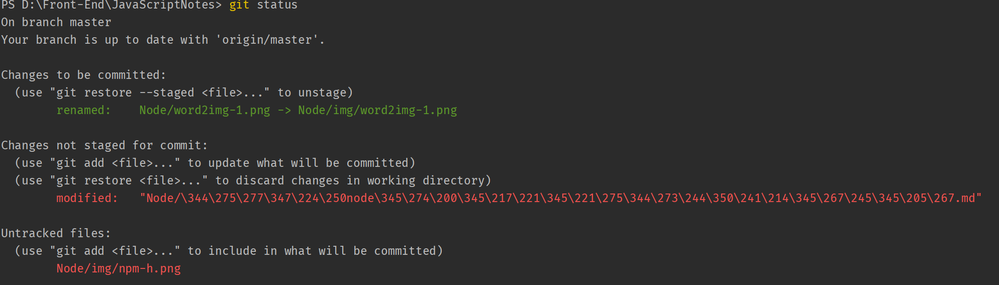

8. 如果我们也想要实现这样的效果，需要使用另外一个工具：`chalk`。

## 5. commander 和 chalk 的初步使用

### 1. 增加版本信息和命令使用说明 - 使用 commander 实现

1. 安装 commander：
   - commander：`npm install commander`

2. 在 `bin/word2img.js` 中，添加如下的内容： 
   ```js
      #!/usr/bin/env node
      const { Command } = require('commander');
      const program = new Command();
      program.version(require('../package.json').version).usage('<command> [options]');
      program.parse(process.argv);
   ```
   - `version` 方法是 commander 提供的一个输出版本号的方法，命令的选项是 `-V` 或者是 `--version`。
   - `usage` 方法用来输出这个命令的使用方式的相关内容。命令的选项是 `-h` 或者是 `--help`。
   - `parse` 方法接收的第一个参数是等待解析的字符串数组。那么我们可以传入 `process.argv` 作为参数。这样就可以解析我们的命令。

3. 我们输入命令：`word2img -V`，输出如下：
   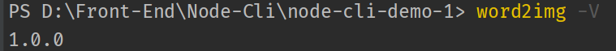

4. 我们输入命令：`word2img -V`，输出如下：
   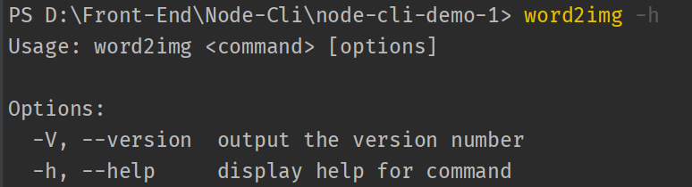

5. 通过 commander 这个工具，我们开发的命令行工具初步具备了实用性。

### 2. 给输出的文字添加颜色 - 使用 chalk 实现

1. 使用 `git status`，输出的文字中是有一些是有颜色的，比如说需要被提交的文件的名称是绿色的，有修改但是没有提交的文件是红色。如果我们想对部分文字进行着色，那么可以使用 chalk 这个工具。

2. 安装 chalk：
   - chalk：`npm install chalk`

3. 继续修改 `bin/word2img.js`：
   ```js
      #!/usr/bin/env node

      // 创建一个局部的 Command 对象
      const { Command } = require('commander');
      const chalk = require('chalk');
      const path = require('path');

      // console.log('hello world');
      const program = new Command();

      // program.version(require('../package.json').version).usage('<command> [options]');

       program.on('--help', () => {
           console.log();

           console.log(
               ` Run ${chalk.green(
                   `word2img <command> --help`
               )} for detailed usage of given command.
               `
           );

           console.log();
      })
      program.parse(process.argv);
   ```
   - `on` 方法用来监听命令（command）和选项（option）事件，来执行自定义操作。第一个参数是监听的命令或者选项，第二个参数是回调函数，当指定的命令或者选项被输入时，就会执行回调函数。
   - `chalk.green` 会将其接收的字符串以绿色格式进行输出。

4. 在终端中输入 `word2img --help`，输出如下：
   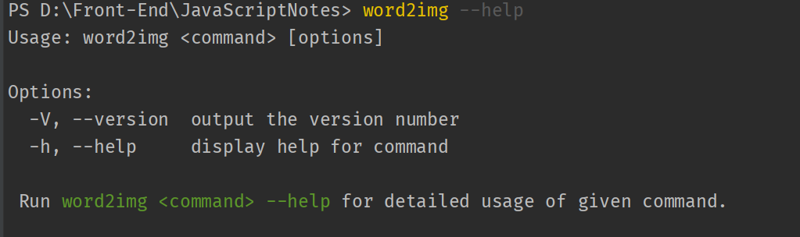

5. 使用 chalk 这个工具，我们实现了对输出的部分文件进行着色。

## 6. 继续完善我们的命令行工具

1. 下面的内容更多的是参考 [从零开始编写一个node命令行工具](https://juejin.cn/post/6948330334085709855)

2. 我们现在的需求是接收用户输入的字符串，把它转化成一张纯色背景文字居中的图片，那么我们可以大致确定出需要的来自外部的变量有哪些：
   - word：将要被转化成图片的字符串
   - width：图片的宽度
   - height：图片的高度
   - bgColor：图片的背景颜色
   - color：文字的颜色
   - size：文字的大小 font-size
   - family：文字的字体 font-family
   - filename：要下载的图片的文件名
   - filepath：图片保存的路径

3. 上面的变量中，word 实际上是命令的参数（argument），其他值都是选项（options）。参数的内容不是固定的，而用户不一定会输入选项，所以选项应该具有默认值。借助 commander，我们可以这样配置：
   ```js
      program
          .command('new <word>')
          .description('generate a new image use the input word')
          .option('-w --width <width>', 'Set width of the image', 600)
          .option('--height <heihgt>', 'Set height of the image', 200)
          .option('--bgColor <bgColor>', 'Set background-color of the image', '#fff')
          .option('--color <color>', 'Set color of the word', '#000')
          .option('--size <size>', 'Set font-size of the word', 48)
          .option('--family <family>', 'Set font-family of the word', 'Arial')
          .option('--filename <filename>', 'Set filename of the image')
          .option('--filepath <filepath>', 'Set file path to save the image' + "(note that the path doesn\'t contain the file name)", path.join(process.cwd(), 'imgs'))
          .action((word, options) => {
              console.log(word);
              console.log(options);
      })
   ```
   - `command` 方法用来指定一个命令或者子命令。其第一个参数接收一个字符串。这里传入的是 `new <word>`，其中 `new` 就是命令的名称，`<word>`指代这个命令的参数，使用尖括号（`<>`）表示这个参数是必选的。
   - `description` 方法接收一个字符串用来简要描述这个命令的作用
   - `option` 方法用来定义命令的选项。而且也作为选项的说明。每个选项可以有一个段格式（short flag），即以单个连字符开头的单个字母，例如 `-a`、`-l`。或者是一个长格式（long name），即以 2 个连字符开头的完整单词，多个单词使用一个连字符连接，例如：`--save`、`--save-dev`。
     - option 方法的第一个参数是字符串形式的选项的名字，我们可以使用逗号（`,`） 空格（` `）和竖线（`|`）来分隔长格式和短格式的选项，例如：`"-w --width"`，`-s,--save` 或者 `-a|-all`。第一个参数的最后的内容是这个选项的接收的参数（arguments）。如 `-w --width <width>`，最后的`<width>` 就表示 `-w` 这个选项接收的参数，使用尖括号（`<>`）表示这个参数是必要的，也就是如果我们在命令中使用 `-w` 这个选项，那么就必须加上参数。最后字符串中的这个参数也要和前面的选项名称用空格分开。
     - 第二个参数是描述这个选项的作用。
     - 第三个参数这个选项的默认值。
   - `action` 方法来监听用户输入，当用户输入 `new` 命令后会触发回调函数，回调函数的第一个参数是命令的值，第二个参数是上面的选项对象，第三个参数是 command 对象本身。我们可以根据我们输入的命令，来决定执行什么内容。

4. 在终端输入：`word2img new 'hello world'`，终端的输出如下：
   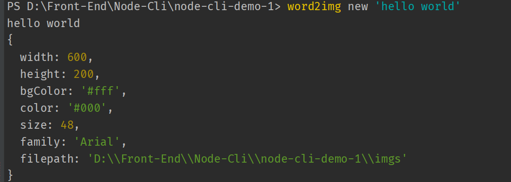

5. 接下来实现生成图片的功能。因为这里的重点是实现命令行工具，如何生成图片不是我们关注的点，因此，我们这里直接贴代码了。

6. 安装 `canvas`：`npm install canvas`

7. 新建 `./utils/newCanvas.js`，内容如下：
   ```js 
      const { createCanvas } = require('canvas')

      exports.newCanvas = function (word, options) {
          const canvas = createCanvas(options.width, options.height)
          const ctx = canvas.getContext('2d')

          // rect
          ctx.fillStyle = options.bgColor
          ctx.fillRect(0, 0, options.width, options.height)
          // word
          ctx.textBaseline = 'middle'
          ctx.textAlign = 'center'
          ctx.font = `${options.size}px ${options.family}`
          ctx.fillStyle = options.color
          ctx.fillText(word, options.width / 2, options.height / 2)

          return {
             canvas,
             ctx,
          }
      }

   ```
8. 新建 `./utils/canvas2img.js`，内容如下：
   ```js
      const fs = require('fs')
      const path = require('path')
      const chalk = require('chalk')

      exports.canvas2img = function (canvas, filename, filepath) {
          const buf = canvas.toBuffer()
          filename = filename || `word2img_${Date.now()}.png`
          const url = path.resolve(filepath, filename)
          fs.writeFile(url, buf, function (err) {
              if (err) {
                  console.log(err)
              } else {
                  console.log(
                    `✨ image generated successfully at: ${chalk.yellow(url)}`
                  )
              }
          })
      }
   ```
9. 继续修改 `./bin/word2img.js`，内容如下：
   ```js
      #!/usr/bin/env node
      // 创建一个局部的 Command 对象
      const { Command } = require('commander');
      const chalk = require('chalk');
      const path = require('path');


      const { newCanvas } = require('../utils/newCanvas');
      const { canvas2img } = require('../utils/canvas2img');

      // console.log('hello world');
      const program = new Command();

      program.version(require('../package.json').version).usage('<command> [options]');

       program.on('--help', () => {
           console.log();

            console.log(
                ` Run ${chalk.green(
                    `word2img <command> --help`
                )} for detailed usage of given command.
                `
            );

           console.log();
       })

       program
           .command('new <word>')
           .description('generate a new image use the input word')
           .option('-w --width <width>', 'Set width of the image', 600)
           .option('--height <heihgt>', 'Set height of the image', 200)
           .option('--bgColor <bgColor>', 'Set background-color of the image', '#fff')
           .option('--color <color>', 'Set color of the word', '#000')
           .option('--size <size>', 'Set font-size of the word', 48)
           .option('--family <family>', 'Set font-family of the word', 'Arial')
           .option('--filename <filename>', 'Set filename of the image')
           .option('--filepath <filepath>', 'Set file path to save the image' + "(note that the path doesn\'t contain the file name)", path.join(process.cwd(), 'imgs'))
           .action((word, options) => {
               // console.log(word);
               // console.log(options);
               const { canvas } = newCanvas(word, options)
              canvas2img(canvas, options.filename, options.filepath);
           })


      program.parse(process.argv);
   ```
10. 此时，我们在终端输入 `word2img new 'hello-word'`，成功在项目根目录生成了图片，并且终端会提示文件的位置信息。
   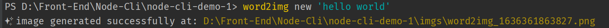

11. 添加一些选项：` word2img new 'JavaScript' --bgColor 'green' --color '#666' --filename 'javascript.png'`，终端输出的信息如下：
   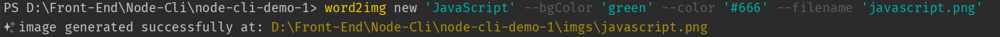

12. 至此我们基本实现了一个简单的生成图片的命令行工具。

## 7. commander

1. commander 是一个用来解析处理命令行参数的一个工具。功能非常强大，很多知名的命令行工具都使用了 commander。

2. 安装 commander：`npm install commander`

3. commander 官方文档：[官方文档](https://github.com/tj/commander.js#commands)

4. 使用 - 创建全局的 command 对象：
   ```js
      const { program } = require('commander');
      program.version('0.0.1');
   ```
   这种方式适用于快速搭建一个一个项目。

5. 使用 - 创建局部的 command 对象：
   ```js
      const { Command } = require('commander');
      const program = new Command();
      program.version('0.0.1');
   ```
   在大型项目中，我们可能在不同的地方以不同的形式使用 command 对象，因此，我们创建局部的 Command 对象。

6. program 作为 Command 的实例，其中的每个方法都返回一个 command 对象，这样可以实现链式调用。

### 1. command

1. `command` 方法用来指定一个命令或者子命令。其第一个参数接收一个字符串。例如传入的是 `new <word>`，其中 `new` 就是命令的名称，`<word>`指代这个命令的参数，使用尖括号（`<>`）表示这个参数是必选的。
    
2. 有两种方式实现响应 command 函数定义的命令：
   - 附在 command 方法后面的 action 函数，接收一个回调函数，在这个回调函数内部处理相关逻辑。
   - 执行一个单独的可执行的 js 文件。

#### 1. 指定 action 作为命令的执行器

1. 我们在 package.json 中配置的命令名（executable）是：
   ```json
       bin: {
          "pm": "./bin/pm.js"
       }
    ```
2. command 方法与 action 方法一起使用：
   ```js
      #!/usr/bin/env node

       const { Command } = require('commander');
       const program = new Command();

       program.version('1.0.0').usage('[options] [arguments]');

       program
          .command('clone <source> [destination]')
          .description('clone a repository into a newly created directory')
          .action((source, destination) => {
               console.log('clone command called');
          });

       // 必须使用 parse 函数解析我们输入的命令
       program.parse(process.argv);
   ```
3. 在终端输入 `pm clone test`，控制台输出：`clone command called`。

#### 2. 单独的可执行文件

1. command 方法可以接收第二个参数，用来描述第一个参数指定的命令的作用。当我们指定了 command 方法的第二个 description 参数，并调用 command 方法时，这会告诉 Commander 我们将为子命令使用独立的可执行文件。Commander 将以 program-subcommand（如 pm-install、pm-search）为可执行文件的名称，并在入口脚本的目录（如 `./examples/pm` 下）中的搜索可执行文件。我们可以使用executableFile 配置选项指定自定义名称。

2. 上面这样一段话是什么意思呢，首先要明白的是，command 方法中配置的命令是子命令。而我们在 `package.json` 的 `bin` 字段配置的是命令名（executable），例如 git 就是命令名，`git config` 中的 config 就是子命令。所以，当我们配置 command 的第二个 description 参数时，Commander 将为这个子命令去找独立的可执行的文件，寻找的范围是命令名（executable）指定的目录下。例如：
    ```json
       bin: {
          "pm": "./bin/pm.js"
       }
    ```
3. `pm` 这个命令名指定的目录是 `bin`，那么 Commander 就会去 bin 目录下找名为 program-subcommand 的可执行的 js 文件。program 就是 pm 这个命令指定的可执行文件 `pm.js` 的名称，而 subcommand 就是 command 方法的第一个参数指定的子命令。举个例子：
    ```js
       program
           .command('clone <source> [destination]', 'clone files')
    ```
4. 指定了 command 的第二个参数，没有指定 action 方法，那么 Commander 就会在 bin 目录下去寻找名为 pm-clone 的 js 文件。

5. 我们有两种方式去建立 pm-clone 这个 js 文件。
   1. 直接在 bin 目录下建立名为 pm-clone.js 的文件，内容如下：
   ```js
      // bin/pm-clone.js
      console.log('pm bin clone file');
   ```
   执行命令：`pm clone file`，得到的输出是：
  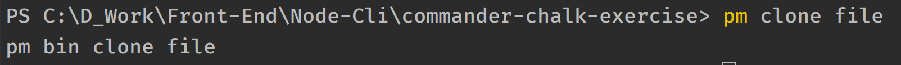
   2. 直接在 bin 目录下新建 pm-clone 的文件夹，然后在 pm-clone 下新建 index.js，内容如下所示：
      ```js
         // bin/pm-clone/index.js
         console.log('pm-clone index clone file');
      ```
      执行命令：`pm clone file`，得到的输出如下：
      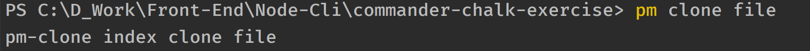

6. 两种方式都可以使得 Commander 找到可执行的文件。

7. 如果使用的是可执行文件，那么怎么能获得我们输入的命令的选项、参数呢？
   1. 在可执行文件中，同样引入 Commander 这个局部对象：
      ```js
         const {Command} = require('commander');

         const program = new Command();
      ```
   2. 在可执行文件中使用 program.option 方法设置同这个子命令相关的选项。
      ```js
         program
             .option('-f, --force', 'force installation')
             .option('-v, --version <version>', 'specify a version')
             .option('--source <source>', 'specify download source')
      ```
   3. 使用 `program.parse(process.argv)` 来解析 `process.argv`，将不是传给选项（option）的参数解析出来，传递给 `program.args` 数组。
   4. 使用 program.opts 方法获得命令中的选项及传给选项的值。program.opts 的返回值是一个对象，其 key 是选项，与 key 对应的 value 是传递给选项的值。
   5. 示例代码如下：
      ```js
         // pm-install.js
      
         #!/usr/bin/env node

         const {Command} = require('commander');

         const program = new Command();

          program
              .option('-f, --force', 'force installation')
              .option('-v, --version <version>', 'specify a version')
              .option('--source <source>', 'specify download source')

         program.parse(process.argv);

         // program.parse 函数对 process.argv 进行解析，将不是传给选项（option）的参数解析出来，传递给 program.args 数组
         // 例如我们输入的命令是：pm install node typescript react -v 2.5.0 --source official
         // 其中 -v 后面跟的是参数是传给 -v 这个选项的，而 --source 后面跟的参数是传递给 --official 的
         // 所以 program.args 只接收 node、typescript 和 react 这个三个参数，并将其组成一个数组：[ 'node', 'typescript', 'react' ]

         const pkgs = program.args;

         const opts = program.opts();

         // 命令是： pm install node typescript react -v 2.5.0 --source official
         // options { version: '2.5.0', source: 'official' }
         console.log('options', program.opts());
         // args [ 'node', 'typescript', 'react' ]
         console.log('args', program.args);
      ```
   6. 假设我们输入的命令是：`pm install node typescript react -v 2.5.0 --source official`，那么 `program.opts()` 的返回值是：`{ version: '2.5.0', source: 'official' }`，而 `program.args` 则是：`[ 'node', 'typescript', 'react' ]`。
   7. 这样我们就在子命令的可执行文件中实现对子命令的选项、参数的解析，由此可以进一步实现其他的逻辑处理。

#### 3. 自定名称的可执行文件 - 使用 `executableFile`

1. 前面说的使用可执行文件来响应子命令，这个可执行文件的名字是有固定格式的：program-subcommand。

2. 实际是，我们可以通过配置 command 方法的第三个参数，实现对可执行文件的自定义名称：即使用 `executableFile` 配置项。

3. `executableFile` 配置项的用法如下：
   ```js
      program
         .command('update <package>', 'update a package', {executableFile: 'updatePkgs'})
   ```
4. 配置的可执行文件的名称为 `updatePkgs`，那么 Commander 就会去 `bin` 目录下去找 `updatePkgs.js` 这个文件（或者是 `bin` 下的 `updatePkgs` 目录下的 `index.js` 文件）。

5. updatePkgs.js 的内容如下：
   ```js
      #!/usr/bin/env node

      const { Command } = require('commander');
      const program = new Command();

      program.parse(process.argv);

      console.log('update packages list: ', program.args);
   ```
6. 输入命令：`pm update node`，则输出是：`update packages list:  [ 'node' ]`。

##### 4. 使用 argument 函数接收子命令参数

1. 我们可以使用 argument 方法给子命令添加参数（argument）。使用 argument 方法给子命令添加任何我们希望的命令参数。

2. argument 方法一共有三个参数：
  - 第一个参数是一个定义参数名称的字符串，形式是`<required>` （必选）或者是 `[optional]` （可选）。
  - 第二个参数是可选的，是一个用来描述这个参数作用的字符串。
  - 第三个参数也是可选的，用来给这个参数设置默认值。

4. 如果 command 方法与 action 方法合用，那么我们就能使用 argument 方法指定参数。如果是响应命令的是单独的可执行文件，那么久不能使用 argument 方法。

5. 示例：
   ```js
      program
          .command('login')
          .argument('<username>', 'user to login')
          .argument('[password]', 'password for user, if required', 'not required')
          .argument('[flag]', 'login pattern', 'sk2')
          .action((username, password, flag) => {
              console.log('username: ', username);
              console.log('password: ', password);
              console.log('flag: ', flag);
          })

      // 必须使用 parse 函数解析我们输入的命令
      program.parse(process.argv);
   ```
   1. 子命令是 login，参数 username 是必输入的参数，而 password 是可选的，还设置了默认值为 `not required`，同理可见参数 flag。
   2. 此时的 action 接收的回调函数的参数实际上就是上面定义的子命令的参数。
   3. 输入命令： `pm login curry`，输出是：
      ```js
         username:  curry
         password:  not required
         flag:  sk2
      ```
   4. 输入命令：`pm login curry 123456`，输出：
      ```js
         username:  curry
         password:  123456
         flag:  sk2

      ```
   5. 输入命令：`pm login curry 123456 sky`，输出：
      ```js
         username:  curry
         password:  123456
         flag:  sky

      ```

6. 还可以使用 arguments 方法一次添加多个参数，缺点是每个参数不能添加描述信息。
   ```js
       program
           .arguments('<username> <password>');
   ```
### 2. option

1. `option` 方法用来定义命令的选项。而且也作为选项的说明。每个选项可以有一个段格式（short flag），即以单个连字符开头的单个字母，例如 `-a`、`-l`。或者是一个长格式（long name），即以 2 个连字符开头的完整单词，多个单词使用一个连字符连接，例如：`--save`、`--save-dev`。

2. option 方法的参数：
   - 第一个参数是字符串形式的选项的名字，我们可以使用逗号（`,`） 空格（` `）和竖线（`|`）来分隔长格式和短格式的选项，例如：`"-w --width"`，`-s,--save` 或者 `-a|-all`。第一个参数的最后的内容是这个选项的接收的参数（arguments）。如 `-w --width <width>`，最后的`<width>` 就表示 `-w` 这个选项接收的参数，使用尖括号（`<>`）表示这个参数是必要的，也就是如果我们在命令中使用 `-w` 这个选项，那么就必须加上参数。最后字符串中的这个参数也要和前面的选项名称用空格分开。
   - 第二个参数是描述这个选项的作用。
   - 第三个参数这个选项的默认值。

3. 如何获得我们配置的选项呢，有两种方式：
   - 通过 opts 方法获取
   - 通过 action 方法获取

4. opts 方法是 program 提供的方法，作用是收集在命令中输入的选项。其返回值是一个对象，key 是命令中输入的选项，value 是选项的参数，如果没有在命令中输入某个选项，那么 opts 方法的返回值对象中就没有这个选项。如果在 option 方法中，没有给选项设置必输入的参数，那么 opts 方法返回的对象中的这个选项对应的 value 就是 true。

5. action 方法与 command 方法连用，也就是调用 command 方法，就需要和 action 连用，那么 action 的回调函数中的第二个参数就是 option 对象，这个 option 对象和 program.opts 方法的返回值类似。

6. 我们在 package.json 中的 bin 字段，配置一个新的命令：
   ```json
      {
          "bin": {
               "pm": "bin/pm.js",
               "pizza": "bin/pizza-option.js"
           }
      }
   ```

#### 1. opts 方法获取 option 对象

1. opts 方法是 program 提供的方法，作用是收集在命令中输入的选项。其返回值是一个对象，key 是命令中输入的选项，value 是选项的参数，如果没有在命令中输入某个选项，那么 opts 方法的返回值对象中就没有这个选项。如果在 option 方法中，没有给选项设置必输入的参数，那么 opts 方法返回的对象中的这个选项对应的 value 就是 true。

2. opts 返回的 option 对象中，选项就变成了对象的 key。这个key 的形式和我们在 option 设置的选项形式有关。

3. 如果我们在 option 方法中只设置了短格式的选项，那么 option 对象中的 key 就是短格式。如 `option('-a')`，option 对象中的 key 就是 `a`。

4. 如果我们在 option 方法中同时设置了短格式和长格式的选项，那么 option 对象中的 key 就是长格式。如 `option('-s, --save')`，option 对象中的 key 就是 `save`。

5. 如果我们在 option 方法中设置了长格式的选项，而长格式选项由多个单词通过连字符链接组成，那么 option 对象中的 key 就是这些单词的小驼峰形式。如 `option('-S, --save-development')`，option 对象中的 key 就是 `saveDevelopment`。

6. opts 方法的用法示例：
   ```js
      // pizza-option.js
      program
        .option('-d', 'output extra debugging')
        .option('-s, --small', 'small pizza size')
        .option('-p, --pizza-type <type>', 'flavour of pizza')
      program.parse(process.argv);

      const options = program.opts();

      console.log('options - 1: ', program.opts());
   ```
   1. 终端输入：`pizza -d`，输出如下图所示：
      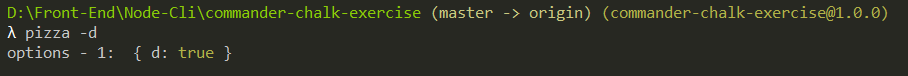
   2. 终端输入：`pizza -d -s`，输出如下图所示：
      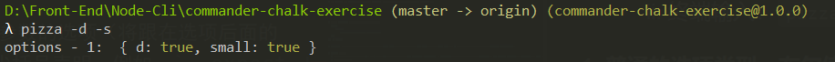
   3. 终端输入：`pizza -s -p`，输出如下图所示：
      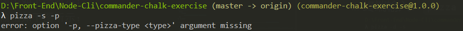
   4. 终端输入：`pizza -d -s -p vegetarian`，输出如下图所示：
      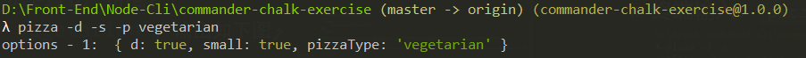
   5. 终端输入：`pizza -d -s --pizza-type=vegetarian`，输出如下图所示：
      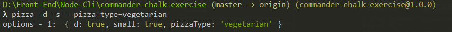

#### 2. 普通的选项类型、布尔值和普通值

1. 最常用的选项类型是布尔类型和接收参数的选项（将跟在选项后面的值作为选项的参数），选项的参数通过尖括号声明，例如：`--expect <value>`，value 就作为 `--expect` 选项的必输入的参数跟在 `--expect` 后面，中间隔着一个空格。如果没有在输入命令时指定选项参数，那么就会提示报错。

2. 如果在设置选项时，没有给选项设置必输项，即通过 option 方法仅仅配置一个选项，如：`option('-s, --save')` 那么通过 opts 方法获得的选项对象中，这个选项对应的 value 就是 true。如果没有在命令中输入这个选项，那么 opts 方法返回的对象就没有这个选项对应的属性。

3. 示例代码：
   ```js
      program
          .option('-d, --debug', 'output extra debugging')
          .option('-s, --small', 'small pizza size')
          .option('-p, --pizza-type <type>', 'flavour of pizza')

      program.parse(process.argv);

      const options = program.opts();

      // console.log('options - 1: ', program.opts());

      if (options.debug) {
           console.log('options - 2: ', options);
      }

      console.log('pizza details: ');

      if (options.small) {
         console.log('- small pizza size');
      }

      if (options.pizzaType) {
         console.log(`- ${options.pizzaType}`);
      }
   ```
    1. 终端输入：`pizza -p`，输出如下图所示：
       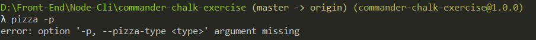
    2. 终端输入：`pizza -d -s`，输出如下图所示：
       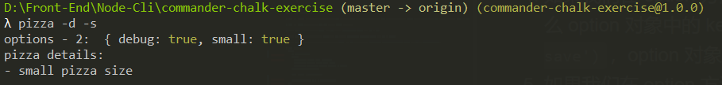
    3. 终端输入：`pizza -d -s -p vegetarian`，输出如下图所示：
       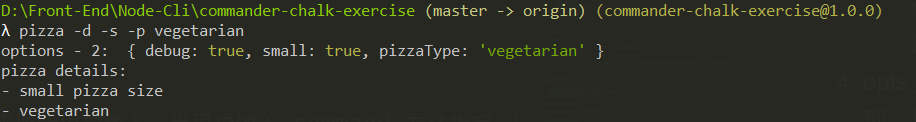
    4. 终端输入：`pizza --pizza-type=cheese`，输出如下图所示：
       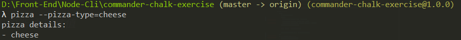

#### 3. 默认值

1. 我们可以给选项设置默认值：option 方法指定第三个参数，即可为第一个参数的选项设置默认值。

2. 一般情况下，在设置了选项有必输入的参数时，需要设置一个默认值。

3. 在终端输入命令时，如果我们不写这个选项，那么这个选项就会采用默认值，如果写了这个选项，没有写参数，那么会报错。在写了选项和参数的情况下，这个参数就会取代选项的默认值。

4. 代码示例：
   ```js
      program
          .option('-c, --cheese <type>', 'add the specified type of cheese', 'blue');

      program.parse(process.argv);

      const options = program.opts();

      console.log('options - 1: ', program.opts());
      console.log('cheese type: ', options.cheese);

   ```
   1. 终端输入：`pizza`，输出如下图所示：
      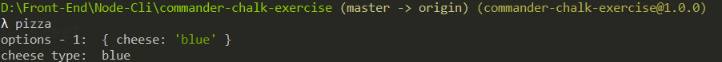
   2. 终端输入：`pizza --cheese stilton`，输出如下图所示：
      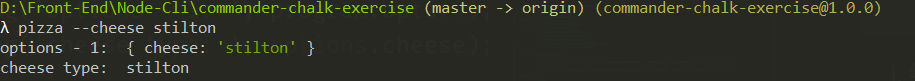

#### 4. 其他的选项类型、可否定的布尔值、布尔值以及普通值

1. 有些情况下，我们需要将布尔类型的选项设置为 false。这种情况下，我们在 `option` 方法中设置命令的选项的时候，选项名称需要以 `no-` 开头。

2. 假如我们首先定义了 `--foo` 这个选项，`--no-foo` 并不会改变 `--foo` 这个选项的默认值。因此，我们可以给一个布尔类型的选项定义一个默认的布尔值，并且我们在终端输入的选项参数能覆盖这个默认值。

3. 设置以 `no-` 开头的否定类型的选项，例如：`--no-use`，只有在命令中显示调用这个 `--no-use` 选项，`option` 对象中的 `use` 属性才会变成 `false`。

4. 示例代码如下：
   ```js
      program
          .option('--no-sauce', 'Remove sauce')
          .option('--cheese <flavour>', 'cheese flavour', 'mozzarella')
          .option('--no-cheese', 'plain with no cheese')
      

      program.parse(process.argv);

      const options = program.opts();

      console.log('options: ', options);

      const sauceStr = options.sauce ? 'sauce' : 'no sauce';
      const cheeseStr = (options.cheese === false) ? 'no cheese' : `${options.cheese} cheese`;
      console.log(`You ordered a pizza with ${sauceStr} and ${cheeseStr}`);
   ```
   1. 在第一个 option 方法中配置了 `--no-sauce` 这个选项，那么同时也配置了 `--sauce` 这个选项，并设置其默认值为 `true`。而在第二个 option 方法中，配置了 `--cheese` 这个选项，并设置其默认值为 `mozzarella`。所以，在命令行中，我们不输入任何参数，查看 `--sauce` 和 `--cheese` 的默认值：
      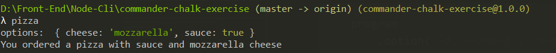
   2. 因为我们没有显示定义 `--sauce` 命令，在终端输入命令是，如果指定 `--sauce` 这个选项，会报错：
      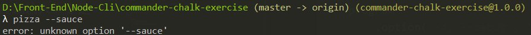
   3. 在输入命令时，给选项设置参数：`pizza --cheese blue`，那么 `--cheese` 选项原本的默认值会被覆盖。如下所示：
      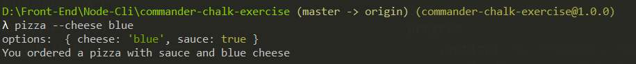
   4. 在命令中，显示设置 `--no-sauce` 和 `--no-cheese`，那么会将 `--sauce` 和 `--cheese` 的值设置为 false。如下所示：
      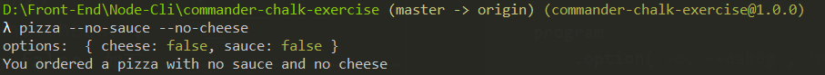

#### 5. 给选项设置可选的输入参数

1. 一个选项可以设置可选的输入参数。在 option 方法接收的第一个参数中，在选项名称后面跟着一个用方括号包裹的内容，二者之间用空格隔开，如：`--use [value]`，表示 `--use` 的输入参数就是可选的。

2. 一个选项设置可选的输入参数后，如果在命令中没有写这个选项，那么最后的 option 对象中这个选项对应的属性的值就是 undefined。
写了选项，但是没有设置参数， option 对象中这个选项对应的属性的值就是 true。

3. 示例代码：
   ```js
      program
         .option('-t, --type [value]', 'pizza type')

      program.parse(process.argv);

      const options = program.opts();

      console.log('options: ', options);
      if (options.type === undefined) {
          console.log('no cheese');
      } else if (options.type === true) {
          console.log('add cheese');
      } else {
          console.log(`add cheese type ${options.type}`);
      }
   ```
   1. 不写选项：`pizza`，那么 option 对象中 `type` 就是 `undefined`，结果如下图所示：
      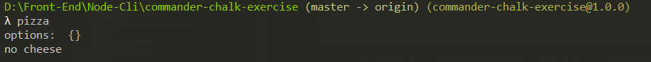
   2. 只写选项，不写输入参数：`pizza --type`，option 对象中 `type` 就是 `true`，结果如下图所示：
      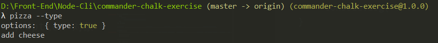
   3. 同时写选项和参数：`pizza --type blue`，option 对象中 `type` 就是写入的参数：`blue`。结果如下图所示：
      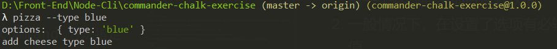

#### 6. 必输的选项

1. 使用 requiredOption 这个方法可以指定一个必要选项。设置了必要选项后，我们在写命令的时候，就必须写这个选项，同时还要给选项设置参数（选项有默认值的情况下不用在命令行中写），

2. requiredOption 的示例用法：
   ```js
      program
         .requiredOption('-c, --cheese <type>', 'pizza must have cheese');

      program.parse(process.argv);

      const options = program.opts();

      console.log('options: ', options);
   ```
   1. 只输入命令，没有指定选项：`pizza`，会提示报错：
      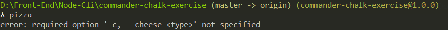
   2. 输入选项，不写选项参数：`pizza -c`，还是会提示报错：
      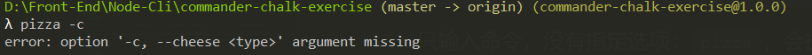
   3. 即输入选项，也写选项参数：`pizza -c blue`，此时不会报错，输出如下：
      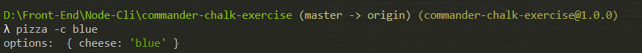

#### 7. 可变选项

1. 正常情况下，一个选项只能接收一个选项参数。如果想要接收多个选项参数，我们可以在 option 方法中进行配置，配置方法就是在选项名后面的参数占位符后面添加 `...`，例如：`'-s, --size <value...>'`，`value` 后面跟着的 `...` 就表示 `--size` 可以接收多个选项参数。

2. 指定了可变选项后，Commander 会将传入的多个选项参数解析，并放入一个数组中。

3. Commander 怎么知道哪些参数是属于某个选项的呢，Commander 在解析某个选项的参数的时候，当遇到一个以单个连字符（`-`）开头的参数，解析就停止了，这个参数前面的参数会作为这个选项的参数。如果是两个单个连字符（`--`）这样的特殊参数（后面没有任何参数），解析过程会完全停止，即使后面有参数，Commander 也不会将其作为选项参数。

4. 示例：
   ```js
      program
          .option('-n, --number <numbers...>', 'specify numbers')
          .option('-l, --letter [letters...]', 'specify letters');

       program.parse(process.argv);

       console.log('Options: ', program.opts());

       // 除去选项参数后，剩下的参数，可以认为是命令参数
       console.log('Remaining arguments: ', program.args);
   ```
   1. 在终端输入：`pizza --number 1 2 3 -l a b c`，完全被解析，结果如下：
      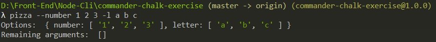
   2. 在终端输入：`pizza --number 1 2 3 --letter a b c`，完全被解析，结果如下：
      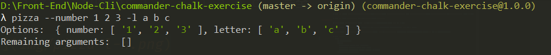
   3. 在终端输入：`pizza -n10 1 2 3 --letter a b c`，部分解析，10 会作为选项 `-n` 的参数，而 1、2、3 会被解析为命令的参数。结果如下：
      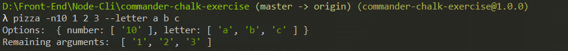
   4. 在终端输入：`pizza -n10 --letter=A operand`，10 会被解析为 `-n` 的参数，而 A 会被解析为 `--letter` 的参数，operand 会被解析为命令参数。结果如下所示：
      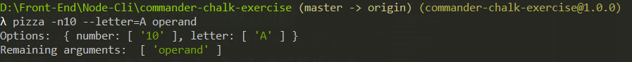
   5. 在终端输入：`pizza --letter -n 1 -n 2 3 -- operand`，使用了特殊参数 `--`，那么对选项参数的解析就到此为止，后面的参数就被解析为命令参数。结果如下：
      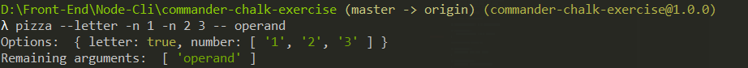

5. 通过上面的例子，我觉得还是使用 `--` 作为选项参数和命令参数的分隔符比较好。

#### 6. 总结

1. 布尔类型的选项，默认值为 true：`option('-s, --save', 'save option')`
2. 存在必输入参数的选项：`option('-w, --width <width>')`
3. 有默认值的选项：`option('-w, --width <width>', 'image width', 100)`
4. 可选参数的选项：`option('-w, --width [width]')`
5. 可否定的布尔类型选项：`option('--no-cheese', 'no cheese')`
6. 必输入的选项：`requiredOption('-w, --width <width>')`
7. 可变选项：`option('-n, --number <value...>')`

### 3. action

1. `action` 方法来监听用户输入，当用户输入 command 方法指定的命令后会触发回调函数。

2. 回调函数的参数与和哪个函数一起调用有关。如果是附在 option 方法的后面，那么其第一个参数是命令的值，第二个参数是上面的选项对象，第三个参数是 command 对象本身。我们可以根据我们输入的命令，来决定执行什么内容。

3. 如果是附在 argument 方法的后面，那么回调函数的参数就是前面的通过 argument 方法设置的命令的参数。示例如下：
   ```js
      program
          .command('login')
          .argument('<username>', 'user to login')
          .argument('[password]', 'password for user, if required', 'not required')
          .argument('[flag]', 'login pattern', 'sk2')
          .action((username, password, flag) => {
              console.log('username: ', username);
              console.log('password: ', password);
              console.log('flag: ', flag);
          })

      // 必须使用 parse 函数解析我们输入的命令
      program.parse(process.argv);
   ```
### 4. description

1. `description` 方法接收一个字符串用来简要描述这个命令的作用。一般附在 command 方法后面。

### 5. name 和 usage

1. `usage` 方法用来输出这个命令的使用方式的相关内容。接收一个字符串作为参数，字符串是命令的描述内容。命令的选项是 `-h` 或者是 `--help`。

2. name 方法和 usage 联合起来使用，用来自定义帮助第一行中的说明。名称是从（完整）程序参数中推导出来的。

3. 示例：
   ```js
      program
          .name("my-command")
          .usage("[global options] command")
   ```
   help 命令显示的内容的第一行是：
   ```
      Usage: my-command [global options] command
   ```
4. 上面的例子还是看不出来 name 方法和 usage 方法放到一起的作用。我们还是借鉴一下知名的命令行工具，看看人家的帮助是怎么写的。以 npm 为例，输入 `npm -h`，输出如下：
    ```
          Usage: npm <command>

          where <command> is one of:
               access, adduser, audit, bin, bugs, c, cache, ci, cit,
               clean-install, clean-install-test, completion, config,
               create, ddp, dedupe, deprecate, dist-tag, docs, doctor,
               edit, explore, fund, get, help, help-search, hook, i, init,
               install, install-ci-test, install-test, it, link, list, ln,
               login, logout, ls, org, outdated, owner, pack, ping, prefix,
               profile, prune, publish, rb, rebuild, repo, restart, root,
               run, run-script, s, se, search, set, shrinkwrap, star,
               stars, start, stop, t, team, test, token, tst, un,
               uninstall, unpublish, unstar, up, update, v, version, view,
               whoami

          npm <command> -h  quick help on <command>
          npm -l            display full usage info
          npm help <term>   search for help on <term>
          npm help npm      involved overview

          Specify configs in the ini-formatted file:
          C:\Users\qmr\.npmrc
          or on the command line via: npm <command> --key value
          Config info can be viewed via: npm help config

          npm@6.14.15 C:\Program Files\nodejs\node_modules\npm

    ```
5. 在 npm 命令的帮助中，可以发现，第一行是 npm 命令的基本用法。对比我们上面使用 name 方法和 usage 方法自定义的第一行，name 方法接收的东西实际就是等同于 npm ，也就是命令名（Executable）。

6. 因此，我们可以这样自定义帮助内容的第一行（假设主命令是 `pizza`）：
   ```js
      program
          .name('pizza')
          .usage('<command> [option]')
      // ...
   
   ```
7. 在终端输入：`pizza -h`，输出如下：
   ```
      Usage: pizza <command> [option]
   ```

### 6. on

1. 这个方法用来监听命令（command）和选项（option）事件，来执行自定义操作。

2. on 方法的参数
   - 第一个参数是监听的命令或者选项。
   - 第二个参数是回调函数，当指定的命令或者选项被输入时，就会执行回调函数。

3. 示例：
   ```js
      program
          .command('set <type>')
          .description('set pizza size');
   
      program
          .option('-d, --debug', 'output extra debugging')
          .option('-s, --small', 'small pizza size')
      // 监听触发指定的 option
      program
          .on('option:debug', function() {
              console.log('debug option event was emitted', this.opts());
          })

      program
          .on('option:small', function() {
               console.log('small option event was emitted', this.opts());
      })
      
      program
          .on('command:set', function() {
              console.log('command set event was emitted', this.args);
        
    })
   ```
   1. 终端输入：`pizza -d`，终端输出：  
      `debug option event was emitted { debug: true }`
   2. 终端输入：`pizza -s`，终端输出：  
       `small option event was emitted { small: true }`
   3. 终端输入：`pizza set big`，终端输出：
      `command set event was emitted [ 'set', 'big' ]`

4. 根据文档的示例，`on` 方法监听的选项或者子命令，不能直接写相应的名称，而是要加入前缀，如果是选项，就使用 `option:optionName` 的形式，子命令则是 `command:cammandName` 的形式。可以看一看 `on` 方法实现的源码来探究监听的事件名称。

5. 目前有一个小问题，就是只要输入 `pizza` 开头额命令，终端也会输出帮助内容。这个需要解决一下。

### 7. version

1. `version` 方法是 commander 提供的一个输出版本号的方法，接收一个字符串作为参数，这个字符串就是版本信息。命令的选项是 `-V` 或者是 `--version`。

### 8. parse

1. `parse` 方法接收的第一个参数是等待解析的字符串数组。那么我们可以传入 `process.argv` 作为参数。这样就可以解析我们的命令。

### 9. 书写命令说明（`-h` \ `--help`）

## 8. chalk

1. chalk 这个包可以给终端的文字添加样式，使得我们在终端输出的信息更加明显，更加具有提示效果。

2. 安装 chalk：`npm install chalk`

3. chalk 官方文档：[官方文档](https://github.com/chalk/chalk#readme)

## 9. inquirer

1. inquirer 用于实现和命令行进行交互。