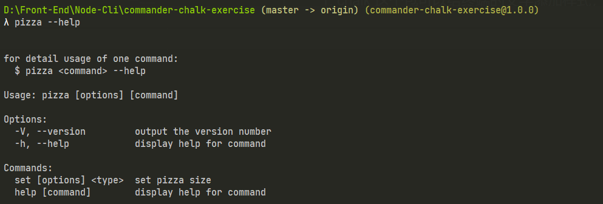

<!-- START doctoc generated TOC please keep comment here to allow auto update -->
<!-- DON'T EDIT THIS SECTION, INSTEAD RE-RUN doctoc TO UPDATE -->
**Table of Contents**  *generated with [DocToc](https://github.com/thlorenz/doctoc)*

- [使用 Node 开发命令行工具](#%E4%BD%BF%E7%94%A8-node-%E5%BC%80%E5%8F%91%E5%91%BD%E4%BB%A4%E8%A1%8C%E5%B7%A5%E5%85%B7)
  - [1. 参考资料](#1-%E5%8F%82%E8%80%83%E8%B5%84%E6%96%99)
  - [2. GNU 和 Linux 命令规范](#2-gnu-%E5%92%8C-linux-%E5%91%BD%E4%BB%A4%E8%A7%84%E8%8C%83)
    - [1. GNU 命令规范](#1-gnu-%E5%91%BD%E4%BB%A4%E8%A7%84%E8%8C%83)
    - [2. Linux 命令](#2-linux-%E5%91%BD%E4%BB%A4)
    - [3. GNU 与 Linux 命令规范在开发命令行工具中的作用](#3-gnu-%E4%B8%8E-linux-%E5%91%BD%E4%BB%A4%E8%A7%84%E8%8C%83%E5%9C%A8%E5%BC%80%E5%8F%91%E5%91%BD%E4%BB%A4%E8%A1%8C%E5%B7%A5%E5%85%B7%E4%B8%AD%E7%9A%84%E4%BD%9C%E7%94%A8)
  - [3. Node 开发基础的命令行工具](#3-node-%E5%BC%80%E5%8F%91%E5%9F%BA%E7%A1%80%E7%9A%84%E5%91%BD%E4%BB%A4%E8%A1%8C%E5%B7%A5%E5%85%B7)
  - [4. 引入 commander 和 chalk](#4-%E5%BC%95%E5%85%A5-commander-%E5%92%8C-chalk)
    - [1. 常用 npm 命令](#1-%E5%B8%B8%E7%94%A8-npm-%E5%91%BD%E4%BB%A4)
    - [2. 一般命令行工具中的命令使用方式总结](#2-%E4%B8%80%E8%88%AC%E5%91%BD%E4%BB%A4%E8%A1%8C%E5%B7%A5%E5%85%B7%E4%B8%AD%E7%9A%84%E5%91%BD%E4%BB%A4%E4%BD%BF%E7%94%A8%E6%96%B9%E5%BC%8F%E6%80%BB%E7%BB%93)
  - [5. commander 和 chalk 的初步使用](#5-commander-%E5%92%8C-chalk-%E7%9A%84%E5%88%9D%E6%AD%A5%E4%BD%BF%E7%94%A8)
    - [1. 增加版本信息和命令使用说明 - 使用 commander 实现](#1-%E5%A2%9E%E5%8A%A0%E7%89%88%E6%9C%AC%E4%BF%A1%E6%81%AF%E5%92%8C%E5%91%BD%E4%BB%A4%E4%BD%BF%E7%94%A8%E8%AF%B4%E6%98%8E---%E4%BD%BF%E7%94%A8-commander-%E5%AE%9E%E7%8E%B0)
    - [2. 给输出的文字添加颜色 - 使用 chalk 实现](#2-%E7%BB%99%E8%BE%93%E5%87%BA%E7%9A%84%E6%96%87%E5%AD%97%E6%B7%BB%E5%8A%A0%E9%A2%9C%E8%89%B2---%E4%BD%BF%E7%94%A8-chalk-%E5%AE%9E%E7%8E%B0)
  - [6. 继续完善我们的命令行工具](#6-%E7%BB%A7%E7%BB%AD%E5%AE%8C%E5%96%84%E6%88%91%E4%BB%AC%E7%9A%84%E5%91%BD%E4%BB%A4%E8%A1%8C%E5%B7%A5%E5%85%B7)
    - [1. 使用 command 方法和 option 方法完成基本的命令与选项的配置](#1-%E4%BD%BF%E7%94%A8-command-%E6%96%B9%E6%B3%95%E5%92%8C-option-%E6%96%B9%E6%B3%95%E5%AE%8C%E6%88%90%E5%9F%BA%E6%9C%AC%E7%9A%84%E5%91%BD%E4%BB%A4%E4%B8%8E%E9%80%89%E9%A1%B9%E7%9A%84%E9%85%8D%E7%BD%AE)
    - [2. 添加业务逻辑 —— 生成图片](#2-%E6%B7%BB%E5%8A%A0%E4%B8%9A%E5%8A%A1%E9%80%BB%E8%BE%91--%E7%94%9F%E6%88%90%E5%9B%BE%E7%89%87)
  - [7. chalk](#7-chalk)
    - [1. 基本使用](#1-%E5%9F%BA%E6%9C%AC%E4%BD%BF%E7%94%A8)
    - [2. API](#2-api)
      - [1. chalk.level](#1-chalklevel)
      - [2. 检测终端对颜色的支持](#2-%E6%A3%80%E6%B5%8B%E7%BB%88%E7%AB%AF%E5%AF%B9%E9%A2%9C%E8%89%B2%E7%9A%84%E6%94%AF%E6%8C%81)
      - [3. 支持的颜色](#3-%E6%94%AF%E6%8C%81%E7%9A%84%E9%A2%9C%E8%89%B2)
      - [4. 支持的修饰符](#4-%E6%94%AF%E6%8C%81%E7%9A%84%E4%BF%AE%E9%A5%B0%E7%AC%A6)
      - [5. 支持的背景颜色](#5-%E6%94%AF%E6%8C%81%E7%9A%84%E8%83%8C%E6%99%AF%E9%A2%9C%E8%89%B2)
      - [6. 自定义颜色](#6-%E8%87%AA%E5%AE%9A%E4%B9%89%E9%A2%9C%E8%89%B2)
        - [1. `hex`](#1-hex)
        - [2. `rgb`](#2-rgb)
  - [8. Commander](#8-commander)
    - [1. command](#1-command)
      - [1. 指定 action 作为命令的执行器](#1-%E6%8C%87%E5%AE%9A-action-%E4%BD%9C%E4%B8%BA%E5%91%BD%E4%BB%A4%E7%9A%84%E6%89%A7%E8%A1%8C%E5%99%A8)
      - [2. 单独的可执行文件](#2-%E5%8D%95%E7%8B%AC%E7%9A%84%E5%8F%AF%E6%89%A7%E8%A1%8C%E6%96%87%E4%BB%B6)
      - [3. 自定名称的可执行文件 - 使用 `executableFile`](#3-%E8%87%AA%E5%AE%9A%E5%90%8D%E7%A7%B0%E7%9A%84%E5%8F%AF%E6%89%A7%E8%A1%8C%E6%96%87%E4%BB%B6---%E4%BD%BF%E7%94%A8-executablefile)
      - [4. 使用 argument 函数接收子命令参数](#4-%E4%BD%BF%E7%94%A8-argument-%E5%87%BD%E6%95%B0%E6%8E%A5%E6%94%B6%E5%AD%90%E5%91%BD%E4%BB%A4%E5%8F%82%E6%95%B0)
    - [2. option](#2-option)
      - [1. opts 方法获取 option 对象](#1-opts-%E6%96%B9%E6%B3%95%E8%8E%B7%E5%8F%96-option-%E5%AF%B9%E8%B1%A1)
      - [2. 普通的选项类型、布尔值和普通值](#2-%E6%99%AE%E9%80%9A%E7%9A%84%E9%80%89%E9%A1%B9%E7%B1%BB%E5%9E%8B%E5%B8%83%E5%B0%94%E5%80%BC%E5%92%8C%E6%99%AE%E9%80%9A%E5%80%BC)
      - [3. 默认值](#3-%E9%BB%98%E8%AE%A4%E5%80%BC)
      - [4. 其他的选项类型、可否定的布尔值、布尔值以及普通值](#4-%E5%85%B6%E4%BB%96%E7%9A%84%E9%80%89%E9%A1%B9%E7%B1%BB%E5%9E%8B%E5%8F%AF%E5%90%A6%E5%AE%9A%E7%9A%84%E5%B8%83%E5%B0%94%E5%80%BC%E5%B8%83%E5%B0%94%E5%80%BC%E4%BB%A5%E5%8F%8A%E6%99%AE%E9%80%9A%E5%80%BC)
      - [6. 必输的选项](#6-%E5%BF%85%E8%BE%93%E7%9A%84%E9%80%89%E9%A1%B9)
      - [7. 可变选项](#7-%E5%8F%AF%E5%8F%98%E9%80%89%E9%A1%B9)
      - [8. 总结](#8-%E6%80%BB%E7%BB%93)
    - [3. action](#3-action)
    - [4. description](#4-description)
    - [5. name 和 usage](#5-name-%E5%92%8C-usage)
    - [6. on](#6-on)
    - [7. version](#7-version)
    - [8. parse 和 parseAsync](#8-parse-%E5%92%8C-parseasync)
    - [9. 书写命令说明（`-h` \ `--help`）](#9-%E4%B9%A6%E5%86%99%E5%91%BD%E4%BB%A4%E8%AF%B4%E6%98%8E-h-%5C---help)
      - [1. 自定义帮助内容](#1-%E8%87%AA%E5%AE%9A%E4%B9%89%E5%B8%AE%E5%8A%A9%E5%86%85%E5%AE%B9)
      - [2. 在发生错误之后展示帮助信息](#2-%E5%9C%A8%E5%8F%91%E7%94%9F%E9%94%99%E8%AF%AF%E4%B9%8B%E5%90%8E%E5%B1%95%E7%A4%BA%E5%B8%AE%E5%8A%A9%E4%BF%A1%E6%81%AF)
    - [10. 总结](#10-%E6%80%BB%E7%BB%93)
  - [9. inquirer](#9-inquirer)
  - [10. shelljs](#10-shelljs)

<!-- END doctoc generated TOC please keep comment here to allow auto update -->

# 使用 Node 开发命令行工具

## 1. 参考资料

1. [Linux Shell命令的基本格式](http://c.biancheng.net/view/3163.html)

2. [一个符合GNU标准的命令行的组成格式](https://www.jianshu.com/p/0a61481087dc)

3. [linux常用命令格式](https://www.cnblogs.com/951767619x/p/14328825.html)

4. [命令行语法字符](https://ftpdocs.broadcom.com/cadocs/0/CA%20ARCserve%20Backup%20r16%205-CHS/Bookshelf_Files/HTML/caabhelp/cl_cmd_line_syntax_char.htm)

5. [命令行界面 (CLI)、终端 (Terminal)、Shell、TTY，傻傻分不清楚？](https://segmentfault.com/a/1190000016129862)

6. [Linux 命令格式](https://blog.csdn.net/liang19890820/article/details/52512744)

7. [手把手教你使用nodejs编写cli(命令行)](https://juejin.cn/post/6844903702453551111)

8. [Node 命令行工具实战](https://juejin.cn/post/7026180708720721957)

9. [commander编写Node命令行工具(cli)](https://juejin.cn/post/6844903831097049096)

10. [Node.js+commander 开发命令行工具](https://juejin.cn/post/6844903445653094414)

11. [用 nodejs 写一个命令行工具 ：创建 react 组件的命令行工具](https://juejin.cn/post/6844903740944695310)

12. [node命令行小工具开发【翻译小工具】](https://segmentfault.com/a/1190000008714075)

13. [Node.js+commander开发命令行工具](https://www.jianshu.com/p/2cae952250d1)
14. [动手制作nodejs命令行工具 iconfont-cli](https://juejin.cn/post/6844903683457548295)

15. [从零开始开发一个Node交互式命令行应用](https://juejin.cn/post/6844903790122909709)

## 2. GNU 和 Linux 命令规范

### 1. GNU 命令规范

1. 实际上，我们在终端输入的命令还是有一定的标准格式的。一个 GNU 规定的命令行的格式如下所示：
   
   图片来源：[一个符合GNU标准的命令行的组成格式](https://www.jianshu.com/p/0a61481087dc)

2. 一个完整的Terminal命令主要由4部分组成：
   - 命令名（Executable): `git`
   - 子命令（Command）: `push`
   - 选项（Options）: `--no-pager` 和 `-v` 都是
   - 参数（arguments）: `origin` 和 `master`

3. 这里说一下选项（Options）。从形式上来说，`Options`分成两种形式：简短形式和完整形式。
   - 简短形式：一般由一个连接符`-`后面跟一个字母组成，如：
   `ls -l -a -t # -l, -a, -t 都是简短形式的Option`
   几个简短形式的 `Options` 可以合并写成一个：
`ls -lat` 效果等同于 `ls -l -a -t`。
   - 完整形式：一般由两个连接符 `--` 开头，接着是一个或多个完整的单词，如果有多个单词，那么中间用一个连接符连接，如上面的 `--no-pager`。

4. 从功能上来讲，`Options` 一般有两种。一种是`switch`：开关，即用来开启（enable）或者是关闭（disable）一些 `feature`，关闭（disable）的这个选项一般以 `--no` 开头，如上面的 `--no-pager`，就是用来禁用 `pager` 这个 `feature` 的。除此之外的另外一种是 `flag`。`switch` 一般没有参数，`flag` 则一般有参数。

5. 如果一个 `flag` 有参数，那么一般简短形式的 flag 跟它的参数之间由一个空格分开。而完整形式的 `flag` 则用一个 `=` 连接它的参数，如：
   ```js
      curl -X POST http://www.google.com # POST是-X的参数
      curl --request=POST http://www.google.com # POST 是 --request的参数。
   ```
   这里要分清楚的是 `Options` 的参数和这整个命令的参数，在上面的例子中，POST 是选项 `-X`（或 `--request`）的参数，而 `http://www.google.com` 则是这整个命令的参数。

### 2. Linux 命令

1. Linux 中的命令一般会遵守一定的格式，如下所示：
   ```shell
      command [options] [arguments]
   ```
2. 每个字段的含义如下：
   - `command` 命令：即命令名称。
   - `options` 命令选项：用于调整命令的功能。命令不同，选项的个数和内容会有所不同；要实现的命令功能不同，选项的个数和内容也会有所不同。
   - `arguments` 命令参数：是命令处理的对象，通常情况可以是文件名、目录、或用户名。

3. 以 `ls` 这个命令为例，我们在终端中直接敲入这个命令会列出当前目录下的内容。`ls` 命令后面不加选项和参数也能执行，不过只能执行最基本的功能。
   

4. 在命令后面加入参数后可以显示更加丰富的数据。例如：`ls -l`。`-l` 的作用是：长数据串列出，包含文件的属性与权限等等数据。
   

5. 选项又分为短格式选项：`-a` 和长格式选项：`--all`。短格式选项是英文的简写，用一个连字符（`-`）调用，长格式选项是英文完整单词，一般用两个连字符（`--`）调用。多个单词中间使用一个连字符连接（不是所有选项都有长格式）。
   - 短格式 `-a` 的调用形式：
     
   - 长格式 `--all` 的调用形式：
     

6. 选项可以多个并用。例： `ls -a -l`
   - `-a`：全部的文件，连同隐藏( 开头为 . 的文件) 一起列出来。
   - `-l`：长数据串列出，包含文件的属性与权限等等数据。
     

7. 选项可以合在一起写（短格式的命令），如：`ls -al`：
   

### 3. GNU 与 Linux 命令规范在开发命令行工具中的作用

1. 实际上，`Linux` 的命令和 `GNU` 的命令的格式基本类似。`Linux` 命令格式更倾向于 `Linux` 系统本身提供的命令。而 `GNU` 的命令格式更倾向于命令行（Command Line Interface）的格式。如 `git`、`npm`、`npx` 等都是符合 `GNU` 格式命令行工具。

2. 因此我们开发命令行工具应该使用 GNU 格式的命令规范。

## 3. Node 开发基础的命令行工具

1. 初始化一个项目：`node-cli-demo-1`：
   ```shell
      mkdir node-cli-demo-1
      cd node-cli-demo-1
      npm init -y
   ```
2. 在 `node-cli-demo-1` 下新建一个 bin 目录，然后在 bin 目录新建一个 word2img.js 文件，word2img.js 内容如下：
   ```js
      #!/usr/bin/env node
      console.log('hello world');
   ```
   `#!/usr/bin/env node` 这句话的作用是用来向系统指明这个脚本文件的解释器是 node。

3. 修改项目下的 package.json 文件：
   ```json
      {
         "name": "node-cli-demo-1",
         "version": "1.0.0",
         "description": "",
         "bin": {
            "word2img": "./bin/word2img.js"
          },
          "keywords": [],
          "author": "",
          "license": "ISC"
      }
   ```
   主要在 package.json 中添加了 bin 字段，其值为对象，内容如下：
   ```json
      "bin": {
            "word2img": "./bin/word2img.js"
      },
   ```
   `bin` 字段用于映射可执行文件的路径，作用类似于添加环境变量。
4. 我们在当前目录下面的 powerShell 中输入：`./bin/word2img.js`，能得到下面的输出：
   

5. 基本实现一个一个命令行工具，能实现输入一个命令，而得到一个输出。

6. 但是我们需要输入文件的相对路径，这样不够简介，也不够方便。因此我们需要把相对路径去掉，我们命令行输入 `npm link`：
   

7. `npm link` 的作用是软链接。从上面贴的 `npm link` 执行输出的截图可以看到，就是进行了一个软链接的过程，把当前项目软链到 nodejs 安装目录的 node_modules 文件夹下的同名文件夹，然后再软链接到nodejs安装目录下的同名可执行文件。

8. 以当前项目为例，使用的是 windows 10 系统，打开 `C:\Users\qmr\AppData\Roaming\npm\` 文件夹，可以看到多了三个文件 `word2img` 、`word2img.cmd` 和 `word2img.ps1`，这三个文件都可以用编辑器打开，里面主要是 shell 脚本的内容。同时 `C:\Users\qmr\AppData\Roaming\npm\node_modules\` 文件夹下多了一个 `node-cli-demo-1` 的软连接文件夹，其内容和我们的项目一样。

9. 执行完` npm link` 命令后就可以全局使用我们的命令了，`npm link` 还可以指定项目使用。这里就不再详说了。`npm link` 详解请看：[官方文档 npm-link](https://docs.npmjs.com/cli/v7/commands/npm-link)

10. 此时在终端输入：`word2img`，就能得到和刚刚输入完整路径命令一样的输出了：
    

## 4. 引入 commander 和 chalk

1. 现在我们的命令行只能直接敲一个命令，输出一个 `hello world`，不具备什么实用性，我们可以看一下 `npm` 这个命令有哪些玩法。

### 1. 常用 npm 命令

1. 查看当前版本：
   ```shell
      npm -v  # npm --version
   ```
2. 查看使用说明：
   ```shell
      node -h  # npm --help
   ```
   如下所示：
   
3. 安装包：
   ```shell
      npm install (with no args, in package dir)
      npm install [<@scope>/]<name>
      npm install [<@scope>/]<name>@<tag>
      npm install [<@scope>/]<name>@<version>
      npm install [<@scope>/]<name>@<version range>
      npm install <tarball file>
      npm install <tarball url>
      npm install <folder>
      alias: npm i
      common options: [-S|--save|-D|--save-dev|-O|--save-optional] [-E|--save-exact] [--dry-run]
   ```
   1. `-S` 或者 `--save` 将安装包信息加入到 `package.json` 中的 `dependencies`（生产阶段的依赖）
   2. `-D` 或者 `--save-dev` 安装包信息将加入到 `package.json` 中的 `devDependencies`（开发阶段的依赖），所以开发阶段一般使用它。
   3. `-O` 或者 `--save-optional` 安装包信息将加入到 `package.json` 中的  `optionalDependencies`（可选阶段的依赖）
   4. `-E` 或者 `--save-exact` 精确安装指定模块版本。
   5. 

4. 初始化一个项目（生成 package.json）：
   ```shell
      npm init [--yes|-y|--scope]
   ```
5. 更新一个包：
   ```shell
      npm update [-g] [<pkg>...]
   ```

6. 管理 npm 的配置内容：
   ```shell
      npm config set <key>=<value> [<key>=<value> ...]
      npm config get [<key> [<key> ...]]
      npm config delete <key> [<key> ...]
      npm config list [--json]
      npm config edit
      npm set <key>=<value> [<key>=<value> ...]
      npm get [<key> [<key> ...]]
      alias: c
   ```
   常用的是 `npm config set registry=xx` 来配置 npm 镜像源。

### 2. 一般命令行工具中的命令使用方式总结

1. 观察 npm 命令的使用方式，并对比之前提到的 GNU 命令的标准格式，我们发现，npm 命令提供了命令名（Executable）、子命令（command）、选项（Options）和参数（Arguments）。

2. 命令的说明中，使用方括号（`[]`）包围的内容是可选的，表示我们在使用这个命令时可以根据我们的需求添加或者不添加这个选项或者参数。如：`npm init [--yes|-y|--scope]`，方括号里面的 `--yes|-y|--scope` 这个选项都是可选的，使用竖线（`|`）表示这个选项可以使用这几个值中的一个。而尖括号（`<>`）包围的内容是必选的。也就是使用这个命令时必须添加的内容。如 `npm config set <key>=<value>` 中，`key` 和 `value` 就是必选的参数。

3. 想要实现这样的功能，就需要解析我们在命令中输入的内容，包括命令、选项和参数。我们可以使用原生 Node 提供的 `process.argv` 来解析我们输入的内容。

4. `process.argv` 是一个数组，包含启动 Node 进程时传入的命令行参数。第一个元素将是 process.execPath。即启动 Node.js 进程的可执行文件的绝对路径名。如果需要访问 argv[0] 的原始值，直接访问 `process.argv0` 这个变量。`process.argv` 的第二个元素将是正在执行的 JavaScript 文件的路径。 而其余元素将是任何其他命令行参数。举例如下：
   ```js
      // process-argv.js
      const {argv} = require('process');

      argv.forEach((item, index) => {
      console.log(`${index}: ${item}`);
      });
   ```
   执行命令：`node process-argv.js one tow=three four hello world`，输出如下：
   ```js
      // 0: C:\Program Files\nodejs\node.exe
      // 1: D:\Front-End\Node-Cli\process-argv.js
      // 2: one
      // 3: tow=three
      // 4: four
      // 5: hello
      // 6: world
   ```
5. 实际上使用 `process.argv` 进行解析我们输入的命令是比较麻烦的，我们需要处理较多的情况。在开发命令行的过程中，解析命令不是我们的工作重点，我们的重点应该根据命令执行不同的操作。

6. 因此，我们使用一个成熟的解析命令的工具：`commander` 来解析我们命令、选项和参数。

7. 有时候，我们发现有一些命令行工具的输入是带颜色的，如使用 `git status`，就会用不同的颜色标记不同的文件的状态：
   

8. 如果我们也想要实现这样的效果，需要使用另外一个工具：`chalk`。

## 5. commander 和 chalk 的初步使用

### 1. 增加版本信息和命令使用说明 - 使用 commander 实现

1. 安装 commander：
   - commander：`npm install commander`

2. 在 `bin/word2img.js` 中，添加如下的内容： 
   ```js
      #!/usr/bin/env node
      const { Command } = require('commander');
      const program = new Command();
      program.version(require('../package.json').version).usage('<command> [options]');
      program.parse(process.argv);
   ```
   - `version` 方法是 commander 提供的一个输出版本号的方法，命令的选项是 `-V` 或者是 `--version`。
   - `usage` 方法用来输出这个命令的使用方式的相关内容。命令的选项是 `-h` 或者是 `--help`。
   - `parse` 方法接收的第一个参数是等待解析的字符串数组。那么我们可以传入 `process.argv` 作为参数。这样就可以解析我们的命令。

3. 我们输入命令：`word2img -V`，输出如下：
   

4. 我们输入命令：`word2img -V`，输出如下：
   

5. 通过 commander 这个工具，我们开发的命令行工具初步具备了实用性。

### 2. 给输出的文字添加颜色 - 使用 chalk 实现

1. 使用 `git status`，输出的文字中是有一些是有颜色的，比如说需要被提交的文件的名称是绿色的，有修改但是没有提交的文件是红色。如果我们想对部分文字进行着色，那么可以使用 chalk 这个工具。

2. 安装 chalk：
   - chalk：`npm install chalk`

3. 继续修改 `bin/word2img.js`：
   ```js
      #!/usr/bin/env node

      // 创建一个局部的 Command 对象
      const { Command } = require('commander');
      const chalk = require('chalk');
      const path = require('path');

      // console.log('hello world');
      const program = new Command();

      // program.version(require('../package.json').version).usage('<command> [options]');

       program.on('--help', () => {
           console.log();

           console.log(
               ` Run ${chalk.green(
                   `word2img <command> --help`
               )} for detailed usage of given command.
               `
           );

           console.log();
      })
      program.parse(process.argv);
   ```
   - `on` 方法用来监听命令（command）和选项（option）事件，来执行自定义操作。第一个参数是监听的命令或者选项，第二个参数是回调函数，当指定的命令或者选项被输入时，就会执行回调函数。
   - `chalk.green` 会将其接收的字符串以绿色格式进行输出。

4. 在终端中输入 `word2img --help`，输出如下：
   

5. 使用 chalk 这个工具，我们实现了对输出的部分文件进行着色。


## 6. 继续完善我们的命令行工具

1. 下面的内容更多的是参考 [从零开始编写一个node命令行工具](https://juejin.cn/post/6948330334085709855)

### 1. 使用 command 方法和 option 方法完成基本的命令与选项的配置

1. 我们现在的需求是接收用户输入的字符串，把它转化成一张纯色背景文字居中的图片，那么我们可以大致确定出需要的来自外部的变量有哪些：
   - word：将要被转化成图片的字符串
   - width：图片的宽度
   - height：图片的高度
   - bgColor：图片的背景颜色
   - color：文字的颜色
   - size：文字的大小 font-size
   - family：文字的字体 font-family
   - filename：要下载的图片的文件名
   - filepath：图片保存的路径

2. 上面的变量中，word 实际上是命令的参数（argument），其他值都是选项（options）。参数的内容不是固定的，而用户不一定会输入选项，所以选项应该具有默认值。借助 commander，我们可以这样配置：
   ```js
      program
          .command('new <word>')
          .description('generate a new image use the input word')
          .option('-w --width <width>', 'Set width of the image', 600)
          .option('--height <heihgt>', 'Set height of the image', 200)
          .option('--bgColor <bgColor>', 'Set background-color of the image', '#fff')
          .option('--color <color>', 'Set color of the word', '#000')
          .option('--size <size>', 'Set font-size of the word', 48)
          .option('--family <family>', 'Set font-family of the word', 'Arial')
          .option('--filename <filename>', 'Set filename of the image')
          .option('--filepath <filepath>', 'Set file path to save the image' + "(note that the path doesn\'t contain the file name)", path.join(process.cwd(), 'imgs'))
          .action((word, options) => {
              console.log(word);
              console.log(options);
      })
   ```
   - `command` 方法用来指定一个命令或者子命令。其第一个参数接收一个字符串。这里传入的是 `new <word>`，其中 `new` 就是命令的名称，`<word>`指代这个命令的参数，使用尖括号（`<>`）表示这个参数是必选的。
   - `description` 方法接收一个字符串用来简要描述这个命令的作用
   - `option` 方法用来定义命令的选项。而且也作为选项的说明。每个选项可以有一个段格式（short flag），即以单个连字符开头的单个字母，例如 `-a`、`-l`。或者是一个长格式（long name），即以 2 个连字符开头的完整单词，多个单词使用一个连字符连接，例如：`--save`、`--save-dev`。
     - option 方法的第一个参数是字符串形式的选项的名字，我们可以使用逗号（`,`） 空格（` `）和竖线（`|`）来分隔长格式和短格式的选项，例如：`"-w --width"`，`-s,--save` 或者 `-a|-all`。第一个参数的最后的内容是这个选项的接收的参数（arguments）。如 `-w --width <width>`，最后的`<width>` 就表示 `-w` 这个选项接收的参数，使用尖括号（`<>`）表示这个参数是必要的，也就是如果我们在命令中使用 `-w` 这个选项，那么就必须加上参数。最后字符串中的这个参数也要和前面的选项名称用空格分开。
     - 第二个参数是描述这个选项的作用。
     - 第三个参数这个选项的默认值。
   - `action` 方法来监听用户输入，当用户输入 `new` 命令后会触发回调函数，回调函数的第一个参数是命令的值，第二个参数是上面的选项对象，第三个参数是 command 对象本身。我们可以根据我们输入的命令，来决定执行什么内容。

3. 在终端输入：`word2img new 'hello world'`，终端的输出如下：
   

### 2. 添加业务逻辑 —— 生成图片

1. 接下来实现生成图片的功能。因为这里的重点是实现命令行工具，如何生成图片不是我们关注的点，因此，我们这里直接贴代码了。

2. 安装 `canvas`：`npm install canvas`

3. 新建 `./utils/newCanvas.js`，内容如下：
   ```js 
      const { createCanvas } = require('canvas')

      exports.newCanvas = function (word, options) {
          const canvas = createCanvas(options.width, options.height)
          const ctx = canvas.getContext('2d')

          // rect
          ctx.fillStyle = options.bgColor
          ctx.fillRect(0, 0, options.width, options.height)
          // word
          ctx.textBaseline = 'middle'
          ctx.textAlign = 'center'
          ctx.font = `${options.size}px ${options.family}`
          ctx.fillStyle = options.color
          ctx.fillText(word, options.width / 2, options.height / 2)

          return {
             canvas,
             ctx,
          }
      }

   ```
4. 新建 `./utils/canvas2img.js`，内容如下：
   ```js
      const fs = require('fs')
      const path = require('path')
      const chalk = require('chalk')

      exports.canvas2img = function (canvas, filename, filepath) {
          const buf = canvas.toBuffer()
          filename = filename || `word2img_${Date.now()}.png`
          const url = path.resolve(filepath, filename)
          fs.writeFile(url, buf, function (err) {
              if (err) {
                  console.log(err)
              } else {
                  console.log(
                    `✨ image generated successfully at: ${chalk.yellow(url)}`
                  )
              }
          })
      }
   ```
5. 继续修改 `./bin/word2img.js`，内容如下：
   ```js
      #!/usr/bin/env node
      // 只显示新添加的内容
      // ...
      const { newCanvas } = require('../utils/newCanvas');
      const { canvas2img } = require('../utils/canvas2img');

      // console.log('hello world');
      const program = new Command();

       program
           //... command and options
           .action((word, options) => {
               // console.log(word);
               // console.log(options);
               const { canvas } = newCanvas(word, options)
              canvas2img(canvas, options.filename, options.filepath);
           })

      program.parse(process.argv);
   ```

6. 此时，我们在终端输入 `word2img new 'hello-word'`，成功在项目根目录生成了图片，并且终端会提示文件的位置信息。  
   

7. 添加一些选项：` word2img new 'JavaScript' --bgColor 'green' --color '#666' --filename 'javascript.png'`，终端输出的信息如下：  
   

8. 至此我们基本实现了一个简单的生成图片的命令行工具。

## 7. chalk

1. chalk 这个包可以给终端的文字添加样式，使得我们在终端输出的信息更加明显，更加具有提示效果。

2. 安装 chalk：`npm install chalk`

3. chalk 官方文档：[官方文档](https://github.com/chalk/chalk#readme)

4. chalk 的特性
   - Expressive API
   - Highly performant
   - Ability to nest styles
   - 256/Truecolor color support
   - Auto-detects color support
   - Doesn't extend `String.prototype`
   - Clean and focused
   - Actively maintained
   - Used by ~76,000 packages as of October 26, 2021

### 1. 基本使用

1. chalk 非常容易使用。它将每个常用的颜色封装成函数。我们需要将为宗旨设置成什么颜色，就调用哪个颜色的方法，将字符串传入这个颜色函数即可。举例如下：
   ```js
      const chalk = require('chalk');

      const log = console.log;

      log(chalk.red('hello world'));
   ```
   输出如下：
   

2. chalk 可以链式调用，即组合样式。如对文字进行加粗，设置成斜体等。

3. 基本组合：
   ```js
      log(chalk.blue('Hello') + ' World' + chalk.red('!'));

   ```
   输出如下：
   
4. 链式调用 api，组合样式。将 hello word 字体加粗，颜色设置为蓝色，背景色设置为 红色：
   ```js
      log(chalk.blue.bgRed.bold('Hello world!'));
   ```
   输出如下：
   
5. 传入多个参数：
   ```js
      log(chalk.blue('Hello', 'World!', 'Foo', 'bar', 'biz', 'baz'));
   ```
   输出如下：
   
6. 嵌套样式：
   ```js
      log(chalk.red('Hello', chalk.underline.bgBlue('world') + '!'));
   ```
   输出如下：
   
7. 使用同种类型的嵌套样式（可以嵌套 color，underline，background）：
   ```js
      log(chalk.green(
         'I am a green line ' +
         chalk.blue.underline.bold('with a blue substring') +
         ' that becomes green again!'
         ));
   ```
   输出如下：
   
8. 使用模板字符串：
   ```js
      log(`
         CPU: ${chalk.red('90%')}
         RAM: ${chalk.green('40%')}
         DISK: ${chalk.yellow('70%')}
      `);      
   ```
   输出如下：
   
9. 在终端支持的情况下，使用 rgb 函数指定颜色：
   ```js
       log(chalk.rgb(123, 45, 67).underline('Underlined reddish color'));
      log(chalk.hex('#DEADED').bold('Bold gray!'));
   ```
   

10. 定义自己的主题：
    ```js
       const chalk = require('chalk');
       const error = chalk.bold.red;
       const warning = chalk.hex('#FFA500'); // Orange color

       console.log(error('Error!'));
       console.log(warning('Warning!'));
    ```
    输出为：
    
### 2. API

1. 基本调用形式：`chalk.<style>[.<style>...](string, [string...])`

2. 链式调用样式函数，并将字符串参数传入最后一个函数中。

3. 不用在意样式的顺序，如果样式出现冲突，那么以后面的样式为准。如`chalk.red.yellow.green('hello world')`，最终取的是 `green`，所以字符串的颜色就是绿色，等同于：`chalk.green('hello world')`

#### 1. chalk.level

1. chalk.level 方法用来指定颜色支持的颜色的级别。

2. chalk 会自动检测对颜色级别的支持的程度。但是我们可以通过设置 level 属性来覆盖默认的颜色级别。注意，我们应该只在自己的代码中取改变颜色的级别，因为这种改变是全局的。

3. 如果我们需要在一个可复用的模块中改变颜色级别，我们需要创建一个新的 chalk 实例：
   ```js
      import {Chalk} from 'chalk';
      const customChalk = new Chalk({level: 0});
   ```
4. `chalk.level` 函数接收的参数是一个对象，里面由一个 level 属性，level 属性支持的值如下表所示：

    Level|描述
    :---:|:---:
     0|禁用所有颜色
     1|支持基本的颜色（16 种颜色）
     2|支持 256 种颜色
     3|支持真彩色（truecolor），大约 1600 万种颜色

#### 2. 检测终端对颜色的支持

1. chalk 会自动检测终端支持的颜色，chalk 在内部完成了整个检测过程，但是为了方便我们使用，还是对外暴露了配置方法。

2. 使用 `--color` 或者 `--no-color` 来覆盖默认的配置。对于不能使用 `--color` 的情况，我们可以使用环境变量 `FORCE_COLOR` 来解决。`FORCE_COLOR` 可以设置以下几个值：
   - `FORCE_COLOR = 1`，等同于前面的 level 属性为 1 的情况
   - `FORCE_COLOR = 2`，等同于前面的 level 属性为 2 的情况
   - `FORCE_COLOR = 3`，等同于前面的 level 属性为 3 的情况
   - `FORCE_COLOR = 0`，强制禁用颜色

3. 使用环境变量 `FORCE_COLOR` 会覆盖所有的对颜色支持程度的检测。

4. 使用 `--color=256` 标志启用 256 种颜色的模式。

5. 使用 `--color=16m` 标志启用真色彩模式。

#### 3. 支持的颜色

1. `black`

2. `red`

3. `green`

4. `yellow`

5. `blue`

6. `magenta`

7. `cyan`

8. `white`

9. `blackBright` （别名: `gray`，`grey`）

10. `redBright`

11. `greenBright`

12. `yellowBright`

13. `blueBright`

14. `magentaBright`

15. `cyanBright`

16. `whiteBright`


#### 4. 支持的修饰符

1. `reset`
   - 重置当前的样式。

2. `bold`
   - 加粗
   
3. `dim`
   - 降低文本的透明度。
   
4. `italic`
   - 文本变成斜体。部分终端支持。
   
5. `underline`
   - 在文本下面增加一个下划线。部分终端支持。
   
6. `overline`
   - 在文本上面增加一个横线。部分终端支持。
   
7. `inverse`
   - 反转背景色和前景色。
   
8. `hidden`
   - 打印文本并使之不可见。
   
9. `strikethrough`
   - 添加一个删除线。部分终端支持。
   
10. `visible`
    - 当设置 chalk 的颜色级别为 0 的时候，打印文本。对于纯粹是装饰性的东西是有用的。


#### 5. 支持的背景颜色

1. `bgBlack`

2. `bgRed`

3. `bgGreen`

4. `bgYellow`

5. `bgBlue`

6. `bgMagenta`

7. `bgCyan`

8. `bgWhite`

9. `bgBlackBright`（别名: bgGray，bgGrey）

10. `bgRedBright`

11. `bgGreenBright`

12. `bgYellowBright`

13. `bgBlueBright`

14. `bgMagentaBright`

15. `bgCyanBright`

16. `bgWhiteBright`


#### 6. 自定义颜色

1. 在支持 256 颜色和真彩色（1600 万种颜色）的终端上，Chalk 也支持这两种颜色模式。

2. Chalk 会对 RGB 颜色进行降采样，将原来的 RGB 格式的颜色转换终端支持的 ANSI 格式的颜色。举个例子，如果我们配置 level 为 1（支持基本的 16 种颜色），chalk 会将 `RGB` 格式的 `#FF0000` （红色）降采样为 ANSI 格式的 31（ANSI 对于红色的转义）。

##### 1. `hex`

1. `hex` 函数用来指定 16 进制形式的 RGB 颜色。

2. 用法示例：
   ```js
      chalk.hex('#DEADED').underline('hello world');
   ```
3. bgHex 方法用来指定背景颜色。用法如下：
   ```js
      chalk.bgHex('#DEADED').underline('Hello, world!')
   ```
##### 2. `rgb`

1. `rgb` 函数用来指定 RGB 形式的 RGB 颜色。即分别指定红色（Red）、绿色（Green）和蓝色（Blue）这三个颜色的值，每个颜色的取值范围是 `0 - 255`。

2. 用法示例：
   ```js
      chalk.rgb(15, 100, 204).inverse('Hello!')
   ```
3. bgRgb 方法用来指定背景颜色。用法如下：
   ```js
      chalk.bgRgb(15, 100, 204).inverse('Hello!')
   ```

## 8. Commander

1. commander 是一个用来解析处理命令行参数的一个工具。功能非常强大，很多知名的命令行工具都使用了 commander。

2. 安装 commander：`npm install commander`

3. commander 官方文档：[官方文档](https://github.com/tj/commander.js#commands)

4. 使用 - 创建全局的 command 对象：
   ```js
      const { program } = require('commander');
      program.version('0.0.1');
   ```
   这种方式适用于快速搭建一个一个项目。

5. 使用 - 创建局部的 command 对象：
   ```js
      const { Command } = require('commander');
      const program = new Command();
      program.version('0.0.1');
   ```
   在大型项目中，我们可能在不同的地方以不同的形式使用 command 对象，因此，我们创建局部的 Command 对象。

6. program 作为 Command 的实例，其中的每个方法都返回一个 command 对象，这样可以实现链式调用。

### 1. command

1. `command` 方法用来指定一个命令或者子命令。其第一个参数接收一个字符串。例如传入的是 `new <word>`，其中 `new` 就是命令的名称，`<word>`指代这个命令的参数，使用尖括号（`<>`）表示这个参数是必选的。
    
2. 有两种方式实现响应 command 函数定义的命令：
   - 附在 command 方法后面的 action 函数，接收一个回调函数，在这个回调函数内部处理相关逻辑。
   - 执行一个单独的可执行的 js 文件。

#### 1. 指定 action 作为命令的执行器

1. 我们在 package.json 中配置的命令名（executable）是：
   ```json
       bin: {
          "pm": "./bin/pm.js"
       }
    ```
2. command 方法与 action 方法一起使用：
   ```js
      #!/usr/bin/env node

       const { Command } = require('commander');
       const program = new Command();

       program.version('1.0.0').usage('[options] [arguments]');

       program
          .command('clone <source> [destination]')
          .description('clone a repository into a newly created directory')
          .action((source, destination) => {
               console.log('clone command called');
          });

       // 必须使用 parse 函数解析我们输入的命令
       program.parse(process.argv);
   ```
3. 在终端输入 `pm clone test`，控制台输出：`clone command called`。

#### 2. 单独的可执行文件

1. command 方法可以接收第二个参数，用来描述第一个参数指定的命令的作用。当我们指定了 command 方法的第二个 description 参数，并调用 command 方法时，这会告诉 Commander 我们将为子命令使用独立的可执行文件。Commander 将以 program-subcommand（如 pm-install、pm-search）为可执行文件的名称，并在入口脚本的目录（如 `./examples/pm` 下）中的搜索可执行文件。我们可以使用executableFile 配置选项指定自定义名称。

2. 上面这样一段话是什么意思呢，首先要明白的是，command 方法中配置的命令是子命令。而我们在 `package.json` 的 `bin` 字段配置的是命令名（executable），例如 git 就是命令名，`git config` 中的 config 就是子命令。所以，当我们配置 command 的第二个 description 参数时，Commander 将为这个子命令去找独立的可执行的文件，寻找的范围是命令名（executable）指定的目录下。例如：
    ```json
       bin: {
          "pm": "./bin/pm.js"
       }
    ```
3. `pm` 这个命令名指定的目录是 `bin`，那么 Commander 就会去 bin 目录下找名为 program-subcommand 的可执行的 js 文件。program 就是 pm 这个命令指定的可执行文件 `pm.js` 的名称，而 subcommand 就是 command 方法的第一个参数指定的子命令。举个例子：
    ```js
       program
           .command('clone <source> [destination]', 'clone files')
    ```
4. 指定了 command 的第二个参数，没有指定 action 方法，那么 Commander 就会在 bin 目录下去寻找名为 pm-clone 的 js 文件。

5. 我们有两种方式去建立 pm-clone 这个 js 文件。
   1. 直接在 bin 目录下建立名为 pm-clone.js 的文件，内容如下：
   ```js
      // bin/pm-clone.js
      console.log('pm bin clone file');
   ```
   执行命令：`pm clone file`，得到的输出是：
  
   2. 直接在 bin 目录下新建 pm-clone 的文件夹，然后在 pm-clone 下新建 index.js，内容如下所示：
      ```js
         // bin/pm-clone/index.js
         console.log('pm-clone index clone file');
      ```
      执行命令：`pm clone file`，得到的输出如下：
      

6. 两种方式都可以使得 Commander 找到可执行的文件。

7. 如果使用的是可执行文件，那么怎么能获得我们输入的命令的选项、参数呢？
   1. 在可执行文件中，同样引入 Commander 这个局部对象：
      ```js
         const {Command} = require('commander');

         const program = new Command();
      ```
   2. 在可执行文件中使用 program.option 方法设置同这个子命令相关的选项。
      ```js
         program
             .option('-f, --force', 'force installation')
             .option('-v, --version <version>', 'specify a version')
             .option('--source <source>', 'specify download source')
      ```
   3. 使用 `program.parse(process.argv)` 来解析 `process.argv`，将不是传给选项（option）的参数解析出来，传递给 `program.args` 数组。
   4. 使用 program.opts 方法获得命令中的选项及传给选项的值。program.opts 的返回值是一个对象，其 key 是选项，与 key 对应的 value 是传递给选项的值。
   5. 示例代码如下：
      ```js
         // pm-install.js
      
         #!/usr/bin/env node

         const {Command} = require('commander');

         const program = new Command();

          program
              .option('-f, --force', 'force installation')
              .option('-v, --version <version>', 'specify a version')
              .option('--source <source>', 'specify download source')

         program.parse(process.argv);

         // program.parse 函数对 process.argv 进行解析，将不是传给选项（option）的参数解析出来，传递给 program.args 数组
         // 例如我们输入的命令是：pm install node typescript react -v 2.5.0 --source official
         // 其中 -v 后面跟的是参数是传给 -v 这个选项的，而 --source 后面跟的参数是传递给 --official 的
         // 所以 program.args 只接收 node、typescript 和 react 这个三个参数，并将其组成一个数组：[ 'node', 'typescript', 'react' ]

         const pkgs = program.args;

         const opts = program.opts();

         // 命令是： pm install node typescript react -v 2.5.0 --source official
         // options { version: '2.5.0', source: 'official' }
         console.log('options', program.opts());
         // args [ 'node', 'typescript', 'react' ]
         console.log('args', program.args);
      ```
   6. 假设我们输入的命令是：`pm install node typescript react -v 2.5.0 --source official`，那么 `program.opts()` 的返回值是：`{ version: '2.5.0', source: 'official' }`，而 `program.args` 则是：`[ 'node', 'typescript', 'react' ]`。
   7. 这样我们就在子命令的可执行文件中实现对子命令的选项、参数的解析，由此可以进一步实现其他的逻辑处理。

#### 3. 自定名称的可执行文件 - 使用 `executableFile`

1. 前面说的使用可执行文件来响应子命令，这个可执行文件的名字是有固定格式的：program-subcommand。

2. 实际是，我们可以通过配置 command 方法的第三个参数，实现对可执行文件的自定义名称：即使用 `executableFile` 配置项。

3. `executableFile` 配置项的用法如下：
   ```js
      program
         .command('update <package>', 'update a package', {executableFile: 'updatePkgs'})
   ```
4. 配置的可执行文件的名称为 `updatePkgs`，那么 Commander 就会去 `bin` 目录下去找 `updatePkgs.js` 这个文件（或者是 `bin` 下的 `updatePkgs` 目录下的 `index.js` 文件）。

5. updatePkgs.js 的内容如下：
   ```js
      #!/usr/bin/env node

      const { Command } = require('commander');
      const program = new Command();

      program.parse(process.argv);

      console.log('update packages list: ', program.args);
   ```
6. 输入命令：`pm update node`，则输出是：`update packages list:  [ 'node' ]`。

#### 4. 使用 argument 函数接收子命令参数

1. 我们可以使用 argument 方法给子命令添加参数（argument）。使用 argument 方法给子命令添加任何我们希望的命令参数。

2. argument 方法一共有三个参数：
  - 第一个参数是一个定义参数名称的字符串，形式是`<required>` （必选）或者是 `[optional]` （可选）。
  - 第二个参数是可选的，是一个用来描述这个参数作用的字符串。
  - 第三个参数也是可选的，用来给这个参数设置默认值。

3. 如果 command 方法与 action 方法合用，那么我们就能使用 argument 方法指定参数。如果是响应命令的是单独的可执行文件，那么久不能使用 argument 方法。

4. 示例：
   ```js
      program
          .command('login')
          .argument('<username>', 'user to login')
          .argument('[password]', 'password for user, if required', 'not required')
          .argument('[flag]', 'login pattern', 'sk2')
          .action((username, password, flag) => {
              console.log('username: ', username);
              console.log('password: ', password);
              console.log('flag: ', flag);
          })

      // 必须使用 parse 函数解析我们输入的命令
      program.parse(process.argv);
   ```
   1. 子命令是 login，参数 username 是必输入的参数，而 password 是可选的，还设置了默认值为 `not required`，同理可见参数 flag。
   2. 此时的 action 接收的回调函数的参数实际上就是上面定义的子命令的参数。
   3. 输入命令： `pm login curry`，输出是：
      ```js
         username:  curry
         password:  not required
         flag:  sk2
      ```
   4. 输入命令：`pm login curry 123456`，输出：
      ```js
         username:  curry
         password:  123456
         flag:  sk2

      ```
   5. 输入命令：`pm login curry 123456 sky`，输出：
      ```js
         username:  curry
         password:  123456
         flag:  sky

      ```

5. 还可以使用 arguments 方法一次添加多个参数，缺点是每个参数不能添加描述信息。
   ```js
       program
           .arguments('<username> <password>');
   ```
### 2. option

1. `option` 方法用来定义命令的选项。而且也作为选项的说明。每个选项可以有一个段格式（short flag），即以单个连字符开头的单个字母，例如 `-a`、`-l`。或者是一个长格式（long name），即以 2 个连字符开头的完整单词，多个单词使用一个连字符连接，例如：`--save`、`--save-dev`。

2. option 方法的参数：
   - 第一个参数是字符串形式的选项的名字，我们可以使用逗号（`,`） 空格（` `）和竖线（`|`）来分隔长格式和短格式的选项，例如：`"-w --width"`，`-s,--save` 或者 `-a|-all`。第一个参数的最后的内容是这个选项的接收的参数（arguments）。如 `-w --width <width>`，最后的`<width>` 就表示 `-w` 这个选项接收的参数，使用尖括号（`<>`）表示这个参数是必要的，也就是如果我们在命令中使用 `-w` 这个选项，那么就必须加上参数。最后字符串中的这个参数也要和前面的选项名称用空格分开。
   - 第二个参数是描述这个选项的作用。
   - 第三个参数这个选项的默认值。

3. 如何获得我们配置的选项呢，有两种方式：
   - 通过 opts 方法获取
   - 通过 action 方法获取

4. opts 方法是 program 提供的方法，作用是收集在命令中输入的选项。其返回值是一个对象，key 是命令中输入的选项，value 是选项的参数，如果没有在命令中输入某个选项，那么 opts 方法的返回值对象中就没有这个选项。如果在 option 方法中，没有给选项设置必输入的参数，那么 opts 方法返回的对象中的这个选项对应的 value 就是 true。

5. action 方法与 command 方法连用，也就是调用 command 方法，就需要和 action 连用，那么 action 的回调函数中的第二个参数就是 option 对象，这个 option 对象和 program.opts 方法的返回值类似。

6. 我们在 package.json 中的 bin 字段，配置一个新的命令：
   ```json
      {
          "bin": {
               "pm": "bin/pm.js",
               "pizza": "bin/pizza-option.js"
           }
      }
   ```

#### 1. opts 方法获取 option 对象

1. opts 方法是 program 提供的方法，作用是收集在命令中输入的选项。其返回值是一个对象，key 是命令中输入的选项，value 是选项的参数，如果没有在命令中输入某个选项，那么 opts 方法的返回值对象中就没有这个选项。如果在 option 方法中，没有给选项设置必输入的参数，那么 opts 方法返回的对象中的这个选项对应的 value 就是 true。

2. opts 返回的 option 对象中，选项就变成了对象的 key。这个key 的形式和我们在 option 设置的选项形式有关。

3. 如果我们在 option 方法中只设置了短格式的选项，那么 option 对象中的 key 就是短格式。如 `option('-a')`，option 对象中的 key 就是 `a`。

4. 如果我们在 option 方法中同时设置了短格式和长格式的选项，那么 option 对象中的 key 就是长格式。如 `option('-s, --save')`，option 对象中的 key 就是 `save`。

5. 如果我们在 option 方法中设置了长格式的选项，而长格式选项由多个单词通过连字符链接组成，那么 option 对象中的 key 就是这些单词的小驼峰形式。如 `option('-S, --save-development')`，option 对象中的 key 就是 `saveDevelopment`。

6. opts 方法的用法示例：
   ```js
      // pizza-option.js
      program
        .option('-d', 'output extra debugging')
        .option('-s, --small', 'small pizza size')
        .option('-p, --pizza-type <type>', 'flavour of pizza')
      program.parse(process.argv);

      const options = program.opts();

      console.log('options - 1: ', program.opts());
   ```
   1. 终端输入：`pizza -d`，输出如下图所示：
      
   2. 终端输入：`pizza -d -s`，输出如下图所示：
      
   3. 终端输入：`pizza -s -p`，输出如下图所示：
      
   4. 终端输入：`pizza -d -s -p vegetarian`，输出如下图所示：
      
   5. 终端输入：`pizza -d -s --pizza-type=vegetarian`，输出如下图所示：
      

#### 2. 普通的选项类型、布尔值和普通值

1. 最常用的选项类型是布尔类型和接收参数的选项（将跟在选项后面的值作为选项的参数），选项的参数通过尖括号声明，例如：`--expect <value>`，value 就作为 `--expect` 选项的必输入的参数跟在 `--expect` 后面，中间隔着一个空格。如果没有在输入命令时指定选项参数，那么就会提示报错。

2. 如果在设置选项时，没有给选项设置必输项，即通过 option 方法仅仅配置一个选项，如：`option('-s, --save')` 那么通过 opts 方法获得的选项对象中，这个选项对应的 value 就是 true。如果没有在命令中输入这个选项，那么 opts 方法返回的对象就没有这个选项对应的属性。

3. 示例代码：
   ```js
      program
          .option('-d, --debug', 'output extra debugging')
          .option('-s, --small', 'small pizza size')
          .option('-p, --pizza-type <type>', 'flavour of pizza')

      program.parse(process.argv);

      const options = program.opts();

      // console.log('options - 1: ', program.opts());

      if (options.debug) {
           console.log('options - 2: ', options);
      }

      console.log('pizza details: ');

      if (options.small) {
         console.log('- small pizza size');
      }

      if (options.pizzaType) {
         console.log(`- ${options.pizzaType}`);
      }
   ```
    1. 终端输入：`pizza -p`，输出如下图所示：
       
    2. 终端输入：`pizza -d -s`，输出如下图所示：
       
    3. 终端输入：`pizza -d -s -p vegetarian`，输出如下图所示：
       
    4. 终端输入：`pizza --pizza-type=cheese`，输出如下图所示：
       

#### 3. 默认值

1. 我们可以给选项设置默认值：option 方法指定第三个参数，即可为第一个参数的选项设置默认值。

2. 一般情况下，在设置了选项有必输入的参数时，需要设置一个默认值。

3. 在终端输入命令时，如果我们不写这个选项，那么这个选项就会采用默认值，如果写了这个选项，没有写参数，那么会报错。在写了选项和参数的情况下，这个参数就会取代选项的默认值。

4. 代码示例：
   ```js
      program
          .option('-c, --cheese <type>', 'add the specified type of cheese', 'blue');

      program.parse(process.argv);

      const options = program.opts();

      console.log('options - 1: ', program.opts());
      console.log('cheese type: ', options.cheese);

   ```
   1. 终端输入：`pizza`，输出如下图所示：
      
   2. 终端输入：`pizza --cheese stilton`，输出如下图所示：
      

#### 4. 其他的选项类型、可否定的布尔值、布尔值以及普通值

1. 有些情况下，我们需要将布尔类型的选项设置为 false。这种情况下，我们在 `option` 方法中设置命令的选项的时候，选项名称需要以 `no-` 开头。

2. 假如我们首先定义了 `--foo` 这个选项，`--no-foo` 并不会改变 `--foo` 这个选项的默认值。因此，我们可以给一个布尔类型的选项定义一个默认的布尔值，并且我们在终端输入的选项参数能覆盖这个默认值。

3. 设置以 `no-` 开头的否定类型的选项，例如：`--no-use`，只有在命令中显示调用这个 `--no-use` 选项，`option` 对象中的 `use` 属性才会变成 `false`。

4. 示例代码如下：
   ```js
      program
          .option('--no-sauce', 'Remove sauce')
          .option('--cheese <flavour>', 'cheese flavour', 'mozzarella')
          .option('--no-cheese', 'plain with no cheese')
      

      program.parse(process.argv);

      const options = program.opts();

      console.log('options: ', options);

      const sauceStr = options.sauce ? 'sauce' : 'no sauce';
      const cheeseStr = (options.cheese === false) ? 'no cheese' : `${options.cheese} cheese`;
      console.log(`You ordered a pizza with ${sauceStr} and ${cheeseStr}`);
   ```
   1. 在第一个 option 方法中配置了 `--no-sauce` 这个选项，那么同时也配置了 `--sauce` 这个选项，并设置其默认值为 `true`。而在第二个 option 方法中，配置了 `--cheese` 这个选项，并设置其默认值为 `mozzarella`。所以，在命令行中，我们不输入任何参数，查看 `--sauce` 和 `--cheese` 的默认值：
      
   2. 因为我们没有显示定义 `--sauce` 命令，在终端输入命令是，如果指定 `--sauce` 这个选项，会报错：
      
   3. 在输入命令时，给选项设置参数：`pizza --cheese blue`，那么 `--cheese` 选项原本的默认值会被覆盖。如下所示：
      
   4. 在命令中，显示设置 `--no-sauce` 和 `--no-cheese`，那么会将 `--sauce` 和 `--cheese` 的值设置为 false。如下所示：
      

#### 5. 给选项设置可选的输入参数

1. 一个选项可以设置可选的输入参数。在 option 方法接收的第一个参数中，在选项名称后面跟着一个用方括号包裹的内容，二者之间用空格隔开，如：`--use [value]`，表示 `--use` 的输入参数就是可选的。

2. 一个选项设置可选的输入参数后，如果在命令中没有写这个选项，那么最后的 option 对象中这个选项对应的属性的值就是 undefined。
写了选项，但是没有设置参数， option 对象中这个选项对应的属性的值就是 true。

3. 示例代码：
   ```js
      program
         .option('-t, --type [value]', 'pizza type')

      program.parse(process.argv);

      const options = program.opts();

      console.log('options: ', options);
      if (options.type === undefined) {
          console.log('no cheese');
      } else if (options.type === true) {
          console.log('add cheese');
      } else {
          console.log(`add cheese type ${options.type}`);
      }
   ```
   1. 不写选项：`pizza`，那么 option 对象中 `type` 就是 `undefined`，结果如下图所示：
      
   2. 只写选项，不写输入参数：`pizza --type`，option 对象中 `type` 就是 `true`，结果如下图所示：
      
   3. 同时写选项和参数：`pizza --type blue`，option 对象中 `type` 就是写入的参数：`blue`。结果如下图所示：  
      

#### 6. 必输的选项

1. 使用 requiredOption 这个方法可以指定一个必要选项。设置了必要选项后，我们在写命令的时候，就必须写这个选项，同时还要给选项设置参数（选项有默认值的情况下不用在命令行中写），

2. requiredOption 的示例用法：
   ```js
      program
         .requiredOption('-c, --cheese <type>', 'pizza must have cheese');

      program.parse(process.argv);

      const options = program.opts();

      console.log('options: ', options);
   ```
   1. 只输入命令，没有指定选项：`pizza`，会提示报错：
      
   2. 输入选项，不写选项参数：`pizza -c`，还是会提示报错：
      
   3. 即输入选项，也写选项参数：`pizza -c blue`，此时不会报错，输出如下：
      

#### 7. 可变选项

1. 正常情况下，一个选项只能接收一个选项参数。如果想要接收多个选项参数，我们可以在 option 方法中进行配置，配置方法就是在选项名后面的参数占位符后面添加 `...`，例如：`'-s, --size <value...>'`，`value` 后面跟着的 `...` 就表示 `--size` 可以接收多个选项参数。

2. 指定了可变选项后，Commander 会将传入的多个选项参数解析，并放入一个数组中。

3. Commander 怎么知道哪些参数是属于某个选项的呢，Commander 在解析某个选项的参数的时候，当遇到一个以单个连字符（`-`）开头的参数，解析就停止了，这个参数前面的参数会作为这个选项的参数。如果是两个单个连字符（`--`）这样的特殊参数（后面没有任何参数），解析过程会完全停止，即使后面有参数，Commander 也不会将其作为选项参数。

4. 示例：
   ```js
      program
          .option('-n, --number <numbers...>', 'specify numbers')
          .option('-l, --letter [letters...]', 'specify letters');

       program.parse(process.argv);

       console.log('Options: ', program.opts());

       // 除去选项参数后，剩下的参数
       console.log('Remaining arguments: ', program.args);
   ```
   1. 在终端输入：`pizza --number 1 2 3 -l a b c`，完全被解析，结果如下：
      
   2. 在终端输入：`pizza --number 1 2 3 --letter a b c`，完全被解析，结果如下：
      
   3. 在终端输入：`pizza -n10 1 2 3 --letter a b c`，部分解析，10 会作为选项 `-n` 的参数，而 1、2、3 会被解析为命令的参数。结果如下：
      
   4. 在终端输入：`pizza -n10 --letter=A operand`，10 会被解析为 `-n` 的参数，而 A 会被解析为 `--letter` 的参数，operand 会被解析为命令参数。结果如下所示：
      
   5. 在终端输入：`pizza --letter -n 1 -n 2 3 -- operand`，使用了特殊参数 `--`，那么对选项参数的解析就到此为止，后面的参数就被解析为命令参数。结果如下：
      

5. 通过上面的例子，我觉得还是使用 `--` 作为选项参数和命令参数的分隔符比较好。

#### 8. 总结

1. 布尔类型的选项，默认值为 true：`option('-s, --save', 'save option')`

2. 存在必输入参数的选项：`option('-w, --width <width>')`

3. 有默认值的选项：`option('-w, --width <width>', 'image width', 100)`

4. 可选参数的选项：`option('-w, --width [width]')`

5. 可否定的布尔类型选项：`option('--no-cheese', 'no cheese')`

6. 必输入的选项：`requiredOption('-w, --width <width>')`

7. 可变选项：`option('-n, --number <value...>')`

### 3. action

1. `action` 方法来监听用户输入，当用户输入 command 方法指定的命令后会触发回调函数。

2. 回调函数的参数与和哪个函数一起调用有关。如果是附在 option 方法的后面，那么其第一个参数是命令的值，第二个参数是上面的选项对象，第三个参数是 command 对象本身。我们可以根据我们输入的命令，来决定执行什么内容。

3. 如果是附在 argument 方法的后面，那么回调函数的参数就是前面的通过 argument 方法设置的命令的参数。示例如下：
   ```js
      program
          .command('login')
          .argument('<username>', 'user to login')
          .argument('[password]', 'password for user, if required', 'not required')
          .argument('[flag]', 'login pattern', 'sk2')
          .action((username, password, flag) => {
              console.log('username: ', username);
              console.log('password: ', password);
              console.log('flag: ', flag);
          })

      // 必须使用 parse 函数解析我们输入的命令
      program.parse(process.argv);
   ```
4. 如果设置了子命令，那么一定要使用 action 或者单独的可执行文件来响应命令，进行逻辑处理。

### 4. description

1. `description` 方法接收一个字符串用来简要描述这个命令的作用。一般附在 command 方法后面。

### 5. name 和 usage

1. `usage` 方法用来输出这个命令的使用方式的相关内容。接收一个字符串作为参数，字符串是命令的描述内容。命令的选项是 `-h` 或者是 `--help`。

2. name 方法和 usage 联合起来使用，用来自定义帮助第一行中的说明。名称是从（完整）程序参数中推导出来的。

3. 示例：
   ```js
      program
          .name("my-command")
          .usage("[global options] command")
   ```
   help 命令显示的内容的第一行是：
   ```
      Usage: my-command [global options] command
   ```
4. 上面的例子还是看不出来 name 方法和 usage 方法放到一起的作用。我们还是借鉴一下知名的命令行工具，看看人家的帮助是怎么写的。以 npm 为例，输入 `npm -h`，输出如下：
    ```
          Usage: npm <command>

          where <command> is one of:
               access, adduser, audit, bin, bugs, c, cache, ci, cit,
               clean-install, clean-install-test, completion, config,
               create, ddp, dedupe, deprecate, dist-tag, docs, doctor,
               edit, explore, fund, get, help, help-search, hook, i, init,
               install, install-ci-test, install-test, it, link, list, ln,
               login, logout, ls, org, outdated, owner, pack, ping, prefix,
               profile, prune, publish, rb, rebuild, repo, restart, root,
               run, run-script, s, se, search, set, shrinkwrap, star,
               stars, start, stop, t, team, test, token, tst, un,
               uninstall, unpublish, unstar, up, update, v, version, view,
               whoami

          npm <command> -h  quick help on <command>
          npm -l            display full usage info
          npm help <term>   search for help on <term>
          npm help npm      involved overview

          Specify configs in the ini-formatted file:
          C:\Users\qmr\.npmrc
          or on the command line via: npm <command> --key value
          Config info can be viewed via: npm help config

          npm@6.14.15 C:\Program Files\nodejs\node_modules\npm

    ```
5. 在 npm 命令的帮助中，可以发现，第一行是 npm 命令的基本用法。对比我们上面使用 name 方法和 usage 方法自定义的第一行，name 方法接收的东西实际就是等同于 npm ，也就是命令名（Executable）。

6. 因此，我们可以这样自定义帮助内容的第一行（假设主命令是 `pizza`）：
   ```js
      program
          .name('pizza')
          .usage('<command> [option]')
      // ...
   
   ```
7. 在终端输入：`pizza -h`，输出如下：
   ```
      Usage: pizza <command> [option]
   ```

### 6. on

1. 这个方法用来监听命令（command）和选项（option）事件，来执行自定义操作。

2. on 方法的参数
   - 第一个参数是监听的命令或者选项。
   - 第二个参数是回调函数，当指定的命令或者选项被输入时，就会执行回调函数。

3. 示例 - 监听选项事件：
   ```js
      
      program
          .option('-d, --debug', 'output extra debugging')
          .option('-s, --small', 'small pizza size')
      // 监听触发指定的 option
      program
          .on('option:debug', function() {
              console.log('debug option event was emitted', this.opts());
          })

      program
          .on('option:small', function() {
               console.log('small option event was emitted', this.opts());
      })
      
      
   ```
   1. 终端输入：`pizza -d`，`option:debug` 被触发，终端输出：
      ```
         debug option event was emitted { debug: true }
      ```
      
   2. 终端输入：`pizza -s`，`option:small` 被触发，终端输出：
      ```
         small option event was emitted { small: true }
         Usage: pizza-option [options] [command]

         Options:
         -d, --debug     output extra debugging
         -s, --small     small pizza size
         -h, --help      display help for command

         Commands:
         set [type]      set pizza size
         help [command]  display help for command
      ```
4. 示例 - 监听子命令：
   ```js
      program
          .command('set <type>')
          .description('set pizza size');
      program
          .on('command:set', function() {
              console.log('command set event was emitted', this.args);
        
      });
      
   ```
   1. 终端输入：`pizza set big`，终端输出：
   `command set event was emitted [ 'set', 'big' ]`

5. 如果我们同时定义了子命令（command）和选项（option），即 option 与 command 是链式调用的，如下所示：
   ```js
      program
          .command('set <type>')
          .description('set pizza size')
          .option('-d, --debug <d>', 'output extra debugging')
          .option('-s, --small <s>', 'small pizza size')
   
      program
          .on('option:debug', function() {
              console.log('debug option event was emitted', this.opts());
          })

      program
          .on('option:small', function() {
               console.log('small option event was emitted', this.opts());
      });
   
      program
          .on('command:set', function() {
              console.log('command set event was emitted', this.args);
        
      });
   ```
   这种情况下，我们不输入子命令，只输入选项，会报错。不会触发选项事件。如输入命令：`pizza -d`，终端提示如下：
   
   也就是说，选项和命令是绑定在一起的，可以单独使用子命令，不能单独使用选项。使用的话，选项必须跟在子命令后面。如输入命令：`pizza set big -d debugger`，终端输出如下：
   

6. 如果我们同时定义了子命令（command）和选项（option），但是是分开定义的，如下所示：
   ```js
      program
          .command('set <type>')
          .description('set pizza size')
      program
          .option('-d, --debug <d>', 'output extra debugging')
          .option('-s, --small <s>', 'small pizza size')
   
      program
          .on('option:debug', function() {
              console.log('debug option event was emitted', this.opts());
          })

      program
          .on('option:small', function() {
               console.log('small option event was emitted', this.opts());
      });
   
      program
          .on('command:set', function() {
              console.log('command set event was emitted', this.args);
        
      });
   ```
   这种情况下，我们可以单独使用选项，但是不能传入选项参数，因为这个参数会被解析为子命令，从而报错，选项事件还是会被触发。例如我们输入得命令是：`pizza -d debugger`，终端输出如下：
   
   如果只输入选项，不输入选项参数，那么不会报错，能够触发选项事件，但是也会输出选项得帮助内容。例如我们输入命令：`pizza -s`，终端输出如下：
   
   单独使用子命令，不使用选项，只触发子命令事件。例如我们输入命令：`pizza set big`，终端输出如下：
   
   使用子命令和选项，那么会同时触发选项事件和子命令事件。例如我们输入命令：`pizza set big -s small -d debugger`，终端输出如下：
   

7. 根据文档的示例，`on` 方法监听的选项或者子命令，不能直接写相应的名称，而是要加入前缀，如果是选项，就使用 `option:optionName` 的形式，子命令则是 `command:cammandName` 的形式。`on` 方法实现的源码也是使用这种形式来触发方法。

8. **注意**：`on` 方法使用的情况比较复杂，尤其是子命令和选项一起定义的时候，这种情况下，我们还是使用 `action` 方法或者独立得可执行文件来处理子命令参数和选项参数。

### 7. version

1. `version` 方法是 commander 提供的一个输出版本号的方法，接收一个字符串作为参数，这个字符串就是版本信息。命令的选项是 `-V` 或者是 `--version`。

2. 示例如下：
   ```js
      program.version('1.0.0');
   ```
3. 终端输入命令：`pizza -V`，则输出为：`1.0.0`。

### 8. parse 和 parseAsync

1. `parse` 方法接收的第一个参数是等待解析的字符串数组。那么我们可以传入 `process.argv` 作为参数。这样就可以解析我们的命令。

2. parse 方法用来设置选项，在子命令定义后负责调用。

3. 在定义完子命令和选项后，我们必须调用 parse 方法，并传入 `process.argv`，这样才能解析我们在终端传入的内容。

4. 如果我们传入 action 的回调函数是一个异步函数，那么我们必须使用 parseAsync 方法去解析 `process.argv`。parseAsync 方法返回一个 Promise，因此可以使用 `async` / `await` 语法。示例如下：
   ```js
      async function run() { /* code goes here */ }

      async function main() {
          program
              .command('run')
              .action(run);
          await program.parseAsync(process.argv);
      }
   ```
5. parseAsync 和 parse 的用法和作用一样。只不过一个用于异步情况，一个用于同步情况。

### 9. 书写命令说明（`-h` \ `--help`）

1. 一般情况下，帮助信息是 Commander 根据我们已经定义的子命令和选项信息自动生成的。默认的帮助选项是：`-h`，`--help`。

2. 如果我们定义了子命令的话，Commander 会默认添加一个 `help` 命令。`help` 命令可以单独使用，也可以单独和其他子命令一起使用以展示更多的关于这个子命令的信息。

3. 示例如下：
   ```js
      program
          .command('set <type>')
          .description('set pizza size')
   ```
   1. 以选项的形式使用：`pizza set --help`，输出如下：
      ```
         Usage: pizza-option set [options] <type>

         set pizza size

         Options:
         -h, --help  display help for command

      ```
   2. 以命令的形式使用：`pizza help set`，输出如下：
      ```
         Usage: pizza-option set [options] <type>

         set pizza size

         Options:
         -h, --help  display help for command

      ```
4. 这两种形式，使用哪种形式都可以。

#### 1. 自定义帮助内容

1. 我们可以在内建的帮助信息的基础上，自定义一些额外的内容以展示更加丰富的命令使用说明。

2. 使用 addHelpText 方法来添加自定义帮助信息。

3. 参数说明：
   - 第一个参数是一个位置参数，表示我们的自定义信息的插入位置。一共有四个可选的值：
     - `beforeAll`：将额外的信息添加到全局的 banner 或者 header
     - `before`：将额外的信息添加到内建帮助信息的前面
     - `after`：将额外的信息添加到内建帮助信息的末尾
     - `afterAll`：将额外的信息添加到全局的 footer  
     `beforeAll` 和 `afterAll` 可以应用在所有的命令及其子命令上。  
       `beforeAll` 和 `before` 、`afterAll` 和 `after` 的区别见下面的示例代码。
   - 第二个参数是内容，可以是一个字符串，也可是一个返回字符串的函数。如果是函数，这个函数接收一个对象，这个对象包含两个属性：
     - `error`：布尔值，是否这个信息在发生错误之后展示
     - `command`：展示帮助信息的命令

4. 代码示例：
   ```js
      program
          .command('set <type>')
          .description('set pizza size');
      program
         .option('-f, --foo', 'enable some foo');
   ```
5. 位置参数为 `after`：
   ```js
      const content = `

          for detail usage of one command:
               $ pizza <command> --help
      `

      program.addHelpText('after', content);
   ```
   输入命令：`pizza --help`，输出如下：
   

6. 位置参数为 `before`：
   ```js
      const content = `

          for detail usage of one command:
               $ pizza <command> --help
      `

      program.addHelpText('before', content);
   ```
   输入命令：`pizza --help`，输出如下：
   

7. 位置参数为 `beforeAll`：
   ```js
      const content = `

          for detail usage of one command:
               $ pizza <command> --help
      `

      program.addHelpText('beforeAll', content);
   ```
   1. 输入 `pizza --help`，输出如下：
      
      和 `before` 没有什么区别。
   2. 输入 `pizza set --help`，输出如下：
      
      当我们对子命令使用 `--help` 选项的时候，我们插入的内容依旧在内建帮助信息的最面。这就是 `beforeAll` 的作用，就是只要使用 `--help`、`-h` 或者 `help` 命令的时候，就可以在帮助信息中展示我们的自定义内容。而 `before` 只能在 `pizza -h` 或者 `pizza --help` 中展示自定义信息。
8. 位置参数为 `afterAll` 的情况和 `beforeAll` 类似，只不过自定义信息的位置在内建的帮助信息的下面。这里就不展示 `afterAll` 的用法了。


#### 2. 在发生错误之后展示帮助信息

1. 默认情况下，命令出错时，只展示一条简短的错误信息。我们可以通过调用 showHelpAfterError 方法展示完整的帮助信息或者自定义的帮助信息。

2. showHelpAfterError 方法接收一个字符串作为参数，这个字符串是命令错误时展示的信息。
   
3. showHelpAfterError 方法使用示例：
   ```js
      program.showHelpAfterError('(add --help for additional information)');
   ```
4. 在终端输入命令：`pizza unknown`，终端输出：
   

5. 对于未知的命令和选项，我们可以展示一个建议信息。这个功能可以通过 showSuggestionAfterError 方法实现。

6. showSuggestionAfterError 方法的使用示例：
   ```js
      program.showSuggestionAfterError();
   ```
7. 在终端输入命令：`pizza --hepl`，终端输出：
   

### 10. 总结

1. 使用 command 定义一个子命令。定义命令的形式是：`command <required>`。或者 `command [optional]`。`<required>` 表示这个命令参数必传，`[optional]` 表示这个命令参数可选。第一个参数用来定义子命令。

2. command 的第二参数用于定义对子命令的描述。一旦定义了这个描述信息，对于子命令的处理就必须使用指定名称的可执行文件。指定名称的格式是：`program-command`，其中，`program` 指的是`package.json` 中的命令名（Executable）所指向的文件名，`command` 指定是子命令名。

3. command 的第三个参数用于自定义可执行文件的名称。形式是：`{executableFile: fileName}`。

4. option 方法用于定义选项。第一个参数是选项名，有两种形式：长格式（以 `--` 开头）和短格式（以 `-` 开头）。一般情况下，长格式和短格式一起定义。还可以给选项定义是否传入参数，尖括号（`<>`）包围的是必传参数，方括号（`[]`）包围的是可选参数。举例：
   - `-w, --width <width>`
   - `-h, --height`
   - `-s, --size [size]`

5. option 的第二个参数用于描述这个选项的作用。

6. option 的第三个用于给选项设置默认值，一般用于选项参数必传的情况。

7. 在 option 定义了选项，如果没有定义选项参数，那么在命令中使用这个选项，这个选项在 option 对象中对应的值就是布尔值。

8. 通过 option.opts 方法获得 option 对象。key 是定义的选项（有长格式的使用长格式，长格式由多个单词组成，使用小驼峰命名），value 是传入的选项参数。

9. action 方法用于执行对子命令的处理。action 方法接收一个回调，这个回调内部是对命令的一个处理逻辑。当指定命令被输入，Commander 就会执行 action 中定义的回调函数。

10. 使用 action 时， command 不能定义第二个、第三个参数。

11. action 方法接收的回调函数接收的参数和 action 的调用形式有关：
    - 如果是：`command(...).argument(...).argument(...).action(()=>{})` 这种形式，那么回调函数接收的参数，就是 argument 定义的子命令参数。调用命令时，传入的命令参数救火传入回调函数组。
    - 如果是：`command(...).option(...).option(...).action(()=>{})` 这种形式，那么回调函数接收的参数，第一个时子命令参数，第二个是 option 对象，第三个是 command 对象。

12. `option.args` 获得子命令参数。

13. `--help` 和 `-h`，`-V` 和 `--version` 是 Commander 自带的选项，无需我们定义。

14. version 方法用于定义版本信息，和 `-V` 和 `--version` 配合使用。

15. addHelpText 反方法用于自定义帮助内容，

16. showSuggestionAfterError 方法用于在命令出错时展示提示信息。

17. showHelpAfterError 方法用于命令出错时展示帮助信息。

18. parse 方法用来解析 process.argv，即我们在命令行中输入的内容。

19. description 方法用来描述子命令内容，一般跟在 command 方法后面。

20. 如果 option 方法跟在某个 command 方法后面，那么这些 option 是和这个子命令一起使用的。

21. 如果 option 方法单独定义，那么可以单独使用。


## 9. inquirer

1. inquirer 用于实现和命令行进行交互。

2. 安装：`npm install inquirer`

3. inquirer 官方文档：[官方文档](https://github.com/SBoudrias/Inquirer.js#readme)

4. 基本使用：
   ```js
       const inquirer = require('inquirer');
       inquirer
            .prompt([
                 /* Pass your questions in here */
            ])
            .then((answers) => {
                // Use user feedback for... whatever!!
            })
             .catch((error) => {
                if (error.isTtyError) {
                    // Prompt couldn't be rendered in the current environment
                } else {
                    // Something else went wrong
                }
            });
   ```

## 10. shelljs

1. ShellJS 是一个基于 Node.js API 的、可移植（Windows/Linux/macOS）的 Unix shell命令实现。我们可以使用 ShellJS 消除 shell 脚本对 Unix 的依赖性，同时仍然保留其熟悉且强大的命令。可以全局安装 ShellJS，这样就可以在项目之外运行 ShellJS - 告别那些粗糙的Bash脚本吧！

2. 如果我们跨平台使用 UNIX 命令，可以使用一个新的 ShellJS 项目：`shelljs/shx`，一个将 ShellJS 暴露到命令行的工具，也就是能在命令行使用 UNIX 命令。举例如下：
   ```shell
      $ shx mkdir -p foo
      $ shx touch foo/bar.txt
      $ shx rm -rf foo
   ```
3. ShellJS 官方文档：[ShellJS](https://github.com/shelljs/shelljs)

4. 安装：`$ npm install [-g] shelljs`

5. 示例：
   ```js
      var shell = require('shelljs');

      if (!shell.which('git')) {
          shell.echo('Sorry, this script requires git');
          shell.exit(1);
      }

      // Copy files to release dir
      shell.rm('-rf', 'out/Release');
      shell.cp('-R', 'stuff/', 'out/Release');

      // Replace macros in each .js file
      shell.cd('lib');
      shell.ls('*.js').forEach(function (file) {
      shell.sed('-i', 'BUILD_VERSION', 'v0.1.2', file);
      shell.sed('-i', /^.*REMOVE_THIS_LINE.*$/, '', file);
      shell.sed('-i', /.*REPLACE_LINE_WITH_MACRO.*\n/, shell.cat('macro.js'), file);
      });
      shell.cd('..');

      // Run external tool synchronously
      if (shell.exec('git commit -am "Auto-commit"').code !== 0) {
      shell.echo('Error: Git commit failed');
      shell.exit(1);
      }
   ```
