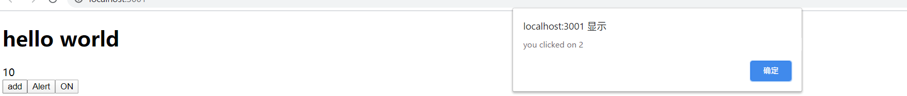

<!-- START doctoc generated TOC please keep comment here to allow auto update -->
<!-- DON'T EDIT THIS SECTION, INSTEAD RE-RUN doctoc TO UPDATE -->
**Table of Contents**  *generated with [DocToc](https://github.com/thlorenz/doctoc)*

- [1. 什么是Hook？](#1-%E4%BB%80%E4%B9%88%E6%98%AFhook)
- [2. 参考资料](#2-%E5%8F%82%E8%80%83%E8%B5%84%E6%96%99)
- [3. 类组件的缺点](#3-%E7%B1%BB%E7%BB%84%E4%BB%B6%E7%9A%84%E7%BC%BA%E7%82%B9)
- [4. Hooks优势](#4-hooks%E4%BC%98%E5%8A%BF)
- [5. Hook规则](#5-hook%E8%A7%84%E5%88%99)
- [6. useState](#6-usestate)
- [7. useEffect](#7-useeffect)
- [8. 自定义hooks](#8-%E8%87%AA%E5%AE%9A%E4%B9%89hooks)
- [9. useRef](#9-useref)
- [10. useContext](#10-usecontext)

<!-- END doctoc generated TOC please keep comment here to allow auto update -->

### 1. 什么是Hook？

1. 引用自官网：
   > Hooks let you use state and other React features without writing a class.

### 2. 参考资料

1. [react hooks 使用](https://segmentfault.com/a/1190000019513907)

2. [React Hooks完全上手指南](https://zhuanlan.zhihu.com/p/92211533)

3. [React Hooks 深入不浅出](https://segmentfault.com/a/1190000017182184)

4. [React Hooks](https://www.jianshu.com/p/76901410645a)

5. 介绍了很多有用的第三方hooks：[useHooks](https://usehooks.com/)

6. 中文文档：[Hook API 索引](https://react.docschina.org/docs/hooks-reference.html)

7. 英文文档：[Hooks API Reference](https://reactjs.org/docs/hooks-reference.html)

8. [React进阶 会使用Hook吗？](https://segmentfault.com/a/1190000020288052)
 

### 3. 类组件的缺点

1. 状态逻辑复用难
   - 缺少复用机制
   - 渲染属性和高阶组件导致层级冗余

2. 趋向复杂难以维护
   - 生命周期函数混杂不相干
   - 相干逻辑分散在不同的生命周期
3. this 指向困扰
   - 内联函数过度创建新句柄
   - 类成员函数不能保证 this
  
### 4. Hooks优势

1. 优化类组件的三大问题
   - 函数组件无 this 问题
   - 自定义 Hooks 方便复用状态逻辑
   - 副作用的关注点分离
  
### 5. Hook规则

1. 只在最顶层调用 hook 函数，不能在 for、if、 try 等内部使用。
   - 我们可以在组件中定义多个 hook，那么 React 怎么知道我们调用的是哪个 hook 呢，答案是 React 是根据调用 hook 的顺序来判断我们调用的是哪个 hook。
   - 看一下官网给的示例：
     ```jsx
        function Form() {
            // 1. Use the name state variable
            const [name, setName] = useState('Mary');

            // 2. Use an effect for persisting the form
            useEffect(function persistForm() {
              localStorage.setItem('formData', name);
            });

            // 3. Use the surname state variable
            const [surname, setSurname] = useState('Poppins');

            // 4. Use an effect for updating the title
            useEffect(function updateTitle() {
              document.title = name + ' ' + surname;
            });

            // ...
        }
     ```
     调用：
     ```jsx
        // ------------
        // 首次渲染
        // ------------
        useState('Mary')           // 1. 使用 'Mary' 初始化变量名为 name 的 state
        useEffect(persistForm)     // 2. 添加 effect 以保存 form 操作
        useState('Poppins')        // 3. 使用 'Poppins' 初始化变量名为 surname 的 state
        useEffect(updateTitle)     // 4. 添加 effect 以更新标题

        // -------------
        // 二次渲染
        // -------------
        useState('Mary')           // 1. 读取变量名为 name 的 state（参数被忽略）
        useEffect(persistForm)     // 2. 替换保存 form 的 effect
        useState('Poppins')        // 3. 读取变量名为 surname 的 state（参数被忽略）
        useEffect(updateTitle)     // 4. 替换更新标题的 effect

        // ...
     ```
     调用 hook 函数的顺序与定义 hook 函数的顺序一致。这样 React 就能正确地将内部 state 和对应的 Hook 进行关联。
     但是，如果我们在 if 中调用 hook。如下所示：
     ```jsx
          // 🔴 在条件语句中使用 Hook 违反第一条规则
        if (name !== '') {
            useEffect(function persistForm() {
                localStorage.setItem('formData', name);
            });
        }
     ```
     在第一次渲染中 name !== '' 这个条件值为 true，所以我们会执行这个 Hook。但是下一次渲染时我们可能清空了表单，表达式值变为 false。此时的渲染会跳过该 Hook，Hook 的调用顺序发生了改变：
     ```jsx
        useState('Mary')           // 1. 读取变量名为 name 的 state（参数被忽略）
        // useEffect(persistForm)  // 🔴 此 Hook 被忽略！
        useState('Poppins')        // 🔴 2 （之前为 3）。读取变量名为 surname 的 state 失败
        useEffect(updateTitle)     // 🔴 3 （之前为 4）。替换更新标题的 effect 失败
     ```
     React 不知道第二个 useState 的 Hook 应该返回什么。React 会以为在该组件中第二个 Hook 的调用像上次的渲染一样，对应的是 persistForm 的 effect，但并非如此。从这里开始，后面的 Hook 调用都被提前执行，导致 bug 的产生。
     这就是为什么 Hook 需要在我们组件的最顶层调用。如果我们想要有条件地执行一个 effect，可以将判断放到 Hook 的内部：
     ```jsx
        useEffect(function persistForm() {
            // 👍 将条件判断放置在 effect 中
            if (name !== '') {
               localStorage.setItem('formData', name);
            }
        }); 
     ```
  
2. 只在 React 函数中调用 hook 函数，不能在普通的 JavaScript 函数中调用 hook。

### 6. useState

1. state hook 提供了一种可以在 function component 中添加状态的方式。通过 state hook，可以抽取状态逻辑，使组件变得可测试，可重用。开发者可以在不改变组件层次结构的情况下，去重用状态逻辑。更好的实现关注点分离。  

2. state hook 的主要作用就是获取需要的 state 和更新 state 的方法。

3. useState 用来替换类组件的 state。

4. 要点
   1. 在组件的最顶层按照顺序调用 useState。
   2. 不能动态调用，如在 if 语句，for 循环中等都不可使用 useState。

5. useState 可以接收一个函数，延迟初始化，也就是负责逻辑的转换，从而得到一个新的初始值。

6. 一个useState只负责一个状态。

7. 用法
   - 语法：  
     `const [state, setState] = useState(initialState);`
   - 说明：`initialState` 是当前 `state` 的初始值，也可以是一个函数，函数的返回值将作为`state` 的值，参数只会在组件的初始渲染中起作用。
   - `useState()` 返回一个数组。数组的第一个元素是当前 `state` 的值，第二个是更新`state`的方法。这里的更新`state`的方法，与类组件中 `setState()` 不同之处在于，它不会合并所有的`state`。
   - 如果想定义多个`state`，那么多次调用 `useState` 即可。
   - setState() 接收的参数，我们可以将其写成一个函数，通过函数来表达 state的变化，函数的返回值作为 setState() 的最终参数，体现了函数式编程的思想。例如：
   ```tsx
      const [count, setCount] = useState(0);
      <button onClick={() => setCount(x => x + 1)}>add</button>
   ```
8. 示例代码：
   ```tsx
      import React, {useState} from 'react';
      
      const App: React.FC = () => {
          // useState()接收一个初始值，返回值是一个数组，使用解构的方法进行接收
          // 数组的第一个值是state，第二个值是一个函数，是用来更新state，函数接收的数据类型、state的类型
          // 必须与初始值一样
          const [count, setCount] = useState(0);
          // 不必像类组件，我们可以将不同的数据状态写在不同state中
          const [on, setOn] = useState(true);
          return (
              <div className="App">
                  <h1>hello world</h1>
                  <div>{count}</div>
                  <button onClick={() => setCount(x => x + 1)}>add</button>
                  <button onClick={() => setOn(on => !on)}>
                      {on ? 'ON' : 'OFF'}
                  </button>
              </div>
          );
      }
      
      export default App;
   ```
    
### 7. useEffect

1. 数据获取，设置订阅，手动的更改 DOM，都可以称为副作用，可以将副作用分为两种，一种是需要清理的，另外一种是不需要清理的。比如网络请求，DOM 更改，日志这些副作用都不要清理。而比如定时器，事件监听，则需要清理。

2. 副作用调用时机：
   1. Mount 之后
   2. Update 之后
   3. Unmount 之前
   
3. useEffect 调用时机  
   - useEffect 在 **render** 之后调用，在不同的 **render** 时刻，就相当于使用 componentDidMount、componentDidUpdate 这些生命周期函数。  
   - useEffect 还会返回一个回调函数，这个回调函数的执行时机很重要。同 useEffect 的调用时机是挂钩的。这个回调函数在组件渲染前调用。严格来说，在前一次的渲染视图被清除之前。相当于 componentWillUnmount。

4. 用法
   - 语法  
     `useEffect(effect, deps)`
   - 说明：effect 是一个函数，每次渲染之后执行，可以在函数编写更新 DOM、添加订阅等。
   - effect 函数的返回值可以空值（void）或者是一个函数（clean-up function），如果是函数，则这个返回值函数会在组件卸载前执行(每次渲染都会执行)，需要清除上次订阅的内容可以再这里面写。
   - deps 是一个可选参数，值是一个数组，数组的元素数量可以有多个。只有数组中任何一个元素的值发生变化才会调用 useEffect()。如果只想在第一次挂载和卸载组件的时候调用，只需要传一个空数组。

5. 示例代码：
   - useEffect()的基本使用
     ```tsx
        import React, { useEffect, useState } from 'react';
              
        const MouseTracker: React.FC = () => {
            const [position, setPosition] = useState({ x: 0, y: 0 });
              
            useEffect(() => {
                console.log('add effect', position.x);
                const mouseUpdate = (e: MouseEvent) => {
                    console.log('inner');
                    setPosition(() => ({ x: e.clientX, y: e.clientY }));
                };
              
                document.addEventListener('click', mouseUpdate);
              
            // useEffect()的第一个参数的返回值可以是一个函数，这个函数会在组件卸载前执行，被称为clean-up function
            // 因此，在这个返回值函数里面，可以进行一些清除工作，如清除事件、清除定时器等
            return () => {
                console.log('remove effect', position.x);
                document.removeEventListener('click', mouseUpdate);
            };
        }, []);
        console.log('before render', position.x);
        return (
            <div>
                <p>
                   X: {position.x}, Y: {position.y}
                </p>
            </div>
        );     
     };
              
     export default MouseTracker;
     ```
   - 第二个参数的作用
     ```tsx
        // App.tsx
        const [show, setShow] = useState(true);
        
        // 如果没有第二个参数，那么组件每一次更新，都会调用
        // 此时我们加入第二个参数，值为数组，只有数组内的元素的值发生变化，才会调用这个useEffect()
        // 也就是说，只有count更新了，useEffect()才会被调用，进而更新了DOM
        useEffect(() => {
            console.log(`document title is running`);
                document.title = `点击了${count}次`;
        }, [count]);
     ```
     通过 count 来控制 useEffect() 的调用时机。

6. react 首次渲染和之后的每次渲染都会调用一遍传给 useEffect 的函数。而之前我们要用两个生命周期函数来分别表示首次渲染（componentDidMount()），和之后的更新导致的重新渲染（componentDidUpdate()）。
7. useEffect() 中定义的副作用函数的执行不会阻碍浏览器更新视图，也就是说这些函数是异步执行的，而之前的 componentDidMount() 或 componentDidUpdate() 中的代码则是同步执行的。这种安排对大多数副作用说都是合理的，但有的情况除外，比如我们有时候需要先根据 DOM 计算出某个元素的尺寸再重新渲染，这时候我们希望这次重新渲染是同步发生的，也就是说它会在浏览器真的去绘制这个页面前发生。


### 8. 自定义hooks

1. 自定义的 hooks 以 `use` 开头。

2. 两个组件中使用相同的自定义 hooks，不会共享 state 和 effect，所有的 state 和 effect 都是相互隔离的，不会相互影响。

3. 自定义 hooks 主要是用来复用组件的状态。也就是说，定义一个公共的函数组件，其他的组件可以引用这个公共组件。使用方式比较简洁。在 hooks 出现之前，我们想复用一个组件，只能通过 HOC 或者 `render props` 的方式。HOC（Higher Order Component）高阶组件，这是 React 提出的一个概念，并不是一个真正的 API。高阶组件是一个函数，接收一个组件作为参数，返回一个新的组件。HOC 难于理解，且会引入额外的嵌套结构。

4. 自定义一个hooks：
   ```tsx
      import React, { useState, useEffect } from 'react';
      
      const useMousePosition = () => {
          const [position, setPosition] = useState({ x: 0, y: 0 });
          useEffect(() => {
              console.log('add effect', position.x);
              const mouseUpdate = (e: MouseEvent) => {
                  setPosition(() => ({ x: e.clientX, y: e.clientY }));
              };
      
              document.addEventListener('mousemove', mouseUpdate);
      
              // useEffect()的第一个参数的返回值可以是一个函数，这个函数会在组件卸载前执行，被称为clean-up function
              // 因此，在这个返回值函数里面，可以进行一些清除工作，如清除事件、清除定时器等
              return () => {
                  console.log('remove effect', position.x);
                  document.removeEventListener('mousemove', mouseUpdate);
              };
          }, []);
      
          return position;
      };
      
      export default useMousePosition;
   ```

5. 使用自定义 hooks
   ```tsx
      // App.tsx
      import React, { useState, useEffect } from 'react';
      // 引入自定义hooks
      import useMousePosition from './hooks/useMousePosition';
   
      const App: React.FC = () => {
          // useState()接收一个初始值，返回值是一个数组，使用解构的方法进行接收
          // 数组的第一个值是state，第二个值是一个函数，是用来更新state，函数接收的数据类型、state的类型
          // 必须与初始值一样
          const [count, setCount] = useState(0);
          // 不必像类组件，我们可以将不同的数据状态写在不同state中
          const [on, setOn] = useState(true);
      
          const [show, setShow] = useState(true);
      
          // 使用自定义hooks
          // 自定义hooks以use开头
          const position = useMousePosition();
      
       
          return (
              <div className="App">
                  <div>
                      <h1>hello world</h1>
                      <div>{count}</div>
                      <button onClick={() => setCount(x => x + 1)}>add</button>
                      <button onClick={() => setOn(on => !on)}>
                          {on ? 'ON' : 'OFF'}
                      </button>
      
                      <p>
                          X: {position.x}, Y: {position.y}
                      </p>
                  </div>
              </div>
          );
      }
      export default App;
   ```
   
6. 使用自定义 hooks，我们就可以将一些公共逻辑放在自定义的 hooks 中，引用自定义的 hooks 就像引用函数一样，从里面拿出数据，然后进行渲染。还可以根据不同的组件向自定义 hooks 传入不同的参数，进而得到不同的数据。极大地提高了组件的灵活性和复用性。

### 9. useRef

1. 函数组件在渲染过程中，每一次的 state 和 props 都是相互独立的。示例代码：
   ```tsx  
   const App = () => {
       const [count, setCount] = useState(0);
       function handleAlertClick() {
            setTimeout(function () {
                alert('you clicked on ' + count);
            }, 3000);
       }
   
       return (
            <div>    
                <div>{count}</div>
                <button onClick={() => setCount(x => x + 1)}>add</button>
                <button onClick={handleAlertClick}>Alert</button>            
            </div>
       )
   }
   ```
   第一个 button 用于计数，第二个 button，绑定了一个点击事件，点击后，延迟3s，弹窗提示点击按钮时的 count 值。  
   我们首先点击第一个按钮，点击两次，然后点击第二个按钮，然后再点击第一个按钮，点击多次，比如说到 `10，3s` 后，弹窗出现，显示的 count 时点击第二个按钮时的2次。由此，可以看出，`handleAlertClick()` 处理函数保留了点击时刻的 count 值，并形成了一个闭包。图示：
   
    
    
   从这个例子中可以看出，组件在每一次渲染过程中的 state 和 props 都是独立的。

2. `useRef()` 主要是可以在渲染过程中保持状态。也就是说，始终保持着同一个引用。

3. 用法
   - 语法  
     `const refContainer = useRef(initialValue);`
   - `initialValue` 表示初始值，类型可以时字符串，数字等。useRef()的返回值是一个可变（mutable）的 `ref` 对象，其中的`current` 属性被初始化为传入的参数（initialValue）。返回的 `ref` 对象在组件的整个生命周期内保持不变。
   - 我们可以使用 useRef() 来获取一个 DOM 节点。示例代码如下：
     ```tsx
        useEffect(() => {
            console.log('inputRef', inputRef);
            if (inputRef && inputRef.current) {
                // 真正保存input元素的还是current属性
                inputRef.current.focus();
            }
        });
        // useRef()可以用来获取真实的DOM节点，从而能够对节点进行操作
        const inputRef = useRef<HTMLInputElement>(null);
        
        return (
         <React.Fragment>
            {/*
               获取input元素的ref属性，并将其赋给inputRef，这样inputRef时对input元素的引用，进而可以对其进行DOM操作
               真正保存input元素的还是current属性
            */}
            <input type="text" ref={inputRef} />
         </React.Fragment> 
        )
     ```
     `inputRef` 中的 `current` 属性指向了 `input` 元素，并且在整个组件的生命周期内，无论该节点如何改变，`React` 都会将 `inputRef` 对象的`current` 属性设置为相应的 input 元素。
     
4. useRef() 比 `ref` 属性更有用。它可以很方便地保存任何可变值，其类似于在 `class` 中使用实例字段的方式。 
 
5. 这是因为它创建的是一个普通 `Javascript` 对象。而 useRef() 和自建一个 `{current: ...}` 对象的唯一区别是，`useRef()` 会在每次渲染时返回同一个 `ref` 对象。
   
6. **注意**：当 `ref` 对象内容发生变化时，`useRef()` 并不会通知你。current 属性值的更新不会引发组件重新渲染。

7. 以上内容来自React中文文档：[useRef](https://react.docschina.org/docs/hooks-reference.html#useref)

### 10. useContext

1. 这个 hooks 用来简化 Context 的使用。

2. React 组件之间传递数据，传统方式只能是单向单层传递，不能跨组件传递。为了解决这个问题，React 提供了 Context，使得跨组件传递数据成为可能。

3. Context 有两个核心的组件：Provider 和 Consumer。这两个组件通过 `React.createContext()` 生成。

4. `createContext()` 接收一个初始值，返回值是一个对象，这个对象包含了两个属性：Provider 和 Consumer，也就是上面所说的核心组件。可以使用解构的方式进行接收。示例代码如下：
   ```tsx
      const {Provider, Consumer} = React.createContext(initialValue);
   ```
5. Provider 组件时数据的提供者，通过 `value` 属性接收存储的公共状态，来传递给子组件或后代组件。示例：
   ```tsx
      <Provider value={val}>
           <childComponent />
      </Provider> 
   ```
   Provider 组件一般用在需要向子组件或者后代组件传递数据的地方。可以放在根组件中。要传递的数值放在 `value` 属性中。

6. Consumer 组件是数据的消费者，通过订阅 Provider 传入的 context 的值，来实时更新当前组件的状态。示例：
   ```tsx
      <Consumer>
           {
               value => (
                   <h1>Consumer: {value}</h1>
               )
           }
      </Consumer>
   ```
   Consumer 组件中不能直接渲染一个组件，而是要声明一个函数，函数接收的参数就是 context 值，函数的返回值就是我们需要渲染的组件。
   
7. 下面的代码完整的展示了 Context 的用法：
   ```tsx
      // hello.tsx
      import React from 'react';
   
      import Middle from './middle';
      export const { Provider, Consumer } = React.createContext(0);
      
      const Hello: React.FC = () => {
          return (
              <React.Fragment>
                  <Provider value={60}>
                      <Middle />
                  </Provider>
              </React.Fragment>
          );
      };  
      export default Hello;
   
      // middle.tsx
      import React from 'react'; 
      import Leaf from './leaf';
      
      const Middle: React.FC = () => {
          return (
              <React.Fragment>
                  <Leaf />
              </React.Fragment>
          );
      };  
      export default Middle;
   
      // leaf.tsx
      import React from 'react'; 
      import { Consumer } from './hello';
      
      const Leaf: React.FC = () => {
          return (
              <React.Fragment>
                  <Consumer>
                       {
                           value => <h1>battery: {value}</h1>
                       }
                  </Consumer>
              </React.Fragment>
          );
      };   
      export default Leaf;
   ```
   渲染结果：  
   
     
   Context 确实实现了跨级通信。Provider 组件的 value 属性，接收公共的数据。在需要接收数据的后代组件处，引入 Consumer 组件。在 Consumer 组件内，使用函数生成一个真正被渲染的组件。
8. Context 参考资料：
   - [React系列——React Context](https://segmentfault.com/a/1190000017758300)
   - [React的Context的使用方法简介](https://www.cnblogs.com/littleSpill/p/11221538.html)
   
8. 从上面的 Context 的用法可以看出，后代组件想使用 Consumer 组件比较麻烦。使用 `useContext()` 可以简化这一步。

9. 用法
   - 语法  
     `const value = useContext(MyContext);`
   - 说明：`MyContext`是 Context 对象，也就是直接由 `React.createContext()` 生成的那个对象。value是当前 Context 的值。**注意**：当前的 Context 值由上层组件中距离当前组件最近的 `<MyContext.Provider>` 的 `value` 决定。
   - 当组件上层最近的 `<MyContext.Provider>` 更新时，该 Hook 会触发重渲染，并使用最新传递给 `<MyContext.Provider>` 的value的值。

10. **注意**：useContext() 接收的一定是 Context 对象，也就是直接由 `React.createContext()` 生成的那个对象。不是 Provider 也不是 Consumer。

11. `useContext(MyContext)` 只是让我们能获取 Context 的值以及订阅  Context 的变化。我们仍然需要在上层组件树中使用 `<MyContext.Provider>` 来为下层组件提供 Context。

12. 下面的代码展示了 `useContext()` 的用法：
    ```tsx
       // App.tsx
       import React from 'react';
       import Hello from './components/hello';
    
       interface IThemeProps {
           [key: string]: { color: string; background: string };
       }
       
       const themes: IThemeProps = {
           light: {
               color: '#000',
               background: '#eee',
           },
           dark: {
               color: '#fff',
               background: '#222',
           },
       };
       
       // 创建一个context，并传入初始值
       export const themeContext = React.createContext(themes.light);
       const App: React.FC = () => {
           return (
               <themeContext.Provider value={themes.dark}>
                   <div className="App">
                       <Hello />
                   </div>
               </themeContext.Provider>
               );
       }
    
       // hello.tsx
       import React, { useContext } from 'react';
       // 从App组件中引入Context对象
       import { themeContext } from '../App';    
    
       const Hello: React.FC = () => {
           // useContext()接收一个Context对象作为参数
           // useContext()返回的是Context的值，也就是Provider组件的value的值
           const theme = useContext(themeContext);
           const style = {
               color: theme.color,
               background: theme.background,
           };
           return (
               <React.Fragment>
                   <h2 style={style}>Hello World</h2>
               </React.Fragment>
           );
       };
       export default Hello;
    ```
    需要使用哪个组件中的 Context 对象，我们就从哪个组件中导入这个 Context 对象，然后作为参数传入 `useContext()` 中。