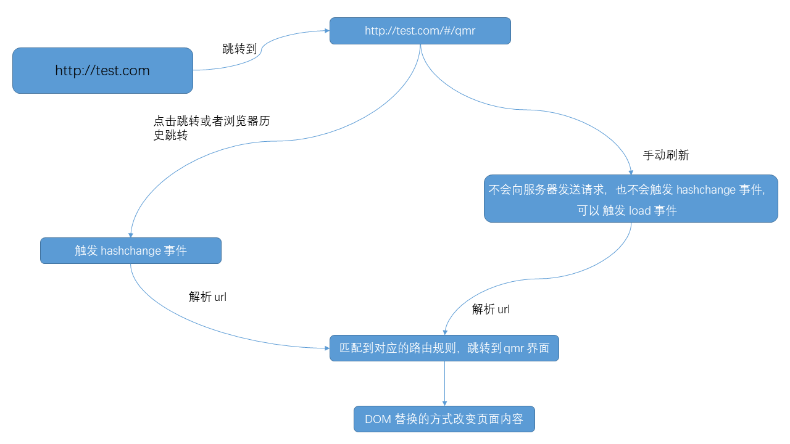
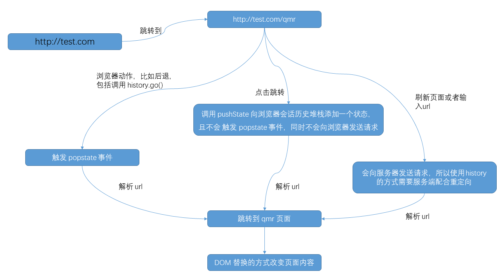

<!-- START doctoc generated TOC please keep comment here to allow auto update -->
<!-- DON'T EDIT THIS SECTION, INSTEAD RE-RUN doctoc TO UPDATE -->
**Table of Contents**  *generated with [DocToc](https://github.com/thlorenz/doctoc)*

- [React-Router 实现原理](#react-router-%E5%AE%9E%E7%8E%B0%E5%8E%9F%E7%90%86)
  - [1. 参考资料](#1-%E5%8F%82%E8%80%83%E8%B5%84%E6%96%99)
  - [2. React-Router 的两种路由模式](#2-react-router-%E7%9A%84%E4%B8%A4%E7%A7%8D%E8%B7%AF%E7%94%B1%E6%A8%A1%E5%BC%8F)
    - [1. HashRouter](#1-hashrouter)
    - [2. BrowserRouter](#2-browserrouter)
    - [3. 参考资料](#3-%E5%8F%82%E8%80%83%E8%B5%84%E6%96%99)
  - [3. 路由组件的实现原理](#3-%E8%B7%AF%E7%94%B1%E7%BB%84%E4%BB%B6%E7%9A%84%E5%AE%9E%E7%8E%B0%E5%8E%9F%E7%90%86)
    - [1. 原生 js 实现](#1-%E5%8E%9F%E7%94%9F-js-%E5%AE%9E%E7%8E%B0)
    - [2. React 组件化方式实现](#2-react-%E7%BB%84%E4%BB%B6%E5%8C%96%E6%96%B9%E5%BC%8F%E5%AE%9E%E7%8E%B0)

<!-- END doctoc generated TOC please keep comment here to allow auto update -->

# React-Router 实现原理

## 1. 参考资料

1. [前端路由和react-router实现原理详解](https://juejin.cn/post/6844904094772002823)

2. [你需要了解的React Router(hash模式）实现原理](https://juejin.cn/post/6844904174774124557)

3. [聊聊 React Router v4 的设计思想](https://juejin.cn/post/6844903490016247822)

4. [react-router 路由的实现原理](https://www.jianshu.com/p/77827bfa61ef)

5. [react-router-dom下的BrowserRouter和HashRouter](https://www.cnblogs.com/soyxiaobi/p/11096940.html)

6. [react 精华之react-router .HashRouter 还是 BrowserRouter . 动态路由是根据变量决定这个路由是否需要进行](https://blog.csdn.net/gwdgwd123/article/details/85029121)

7. [History.pushState()](https://developer.mozilla.org/zh-CN/docs/Web/API/History/pushState)

8. [History.replaceState()](https://developer.mozilla.org/zh-CN/docs/Web/API/History/replaceState)

## 2. React-Router 的两种路由模式

### 1. HashRouter

1. HashRouter 监测的是浏览器地址栏的 url 中的 hash 部分，当 hash 值发生变化时，根据当前的 hash 值切换具体的路由组件。当 hash 值变化时，浏览器不会向后端发送请求。

2. 由于 HashRouter 会在路径上添加 `/#/`，而 `/#/` 后面的所有都不会发送到服务器端，即对于服务器而言，路径依旧是 `localhost:8080`，路由切换在前端完成。

3. 使用 hash 的路由模式：
   

### 2. BrowserRouter

1. BrowserRouter 监测的是浏览器地址栏的 url 中的 path 部分，根据具体的 path 来进行路由组件的切换。当地址栏的 path 发生变化时，浏览器会向服务器发送请求。

2. 使用 BrowserRouter 需要再加一层服务器配置(node/nginx)，让前端发送的请求映射到对应的 html 文件上。

3. 使用 history 的路由模式：
   
### 3. 参考资料

1. [深入了解 React Router 原理](https://www.jianshu.com/p/53dc287a8020)

## 3. 路由组件的实现原理

### 1. 原生 js 实现

1. HashRouter
   - 基本思想：
     - 当浏览器地址栏中的 url 中的 hash 部分发生变化的时候，会 触发 hashchange 事件
     - 通过 window.location.hash 获取 url 中的 hash 部分，根据这个 hash 决定渲染什么内容。
   - html 结构：
     ```html
        <ul class="hash-router">
            <li>
                <a href="#/home">home</a>
            </li>
            <li>
                <a href="#/about">about</a>
            </li>
            <div id="hash-router-view"></div>
        </ul>
     ```
   - js 代码：
      ```js
         window.addEventListener('DOMContentLoaded', loaded);
         window.addEventListener('hashchage', changeView);
         let hashRouterView;
         
         function loaded() {
             hashRouterView = document.querySelector('#hash-router-view');
             changeHashView();
         }
         
         function changeView() {
             const {location} = window;
             switch(location.hash) {
                 case '#/home':
                     hashRouterView.innerHTML = 'home';
                     break;
                 case '#/about':
                     hashRouterView.innerHTML = 'about';
                     break;
             }
                 
         }
      ```
    
2. BrowserRouter
   - 基本思想：
     - 每当处于激活状态的历史记录条目发生变化时，popstate 事件就会在对应 window 对象上触发。通俗讲，浏览器地址栏的 url 中的 path 发生变化，就会触发 popstate 事件，而 a 标签的锚点也会触发。
     - history 提供的新的 api —— pushState() 和 replaceState()，可以更改浏览器历史会话堆栈的条目信息，同时不会触发 popstate 事件，也不会刷新浏览器。
   - html 结构：
     ```html
        <ul class="browser-router">
            <li>
                <a href="#/home">home</a>
            </li>
            <li>
                <a href="#/about">about</a>
            </li>
            <div id="browser-router-view"></div>
        </ul>
     ```
   - js 代码：
     ```js
        window.addEventListener('DOMContentLoaded', loaded);
        window.addEventListener('popstate', changeView);
        let hashRouterView, browserRouterView;
        function loaded() {
            browserRouterView = document.querySelector('#browser-router-view');
            const ul = document.querySelector('#browser-router-view');
            ul.addEventListener('click', function() {
                if (e.target.nodeName === 'A') {
                    e.target.preventDefault();
                    window.history.pushState(null, '', e.target.getAttribute('href'));
                    changeView();
                }
            })
        }
        function changeView() {
             const {location} = window;
             switch(location.hash) {
                 case '#/home':
                     browserRouterView.innerHTML = 'home';
                     break;
                 case '#/about':
                     browserRouterView.innerHTML = 'about';
                     break;
             }
                 
         }
     ```


### 2. React 组件化方式实现

1. 预备知识
   - hashchange 当 url 的片段标识符更改时，将触发 hashchange事件 (跟在 `#` 符号后面的 url 部分，包括 `#` 符号)。url 中的 hash 部分发生变化触发。
   - window.location.hash 获得 url 中的 hash 部分
   - popstate 当活动历史记录条目更改时，将触发 popstate 事件。如果被激活的历史记录条目是通过对 history.pushState() 的调用创建的，或者受到对 history.replaceState() 的调用的影响，popstate 事件的 state 属性包含历史条目的状态对象的副本。
     需要注意的是调用 history.pushState() 或 history.replaceState() 不会触发 popstate 事件。只有在做出浏览器 动作时，才会触发该事件，如用户点击浏览器的回退按钮（或者在Javascript 代码中调用 history.back() 或者 history.forward() 方法）。a 标签的锚点也会触发这个事件。
   - window.location.pathname 获得浏览器地址栏的 path 部分
   - pushState
     - `history.pushState(state, title[, url])`
     - state
       状态对象是一个 JavaScript 对象，它与 pushState() 创建的新历史记录条目相关联。每当用户导航到新状态时，都会触发popstate 事件，并且该事件的状态属性包含历史记录条目的状态对象的副本。
     - title
       当前大多数浏览器都忽略此参数，尽管将来可能会使用它。在此处传递空字符串应该可以防止将来对方法的更改。或者您可以为要移动的状态传递简短的标题。
     - url 可选
       新历史记录条目的 url 由此参数指定。 请注意，浏览器不会在调用 pushState() 之后尝试加载此 url，但可能会稍后尝试加载 url，例如在用户重新启动浏览器之后。 新的 url 不必是绝对的。 如果是相对的，则相对于当前 url 进行解析。 新网址必须与当前网址相同的 origin。否则，pushState() 将引发异常。 如果未指定此参数，则将其设置为文档的当前 url。 
   - replaceState
     - `history.replaceState(stateObj, title[, url]);`
     - stateObj
       状态对象是一个JavaScript对象，它与传递给 replaceState 方法的历史记录实体相关联.
     - title
       大部分浏览器忽略这个参数, 将来可能有用. 在此处传递空字符串应该可以防止将来对方法的更改。或者，您可以为该状态传递简短标题
     - url 可选
       历史记录实体的 URL. 新的 URL 跟当前的 URL 必须是同源; 否则 replaceState 抛出一个异常. 
   - 浏览器的会话历史是一个堆栈，因此 pushState 是一个入栈操作，而 replaceState 是替换栈顶的项目。

2. BrowserRouter
   - BrowserRouter 组件
   - BrowserRouter 的作用是 监听 popstate 事件，获得当前地址栏的 url 中的 pathname，然后向后代组件去传递这个 pathname。
   - 这里涉及到跨组件通信，使用 Context 实现。
   - 代码：
     ```jsx
        import React, {FC, Fragment, useState, useEffect, createContext} from 'react';

        export const {Provider, Consumer} = createContext({});
        const BrowserRouter = (props) => {

        const {children} = props;

        // 获得当前地址栏中 url 的 path
        const [pathname, setPathname] = useState(window.    location.pathname);

        useEffect(() => {
            window.addEventListener('popstate', handleViewChange);

            return () => {
                window.removeEventListener('popstate', handleViewChange);
            }
        }, []);

    
        const handleViewChange = () => {
            const path = getParams(window.location.pathname);
            setPathname(path);
        }

        const getParams = (url) => {
            return url;
        }

        return (
            <Provider value={{pathname, handleViewChange}}>
                <div>
                    {
                        React.Children.map(children, function (child) {
                            return child;
                        })
                    }
                </div>
            </Provider>
        )

     }
     ```
   - Route 组件
   - Route 组件有两个属性，path 属性指的是当前路由组件对应的路径，而 component 属性则是要渲染的组件。
   - Route 组件接收到 BrowserRouter 传递过来的 pathname，然后与当前 Route 组件的 path 进行比较，如果匹配，则渲染 component 属性指定的组件。
   - 为了提高匹配的准确度，我们使用 path-to-regexp 这个模块进行路径匹配。
   - 代码：
     ```jsx
        import React, {FC, Fragment} from 'react';

        import {Consumer} from './browser-router';

        import {pathToRegexp} from 'path-to-regexp';

        const Route = (props) => {
            let {path, component:Component} = props;
            return (
                <Consumer>
                    {
                        pathState => {
                            const {pathname} = pathState;
                            // 使用 pathToRegexp 函数，将 path 转换为 正则
                            const reg = pathToRegexp(path, [], {end: false});
                    // 使用正则表达式来匹配当前地址栏的 pathname
                            if (pathname.match(reg)) {
                                return <Component />
                            }

                            return null;
                        }
                    }
                </Consumer>
            )

        }

        export default Route;
     ```
    
   - Link 组件
   - Link 组件的作用是导航。即改变地址中的url。
   - Link组件的主要属性是 to，即目标路径。
   - 拿到 to 属性指定的路径后，通过 pushState() 改变路由状态，然后主动刷新界面。
   - 刷新页面的过程是：pushState() 改变了路由状态，调用 BrowserRouter 传来的方法，该方法的作用是：获取最新的 pathname，从而更新 BrowserRouter 的状态。
   - 代码：
     ```jsx
        import React, {FC, Fragment} from 'react';
        import {Consumer} from './browser-router';

        const Link = (props) => {
            const {to, children} = props;

            const handleClick = (e) => {
                // 阻止 a 标签的点击的默认事件 —— 打开 href 属性里面的链接
                e.preventDefault();

                // 调用 pushState()，向历史记录栈中压入一条记录，同时浏览器地址栏也会发生变化，但是这个方法不会引起浏览器刷新
                window.history.pushState(null, '', to);
            }
            return (
                <Consumer>
                    {
                        (pathState) => {
                            const {handleViewChange} = pathState;
                            return (
                                <a
                                    href=""
                                    onClick={(e) => {
                                        handleClick(e);
                                        handleViewChange();
                                    }}
                                 >
                                  {
                                     children
                                   }
                                 </a>
                            )
                        }
                    }

                </Consumer>
            )

        }

        export default Link;
     ```

3. HashRouter
   - HashRouter 组件
   - HashRouter 组件的主要作用是监听 hashchange 事件，获得地址栏中最新的 hash，然后传递个子组件。
   - 使用 Context 完成夸组件通信。
   - Route 组件
   - 与前面的 Route 组件功能类似。 
   - Link 组件
   - 与前面的 Link 组件功能类似，区别就是不需要关注 a 标签的点击事件了。将 to 属性直接写入 a 标签的 href 属性中。
   - 将三个组件的代码：
     ```jsx
        import React, {FC, Fragment, useState, useEffect, createContext} from 'react';
        import {pathToRegexp} from 'path-to-regexp'
        const {Provider, Consumer} = createContext({});

        const HashRouter = (props) => {

            const {children} = props;

            const getHash = () => {
                return window.location.hash.slice(1);
            }

            const [hash, setHash] = useState(getHash());

            useEffect(() => {
                window.addEventListener('hashchange',     handleViewChange);
                return () => {
                    window.removeEventListener('hashchange');
                }
            }, []);

            const handleViewChange = () => {
                const hash = getHash();

                setHash(hash);
            }
            return (
                <Provider value={{hash}}>
                    <div>
                        {
                            React.Children.map(children, function (child) {
                            return child;
                            })
                        }

                    </div>
                </Provider>
            )

         };

         export const Route = (props) => {
             const {path, component: Component} = props;
             return (
                 <Consumer>
                     {
                         (pathState) => {
                             const {hash} = pathState;
                             const reg = pathToRegexp(path, [], {end: false});
                             if (hash.match(reg)) {
                                 return <Component />
                             }

                             return null;
                         }
                     }
                 </Consumer>
             )
         }

         export const Link = (props) => {
             const {to, children} = props;

             return <Consumer>
                 {
                     (pathState) => {
                         return <a href={`#${to}`}>{children}</a>
                     }
                 }
             </Consumer>
         }

        export default HashRouter;
     ```
