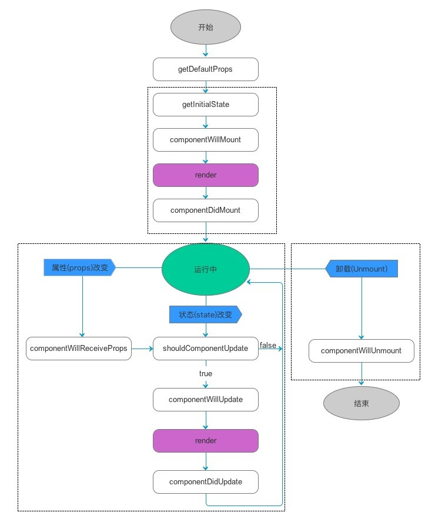
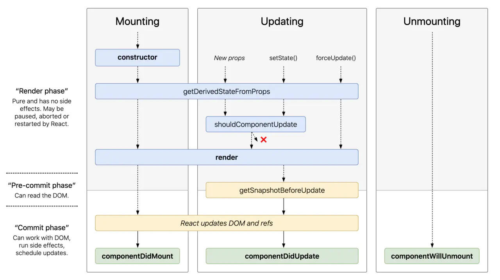

<!-- START doctoc generated TOC please keep comment here to allow auto update -->
<!-- DON'T EDIT THIS SECTION, INSTEAD RE-RUN doctoc TO UPDATE -->
**Table of Contents**  *generated with [DocToc](https://github.com/thlorenz/doctoc)*

- [React 相关知识总结](#react-%E7%9B%B8%E5%85%B3%E7%9F%A5%E8%AF%86%E6%80%BB%E7%BB%93)
  - [1. 生命周期](#1-%E7%94%9F%E5%91%BD%E5%91%A8%E6%9C%9F)
    - [1. 参考资料](#1-%E5%8F%82%E8%80%83%E8%B5%84%E6%96%99)
    - [2. 旧版生命周期](#2-%E6%97%A7%E7%89%88%E7%94%9F%E5%91%BD%E5%91%A8%E6%9C%9F)
    - [3. 新版生命周期](#3-%E6%96%B0%E7%89%88%E7%94%9F%E5%91%BD%E5%91%A8%E6%9C%9F)
  - [2. setState](#2-setstate)
    - [1. 参考资料](#1-%E5%8F%82%E8%80%83%E8%B5%84%E6%96%99-1)
    - [2. setState 执行时机](#2-setstate-%E6%89%A7%E8%A1%8C%E6%97%B6%E6%9C%BA)
    - [3. setState 参数说明](#3-setstate-%E5%8F%82%E6%95%B0%E8%AF%B4%E6%98%8E)
    - [4. setState 的推荐使用方式](#4-setstate-%E7%9A%84%E6%8E%A8%E8%8D%90%E4%BD%BF%E7%94%A8%E6%96%B9%E5%BC%8F)
    - [5. 生命周期函数与 setState](#5-%E7%94%9F%E5%91%BD%E5%91%A8%E6%9C%9F%E5%87%BD%E6%95%B0%E4%B8%8E-setstate)
  - [3. 类组件与函数组件](#3-%E7%B1%BB%E7%BB%84%E4%BB%B6%E4%B8%8E%E5%87%BD%E6%95%B0%E7%BB%84%E4%BB%B6)
  - [4. 组件数据传递方式](#4-%E7%BB%84%E4%BB%B6%E6%95%B0%E6%8D%AE%E4%BC%A0%E9%80%92%E6%96%B9%E5%BC%8F)
    - [1. 通过 props 传递](#1-%E9%80%9A%E8%BF%87-props-%E4%BC%A0%E9%80%92)

<!-- END doctoc generated TOC please keep comment here to allow auto update -->

# React 相关知识总结


## 1. 生命周期

### 1. 参考资料

1. [React生命周期及setState原理分析](https://www.jianshu.com/p/e09cbecca1d1)
2. [你真的了解 React 生命周期吗](https://juejin.cn/post/68449040212332380241)
3. [我对 React V16.4 生命周期的理解](https://juejin.cn/post/6844904199923187725)
4. [React v16.3之后的组件生命周期函数](https://zhuanlan.zhihu.com/p/38030418)
5. [React新生命周期--getDerivedStateFromProps](https://www.jianshu.com/p/50fe3fb9f7c3)

### 2. 旧版生命周期

1. React 的组件在渲染过程中可以分为以下三个阶段：
   - 加载（mount）
   - 更新（update）
   - 卸载（unmount）

2. 相应的，组件的生命周期也可以分为三个阶段：
   - 加载（mount）
   - 更新（update）
   - 卸载（unmount）

3. 在 16.3 版本之前的生命周期函数如下图所示：
   

4. 初始化加载阶段
   1. `getDefaultProps()`
      设置默认的 `props`，也可以用 `defaultProps` 设置组件的默认属性，得到的是`component.defaultProps` 中设置的值。
   2. `getInitialState()`（`constructor()`）
      在使用 es6 的 class 语法时是没有这个钩子函数的，可以直接在 constructor 中定义 this.state。或者直接在组件中设置 state。此时可以访问 this.props。
   3. `componentWillMount()`
      组件初始化时只调用，以后组件更新不调用，整个生命周期只调用一次，此时可以修改 state。
   4. `render()`
      最重要的步骤，创建虚拟 DOM，进行 diff 算法，更新 DOM 都在此进行，此时不能修改 state。
   5. `componentDidMount()`
      组件渲染完成后调用，只调用一次。

5. 更新阶段
   1. `componentWillReceiveProps(nextProps)`
      组件初始化时不调用，组件接收新的 props 时调用。
   2. `shouldComponentUpdate(nextProps, nextState)`
      react性能优化非常重要的一环。组件接受新的 state 或者 props 时调用，我们可以设置在此对比前后两个 props 和 state 是否相同，如果相同则返回 false 阻止更新，因为相同的属性状态一定会生成相同的 dom 树，这样就不需要创造新的 dom 树和旧的 dom 树进行diff算法对比，节省大量性能，尤其是在 dom 结构复杂的时候。
   3. `componentWillUpdate(nextProps, nextState)`
      组件初始化时不调用，只有在组件将要更新时才调用，此时不可以修改state。也不可以做别的事。
   4. `render()`
      组件渲染。
   5. `componentDidUpdate(prevProps, prevState, snapshot)`
      组件初始化时不调用，组件更新完成后调用，此时可以获取dom节点。

6. 卸载阶段
   1. `componentWillUnmount()`
      组件将要卸载时调用，一些事件监听和定时器需要在此清除。

7. 组件通过其定义的几个函数来控制组件在生命周期的各个阶段的行为。

8. 在生命周期中的关键函数：

   1. `constructor(props, context)`
      构造函数，在创建组件的时候调用一次。

   2. `void componentWillMount()`
       在组件挂载之前调用一次。如果在这个函数里面调用 setState，本次的 render 函数可以看到更新后的 state，并且只渲染一次。
   3. `void componentDidMount()`
       在组件挂载之后调用一次。这个时候，子组件也都挂载好了，可以在这里使用 refs。
       
   4. `void componentWillReceiveProps(nextProps)`
       props 是父组件传递给子组件的。父组件发生 render 的时候子组件就会调用 componentWillReceiveProps()（不管 props 有没有更新，也不管父子组件之间有没有数据交换）。

   5. `bool shouldComponentUpdate(nextProps, nextState)`
       组件挂载之后，每次调用 setState 后都会调用 shouldComponentUpdate 判断是否需要重新渲染组件。默认返回 true，需要重新 render。在比较复杂的应用里，有一些数据的改变并不影响界面展示，可以在这里做判断，优化渲染效率。

   6. `void componentWillUpdate(nextProps, nextState)`
       shouldComponentUpdate 返回 true 或者调用 forceUpdate 之后，componentWillUpdate 会被调用。
   
   7. `void componentDidUpdate(prevProps, prevState, snapshot)`
       除了首次render之后调用componentDidMount，其它render结束之后都是调用componentDidUpdate。
      `componentWillMount`、`componentDidMount` 和 `componentWillUpdate`、`componentDidUpdate` 可以对应起来。区别在于，前者在只有组件装载的时候才会被调用，而后者是每次更新的时候就会被调用。 

   8. `ReactElement render()`
       render 是一个 React 组件所必不可少的核心函数（上面的其它函数都不是必须的）。记住，不要在 render 里面修改 state。

   9. `void componentWillUnmount()`
       组件被卸载的时候调用。一般在 componentDidMount 里面注册的事件需要在这里删除。

9. 触发更新的几种方式（**注：假设 shouldComponentUpdate 都是按照默认返回true的方式**）：
   1. 初始化阶段
   2. 调用 this.setState() （并不是调用一次 setState 会触发一次 render，React 可能会合并操作，再批量进行 render）
   3. 父组件发生更新 （一般就是 props 发生改变，但是就算 props 没有改变或者父子组件之间没有数据交换也会触发 render）
   4. 调用 this.forceUpdate()

10. 触发更新的图示：
    

11. **生命周期函数调用 setState() 的情况**  
    - 无意义使用：`componentWillMount`，`componentWillUnmount`
      在 `componentWillMount` 中使用，会将 setState() 设置的 state 与初始设置的 state 合并。不会引起 render。`componentWillUnmount` 是组件即将要卸载，因此在这里改变 state 也没有意义。
    - 有条件使用：`componentDidUpdate`
    - 禁止使用：`componentWillUpdate`，`shouldComponentUpdate`
      在这两个生命周期函数中使用 setState()，会引起循环渲染，因此不能在这两个生命周期函数中触发 setState()。
    - 正常使用：`componentWIllReceiveProps`，`componentDidMount`

### 3. 新版生命周期

1. 在 16.3 以及后面的版本中，React 引入了新的生命周期函数，同时还废弃了三个生命周期函数。

2. 变化的原因是 React 引入了 Fiber 机制，渲染由同步过程变为了异步过程。在同步渲染过程中，每个生命周期只调用一次，而引入了 Fiber 机制以后，由于是异步渲染过程，有一些生命周期函数可能会被调用多次，比如在 `componentWillMount()` 发送 ajax 请求，异步渲染过程导致 `componentWillMount()` 可能被调用多次，这会导致发送多次 ajax 请求。这肯定不是我们希望的。

3. 废弃的生命周期函数：
   - `componentWillMount()`
   - `componentWillReceiveProps`
   - `componentWillUpdate`

4. 在 16.3 版本中，给这三个生命周期函数加上了 `UNSAFE_` 的前缀，如下：
   - `UNSAFE_componentWillMount`
   - `UNSAFE_componentWillUpdate`
   - `UNSAFE_componentWillReceiveProps`

5. 在 17 版本中，会移除这三个生命周期函数。

6. 仔细观察这三个生命周期函数，发现都是带 will 的，表示这是在 render 前会调用。官方不推荐我们在这几个生命周期函数中进行一些操作，如发送 ajax 请求，setState 等，容易引起 bug。所以直接就废弃了。断绝了我们在这些函数进行操作地念头。

7. 引入的新的生命周期函数：
   - `getDerivedStateFromProps`
   - `getSnapshotBeforeUpdate`

8. 新的生命周期流程：
   

9. 从上面的图中可以看出，`getDerivedStateFromProps` 总是在 render 前被调用。因此之前在 `componentWillReceiveProps` 中进行的一些操作可以转移到 `getDerivedStateFromProps` 中进行。

10. `getDerivedStateFromProps` 的用法
    - `static getDerivedStateFromProps(nextProps, prevState)`
    - 这是一个静态（static）方法，因此不能使用 this。
    - 从函数名可以看出，这个函数的目的是：将 props 映射为 state。
    - 通过比较 nextProps（最新的 props）与 prevState（当前的 state），如果有变化，需要更新 state，那么就返回一个对象，这个对象里是需要更新的 state。如果 props 的变化不影响 state，那么需要返回一个 null，表示不对 state 进行任何改变。
    - 代码示例：
      ```jsx
         /**
           * 根据 props 来更新 state
           * props 更新、setState()、forceUpdate() 都会调用这个生命周期函数
           * 静态方法，纯函数，不能调用 this，只能做一些一些没有副作用的操作
           * @param nextProps 下一个 props，可以理解为最新的 props
           * @param prevState 前一个阶段的 state
           */
         static getDerivedStateFromProps(nextProps: Readonly<ITransitionProps>, prevState: Readonly<ITransitionState>) {
             console.log('getDerivedStateFromProps', nextProps, prevState);
             // 从 props 中拿到最新的 inAndOut
             const {inAndOut} = nextProps;
             // 通过 setState() 触发这个方法时，会将当前组件的 state 传入
             const {status} = prevState;
             if (inAndOut && status === UNMOUNTED) {
                 return {
                    status: EXITED
                 }
             }

             return null;

        }
      ``` 

11. `getSnapshotBeforeUpdate` 的用法
    - `getSnapshotBeforeUpdate(prevProps, prevState)`
    - getSnapshotBeforeUpdate 这个方法在 render 之后，在更新之前（如：更新 DOM 之前）被调用。给了一个机会去获取 DOM 信息，计算得到并返回一个 snapshot，这个 snapshot 会作为 componentDidUpdate 的第三个参数传入。如果你不想要返回值，请返回 null，不写的话控制台会有警告。
    - getSnapshotBeforeUpdate 通常是与 componentDidUpdate 一起配合使用。
    - 官方给了一个例子：用 getSnapshotBeforeUpdate 来处理 scroll，并且说明了通常不需要这个函数，只有在重新渲染过程中手动保留滚动位置等情况下非常有用，所以大部分开发者都用不上，也就不要乱用。言外之意就是在开发过程中**不要用。**

## 2. setState

### 1. 参考资料

1. [setState()](https://react.docschina.org/docs/react-component.html#setstate)

2. [你真的理解setState吗？](https://juejin.cn/post/6844903636749778958)

3. [【React深入】setState的执行机制](https://juejin.cn/post/6844903781813993486)

4. [react的setState到底是同步还是异步？](https://juejin.cn/post/6850418109636050958)

### 2. setState 执行时机

1. 根据调用 setState 的时机，setState 可以是异步执行，也可以是同步执行。

2. 所谓的异步，指的是如果我们多次调用 setState，React 并不会调用一次 setState，就执行一次 render，而是将多个 setState 的调用合并为一次，然后执行。这样说明，调用了 setState， state 中的数据不会立刻更新。举例如下：
   ```jsx
      class App extends React.Component {
         state = {
            num: 0
         }

         componentDidMount() {
            this.setState({
               num: this.state.num + 1
            });

            this.setState({
               num: this.state.num + 1
            });

            this.setState({
               num: this.state.num + 1
            });

            console.log('num', this.state.num);
         }


         render() {

            console.log('render-num', this.state.num);

            return (
                <h1>
                    Hello world
                </h1>
            )
         }
      }
   ```
   输出：
   ```js
      render-num 0
      num-1 0
      render-num 1
   ```
   从上面的例子中，可以看出，当我们在生命周期函数中多次调用 setState，React 使用的是批量更新方式。即将要更新的 state 放入一个队列中，在合适的时机，执行一次 setState，所以这些新的 state 会被合并然后统一更新。其效果类似于：`Object.assign({}, {num: xx}, {num: yy}, {num: zz})`，所以相同的属性会被合并，后面的属性值会覆盖前面的属性值。所以上例中，`num` 最终结果是 `1` 而不是 `3`。 

3. 合成事件：React 为了解决跨平台、兼容性问题，自己封装实现了一套事件机制，用来取代原生事件。像 onClick、onChange 等都是合成事件。

4. setState 是异步调用的情况：
   1. 在合成事件中调用 setState
   2. 在生命周期函数中调用 setState

5. setState 是同步调用的情况：
   1. setTimeout（异步调用）
   2. 原生事件（通过 addEventListener 添加的事件）

6. setState 本身是同步执行的。只不过在合成事件或者生命周期函数中调用，因为合成事件或者生命周期函数本身处于 React 更新流程中，在完成更新流程之前不会去执行 setState，state 中的值也不会同步更新，因此对外表现就是异步的。

7. setState 的批量更新优化也是建立在“异步”（合成事件、生命周期函数）之上的，在原生事件和 setTimeout 中不会批量更新，在 “异步” 中如果对同一个值进行多次 setState ， setState 的批量更新策略会对其进行覆盖，取最后一次的执行，如果是同时 setState 多个不同的值，在更新时会对其进行合并批量更新。

### 3. setState 参数说明

1. `setState(updater, [callback])`
 
2. 参数说明
   - `updater` 
     - 可以是一个对象，也可以是一个函数。如果是对象的话，里面存放的是需要更新的属性。使用对象形式更新 state 需要注意：**多次调用 setState，会进行批量更新，同时拿不到最新的 state。**
     - 如果是函数的话，形式如下：
       ```js
           (state, props) => stateChange
       ```
      `state` 是对应用变化时组件状态的引用。`props` 就是对组件的 `props` 的引用。你应该使用基于 `state` 和 `props` 构建的新对象来表示变化。函数最后必须返回一个对象，这个对象的属性就是我们要更新的属性，例如：
       ```js
          this.setState((state, props) => {
             return {
                counter: state.counter + props.counter
             }
          })
       ```
       使用回调函数的方式更新 state 更符合函数式编程的思想。同时回调函数能为我们提供可靠的 state 和 props，即自动地将我们的状态更新操作添加到队列中并等待前面的更新完毕后传入最新的状态值。
   - `callback` 可选的回调函数，这个回调函数在 setState 执行完，更新完 state 以后，重新渲染组件后执行。我们可以在这个回调函数中拿到最新的 state。React 官方建议使用 componentDidUpdate() 来获取最新的 state。
      ```js
         this.setState((state, props) => {
            return {
               counter: state.counter + props.counter
            }
         }, () => {
            console.log('counter', this.state.counter);
         })
      ```
   
### 4. setState 的推荐使用方式

1. 第一个参数设置为函数，使用函数的方式更新 state。这样做的好处有：
   - 回调中的 state 一定是最新的，这对于基于最新的 state 做一些操作非常有利。
   - 使用回调函数，可以自动地将我们的状态更新操作添加到队列中并等待前面的更新完毕后传入最新的状态值。即不会合并队列中 state 的相同的属性。

2. 如果想拿到最新的 state，可以使用第二个参数 —— 回调函数，获得最新的 state，也可以使用 componentDidUpdate() 获取最新的 state。

### 5. 生命周期函数与 setState

1. 无意义使用：`componentWillMount`，`componentWillUnmount`
   在 `componentWillMount` 中使用，会将 setState() 设置的 state 与初始设置的 state 合并。不会引起 render。`componentWillUnmount` 是组件即将要卸载，因此在这里改变 state 也没有意义。

2. 有条件使用：`componentDidUpdate`

3. 禁止使用：`componentWillUpdate`，`shouldComponentUpdate`
   在这两个生命周期函数中使用 setState()，会引起循环渲染，因此不能在这两个生命周期函数中触发 setState()。

4. 正常使用：`componentWIllReceiveProps`，`componentDidMount`

## 3. 类组件与函数组件

## 4. 组件数据传递方式

### 1. 通过 props 传递

1.	共同的数据放在父组件上，特有的数据放在自己组件内部（state）。

2.	通过 props 可以传递一般数据和函数数据。

3. React 组件之间的数据传递是单向的，而且只能一层一层传递，不能跨组件传递，即单向单层传递。

4. React 父子组件可以直接通信，传递数据，而兄弟组件之间不能直接通信，只能借助共同的父组件完成。

5. 父组件可以直接传递数据给子组件，而子组件不能直接传递数据给父组件，必须借助回调函数的方式。通过调用父组件传递来的函数，将子组件需要的传递的数据，作为参数传入回调中，在回调函数中，父组件就可以拿到这个数据。
   ```jsx
      class Display extends React.Component {
         state = {
            count: 0
         }

         getCount = (count) => {
            this.setState((prevState) => {
               return {
                  count: prevState.count + count
               }
            })
         }

         render() {
            return (
               <div>
                   <Add getCount={this.getCount} />
               </div>
            )
         }
      }


      class Add extends React.Component {
         handleClick = () => {
            this.props.getCount(1);
         }
         render() {
            return (
               <div>
                  <button onClick={this.handleClick}>click</button>   
               </div>
            )
         }
      }
   ```

6. 传递流程：
   - 一般数据 --> 父组件传递数据给子组件 --> 子组件读取数据
   - 函数数据 --> 子组件传递数据给父组件 --> 子组件调用函数

### 2. 通过订阅（subscribe）/ 发布（publish）机制

1. 接收数据方为消息订阅（subscribe）者，数据发布（产生）方为消息发布（publish）者。

2. 在 React 中，我们可以使用第三方库 PubSubJS 完成消息订阅-发布机制。

3. 文档： https://github.com/mroderick/PubSubJS

### 3. Redux

### 4. Context

1. 参考资料
   - [React Context(上下文) 作用和使用 看完不懂 你打我](https://www.jianshu.com/p/65b348bf86ad)
   - [使用 react Context API 的正确姿势](https://juejin.cn/post/6844903795445465101)
   - [聊一聊我对 React Context 的理解以及应用](https://juejin.cn/post/6844903566381940744)

2. Context 是 React 提供的一个跨组件通信的 API。传统的通过 props 的方式，我们只能单向单层的传递数据，如果我们需要跨越多个组件进行通信，使用 props 非常麻烦，此时可以使用 Context 进行通信。

3. API 介绍
   - `createContext()` 接收一个初始值，返回值是一个对象，这个对象包含了两个属性：Provider和Consumer，也就是上面所说的核心组件。可以使用解构的方式进行接收。示例代码如下：
     ```tsx
         const {Provider, Consumer} = React.createContext(initialValue);
     ```
   - `Provider` 组件时数据的提供者，通过 `value` 属性接收存储的公共状态，来传递给子组件或后代组件。示例：
     ```tsx
         <Provider value={val}>
            <childComponent />
         </Provider> 
     ```
     `Provider` 组件一般用在需要向子组件或者后代组件传递数据的地方。可以放在根组件中。要传递的数值放在 `value` 属性中。

   - `Consumer` 组件是数据的消费者，通过订阅 `Provider` 传入的 `context` 的值，来实时更新当前组件的状态。示例：
     ```tsx
        <Consumer>
           {
               value => (
                   <h1>Consumer: {value}</h1>
               )
           }
        </Consumer>
     ```
   `Consumer` 组件中不能直接渲染一个组件，而是要声明一个函数，函数接收的参数就是 `context` 值，函数的返回值就是我们需要渲染的组件。
4. 示例：
   - hello.jsx
     ```jsx
        import React from 'react';
   
        import Middle from './middle';
        export const { Provider, Consumer } = React.createContext(0);
        export default class Hello extends React.Component {
            render() {
               return (
                   <Provider value={60}>
                       <Middle />
                   </Provider>
              );
            }
        }
     ```
   - middle.jsx
     ```jsx
        import React from 'react'; 
        import Leaf from './leaf';
        export default class Middle extends React.Component {
           render() {
              return (
                  <React.Fragment>
                      <Leaf />
                  </React.Fragment>
              );
           }
        } 
     ```
   - leaf.jsx
     ```jsx
        import React from 'react'; 
        import { Consumer } from './hello';
        export default class Middle extends React.Component {
           render() {
               return (
                   <React.Fragment>
                       <Consumer>
                       {
                          value => <h1>battery: {value}</h1>
                       }
                       </Consumer>
                   </React.Fragment>
               );
           }
        }
      
     ```
      

