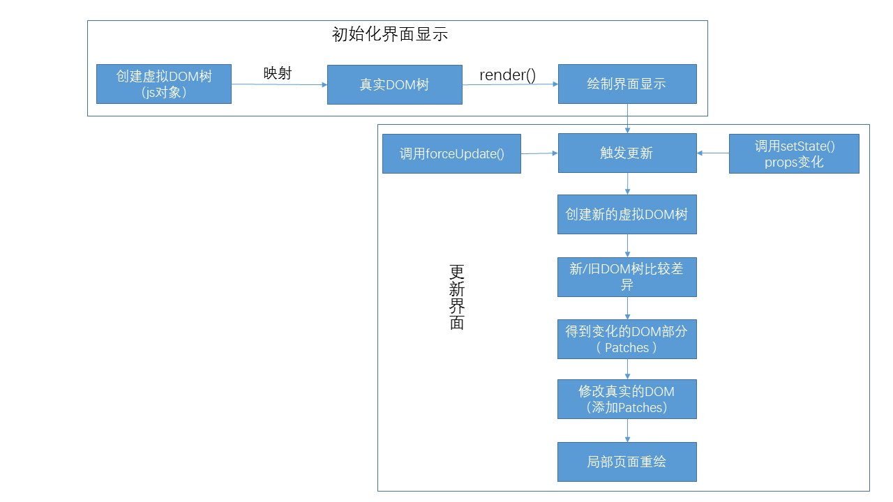
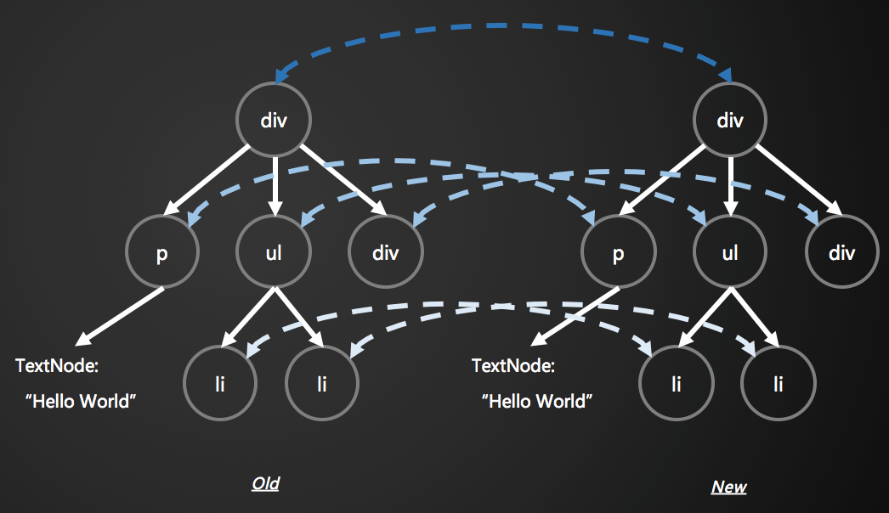
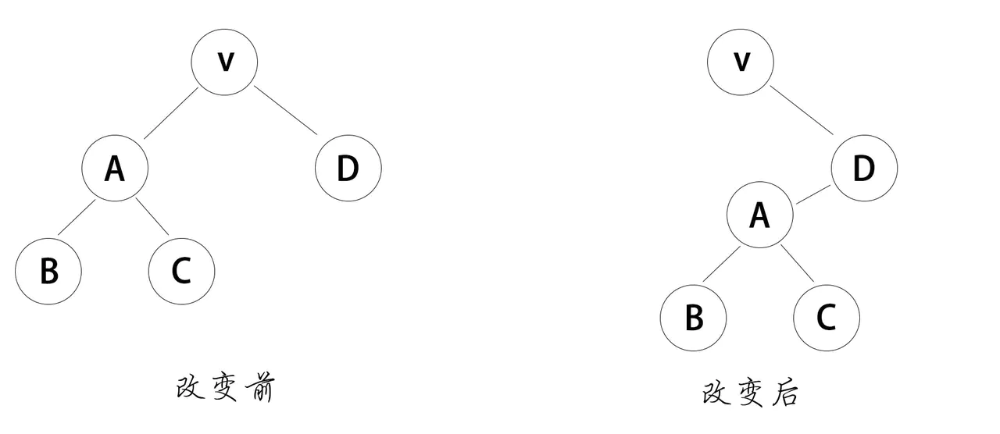
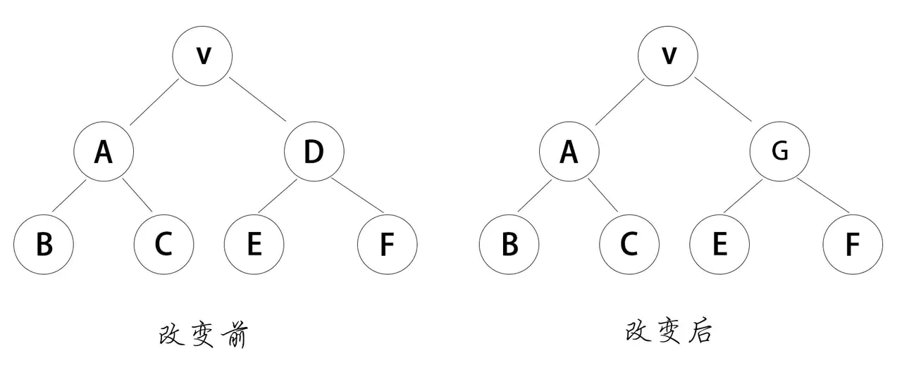

<!-- START doctoc generated TOC please keep comment here to allow auto update -->
<!-- DON'T EDIT THIS SECTION, INSTEAD RE-RUN doctoc TO UPDATE -->
**Table of Contents**  *generated with [DocToc](https://github.com/thlorenz/doctoc)*

- [虚拟 DOM](#%E8%99%9A%E6%8B%9F-dom)
  - [1. 参考资料](#1-%E5%8F%82%E8%80%83%E8%B5%84%E6%96%99)
  - [2. 虚拟 DOM](#2-%E8%99%9A%E6%8B%9F-dom)
  - [3. 比较两棵虚拟DOM树的差异 - diff 算法](#3-%E6%AF%94%E8%BE%83%E4%B8%A4%E6%A3%B5%E8%99%9A%E6%8B%9Fdom%E6%A0%91%E7%9A%84%E5%B7%AE%E5%BC%82---diff-%E7%AE%97%E6%B3%95)
    - [1. 基本前提](#1-%E5%9F%BA%E6%9C%AC%E5%89%8D%E6%8F%90)
    - [2. diff 算法](#2-diff-%E7%AE%97%E6%B3%95)
      - [1. tree diff](#1-tree-diff)
      - [2. component diff](#2-component-diff)
      - [3. element diff](#3-element-diff)
      - [4. 对真实的 DOM 进行最小化的修改](#4-%E5%AF%B9%E7%9C%9F%E5%AE%9E%E7%9A%84-dom-%E8%BF%9B%E8%A1%8C%E6%9C%80%E5%B0%8F%E5%8C%96%E7%9A%84%E4%BF%AE%E6%94%B9)
      - [5. key 作用](#5-key-%E4%BD%9C%E7%94%A8)

<!-- END doctoc generated TOC please keep comment here to allow auto update -->

# 虚拟 DOM

## 1. 参考资料

1. [知乎 - 如何理解虚拟DOM？](https://www.zhihu.com/question/29504639) 
2. [深度剖析：如何实现一个 Virtual DOM 算法](https://github.com/livoras/blog/issues/13) 
3. [理解 Virtual DOM](https://github.com/y8n/blog/issues/5) 
4. [深入浅出React（四）：虚拟DOM Diff算法解析](http://www.infoq.com/cn/articles/react-dom-diff) 
5. [全面理解虚拟DOM，实现虚拟DOM](https://foio.github.io/virtual-dom/) 
6. [50行代码实现Virtual DOM](http://www.jianshu.com/p/cbb7d7094fb9) 
7. [网上都说操作真实 DOM 慢，但测试结果却比 React 更快，为什么？](https://www.zhihu.com/question/31809713) 
8. [react官网对虚拟DOM的解释](https://reactjs.org/docs/faq-internals.html)

9. [谈谈React虚拟DOM和diff算法](https://juejin.cn/post/6844903856690724872)

10. [【React深入】深入分析虚拟DOM的渲染原理和特性](https://juejin.cn/post/6844903824683958286)

11. [让虚拟DOM和DOM-diff不再成为你的绊脚石](https://juejin.cn/post/6844903806132568072)


## 2. 虚拟 DOM

1. 虚拟 DOM 树
   - > 虚拟 DOM 是一个概念，表示保存在内存中的 UI，而且通过像 ReactDOM 这样的库来保持与真实的 DOM 同步，这个过程叫做 reconciliation。
   - 上面是官网对虚拟DOM的解释。
   - 我个人的理解：
     首先，真实的 DOM 的属性非常多，非常复杂。如果我们直接操作真实的 DOM，在现有的 API 的情况下，速度比较慢。尤其是一个比较大型的应用需要频繁操作 DOM 的场景下，频繁操作 DOM 会严重影响性能。而且我们只需要真实的 DOM 中的一部分属性。
     其次，虚拟 DOM 并不是真实的 DOM。而是 React 使用 JavaScript 对象表示 DOM 节点。这个 js 对象只实现一部分真实的 DOM 的属性和
     节点之间的层次关系，它相当于建立在JavaScript 和 DOM 之间的一层“缓存”。
     基于 JavaScript 语言特性，这样生成的代表 DOM 节点的 js 对象的速度非常快。因此，我们就可以很简单的使用 JavaScript 来表示 DOM 结构。这就是所谓的虚拟 DOM。
     最后，我们可以根据虚拟 DOM 树构造出真实的 DOM 树。最后调用虚拟 DOM 对象原型的 render() 方法，就可以得到一个真实的 DOM 树。
   - 现在我们使用了 js 对象表示 DOM，当数据发生变化的需要改变 DOM 结构的时候，我们可以通过 js 对象表示的虚拟 DOM 计算出实际的 DOM 需要作出的最小的改动。然后将这个改动映射到真实的 DOM 树上。从而避免了粗放式操作 DOM 带来的性能问题。

2. 虚拟 DOM 举例：
   - html 结构：
     ```html
        <ul id='list'>
            <li class='item'>1</li>
            <li class='item'>2</li>
            <li class='item'>3</li>
        </ul>
     ```
   - js 对象表示：
     ```js
        const tree = {
            // 节点标签名
            tagName: 'ul', 
            // DOM 的属性，用一个对象存储键值对
            props: {       
                id: 'list'
            },
            // 该节点的子节点
            children: [    
                {tagName: 'li', props: {class: 'item'}, children: ['1']},
                {tagName: 'li', props: {class: 'item'}, children: ['2']},
                {tagName: 'li', props: {class: 'item'}, children: ['3']},
            ]
        }

     ``` 

3. 总结：
   - 虚拟DOM就是一个 JavaScript 对象，包含了真实 DOM 的一部分属性和节点之间的层次关系。可以依据其构造出真实的 DOM 树，最后调用 render() 方法渲染出真实的 DOM 树。
4. 虚拟 DOM 更新流程：
   

## 3. 比较两棵虚拟DOM树的差异 - diff 算法


### 1. 基本前提 

1. 当我们需要更新视图或是数据发生变化需要重新渲染的时候，React 首先根据新的数据生成一个新的虚拟 DOM 树，然后比较新旧两棵虚拟 DOM 树，从而得到变化的 DOM 部分，变化的部分称为 patch（补丁）。最后修改真实的 DOM 树。将这个 patch 添加到 DOM 树上。
如何高效地比较两棵 DOM 树的差异并记录这种差异，就是 diff 算法所要解决的问题。

2. 如何比较两棵DOM树
   计算两棵树之间差异的常规算法复杂度为O(n3)，一个文档的 DOM 结构有上百个节点是很正常的情况，这种复杂度无法应用于实际项目。针对前端的具体情况：React 团队做出了两个假设：
   - 两个不同类型的元素会产生出不同的树；
   - 开发者可以通过 key prop 来暗示哪些子元素在不同的渲染下能保持稳定；

3. 基于这两个假设，React 成功地将 diff 算法地时间复杂度降低到 o(n)。

4. 实际上我们很少跨级别地修改 DOM 节点，通常是修改节点的属性、调整子节点的顺序、添加子节点等。

5. 基于以上，React 分别对 tree diff（DOM 树差异）、component diff（组件差异）以及 element diff （元素差异） 进行了算法优化。

### 2. diff 算法

#### 1. tree diff
1. 由于我们很少跨级别修改 DOM 节点，所以 React 只对同一级别地节点进行比较，对同级别节点进行比较的常用方法是深度优先遍历。如下图所示：


2. 当发现节点不存在时，就会删除整个节点及其子节点，不会再进行比较，这样就只需要遍历一次，就能完成对整个 DOM 树的比较。

3. React 只会简单的考虑同层级节点的位置变换，对于不同层级的节点，只有创建和删除操作。如果 A 节点整个被移动到 D 节点下，根节点发现子节点中 A 不见了，就会销毁 A；然后 D 发现自己多了一个子节点，就会创建新的子节点（包含其中属于自己的子节点）作为其子节点。react diff 就会按照这样的次序执行：`craete a -> create b -> create c -> delete a`。这种跨层级的节点移动，并不会出现移动的情况，而是会有创建、删除这些操作。这种操作会影响到 React 的性能，所以 React 官方也并不建议进行这种操作。在开发组件时，保持稳定的 DOM 结构会有助于性能的提升。


#### 2. component diff

1. React 对于组件间的比较采取的策略也是简洁高效。

2. 如果是同一类型的组件，按照原策略继续比较虚拟 DOM 树。如果不是，则将该组件判断为dirty component，从而替换整个组件下的所有子节点。

3. 对于同一类型的组件，有可能其虚拟 DOM 没有任何变化，如果能够确切的知道这点那可以节省大量的 diff 运算的时间，因此 React 允许用户通过 shouldComponentUpdate() 判断该组件是否需要进行diff。

4. 例如，当下图中 componentD 改变为 componentG 时，即使这两个 compoent 结构很相似，但是 react 会判断 D 和 G 并不是同类型组件，也就不会比较二者的结构了，而是直接删除了D，重新创建 G 及其子节点，这个时候会影响 React 的性能。
   

#### 3. element diff

1. element 之间存在的差异：
   - 节点属性
   - 修改节点文本内容
   - 替换原有节点

2. 当节点处于同一层级时，React diff 提供了三种节点操作：插入、移动和删除
   - 插入：新的 component 类型不在老集合里 -> 全新的节点，需要对新节点执行插入操作
   - 移动：在老集合里有新 component 类型，且 element 是可更新的类型，generateComponentChildren 已调用 receiveComponent，这种情况下prevChild = nextChild，就需要做移动操作，可以复用以前的 DOM 节点
   - 删除：老的 component 类型，在新集合中也有，但对应的 element 不同则不能直接复用和更新，需要执行删除操作，或者老component 不在新集合里，也需要执行删除操作。

3. 举例：
   在子元素列表末尾新增元素时，更变开销比较小。比如：
     ```jsx
        <ul>
            <li>first</li>
            <li>second</li>
        </ul>
        <ul>
            <li>first</li>
            <li>second</li>
            <li>third</li>
        </ul>
     ```
     通过比较，前两个元素不存在差异，只需要在末尾插入一个 `<li>third</li>`。
     如果简单实现的话，在列表头部插入会很影响性能，比如：
     ```jsx
        <ul>
            <li>Duke</li>
            <li>Villanova</li>
        </ul>

         <ul>
             <li>Connecticut</li>
             <li>Duke</li>
             <li>Villanova</li>
        </ul>
     ```
     根据之前提到的算法规则，`<li>Duke</li>` 和 `<li>Villanova</li>` 是不能被保留的，都会被看做差异部分，这样的变更开销会比较大。

#### 4. 对真实的 DOM 进行最小化的修改

1. 通过虚拟 DOM 计算出两棵 DOM 树的差异后，我们就可以修改真实的 DOM结构了。前面通过深度优先遍历过程产生了用于记录两个树之间差异的数据结构 patches。通过 patches 我们可以方便的对真实的 DOM 作出最小化的修改。


#### 5. key 作用

1. React 支持 key 属性。当子元素拥有 key 时，React 使用 key 来匹配原有 DOM  树上的子元素以及最新树上的子元素。以下例子在新增 key 之后使得之前的低效转换变得高效：
   ```jsx
        <ul>
           <li key="2015">Duke</li>
           <li key="2016">Villanova</li>
        </ul>

         <ul>
             <li key="2014">Connecticut</li>
             <li key="2015">Duke</li>
             <li key="2016">Villanova</li>
         </ul> 
   ```
2. React 通过比较得知，key 为 '2014'的元素是新增的，key为'2015'和 '2016' 的元素仅仅是移动了位置，所以可以调用 insertBefore() 来插入节点。

3. 生成key的注意点：
   - key在列表中应当具有唯一性，但不需要全局唯一。
   - key 应当具有稳定性，一个节点在确定key 之后就不应当变更 key（除非你希望它重新渲染）。不稳定的 key（比如在 render() 中通过 Math.random() 生成的 ）会导致许多组件实例和 DOM 节点被不必要地重新创建，这可能导致性能下降和子组件中的状态丢失。
   - 可以使用元素在数组中的下标作为 key。这个策略在元素不进行重新排序时比较合适，但一旦有顺序修改，diff 就会变得慢。

4. 当基于下标的组件进行重新排序时，组件 state 可能会遇到一些问题。由于组件实例是基于它们的 key 来决定是否更新以及复用，如果 key 是一个下标，那么修改顺序时会修改当前的 key，导致非受控组件的 state（比如输入框）可能相互篡改导致无法预期的变动。

   


