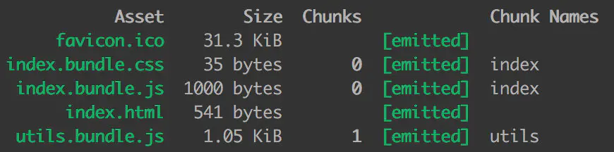
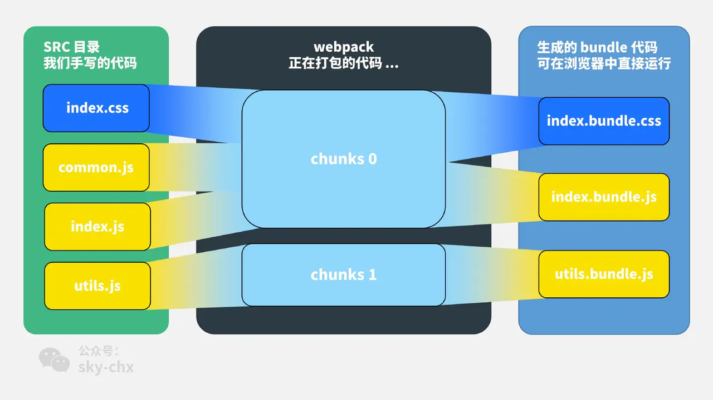
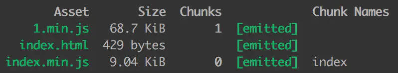
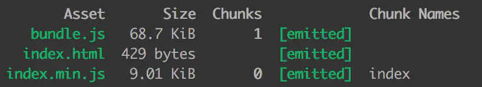

<!-- START doctoc generated TOC please keep comment here to allow auto update -->
<!-- DON'T EDIT THIS SECTION, INSTEAD RE-RUN doctoc TO UPDATE -->
**Table of Contents**  *generated with [DocToc](https://github.com/thlorenz/doctoc)*

- [Webpack 中的常见术语](#webpack-%E4%B8%AD%E7%9A%84%E5%B8%B8%E8%A7%81%E6%9C%AF%E8%AF%AD)
  - [1. 参考资料](#1-%E5%8F%82%E8%80%83%E8%B5%84%E6%96%99)
  - [2. module](#2-module)
  - [3. chunk 与 bundle](#3-chunk-%E4%B8%8E-bundle)
  - [4. filename 与 chunkFilename](#4-filename-%E4%B8%8E-chunkfilename)
  - [5. webpackPrefetch、webpackPreload 和 webpackChunkName](#5-webpackprefetchwebpackpreload-%E5%92%8C-webpackchunkname)

<!-- END doctoc generated TOC please keep comment here to allow auto update -->

# Webpack 中的常见术语

## 1. 参考资料
1. [webpack 中那些最易混淆的 5 个知识点](https://juejin.cn/post/6844904007362674701)
2. [Webpack 理解 Chunk](https://juejin.cn/post/6844903889393680392)
3. [webpack中的chunk 和 bundle 有什么区别 ？](https://segmentfault.com/q/1010000013733492)
4. [在webpack中，module、chunk和bundle到底是什么样的存在？](https://zhuanlan.zhihu.com/p/98677441)

5. webpack 术语解释：[Glossary](https://webpack.js.org/glossary/)

## 2. module

1. module 指的是我们项目中的资源，包括 js、css、html、图片等。我们项目中的任何资源，都会被 webpack 当作一个一个的模块。因此我们需要在配置文件中配置 `module` 字段，举例如下：
   ```js
      module.exports = {
          module: {
              rules: [
                  // 使用 ts-loader 打包 ts 和 tsx 文件
                  // 相比较 babel，配置更加简单
                  {
                      test: /\.tsx?$/,
                      use: 'ts-loader',
                      exclude: /node_modules/
                  },
                  {
                      test: /\.css$/,
                      use: [MiniCssExtractPlugin.loader, 'css-loader'],
                  },
                  // 对 scss 文件进行打包
                  {
                      test: /\.(scss|sass)$/,
                      use: [
                          // 'style-loader',
                          // MiniCssExtractPlugin.loader,
                          {
                              loader: MiniCssExtractPlugin.loader,
                              options: {
                                  publicPath: '../'
                              }
                          },
                          'css-loader',
                          'sass-loader'
                      ],
                      exclude: /node_modules/
                   },

                  // 使用 url-loader 打包图片的资源文件
                  {
                      test: /\.(png|jpg|jpeg|gif)$/,
                      use: {
                          loader: 'file-loader',
                          options: {
                              name: '[name]_[hash].[ext]',
                              outputPath: './images',
                          }
                      },
                      exclude: /node_module/
                  }
                    ]
                }
            }
   ```

2. 我们在项目中使用了哪些模块，就需要配置对应模块的 loader。

## 3. chunk 与 bundle

1. 假设 src 目录结构如下（这个示例来自于：[webpack 中那些最易混淆的 5 个知识点](https://juejin.cn/post/6844904007362674701)）：
   ```bash
      src/
         ├── index.css
         ├── index.html # 这个是 HTML 模板代码
         ├── index.js
         ├── common.js
         └── utils.js
   ```
2. 这里只展示 index.js 中的内容，其他文件的内容省略：
   ```js
      // index.js
      import './index.css';

      const common = require('./common.js');
   ```
2. webpack 配置如下：
   ```js
      module.exports = {
          entry: {
              index: "../src/index.js",
              utils: '../src/utils.js',
          },
          output: {
              filename: "[name].bundle.js", 
          },
          module: {
              rules: [
                  {
                      test: /\.css$/,
                      use: [
                          MiniCssExtractPlugin.loader, 
                          'css-loader',
                      ],
                  },
              ]
          }
          plugins: [
              new MiniCssExtractPlugin({
                  filename: 'index.bundle.css' 
              }),
          ]
      }
   ```
   设置两个入口文件，与之对应，也应该有两个出口的 js 文件，因此 `output` 字段的 filename 的 配置为 `[name].bundle.js`。

4. 执行打包命令，打包过程如下所示：
   

5. Asset 是我们打包出来的文件。index.js 中引入了 common.js 和 index.css。从上图中可以看出，打包生成的 index.bundle.css 和 index.bundle.js 都属于 chunks 0，因此在设置了两个打包入口文件，所以 utils.js 数以单独打包，因此 utils.bundle.js 属于 chunks 1。

6. 用一张图解释上面的关系：
   

7. 从图中我们可以看出：
   - 我们项目中的资源，无论是 js、css 还是其他类型的文件，就是 module。
   - chunk 文件是 webpack 在打包过程中的一些 module 的集合。webpack 的打包过程是，从入口文件开始，根据文件之间的引用关系逐个打包文件，在打包过程中，这些 module 形成了 chunk。webpack 会对这个 chunk 文件进行一些操作。
   - 如果我们有多个入口文件，可能会产出多条打包路径，一条路径就会形成一个chunk。
   - bundle 就是 webpack 最后打包出来的文件。webpack 处理好 chunk 文件后，就会输出 bundle 文件，这个 bundle 文件包含了经过加载和编译的最终源文件，所以它可以直接在浏览器中运行。

8. 一般来说，一个 chunk 对应一个 bundle 文件。但是不是绝对的。比如我们使用了 `MiniCssExtractPlugin` 这个插件，将 css 文件单独提取出来，因此 chunks 0 对应了两个 bundle 文件。


## 4. filename 与 chunkFilename

1. filename 实际上就是对应于 entry 里面的输入文件，经过 webpack 打包后输出文件的文件名。举例如下:
   ```js
      module.exports = {
          entry: './src/index.js',
          output: {
              filename: '[name].bundle.js', // index.bundle.js
          }
      }
   ```
   入口文件被打包为 `index.bundle.js` 文件。

2. chunkFilename 指未被列在 entry 中，却又需要被打包出来的 chunk 文件的名称。一般来说，这个 chunk 文件指的就是要懒加载的代码。

3. 举个例子，创建一份懒加载 lodash 的代码：
   ```js
      // 文件：index.js

      // 创建一个 button
      const button = document.createElement('button');
      button.innerHTML = 'click';
      document.body.appendChild(button);

      // 异步加载代码
      async function getAsyncComponent() {
          const ele = document.createElement('div');
          const { default: _ } = await import('lodash');

          ele.innerHTML = _.join(['Hello!', 'dynamic', 'imports', 'async'], ' ');

          return ele;
      }

      // 点击 button 时，懒加载 lodash，在网页上显示 Hello! dynamic imports async
      button.addEventListener('click', () => {
          getAsyncComponent().then(component => {
              document.body.appendChild(component);
          })
      })
   ```
   webpack 配置：
   ```js
      module.exports = {
          entry: {
              index: "../src/index.js"
          },
          output: {
              filename: "[name].min.js", // index.min.js
          }
      }
   ```
   打包结果：
   

   `1.min.js` 就是异步加载的 chunk 文件。官网是这样解释的：
   > `output.chunkFilename` 默认使用 `[id].js` 或从 `output.filename` 中推断出的值（[name] 会被预先替换为 [id] 或 [id].）

   过程就是：`output.filename` 的输出文件名是 `[name].min.js`，`[name]` 根据 `entry` 的配置推断为 `index`，所以输出为 `index.min.js`；
   由于 `output.chunkFilename` 没有显示指定，就会把 `[name]` 替换为 `chunk` 文件的 `id` 号，这里文件的 `id` 号是 1，所以文件名就是 `1.min.js`。
   如果我们显式配置 `chunkFilename`，就会按配置的名字生成文件：
   ```js
      module.exports =  {
          entry: {
              index: "../src/index.js"
          },
          output: {
              filename: "[name].min.js",  // index.min.js
              chunkFilename: 'bundle.js', // bundle.js
         }
      }
   ```
   打包结果：
   


4. 总结：
   - `filename` 指列在 `entry` 中，打包后输出的文件的名称。

   - `chunkFilename` 指未列在 `entry` 中，却又需要被打包出来的文件的名称。

## 5. webpackPrefetch、webpackPreload 和 webpackChunkName

1. `webpackPrefetch`、`webpackPreload` 和 `webpackChunkName` 实际上是 magic comment 的配置项。

2. magic comment 实际上是用来配动态导入的，也就是使用块级注释：`/**/` 设置配置项

3. 在导入的模块前面添加 magic comment，然后配置项就会生效。
   ```js
      function getComponent() {
          return import(/*webpackChunkName:"lodash"*/ 'lodash').then(({default: _}) => {
              const element = document.createElement('div');
              element.innerHTML = _.join([1, 2, 3, 4, 5], '*');
              return element;
          })
      }
   ```
4. `webpackChunkName`
   - 将打包后的 chunk 文件取别名，实现动态化配置。

5. `webpackPrefetch` 和 `webpackPreload` 这两个配置项已有说明，这里不再详述。