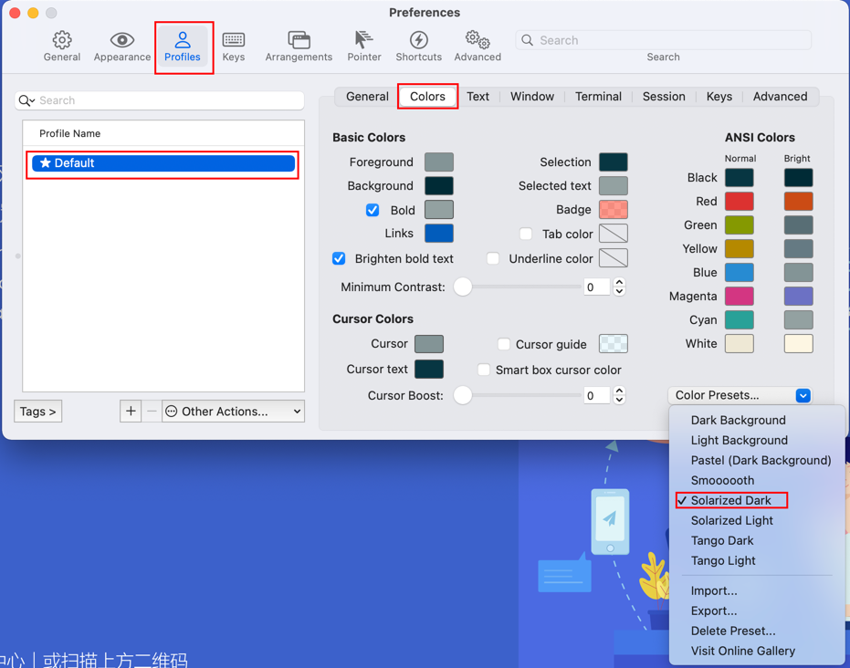
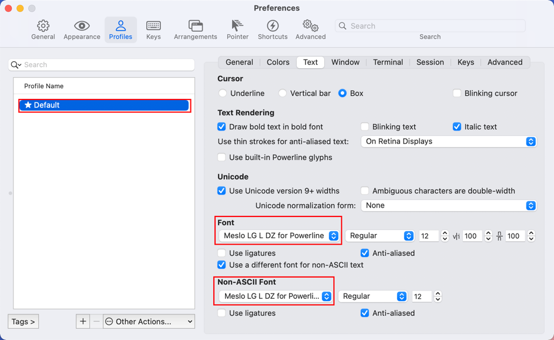
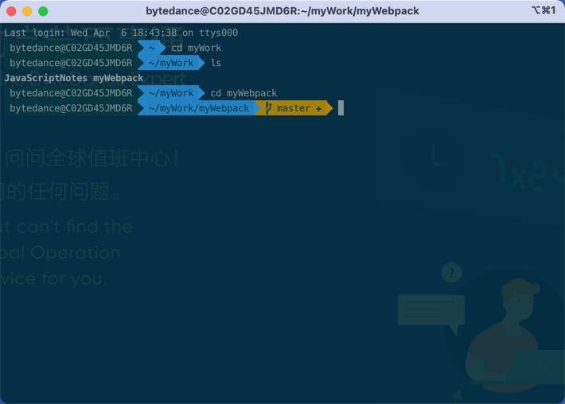

# iterm2 修改主题

## 1. 参考资料

1. [iTerm2 主题设置 - 博客园](https://www.cnblogs.com/poterliu/p/14825232.html)

2. [iTerm2 主题设置 - 语雀](https://www.yuque.com/ace0503/svqry1/ny150bl)

3. [oh-my-zsh 官网](https://ohmyz.sh/)

4. [iterm2 官网](https://iterm2.com/index.html)

## 2. 安装 iterm2

1. 直接从官网下载安装包安装即可。

## 3. 修改主题

### 1. 修改 iterm2 本身的主题

1. 在 iterm2 中找到 preference 中，按照下图进行配置：
   

2. 这样配置的是不同的颜色主题。

### 1. 安装 oh-my-zsh 

1. oh-my-zsh 是一个开源的、社区驱动的用来管理 zsh 配置的框架。提供了很多有用的函数、帮助、插件、主题等。

2. 安装方式：
   - curl：`sh -c "$(curl -fsSL https://raw.githubusercontent.com/ohmyzsh/ohmyzsh/master/tools/install.sh)"`
   - wget：`sh -c "$(wget -O- https://raw.githubusercontent.com/ohmyzsh/ohmyzsh/master/tools/install.sh)"`

3. 修改 `.zshrc` 这个配置文件，将 `ZSH_THEME="robbyrussell"` 为 `ZSH_THEME="agnoster"`。

4. 执行 `source ~/.zshrc` 这个命令。

5. 然后重新打开 iterm2。

### 2. 下载 powerline 字体

1. 执行下面的命令
   ```shell
      cd ~
      mkdir powerfont
      cd powerfont
      git clone https://github.com/powerline/fonts.git --depth=1
      cd fonts
      # 执行脚本
      ./install.sh
   ```
2. 然后去 iterm2 的 preference 中去选择字体，如下图所示：
   

3. 然后重启 iterm2，就完成了主题和字体的配置。如下图所示：
   

## 4. 常见问题

### 1. 网络不通畅，获取不到 githubusercontent 上的内容

1. 这种情况下，可手工下载仓库中的内容，并复制到用户根目录中，在重复上述操作即可。
   ```shell
      # 从git上把oh-my-zsh clone下来到根目录下
      git clone git://github.com/robbyrussell/oh-my-zsh.git ~/.oh-my-zsh
      # 再在根目录下copy一份.zshrc配置
      cp ~/.oh-my-zsh/templates/zshrc.zsh-template ~/.zshrc
   ```
