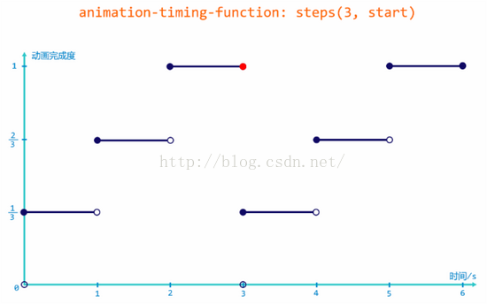
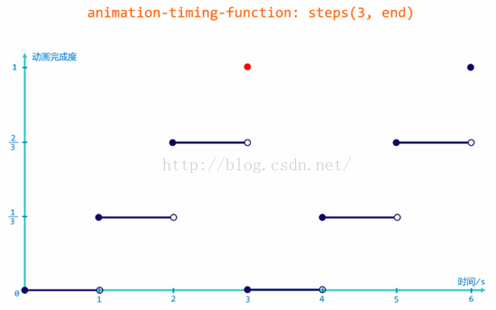

### 1. 声明一个动画  
1. 使用@keyframes关键字声明一个动画。例如`@keyframes move {}`。move是动画的名称。大括号内部是定义的关键帧内容。
2. css3动画我们只需要定义关键帧就可以，关键帧之间的内容是使用插值函数帮助我们计算好的。不用我们去关心。关键帧使用百分数定义。
3. 下面声明了一个css3动画：
   ```css
      @keyframes move {
          0% {
            width: 0px;
          }
          
          100% {
            width: 100px;
          }
      }
   ```
4. 动画序列
   - 0%是动画开始，100%是动画结束。这样的规则就是动画序列。
   - 在`@keyframes`中规定了某项css样式，就是能够创建由当前样式逐渐改变为新样式的动画效果。
   - 动画是使元素从一种样式逐渐变为另外一种样式的效果，可以改变任意多的样式，任意多的次数。
   - 使用百分比来规定变化的时间，或使用关键词from或to，等同于0%和100%。
### 2. 使用一个动画
1. 我们要将定义好的动画应用到一个元素上。具体而言，就是在某一个元素的选择器内使用这个动画。用法如下：  
   ```css
      selector {
          /*调用动画*/
          animation-name: 动画名称;
          /*持续时间*/
          animation-duration: 持续时间;
      }
   ```
2. 给div使用我们之前声明的名称为move的动画：
   ```css
      div {
        animation-name: move;
        animation-duration: 0.8s;
      }
   ```
### 3. 动画常用属性
属性|说明
:---:|:---:
@keyframes|声明一个动画
animation|所有动画的简写属性，除了animation-play-state属性
animation-name|规定@keyframes动画名称（必须）
animation-duration|规定动画完成一个周期所花费的秒或毫秒，默认为0（必须）
animation-timing-function|规定动画的速度曲线，默认是ease
animation-delay|规定动画何时开始，默认是0
animation-iteration-count|规定动画播放的次数，默认是1，还有infinity（无限）
animation-direction|规定动画是否在每一次播放或者指定播放过程中反方向播放，默认是normal，即正常方向。reverse表示反方向播放。而alternate表示奇数次播放正常方向，偶数次播放反方向。
animation-play-state|规定动画是否正在运行或者暂停，默认是running，还有paused
animation-fill-mode|规定动画结束后的状态，保持当前状态：forwards，回到起点：backwards。

### 4. 动画的简写属性
1. 使用animation属性表示动画的简写属性。
2. 属性的顺序是：
   ```css
      animation: name duration timing-function delay iteration-count direction fill-mode;
   ```
3. 使用简写属性，给div元素添加动画：
   ```css
      div {
        animation: move 0.8s ease 0.2s infinite normal forwards;
      }
   ```
4. 注意：
   - 简写属性不包括`animation-play-state`。
   - 暂停动画`animation-play-state: paused;`经常和鼠标经过等其他操作配合使用。
   - 盒子动画结束以后，停在盒子的位置：`animation-fill-mode: forwards`。
### 4. 动画的速度曲线
1. animation-timing-function，规定了动画的速度曲线。默认是ease。可选的值如下表所示：

   属性值|说明
   :---:|:---:
   linear|匀速
   ease| 默认值，动画以低速开始，然后加快，在结束前变慢
   ease-in|动画以低速开始
   ease-out|动画以低速结束
   ease-in-out|动画以低速开始和结束
   cubic-bezier(n,n,n,n)|在 cubic-bezier 函数中自己的值。可能的值是从 0 到 1 的数值
   steps()|指定了2019年11月8日13:58:50函数中间隔的数量（步长）

2. 如果我们想精确控制动画的速度，可以使用cubic-bezier(n,n,n,n)，设置四个点值，实现不同的曲线，进而实现对动画的精确控制。

### 5. steps()的理解与应用
1. steps()y用于把整个操作领域划分成同样大小的间隔，每个间隔是相等的。
2. 接收两个参数：
   - 第一个参数指定了时间函数中间隔数量（必须是正整数）
   - 第二个参数可选，可以是start或者end。指定每个间隔的起点或者终点发生的阶跃变化，默认是end。
3. 定义曲线，则动画帧与帧之间会流畅的进行，而定义steps()，表示直接跳跃进行，动画直接从一帧切换到另外一帧。
4. steps()第一个参数，意思是两个关键帧之间的切换，分n步进行。
5. 第二个参数，实际上指的是，每个计时周期内，是起点跳跃还是终点跳跃。
6. 举例说明steps()第二个参数的作用：
   - 定义一个动画：
   ```css
      #demo {
         animation-iteration-count: 2;
         animation-duration: 3s;
      }
   ```
   - 动画循环2次，持续时间为3s。
   - timing-function设置为：steps(3, start)
   - 每个动画周期分三步进行，对时间进行划分：0-1,1-2,2-3/3-4,4-5,5-6
   - start表示起点跳跃，则跳跃的时间点为0,1,2,3,4,5
   - 用一张图说明：
     
   图片来源：[CSS3 timing-function: steps() 详解](https://blog.csdn.net/baidu_35007727/article/details/51814790)
   - steps() 第一个参数将动画分割成三段。当指定跃点为 start 时，动画在每个计时周期的起点发生阶跃（即图中 空心圆 → 实心圆 ）。 由于第一次阶跃发生在第一个计时周期的起点处（0s），所以我们看到的第一步动画（初态）就为 1/3 的状态，因此在视觉上动画的过程为 1/3 → 2/3 → 1 。即我们看不到状态为0%的动画。
   - timing-function: steps(3, end) ;
   - 每个动画周期分三步进行，对时间进行划分：0-1,1-2,2-3/3-4,4-5,5-6
    - end表示终点跳跃，则跳跃的时间点为1,2,3,4,5,6
    - 用一张图说明：
      
    图片来源：[CSS3 timing-function: steps() 详解](https://blog.csdn.net/baidu_35007727/article/details/51814790)
    - 当指定跃点为 end，动画则在每个计时周期的终点发生阶跃（即图中 空心圆 → 实心圆 ）。 由于第一次阶跃发生在第一个计时周期结束时（1s），所以我们看到的初态为 0% 的状态；而在整个动画周期完成处（3s），虽然发生阶跃跳到了 100% 的状态，但同时动画结束，所以 100% 的状态不可视。因此在视觉上动画的过程为 0 → 1/3 → 2/3。看不到100%状态的动画。
### 7. 理解steps()第二个参数的关键
1. steps(n)，不仅将事件分隔为n份，也将动画的完成度分隔为n份。所谓的阶跃，指的是动画完成度的阶跃。
2. 以steps(3, start)为例，动画持续时间为3s。
   - 时间段划分为：0-1,1-2,2-3
   - 动画完成度划分为：0,1/3,2/3,1
   - 因为start是计时周期起点发生阶跃。
   - 0-1，起点是0s，动画完成度是0，发生阶跃，由0跳到了1/3。所以0-1时间段内，动画完成度是1/3。
   - 同理，1-2，在1s处发生阶跃，有1/3跳到2/3，所以1-2时间段内，动画完成度是2/3。
   - 2-3，在2s处发生阶跃，有2/3跳到1，所以2-3时间段内，动画完成度是1。
   - 所以，start状态下，看不到0状态的动画。
3. steps(3, end)，动画持续时间为3s的情况下：
   - 时间段划分为：0-1,1-2,2-3
   - 动画完成度划分为：0,1/3,2/3,1
   - 因为end是计时周期终点发生阶跃。
   - 0-1，终点是1s，动画完成度是0，发生阶跃，由0跳到了1/3。所以0-1时间段内，动画完成度是0。
   - 同理，1-2，在2s处发生阶跃，有1/3跳到2/3，所以1-2时间段内，动画完成度是1/3。
   - 2-3，在3s处发生阶跃，有2/3跳到1，所以2-3时间段内，动画完成度是2/3。
   - **注意**，在3s处发生了阶跃，动画完成度有2/3跳到了1，但是此时动画已经结束了，所以我们看不到100%状态的动画。要看到100%状态动画，必须设置animation-fill-mode为forwards，使得动画保持在结束状态。